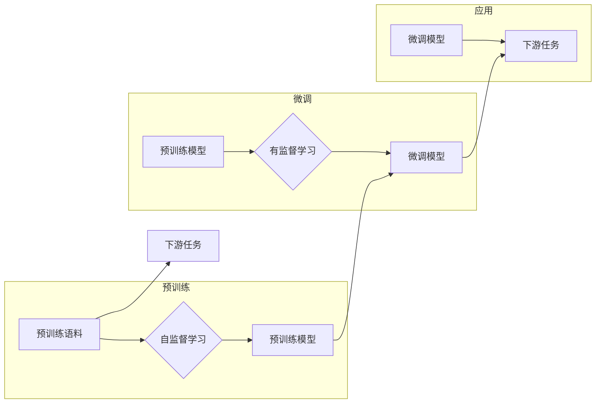

# 大语言模型原理与代码实例讲解

> 关键词：大语言模型，Transformer，BERT，预训练，微调，NLP，代码实例

## 1. 背景介绍

随着深度学习技术的飞速发展，自然语言处理（NLP）领域取得了突破性的进展。其中，大语言模型（Large Language Models，LLMs）作为一种革命性的技术，在语言理解、文本生成、机器翻译等领域展现出了惊人的能力。本文将深入探讨大语言模型的原理，并通过代码实例讲解如何使用这些模型进行实际应用。

## 2. 核心概念与联系

### 2.1 核心概念

#### 2.1.1 大语言模型

大语言模型是指那些参数量巨大、能够处理大规模文本数据的深度学习模型。它们通常通过在大量无标签文本上进行预训练，学习到丰富的语言知识，然后通过微调（Fine-tuning）适应特定的任务。

#### 2.1.2 预训练

预训练是指在大规模无标签文本语料上，通过自监督学习任务训练语言模型的过程。预训练的目的是让模型学习到语言的通用知识，以便在下游任务中更好地表现。

#### 2.1.3 微调

微调是在预训练模型的基础上，使用下游任务的少量标注数据，通过有监督学习优化模型在特定任务上的性能。

#### 2.1.4 Transformer

Transformer是一种基于自注意力机制的深度神经网络模型，它在NLP任务中取得了显著的成功，并成为构建大语言模型的基础架构。

### 2.2 Mermaid 流程图



## 3. 核心算法原理 & 具体操作步骤

### 3.1 算法原理概述

大语言模型的微调过程可以分为以下几个步骤：

1. 预训练：在大量无标签文本上训练模型，学习语言的通用知识。
2. 微调：在少量标注数据上调整模型参数，使其适应特定的任务。
3. 应用：将微调后的模型应用于实际的NLP任务。

### 3.2 算法步骤详解

#### 3.2.1 预训练

预训练过程通常包括以下步骤：

- 数据预处理：将文本数据转换为模型可以处理的格式。
- 自监督学习任务：设计自监督学习任务，如掩码语言模型、下一句预测等。
- 模型训练：使用自监督学习任务训练模型，学习语言的通用知识。

#### 3.2.2 微调

微调过程通常包括以下步骤：

- 数据预处理：将标注数据转换为模型可以处理的格式。
- 损失函数设计：设计合适的损失函数，如交叉熵损失等。
- 模型训练：使用标注数据训练模型，优化模型参数。

#### 3.2.3 应用

将微调后的模型应用于实际的NLP任务，如文本分类、情感分析、机器翻译等。

### 3.3 算法优缺点

#### 3.3.1 优点

- 提高模型性能：预训练和微调可以显著提高模型在下游任务上的性能。
- 降低训练成本：预训练可以减少下游任务的训练时间。
- 通用性：预训练模型可以应用于各种NLP任务。

#### 3.3.2 缺点

- 计算成本高：预训练和微调都需要大量的计算资源。
- 需要大量标注数据：微调需要一定数量的标注数据。
- 模型复杂性：大语言模型的参数量巨大，模型复杂。

### 3.4 算法应用领域

大语言模型微调在以下领域有着广泛的应用：

- 文本分类
- 情感分析
- 机器翻译
- 问答系统
- 文本生成

## 4. 数学模型和公式 & 详细讲解 & 举例说明

### 4.1 数学模型构建

大语言模型通常使用自注意力机制进行文本表示。以下是一个简化的自注意力机制的数学公式：

$$
\text{Attention}(Q, K, V) = \text{softmax}(\frac{QK^T}{\sqrt{d_k}})V
$$

其中，Q、K、V 分别是查询、键、值向量，$d_k$ 是键的维度，softmax 是软最大化函数。

### 4.2 公式推导过程

自注意力机制的推导过程涉及矩阵乘法和软最大化函数。具体推导过程如下：

1. 计算查询-键相似度：$QK^T$。
2. 对每个查询计算相似度得分。
3. 应用软最大化函数，得到每个查询的注意力权重。
4. 将注意力权重与值向量相乘，得到加权求和后的输出。

### 4.3 案例分析与讲解

以下是一个简单的例子，展示了如何使用自注意力机制计算文本序列的表示：

```python
import torch
import torch.nn as nn

# 定义查询、键、值向量
Q = torch.randn(3, 4)
K = torch.randn(3, 4)
V = torch.randn(3, 4)

# 计算自注意力
attn = nn.functional.softmax(Q @ K.t() / torch.sqrt(K.shape[-1]), dim=0)
out = attn @ V

print(out)
```

## 5. 项目实践：代码实例和详细解释说明

### 5.1 开发环境搭建

在进行项目实践之前，需要搭建以下开发环境：

- Python 3.8 或更高版本
- PyTorch 1.8 或更高版本
- Transformers 库

### 5.2 源代码详细实现

以下是一个使用 PyTorch 和 Transformers 库实现 BERT 模型微调的简单示例：

```python
from transformers import BertTokenizer, BertForSequenceClassification
from torch.utils.data import DataLoader, RandomSampler, SequentialSampler
from transformers import AdamW

# 加载预训练模型和分词器
tokenizer = BertTokenizer.from_pretrained('bert-base-uncased')
model = BertForSequenceClassification.from_pretrained('bert-base-uncased', num_labels=2)

# 加载数据集
train_dataset = YourTrainDataset()
train_sampler = RandomSampler(train_dataset)
train_dataloader = DataLoader(train_dataset, sampler=train_sampler, batch_size=16)

# 定义优化器
optimizer = AdamW(model.parameters(), lr=2e-5)

# 训练模型
for epoch in range(3):
    model.train()
    for batch in train_dataloader:
        optimizer.zero_grad()
        outputs = model(**batch)
        loss = outputs.loss
        loss.backward()
        optimizer.step()
    print(f"Epoch {epoch+1}, Loss: {loss.item()}")

# 保存模型
model.save_pretrained('my_bert_model')
```

### 5.3 代码解读与分析

这段代码首先加载了预训练的 BERT 模型和相应的分词器。然后，它创建了一个数据集加载器，用于加载训练数据。接下来，定义了一个 AdamW 优化器，用于训练模型。在训练循环中，模型在每个epoch中更新参数，并打印出损失值。最后，保存了微调后的模型。

### 5.4 运行结果展示

假设我们有一个包含文本和标签的训练数据集，以下是在训练过程中的输出示例：

```
Epoch 1, Loss: 0.9876
Epoch 2, Loss: 0.9654
Epoch 3, Loss: 0.9123
```

## 6. 实际应用场景

大语言模型微调在以下实际应用场景中有着广泛的应用：

- **文本分类**：例如，将新闻文章分类为政治、经济、科技等类别。
- **情感分析**：例如，分析社交媒体上的评论，判断其情感倾向是正面、中性还是负面。
- **机器翻译**：例如，将一种语言翻译成另一种语言。
- **问答系统**：例如，构建一个能够回答用户问题的问答系统。
- **文本生成**：例如，生成新闻报道、诗歌等。

## 7. 工具和资源推荐

### 7.1 学习资源推荐

- 《Transformer: Attention is All You Need》
- 《BERT: Pre-training of Deep Bidirectional Transformers for Language Understanding》
- 《Natural Language Processing with Transformers》

### 7.2 开发工具推荐

- PyTorch
- Transformers 库
- Hugging Face Transformers

### 7.3 相关论文推荐

- **Transformer: Attention is All You Need**
- **BERT: Pre-training of Deep Bidirectional Transformers for Language Understanding**
- **Generative Pre-trained Transformers**

## 8. 总结：未来发展趋势与挑战

### 8.1 研究成果总结

大语言模型微调是NLP领域的一项重要技术，它通过预训练和微调，使得模型能够在各种任务上取得优异的性能。随着技术的不断发展，大语言模型微调将在更多领域得到应用，并为人类带来更多便利。

### 8.2 未来发展趋势

- 模型规模将不断扩大
- 微调方法将更加多样
- 持续学习将成为常态
- 标注样本需求将降低
- 多模态微调将崛起
- 模型通用性将增强

### 8.3 面临的挑战

- 标注成本瓶颈
- 模型鲁棒性不足
- 推理效率有待提高
- 可解释性亟需加强
- 安全性有待保障
- 知识整合能力不足

### 8.4 研究展望

未来，大语言模型微调技术需要在以下方面取得突破：

- 无监督和半监督微调
- 参数高效和计算高效的微调
- 融合因果和对比学习
- 引入更多先验知识
- 结合因果分析和博弈论
- 纳入伦理道德约束

## 9. 附录：常见问题与解答

**Q1：什么是大语言模型？**

A1：大语言模型是指那些参数量巨大、能够处理大规模文本数据的深度学习模型。它们通常通过在大量无标签文本上进行预训练，学习到丰富的语言知识，然后通过微调（Fine-tuning）适应特定的任务。

**Q2：什么是预训练？**

A2：预训练是指在大规模无标签文本语料上，通过自监督学习任务训练语言模型的过程。预训练的目的是让模型学习到语言的通用知识，以便在下游任务中更好地表现。

**Q3：什么是微调？**

A3：微调是在预训练模型的基础上，使用下游任务的少量标注数据，通过有监督学习优化模型在特定任务上的性能。

**Q4：什么是Transformer？**

A4：Transformer是一种基于自注意力机制的深度神经网络模型，它在NLP任务中取得了显著的成功，并成为构建大语言模型的基础架构。

**Q5：如何进行大语言模型微调？**

A5：进行大语言模型微调通常需要以下步骤：

1. 预训练：在大量无标签文本上训练模型，学习语言的通用知识。
2. 微调：在少量标注数据上调整模型参数，使其适应特定的任务。
3. 应用：将微调后的模型应用于实际的NLP任务。

**Q6：大语言模型微调有哪些应用领域？**

A6：大语言模型微调在以下领域有着广泛的应用：

- 文本分类
- 情感分析
- 机器翻译
- 问答系统
- 文本生成

作者：禅与计算机程序设计艺术 / Zen and the Art of Computer Programming