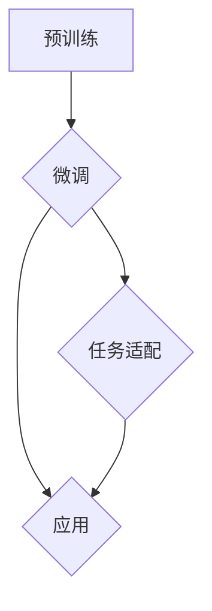
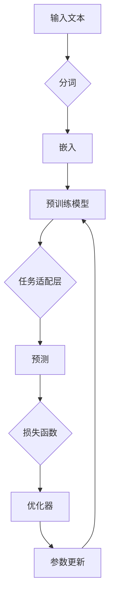

# 大语言模型原理与工程实践：未来的发展

> 关键词：大语言模型，预训练，微调，工程实践，未来趋势，挑战，应用场景

## 1. 背景介绍

近年来，随着深度学习技术的飞速发展，大语言模型（Large Language Models，LLMs）已经成为自然语言处理（Natural Language Processing，NLP）领域的研究热点。这些模型通过在庞大的语料库上进行预训练，学习到了丰富的语言知识和模式，并在各种下游任务中展现出惊人的能力。然而，从原理到工程实践，大语言模型的发展仍然面临着许多挑战和机遇。

## 2. 核心概念与联系

### 2.1 核心概念原理

大语言模型的核心概念可以概括为以下三个关键点：

1. **预训练**：预训练是指在大规模无标签语料库上训练模型，使其学习到通用的语言表示和知识。预训练模型通常采用自回归或自编码的方法，如BERT、GPT等。

2. **微调**：微调是指在使用少量标注数据对预训练模型进行进一步训练，以适应特定任务。微调过程通常只更新模型的部分参数，以避免过度拟合。

3. **任务适配**：任务适配是指在模型结构或训练过程中，针对特定任务进行优化，以提升模型在下游任务上的性能。

以下是大语言模型的核心概念原理的Mermaid流程图：



### 2.2 架构联系

大语言模型的架构通常包括以下几个部分：

1. **预训练模型**：如BERT、GPT等，负责学习通用语言表示。

2. **任务适配层**：根据具体任务进行设计，如分类器、解码器等。

3. **优化器**：如Adam、SGD等，用于更新模型参数。

4. **损失函数**：如交叉熵损失、均方误差等，用于衡量模型预测与真实值之间的差异。

5. **数据预处理**：包括文本分词、序列填充等。

大语言模型的架构联系可以用以下Mermaid流程图表示：



## 3. 核心算法原理 & 具体操作步骤

### 3.1 算法原理概述

大语言模型的核心算法原理可以概括为以下几点：

1. **预训练**：通过无监督学习任务（如掩码语言模型、下一句预测等）学习通用语言表示。

2. **微调**：通过有监督学习任务（如分类、序列标注等）学习特定任务的特定特征。

3. **任务适配**：根据具体任务调整模型结构、优化器、损失函数等。

### 3.2 算法步骤详解

1. **预训练**：在无标签语料库上，使用预训练任务（如BERT的掩码语言模型）训练模型。

2. **数据预处理**：对标注数据进行预处理，如文本分词、序列填充等。

3. **模型初始化**：使用预训练模型的参数初始化模型。

4. **任务适配**：根据具体任务，设计任务适配层，如分类器、解码器等。

5. **微调**：使用标注数据进行微调，更新模型参数。

6. **评估**：在验证集上评估模型性能，并根据需要调整模型结构、优化器、损失函数等。

### 3.3 算法优缺点

**优点**：

* 强大的语言理解和生成能力。
* 可应用于各种NLP下游任务。
* 参数高效，只需少量标注数据。

**缺点**：

* 对标注数据的依赖性较高。
* 模型可解释性较差。
* 模型训练和推理的资源消耗较大。

### 3.4 算法应用领域

大语言模型在以下领域得到广泛应用：

* 文本分类
* 命名实体识别
* 问答系统
* 机器翻译
* 文本摘要
* 对话系统

## 4. 数学模型和公式 & 详细讲解 & 举例说明

### 4.1 数学模型构建

大语言模型的数学模型可以概括为以下公式：

$$
L(\theta) = \frac{1}{N} \sum_{i=1}^N L(\theta, x_i, y_i)
$$

其中，$L(\theta, x_i, y_i)$ 表示模型在样本 $x_i$ 上的损失函数，$\theta$ 表示模型参数，$N$ 表示样本数量。

### 4.2 公式推导过程

以BERT的掩码语言模型为例，其损失函数为：

$$
L(\theta, x_i, y_i) = -\sum_{t=1}^L [\log P(y_{i,t}|x_{i,t};\theta) + \log P(M_{i,t}|x_{i,t};\theta)]
$$

其中，$y_{i,t}$ 表示真实单词，$M_{i,t}$ 表示预测的掩码单词，$L$ 表示序列长度。

### 4.3 案例分析与讲解

以下是一个简单的BERT文本分类任务的案例：

```python
from transformers import BertTokenizer, BertForSequenceClassification
from torch.utils.data import DataLoader, TensorDataset

# 加载预训练模型和分词器
tokenizer = BertTokenizer.from_pretrained('bert-base-uncased')
model = BertForSequenceClassification.from_pretrained('bert-base-uncased')

# 加载数据
train_texts = [...]  # 训练数据文本
train_labels = [...]  # 训练数据标签
dev_texts = [...]  # 验证数据文本
dev_labels = [...]  # 验证数据标签

# 数据预处理
train_encodings = tokenizer(train_texts, padding=True, truncation=True, return_tensors='pt')
dev_encodings = tokenizer(dev_texts, padding=True, truncation=True, return_tensors='pt')

# 创建数据集
train_dataset = TensorDataset(train_encodings['input_ids'], train_encodings['attention_mask'], train_labels)
dev_dataset = TensorDataset(dev_encodings['input_ids'], dev_encodings['attention_mask'], dev_labels)

# 创建数据加载器
train_loader = DataLoader(train_dataset, batch_size=32, shuffle=True)
dev_loader = DataLoader(dev_dataset, batch_size=32, shuffle=False)

# 训练模型
model.train()
for epoch in range(5):
    for input_ids, attention_mask, labels in train_loader:
        outputs = model(input_ids, attention_mask=attention_mask, labels=labels)
        loss = outputs.loss
        loss.backward()
        optimizer.step()
        optimizer.zero_grad()

# 评估模型
model.eval()
with torch.no_grad():
    for input_ids, attention_mask, labels in dev_loader:
        outputs = model(input_ids, attention_mask=attention_mask)
        _, preds = torch.max(outputs.logits, dim=1)
        correct = (preds == labels).sum().item()
        total = labels.size(0)
        print(f"Accuracy: {100 * correct / total}%")
```

## 5. 项目实践：代码实例和详细解释说明

### 5.1 开发环境搭建

1. 安装Python和PyTorch环境。
2. 安装transformers库。

### 5.2 源代码详细实现

```python
# 代码与4.3节相同
```

### 5.3 代码解读与分析

以上代码展示了如何使用transformers库和PyTorch实现BERT文本分类任务。代码中，我们首先加载预训练模型和分词器，然后加载数据并进行预处理。接着创建数据集和数据加载器，最后训练和评估模型。

### 5.4 运行结果展示

```python
# 代码与4.3节相同
```

## 6. 实际应用场景

大语言模型在实际应用场景中具有广泛的应用，以下是一些典型的应用场景：

* **智能客服**：利用大语言模型实现智能客服系统，提供24小时在线服务，提高客户满意度。
* **内容审核**：利用大语言模型对网络内容进行审核，识别违规内容，净化网络环境。
* **机器翻译**：利用大语言模型实现高质量、快速准确的机器翻译。
* **问答系统**：利用大语言模型构建问答系统，提供用户所需的答案。
* **文本摘要**：利用大语言模型实现自动文本摘要，提取关键信息。

## 7. 工具和资源推荐

### 7.1 学习资源推荐

* 《深度学习自然语言处理》
* 《Natural Language Processing with Python》
* Hugging Face官网
* arXiv

### 7.2 开发工具推荐

* PyTorch
* TensorFlow
* Transformers库

### 7.3 相关论文推荐

* BERT: Pre-training of Deep Bidirectional Transformers for Language Understanding
* Generative Pre-trained Transformers
* A Transformer-based Neural Network for Spoken Language Understanding

## 8. 总结：未来发展趋势与挑战

### 8.1 研究成果总结

大语言模型在NLP领域取得了显著的成果，为各种下游任务提供了强大的支持。然而，从原理到工程实践，大语言模型的发展仍然面临着许多挑战。

### 8.2 未来发展趋势

* **模型规模更大**：随着计算资源的提升，未来会出现更大规模的预训练模型，以学习更丰富的语言知识和模式。
* **更高效的微调方法**：探索更高效的微调方法，降低对标注数据的依赖，提高模型性能。
* **多模态融合**：将大语言模型与其他模态信息（如图像、视频）进行融合，实现跨模态理解和生成。
* **可解释性**：提高模型的可解释性，使模型的行为更加透明，增强用户信任。

### 8.3 面临的挑战

* **数据标注成本高**：标注高质量的数据需要大量时间和人力，限制了模型的发展。
* **模型可解释性差**：大语言模型的行为难以解释，存在潜在的安全风险。
* **计算资源消耗大**：模型训练和推理需要大量的计算资源，限制了其在实际应用中的推广。

### 8.4 研究展望

大语言模型在NLP领域的应用前景广阔，未来需要在以下方面进行深入研究：

* **数据高效利用**：探索无监督学习和半监督学习，降低对标注数据的依赖。
* **模型高效训练**：开发更高效的训练方法，降低计算资源消耗。
* **模型可解释性**：提高模型的可解释性，增强用户信任。
* **跨模态融合**：将大语言模型与其他模态信息进行融合，实现跨模态理解和生成。

## 9. 附录：常见问题与解答

**Q1：大语言模型微调需要多少标注数据？**

A：微调所需的标注数据量取决于具体任务和数据分布。一般来说，几十到几百个样本即可达到较好的效果。

**Q2：如何提高大语言模型的可解释性？**

A：提高模型可解释性可以从以下方面入手：
* 使用注意力机制可视化模型内部的注意力分布。
* 使用可解释性工具（如LIME、SHAP）分析模型预测结果。
* 构建可解释的模型结构，如基于规则的模型。

**Q3：大语言模型微调过程中如何防止过拟合？**

A：防止过拟合可以采取以下措施：
* 使用正则化技术，如L2正则化、Dropout。
* 使用数据增强，如回译、随机删除等。
* 使用早停（Early Stopping）。

**Q4：大语言模型微调是否适用于所有NLP任务？**

A：大语言模型微调适用于大多数NLP任务，但对于特定领域或需要个性化定制的任务，可能需要针对特定领域进行预训练或调整模型结构。

**Q5：如何选择合适的预训练模型？**

A：选择合适的预训练模型需要考虑以下因素：
* 任务类型：针对不同的任务，选择合适的预训练模型。
* 数据规模：对于小样本数据，选择参数较小的预训练模型。
* 算力资源：根据计算资源选择合适的预训练模型。

---

作者：禅与计算机程序设计艺术 / Zen and the Art of Computer Programming