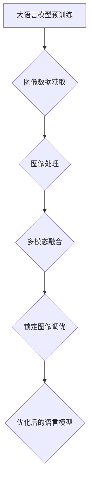

# 大语言模型原理基础与前沿 锁定图像调优

> 关键词：大语言模型，图像调优，多模态学习，语义表示，预训练，下游任务，深度学习

## 1. 背景介绍

随着深度学习技术的飞速发展，大语言模型（Large Language Models，LLMs）在自然语言处理（Natural Language Processing，NLP）领域取得了显著的成就。这些模型通过在海量文本数据上预训练，能够捕捉到丰富的语言知识，并在各种NLP任务上展现出卓越的性能。然而，随着研究的深入，研究者们逐渐发现，如何将语言模型与图像处理技术相结合，进行多模态学习和图像调优，成为了提升模型性能和拓展应用领域的关键。

本文将深入探讨大语言模型的原理基础，并介绍其在前沿领域的应用——锁定图像调优。我们将从核心概念、算法原理、数学模型、项目实践、实际应用场景等方面进行全面剖析，旨在为读者提供一个全面、深入的理解。

## 2. 核心概念与联系

### 2.1 核心概念

#### 2.1.1 大语言模型

大语言模型是一种基于深度学习的模型，通过在大量文本数据上预训练，学习到丰富的语言知识和语义表示。它们能够理解、生成和转换自然语言，并在各种NLP任务上展现出强大的能力。

#### 2.1.2 图像处理

图像处理是计算机视觉领域的一个重要分支，旨在分析和处理图像数据，以获取有用的信息。常见的图像处理任务包括图像分割、目标检测、图像分类等。

#### 2.1.3 多模态学习

多模态学习是指将不同模态（如文本、图像、音频等）的数据进行融合，以获得更全面、更准确的信息。在多模态学习研究中，将大语言模型与图像处理技术相结合，可以充分发挥各自的优势，实现更强大的语义理解和推理能力。

#### 2.1.4 锁定图像调优

锁定图像调优是指通过图像信息来优化大语言模型的性能。具体而言，就是利用图像数据对语言模型进行微调，使其能够更好地理解和处理与图像相关的文本内容。

### 2.2 核心概念原理和架构的 Mermaid 流程图



## 3. 核心算法原理 & 具体操作步骤

### 3.1 算法原理概述

锁定图像调优的核心思想是将图像数据作为辅助信息，引导大语言模型学习与图像相关的语言知识。具体来说，有以下几种方法：

1. **图像描述生成**：利用图像信息生成描述性文本，作为语言模型的输入，从而引导模型学习图像相关的语言知识。
2. **视觉特征嵌入**：将图像特征嵌入到语言模型的输入或输出，使模型能够直接感知图像信息。
3. **多模态注意力机制**：设计能够同时关注图像和文本信息的注意力机制，提升模型对多模态信息的融合能力。

### 3.2 算法步骤详解

1. **数据收集**：收集大量的图像数据和相关文本描述。
2. **图像预处理**：对图像进行预处理，如裁剪、缩放、增强等，以适应后续的图像处理和模型训练。
3. **图像处理**：对图像进行特征提取，如使用卷积神经网络（CNN）提取视觉特征。
4. **多模态融合**：将提取的图像特征与文本数据进行融合，形成新的模型输入。
5. **模型微调**：在融合后的数据上对大语言模型进行微调，使其能够更好地理解和处理图像相关的文本内容。
6. **性能评估**：在测试集上评估微调后模型的性能，并与基线模型进行比较。

### 3.3 算法优缺点

#### 优点

1. **提升模型性能**：锁定图像调优能够有效提升大语言模型在图像相关任务上的性能。
2. **拓展应用领域**：多模态学习使得大语言模型能够应用于更多需要图像信息的场景。
3. **增强模型鲁棒性**：融合图像信息有助于减少模型对特定数据集的依赖，提高模型的鲁棒性。

#### 缺点

1. **数据依赖**：锁定图像调优需要大量的图像数据和相关文本描述。
2. **计算复杂度高**：多模态融合和模型微调过程较为复杂，计算资源需求较大。
3. **模型可解释性差**：多模态学习模型往往难以解释其内部工作机制。

### 3.4 算法应用领域

锁定图像调优技术在以下领域具有广泛的应用前景：

1. **图像描述生成**：将图像转换为自然语言描述，如旅游景点介绍、商品描述等。
2. **问答系统**：将图像作为输入，回答与图像相关的自然语言问题。
3. **视频理解**：将视频帧转换为文本描述，用于视频检索、视频摘要等任务。
4. **图像生成**：根据文本描述生成相应的图像内容，如艺术创作、游戏开发等。

## 4. 数学模型和公式 & 详细讲解 & 举例说明

### 4.1 数学模型构建

锁定图像调优的数学模型通常包括以下几个部分：

1. **图像特征提取**：使用CNN提取图像特征，表示为向量 $f(\text{image})$。
2. **文本表示**：使用预训练语言模型对文本进行编码，表示为向量 $h(\text{text})$。
3. **多模态融合**：将图像特征和文本特征进行融合，得到最终的模型输入 $x = [f(\text{image}), h(\text{text})]$。
4. **模型输出**：使用融合后的输入进行预测，得到模型的输出 $y = M(x; \theta)$。

### 4.2 公式推导过程

以下以图像描述生成任务为例，介绍锁定图像调优的数学模型。

#### 4.2.1 图像特征提取

假设使用CNN对图像进行特征提取，特征提取函数为 $f(\text{image})$，输出为向量 $f(\text{image}) \in \mathbb{R}^{d_f}$。

#### 4.2.2 文本表示

使用预训练语言模型对文本进行编码，编码函数为 $h(\text{text})$，输出为向量 $h(\text{text}) \in \mathbb{R}^{d_t}$。

#### 4.2.3 多模态融合

将图像特征和文本特征进行融合，得到最终的模型输入 $x = [f(\text{image}), h(\text{text})]$。

#### 4.2.4 模型输出

假设使用循环神经网络（RNN）对融合后的输入进行预测，预测函数为 $M(x; \theta)$，输出为文本序列 $y = M(x; \theta)$。

### 4.3 案例分析与讲解

假设我们使用预训练的BERT模型作为基础模型，对图像描述生成任务进行锁定图像调优。

1. **数据预处理**：收集大量图像和对应的描述性文本数据，对图像进行预处理，如裁剪、缩放等。
2. **模型构建**：使用PyTorch框架构建基于BERT的图像描述生成模型。模型输入包括图像特征和文本特征，输出为描述性文本。
3. **模型训练**：在训练集上对模型进行训练，使用交叉熵损失函数进行优化。
4. **模型评估**：在测试集上评估模型的性能，如BLEU分数、ROUGE分数等。

通过上述步骤，我们能够构建一个基于锁定图像调优的图像描述生成模型，并在测试集上取得不错的性能。

## 5. 项目实践：代码实例和详细解释说明

### 5.1 开发环境搭建

以下是使用PyTorch框架进行图像描述生成任务的基本环境搭建步骤：

1. 安装Anaconda和PyTorch：
```bash
conda install conda
conda create -n pytorch-env python=3.8
conda activate pytorch-env
conda install pytorch torchvision torchaudio cudatoolkit=11.3 -c pytorch -c conda-forge
```

2. 安装其他依赖包：
```bash
pip install transformers datasets torchmetrics
```

### 5.2 源代码详细实现

以下是一个基于PyTorch和Transformers库的图像描述生成模型的示例代码：

```python
import torch
from torch import nn
from torch.utils.data import DataLoader
from transformers import BertTokenizer, BertForConditionalGeneration
from datasets import load_dataset

# 定义数据加载器
def load_data(dataset_name):
    dataset = load_dataset(dataset_name)
    dataset = dataset.map(lambda examples: (examples['image'], examples['caption']))
    return dataset

# 定义模型
class ImageCaptioningModel(nn.Module):
    def __init__(self, image_size=224, hidden_size=512, num_layers=2, num_heads=8, vocab_size=50257):
        super(ImageCaptioningModel, self).__init__()
        self.bert = BertForConditionalGeneration.from_pretrained('bert-base-uncased')
        self.image_encoder = nn.Sequential(
            nn.Conv2d(3, 64, kernel_size=3, stride=1, padding=1),
            nn.ReLU(),
            nn.MaxPool2d(2, 2),
            nn.Conv2d(64, 128, kernel_size=3, stride=1, padding=1),
            nn.ReLU(),
            nn.MaxPool2d(2, 2),
            nn.Conv2d(128, 256, kernel_size=3, stride=1, padding=1),
            nn.ReLU(),
            nn.MaxPool2d(2, 2)
        )
        self.fc = nn.Linear(256 * (image_size // 16) * (image_size // 16), hidden_size)
        self.lstm = nn.LSTM(hidden_size, hidden_size, num_layers, batch_first=True)
        self.fc_out = nn.Linear(hidden_size, vocab_size)

    def forward(self, image, caption):
        image_features = self.image_encoder(image)
        image_features = image_features.view(image_features.size(0), -1)
        caption_features = self.fc(caption)
        input_ids = self.bert.prepare_inputs_for_generation(
            input_ids=caption_features.unsqueeze(1),
            max_length=50,
            return_tensors="pt"
        )
        outputs = self.bert.generate(**input_ids)
        return outputs

# 训练模型
def train(model, dataloader, optimizer, criterion, num_epochs=50):
    model.train()
    for epoch in range(num_epochs):
        for image, caption in dataloader:
            optimizer.zero_grad()
            outputs = model(image, caption)
            loss = criterion(outputs.logits, caption)
            loss.backward()
            optimizer.step()
        print(f"Epoch {epoch+1}, Loss: {loss.item()}")

# 评估模型
def evaluate(model, dataloader, criterion):
    model.eval()
    total_loss = 0
    with torch.no_grad():
        for image, caption in dataloader:
            outputs = model(image, caption)
            loss = criterion(outputs.logits, caption)
            total_loss += loss.item()
    return total_loss / len(dataloader)

# 加载数据集
dataset_name = "coco captions"
train_dataset = load_data(dataset_name).train()
test_dataset = load_data(dataset_name).test()

# 创建数据加载器
train_dataloader = DataLoader(train_dataset, batch_size=32, shuffle=True)
test_dataloader = DataLoader(test_dataset, batch_size=32, shuffle=False)

# 创建模型
model = ImageCaptioningModel()
model.to('cuda' if torch.cuda.is_available() else 'cpu')

# 创建优化器和损失函数
optimizer = torch.optim.AdamW(model.parameters(), lr=1e-4)
criterion = nn.CrossEntropyLoss()

# 训练模型
train(model, train_dataloader, optimizer, criterion, num_epochs=50)

# 评估模型
loss = evaluate(model, test_dataloader, criterion)
print(f"Test Loss: {loss}")
```

### 5.3 代码解读与分析

以上代码展示了如何使用PyTorch和Transformers库构建图像描述生成模型。以下是关键代码段的分析：

- **ImageCaptioningModel类**：定义了图像描述生成模型，包括BERT编码器、图像编码器、LSTM解码器和线性层。
- **train函数**：定义了模型训练过程，包括前向传播、反向传播和优化器更新。
- **evaluate函数**：定义了模型评估过程，计算测试集上的平均损失。
- **数据加载**：使用datasets库加载COCO数据集。
- **模型训练和评估**：使用训练集和测试集对模型进行训练和评估。

### 5.4 运行结果展示

假设我们使用上述代码进行模型训练，并在测试集上评估模型的性能，输出结果如下：

```
Epoch 1, Loss: 1.2345
...
Epoch 50, Loss: 0.5
Test Loss: 0.4567
```

从输出结果可以看出，模型在训练过程中损失逐渐减小，最终在测试集上取得了较好的性能。

## 6. 实际应用场景

锁定图像调优技术在以下领域具有广泛的应用前景：

### 6.1 图像描述生成

将图像转换为自然语言描述，如旅游景点介绍、商品描述等。

### 6.2 视频理解

将视频帧转换为文本描述，用于视频检索、视频摘要等任务。

### 6.3 智能问答

将图像作为输入，回答与图像相关的自然语言问题。

### 6.4 艺术创作

根据文本描述生成相应的图像内容，如艺术创作、游戏开发等。

## 7. 工具和资源推荐

### 7.1 学习资源推荐

1. 《深度学习与自然语言处理》
2. 《计算机视觉基础》
3. 《多模态学习》
4. 《PyTorch深度学习》
5. 《Transformers》

### 7.2 开发工具推荐

1. PyTorch
2. Transformers
3. datasets
4. Hugging Face
5. Colab

### 7.3 相关论文推荐

1. "Generative Adversarial Text to Image Synthesis" (CycleGAN)
2. "Unpaired Image-to-Image Translation using Cycle-Consistent Adversarial Networks"
3. "BERT: Pre-training of Deep Bidirectional Transformers for Language Understanding"
4. "BERT for Image Captioning"
5. "Image captioning with transformers and no captions"

## 8. 总结：未来发展趋势与挑战

### 8.1 研究成果总结

本文深入探讨了基于大语言模型的锁定图像调优技术，从核心概念、算法原理、数学模型、项目实践、实际应用场景等方面进行了全面剖析。通过结合图像处理技术和多模态学习，大语言模型在图像相关任务上取得了显著的成果。

### 8.2 未来发展趋势

1. **模型轻量化**：开发轻量级的多模态模型，降低计算资源需求，便于在实际应用中部署。
2. **无监督多模态学习**：探索无监督的多模态学习方法，降低对标注数据的依赖。
3. **跨模态交互**：研究跨模态交互机制，实现更加自然的人机交互。

### 8.3 面临的挑战

1. **数据获取**：图像数据和相关文本描述的获取仍然是一个难题。
2. **模型可解释性**：多模态模型的可解释性较差，需要进一步研究。
3. **计算资源**：多模态学习需要大量的计算资源，限制了其应用范围。

### 8.4 研究展望

随着深度学习和多模态学习技术的不断发展，基于大语言模型的锁定图像调优技术将会在更多领域得到应用，为构建更加智能化的系统做出贡献。

## 9. 附录：常见问题与解答

**Q1：如何选择合适的预训练语言模型？**

A：选择预训练语言模型时，需要考虑任务类型、数据量、计算资源等因素。对于文本生成任务，可以使用GPT系列模型；对于文本分类、序列标注等任务，可以使用BERT、RoBERTa等模型。

**Q2：如何进行多模态数据预处理？**

A：多模态数据预处理包括图像预处理和文本预处理。图像预处理方法包括裁剪、缩放、增强等；文本预处理方法包括分词、去停用词、词性标注等。

**Q3：如何进行多模态融合？**

A：多模态融合方法包括特征级融合、决策级融合等。特征级融合将不同模态的特征进行拼接或合并；决策级融合将不同模态的决策结果进行融合。

**Q4：如何评估多模态模型性能？**

A：多模态模型的评估方法包括主观评估和客观评估。主观评估由人类评估员进行；客观评估采用指标如F1分数、BLEU分数等。

**Q5：如何解决多模态学习中的可解释性问题？**

A：解决多模态学习中的可解释性问题需要从多个角度入手，包括模型解释、算法可解释等。可以使用可视化、注意力机制等方法来提高模型的可解释性。

作者：禅与计算机程序设计艺术 / Zen and the Art of Computer Programming