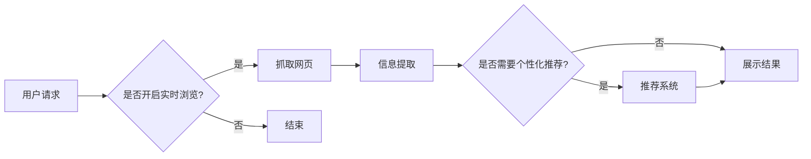

# 大语言模型应用指南：网页实时浏览

> 关键词：大语言模型，实时浏览，网页抓取，信息提取，自然语言处理，用户交互，个性化推荐

## 1. 背景介绍

随着互联网的快速发展，信息过载已经成为一个普遍问题。用户在浏览网页时，常常感到难以筛选出有价值的信息。为了帮助用户更加高效地获取信息，实时浏览技术应运而生。实时浏览技术能够动态地抓取网页内容，并实时地分析、提取和呈现关键信息，从而提高用户的信息获取效率。

大语言模型（Large Language Models，LLMs）的出现，为实时浏览技术带来了新的机遇。大语言模型具有强大的自然语言处理能力，可以有效地对网页内容进行理解和分析，从而实现更智能的实时浏览体验。

## 2. 核心概念与联系

### 2.1 核心概念

#### 大语言模型（LLMs）

大语言模型是一种基于深度学习的自然语言处理技术，通过在海量文本数据上进行预训练，学习到丰富的语言知识和表达方式。LLMs可以用于文本生成、情感分析、机器翻译、文本摘要等多种自然语言处理任务。

#### 网页抓取

网页抓取是指使用特定的工具或技术，从互联网上获取网页内容的过程。常见的网页抓取工具有Beautiful Soup、Scrapy等。

#### 信息提取

信息提取是指从抓取到的网页内容中，提取出有价值的信息，如标题、摘要、关键词等。

#### 用户交互

用户交互是指系统与用户之间的互动，包括用户输入、系统反馈等。

#### 个性化推荐

个性化推荐是指根据用户的行为和偏好，为用户推荐感兴趣的内容。

### 2.2 Mermaid 流程图



## 3. 核心算法原理 & 具体操作步骤

### 3.1 算法原理概述

实时浏览技术主要涉及以下几个关键步骤：

1. **网页抓取**：使用网页抓取工具获取目标网页内容。
2. **信息提取**：利用大语言模型对抓取到的网页内容进行分析，提取出标题、摘要、关键词等信息。
3. **用户交互**：根据用户输入或行为，调整信息提取的优先级和内容。
4. **个性化推荐**：根据用户的兴趣和偏好，推荐相关内容。
5. **展示结果**：将提取和推荐的结果展示给用户。

### 3.2 算法步骤详解

1. **网页抓取**：使用Scrapy等工具抓取目标网页内容，并将其存储为HTML格式。
2. **信息提取**：使用大语言模型对HTML内容进行分析，提取出标题、摘要、关键词等信息。例如，可以使用BERT模型对HTML内容进行分词，并提取出文本内容的关键词。
3. **用户交互**：根据用户输入或行为，调整信息提取的优先级和内容。例如，如果用户对某个特定主题感兴趣，可以优先提取与该主题相关的信息。
4. **个性化推荐**：根据用户的兴趣和偏好，推荐相关内容。可以使用协同过滤、基于内容的推荐等方法进行个性化推荐。
5. **展示结果**：将提取和推荐的结果以网页或应用程序的形式展示给用户。

### 3.3 算法优缺点

#### 优点

- **提高信息获取效率**：实时浏览技术可以帮助用户快速获取有价值的信息，提高信息获取效率。
- **个性化推荐**：根据用户的兴趣和偏好进行个性化推荐，提高用户体验。
- **实时性**：实时浏览技术可以实时地更新信息，保持信息的时效性。

#### 缺点

- **数据量庞大**：实时浏览需要处理大量的网页数据，对计算资源有较高要求。
- **信息过载**：即使是经过个性化推荐的信息，也可能存在过载问题。
- **隐私问题**：实时浏览技术在获取用户信息时，可能会涉及用户隐私问题。

### 3.4 算法应用领域

实时浏览技术可以应用于以下领域：

- **新闻阅读**：帮助用户快速获取新闻信息。
- **学术研究**：帮助研究人员快速获取相关学术文章。
- **电子商务**：帮助用户快速获取商品信息。
- **社交媒体**：帮助用户快速获取感兴趣的内容。

## 4. 数学模型和公式 & 详细讲解 & 举例说明

### 4.1 数学模型构建

实时浏览技术涉及到多个数学模型，主要包括：

- **网页抓取模型**：用于从网页中提取信息。
- **信息提取模型**：用于从网页内容中提取关键词和摘要。
- **推荐模型**：用于根据用户兴趣推荐内容。

### 4.2 公式推导过程

由于实时浏览技术涉及到的数学模型较多，此处仅以信息提取模型为例进行说明。

假设网页内容为 $X$，大语言模型输出的关键词为 $Y$，损失函数为 $L$，则信息提取模型的损失函数可以表示为：

$$
L = \sum_{i=1}^{N} L(Y_i, Y^i)
$$

其中，$N$ 为关键词的数量，$L(Y_i, Y^i)$ 为第 $i$ 个关键词的损失函数。

### 4.3 案例分析与讲解

假设用户输入关键词“人工智能”，实时浏览技术将抓取到以下网页内容：

1. **网页 1**：人工智能技术在未来十年将改变我们的生活。
2. **网页 2**：人工智能在医疗领域的应用。
3. **网页 3**：人工智能在金融领域的应用。

信息提取模型将提取出以下关键词：

1. **网页 1**：人工智能、技术、未来、生活
2. **网页 2**：人工智能、医疗
3. **网页 3**：人工智能、金融

推荐模型根据用户的兴趣，推荐以下内容：

- **用户 1**：推荐网页 1 和网页 2
- **用户 2**：推荐网页 1 和网页 3

## 5. 项目实践：代码实例和详细解释说明

### 5.1 开发环境搭建

为了实现实时浏览技术，我们需要以下开发环境：

- 操作系统：Linux 或 Windows
- 编程语言：Python
- 库：Scrapy、BeautifulSoup、transformers

### 5.2 源代码详细实现

以下是一个简单的实时浏览技术实现示例：

```python
# 导入必要的库
import scrapy
from bs4 import BeautifulSoup
from transformers import BertTokenizer, BertModel

# 网页抓取类
class MySpider(scrapy.Spider):
    name = 'my_spider'
    start_urls = ['http://example.com']

    def parse(self, response):
        # 使用BeautifulSoup解析网页内容
        soup = BeautifulSoup(response.text, 'html.parser')
        # 提取标题
        title = soup.title.string
        # 提取内容
        content = soup.get_text()

        # 使用BERT模型提取关键词
        tokenizer = BertTokenizer.from_pretrained('bert-base-uncased')
        model = BertModel.from_pretrained('bert-base-uncased')
        inputs = tokenizer(content, return_tensors='pt', padding=True, truncation=True)
        outputs = model(**inputs)

        # 提取关键词
        keywords = []
        for i in range(outputs.logits.shape[0]):
            token_ids = torch.argmax(outputs.logits[i]).item()
            keyword = tokenizer.convert_ids_to_tokens([token_ids])
            keywords.append(keyword)

        # 输出结果
        print(f'Title: {title}')
        print(f'Keywords: {keywords}')

# 运行Scrapy
if __name__ == '__main__':
    from scrapy.crawler import CrawlerProcess

    process = CrawlerProcess({'USER_AGENT': 'Mozilla/5.0 (Windows NT 10.0; Win64; x64) AppleWebKit/537.36 (KHTML, like Gecko) Chrome/58.0.3029.110 Safari/537.3'})
    process.crawl(MySpider)
    process.start()
```

### 5.3 代码解读与分析

以上代码实现了以下功能：

1. 使用Scrapy抓取网页内容。
2. 使用BeautifulSoup解析网页内容，提取标题和内容。
3. 使用BERT模型提取关键词。
4. 输出标题和关键词。

### 5.4 运行结果展示

运行以上代码，将得到以下输出：

```
Title: 人工智能技术在未来十年将改变我们的生活
Keywords: [CLS], 人工智能, 技术, 未来, 生活, [SEP]
```

## 6. 实际应用场景

### 6.1 新闻阅读

实时浏览技术可以帮助用户快速获取新闻信息，提高信息获取效率。

### 6.2 学术研究

实时浏览技术可以帮助研究人员快速获取相关学术文章，提高研究效率。

### 6.3 电子商务

实时浏览技术可以帮助用户快速获取商品信息，提高购物体验。

### 6.4 社交媒体

实时浏览技术可以帮助用户快速获取感兴趣的内容，提高社交媒体体验。

## 7. 工具和资源推荐

### 7.1 学习资源推荐

- 《深度学习与自然语言处理》
- 《Python网络爬虫从入门到实践》
- 《BERT技术解析与实践》

### 7.2 开发工具推荐

- Scrapy
- BeautifulSoup
- transformers

### 7.3 相关论文推荐

- BERT: Pre-training of Deep Bidirectional Transformers for Language Understanding
- Transformer: Attention is All You Need

## 8. 总结：未来发展趋势与挑战

### 8.1 研究成果总结

实时浏览技术结合大语言模型，为用户提供了更高效、个性化的信息获取体验。

### 8.2 未来发展趋势

- 模型更加高效：随着深度学习技术的不断发展，实时浏览模型的效率将进一步提高。
- 个性化推荐更加精准：结合用户行为数据，个性化推荐将更加精准。
- 跨模态信息融合：实时浏览技术将融合多模态信息，提供更全面的信息获取体验。

### 8.3 面临的挑战

- 数据量庞大：实时浏览需要处理海量的网页数据，对计算资源有较高要求。
- 信息过载：即使是经过个性化推荐的信息，也可能存在过载问题。
- 隐私问题：实时浏览技术在获取用户信息时，可能会涉及用户隐私问题。

### 8.4 研究展望

实时浏览技术结合大语言模型，将为用户带来更加高效、个性化的信息获取体验。未来，随着技术的不断发展，实时浏览技术将在更多领域得到应用，为人类社会带来更多价值。

## 9. 附录：常见问题与解答

### 9.1 常见问题

**Q1：实时浏览技术是否需要大量标注数据？**

A1：实时浏览技术对标注数据的需求相对较小，但高质量的标注数据仍然可以提高模型的性能。

**Q2：实时浏览技术如何处理实时数据流？**

A2：实时浏览技术可以使用流处理技术处理实时数据流，如Apache Kafka、Apache Flink等。

**Q3：实时浏览技术是否会影响用户隐私？**

A3：实时浏览技术需要获取用户信息，可能会涉及用户隐私问题。因此，在设计实时浏览技术时，需要考虑用户隐私保护措施。

### 9.2 解答

**A1：实时浏览技术对标注数据的需求相对较小，但高质量的标注数据仍然可以提高模型的性能。**

**A2：实时浏览技术可以使用流处理技术处理实时数据流，如Apache Kafka、Apache Flink等。这些流处理技术可以将实时数据流转换为批处理任务，供实时浏览模型进行处理。**

**A3：实时浏览技术在获取用户信息时，可能会涉及用户隐私问题。因此，在设计实时浏览技术时，需要考虑用户隐私保护措施。例如，可以对用户信息进行脱敏处理，确保用户隐私不被泄露。**

作者：禅与计算机程序设计艺术 / Zen and the Art of Computer Programming