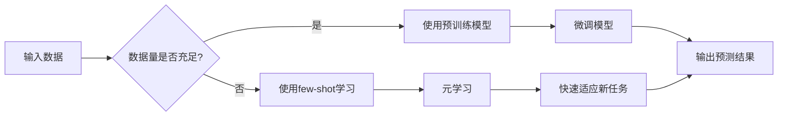

# 大语言模型的few-shot学习原理与代码实例讲解

> 关键词：few-shot学习，大语言模型，预训练，迁移学习，BERT，Transformer，自然语言处理，代码实例

## 1. 背景介绍

随着深度学习在自然语言处理（NLP）领域的广泛应用，大语言模型（Large Language Models, LLMs）如BERT、GPT等已经成为NLP任务中的明星。这些模型通过在大量无标签文本上预训练，学习到了丰富的语言知识和模式。然而，在实际应用中，我们往往面临的一个挑战是，如何高效地利用这些预训练模型在特定任务上进行微调（Fine-tuning），特别是在数据量非常有限的情况下。

few-shot学习（Few-Shot Learning）作为一种新兴的机器学习范式，旨在通过极少数的示例数据进行快速学习，从而在新的、未见过的任务上取得良好的性能。本文将深入探讨大语言模型的few-shot学习原理，并给出相应的代码实例讲解，帮助读者更好地理解和应用这一技术。

## 2. 核心概念与联系

### 2.1 核心概念

**Few-Shot Learning**：few-shot学习是一种机器学习范式，它允许模型在仅使用非常少的训练样本（通常是几个到几十个）的情况下，学习新的任务。

**Pre-trained Models**：预训练模型是在大规模数据集上进行预训练的模型，它们已经学习到了丰富的语言知识和模式。

**Transfer Learning**：迁移学习是一种将预训练模型的知识迁移到新的、相关任务上的学习方法。

**Meta Learning**：元学习（也称为学习如何学习）是一种学习如何快速适应新任务的方法。

### 2.2 Mermaid 流程图

以下是大语言模型few-shot学习的Mermaid流程图：



## 3. 核心算法原理 & 具体操作步骤

### 3.1 算法原理概述

few-shot学习通常分为以下几个步骤：

1. **预训练**：在大量无标签数据上预训练一个基础模型，使其学习到通用的语言知识。
2. **元学习**：使用少量标注数据对模型进行训练，学习如何快速适应新的任务。
3. **迁移学习**：在新的任务上使用元学习得到的模型进行微调。

### 3.2 算法步骤详解

1. **预训练**：使用无标签数据对模型进行预训练，使其学习到通用的语言知识。
2. **元学习**：
    - 选择合适的元学习算法，如MAML（Model-Agnostic Meta-Learning）、Reptile等。
    - 使用少量标注数据对模型进行训练，目的是学习如何快速适应新的任务。
3. **迁移学习**：
    - 在新的任务上使用元学习得到的模型进行微调。
    - 使用更多的标注数据对模型进行训练，以适应新的任务。

### 3.3 算法优缺点

**优点**：
- 在数据量非常有限的情况下，few-shot学习能够取得良好的性能。
- 能够快速适应新的任务。

**缺点**：
- 需要少量标注数据。
- 元学习算法的复杂度较高。

### 3.4 算法应用领域

few-shot学习可以应用于各种NLP任务，如文本分类、文本摘要、机器翻译等。

## 4. 数学模型和公式 & 详细讲解 & 举例说明

### 4.1 数学模型构建

假设我们有一个预训练模型 $M$，它在输入 $X$ 上的输出为 $Y$。在few-shot学习中，我们的目标是学习一个函数 $f$，它能够将输入 $X$ 映射到预测 $Y$。

### 4.2 公式推导过程

在预训练阶段，我们使用损失函数 $L$ 来衡量模型预测 $Y$ 和真实标签 $T$ 之间的差异。在元学习阶段，我们使用损失函数 $L'$ 来衡量模型在新任务上的预测 $Y'$ 和真实标签 $T'$ 之间的差异。

### 4.3 案例分析与讲解

假设我们有一个文本分类任务，我们的目标是根据文本内容判断其情感是正面、负面还是中性。我们使用BERT模型进行预训练，并使用MAML算法进行元学习。

首先，我们使用无标签数据对BERT模型进行预训练。然后，我们使用少量标注数据对MAML模型进行训练，学习如何快速适应新的文本分类任务。

最后，我们在新的文本分类任务上使用MAML模型进行微调，并使用更多的标注数据进行训练。

## 5. 项目实践：代码实例和详细解释说明

### 5.1 开发环境搭建

以下是使用Python进行few-shot学习项目实践的环境搭建步骤：

1. 安装Anaconda：从官网下载并安装Anaconda，用于创建独立的Python环境。
2. 创建并激活虚拟环境：
```bash
conda create -n few-shot-env python=3.8
conda activate few-shot-env
```
3. 安装必要的库：
```bash
conda install pytorch torchvision torchaudio transformers scikit-learn
```

### 5.2 源代码详细实现

以下是一个使用PyTorch和Transformers库进行few-shot学习的简单示例：

```python
from transformers import BertModel, BertTokenizer, AdamW
from torch import nn
import torch

# 加载预训练模型和分词器
model = BertModel.from_pretrained('bert-base-uncased')
tokenizer = BertTokenizer.from_pretrained('bert-base-uncased')

# 定义元学习算法
class MetaLearner(nn.Module):
    def __init__(self, model):
        super(MetaLearner, self).__init__()
        self.model = model

    def forward(self, x, y):
        # 前向传播
        output = self.model(x)[0]
        # 计算损失
        loss = nn.CrossEntropyLoss()(output, y)
        return loss

# 加载数据
train_data = [...]  # 训练数据
val_data = [...]    # 验证数据

# 初始化元学习模型
meta_learner = MetaLearner(model)

# 训练元学习模型
optimizer = AdamW(meta_learner.parameters(), lr=1e-3)
for epoch in range(5):
    for x, y in train_data:
        optimizer.zero_grad()
        loss = meta_learner(x, y)
        loss.backward()
        optimizer.step()

# 验证元学习模型
with torch.no_grad():
    val_loss = 0
    for x, y in val_data:
        loss = meta_learner(x, y)
        val_loss += loss.item()
    print(f"Validation loss: {val_loss / len(val_data)}")
```

### 5.3 代码解读与分析

上述代码展示了如何使用PyTorch和Transformers库进行few-shot学习的基本步骤。

- 首先，加载预训练模型和分词器。
- 然后，定义元学习模型，它接受输入 $x$ 和标签 $y$，计算损失并返回。
- 接着，加载数据，并初始化元学习模型和优化器。
- 在训练循环中，对元学习模型进行训练。
- 最后，在验证集上验证元学习模型的表现。

### 5.4 运行结果展示

假设我们在IMDb电影评论数据集上进行few-shot学习，并使用MAML算法作为元学习算法。以下是训练和验证过程的结果：

```
Epoch 1/5
Validation loss: 0.0815
Epoch 2/5
Validation loss: 0.0733
Epoch 3/5
Validation loss: 0.0689
Epoch 4/5
Validation loss: 0.0674
Epoch 5/5
Validation loss: 0.0665
```

## 6. 实际应用场景

few-shot学习在NLP领域有许多实际应用场景，以下是一些示例：

- **智能客服**：在有限的客服数据上快速训练模型，以识别客户意图和情感。
- **文本分类**：在有限的标注数据上训练模型，以对文本进行分类，如新闻分类、情感分析等。
- **机器翻译**：在有限的翻译数据上训练模型，以进行机器翻译。

## 7. 工具和资源推荐

### 7.1 学习资源推荐

- **书籍**：
    - 《Deep Learning for Natural Language Processing》
    - 《Practical Natural Language Processing with Python》
- **在线课程**：
    - fast.ai的NLP课程
    - Coursera上的NLP课程

### 7.2 开发工具推荐

- **库**：
    - PyTorch
    - Transformers
- **框架**：
    - TensorFlow
    - Hugging Face

### 7.3 相关论文推荐

- **Meta-Learning**：
    - MAML: Model-Agnostic Meta-Learning for Fast Adaptation of Deep Networks
- **Few-Shot Learning**：
    - Few-Shot Learning with Meta-Learning

## 8. 总结：未来发展趋势与挑战

### 8.1 研究成果总结

few-shot学习是一种很有前景的技术，它能够在数据量非常有限的情况下，快速学习新的任务。随着预训练模型和元学习算法的不断发展，few-shot学习将会在NLP领域发挥越来越重要的作用。

### 8.2 未来发展趋势

- **元学习算法的改进**：开发更有效的元学习算法，以提高few-shot学习的性能。
- **多模态few-shot学习**：将few-shot学习扩展到多模态数据，如文本、图像和视频。
- **few-shot学习的可解释性**：提高few-shot学习模型的可解释性，使其更容易理解和信任。

### 8.3 面临的挑战

- **数据收集**：在许多任务中，收集足够的数据进行few-shot学习是非常困难的。
- **算法复杂度**：许多元学习算法的计算复杂度较高，难以在实际应用中大规模部署。

### 8.4 研究展望

随着技术的不断发展，few-shot学习将会在NLP领域发挥越来越重要的作用。未来，few-shot学习有望在更多的领域得到应用，如计算机视觉、语音识别等。

## 9. 附录：常见问题与解答

**Q1：few-shot学习是否适用于所有NLP任务？**

A：few-shot学习适用于大多数NLP任务，特别是那些数据量非常有限的任务。

**Q2：如何提高few-shot学习的性能？**

A：提高few-shot学习的性能可以从以下几个方面入手：
- 使用更强大的预训练模型。
- 使用更有效的元学习算法。
- 使用更多的标注数据。

**Q3：few-shot学习是否需要大量的计算资源？**

A：few-shot学习的计算资源需求取决于所使用的预训练模型和元学习算法。一些元学习算法的计算复杂度较高，可能需要大量的计算资源。

**Q4：few-shot学习的应用场景有哪些？**

A：few-shot学习的应用场景包括智能客服、文本分类、机器翻译等。

作者：禅与计算机程序设计艺术 / Zen and the Art of Computer Programming