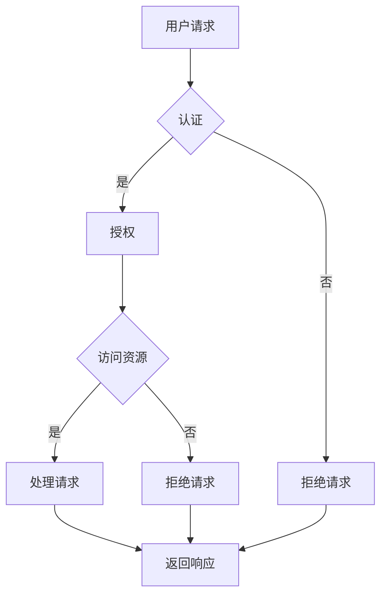

# 安全 API 设计的详细步骤

> 关键词：API 设计，安全性，认证，授权，数据保护，加密，OAuth 2.0，JWT，HTTPS，安全最佳实践

## 1. 背景介绍

随着互联网的普及和数字化转型的加速，API（应用程序编程接口）已经成为连接不同系统和服务的桥梁。良好的API设计不仅能提高开发效率和用户体验，还能确保系统的安全性。然而，API安全问题日益突出，成为网络安全的重要风险点。本文将深入探讨安全API设计的详细步骤，帮助开发者构建安全可靠的API服务。

## 2. 核心概念与联系

### 2.1 核心概念

- **API（应用程序编程接口）**：定义了不同软件模块之间交互的规则和格式。
- **认证（Authentication）**：验证用户的身份，确保用户是谁。
- **授权（Authorization）**：确定用户有权访问哪些资源或执行哪些操作。
- **数据保护（Data Protection）**：确保数据在传输和存储过程中的安全。
- **加密（Encryption）**：通过算法将数据转换为密文，防止未授权访问。
- **HTTPS（HTTP Secure）**：基于HTTP的安全协议，通过SSL/TLS加密数据传输。
- **OAuth 2.0**：开放授权框架，用于授权第三方应用访问受保护资源。
- **JWT（JSON Web Tokens）**：用于安全传输信息的一种开放标准（RFC 7519）。

### 2.2 核心概念原理和架构的 Mermaid 流程图



## 3. 核心算法原理 & 具体操作步骤

### 3.1 算法原理概述

安全API设计的目标是确保API的安全性、可靠性和可用性。这需要综合运用多种技术和管理措施。

### 3.2 算法步骤详解

#### 步骤1：确定安全需求

- 分析API的使用场景，确定可能的安全威胁。
- 确定需要保护的数据类型和敏感度。
- 制定安全策略和合规性要求。

#### 步骤2：选择合适的认证和授权机制

- **认证**：选择合适的认证机制，如OAuth 2.0、JWT、Basic Authentication等。
- **授权**：确定授权策略，如RBAC（基于角色的访问控制）、ABAC（基于属性的访问控制）等。

#### 步骤3：实现数据保护

- 对敏感数据进行加密，使用HTTPS协议保证数据传输安全。
- 实施数据最小化原则，仅收集和存储必要的数据。

#### 步骤4：确保API服务的安全性

- 使用安全的编程语言和框架，避免常见的安全漏洞。
- 定期进行代码审查和渗透测试。

#### 步骤5：监控和响应

- 实施日志记录和监控，及时发现异常行为。
- 制定应急响应计划，快速响应安全事件。

### 3.3 算法优缺点

#### 优点：

- 提高系统安全性，降低安全风险。
- 提高用户体验，确保数据隐私。
- 提高系统可用性，减少服务中断。

#### 缺点：

- 设计和实现过程复杂，需要专业知识和技能。
- 可能会增加开发成本和维护成本。

### 3.4 算法应用领域

- 金融服务
- 医疗保健
- 电子商务
- 企业内部系统
- 社交媒体

## 4. 数学模型和公式 & 详细讲解 & 举例说明

### 4.1 数学模型构建

在安全API设计中，数学模型主要用于加密算法和认证机制。

### 4.2 公式推导过程

以对称加密算法AES为例，其加密和解密公式如下：

$$
\text{加密} \; \text{Ciphertext} = \text{Key} \times \text{Plaintext}
$$

$$
\text{解密} \; \text{Plaintext} = \text{Key}^{-1} \times \text{Ciphertext}
$$

其中，$\text{Key}$ 为密钥，$\text{Plaintext}$ 为明文，$\text{Ciphertext}$ 为密文。

### 4.3 案例分析与讲解

以下是一个使用JWT进行用户认证的简单示例：

```python
import jwt
import datetime

# JWT密钥
SECRET_KEY = 'your_secret_key'

# 创建JWT令牌
def create_jwt_token(username):
    payload = {
        'username': username,
        'exp': datetime.datetime.utcnow() + datetime.timedelta(hours=1)  # 令牌过期时间
    }
    token = jwt.encode(payload, SECRET_KEY, algorithm='HS256')
    return token

# 解析JWT令牌
def parse_jwt_token(token):
    try:
        payload = jwt.decode(token, SECRET_KEY, algorithms=['HS256'])
        return payload['username']
    except jwt.ExpiredSignatureError:
        return 'Token过期'
    except jwt.InvalidTokenError:
        return '无效的令牌'
```

## 5. 项目实践：代码实例和详细解释说明

### 5.1 开发环境搭建

- 安装Python和必要的库，如Flask、PyJWT、itsdangerous等。

### 5.2 源代码详细实现

以下是一个简单的Flask应用程序，演示了如何使用JWT进行用户认证：

```python
from flask import Flask, request, jsonify
from itsdangerous import TimedJSONWebSignatureSerializer as Serializer

app = Flask(__name__)

# JWT密钥
SECRET_KEY = 'your_secret_key'

@app.route('/login', methods=['POST'])
def login():
    username = request.json.get('username')
    password = request.json.get('password')
    # 验证用户信息，此处仅作为示例
    if username == 'admin' and password == 'password':
        serializer = Serializer(SECRET_KEY)
        token = serializer.dumps({'username': username})
        return jsonify({'token': token.decode('utf-8')})
    else:
        return '用户名或密码错误', 401

@app.route('/protected', methods=['GET'])
def protected():
    token = request.headers.get('Authorization').split()[-1]
    try:
        data = jwt.decode(token, SECRET_KEY, algorithms=['HS256'])
        return jsonify({'message': '访问受保护资源'})
    except jwt.ExpiredSignatureError:
        return 'Token过期', 401
    except jwt.InvalidTokenError:
        return '无效的令牌', 401

if __name__ == '__main__':
    app.run()
```

### 5.3 代码解读与分析

- `login` 路由处理用户登录请求，验证用户信息并生成JWT令牌。
- `protected` 路由处理受保护资源的访问请求，验证JWT令牌的有效性。

### 5.4 运行结果展示

1. 用户发送POST请求到 `/login` 路由，提供用户名和密码。
2. 应用程序验证用户信息，如果验证成功，生成JWT令牌并返回。
3. 用户发送GET请求到 `/protected` 路由，在请求头中包含JWT令牌。
4. 应用程序验证JWT令牌的有效性，如果验证成功，允许访问受保护资源。

## 6. 实际应用场景

### 6.1 电子商务平台

- 用户注册和登录时使用OAuth 2.0进行认证。
- 保护用户订单、购物车等敏感数据。
- 使用HTTPS确保数据传输安全。

### 6.2 企业内部系统

- 使用JWT进行用户身份验证。
- 实施基于角色的访问控制，确保员工只能访问授权的资源。
- 定期进行安全审计和漏洞扫描。

### 6.3 社交媒体

- 使用OAuth 2.0实现第三方应用授权。
- 保护用户隐私和数据安全。
- 使用HTTPS防止数据泄露。

## 7. 工具和资源推荐

### 7.1 学习资源推荐

- 《API Design: RESTful, GraphQL, and More》
- 《OAuth 2.0: Building Secure and Scalable Authorization Systems》
- 《Understanding REST: Web APIs You Can Build and Use》

### 7.2 开发工具推荐

- Postman：API测试工具。
- Swagger：API文档生成工具。
- OpenSSL：加密库。

### 7.3 相关论文推荐

- OAuth 2.0: The Next Step in Open Standard for Authorization
- JSON Web Tokens (JWT): The Next Generation of Tokens

## 8. 总结：未来发展趋势与挑战

### 8.1 研究成果总结

本文详细介绍了安全API设计的步骤，包括核心概念、算法原理、实践案例和未来发展趋势。通过遵循这些步骤，开发者可以构建安全可靠的API服务。

### 8.2 未来发展趋势

- API安全将更加自动化和智能化。
- API安全将更加注重隐私保护。
- API安全将更加注重跨平台和跨域访问控制。

### 8.3 面临的挑战

- 随着API的复杂性增加，安全问题将更加复杂。
- 随着新型攻击手段的出现，API安全需要不断更新和演进。
- 随着云计算和边缘计算的兴起，API安全需要适应新的环境。

### 8.4 研究展望

未来，API安全研究将更加关注以下几个方面：

- 开发更加安全、高效的API认证和授权机制。
- 研究新型加密算法和密码学技术。
- 探索人工智能在API安全领域的应用。

## 9. 附录：常见问题与解答

**Q1：什么是API？**

A：API是应用程序编程接口，定义了不同软件模块之间交互的规则和格式。

**Q2：API设计需要考虑哪些安全问题？**

A：API设计需要考虑认证、授权、数据保护、加密、HTTPS等安全问题。

**Q3：如何选择合适的认证机制？**

A：选择合适的认证机制需要考虑具体的使用场景和安全性要求。常见的认证机制包括OAuth 2.0、JWT、Basic Authentication等。

**Q4：如何保证API数据的安全传输？**

A：使用HTTPS协议确保数据传输安全。

**Q5：如何防范API攻击？**

A：定期进行代码审查和渗透测试，使用安全的编程语言和框架，实施安全最佳实践。

---

作者：禅与计算机程序设计艺术 / Zen and the Art of Computer Programming