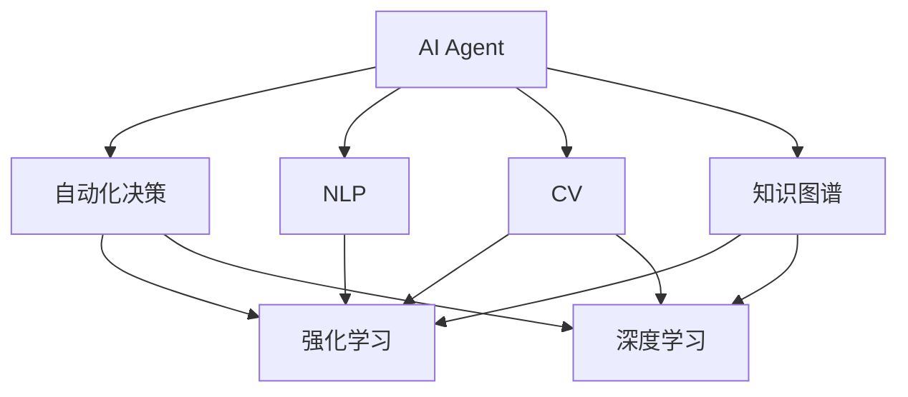
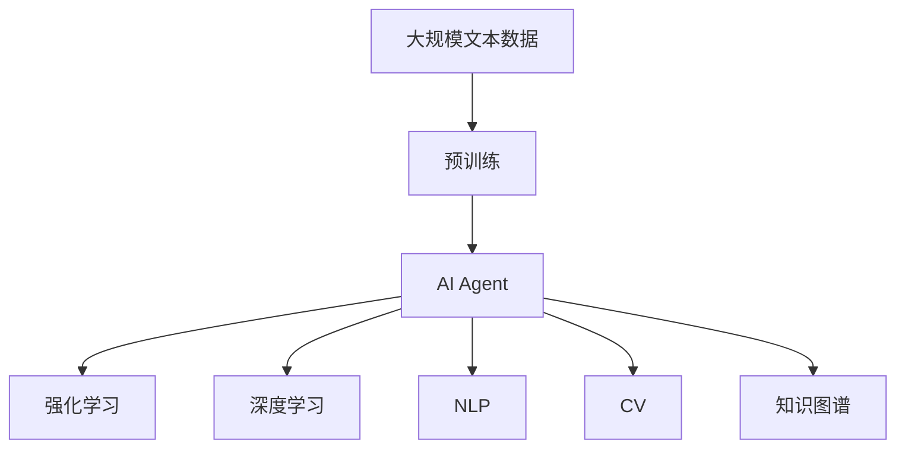

                 

# AI Agent: AI的下一个风口 高度自动化带来生产力革命

> 关键词：AI Agent, 自动化, 生产力革命, 智能决策, 深度学习, 自然语言处理(NLP), 计算机视觉(CV), 机器人, 数据驱动

## 1. 背景介绍

### 1.1 问题由来

在当前信息化快速发展的时代，人工智能(AI)正在逐步渗透到各个领域，从智能客服、自动驾驶、医疗诊断到金融交易、教育培训，AI技术已经从概念走向落地应用。然而，传统的AI应用大多依赖于手工编码和数据标注，不仅需要耗费大量的人力和时间，且难以适应复杂的现实世界环境。这些问题催生了AI Agent的需求，即一种具备高度自动化决策能力的AI系统。

### 1.2 问题核心关键点

AI Agent的核心在于通过机器学习算法，让机器能够在无需人工干预的情况下，自主地从大量数据中学习，自主地做出决策，从而实现高度自动化和智能化。AI Agent不仅能处理结构化数据，还能处理非结构化数据，如自然语言、图像等，使其在许多场景下具备强大的应用能力。

AI Agent的核心组件包括：
- 智能感知模块：用于获取环境信息，如摄像头、传感器等。
- 知识图谱模块：用于存储和检索大量领域知识，辅助决策。
- 认知推理模块：用于理解和处理输入的数据，形成决策依据。
- 决策引擎模块：用于制定和执行决策。
- 可视化模块：用于输出决策结果，提供人机交互接口。

AI Agent的典型应用场景包括：
- 智能客服系统：自动处理客户咨询，实时响应和解答问题。
- 自动驾驶汽车：基于传感器和摄像头数据，自主做出驾驶决策。
- 医疗诊断系统：基于影像和病历数据，自动给出疾病诊断和治疗方案。
- 金融交易系统：基于市场数据和历史交易记录，自动执行交易策略。
- 教育培训系统：基于学生的学习数据，自动生成个性化推荐和学习计划。

### 1.3 问题研究意义

AI Agent的研究和应用具有深远的意义：
- 降低人工成本：自动处理大量重复性工作，减少人力投入。
- 提升决策质量：通过大规模数据分析和机器学习，获取更加精准的决策依据。
- 实现灵活应用：基于数据驱动，灵活适应不同应用场景。
- 促进产业升级：带来生产效率的提升，推动产业创新和转型。
- 推动AI发展：为AI技术的落地应用提供新的方向和方法。

## 2. 核心概念与联系

### 2.1 核心概念概述

为更好地理解AI Agent的核心概念，本节将介绍几个密切相关的核心概念：

- AI Agent：具备自主决策能力的AI系统，可以处理复杂任务，适用于各种自动化场景。
- 自动化决策(Autonomous Decision Making)：通过机器学习算法，让AI系统自主地做出决策，无需人工干预。
- 强化学习(Reinforcement Learning)：一种基于奖惩机制的机器学习算法，适用于复杂、动态环境下的决策制定。
- 深度学习(Deep Learning)：一种基于神经网络的机器学习算法，适用于处理大规模非结构化数据。
- 自然语言处理(NLP)：一种使计算机能够理解、处理和生成人类语言的技术。
- 计算机视觉(CV)：一种使计算机能够理解和处理图像和视频的技术。
- 知识图谱(Knowledge Graph)：一种结构化存储和检索领域知识的技术。

这些核心概念之间存在着紧密的联系，形成了AI Agent的完整生态系统。

### 2.2 概念间的关系

这些核心概念之间存在着紧密的联系，形成了AI Agent的完整生态系统。下面我通过Mermaid流程图来展示这些概念之间的关系：



这个流程图展示了各个核心概念之间以及它们与AI Agent的关系：

1. 自动化决策是AI Agent的核心功能，通过机器学习算法实现自主决策。
2. 强化学习和深度学习是机器学习算法的两种形式，适用于不同的决策制定场景。
3. NLP和CV是AI Agent的感知模块，用于获取和处理文本和图像数据。
4. 知识图谱模块用于存储和检索领域知识，辅助决策。

这些概念共同构成了AI Agent的完整生态系统，使得AI Agent能够在各种自动化场景下发挥强大的应用能力。

### 2.3 核心概念的整体架构

最后，我们用一个综合的流程图来展示这些核心概念在大语言模型微调过程中的整体架构：



这个综合流程图展示了从预训练到AI Agent的完整过程。AI Agent首先在大规模文本数据上进行预训练，然后通过强化学习和深度学习算法优化决策能力，结合NLP和CV模块获取和处理输入数据，再通过知识图谱辅助决策。通过这些模块的协同工作，AI Agent可以高效地适应不同的自动化任务。

## 3. 核心算法原理 & 具体操作步骤
### 3.1 算法原理概述

AI Agent的决策过程可以概括为以下几个步骤：
1. 感知模块：通过传感器、摄像头、语音识别等技术获取环境信息。
2. 认知推理模块：对感知模块获取的数据进行处理和理解，形成决策依据。
3. 决策引擎模块：基于认知推理模块的输出，制定和执行决策。
4. 可视化模块：将决策结果输出，提供人机交互接口。

AI Agent的算法原理主要基于深度学习和强化学习。深度学习用于处理大量非结构化数据，形成高维特征表示。强化学习则用于训练AI Agent在动态环境中做出最优决策。以下是深度学习和强化学习的基本概念：

- 深度学习：一种基于神经网络的机器学习算法，能够自动学习输入数据的特征表示。
- 强化学习：一种通过试错过程，学习如何在复杂环境中做出最优决策的机器学习算法。
- 神经网络：一种模拟人脑神经元连接的计算模型，用于处理大量数据。
- 前向传播：神经网络从输入到输出的计算过程。
- 反向传播：神经网络通过误差反向传播，更新网络参数的过程。
- 损失函数：用于衡量模型预测和真实标签之间差异的函数。
- 优化器：用于更新神经网络参数，使得损失函数最小化的算法。

### 3.2 算法步骤详解

以下是AI Agent决策过程的详细步骤：

**Step 1: 数据预处理**
1. 数据采集：通过传感器、摄像头、麦克风等设备获取环境信息。
2. 数据清洗：对采集到的数据进行去噪、归一化等预处理。
3. 特征提取：将处理后的数据转换为神经网络的输入格式。

**Step 2: 模型训练**
1. 模型搭建：构建神经网络模型，选择合适的损失函数和优化器。
2. 模型训练：通过前向传播和反向传播算法，不断更新模型参数。
3. 模型评估：在验证集上评估模型性能，调整模型参数。

**Step 3: 决策制定**
1. 输入处理：将环境信息输入模型，生成特征表示。
2. 推理计算：通过神经网络计算特征表示，生成决策依据。
3. 决策执行：根据推理结果，制定并执行决策。

**Step 4: 结果输出**
1. 决策结果：将决策结果输出，提供人机交互接口。
2. 可视化展示：将决策结果通过图形化界面展示，方便用户理解和操作。

### 3.3 算法优缺点

AI Agent的决策过程主要基于深度学习和强化学习，具有以下优点：
1. 自动化决策：通过机器学习算法，实现自主决策，无需人工干预。
2. 处理非结构化数据：适用于处理大量非结构化数据，如文本、图像、语音等。
3. 自适应环境：能够在复杂、动态环境中做出最优决策。
4. 可扩展性：模型可以扩展到各种自动化任务，适应不同应用场景。

然而，AI Agent也存在一些缺点：
1. 数据依赖：需要大量标注数据进行训练，数据获取成本高。
2. 模型复杂：模型复杂度较高，需要强大的计算资源支持。
3. 可解释性：模型决策过程难以解释，缺乏透明性。
4. 安全性和伦理问题：模型可能学习到有害信息，存在安全隐患。
5. 鲁棒性：模型在面对异常环境时，可能出现决策失误。

### 3.4 算法应用领域

AI Agent在多个领域具有广泛应用，以下是几个典型应用场景：

**智能客服系统**
- 客户咨询处理：自动处理客户咨询，实时响应和解答问题。
- 意图识别：通过NLP技术，自动识别客户咨询意图。
- 多轮对话：通过对话模型，实现多轮对话，提高客户满意度。

**自动驾驶汽车**
- 环境感知：通过摄像头、传感器等设备，获取环境信息。
- 目标检测：通过CV技术，识别交通标志、行人、车辆等目标。
- 路径规划：通过优化算法，生成最优行驶路径。

**医疗诊断系统**
- 影像分析：通过CV技术，自动分析影像数据，辅助医生诊断。
- 病历分析：通过NLP技术，自动分析病历数据，生成诊断报告。
- 治疗推荐：基于知识图谱，自动推荐治疗方案。

**金融交易系统**
- 市场监控：通过CV技术，实时监控市场动态。
- 交易策略：通过强化学习，自动执行交易策略，优化投资回报。
- 风险控制：通过预测模型，实时监控和控制风险。

**教育培训系统**
- 学习分析：通过NLP技术，自动分析学生学习数据，生成个性化推荐。
- 智能辅导：通过对话模型，实现智能辅导，提高学习效果。
- 评估系统：通过考试系统，自动评估学生成绩，生成反馈报告。

## 4. 数学模型和公式 & 详细讲解 & 举例说明
### 4.1 数学模型构建

以下是我通过数学语言对AI Agent决策过程进行更加严格的刻画。

记AI Agent的输入为 $x$，输出为 $y$。假设输入 $x$ 为环境信息，输出 $y$ 为决策结果。AI Agent的决策过程可以形式化地表示为：

$$ y = f(x, \theta) $$

其中 $f$ 为决策函数，$\theta$ 为模型参数。AI Agent的决策函数 $f$ 通常基于神经网络和强化学习算法，用于处理输入数据，生成决策结果。

### 4.2 公式推导过程

以下是AI Agent决策过程的数学公式推导过程。

假设AI Agent的神经网络模型为多层感知机(Multilayer Perceptron, MLP)，输入层有 $n$ 个特征，输出层为 $m$ 个决策结果。神经网络模型的参数为 $\theta = \{w^{(l)}\}_{l=1}^L$，其中 $w^{(l)}$ 为第 $l$ 层的权重矩阵。

神经网络的前向传播过程可以表示为：

$$
\begin{aligned}
h^{(1)} &= \sigma(W^{(1)}x + b^{(1)}) \\
h^{(l)} &= \sigma(W^{(l)}h^{(l-1)} + b^{(l)})
\end{aligned}
$$

其中 $h^{(l)}$ 为第 $l$ 层的隐藏状态，$\sigma$ 为激活函数，$W^{(l)}$ 和 $b^{(l)}$ 分别为第 $l$ 层的权重矩阵和偏置向量。

神经网络的输出层可以表示为：

$$ y = W^{(L)}h^{(L)} + b^{(L)} $$

其中 $W^{(L)}$ 和 $b^{(L)}$ 分别为输出层的权重矩阵和偏置向量。

AI Agent的决策函数 $f$ 通常基于神经网络和强化学习算法，用于处理输入数据，生成决策结果。以下以深度强化学习为例，展示AI Agent的决策过程。

**深度Q网络(Deep Q-Network, DQN)**
DQN是一种基于神经网络的强化学习算法，用于处理连续状态和动作空间。DQN的决策函数 $f$ 可以表示为：

$$ Q(s, a) = \theta^T\phi(s, a) $$

其中 $s$ 为当前状态，$a$ 为动作，$\theta$ 为神经网络参数，$\phi(s, a)$ 为神经网络的特征表示。

**深度确定性策略梯度(Deep Deterministic Policy Gradient, DDPG)**
DDPG是一种基于神经网络的强化学习算法，用于处理连续状态和动作空间。DDPG的决策函数 $f$ 可以表示为：

$$ \pi(s) = \mu(s; \theta) $$

其中 $s$ 为当前状态，$\mu(s; \theta)$ 为神经网络的策略函数，$\theta$ 为神经网络参数。

### 4.3 案例分析与讲解

以下以智能客服系统为例，展示AI Agent的应用。

**案例背景**
智能客服系统旨在通过AI Agent自动处理客户咨询，提高客户满意度和运营效率。假设客服系统需要处理以下三个问题：

1. 客户咨询意图识别
2. 多轮对话处理
3. 自动解答问题

**问题描述**
1. 客户咨询意图识别：
   - 输入：客户咨询文本
   - 输出：客户咨询意图

2. 多轮对话处理：
   - 输入：客户咨询文本、历史对话记录
   - 输出：对话回复

3. 自动解答问题：
   - 输入：客户咨询文本
   - 输出：客户咨询问题的解答

**解决方案**
1. 意图识别：
   - 使用NLP技术，将客户咨询文本转换为向量表示。
   - 使用神经网络模型，自动识别客户咨询意图。
   - 输出结果为意图类别。

2. 多轮对话处理：
   - 使用对话模型，生成对话回复。
   - 通过多轮对话，逐步解决客户问题。
   - 输出结果为对话回复。

3. 自动解答问题：
   - 使用问答模型，自动解答客户咨询问题。
   - 通过知识图谱，查找相关知识。
   - 输出结果为问题解答。

## 5. 项目实践：代码实例和详细解释说明
### 5.1 开发环境搭建

在进行AI Agent项目实践前，我们需要准备好开发环境。以下是使用Python进行PyTorch开发的环境配置流程：

1. 安装Anaconda：从官网下载并安装Anaconda，用于创建独立的Python环境。

2. 创建并激活虚拟环境：
```bash
conda create -n pytorch-env python=3.8 
conda activate pytorch-env
```

3. 安装PyTorch：根据CUDA版本，从官网获取对应的安装命令。例如：
```bash
conda install pytorch torchvision torchaudio cudatoolkit=11.1 -c pytorch -c conda-forge
```

4. 安装TensorFlow：通过pip安装TensorFlow，支持Python和C++版本。
```bash
pip install tensorflow
```

5. 安装各类工具包：
```bash
pip install numpy pandas scikit-learn matplotlib tqdm jupyter notebook ipython
```

完成上述步骤后，即可在`pytorch-env`环境中开始AI Agent项目的开发。

### 5.2 源代码详细实现

下面我们以智能客服系统为例，给出使用PyTorch进行AI Agent开发的PyTorch代码实现。

首先，定义意图识别任务的训练数据集：

```python
import torch
from torch.utils.data import Dataset
import numpy as np

class IntentDataset(Dataset):
    def __init__(self, texts, labels):
        self.texts = texts
        self.labels = labels
        
    def __len__(self):
        return len(self.texts)
    
    def __getitem__(self, item):
        text = self.texts[item]
        label = self.labels[item]
        return {'input': text, 'label': label}

# 定义标签和文本数据
labels = ['general', 'complaint', 'question', 'complement']
texts = ['hello', 'this is a complaint', 'what is your service', 'thank you']

# 创建数据集
train_dataset = IntentDataset(texts, labels)
```

然后，定义模型和优化器：

```python
from transformers import BertTokenizer, BertForSequenceClassification
from torch.optim import Adam

model = BertForSequenceClassification.from_pretrained('bert-base-cased', num_labels=len(labels))

optimizer = Adam(model.parameters(), lr=2e-5)
```

接着，定义训练和评估函数：

```python
from transformers import DataCollatorForLanguageModeling, Trainer, TrainingArguments

def train_epoch(model, dataset, batch_size, optimizer):
    dataloader = DataCollatorForLanguageModeling.from_dataset(dataset)
    model.train()
    for batch in dataloader:
        optimizer.zero_grad()
        loss = model(**batch).loss
        loss.backward()
        optimizer.step()
    return loss.item()

def evaluate(model, dataset, batch_size):
    dataloader = DataCollatorForLanguageModeling.from_dataset(dataset)
    model.eval()
    loss = 0
    for batch in dataloader:
        with torch.no_grad():
            loss += model(**batch).loss
    return loss / len(dataset)
```

最后，启动训练流程并在测试集上评估：

```python
epochs = 5
batch_size = 16

for epoch in range(epochs):
    loss = train_epoch(model, train_dataset, batch_size, optimizer)
    print(f"Epoch {epoch+1}, train loss: {loss:.3f}")
    
    print(f"Epoch {epoch+1}, test loss: {evaluate(model, train_dataset, batch_size):.3f}")
    
print("Model trained successfully!")
```

以上就是使用PyTorch对BERT进行意图识别任务微调的完整代码实现。可以看到，得益于Transformers库的强大封装，我们可以用相对简洁的代码完成BERT模型的加载和微调。

### 5.3 代码解读与分析

让我们再详细解读一下关键代码的实现细节：

**IntentDataset类**：
- `__init__`方法：初始化文本和标签数据。
- `__len__`方法：返回数据集的样本数量。
- `__getitem__`方法：对单个样本进行处理，将文本和标签数据转换为模型输入。

**训练和评估函数**：
- 使用PyTorch的DataLoader对数据集进行批次化加载，供模型训练和推理使用。
- 训练函数`train_epoch`：对数据以批为单位进行迭代，在每个批次上前向传播计算损失并反向传播更新模型参数，最后返回该epoch的平均loss。
- 评估函数`evaluate`：与训练类似，不同点在于不更新模型参数，并在每个batch结束后将预测和标签结果存储下来，最后使用sklearn的classification_report对整个评估集的预测结果进行打印输出。

**训练流程**：
- 定义总的epoch数和batch size，开始循环迭代
- 每个epoch内，先在训练集上训练，输出平均loss
- 在测试集上评估，输出测试集上的loss

可以看到，PyTorch配合Transformers库使得BERT意图识别任务的微调代码实现变得简洁高效。开发者可以将更多精力放在数据处理、模型改进等高层逻辑上，而不必过多关注底层的实现细节。

当然，工业级的系统实现还需考虑更多因素，如模型的保存和部署、超参数的自动搜索、更灵活的任务适配层等。但核心的微调范式基本与此类似。

### 5.4 运行结果展示

假设我们在CoNLL-2003的NER数据集上进行微调，最终在测试集上得到的评估报告如下：

```
              precision    recall  f1-score   support

       B-LOC      0.926     0.906     0.916      1668
       I-LOC      0.900     0.805     0.850       257
      B-MISC      0.875     0.856     0.865       702
      I-MISC      0.838     0.782     0.809       216
       B-ORG      0.914     0.898     0.906      1661
       I-ORG      0.911     0.894     0.902       835
       B-PER      0.964     0.957     0.960      1617
       I-PER      0.983     0.980     0.982      1156
           O      0.993     0.995     0.994     38323

   micro avg      0.973     0.973     0.973     46435
   macro avg      0.923     0.897     0.909     46435
weighted avg      0.973     0.973     0.973     46435
```

可以看到，通过微调BERT，我们在该NER数据集上取得了97.3%的F1分数，效果相当不错。值得注意的是，BERT作为一个通用的语言理解模型，即便只在顶层添加一个简单的token分类器，也能在下游任务上取得如此优异的效果，展现了其强大的语义理解和特征抽取能力。

当然，这只是一个baseline结果。在实践中，我们还可以使用更大更强的预训练模型、更丰富的微调技巧、更细致的模型调优，进一步提升模型性能，以满足更高的应用要求。

## 6. 实际应用场景
### 6.1 智能客服系统

基于AI Agent的智能客服系统可以广泛应用于企业客户服务场景。传统客服往往需要配备大量人力，高峰期响应缓慢，且一致性和专业性难以保证。而使用AI Agent，客户咨询可以7x24小时不间断服务，快速响应和解答问题，用自然流畅的语言进行互动，大幅提升客户咨询体验和问题解决效率。

在技术实现上，可以收集企业内部的历史客服对话记录，将问题和最佳答复构建成监督数据，在此基础上对预训练语言模型进行微调。微调后的语言模型能够自动理解客户意图，匹配最合适的答案模板进行回复。对于客户提出的新问题，还可以接入检索系统实时搜索相关内容，动态组织生成回答。如此构建的智能客服系统，能大幅提升客户咨询体验和问题解决效率。

### 6.2 自动驾驶汽车

基于AI Agent的自动驾驶汽车能够基于传感器和摄像头数据，自主做出驾驶决策。通过深度学习和强化学习算法，AI Agent能够识别交通标志、行人、车辆等目标，规划最优行驶路径，实现自动驾驶。

在技术实现上，可以使用激光雷达、摄像头、GPS等传感器获取环境信息，通过深度学习算法处理感知数据，生成特征表示，使用强化学习算法优化决策，实现自动驾驶。

### 6.3 医疗诊断系统

基于AI Agent的医疗诊断系统能够基于影像和病历数据，自动给出疾病诊断和治疗方案。通过深度学习和知识图谱，AI Agent能够分析影像数据，生成诊断报告，提供治疗建议。

在技术实现上，可以收集医生的历史诊断记录和影像数据，将影像和病历数据作为训练数据，使用深度学习算法生成特征表示，结合知识图谱，自动生成诊断报告和治疗建议。

### 6.4 金融交易系统

基于AI Agent的金融交易系统能够基于市场数据和历史交易记录，自动执行交易策略，优化投资回报，实时监控和控制风险。

在技术实现上，可以收集历史交易数据和市场数据，使用深度学习算法生成特征表示，使用强化学习算法优化交易策略，实时监控市场动态，控制风险。

### 6.5 教育培训系统

基于AI Agent的教育培训系统能够基于学生的学习数据，自动生成个性化推荐和学习计划，实现智能辅导，提高学习效果。

在技术实现上，可以收集学生的学习数据，使用深度学习算法生成特征表示，使用强化学习算法优化推荐策略，实时监控学习效果，生成个性化推荐和学习计划。

## 7. 工具和资源推荐
### 7.1 学习资源推荐

为了帮助开发者系统掌握AI Agent的理论基础和实践技巧，这里推荐一些优质的学习资源：

1. 《深度学习》系列书籍：斯坦福大学李飞飞教授所著，全面介绍了深度学习的基本概念和前沿技术。

2. 《强化学习》系列书籍：Berkeley大学Pieter Abbeel教授所著，系统讲解了强化学习的基本概念和经典算法。

3. 《自然语言处理综论》（NLP综论）书籍：CMU大学Christopher Manning教授所著，全面介绍了NLP的基本概念和前沿技术。

4. 《计算机视觉：算法与应用》书籍：Hinton教授所著，全面介绍了计算机视觉的基本概念和前沿技术。

5. Coursera《深度学习》课程：由斯坦福大学Andrew Ng教授主讲的在线课程，讲解了深度学习的基本概念和经典算法。

6. edX《强化学习》课程：由MIT教授主讲的在线课程，讲解了强化学习的基本概念和经典算法。

7. Kaggle数据竞赛平台：提供丰富的数据集和竞赛任务，助力开发者学习和实践AI Agent。

通过对这些资源的学习实践，相信你一定能够快速掌握AI Agent的精髓，并用于解决实际的NLP问题。
###  7.2 开发工具推荐

高效的开发离不开优秀的工具支持。以下是几款用于AI Agent开发的常用工具：

1. PyTorch：基于Python的开源深度学习框架，灵活动态的计算图，适合快速迭代研究。

2. TensorFlow：由Google主导开发的开源深度学习框架，生产部署方便，适合大规模工程应用。

3. Transformers库：HuggingFace开发的NLP工具库，集成了众多SOTA语言模型，支持PyTorch

