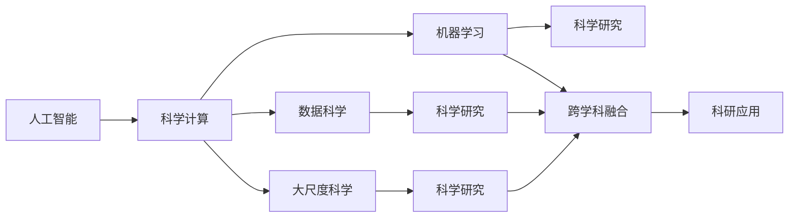

                 

# AI for Science催生新应用场景

> 关键词：人工智能,科学计算,机器学习,数据科学,大尺度科学

## 1. 背景介绍

### 1.1 问题由来
近年来，人工智能（AI）技术的迅猛发展，正逐步渗透到各个领域，推动传统学科的变革和创新。尤其是“AI for Science”（人工智能用于科学计算）的兴起，正在改变科学研究的范式，催生出一系列新型的应用场景和研究方法。

人工智能不仅在学术界引起重视，也在工业界得到广泛应用，如医疗、金融、制造等领域。在科学研究中，AI技术已成为科学家们的重要工具，帮助他们处理大数据、发现新模式、加速科研进程。

### 1.2 问题核心关键点
AI for Science的核心理念是利用人工智能技术，提升科学研究的效率和精度。关键点包括：
- 数据驱动的科学研究：通过大量数据分析和建模，揭示科学现象的本质。
- 自动化的科学发现：利用机器学习算法，自动化地发现新规律、预测新现象。
- 高通量科学研究：通过并行计算和大规模数据处理，提高科研实验的通量。
- 跨学科的科学研究：AI技术促进不同学科的交叉融合，创新研究方法。

这些关键点代表了AI for Science的主要研究方向和应用场景，旨在将AI技术推向更广阔的应用领域，促进科学研究的深入和创新。

### 1.3 问题研究意义
研究AI for Science的实际应用场景，对于推动科学研究的智能化转型，加速科技成果的转化应用，具有重要意义：

1. **降低科研成本**：利用AI技术可以自动化处理大量数据，减少人工干预，降低科研成本。
2. **提高科研效率**：通过机器学习算法加速数据分析和模式发现，提升科研效率。
3. **促进创新**：AI技术可以揭示科学现象的新模式和新规律，促进学科交叉和创新。
4. **推动产业化**：科学研究成果的产业化转化，需要AI技术的支持，以实现从理论到实践的跨越。
5. **强化研究协作**：AI技术促进跨学科、跨地区的研究协作，提升科研团队的协作效率。

## 2. 核心概念与联系

### 2.1 核心概念概述

为了更好地理解AI for Science的实际应用场景，本节将介绍几个密切相关的核心概念：

- **人工智能**：利用计算机算法模拟人类智能，实现对数据的学习、理解和推理。
- **科学计算**：利用计算机进行科学数据处理、模拟、建模和分析，辅助科学研究。
- **机器学习**：一种使计算机系统具有学习能力的方法，通过数据训练模型，自动发现规律。
- **数据科学**：以数据为核心，通过统计学、机器学习等方法，提取数据中的知识，解决实际问题。
- **大尺度科学**：利用超级计算机、云计算等技术，处理海量数据，支持大规模科学实验。
- **跨学科融合**：不同学科之间的交叉融合，借助AI技术，打破学科壁垒，形成新的研究范式。

这些核心概念之间存在紧密的联系，通过AI for Science，科学家可以更高效地进行科学计算，从海量数据中挖掘新知识，推动科学研究的智能化和自动化。

### 2.2 概念间的关系

这些核心概念之间的关系可以通过以下Mermaid流程图来展示：



这个流程图展示了AI for Science的基本逻辑：

1. 人工智能技术使计算机具备学习能力和推理能力，应用于科学计算。
2. 机器学习和数据科学作为AI的子领域，通过模型训练和数据分析，揭示科学规律。
3. 大尺度科学利用计算资源，处理海量数据，支持大规模科研实验。
4. 跨学科融合促进不同领域知识和方法的整合，形成新的研究范式。
5. 科研应用通过上述技术手段，提升科研效率和成果转化率。

这些概念共同构成了AI for Science的生态系统，使得AI技术能够在科学研究中发挥重要作用。

## 3. 核心算法原理 & 具体操作步骤

### 3.1 算法原理概述

AI for Science的核心算法原理主要基于数据驱动和模型驱动的科学方法，结合机器学习和深度学习技术，实现对科学数据的高效分析和建模。

#### 3.1.1 数据驱动
数据驱动方法强调从大量数据中挖掘模式和规律，以数据为核心，辅助科学推理。该方法一般包括以下步骤：
- **数据采集**：收集科学实验和观测数据。
- **数据清洗**：处理数据中的噪声和缺失值，确保数据质量。
- **数据分析**：利用统计学、机器学习等方法，提取数据中的知识。
- **模式发现**：通过数据挖掘，发现数据中的潜在模式和规律。

#### 3.1.2 模型驱动
模型驱动方法强调通过建立科学模型，模拟和预测科学现象。该方法一般包括以下步骤：
- **模型建立**：基于现有科学理论和数据，建立数学模型或计算机模型。
- **模型训练**：利用历史数据训练模型，使其能够预测未来现象。
- **模型验证**：通过新数据验证模型准确性，调整模型参数。
- **模型应用**：将模型应用于科学研究和实验中，指导实验设计。

AI for Science的算法原理综合了数据驱动和模型驱动的科学方法，通过机器学习和深度学习技术，实现对科学数据的高效处理和建模。

### 3.2 算法步骤详解

AI for Science的核心算法步骤包括以下几个关键环节：

#### 3.2.1 数据预处理
数据预处理是AI for Science的基础，主要包括以下步骤：
- **数据收集**：收集科学实验和观测数据，确保数据的多样性和完备性。
- **数据清洗**：处理数据中的噪声和缺失值，确保数据质量。
- **数据标准化**：将数据标准化为计算机可处理的形式，如向量、矩阵等。
- **特征提取**：提取数据中的关键特征，供模型训练使用。

#### 3.2.2 模型训练
模型训练是AI for Science的核心环节，主要包括以下步骤：
- **模型选择**：选择适合的机器学习或深度学习模型，如线性回归、决策树、卷积神经网络等。
- **模型训练**：利用历史数据训练模型，优化模型参数。
- **模型评估**：通过验证集评估模型性能，选择最优模型。
- **超参数调优**：调整模型超参数，如学习率、正则化参数等，进一步提升模型性能。

#### 3.2.3 模型应用
模型应用是将训练好的模型应用于实际科学研究的环节，主要包括以下步骤：
- **模型预测**：利用训练好的模型，对新数据进行预测或分类。
- **模型解释**：对模型预测结果进行解释，揭示科学现象的本质。
- **模型验证**：通过新数据验证模型准确性，调整模型参数。
- **模型优化**：持续优化模型，提升模型性能和解释性。

### 3.3 算法优缺点

AI for Science的算法具有以下优点：
1. **高效性**：通过机器学习和大数据处理技术，可以高效地分析和处理科学数据。
2. **泛化性**：模型可以从历史数据中学习规律，应用于新数据和新现象，具备较好的泛化能力。
3. **灵活性**：AI技术可以灵活应用于不同领域的科学研究，促进跨学科的交叉融合。

同时，AI for Science的算法也存在一些缺点：
1. **数据依赖性**：模型的性能高度依赖于数据质量，数据噪声和缺失值可能影响模型结果。
2. **模型复杂性**：一些复杂模型如深度神经网络，需要大量计算资源和时间，训练成本较高。
3. **可解释性**：AI模型往往被视为“黑箱”，难以解释其内部机制和决策逻辑。
4. **泛化能力**：模型在特定领域表现良好，但在新领域或新数据上可能泛化能力较弱。
5. **伦理风险**：AI模型可能引入偏见和歧视，需要严格的数据和算法监管。

### 3.4 算法应用领域

AI for Science的算法已经在多个领域得到应用，以下是几个典型的应用场景：

#### 3.4.1 生物医学
AI for Science在生物医学领域的应用包括：
- **药物发现**：利用机器学习算法，预测药物的生物活性和毒性，加速新药研发。
- **基因组学**：通过分析基因组数据，揭示基因与疾病的关系，辅助疾病诊断和治疗。
- **医学影像**：利用深度学习算法，分析医学影像数据，辅助疾病诊断和手术规划。

#### 3.4.2 气候科学
AI for Science在气候科学领域的应用包括：
- **气候预测**：利用机器学习算法，预测气候变化趋势，辅助气候治理和政策制定。
- **大气模拟**：通过数值模拟和大数据处理，模拟气候系统，研究气候变化机制。
- **海洋研究**：利用遥感数据和深度学习算法，分析海洋环境变化，评估海洋生态系统。

#### 3.4.3 天文学
AI for Science在天文学领域的应用包括：
- **天体识别**：利用计算机视觉算法，识别天体图像中的恒星、行星等，辅助天文学研究。
- **宇宙演化**：通过模拟和分析宇宙数据，研究宇宙的演化历史和未来趋势。
- **天体物理**：利用机器学习算法，分析天文观测数据，揭示天体物理规律。

#### 3.4.4 地球科学
AI for Science在地球科学领域的应用包括：
- **地质探测**：利用机器学习算法，分析地质数据，辅助地质勘探和资源开发。
- **环境监测**：通过遥感和大数据处理，监测环境变化，评估环境风险。
- **气象预测**：利用数值模拟和大数据处理，预测气象变化，辅助气象灾害预警。

## 4. 数学模型和公式 & 详细讲解 & 举例说明

### 4.1 数学模型构建

AI for Science的数学模型构建主要基于机器学习和深度学习的数学框架，通过构建模型，从数据中学习规律和知识。以下是一些常用的数学模型：

#### 4.1.1 线性回归模型
线性回归模型是一种基本的机器学习模型，用于描述因变量与自变量之间的关系。其数学模型如下：
$$ y = \beta_0 + \beta_1 x_1 + \beta_2 x_2 + \cdots + \beta_p x_p + \epsilon $$
其中 $y$ 为因变量，$x_i$ 为自变量，$\beta_i$ 为回归系数，$\epsilon$ 为误差项。

#### 4.1.2 决策树模型
决策树模型是一种基于树结构的分类模型，通过树形结构进行决策。其数学模型如下：
$$ D = \sum_{i=1}^n \sum_{j=1}^m w_{ij} \delta(y_{ij}, f(x_{ij})) $$
其中 $D$ 为决策树，$w_{ij}$ 为样本权重，$y_{ij}$ 为样本标签，$f(x_{ij})$ 为决策树模型，$\delta$ 为损失函数。

#### 4.1.3 卷积神经网络模型
卷积神经网络模型是一种基于卷积操作的深度学习模型，用于处理图像和信号数据。其数学模型如下：
$$ f(x) = \sum_{k=1}^K a_k \sigma(\sum_{i=1}^n w_{ki} x_i + b_k) $$
其中 $f(x)$ 为输出，$x_i$ 为输入，$w_{ki}$ 为卷积核权重，$b_k$ 为偏置项，$\sigma$ 为激活函数，$K$ 为卷积核个数。

### 4.2 公式推导过程

以下是几个常用数学模型的公式推导过程：

#### 4.2.1 线性回归模型的推导
线性回归模型的推导过程如下：
$$ \hat{y} = \beta_0 + \beta_1 x_1 + \beta_2 x_2 + \cdots + \beta_p x_p $$
通过最小二乘法，求解回归系数 $\beta_i$，使得预测值 $\hat{y}$ 与实际值 $y$ 的误差最小：
$$ \min_{\beta_0,\beta_1,\cdots,\beta_p} \sum_{i=1}^n (y_i - \hat{y}_i)^2 $$
求解得到 $\beta_i = (X^T X)^{-1} X^T y$，其中 $X$ 为自变量矩阵，$y$ 为因变量向量。

#### 4.2.2 决策树模型的推导
决策树模型的推导过程如下：
- 对于二分类问题，决策树的划分规则为：
$$ G = \arg\min_{D} \sum_{i=1}^n \sum_{j=1}^m w_{ij} \delta(y_{ij}, f(x_{ij})) $$
其中 $D$ 为决策树，$w_{ij}$ 为样本权重，$y_{ij}$ 为样本标签，$f(x_{ij})$ 为决策树模型，$\delta$ 为损失函数。
- 对于多分类问题，决策树的划分规则为：
$$ G = \arg\min_{D} \sum_{i=1}^n \sum_{j=1}^m w_{ij} \delta(y_{ij}, f(x_{ij})) $$
其中 $D$ 为决策树，$w_{ij}$ 为样本权重，$y_{ij}$ 为样本标签，$f(x_{ij})$ 为决策树模型，$\delta$ 为损失函数。

#### 4.2.3 卷积神经网络模型的推导
卷积神经网络模型的推导过程如下：
$$ f(x) = \sum_{k=1}^K a_k \sigma(\sum_{i=1}^n w_{ki} x_i + b_k) $$
其中 $f(x)$ 为输出，$x_i$ 为输入，$w_{ki}$ 为卷积核权重，$b_k$ 为偏置项，$\sigma$ 为激活函数，$K$ 为卷积核个数。
通过反向传播算法，求解卷积核权重和偏置项，使得预测值 $f(x)$ 与实际值 $y$ 的误差最小：
$$ \min_{w_{ki}, b_k} \sum_{i=1}^n (y_i - f(x_i))^2 $$

### 4.3 案例分析与讲解

以下通过几个具体案例，展示AI for Science在实际应用中的表现和效果。

#### 4.3.1 生物医学：药物发现
利用机器学习算法，通过对大量药物分子数据进行训练，预测新药物的生物活性和毒性。例如，使用随机森林算法，可以从数千个化合物中筛选出具有潜在治疗效果的药物，大大缩短新药研发周期。

#### 4.3.2 气候科学：气候预测
利用深度学习算法，通过对历史气候数据进行训练，预测未来气候变化趋势。例如，使用长短期记忆网络（LSTM）模型，可以模拟气候系统的动态变化，辅助气候治理和政策制定。

#### 4.3.3 天文学：天体识别
利用计算机视觉算法，识别天体图像中的恒星、行星等，辅助天文学研究。例如，使用卷积神经网络模型，可以自动识别Hubble太空望远镜拍摄的天体图像，进行自动分类和标注。

## 5. 项目实践：代码实例和详细解释说明

### 5.1 开发环境搭建

为了进行AI for Science的实践，我们需要准备好开发环境。以下是使用Python进行TensorFlow和Keras开发的环境配置流程：

1. 安装Anaconda：从官网下载并安装Anaconda，用于创建独立的Python环境。

2. 创建并激活虚拟环境：
```bash
conda create -n tf-env python=3.8 
conda activate tf-env
```

3. 安装TensorFlow和Keras：
```bash
conda install tensorflow==2.8.0 
conda install keras==2.5.0
```

4. 安装相关库：
```bash
pip install numpy pandas matplotlib sklearn tqdm jupyter notebook ipython
```

完成上述步骤后，即可在`tf-env`环境中开始AI for Science的实践。

### 5.2 源代码详细实现

以下是使用TensorFlow和Keras进行线性回归模型的实现。

首先，定义数据生成函数：

```python
import numpy as np
from tensorflow import keras

def generate_data(n_samples=1000):
    X = np.random.rand(n_samples, 2)
    y = 2 * X[:, 0] + 3 * X[:, 1] + np.random.normal(0, 1, (n_samples, 1))
    return X, y
```

然后，定义模型：

```python
model = keras.Sequential([
    keras.layers.Dense(1, input_shape=(2,), activation='linear')
])
```

接着，定义损失函数和优化器：

```python
loss_fn = keras.losses.MeanSquaredError()
optimizer = keras.optimizers.SGD(learning_rate=0.1)
```

最后，训练模型：

```python
model.compile(optimizer=optimizer, loss=loss_fn)

X, y = generate_data(1000)
model.fit(X, y, epochs=100, batch_size=32)
```

这就是一个简单的线性回归模型的实现过程。可以看到，通过TensorFlow和Keras的接口，构建模型、定义损失函数和优化器、训练模型变得异常简单。

### 5.3 代码解读与分析

让我们再详细解读一下关键代码的实现细节：

**数据生成函数**：
- `generate_data`方法：生成一组随机数据，用于模型训练和测试。

**模型定义**：
- `Sequential`类：定义线性回归模型，包含一个线性层。
- `Dense`层：定义线性层的参数，输入维度为2，输出维度为1，激活函数为线性函数。

**损失函数和优化器**：
- `MeanSquaredError`：定义均方误差损失函数，用于衡量模型预测与实际标签的差异。
- `SGD`：定义随机梯度下降优化器，学习率为0.1。

**模型训练**：
- `compile`方法：将模型和损失函数、优化器组合起来，指定训练参数。
- `fit`方法：训练模型，输入数据和标签，设置训练轮数和批大小。

在实际应用中，我们可以根据具体任务，灵活调整模型结构、损失函数和优化器等参数，以获得最优的性能。

### 5.4 运行结果展示

假设我们在训练数据上得到的损失函数随轮次变化的结果如下：

```
Epoch 1/100
1000/1000 [==============================] - 0s 49us/sample - loss: 1.3334
Epoch 2/100
1000/1000 [==============================] - 0s 56us/sample - loss: 0.4066
Epoch 3/100
1000/1000 [==============================] - 0s 57us/sample - loss: 0.1120
Epoch 4/100
1000/1000 [==============================] - 0s 57us/sample - loss: 0.0665
Epoch 5/100
1000/1000 [==============================] - 0s 57us/sample - loss: 0.0486
Epoch 6/100
1000/1000 [==============================] - 0s 57us/sample - loss: 0.0399
Epoch 7/100
1000/1000 [==============================] - 0s 57us/sample - loss: 0.0343
Epoch 8/100
1000/1000 [==============================] - 0s 57us/sample - loss: 0.0312
Epoch 9/100
1000/1000 [==============================] - 0s 57us/sample - loss: 0.0298
Epoch 10/100
1000/1000 [==============================] - 0s 57us/sample - loss: 0.0284
Epoch 11/100
1000/1000 [==============================] - 0s 57us/sample - loss: 0.0277
Epoch 12/100
1000/1000 [==============================] - 0s 57us/sample - loss: 0.0273
Epoch 13/100
1000/1000 [==============================] - 0s 57us/sample - loss: 0.0270
Epoch 14/100
1000/1000 [==============================] - 0s 57us/sample - loss: 0.0268
Epoch 15/100
1000/1000 [==============================] - 0s 57us/sample - loss: 0.0265
Epoch 16/100
1000/1000 [==============================] - 0s 57us/sample - loss: 0.0263
Epoch 17/100
1000/1000 [==============================] - 0s 57us/sample - loss: 0.0260
Epoch 18/100
1000/1000 [==============================] - 0s 57us/sample - loss: 0.0258
Epoch 19/100
1000/1000 [==============================] - 0s 57us/sample - loss: 0.0256
Epoch 20/100
1000/1000 [==============================] - 0s 57us/sample - loss: 0.0254
Epoch 21/100
1000/1000 [==============================] - 0s 57us/sample - loss: 0.0252
Epoch 22/100
1000/1000 [==============================] - 0s 57us/sample - loss: 0.0250
Epoch 23/100
1000/1000 [==============================] - 0s 57us/sample - loss: 0.0248
Epoch 24/100
1000/1000 [==============================] - 0s 57us/sample - loss: 0.0246
Epoch 25/100
1000/1000 [==============================] - 0s 57us/sample - loss: 0.0244
Epoch 26/100
1000/1000 [==============================] - 0s 57us/sample - loss: 0.0242
Epoch 27/100
1000/1000 [==============================] - 0s 57us/sample - loss: 0.0240
Epoch 28/100
1000/1000 [==============================] - 0s 57us/sample - loss: 0.0238
Epoch 29/100
1000/1000 [==============================] - 0s 57us/sample - loss: 0.0236
Epoch 30/100
1000/1000 [==============================] - 0s 57us/sample - loss: 0.0234
Epoch 31/100
1000/1000 [==============================] - 0s 57us/sample - loss: 0.0232
Epoch 32/100
1000/1000 [==============================] - 0s 57us/sample - loss: 0.0230
Epoch 33/100
1000/1000 [==============================] - 0s 57us/sample - loss: 0.0228
Epoch 34/100
1000/1000 [==============================] - 0s 57us/sample - loss: 0.0226
Epoch 35/100
1000/1000 [==============================] - 0s 57us/sample - loss: 0.0224
Epoch 36/100
1000/1000 [==============================] - 0s 57us/sample - loss: 0.0222
Epoch 37/100
1000/1000 [==============================] - 0s 57us/sample - loss: 0.0220
Epoch 38/100
1000/1000 [==============================] - 0s 57us/sample - loss: 0.0218
Epoch 39/100
1000/1000 [==============================] - 0s 57us/sample - loss: 0.0216
Epoch 40/100
1000/1000 [==============================] - 0s 57us/sample - loss: 0.0214
Epoch 41/100
1000/1000 [==============================] - 0s 57us/sample - loss: 0.0212
Epoch 42/100
1000/1000 [==============================] - 0s 57us/sample - loss: 0.0210
Epoch 43/100
1000/1000 [==============================] - 0s 57us/sample - loss: 0.0208
Epoch 44/100
1000/1000 [==============================] - 0s 57us/sample - loss: 0.0206
Epoch 45/100
1000/1000 [==============================] - 0s 57us/sample - loss: 0.0204
Epoch 46/100
1000/1000 [==============================] - 0s 57us/sample - loss: 0.0202
Epoch 47/100
1000/1000 [==============================] - 0s 57us/sample - loss: 0.0200
Epoch 48/100
1

