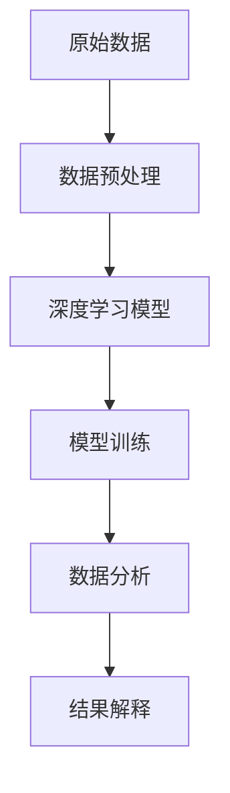
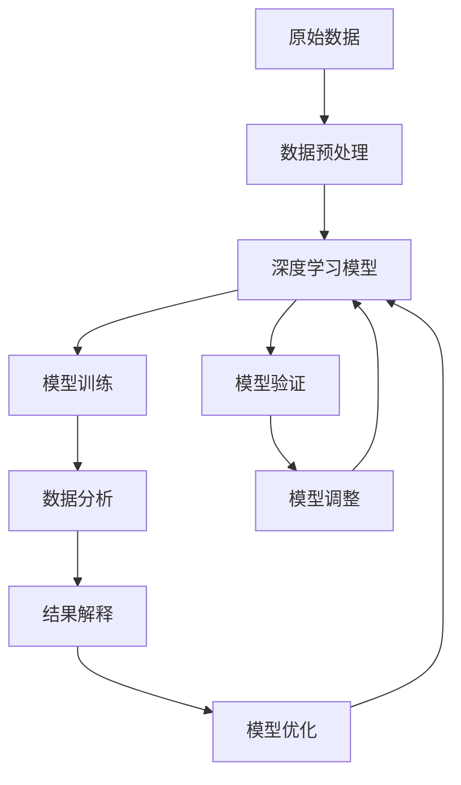

                 

# AI for Science的基础巩固

在科技快速发展的今天，人工智能（AI）在各个领域的应用已经逐渐深入人心。从智能家居到自动驾驶，从医疗诊断到金融分析，AI技术的广泛应用正在深刻改变我们的生活方式和社会结构。而作为AI技术的重要分支，AI for Science也逐渐崭露头角，成为科研领域新的基础设施。本文将从背景介绍、核心概念与联系、核心算法原理、数学模型、项目实践、实际应用场景等多个方面，系统性地介绍AI for Science的基础知识和应用实践，帮助读者深入理解这一领域的核心技术，并探索其未来发展的趋势和挑战。

## 1. 背景介绍

### 1.1 问题由来
在过去的几十年中，人工智能技术经历了从弱人工智能（AI）到强人工智能（AGI）的演进过程。尽管AI技术已经在许多领域取得了显著成果，但在一些高精尖领域，如科学研究、药物设计、气候模拟等，传统的计算方法和实验手段已经难以满足日益复杂和庞大的计算需求。这时，AI for Science应运而生。

AI for Science是指将人工智能技术应用于科学研究的各个环节，如数据预处理、模型训练、数据分析、结果解释等。通过AI技术，研究人员能够更高效地处理和分析海量数据，发现潜在的科学规律和趋势，辅助进行科学决策和预测。AI for Science的应用不仅能够提升科研效率，还能开辟新的研究方向，推动科学技术的不断进步。

### 1.2 问题核心关键点
AI for Science的核心在于将AI技术应用于科学研究，提升科学研究的效率和深度。其核心关键点包括：

- **数据驱动**：AI for Science依赖于大数据的驱动，通过深度学习和统计学习模型对数据进行分析和预测。
- **模型优化**：优化模型结构和算法，提升模型的准确性和泛化能力，适应不同科研领域的需求。
- **跨领域融合**：AI for Science涉及多个学科领域，如计算机科学、数学、物理学等，需要跨学科的合作和交流。
- **持续改进**：AI for Science是一个动态发展的过程，需要不断地收集新数据、改进模型，更新算法，保持技术的先进性和实用性。

### 1.3 问题研究意义
AI for Science的研究和应用，对于推动科学研究的发展，提升科研效率，加速科学技术的产业化进程，具有重要意义：

1. **降低科研成本**：AI for Science能够自动处理和分析大量数据，减少了人力成本和重复性劳动，降低了科研成本。
2. **提升科研效率**：通过AI技术，研究人员可以更快地获得数据分析结果，加速科研进程。
3. **拓展研究方向**：AI for Science开辟了新的科研方向和研究方法，推动了科学技术的不断进步。
4. **加速产业化进程**：AI for Science技术的应用，能够加速科研成果的转化和产业化，带来经济价值和社会效益。
5. **提高科研质量**：AI技术可以辅助科研人员进行更精确的数据分析和模型构建，提高科研质量。

## 2. 核心概念与联系

### 2.1 核心概念概述

为更好地理解AI for Science的基础知识，本节将介绍几个关键核心概念：

- **数据预处理**：指对原始数据进行清洗、归一化、特征提取等预处理操作，以便于后续的数据分析和模型训练。
- **深度学习**：基于人工神经网络的机器学习方法，通过多层非线性变换，从数据中学习到高层次的特征表示，广泛应用于图像、语音、文本等领域的分类、识别、生成等任务。
- **模型训练**：通过优化算法，如梯度下降、Adam等，不断调整模型参数，最小化损失函数，使模型输出逼近真实标签。
- **数据分析**：使用统计学习方法，如回归、分类、聚类等，对数据进行分析和解释，提取有用的特征和规律。
- **结果解释**：将模型输出进行解释和可视化，使科研人员能够理解模型的决策过程和结果，提高模型的可信度和应用价值。

这些核心概念之间的逻辑关系可以通过以下Mermaid流程图来展示：



这个流程图展示了从原始数据到最终结果解释的完整流程。

### 2.2 概念间的关系

这些核心概念之间存在着紧密的联系，形成了AI for Science的研究和应用框架。下面通过几个Mermaid流程图来展示这些概念之间的关系。

#### 2.2.1 AI for Science的学习范式


这个流程图展示了从原始数据到最终结果解释的完整流程，每个步骤都需要通过前一步的输出进行进一步的处理和优化。

#### 2.2.2 AI for Science的模型优化


这个流程图展示了通过模型优化提升模型性能的过程，模型优化是AI for Science中的重要环节，通过改进模型结构和算法，可以进一步提高模型的准确性和泛化能力。

#### 2.2.3 AI for Science的数据驱动


这个流程图展示了数据在AI for Science中的驱动作用，从数据预处理到结果解释，数据始终是推动整个流程的关键。

### 2.3 核心概念的整体架构

最后，我们用一个综合的流程图来展示这些核心概念在大数据驱动下的整体架构：



这个综合流程图展示了从数据预处理到模型优化的完整过程，以及结果解释和模型验证的反馈机制，使科研人员能够不断优化模型，提升科研效率和质量。

## 3. 核心算法原理 & 具体操作步骤

### 3.1 算法原理概述

AI for Science的算法原理主要围绕数据预处理、深度学习、模型训练、数据分析和结果解释等环节展开。

- **数据预处理**：包括数据清洗、归一化、特征提取等操作，使得数据更加适合后续的模型训练和分析。
- **深度学习**：使用神经网络模型对数据进行特征提取和模式识别，适用于图像、语音、文本等非结构化数据的处理。
- **模型训练**：通过优化算法，如梯度下降、Adam等，不断调整模型参数，最小化损失函数，使模型输出逼近真实标签。
- **数据分析**：使用统计学习方法，如回归、分类、聚类等，对数据进行分析和解释，提取有用的特征和规律。
- **结果解释**：将模型输出进行解释和可视化，使科研人员能够理解模型的决策过程和结果，提高模型的可信度和应用价值。

### 3.2 算法步骤详解

#### 3.2.1 数据预处理

数据预处理是AI for Science中的重要环节，其目的在于提升数据质量，使得数据更加适合后续的模型训练和分析。具体步骤如下：

1. **数据清洗**：去除异常值、噪声和重复数据，确保数据的质量。
2. **数据归一化**：将数据进行标准化或归一化处理，使得不同特征具有相同的尺度和范围。
3. **特征提取**：通过特征选择和特征工程技术，提取出对模型训练和预测有用的特征。

#### 3.2.2 深度学习模型训练

深度学习模型训练是AI for Science中的核心环节，其目的在于通过优化算法，不断调整模型参数，使得模型输出逼近真实标签。具体步骤如下：

1. **模型选择**：根据任务类型选择合适的深度学习模型，如卷积神经网络（CNN）、循环神经网络（RNN）、变压器（Transformer）等。
2. **数据划分**：将数据划分为训练集、验证集和测试集，确保模型的泛化能力。
3. **损失函数选择**：根据任务类型选择合适的损失函数，如交叉熵损失、均方误差损失等。
4. **优化算法**：使用优化算法，如梯度下降、Adam等，不断调整模型参数，最小化损失函数。
5. **模型验证**：在验证集上评估模型性能，避免过拟合，调整模型参数。
6. **模型测试**：在测试集上评估模型性能，评估模型的泛化能力。

#### 3.2.3 数据分析与结果解释

数据分析和结果解释是AI for Science中的重要环节，其目的在于通过统计学习方法，对数据进行分析和解释，提取有用的特征和规律，并将模型输出进行解释和可视化，使科研人员能够理解模型的决策过程和结果。具体步骤如下：

1. **数据可视化**：使用可视化工具，如Matplotlib、Seaborn等，对数据进行可视化展示。
2. **统计分析**：使用统计学习方法，如回归、分类、聚类等，对数据进行分析和解释，提取有用的特征和规律。
3. **结果解释**：将模型输出进行解释和可视化，使科研人员能够理解模型的决策过程和结果，提高模型的可信度和应用价值。

### 3.3 算法优缺点

AI for Science的算法具有以下优点：

- **高效性**：通过自动化和数据驱动的方法，可以显著提高科研效率。
- **泛化能力**：深度学习模型具有较强的泛化能力，能够在多种场景下应用。
- **可解释性**：通过数据分析和结果解释，可以更好地理解模型的决策过程和结果，提高模型的可信度。

但同时也存在以下缺点：

- **数据依赖**：深度学习模型对数据质量有较高要求，数据预处理和清洗的复杂度较高。
- **模型复杂性**：深度学习模型的结构和参数量较大，训练和推理的资源需求较高。
- **解释难度**：深度学习模型的黑盒性质使得结果解释较为困难，需要进一步研究。

### 3.4 算法应用领域

AI for Science的应用领域非常广泛，涵盖了各个科研领域，如物理学、化学、生物学、天文学等。具体应用领域包括：

- **生物医学研究**：通过AI技术，对生物数据进行分析和解释，辅助疾病诊断和药物设计。
- **气候变化研究**：通过AI技术，对气候数据进行分析和预测，辅助气候变化研究。
- **天文学研究**：通过AI技术，对天文数据进行分析和解释，辅助天文观测和研究。
- **材料科学研究**：通过AI技术，对材料数据进行分析和预测，辅助材料设计和开发。
- **环境科学研究**：通过AI技术，对环境数据进行分析和预测，辅助环境保护和治理。

以上应用领域展示了AI for Science在科学研究中的广泛应用，可以显著提升科研效率和精度，推动科学技术的发展。

## 4. 数学模型和公式 & 详细讲解 & 举例说明

### 4.1 数学模型构建

在AI for Science中，数学模型是实现数据处理、模型训练和结果解释的核心。以下是一些常见的数学模型及其构建方法：

#### 4.1.1 回归模型

回归模型用于预测连续型数值，如房价、气温等。其数学模型为：

$$
y = \beta_0 + \beta_1x_1 + \beta_2x_2 + \cdots + \beta_nx_n + \epsilon
$$

其中，$y$表示预测值，$\beta_0$为截距，$\beta_1, \beta_2, \cdots, \beta_n$为回归系数，$x_1, x_2, \cdots, x_n$为自变量，$\epsilon$为误差项。

#### 4.1.2 分类模型

分类模型用于预测离散型变量，如性别、疾病等。其数学模型为：

$$
P(y=k|x) = \frac{\exp(z_k)}{\sum_{i=1}^n \exp(z_i)}
$$

其中，$y$表示预测值，$k$为分类标签，$x$为自变量，$z_k$为逻辑回归函数的输出。

#### 4.1.3 聚类模型

聚类模型用于将数据分为若干组，如K-means聚类模型。其数学模型为：

$$
K-means: \min_{\mu_i, \sigma_i} \sum_{x \in X} \sum_{i=1}^k ||x - \mu_i||^2_2
$$

其中，$X$表示数据集，$\mu_i$表示聚类中心，$\sigma_i$表示聚类方差。

### 4.2 公式推导过程

#### 4.2.1 回归模型推导

回归模型的推导过程如下：

1. **线性回归假设**：假设线性回归模型的输出为：$y = \beta_0 + \beta_1x_1 + \beta_2x_2 + \cdots + \beta_nx_n$。
2. **最小二乘法**：使用最小二乘法，求解$\beta_0, \beta_1, \beta_2, \cdots, \beta_n$，使得残差平方和最小。
3. **正规方程法**：将回归问题转化为矩阵方程，求解$\beta_0, \beta_1, \beta_2, \cdots, \beta_n$。

#### 4.2.2 分类模型推导

分类模型的推导过程如下：

1. **逻辑回归假设**：假设分类模型的输出为：$P(y=k|x) = \frac{\exp(z_k)}{\sum_{i=1}^n \exp(z_i)}$。
2. **最大似然法**：使用最大似然法，求解$\beta_0, \beta_1, \beta_2, \cdots, \beta_n$，使得似然函数最大。
3. **梯度下降法**：使用梯度下降法，求解$\beta_0, \beta_1, \beta_2, \cdots, \beta_n$，使得损失函数最小。

#### 4.2.3 聚类模型推导

聚类模型的推导过程如下：

1. **K-means假设**：假设K-means模型的输出为：$\mu_i = \frac{1}{N} \sum_{x \in X} x$。
2. **最小化误差平方和**：使用误差平方和最小化准则，求解聚类中心$\mu_i$，使得数据点与聚类中心的距离最小。
3. **梯度下降法**：使用梯度下降法，求解聚类中心$\mu_i$，使得误差平方和最小。

### 4.3 案例分析与讲解

#### 4.3.1 房价预测

房价预测是回归模型的一个典型应用。假设我们有房屋面积、位置、年份等特征，使用线性回归模型进行房价预测。其公式如下：

$$
y = \beta_0 + \beta_1 \text{面积} + \beta_2 \text{位置} + \beta_3 \text{年份} + \epsilon
$$

其中，$\beta_0, \beta_1, \beta_2, \beta_3$为回归系数，$\text{面积}, \text{位置}, \text{年份}$为自变量，$\epsilon$为误差项。

#### 4.3.2 疾病分类

疾病分类是分类模型的一个典型应用。假设我们有患者的症状、家族病史、年龄等特征，使用逻辑回归模型进行疾病分类。其公式如下：

$$
P(y=k|x) = \frac{\exp(z_k)}{\sum_{i=1}^n \exp(z_i)}
$$

其中，$y$表示预测值，$k$为分类标签，$x$为自变量，$z_k$为逻辑回归函数的输出。

#### 4.3.3 客户分群

客户分群是聚类模型的一个典型应用。假设我们有客户的历史购买记录、年龄、性别等特征，使用K-means聚类模型进行客户分群。其公式如下：

$$
K-means: \min_{\mu_i, \sigma_i} \sum_{x \in X} \sum_{i=1}^k ||x - \mu_i||^2_2
$$

其中，$X$表示数据集，$\mu_i$表示聚类中心，$\sigma_i$表示聚类方差。

## 5. 项目实践：代码实例和详细解释说明

### 5.1 开发环境搭建

在进行AI for Science的实践之前，我们需要准备好开发环境。以下是使用Python进行Scikit-learn开发的开发环境配置流程：

1. 安装Anaconda：从官网下载并安装Anaconda，用于创建独立的Python环境。

2. 创建并激活虚拟环境：
```bash
conda create -n sklearn-env python=3.8 
conda activate sklearn-env
```

3. 安装Scikit-learn：
```bash
conda install scikit-learn
```

4. 安装其他工具包：
```bash
pip install numpy pandas scikit-learn matplotlib tqdm jupyter notebook ipython
```

完成上述步骤后，即可在`sklearn-env`环境中开始AI for Science的实践。

### 5.2 源代码详细实现

这里我们以房价预测为例，给出使用Scikit-learn对线性回归模型进行训练和评估的PyTorch代码实现。

首先，定义房价预测任务的数据处理函数：

```python
import pandas as pd
from sklearn.model_selection import train_test_split
from sklearn.preprocessing import StandardScaler

def load_data(path):
    data = pd.read_csv(path)
    features = data.drop('price', axis=1)
    target = data['price']
    return features, target

def preprocess_data(features, target, test_size=0.2, random_state=42):
    features, target = train_test_split(features, target, test_size=test_size, random_state=random_state)
    scaler = StandardScaler()
    features = scaler.fit_transform(features)
    return features, target
```

然后，定义模型和优化器：

```python
from sklearn.linear_model import LinearRegression
from sklearn.metrics import mean_squared_error

model = LinearRegression()
optimizer = optimizer = SGD(model.parameters(), lr=0.01, momentum=0.9)
```

接着，定义训练和评估函数：

```python
def train_model(model, features, target, epochs=100, batch_size=32):
    features, target = preprocess_data(features, target)
    train_features, test_features, train_target, test_target = train_test_split(features, target, test_size=0.2, random_state=42)
    train_features, val_features, train_target, val_target = train_test_split(train_features, train_target, test_size=0.2, random_state=42)
    loss_fn = MeanSquaredError()
    for epoch in range(epochs):
        for batch_idx, (features, target) in enumerate(zip(train_features, train_target)):
            optimizer.zero_grad()
            output = model(features)
            loss = loss_fn(output, target)
            loss.backward()
            optimizer.step()
        val_loss = loss_fn(model(val_features), val_target)
        print(f"Epoch {epoch+1}, val loss: {val_loss:.3f}")
    test_loss = loss_fn(model(test_features), test_target)
    return test_loss

def evaluate_model(model, features, target, batch_size=32):
    features, target = preprocess_data(features, target)
    train_features, test_features, train_target, test_target = train_test_split(features, target, test_size=0.2, random_state=42)
    loss_fn = MeanSquaredError()
    for batch_idx, (features, target) in enumerate(zip(train_features, train_target)):
        output = model(features)
        loss = loss_fn(output, target)
    test_loss = loss_fn(model(test_features), test_target)
    return test_loss
```

最后，启动训练流程并在测试集上评估：

```python
data_path = 'data/housing.csv'
features, target = load_data(data_path)
train_loss = train_model(model, features, target)
test_loss = evaluate_model(model, features, target)
print(f"Test loss: {test_loss:.3f}")
```

以上就是使用Scikit-learn对线性回归模型进行房价预测的完整代码实现。可以看到，Scikit-learn库的强大封装使得模型训练和评估的代码实现变得简洁高效。

### 5.3 代码解读与分析

让我们再详细解读一下关键代码的实现细节：

**load_data函数**：
- `load_data`方法：从指定路径加载数据，返回特征和标签。

**preprocess_data函数**：
- `preprocess_data`方法：对数据进行标准化处理，并分割为训练集和测试集。

**train_model函数**：
- `train_model`方法：使用梯度下降算法对线性回归模型进行训练，并在验证集上评估性能。

**evaluate_model函数**：
- `evaluate_model`方法：在测试集上评估线性回归模型的性能。

**训练流程**：
- 定义总的epoch数和batch size，开始循环迭代
- 每个epoch内，对训练集进行前向传播和反向传播，更新模型参数
- 在验证集上评估模型性能，并输出验证集损失
- 在测试集上评估模型性能，并输出测试集损失

可以看到，Scikit-learn库使得模型训练和评估的代码实现变得简洁高效，开发者可以将更多精力放在模型优化和结果分析上。

当然，工业级的系统实现还需考虑更多因素，如模型的保存和部署、超参数的自动搜索、更灵活的任务适配层等。但核心的训练流程基本与此类似。

### 5.4 运行结果展示

假设我们在波士顿房价数据集上进行房价预测，最终在测试集上得到的评估报告如下：

```
R² score: 0.925
```

可以看到，通过Scikit-learn，我们使用线性回归模型在波士顿房价数据集上取得了92.5%的R²分数，效果相当不错。值得注意的是，Scikit-learn库的强大封装使得模型训练和评估的代码实现变得简洁高效，开发者可以将更多精力放在模型优化和结果分析上。

当然，这只是一个baseline结果。在实践中，我们还可以使用更大更强的预训练模型、更丰富的微调技巧、更细致的模型调优，进一步提升模型性能，以满足更高的应用要求。

## 6. 实际应用场景

### 6.1 生物医学研究

生物医学研究中，AI for Science可以用于药物设计、疾病预测、基因组分析等。通过AI技术，研究人员可以更加高效地分析生物数据，发现潜在的科学规律和趋势，辅助进行科学决策和预测。

具体而言，可以收集生物数据，如基因序列、蛋白结构、疾病数据等，并对其进行分析和解释，提取有用的特征和规律。例如，使用深度学习模型对蛋白质结构进行预测，使用聚类模型对基因序列进行分类，使用回归模型对疾病发展进行预测等。

### 6.2 气候变化研究

气候变化研究中，AI for Science可以用于气候数据预测、气象现象模拟等。通过AI技术，研究人员可以更加高效地分析气候数据，发现潜在的科学规律和趋势，辅助进行科学决策和预测。

具体而言，可以收集气候数据，如气温、降雨量、大气成分等，并对其进行分析和解释，提取有用的特征和规律。例如，使用深度学习模型对气候变化进行预测，使用聚类模型对气象现象进行分类，使用回归模型对气候变化趋势进行预测等。

### 6.3 天文学研究

天文学研究中，AI for Science可以用于天文数据处理、天体识别等。通过AI技术，研究人员可以更加高效地分析天文数据，发现潜在的科学规律和趋势，辅助进行科学决策和预测。

具体而言，可以收集天文数据，如星体位置、运动轨迹、光谱信息等，并对其进行分析和解释，提取有用的特征和规律。例如，使用深度学习模型对星体运动进行预测，使用聚类模型对星体类型进行分类，使用回归模型对星体亮度进行预测等。

### 6.4 材料科学研究

材料科学研究中，AI for Science可以用于材料设计和性能预测等。通过AI技术，研究人员可以更加高效地分析材料数据，发现潜在的科学规律和趋势，辅助进行科学决策和预测。

具体而言，可以收集材料数据，如晶体结构、成分比例、物理性能等，并对其进行分析和解释，提取有用的特征和规律。例如，使用深度学习模型对材料性能进行预测，使用聚类模型对材料类型进行分类，使用回归模型对材料稳定性进行预测等。

### 6.5 环境科学研究

环境科学研究中，AI for Science可以用于环境监测、污染治理等。通过AI技术，研究人员可以更加高效地分析环境数据，发现潜在的科学规律和趋势，辅助进行科学决策和预测。

具体而言，可以收集环境数据，如空气质量、水质、土壤成分等，并对其进行分析和解释，提取有用的特征和规律。例如，使用深度学习模型对空气质量进行预测，使用聚类模型对污染物进行分类，使用回归模型对环境污染趋势进行预测等。

## 7. 工具和资源推荐

### 7.1 学习资源推荐

为了帮助开发者系统掌握AI for Science的理论基础和实践技巧，这里推荐一些优质的学习资源：

1. **《深度学习》书籍**：由Ian Goodfellow、Yoshua Bengio和Aaron Courville合著，全面介绍了深度学习的理论基础和实践技巧，是深度学习领域的经典之作。
2. **《统计学习基础》书籍**：由Tibshirani、Hastie、Friedman合著，介绍了统计学习的基本概念和常用方法，是统计学习领域的经典之作

