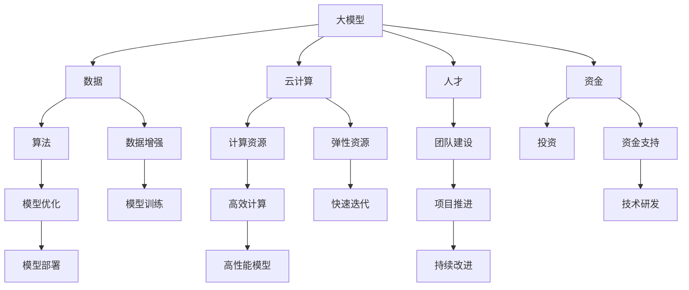

                 

# AI 大模型创业：如何利用资源优势？

> 关键词：
- 大模型
- 创业
- 资源优势
- 人工智能
- 云计算
- 数据
- 算法
- 投资

## 1. 背景介绍

人工智能（AI）正在深刻改变全球经济和社会结构，其中大模型（Large Models）的兴起无疑是最令人瞩目的一环。大模型利用深度学习、自然语言处理等技术，能够高效处理大量数据，提升任务完成效率和质量。随着技术的日渐成熟，越来越多的企业和创业者开始尝试基于大模型的创业项目。然而，大模型创业不仅需要先进的技术，更依赖于充足的资源支持。那么，如何在有限的资源环境下，最大化利用资源优势，推动大模型创业项目成功落地呢？本文将从技术、资源、市场等多个维度进行深入探讨。

## 2. 核心概念与联系

### 2.1 核心概念概述

在深入讨论如何利用资源优势前，首先需要理解以下核心概念：

- **大模型（Large Models）**：指那些参数量达数亿甚至数十亿的深度学习模型，如BERT、GPT-3等。这些模型能够处理大规模数据，并在自然语言处理、计算机视觉等多个领域展现出强大的能力。
- **创业项目（Startups）**：指初创企业或新成立的项目，致力于开发和部署人工智能技术，解决特定问题或提供新服务。
- **资源优势（Resource Advantage）**：指在创业过程中能够有效利用和整合的各类资源，包括数据、计算资源、人才、资金等。
- **云计算（Cloud Computing）**：一种基于互联网的计算服务，通过弹性资源调配，为企业提供高效、灵活的计算环境。
- **数据（Data）**：人工智能的基础，高质量的数据能够有效提升模型性能。
- **算法（Algorithms）**：解决问题的关键工具，优秀算法能够提高模型训练效率和精度。
- **投资（Investment）**：创业项目启动和发展的资金支持，资金充足能够确保技术研发和市场推广的顺利进行。

这些核心概念构成了大模型创业的基本框架，了解它们的关系是利用资源优势的基础。

### 2.2 核心概念间的关系

下面通过一个简单的Mermaid流程图来展示这些核心概念之间的联系：



从上述流程图中可以看出，大模型的创业过程中，数据、计算资源、人才、资金等各类资源的有效整合和利用，是大模型成功落地的关键。通过合理利用这些资源优势，创业项目能够快速迭代、优化模型，实现商业价值的最大化。

## 3. 核心算法原理 & 具体操作步骤

### 3.1 算法原理概述

大模型的创业项目中，核心算法往往围绕模型的训练和优化展开。以下是几种常见的大模型训练算法及其原理：

1. **监督学习（Supervised Learning）**：通过标注数据训练模型，使其能够预测目标变量。在大模型创业中，监督学习可用于文本分类、情感分析等任务。
2. **无监督学习（Unsupervised Learning）**：在没有标签数据的情况下，通过自组织学习发现数据的内在结构。在大模型创业中，无监督学习可用于数据预处理、特征提取等。
3. **半监督学习（Semi-supervised Learning）**：结合少量标注数据和大量未标注数据进行训练，有效提升模型性能。在大模型创业中，半监督学习可用于标注数据稀缺的任务。
4. **迁移学习（Transfer Learning）**：将一个领域学到的知识迁移到另一个相关领域，提高模型泛化能力。在大模型创业中，迁移学习可用于特定领域的数据集微调。
5. **强化学习（Reinforcement Learning）**：通过与环境交互，不断优化模型行为。在大模型创业中，强化学习可用于自动优化模型参数，提高模型性能。

这些算法在实际应用中需要根据具体的业务场景进行选择和优化，以实现最佳效果。

### 3.2 算法步骤详解

以下以监督学习为例，介绍大模型训练的基本步骤：

1. **数据准备**：收集标注数据，并将其分为训练集、验证集和测试集。
2. **模型选择**：选择合适的预训练模型，如BERT、GPT等，并进行必要的微调。
3. **模型训练**：使用训练集进行模型训练，设置适当的优化器和超参数。
4. **模型验证**：在验证集上评估模型性能，调整超参数和模型结构。
5. **模型测试**：在测试集上测试模型性能，评估模型泛化能力。
6. **模型优化**：根据测试结果，优化模型结构和超参数，提高模型性能。
7. **模型部署**：将训练好的模型部署到实际应用中，进行线上服务。

这些步骤在大模型创业过程中需要不断迭代和优化，以提升模型的性能和稳定性。

### 3.3 算法优缺点

大模型训练算法的主要优点包括：

- **高性能**：利用深度学习技术，能够处理大规模数据，提升模型精度。
- **高泛化能力**：通过迁移学习等技术，模型能够在不同场景下表现良好。
- **灵活性**：算法灵活，可以根据具体业务需求进行调整和优化。

然而，这些算法也存在一些缺点：

- **数据依赖**：需要大量标注数据，数据采集成本高。
- **计算资源需求大**：训练过程需要大量计算资源，部署成本高。
- **过拟合风险**：在数据量不足的情况下，容易发生过拟合。
- **模型可解释性差**：大模型往往被视为"黑盒"，难以解释其决策过程。

### 3.4 算法应用领域

大模型训练算法广泛应用于自然语言处理、计算机视觉、智能推荐等多个领域。以下是几个典型应用场景：

- **智能客服**：通过监督学习训练对话模型，提高客户服务效率。
- **金融分析**：利用半监督学习处理大量未标注数据，进行金融舆情分析。
- **推荐系统**：使用迁移学习优化推荐算法，提高个性化推荐效果。
- **图像识别**：通过无监督学习处理大规模图像数据，提升识别精度。
- **自动驾驶**：结合强化学习训练控制策略，提高车辆自主驾驶能力。

这些应用场景展示了大模型训练算法的广泛适用性和巨大潜力。

## 4. 数学模型和公式 & 详细讲解  
### 4.1 数学模型构建

在实际应用中，大模型训练通常依赖于数学模型和公式进行求解。以下以监督学习为例，介绍常见的数学模型和公式。

假设数据集为 $D=\{(x_i, y_i)\}_{i=1}^N$，其中 $x_i$ 为输入，$y_i$ 为输出，模型为 $M_{\theta}$。监督学习的目标是最小化损失函数 $L(M_{\theta}, D)$，以使模型输出逼近真实标签。

定义损失函数为：

$$
L(M_{\theta}, D) = \frac{1}{N}\sum_{i=1}^N \ell(M_{\theta}(x_i), y_i)
$$

其中 $\ell$ 为损失函数，如交叉熵损失函数。

### 4.2 公式推导过程

以交叉熵损失函数为例，推导其具体形式：

1. **定义交叉熵损失函数**：

$$
\ell(y_i, \hat{y_i}) = -y_i \log \hat{y_i} - (1-y_i) \log (1-\hat{y_i})
$$

2. **将损失函数扩展到数据集上**：

$$
L(M_{\theta}, D) = -\frac{1}{N}\sum_{i=1}^N [y_i \log M_{\theta}(x_i)+(1-y_i) \log(1-M_{\theta}(x_i))]
$$

3. **定义梯度下降算法**：

$$
\theta \leftarrow \theta - \eta \nabla_{\theta}L(M_{\theta}, D) - \eta\lambda\theta
$$

其中 $\eta$ 为学习率，$\lambda$ 为正则化系数，$\nabla_{\theta}L(M_{\theta}, D)$ 为损失函数对模型参数的梯度。

### 4.3 案例分析与讲解

假设我们使用监督学习训练一个二分类模型，数据集如下：

| $x$   | $y$  |
|-------|------|
| "apple" | 1 |
| "banana" | 0 |
| "orange" | 1 |
| "pear" | 0 |

定义模型 $M_{\theta}$ 输出为 $0$ 到 $1$ 的实数，损失函数为交叉熵损失函数。通过上述公式，可以求解出最优的模型参数 $\theta$。

## 5. 项目实践：代码实例和详细解释说明

### 5.1 开发环境搭建

在实际开发中，大模型创业项目需要一个稳定、高效的环境。以下是一个典型的大模型开发环境搭建步骤：

1. **选择编程语言和框架**：常用的编程语言包括Python和Java，常用的深度学习框架包括TensorFlow、PyTorch和Keras。
2. **安装必要的库和工具**：如TensorFlow、PyTorch、Jupyter Notebook等，以便进行模型训练和调试。
3. **配置计算资源**：选择合适的计算资源，如GPU或TPU，确保足够的计算能力和内存。
4. **搭建数据存储和处理系统**：建立高效的数据存储和处理系统，确保数据的高效读写和处理。
5. **部署模型服务**：使用云计算平台如AWS、Google Cloud等部署模型服务，以便实时调用和维护。

### 5.2 源代码详细实现

以下是一个基于TensorFlow的监督学习项目代码示例：

```python
import tensorflow as tf
from tensorflow.keras import layers, models

# 定义模型
input_layer = layers.Input(shape=(None,), dtype='string')
embedding_layer = layers.Embedding(input_dim=10000, output_dim=128)
output_layer = layers.Dense(units=1, activation='sigmoid')
model = models.Model(inputs=input_layer, outputs=output_layer)

# 定义损失函数
loss_function = tf.keras.losses.BinaryCrossentropy()

# 定义优化器
optimizer = tf.keras.optimizers.Adam(lr=0.001)

# 训练模型
model.compile(optimizer=optimizer, loss=loss_function)
model.fit(x_train, y_train, epochs=10, batch_size=32)

# 评估模型
model.evaluate(x_test, y_test)
```

### 5.3 代码解读与分析

上述代码展示了如何使用TensorFlow构建一个简单的监督学习模型。通过定义输入层、嵌入层、输出层和损失函数，可以完成模型的基本构建。接着，使用Adam优化器进行模型训练，并在测试集上评估模型性能。

## 6. 实际应用场景

### 6.1 智能客服

智能客服系统是大模型创业项目的一个重要应用场景。通过监督学习训练对话模型，可以显著提高客户服务效率和质量。以下是一个基于大模型的智能客服系统实现示例：

1. **数据收集**：收集历史客服对话记录，将其标注为问答对。
2. **模型训练**：使用标注数据训练对话模型，如GPT-3等。
3. **模型部署**：将训练好的模型部署到客服系统，进行实时对话交互。
4. **持续优化**：根据用户反馈，不断优化模型和对话策略，提升用户体验。

### 6.2 金融分析

金融行业对数据的需求量大，利用大模型可以显著提升数据处理效率。以下是一个基于大模型的金融分析系统实现示例：

1. **数据收集**：收集金融新闻、报告、评论等数据。
2. **模型训练**：使用半监督学习处理大量未标注数据，如BERT等。
3. **模型应用**：将训练好的模型应用于金融舆情监测、股票预测等任务。
4. **风险控制**：利用模型输出，建立风险预警机制，及时响应市场变化。

### 6.3 推荐系统

推荐系统是大模型创业项目的另一个重要应用场景。通过迁移学习优化推荐算法，可以提升个性化推荐效果。以下是一个基于大模型的推荐系统实现示例：

1. **数据收集**：收集用户浏览、点击、评价等行为数据。
2. **模型训练**：使用迁移学习优化推荐算法，如BERT等。
3. **模型部署**：将训练好的模型部署到推荐系统，进行实时推荐。
4. **效果评估**：根据用户反馈，不断优化模型和推荐策略，提升推荐质量。

### 6.4 未来应用展望

未来，随着技术的不断进步，大模型创业项目将拓展到更多领域。以下是几个可能的应用场景：

1. **智能医疗**：利用大模型进行疾病诊断、患者问答等。
2. **教育培训**：利用大模型进行智能辅导、课程推荐等。
3. **智慧城市**：利用大模型进行城市管理、公共服务优化等。
4. **环境保护**：利用大模型进行环境监测、污染预测等。

## 7. 工具和资源推荐

### 7.1 学习资源推荐

大模型创业需要持续学习和技术积累。以下是几个推荐的资源：

1. **在线课程**：如Coursera、Udacity等平台提供的深度学习课程。
2. **学术论文**：arXiv、Google Scholar等平台提供的最新研究论文。
3. **书籍**：《深度学习》、《TensorFlow实战》等经典教材。
4. **社区论坛**：如GitHub、Stack Overflow等平台的学习交流社区。
5. **在线平台**：如Kaggle、DataHack等平台的数据竞赛和学习资源。

### 7.2 开发工具推荐

大模型创业需要高效的工具支持。以下是几个推荐的开发工具：

1. **深度学习框架**：如TensorFlow、PyTorch、Keras等。
2. **云计算平台**：如AWS、Google Cloud、阿里云等。
3. **数据处理工具**：如Pandas、NumPy等。
4. **可视化工具**：如TensorBoard、Matplotlib等。
5. **代码管理工具**：如Git、GitHub等。

### 7.3 相关论文推荐

大模型创业需要了解最新的技术进展。以下是几个推荐的论文：

1. **监督学习**：《A Survey on Supervised Learning》。
2. **无监督学习**：《An Overview of Unsupervised Learning》。
3. **半监督学习**：《A Survey of Semi-Supervised Learning》。
4. **迁移学习**：《A Survey on Transfer Learning》。
5. **强化学习**：《A Survey on Reinforcement Learning》。

## 8. 总结：未来发展趋势与挑战

### 8.1 研究成果总结

本文系统介绍了大模型创业项目中如何利用资源优势。通过合理利用数据、计算资源、人才和资金等资源，可以实现高效的大模型训练和部署，推动业务创新。本文结合实际案例和模型算法，深入分析了大模型创业的技术和实现路径，为行业从业者提供了参考。

### 8.2 未来发展趋势

未来，大模型创业将面临以下发展趋势：

1. **技术融合**：大模型将与其他人工智能技术，如知识图谱、自然语言处理等进行深度融合，提升应用效果。
2. **多模态融合**：大模型将处理多模态数据，如文本、图像、视频等，提供更全面的服务。
3. **边缘计算**：大模型将部署在边缘设备上，提高实时性和数据隐私保护。
4. **跨领域应用**：大模型将在更多领域得到应用，如教育、医疗、智能制造等。

### 8.3 面临的挑战

大模型创业虽然前景广阔，但也面临诸多挑战：

1. **数据获取难度**：高质量数据获取难度大，数据标注成本高。
2. **计算资源需求大**：大模型训练和部署需要大量计算资源，成本高。
3. **模型泛化能力差**：模型对新场景的泛化能力不足，容易出现过拟合。
4. **市场竞争激烈**：市场竞争激烈，需要持续创新才能保持领先地位。
5. **技术复杂度高**：大模型训练和部署技术复杂，需要跨学科知识。

### 8.4 研究展望

为应对这些挑战，未来需要在以下几个方面进行深入研究：

1. **数据获取和处理**：研究高效的数据采集和标注技术，降低成本。
2. **计算资源优化**：研究高效计算和资源管理技术，降低成本。
3. **模型优化**：研究模型泛化能力和鲁棒性提升技术，提高模型效果。
4. **市场分析**：研究市场需求和技术趋势，制定合理的市场策略。
5. **技术创新**：研究新技术和新方法，保持技术领先地位。

## 9. 附录：常见问题与解答

### Q1：大模型创业需要多少数据？

A: 大模型创业需要大量数据进行训练，通常需要数十万到数百万个样本。数据量越大，模型性能越好。

### Q2：大模型创业需要什么计算资源？

A: 大模型创业需要强大的计算资源，如GPU或TPU等。计算资源的需求量与模型大小和训练任务密切相关。

### Q3：大模型创业的资金需求有多大？

A: 大模型创业的资金需求较大，包括技术研发、市场推广和运营等各项成本。具体资金需求需根据项目规模和业务发展情况进行评估。

### Q4：大模型创业需要注意哪些伦理问题？

A: 大模型创业需要注意伦理问题，如数据隐私、模型偏见和安全性等。需制定明确的伦理规范和监管机制，确保模型应用的安全性和合规性。

### Q5：大模型创业应该如何选择技术栈？

A: 大模型创业应根据技术成熟度和应用场景选择技术栈。常用的深度学习框架有TensorFlow、PyTorch等，云平台有AWS、Google Cloud等。选择技术栈需考虑模型的复杂度和开发效率。

本文旨在为人工智能领域的创业者提供基于大模型的创业指南，希望能帮助更多人利用资源优势，推动人工智能技术的广泛应用。

