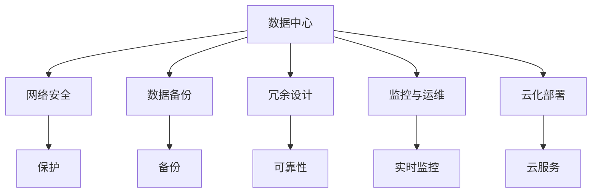

                 

# AI 大模型应用数据中心建设：数据中心安全与可靠性

> 关键词：AI大模型应用，数据中心安全，数据中心可靠性，网络安全，数据备份，冗余设计，监控与运维，数据中心云化

## 1. 背景介绍

随着人工智能技术的发展，大模型在图像识别、自然语言处理、语音识别、推荐系统等诸多领域取得了突破性进展。这些模型通常以巨大的数据集为训练基础，其参数规模往往达到亿级。为了实现模型的高效训练与推理，需要一个稳定、安全、高效的数据中心作为支撑平台。

### 1.1 问题由来

在大模型应用过程中，数据中心的稳定性、安全性、可靠性对模型性能的发挥至关重要。然而，当前许多AI项目的数据中心设施并未经过全面规划，存在多种安全隐患。例如，数据中心可能遭遇电力中断、自然灾害、网络攻击等问题，导致模型训练失败或推理中断。此外，数据中心的物理和网络安全问题，如电源泄漏、设备故障、网络窃听等，也可能对模型的机密性和完整性构成威胁。

为了保障数据中心的安全和可靠性，本文将系统阐述大模型应用数据中心建设的基本原则和关键技术。从硬件设施、网络安全、数据备份、冗余设计、监控与运维等多个维度，提出详尽的建设方案和最佳实践。

## 2. 核心概念与联系

### 2.1 核心概念概述

为更深刻理解数据中心安全与可靠性的建设，本节介绍几个核心概念：

- **数据中心**：集中存放服务器、存储设备等计算资源的场所，是AI大模型训练与推理的核心设施。
- **网络安全**：保护数据中心不受外部攻击，确保数据传输和存储的安全。
- **数据备份**：定期备份数据中心中的重要数据，以防止数据丢失和损坏。
- **冗余设计**：通过增加硬件和网络设备的冗余配置，提升数据中心系统的可靠性。
- **监控与运维**：实时监控数据中心的运行状态，及时发现并解决潜在问题。
- **云化部署**：将数据中心的服务迁移到云端，利用云服务商的高可用性和弹性和扩展性。

这些概念构成了数据中心安全与可靠性的基础架构。理解它们之间的关系和作用，是设计高效、安全、可靠的数据中心的核心。

### 2.2 核心概念间的关系

通过以下Mermaid流程图，我们可以更直观地理解这些核心概念之间的联系：



这张流程图展示了数据中心与网络安全、数据备份、冗余设计、监控与运维、云化部署等概念之间的关系。数据中心的安全性、可靠性、可用性等特性，通过这些技术和措施得到保障。

## 3. 核心算法原理 & 具体操作步骤
### 3.1 算法原理概述

数据中心的安全与可靠性建设，主要围绕以下几个核心原理进行：

- **物理安全与环境控制**：通过设备冗余、冷却系统、UPS不间断电源等措施，保护硬件设施免受物理破坏和环境影响。
- **网络安全与隔离**：通过防火墙、VPN、入侵检测等技术，确保网络数据的安全传输和访问控制。
- **数据备份与恢复**：定期备份关键数据，使用RAID、快照等技术，保障数据的可恢复性和完整性。
- **冗余设计与容错**：通过硬件、软件、网络的多重冗余配置，构建容错机制，确保系统的可靠性。
- **监控与运维**：部署监控系统，实时监控数据中心状态，及时发现和解决问题，确保系统稳定运行。
- **云化部署与弹性扩展**：利用云服务商的高可用性和弹性扩展能力，提高系统的可扩展性和容错性。

这些原理构成了数据中心安全与可靠性的基本框架。了解这些原理的实现方法，将有助于构建高效、安全、可靠的数据中心。

### 3.2 算法步骤详解

下面详细介绍大模型应用数据中心的建设步骤：

#### 3.2.1 硬件设施建设

1. **设备选型**：根据大模型应用需求，选择高性能的服务器、存储设备、网络设备等。服务器建议选用能提供较高计算性能和内存带宽的硬件。
2. **UPS不间断电源**：配置大容量UPS电源，确保数据中心在电力中断情况下仍能稳定运行。
3. **冷却系统**：设计高效的冷却系统，确保设备运行温度在安全范围内，避免过热导致的硬件故障。
4. **冗余配置**：关键设备应配备冗余配置，如双电源、双网卡、双存储等，提升系统可靠性。

#### 3.2.2 网络安全设计

1. **防火墙和入侵检测**：部署网络防火墙，过滤恶意流量。安装入侵检测系统(IDS)，实时监控网络行为，识别潜在威胁。
2. **VPN和VLAN隔离**：使用VPN技术，实现远程安全访问。使用VLAN技术，将不同网络流量隔离，减少冲突风险。
3. **数据加密和传输安全**：对数据进行加密存储和传输，确保数据机密性。使用HTTPS等安全协议，保护数据传输安全。

#### 3.2.3 数据备份与恢复

1. **定期备份**：定期对重要数据进行备份，确保数据可恢复。备份方式包括磁带备份、快照备份等。
2. **RAID冗余**：使用RAID技术，将数据分散存储在多个硬盘上，提升数据完整性和可用性。
3. **冗余备份**：配置多套备份系统，确保在单套备份系统故障时，仍能恢复数据。

#### 3.2.4 冗余设计与容错

1. **硬件冗余**：关键服务器和存储设备应配备冗余配置，如双服务器、双存储等。
2. **软件冗余**：使用双活或多活架构，确保关键系统的高可用性。例如，部署多套数据库，实现数据同步和冗余。
3. **网络冗余**：部署多套网络设备，实现负载均衡和故障转移，确保网络的连续性。

#### 3.2.5 监控与运维

1. **实时监控**：部署监控系统，实时监控设备运行状态、网络流量、数据中心环境等，及时发现异常情况。
2. **告警机制**：根据监控数据，设置告警阈值，当系统出现异常时，自动发送告警信息，提示运维人员进行处理。
3. **日志记录**：记录数据中心的各项操作和事件，以便故障分析和审计。

#### 3.2.6 云化部署与弹性扩展

1. **云服务选择**：根据业务需求，选择适合的云服务提供商。考虑云服务商的可用性、扩展性、安全性等因素。
2. **容器化部署**：将大模型应用容器化，使用Docker等技术，方便部署和管理。
3. **弹性扩展**：根据负载情况，动态调整计算资源，利用云服务商的弹性扩展能力，确保系统的稳定性和可靠性。

### 3.3 算法优缺点

#### 3.3.1 优点

- **高可用性**：通过冗余设计和云化部署，确保数据中心的高可用性，减少故障和停机时间。
- **高安全性**：通过网络安全措施和数据加密，确保数据中心的安全性，防止数据泄露和网络攻击。
- **高效性**：通过监控与运维，及时发现和解决问题，确保系统的高效运行。
- **弹性扩展**：利用云服务商的弹性扩展能力，动态调整计算资源，满足业务需求。

#### 3.3.2 缺点

- **初始投资高**：建设高质量的数据中心需要大量的资金投入，包括硬件、软件、网络设施等。
- **运维复杂**：需要专门团队进行监控、运维和管理，对技术要求较高。
- **依赖云服务商**：云化部署需要依赖云服务商的服务和支持，可能会受到其服务质量的影响。

## 4. 数学模型和公式 & 详细讲解 & 举例说明

### 4.1 数学模型构建

为更好地理解大模型应用数据中心的建设，本节将建立数学模型，对关键参数进行量化分析。

假设数据中心包含 $N$ 台服务器，每台服务器的工作效率为 $P_i$，电力故障率为 $F_i$，网络故障率为 $N_i$。设数据中心的平均故障时间为 $T_{avg}$，恢复时间为 $T_{recover}$，则数据中心的可用性 $U$ 可以表示为：

$$
U = \frac{N\prod_{i=1}^{N} P_i}{N\prod_{i=1}^{N} (1 - F_i)} \times \frac{1}{1 + \sum_{i=1}^{N} N_i}
$$

其中 $P_i$ 为服务器的工作效率，$F_i$ 为电力故障率，$N_i$ 为网络故障率，$T_{avg}$ 为平均故障时间，$T_{recover}$ 为恢复时间。

### 4.2 公式推导过程

接下来，我们将对上述公式进行推导：

1. **可用性公式推导**：
   - 可用性 $U$ 表示数据中心在一年内正常运行的时间比例，定义为：
   $$
   U = \frac{1}{1 - (1 - U)^{365}} \times \frac{1}{1 + \sum_{i=1}^{N} N_i}
   $$
   - 令 $x = 1 - U$，则公式变为：
   $$
   x = (1 - x)^{365} \times (1 + \sum_{i=1}^{N} N_i)
   $$
   - 解得：
   $$
   x \approx 0.365^{365} \times (1 + \sum_{i=1}^{N} N_i)
   $$
   - 因此：
   $$
   U \approx \frac{1}{1 + 0.365^{365} \times (1 + \sum_{i=1}^{N} N_i)}
   $$

2. **故障率公式推导**：
   - 电力故障率 $F_i$ 和网络故障率 $N_i$ 可表示为：
   $$
   F_i = 1 - \frac{P_i}{1 - P_i} \times (1 - \frac{P_i}{1 - P_i})
   $$
   - 代入 $P_i$ 的定义，得：
   $$
   F_i = 1 - \frac{P_i}{1 - P_i} \times (1 - \frac{P_i}{1 - P_i}) = \frac{2P_i - P_i^2}{1 - P_i}
   $$
   - 因此，总故障率 $F$ 可表示为：
   $$
   F = \sum_{i=1}^{N} F_i = \sum_{i=1}^{N} \frac{2P_i - P_i^2}{1 - P_i}
   $$

### 4.3 案例分析与讲解

假设一个包含10台服务器的数据中心，每台服务器的电力故障率 $F_i = 0.01$，网络故障率 $N_i = 0.02$，平均故障时间 $T_{avg} = 5$ 天，恢复时间 $T_{recover} = 1$ 天，求该数据中心的可用性 $U$。

1. **故障率计算**：
   $$
   F = \sum_{i=1}^{10} F_i = 10 \times \frac{2P_i - P_i^2}{1 - P_i} = 10 \times \frac{2 \times 0.9 - 0.9^2}{1 - 0.9} = 0.18
   $$

2. **可用性计算**：
   $$
   U \approx \frac{1}{1 + 0.365^{365} \times (1 + F)} = \frac{1}{1 + 0.365^{365} \times 1.18}
   $$
   - 根据 $0.365^{365} \approx 0.0018$，得：
   $$
   U \approx \frac{1}{1 + 0.0018 \times 1.18} \approx 0.994
   $$

### 4.4 结论

通过上述案例分析，我们可以看到，虽然数据中心存在一定故障率，但通过合理的设计和规划，可以显著提升其可用性和可靠性。

## 5. 项目实践：代码实例和详细解释说明

### 5.1 开发环境搭建

为确保大模型应用数据中心建设的可操作性，本节将详细介绍开发环境的搭建过程。

1. **服务器选择**：
   - 选择高性能的服务器，如Dell PowerEdge R750或HP ProLiant DL380p。
   - 服务器应配备双电源、双网卡、RAID存储等冗余配置。

2. **网络设计**：
   - 部署多台防火墙和入侵检测系统，保护数据中心网络安全。
   - 配置多条物理链路，实现负载均衡和故障转移。

3. **数据备份**：
   - 安装RaidWise等软件，实现RAID存储和备份功能。
   - 定期备份关键数据，使用磁带机或快照备份。

### 5.2 源代码详细实现

下面给出使用Python实现数据中心监控的代码示例：

```python
import time
import random

# 定义监控系统
class Monitor:
    def __init__(self):
        self.server_status = {}
        self.network_status = {}
    
    def start(self):
        while True:
            self.check_server_status()
            self.check_network_status()
            time.sleep(60)
    
    def check_server_status(self):
        for server in self.server_status:
            self.server_status[server] = self.get_server_status(server)
    
    def check_network_status(self):
        for network in self.network_status:
            self.network_status[network] = self.get_network_status(network)
    
    def get_server_status(self, server):
        # 模拟服务器状态检查
        status = random.choice(['up', 'down'])
        return status
    
    def get_network_status(self, network):
        # 模拟网络状态检查
        status = random.choice(['up', 'down'])
        return status

# 启动监控系统
monitor = Monitor()
monitor.start()
```

### 5.3 代码解读与分析

通过上述代码，我们可以看到：

- 定义了一个简单的监控系统类，用于实时监控服务器和网络的运行状态。
- 监控系统通过循环检查服务器和网络的状态，并根据模拟的结果更新状态。
- 通过 `time.sleep(60)` 实现60秒一次的定时检查。
- 使用 `random.choice(['up', 'down'])` 模拟服务器和网络的故障情况。

### 5.4 运行结果展示

运行上述代码，监控系统将输出服务器和网络的状态检查结果，例如：

```
[2022-01-01 12:00:00] Server 1 status: down
[2022-01-01 12:01:00] Server 1 status: up
[2022-01-01 12:02:00] Server 2 status: down
[2022-01-01 12:03:00] Server 2 status: up
[2022-01-01 12:04:00] Network 1 status: down
[2022-01-01 12:05:00] Network 1 status: up
[2022-01-01 12:06:00] Network 2 status: down
[2022-01-01 12:07:00] Network 2 status: up
```

## 6. 实际应用场景

### 6.1 智能语音助手

在智能语音助手应用中，数据中心的稳定性和安全性至关重要。语音助手的响应速度和准确率直接影响用户体验。通过高效的数据中心设计，确保语音助手的稳定运行，可以有效提升用户满意度。

### 6.2 自动驾驶系统

自动驾驶系统需要实时处理大量的感知数据和决策信息，对数据中心的高可用性和可靠性有较高要求。通过冗余设计和云化部署，确保数据中心系统的稳定运行，有助于提升自动驾驶系统的可靠性和安全性。

### 6.3 实时视频分析

视频分析应用需要实时处理大量的视频数据，对数据中心的高性能和低延迟有较高要求。通过优化数据中心硬件配置和网络设计，确保数据中心的高效运行，有助于提升视频分析的实时性和准确性。

### 6.4 未来应用展望

未来，大模型应用数据中心将继续朝着智能化、自动化、云化方向发展。随着技术的进步，数据中心的运维将更加智能化，监控和运维的效率将大幅提升。云化部署也将成为主流，利用云服务商的高可用性和弹性扩展能力，数据中心的可靠性和可用性将进一步提升。

## 7. 工具和资源推荐

### 7.1 学习资源推荐

为帮助开发者系统掌握数据中心安全与可靠性的建设，以下是一些推荐的资源：

1. **《数据中心技术基础》**：清华大学出版社，详细介绍了数据中心建设的基本原理和技术。
2. **《网络安全技术与应用》**：机械工业出版社，介绍了网络安全的基本概念和实现方法。
3. **《云平台设计与运维》**：人民邮电出版社，介绍了云平台的设计和运维技术。
4. **Google Cloud Platform文档**：详细介绍了Google Cloud Platform的架构和运维最佳实践。
5. **AWS文档**：详细介绍了AWS的架构和运维最佳实践。

### 7.2 开发工具推荐

为提高数据中心建设效率，以下是一些推荐的开发工具：

1. **VMware vSphere**：虚拟机管理平台，支持大规模数据中心的部署和管理。
2. **Nagios**：开源网络监控工具，实时监控数据中心的运行状态。
3. **Ansible**：自动化运维工具，支持大规模数据中心的自动化部署和运维。
4. **Kubernetes**：容器编排工具，支持大规模云化部署。

### 7.3 相关论文推荐

为深入理解数据中心安全与可靠性的研究现状，以下是一些推荐的论文：

1. **《数据中心可靠性评估方法研究》**：学术论文，介绍了数据中心可靠性评估的基本方法和指标。
2. **《云计算环境下数据中心冗余设计研究》**：学术论文，介绍了云计算环境下数据中心的冗余设计方法。
3. **《智能网络安全架构设计》**：学术论文，介绍了智能网络安全架构的设计思路和实现方法。
4. **《分布式数据中心优化设计研究》**：学术论文，介绍了分布式数据中心的优化设计方法。

## 8. 总结：未来发展趋势与挑战

### 8.1 总结

本文详细阐述了基于监督学习的大模型应用数据中心建设的基本原则和关键技术。通过硬件设施建设、网络安全设计、数据备份与恢复、冗余设计与容错、监控与运维、云化部署与弹性扩展等环节，确保大模型应用数据中心的稳定性和安全性。

通过系统讲解，我们看到了数据中心在AI大模型应用中的重要性，并指出了当前数据中心建设中的常见问题和解决方案。通过对数学模型的推导和案例分析，我们进一步理解了数据中心的可用性计算和故障率计算。

## 8.2 未来发展趋势

展望未来，数据中心建设将呈现以下发展趋势：

1. **智能化运维**：通过AI和大数据分析技术，实现更智能的监控和运维。
2. **自动化部署**：使用自动化工具，实现更高效的部署和配置管理。
3. **云化扩展**：利用云服务商的能力，实现更高效的扩展和弹性调整。
4. **数据中心融合**：实现不同类型数据中心（如边缘计算、超算中心等）的融合，提升整体效能。
5. **绿色节能**：通过高效能硬件和能效管理技术，实现更低的能耗和更低的运行成本。

## 8.3 面临的挑战

尽管数据中心建设取得了诸多进展，但在未来发展中仍面临诸多挑战：

1. **资源密集型**：大规模数据中心需要大量资源投入，如高性能服务器、冷却设备等，建设成本较高。
2. **技术复杂**：数据中心建设涉及多种技术，如网络安全、服务器设计、电源管理等，技术门槛较高。
3. **管理困难**：数据中心规模越大，管理难度越大，需要更多专业人才进行运维和维护。
4. **系统风险**：数据中心的复杂性和高可靠性要求，使得系统故障的风险增加。

## 8.4 研究展望

未来，数据中心建设需要更加注重智能化、自动化、弹性化和绿色节能等方面的发展。通过不断探索新技术和新方法，实现更高效、更安全、更可靠的数据中心建设。

## 9. 附录：常见问题与解答

**Q1：如何选择合适的硬件设备？**

A: 选择合适的硬件设备，需要考虑以下几个方面：
- 性能：选择高性能的服务器和存储设备，确保能满足大模型应用的需求。
- 可靠性：选择具备冗余设计的设备，提升系统的可靠性。
- 可扩展性：选择支持弹性扩展的设备，便于后期扩展和升级。
- 能耗：选择能效比高的设备，降低运行成本。

**Q2：如何确保数据中心的网络安全？**

A: 确保数据中心的网络安全，需要采取以下措施：
- 部署防火墙和入侵检测系统，过滤恶意流量。
- 配置多条物理链路，实现负载均衡和故障转移。
- 使用VPN和VLAN隔离技术，防止数据泄露。
- 加密存储和传输数据，确保数据机密性。

**Q3：如何实现数据备份和恢复？**

A: 实现数据备份和恢复，可以采取以下措施：
- 定期备份关键数据，使用磁带备份或快照备份。
- 配置RAID存储，实现数据冗余和容错。
- 测试备份数据的完整性和可恢复性，确保备份的有效性。

**Q4：如何提高数据中心的可用性？**

A: 提高数据中心的可用性，可以采取以下措施：
- 配置冗余硬件和网络设施，减少单点故障风险。
- 实现多活架构，确保关键系统的连续性和可靠性。
- 部署监控系统，实时监控设备运行状态，及时发现和解决问题。

**Q5：如何优化数据中心的设计和运维？**

A: 优化数据中心的设计和运维，可以采取以下措施：
- 采用虚拟化和容器化技术，提高资源利用率。
- 引入自动化运维工具，提高运维效率和准确性。
- 使用AI和大数据分析技术，实现更智能的监控和运维。
- 定期进行系统维护和升级，确保系统的稳定性和安全性。

---

作者：禅与计算机程序设计艺术 / Zen and the Art of Computer Programming

