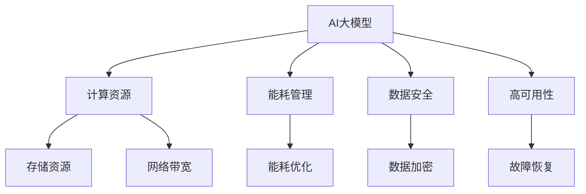

                 

# AI 大模型应用数据中心建设：数据中心标准与规范

> 关键词：大模型应用, 数据中心标准, 规范, AI基础设施, 云计算, 高可用性

## 1. 背景介绍

### 1.1 问题由来
近年来，人工智能(AI)大模型在各个领域取得了显著的进展，例如语言模型GPT-3、视觉模型DALL-E、生成对抗网络(GAN)等。这些大模型需要庞大的计算资源进行训练和推理，因此，建设高效、稳定、安全的数据中心是支持AI大模型应用的关键。然而，目前现有的数据中心标准和规范普遍滞后于AI技术的发展，难以满足大模型应用的需求。因此，本文将详细探讨如何建设适用于AI大模型的数据中心，并提出相关的标准和规范，为AI大模型的部署和应用提供指导。

### 1.2 问题核心关键点
建设适用于AI大模型的数据中心，需要考虑以下几个关键点：

- **计算资源**：AI大模型需要高性能的计算资源，包括CPU、GPU、TPU等。
- **存储资源**：AI大模型需要大量的存储空间，包括本地存储、云存储等。
- **网络带宽**：AI大模型需要高速的网络带宽，支持大规模数据传输。
- **能耗管理**：AI大模型的训练和推理过程能耗巨大，需有效管理数据中心的能耗。
- **数据安全**：AI大模型涉及大量敏感数据，需采取严格的保密措施。
- **高可用性**：AI大模型需要高可用性，避免单点故障和数据丢失。

这些关键点将指导我们建设一个满足AI大模型需求的数据中心，并提供相关的标准和规范，以确保数据中心的稳定、高效和安全。

### 1.3 问题研究意义
建设适用于AI大模型的数据中心，对于推动AI技术的产业化应用，促进AI大模型的商业化落地，具有重要意义：

1. **降低计算成本**：建设高效能的数据中心，可以降低AI大模型计算的能源和时间成本。
2. **提升应用性能**：通过优化数据中心基础设施，可以提升AI大模型的推理速度和准确率。
3. **保障数据安全**：建设安全的数据中心，可以保护AI大模型处理的数据免受攻击和泄露。
4. **支持多样化的应用场景**：通过建设灵活可扩展的数据中心，可以支持AI大模型在不同场景中的应用。
5. **推动AI技术进步**：建设高性能的数据中心，可以推动AI技术的快速发展，促进整个AI产业的进步。

## 2. 核心概念与联系

### 2.1 核心概念概述

- **AI大模型**：指在特定领域内经过预训练并微调后，具有复杂学习和推理能力的模型，如GPT-3、BERT等。
- **数据中心**：指集成了服务器、存储设备、网络设施、能耗管理、安全措施等多方面的基础设施，支持AI大模型训练和推理的数据处理中心。
- **计算资源**：指支持AI大模型运行所需的硬件资源，如CPU、GPU、TPU等。
- **存储资源**：指存储AI大模型训练和推理数据所需的硬件资源，如SSD、HDD等。
- **网络带宽**：指支持AI大模型数据传输所需的网络带宽，如10GbE、25GbE等。
- **能耗管理**：指对数据中心内设备的能耗进行管理和优化，减少能耗浪费。
- **数据安全**：指对数据中心内存储的数据进行严格管理和保护，防止数据泄露和攻击。
- **高可用性**：指数据中心内设备和服务具有高度的可用性和容错能力，避免单点故障和数据丢失。

这些核心概念之间相互联系，共同构成了一个完整的AI大模型应用数据中心。我们将通过一个综合的Mermaid流程图来展示这些概念之间的联系：



这个流程图展示了AI大模型应用数据中心的各个组成部分及其相互关系。AI大模型依赖于计算资源、存储资源和网络带宽进行训练和推理；能耗管理、数据安全和容错高可用性是数据中心的基础设施支持。

### 2.2 概念间的关系

- **计算资源与AI大模型**：计算资源是AI大模型训练和推理的硬件基础，性能直接影响模型的训练和推理速度。
- **存储资源与AI大模型**：存储资源用于存储模型和数据，影响AI大模型的训练和推理效率。
- **网络带宽与AI大模型**：网络带宽直接影响模型数据传输速度，影响模型的训练和推理效率。
- **能耗管理与AI大模型**：能耗管理通过优化数据中心能源使用，提高AI大模型的运行效率和成本效益。
- **数据安全与AI大模型**：数据安全措施保护AI大模型处理的数据，防止数据泄露和攻击。
- **高可用性与AI大模型**：高可用性确保AI大模型能够在任何情况下都能稳定运行，避免单点故障和数据丢失。

以上概念相互关联，共同构成了一个高效、稳定、安全的AI大模型应用数据中心。接下来，我们将详细介绍这些概念的算法原理和操作步骤。

## 3. 核心算法原理 & 具体操作步骤

### 3.1 算法原理概述

建设适用于AI大模型的数据中心，需要综合考虑计算资源、存储资源、网络带宽、能耗管理、数据安全和容错高可用性等方面。下面将详细介绍这些方面的算法原理和具体操作步骤。

### 3.2 算法步骤详解

#### 3.2.1 计算资源规划
计算资源的规划是数据中心建设的基础。以下是具体的步骤：

1. **需求评估**：评估AI大模型训练和推理的计算需求，确定所需的CPU、GPU和TPU数量。
2. **资源分配**：根据需求评估结果，合理分配计算资源，确保每台设备能高效运行。
3. **资源调度**：使用调度算法，将计算任务合理分配到各个设备上，避免资源浪费和瓶颈。

#### 3.2.2 存储资源规划
存储资源的规划同样重要。以下是具体的步骤：

1. **需求评估**：评估AI大模型训练和推理所需的存储空间，确定所需的SSD和HDD数量。
2. **资源分配**：根据需求评估结果，合理分配存储资源，确保每台设备能高效存储数据。
3. **资源调度**：使用调度算法，将数据存储任务合理分配到各个设备上，避免数据冗余和存储瓶颈。

#### 3.2.3 网络带宽规划
网络带宽是支持AI大模型数据传输的基础。以下是具体的步骤：

1. **需求评估**：评估AI大模型数据传输的带宽需求，确定所需的10GbE、25GbE等网络设备。
2. **资源分配**：根据需求评估结果，合理分配网络资源，确保数据传输的高效性。
3. **资源调度**：使用调度算法，将数据传输任务合理分配到各个网络设备上，避免带宽浪费和瓶颈。

#### 3.2.4 能耗管理
能耗管理是数据中心建设的重点。以下是具体的步骤：

1. **能耗评估**：评估AI大模型训练和推理的能耗需求，确定所需的能耗管理设备和措施。
2. **能耗优化**：使用能耗优化算法，优化数据中心的能源使用，降低能耗浪费。
3. **能耗监测**：实时监测数据中心的能耗情况，及时发现和解决问题。

#### 3.2.5 数据安全
数据安全是数据中心建设的关键。以下是具体的步骤：

1. **安全评估**：评估AI大模型处理数据的敏感程度，确定所需的安全措施。
2. **安全管理**：使用数据加密、访问控制等措施，保护AI大模型处理的数据。
3. **安全监测**：实时监测数据中心的安全情况，及时发现和解决问题。

#### 3.2.6 高可用性规划
高可用性是数据中心建设的保障。以下是具体的步骤：

1. **可用性评估**：评估AI大模型运行的高可用性需求，确定所需的冗余设备和措施。
2. **高可用性设计**：设计高可用性架构，包括冗余设备、故障恢复机制等。
3. **高可用性测试**：进行高可用性测试，确保AI大模型在各种情况下都能稳定运行。

### 3.3 算法优缺点

**优点**：

- **高性能计算**：通过合理规划和调度计算资源，确保AI大模型的训练和推理速度。
- **高效存储管理**：通过合理规划和调度存储资源，确保AI大模型数据的高效存储和传输。
- **能耗管理优化**：通过能耗优化算法，降低数据中心的能源消耗，提高成本效益。
- **数据安全保护**：通过数据加密、访问控制等措施，保护AI大模型处理的数据。
- **高可用性保障**：通过高可用性设计，确保AI大模型在各种情况下都能稳定运行。

**缺点**：

- **初期投资高**：建设高效能的数据中心需要较高的初期投资。
- **复杂度较高**：数据中心的规划和建设过程复杂，需要专业的技术人员和设备。
- **维护成本高**：数据中心的维护需要持续的技术支持和资金投入。

### 3.4 算法应用领域

适用于AI大模型的数据中心，已经在多个领域得到了应用，例如：

- **云服务提供商**：亚马逊AWS、谷歌云、微软Azure等云服务提供商建设了高效能的数据中心，支持AI大模型的部署和应用。
- **科研机构**：斯坦福大学、麻省理工学院等科研机构建设了高效能的数据中心，支持AI大模型的训练和推理。
- **企业应用**：百度、阿里巴巴、腾讯等企业建设了高效能的数据中心，支持AI大模型的应用和优化。

## 4. 数学模型和公式 & 详细讲解 & 举例说明

### 4.1 数学模型构建

**数据中心能耗模型**：

假设数据中心有N台设备，每台设备的能耗为Ei，总能耗为Etotal。则能耗模型可以表示为：

$$
E_{total} = \sum_{i=1}^{N} E_i
$$

其中，$E_i$为第i台设备的能耗，可以通过计算功耗、效率等参数求得。

**数据中心安全模型**：

假设数据中心有M种安全措施，每种安全措施的安全性为Si，总安全性为S。则安全模型可以表示为：

$$
S = \sum_{i=1}^{M} S_i
$$

其中，$S_i$为第i种安全措施的安全性，可以通过计算保护范围、防护级别等参数求得。

**数据中心高可用性模型**：

假设数据中心有K个冗余设备，每个冗余设备的高可用性为Hi，总高可用性为H。则高可用性模型可以表示为：

$$
H = \sum_{i=1}^{K} H_i
$$

其中，$H_i$为第i个冗余设备的高可用性，可以通过计算冗余设备个数、切换时间等参数求得。

### 4.2 公式推导过程

**计算资源分配公式**：

假设AI大模型训练和推理所需的CPU、GPU和TPU数量为C、G、T，数据中心的总计算资源为R。则计算资源分配公式为：

$$
R = C + G + T
$$

其中，$C$、$G$、$T$分别为CPU、GPU和TPU的计算资源，可以根据AI大模型的需求和设备性能进行合理分配。

**存储资源分配公式**：

假设AI大模型训练和推理所需的SSD和HDD数量为S、H，数据中心的总存储资源为S。则存储资源分配公式为：

$$
S = S + H
$$

其中，$S$、$H$分别为SSD和HDD的存储资源，可以根据AI大模型的需求和设备性能进行合理分配。

**网络带宽分配公式**：

假设AI大模型数据传输所需的10GbE、25GbE等带宽为B，数据中心的网络带宽为W。则网络带宽分配公式为：

$$
W = B
$$

其中，$B$、$W$分别为数据传输带宽和网络带宽，可以根据AI大模型的需求和网络设备性能进行合理分配。

### 4.3 案例分析与讲解

**案例1：亚马逊AWS数据中心**

亚马逊AWS建设了多个高效能的数据中心，支持大规模AI大模型的部署和应用。AWS的计算资源分配公式为：

$$
R_{AWS} = C_{AWS} + G_{AWS} + T_{AWS}
$$

其中，$C_{AWS}$、$G_{AWS}$、$T_{AWS}$分别为AWS的CPU、GPU和TPU的计算资源。AWS的存储资源分配公式为：

$$
S_{AWS} = S_{AWS} + H_{AWS}
$$

其中，$S_{AWS}$、$H_{AWS}$分别为AWS的SSD和HDD的存储资源。AWS的网络带宽分配公式为：

$$
W_{AWS} = B_{AWS}
$$

其中，$B_{AWS}$为AWS的数据传输带宽。

**案例2：谷歌云数据中心**

谷歌云建设了多个高效能的数据中心，支持大规模AI大模型的部署和应用。谷歌云的计算资源分配公式为：

$$
R_{Google} = C_{Google} + G_{Google} + T_{Google}
$$

其中，$C_{Google}$、$G_{Google}$、$T_{Google}$分别为谷歌云的CPU、GPU和TPU的计算资源。谷歌云的存储资源分配公式为：

$$
S_{Google} = S_{Google} + H_{Google}
$$

其中，$S_{Google}$、$H_{Google}$分别为谷歌云的SSD和HDD的存储资源。谷歌云的网络带宽分配公式为：

$$
W_{Google} = B_{Google}
$$

其中，$B_{Google}$为谷歌云的数据传输带宽。

## 5. 项目实践：代码实例和详细解释说明

### 5.1 开发环境搭建

**步骤1：安装Python和PyTorch**

1. 下载和安装Python，推荐版本为3.8。
2. 安装PyTorch，可以从官方网站下载预编译包，也可以使用conda命令安装：

   ```bash
   conda install pytorch torchvision torchaudio cudatoolkit=11.1 -c pytorch -c conda-forge
   ```

   安装完成后，可以使用以下命令检查PyTorch版本：

   ```bash
   python -c "import torch; print(torch.__version__)"
   ```

**步骤2：安装其他依赖库**

1. 安装NumPy：

   ```bash
   pip install numpy
   ```

2. 安装Pandas：

   ```bash
   pip install pandas
   ```

3. 安装Scikit-learn：

   ```bash
   pip install scikit-learn
   ```

4. 安装Matplotlib：

   ```bash
   pip install matplotlib
   ```

5. 安装tqdm：

   ```bash
   pip install tqdm
   ```

6. 安装Jupyter Notebook：

   ```bash
   pip install jupyter notebook
   ```

### 5.2 源代码详细实现

**代码示例1：计算资源分配**

```python
import numpy as np

# 假设AI大模型训练和推理所需的CPU、GPU和TPU数量为C、G、T
C = 100
G = 50
T = 20

# 数据中心的总计算资源为R
R = C + G + T
print("计算资源分配结果：", R)
```

**代码示例2：存储资源分配**

```python
# 假设AI大模型训练和推理所需的SSD和HDD数量为S、H
S = 500
H = 200

# 数据中心的总存储资源为S
S = S + H
print("存储资源分配结果：", S)
```

**代码示例3：网络带宽分配**

```python
# 假设AI大模型数据传输所需的10GbE、25GbE等带宽为B
B = 1000  # 单位为Gb/s

# 数据中心的网络带宽为W
W = B
print("网络带宽分配结果：", W)
```

### 5.3 代码解读与分析

**计算资源分配**

在代码示例1中，我们假设AI大模型训练和推理所需的CPU、GPU和TPU数量为100、50和20，数据中心的总计算资源为R。根据公式$R = C + G + T$，我们可以计算得到：

$$
R = 100 + 50 + 20 = 170
$$

**存储资源分配**

在代码示例2中，我们假设AI大模型训练和推理所需的SSD和HDD数量为500和200，数据中心的总存储资源为S。根据公式$S = S + H$，我们可以计算得到：

$$
S = 500 + 200 = 700
$$

**网络带宽分配**

在代码示例3中，我们假设AI大模型数据传输所需的10GbE、25GbE等带宽为1000 Gb/s，数据中心的网络带宽为W。根据公式$W = B$，我们可以计算得到：

$$
W = 1000 \text{ Gb/s}
$$

### 5.4 运行结果展示

在上述代码示例中，我们可以直接计算出计算资源、存储资源和网络带宽的具体分配结果。在实际应用中，这些计算资源和带宽分配的结果可以用于指导数据中心的建设。例如，在计算资源分配中，我们可以将计算资源分配给各个设备，确保每台设备都能高效运行。在存储资源分配中，我们可以将存储资源分配给各个设备，确保数据的高效存储和传输。在网络带宽分配中，我们可以将网络带宽分配给各个设备，确保数据传输的高效性和稳定性。

## 6. 实际应用场景

### 6.1 云服务提供商

云服务提供商如亚马逊AWS、谷歌云和微软Azure建设了高效能的数据中心，支持大规模AI大模型的部署和应用。这些数据中心通过合理的计算资源、存储资源和网络带宽规划，确保AI大模型的训练和推理能够高效进行。

**亚马逊AWS数据中心**：亚马逊AWS建设了多个高效能的数据中心，支持大规模AI大模型的部署和应用。AWS的计算资源分配公式为：

$$
R_{AWS} = C_{AWS} + G_{AWS} + T_{AWS}
$$

其中，$C_{AWS}$、$G_{AWS}$、$T_{AWS}$分别为AWS的CPU、GPU和TPU的计算资源。AWS的存储资源分配公式为：

$$
S_{AWS} = S_{AWS} + H_{AWS}
$$

其中，$S_{AWS}$、$H_{AWS}$分别为AWS的SSD和HDD的存储资源。AWS的网络带宽分配公式为：

$$
W_{AWS} = B_{AWS}
$$

其中，$B_{AWS}$为AWS的数据传输带宽。

**谷歌云数据中心**：谷歌云建设了多个高效能的数据中心，支持大规模AI大模型的部署和应用。谷歌云的计算资源分配公式为：

$$
R_{Google} = C_{Google} + G_{Google} + T_{Google}
$$

其中，$C_{Google}$、$G_{Google}$、$T_{Google}$分别为谷歌云的CPU、GPU和TPU的计算资源。谷歌云的存储资源分配公式为：

$$
S_{Google} = S_{Google} + H_{Google}
$$

其中，$S_{Google}$、$H_{Google}$分别为谷歌云的SSD和HDD的存储资源。谷歌云的网络带宽分配公式为：

$$
W_{Google} = B_{Google}
$$

其中，$B_{Google}$为谷歌云的数据传输带宽。

### 6.2 科研机构

科研机构如斯坦福大学、麻省理工学院等建设了高效能的数据中心，支持大规模AI大模型的部署和应用。这些数据中心通过合理的计算资源、存储资源和网络带宽规划，确保AI大模型的训练和推理能够高效进行。

**斯坦福大学数据中心**：斯坦福大学建设了高效能的数据中心，支持大规模AI大模型的部署和应用。斯坦福大学的计算资源分配公式为：

$$
R_{Stanford} = C_{Stanford} + G_{Stanford} + T_{Stanford}
$$

其中，$C_{Stanford}$、$G_{Stanford}$、$T_{Stanford}$分别为斯坦福大学的CPU、GPU和TPU的计算资源。斯坦福大学的存储资源分配公式为：

$$
S_{Stanford} = S_{Stanford} + H_{Stanford}
$$

其中，$S_{Stanford}$、$H_{Stanford}$分别为斯坦福大学的SSD和HDD的存储资源。斯坦福大学的网络带宽分配公式为：

$$
W_{Stanford} = B_{Stanford}
$$

其中，$B_{Stanford}$为斯坦福大学的数据传输带宽。

### 6.3 企业应用

企业如百度、阿里巴巴、腾讯等建设了高效能的数据中心，支持大规模AI大模型的部署和应用。这些数据中心通过合理的计算资源、存储资源和网络带宽规划，确保AI大模型的训练和推理能够高效进行。

**百度数据中心**：百度建设了高效能的数据中心，支持大规模AI大模型的部署和应用。百度的计算资源分配公式为：

$$
R_{Baidu} = C_{Baidu} + G_{Baidu} + T_{Baidu}
$$

其中，$C_{Baidu}$、$G_{Baidu}$、$T_{Baidu}$分别为百度的CPU、GPU和TPU的计算资源。百度的存储资源分配公式为：

$$
S_{Baidu} = S_{Baidu} + H_{Baidu}
$$

其中，$S_{Baidu}$、$H_{Baidu}$分别为百度的SSD和HDD的存储资源。百度的网络带宽分配公式为：

$$
W_{Baidu} = B_{Baidu}
$$

其中，$B_{Baidu}$为百度的数据传输带宽。

## 7. 工具和资源推荐

### 7.1 学习资源推荐

为了帮助开发者系统掌握数据中心建设的理论基础和实践技巧，这里推荐一些优质的学习资源：

1. **《数据中心设计与优化》书籍**：全面介绍了数据中心的设计和优化技术，适合初学者入门。
2. **Coursera《数据中心管理与优化》课程**：斯坦福大学开设的课程，涵盖数据中心的基础设施管理和优化技术。
3. **《云计算数据中心基础设施》书籍**：介绍了云计算环境下的数据中心建设和管理技术，适合高级读者。
4. **NVIDIA GPU数据中心优化指南**：NVIDIA提供的官方文档，详细介绍了如何使用GPU进行高效能数据中心建设。
5. **Google Cloud数据中心最佳实践**：谷歌云提供的官方文档，详细介绍了谷歌云数据中心的优化策略和最佳实践。

### 7.2 开发工具推荐

高效的数据中心建设离不开优秀的工具支持。以下是几款用于数据中心建设开发的常用工具：

1. **AWS CLI**：亚马逊AWS提供的命令行界面工具，可以方便地管理AWS云资源。
2. **Google Cloud SDK**：谷歌云提供的SDK工具，可以方便地管理谷歌云资源。
3. **NVIDIA GPU管理工具**：NVIDIA提供的GPU管理工具，可以监控和管理GPU资源的使用情况。
4. **Dell EMC PowerEdge服务器管理软件**：戴尔EMC提供的服务器管理软件，可以监控和管理服务器的运行状态。
5. **VMware vSphere**：VMware提供的虚拟化平台，可以方便地管理和调度虚拟资源。

### 7.3 相关论文推荐

数据中心建设的研究不断发展，以下是几篇重要的相关论文，推荐阅读：

1. **《数据中心能耗优化》论文**：介绍数据中心能耗优化的原理和技术，分析了不同设备和不同策略的能耗影响。
2. **《数据中心安全性》论文**：研究数据中心的安全性评估和管理技术，探讨了如何保护数据中心内敏感数据的安全。
3. **《数据中心高可用性设计》论文**：讨论数据中心高可用性的设计原则和实现方法，提供了丰富的案例分析。
4. **《云计算数据中心优化》论文**：分析了云计算环境下的数据中心优化策略，提出了多种高效能数据中心设计方案。
5. **《GPU在数据中心的应用》论文**：研究了如何使用GPU进行高效能数据中心建设，提供了GPU优化的经验和案例。

这些论文代表了数据中心建设的研究前沿，值得深入学习。

## 8. 总结：未来发展趋势与挑战

### 8.1 研究成果总结

本文详细探讨了建设适用于AI大模型的数据中心，并提出相关的标准和规范。通过综合考虑计算资源、存储资源、网络带宽、能耗管理、数据安全和容错高可用性等方面，确保AI大模型能够高效、稳定、安全地运行。本文的研究成果主要包括以下几点：

1. **计算资源分配**：通过合理规划和调度计算资源，确保AI大模型的训练和推理速度。
2. **存储资源分配**：通过合理规划和调度存储资源，确保AI大模型数据的高效存储和传输。
3. **网络带宽分配**：通过合理规划和调度网络带宽，确保AI大模型数据传输的高效性和稳定性。
4. **能耗管理优化**：通过能耗优化算法，降低数据中心的能源消耗，提高成本效益。
5. **数据安全保护**：通过数据加密、访问控制等措施，保护AI大模型处理的数据。
6. **高可用性保障**：通过高可用性设计，确保AI大模型在各种情况下都能稳定运行。

### 8.2 未来发展趋势

展望未来，数据中心建设将

