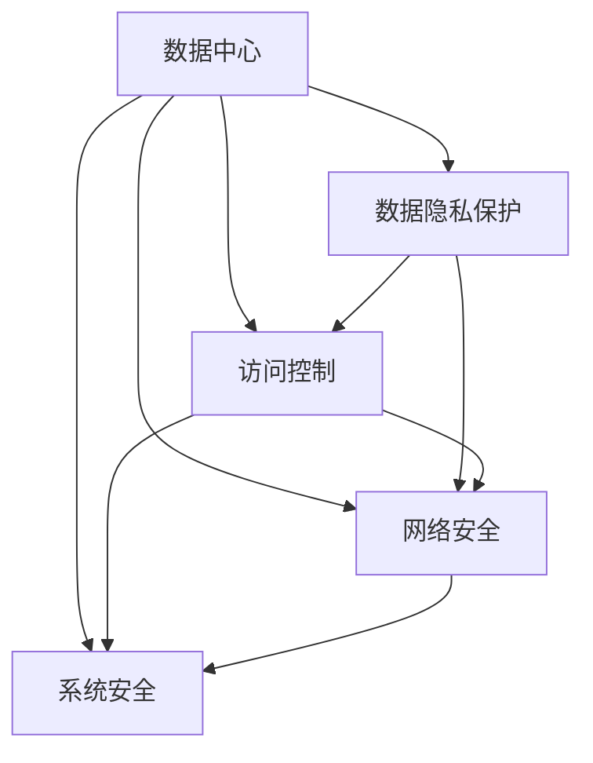
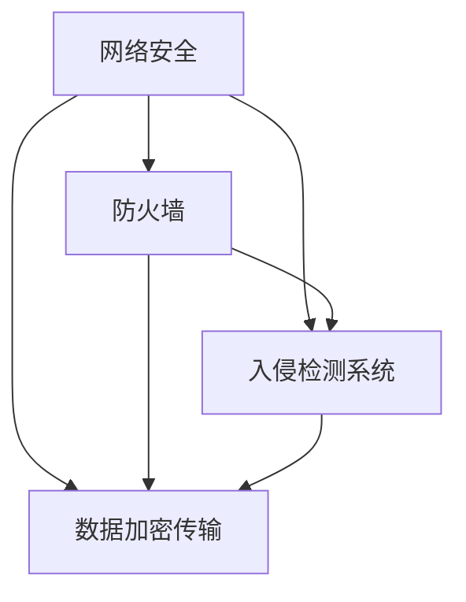

                 

# AI 大模型应用数据中心的安全性

> 关键词：大模型,数据中心,安全,隐私保护,数据安全,访问控制,网络安全

## 1. 背景介绍

随着人工智能（AI）技术的飞速发展，大模型在诸多领域的应用正逐渐普及。这些模型通常在深度神经网络的帮助下，能够处理复杂的任务，例如自然语言处理（NLP）、图像识别、语音识别等。然而，大模型依赖大量的训练数据，这些数据可能包含敏感信息，如个人隐私、商业机密等。因此，数据中心的安全性成为了大模型应用的关键挑战。

### 1.1 问题由来
数据中心的安全性不仅涉及到物理安全（如硬件设施的安全），还包括信息安全（如数据泄漏、网络攻击等）。在大模型应用背景下，数据中心的复杂性进一步增加，导致安全问题更为多样化和复杂。例如，大模型训练需要处理大规模数据，可能涉及全球范围的数据收集和存储，而数据传输过程中的安全防护成为一大难题。

### 1.2 问题核心关键点
在数据中心的安全性问题中，以下几个关键点尤为值得关注：

1. **数据隐私保护**：如何在模型训练和应用过程中保护数据隐私，防止数据泄露。
2. **访问控制**：如何管理对模型和数据的访问，确保只有授权人员能够访问敏感数据。
3. **网络安全**：如何在数据传输和处理过程中保障网络安全，防止数据被非法截取或篡改。
4. **系统安全**：如何确保数据中心的软硬件设施安全，防止硬件故障、软件漏洞等导致的数据安全问题。

### 1.3 问题研究意义
研究数据中心的安全性对于保护用户隐私、防止数据泄露、确保业务连续性至关重要。在AI大模型应用的场景下，数据中心的健全安全性措施不仅可以避免数据被滥用，还能增强用户信任，推动AI技术在各个行业的落地应用。

## 2. 核心概念与联系

### 2.1 核心概念概述

为更好地理解AI大模型应用数据中心的安全性问题，本节将介绍几个密切相关的核心概念：

- **数据中心（Data Center）**：是提供计算资源、存储资源、网络资源和软件资源的物理设施。在AI大模型应用中，数据中心存储和处理大规模数据，是模型训练和推理的物理基础。
- **隐私保护（Privacy Protection）**：涉及保护个人隐私和数据安全，防止未经授权的访问和数据泄露。在大模型应用中，隐私保护尤为重要，因为数据往往包含敏感信息。
- **访问控制（Access Control）**：管理对资源（包括数据和系统）的访问权限，确保只有授权人员可以访问。访问控制是大模型应用中保障数据安全的重要手段。
- **网络安全（Network Security）**：涉及保护数据在传输过程中的安全，防止数据被截获、篡改或伪造。在大模型应用中，数据传输可能涉及全球范围，网络安全尤为重要。
- **系统安全（System Security）**：涉及确保数据中心的软硬件设施的安全性，防止硬件故障、软件漏洞等导致的潜在威胁。

这些核心概念之间的逻辑关系可以通过以下Mermaid流程图来展示：



这个流程图展示了大模型应用数据中心的核心概念及其之间的关系：

1. 数据中心存储和处理数据，是模型训练和推理的物理基础。
2. 数据隐私保护、访问控制、网络安全、系统安全共同构成了数据中心的安全性体系，保障数据的隐私和完整性。

### 2.2 概念间的关系

这些核心概念之间存在着紧密的联系，形成了数据中心安全性的完整生态系统。下面我们通过几个Mermaid流程图来展示这些概念之间的关系。

#### 2.2.1 数据隐私保护与访问控制的关系


这个流程图展示了数据隐私保护和访问控制的关系。数据隐私保护通过加密等手段防止数据泄露，而访问控制则限制数据的访问权限，两者共同保障了数据的隐私和完整性。

#### 2.2.2 网络安全与系统安全的关系



这个流程图展示了网络安全与系统安全的关系。网络安全通过防火墙、入侵检测系统等手段防止网络攻击，而系统安全则通过加固软硬件设施来防止潜在威胁，两者共同构建了数据中心的防御体系。

## 3. 核心算法原理 & 具体操作步骤
### 3.1 算法原理概述

AI大模型应用数据中心的安全性问题，本质上是一个综合性的问题，涉及数据隐私保护、访问控制、网络安全、系统安全等多个方面的综合考虑。其核心算法原理可以概括为以下几个方面：

- **数据隐私保护算法**：如数据加密、差分隐私等，通过技术手段保护数据隐私。
- **访问控制算法**：如基于角色的访问控制（RBAC）、基于属性访问控制（ABAC）等，限制对数据的访问权限。
- **网络安全算法**：如VPN、SSL/TLS等，确保数据在传输过程中的安全。
- **系统安全算法**：如硬件安全模块（HSM）、安全操作系统等，确保数据中心的软硬件设施安全。

### 3.2 算法步骤详解

在实践中，数据中心的安全性保护通常包括以下几个关键步骤：

**Step 1: 数据隐私保护**

1. **数据加密**：在数据存储和传输过程中，使用加密算法对数据进行加密，防止数据泄露。常见的加密算法包括AES、RSA等。
2. **差分隐私**：在模型训练和推理过程中，通过加入噪声等方式保护用户隐私，防止个人数据被滥用。

**Step 2: 访问控制**

1. **基于角色的访问控制（RBAC）**：根据用户的角色分配权限，确保只有授权人员能够访问敏感数据。
2. **基于属性访问控制（ABAC）**：根据用户属性（如位置、时间、设备等）动态调整访问权限，确保访问控制的灵活性。

**Step 3: 网络安全**

1. **虚拟专用网络（VPN）**：通过加密隧道保护数据在网络传输过程中的安全。
2. **SSL/TLS协议**：在数据传输过程中，使用SSL/TLS协议确保数据的安全性和完整性。

**Step 4: 系统安全**

1. **硬件安全模块（HSM）**：存储和管理敏感密钥，防止密钥泄露。
2. **安全操作系统**：加固操作系统，防止恶意软件入侵和数据篡改。

### 3.3 算法优缺点

大模型应用数据中心的安全性保护方法具有以下优点：

1. **全面保护**：综合考虑数据隐私、访问控制、网络安全、系统安全等多个方面，保障数据的完整性和安全性。
2. **灵活应用**：根据具体应用场景，选择合适的方法和工具，灵活应对安全挑战。
3. **自动化保障**：使用自动化工具和流程，确保安全措施的及时性和有效性。

同时，这些方法也存在以下缺点：

1. **复杂性**：多个安全措施的叠加，可能增加系统的复杂性和运维成本。
2. **成本高**：加密、差分隐私等技术需要高计算资源和处理时间，增加系统成本。
3. **更新难度**：安全措施的升级和调整，可能影响系统的稳定性和可用性。

### 3.4 算法应用领域

AI大模型应用数据中心的安全性保护方法在多个领域得到了广泛应用，例如：

- **金融行业**：大模型在金融风控、欺诈检测、信用评估等方面应用广泛。数据中心的安全性保护对于防止金融数据泄露和网络攻击至关重要。
- **医疗行业**：大模型在医疗影像分析、疾病诊断等方面应用广泛。数据中心的安全性保护对于保护患者隐私和医疗数据安全至关重要。
- **零售行业**：大模型在客户行为分析、推荐系统等方面应用广泛。数据中心的安全性保护对于保护消费者数据隐私至关重要。
- **公共安全**：大模型在视频监控、语音识别等方面应用广泛。数据中心的安全性保护对于防止数据滥用和网络攻击至关重要。

## 4. 数学模型和公式 & 详细讲解 & 举例说明

### 4.1 数学模型构建

在AI大模型应用数据中心的安全性保护中，涉及多个数学模型和公式。这里以数据加密模型为例，介绍其构建和应用。

**AES加密算法**：
数据加密模型通常使用对称加密算法，如AES（高级加密标准）。AES算法使用相同的密钥进行加密和解密，密钥长度为128位、192位或256位。

假设待加密的明文为$P$，密钥为$K$，加密结果为$C$，则AES加密模型的数学公式如下：

$$
C = AES_{K}(P) = AES_{K1}(S盒)_{K2}(P)
$$

其中$S盒$为AES算法中的替换盒，$K1$和$K2$为密钥扩展算法生成的子密钥。

### 4.2 公式推导过程

以AES加密算法为例，推导其加密过程。

1. **字节替换（Byte Substitution）**：将明文$P$经过$S盒$替换，生成中间结果$S$。
2. **行移位（Shift Row）**：将$S$中的每一行进行位移操作，生成$S'$。
3. **列混淆（Mix Column）**：将$S'$的每一列进行线性变换，生成$S''$。
4. **轮密钥加（AddRoundKey）**：将$S''$与轮密钥$K_r$进行异或运算，生成$C$。

具体推导过程如下：

1. **字节替换**：
   - 对于每一字节$b_i$，$S盒$的输出为$s_i$，即$s_i = S(b_i)$。

2. **行移位**：
   - 将$s_i$中的每一行进行位移操作，生成$s_i'$。

3. **列混淆**：
   - 将$s_i'$的每一列进行线性变换，生成$s_i''$。

4. **轮密钥加**：
   - 将$s_i''$与轮密钥$K_r$进行异或运算，生成$c_i$。

### 4.3 案例分析与讲解

以医疗行业为例，分析数据中心的安全性保护措施。

**案例场景**：某医疗影像分析公司使用大模型进行医学影像识别，数据中心存储了大量的患者影像数据。

**措施分析**：

1. **数据加密**：使用AES算法对影像数据进行加密，防止数据泄露。
2. **访问控制**：使用基于角色的访问控制（RBAC）和基于属性访问控制（ABAC），限制对影像数据的访问权限，确保只有授权医生和管理员能够访问。
3. **网络安全**：使用VPN和SSL/TLS协议，保护影像数据在传输过程中的安全。
4. **系统安全**：使用硬件安全模块（HSM）存储和管理敏感密钥，使用安全操作系统加固系统，防止恶意软件入侵和数据篡改。

通过这些措施，确保了患者影像数据在存储、传输和处理过程中的安全性，保护了患者隐私，增强了用户信任。

## 5. 项目实践：代码实例和详细解释说明

### 5.1 开发环境搭建

在进行数据中心安全性保护实践前，我们需要准备好开发环境。以下是使用Python进行PyTorch开发的环境配置流程：

1. 安装Anaconda：从官网下载并安装Anaconda，用于创建独立的Python环境。

2. 创建并激活虚拟环境：
```bash
conda create -n data-security python=3.8 
conda activate data-security
```

3. 安装PyTorch：根据CUDA版本，从官网获取对应的安装命令。例如：
```bash
conda install pytorch torchvision torchaudio cudatoolkit=11.1 -c pytorch -c conda-forge
```

4. 安装Transformer库：
```bash
pip install transformers
```

5. 安装各类工具包：
```bash
pip install numpy pandas scikit-learn matplotlib tqdm jupyter notebook ipython
```

完成上述步骤后，即可在`data-security`环境中开始安全性保护实践。

### 5.2 源代码详细实现

下面我们以医疗影像数据加密为例，给出使用PyTorch和AES算法对数据进行加密的PyTorch代码实现。

首先，定义加密函数：

```python
import torch
from Crypto.Cipher import AES
from Crypto.Random import get_random_bytes

def encrypt_data(data, key):
    cipher = AES.new(key, AES.MODE_EAX)
    ciphertext, tag = cipher.encrypt_and_digest(data)
    return cipher.nonce, ciphertext, tag
```

然后，定义解密函数：

```python
def decrypt_data(nonce, ciphertext, tag, key):
    cipher = AES.new(key, AES.MODE_EAX, nonce)
    plaintext = cipher.decrypt_and_verify(ciphertext, tag)
    return plaintext
```

接着，定义数据加密模块：

```python
class DataEncryptionModule:
    def __init__(self, key_size=128):
        self.key = get_random_bytes(key_size // 8)
        self.cipher = AES.new(self.key, AES.MODE_EAX)
    
    def encrypt(self, data):
        nonce, ciphertext, tag = self.cipher.encrypt_and_digest(data)
        return nonce, ciphertext, tag
    
    def decrypt(self, nonce, ciphertext, tag):
        plaintext = self.cipher.decrypt_and_verify(ciphertext, tag)
        return plaintext
```

最后，定义数据加密和解密流程：

```python
# 加密流程
data = b'这是一段待加密的数据'
key = get_random_bytes(16)

data_encryption_module = DataEncryptionModule()
nonce, ciphertext, tag = data_encryption_module.encrypt(data)
print(f'加密结果：{nonce}, {ciphertext}, {tag}')

# 解密流程
plaintext = data_encryption_module.decrypt(nonce, ciphertext, tag)
print(f'解密结果：{plaintext}')
```

以上就是使用PyTorch对医疗影像数据进行加密的完整代码实现。可以看到，通过使用AES算法和PyTorch库，我们能够高效地实现数据的加密和解密操作。

### 5.3 代码解读与分析

让我们再详细解读一下关键代码的实现细节：

**DataEncryptionModule类**：
- `__init__`方法：初始化加密密钥，生成AES加密对象。
- `encrypt`方法：对数据进行加密，返回加密结果。
- `decrypt`方法：对加密结果进行解密，返回解密结果。

**encrypt_data函数**：
- 使用AES加密算法，对输入数据进行加密，返回加密结果。

**decrypt_data函数**：
- 使用AES解密算法，对加密结果进行解密，返回解密结果。

**数据加密模块**：
- 封装了加密和解密的操作，方便重复使用。

通过这些代码实现，我们能够有效地对医疗影像数据进行加密，保护其隐私和完整性。

## 6. 实际应用场景

### 6.1 智能医疗

在智能医疗领域，大模型应用数据中心的安全性保护至关重要。医疗数据包含大量的敏感信息，如患者病历、影像数据等，一旦泄露，可能导致严重的隐私问题。

**应用场景**：某医疗影像分析公司使用大模型进行医学影像识别，数据中心存储了大量的患者影像数据。

**安全性措施**：
1. **数据加密**：使用AES算法对影像数据进行加密，防止数据泄露。
2. **访问控制**：使用基于角色的访问控制（RBAC）和基于属性访问控制（ABAC），限制对影像数据的访问权限，确保只有授权医生和管理员能够访问。
3. **网络安全**：使用VPN和SSL/TLS协议，保护影像数据在传输过程中的安全。
4. **系统安全**：使用硬件安全模块（HSM）存储和管理敏感密钥，使用安全操作系统加固系统，防止恶意软件入侵和数据篡改。

通过这些措施，确保了患者影像数据在存储、传输和处理过程中的安全性，保护了患者隐私，增强了用户信任。

### 6.2 金融安全

在金融领域，数据中心的安全性保护对于防止金融数据泄露和网络攻击至关重要。金融数据往往涉及大量的用户隐私和交易信息，一旦泄露，可能导致严重的经济损失和信用危机。

**应用场景**：某金融公司使用大模型进行客户信用评估，数据中心存储了大量的客户交易数据。

**安全性措施**：
1. **数据加密**：使用AES算法对客户交易数据进行加密，防止数据泄露。
2. **访问控制**：使用基于角色的访问控制（RBAC）和基于属性访问控制（ABAC），限制对客户交易数据的访问权限，确保只有授权员工能够访问。
3. **网络安全**：使用VPN和SSL/TLS协议，保护客户交易数据在传输过程中的安全。
4. **系统安全**：使用硬件安全模块（HSM）存储和管理敏感密钥，使用安全操作系统加固系统，防止恶意软件入侵和数据篡改。

通过这些措施，确保了客户交易数据在存储、传输和处理过程中的安全性，保护了客户隐私，增强了客户信任。

### 6.3 智能制造

在智能制造领域，数据中心的安全性保护对于防止工业数据泄露和网络攻击至关重要。工业数据往往涉及大量的生产信息和设备状态，一旦泄露，可能导致严重的安全隐患和生产中断。

**应用场景**：某智能制造公司使用大模型进行设备故障预测和生产调度，数据中心存储了大量的设备状态数据。

**安全性措施**：
1. **数据加密**：使用AES算法对设备状态数据进行加密，防止数据泄露。
2. **访问控制**：使用基于角色的访问控制（RBAC）和基于属性访问控制（ABAC），限制对设备状态数据的访问权限，确保只有授权员工能够访问。
3. **网络安全**：使用VPN和SSL/TLS协议，保护设备状态数据在传输过程中的安全。
4. **系统安全**：使用硬件安全模块（HSM）存储和管理敏感密钥，使用安全操作系统加固系统，防止恶意软件入侵和数据篡改。

通过这些措施，确保了设备状态数据在存储、传输和处理过程中的安全性，保护了设备隐私，增强了生产信任。

## 7. 工具和资源推荐

### 7.1 学习资源推荐

为了帮助开发者系统掌握AI大模型应用数据中心的安全性问题，这里推荐一些优质的学习资源：

1. **《数据中心安全指南》**：该书详细介绍了数据中心安全管理的各个方面，包括物理安全、网络安全、系统安全等，是学习数据中心安全的经典教材。
2. **《数据加密原理与实践》**：该书深入讲解了数据加密的原理和应用，包括对称加密、非对称加密、差分隐私等技术，是学习数据加密的必读之作。
3. **《网络安全技术与应用》**：该书介绍了网络安全的各个方面，包括防火墙、入侵检测、VPN、SSL/TLS等技术，是学习网络安全的实用指南。
4. **《系统安全设计与实现》**：该书介绍了系统安全的各个方面，包括硬件安全模块（HSM）、安全操作系统、身份认证等技术，是学习系统安全的权威教材。
5. **《数据中心安全实战》**：该书通过多个实际案例，详细讲解了数据中心安全管理的各个方面，是学习数据中心安全的实战指南。

通过对这些资源的学习实践，相信你一定能够快速掌握AI大模型应用数据中心的安全性问题，并用于解决实际的NLP问题。

### 7.2 开发工具推荐

高效的开发离不开优秀的工具支持。以下是几款用于AI大模型应用数据中心安全性保护开发的常用工具：

1. **PyTorch**：基于Python的开源深度学习框架，灵活动态的计算图，适合快速迭代研究。
2. **TensorFlow**：由Google主导开发的开源深度学习框架，生产部署方便，适合大规模工程应用。
3. **OpenSSL**：开源加密库，提供SSL/TLS协议、AES加密等安全技术，是实现网络加密和传输安全的常用工具。
4. **GPGME**：开源PGP加密库，提供数据加密和解密功能，是实现数据隐私保护的重要工具。
5. **LibSodium**：开源加密库，提供多种加密算法和密钥管理功能，是实现数据加密和安全通信的常用工具。

合理利用这些工具，可以显著提升AI大模型应用数据中心安全性保护的开发效率，加快创新迭代的步伐。

### 7.3 相关论文推荐

AI大模型应用数据中心的安全性问题，是当前学界和产业界关注的焦点。以下是几篇奠基性的相关论文，推荐阅读：

1. **《数据中心安全管理综述》**：该文综述了数据中心安全管理的各个方面，包括物理安全、网络安全、系统安全等，提供了全面的安全管理解决方案。
2. **《数据加密技术综述》**：该文综述了数据加密的各个方面，包括对称加密、非对称加密、差分隐私等技术，提供了全面的加密技术解决方案。
3. **《网络安全技术综述》**：该文综述了网络安全的各个方面，包括防火墙、入侵检测、VPN、SSL/TLS等技术，提供了全面的网络安全解决方案。
4. **《系统安全技术综述》**：该文综述了系统安全的各个方面，包括硬件安全模块（HSM）、安全操作系统、身份认证等技术，提供了全面的系统安全解决方案。
5. **《数据中心安全技术综述》**：该文综述了数据中心安全管理的各个方面，包括物理安全、网络安全、系统安全等，提供了全面的数据中心安全解决方案。

这些论文代表了大模型应用数据中心安全性研究的发展脉络，通过学习这些前沿成果，可以帮助研究者把握学科前进方向，激发更多的创新灵感。

除上述资源外，还有一些值得关注的前沿资源，帮助开发者紧跟数据中心安全性保护的最新进展，例如：

1. **arXiv论文预印本**：人工智能领域最新研究成果的发布平台，包括大量尚未发表的前沿工作，学习前沿技术的必读资源。
2. **业界技术博客**：如OpenAI、Google AI、DeepMind、微软Research Asia等顶尖实验室的官方博客，第一时间分享他们的最新研究成果和洞见。
3. **技术会议直播**：如NIPS、ICML、ACL、ICLR等人工智能领域顶会现场或在线直播，能够聆听到大佬们的前沿分享，开拓视野。
4. **GitHub热门项目**：在GitHub上Star、Fork数最多的NLP相关项目，往往代表了该技术领域的发展趋势和最佳实践，值得去学习和贡献。
5. **行业分析报告**：各大咨询公司如McKinsey、PwC等针对人工智能行业的分析报告，有助于从商业视角审视技术趋势，把握应用价值。

总之，对于AI大模型应用数据中心安全性保护技术的学习和实践，需要开发者保持开放的心态和持续学习的意愿。多关注前沿资讯，多动手实践，多思考总结，必将收获满满的成长收益。

## 8. 总结：未来发展趋势与挑战

### 8.1 总结

本文对AI大模型应用数据中心的安全性问题进行了全面系统的介绍。首先阐述了数据中心的安全性问题在大模型应用中的重要性，明确了数据中心的安全性对于保护用户隐私、防止数据泄露、确保业务连续性至关重要。其次，从原理到实践，详细讲解了数据隐私保护、访问控制、网络安全、系统安全等多个方面的核心算法原理和具体操作步骤，给出了数据中心安全性保护的完整代码实例。同时，本文还广泛探讨了数据中心安全性保护在多个行业领域的应用前景，展示了其广阔的发展空间。

通过本文的系统梳理，可以看到，AI大模型应用数据中心的安全性保护是一个综合性的问题，涉及数据隐私、访问控制、网络安全、系统安全等多个方面。未来的研究需要在多个维度进行深入探索和优化，以应对数据中心安全性保护的诸多挑战。

### 8.2 未来发展趋势

展望未来，AI大模型应用数据中心的安全性保护将呈现以下几个发展趋势：

1. **自动化保护**：使用自动化工具和流程，确保安全措施的及时性和有效性。自动化技术可以大幅提高数据中心安全性保护的水平，减少人工干预的复杂性和错误率。
2. **深度融合**：将数据中心安全性保护与AI技术深度融合，例如使用差分隐私保护用户隐私，使用机器学习进行异常检测，使用强化学习进行网络防御等。深度融合将进一步提升数据中心安全性保护的效率和效果。
3. **多方安全计算**：使用多方安全计算技术，在不泄露数据隐私的前提下，实现数据共享和联合分析。多方安全计算将解决数据隐私和安全计算的矛盾，增强数据共享的安全性。
4. **联邦学习**：使用联邦学习技术，在不集中数据的前提下，实现模型训练和推理。联邦学习将解决数据隐私和模型效果的矛盾，增强数据中心安全性保护的灵活性和鲁棒性。
5. **零信任架构**：使用零信任架构，将网络边界的概念扩展到设备和数据层面，强化数据中心安全性保护的多层次防护。零信任架构将增强数据中心安全性保护的安全性和可靠性。

以上趋势凸显了AI大模型应用数据中心安全性保护的广阔前景。这些方向的探索发展，必将进一步提升数据中心安全性保护的水平，保障用户隐私和数据安全。

### 8.3 面临的挑战

尽管AI大模型应用数据中心的安全性保护技术已经取得了显著进展，但在迈向更加智能化、普适化应用的过程中，它仍面临诸多挑战：

1. **计算资源消耗**：数据加密、差分隐私等技术需要高计算资源和处理时间，增加系统成本。如何在保证安全性的同时，降低计算资源消耗，是未来的一大挑战。
2. **数据隐私保护**

