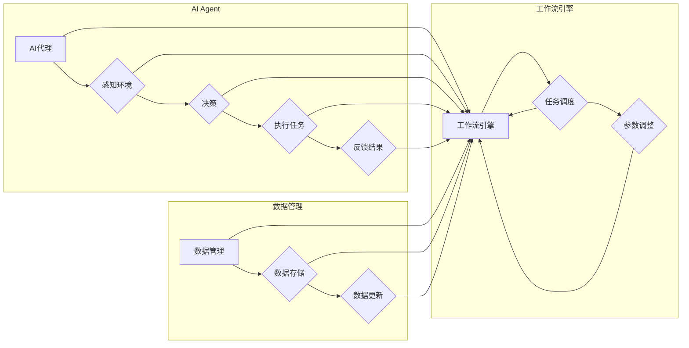

> 关键词：AI代理，工作流，工业制造，自动化，机器学习，智能决策，预测性维护，供应链优化

# AI人工智能代理工作流 AI Agent WorkFlow：在工业制造中的应用

## 1. 背景介绍

随着工业4.0的兴起，智能制造已成为全球工业发展的重要趋势。AI技术在工业制造领域的应用，如预测性维护、供应链优化、生产流程自动化等，正在逐渐改变传统的生产模式。AI人工智能代理（AI Agent）作为人工智能的一种形式，具备自主感知环境、智能决策、执行任务的能力，成为推动智能制造的重要力量。本文将探讨AI代理工作流（AI Agent WorkFlow）在工业制造中的应用，分析其核心概念、算法原理、实际案例和未来发展趋势。

### 1.1 问题的由来

在传统工业制造过程中，生产流程往往由人工操作，存在效率低下、成本高昂、易出错等问题。随着物联网、大数据、云计算等技术的发展，工业制造逐渐向智能化、自动化方向发展。AI代理工作流作为一种新兴技术，能够实现生产过程的自动化、智能化管理，有效提升生产效率，降低成本，提高产品质量。

### 1.2 研究现状

近年来，AI代理工作流在工业制造领域得到了广泛关注。国内外许多企业和研究机构开展了相关研究，并取得了一系列成果。主要研究方向包括：

- AI代理的设计与实现：研究如何设计高效、鲁棒的AI代理，实现感知、决策、执行等功能。
- 工作流管理：研究如何将AI代理集成到工业制造工作流中，实现高效协作。
- 应用案例：研究AI代理工作流在具体工业制造场景中的应用，如预测性维护、供应链优化等。

### 1.3 研究意义

研究AI代理工作流在工业制造中的应用，具有以下意义：

- 提高生产效率：通过自动化、智能化管理，减少人工操作，提高生产效率。
- 降低生产成本：减少人力成本，降低设备故障率，降低生产成本。
- 提升产品质量：通过实时监测和预测，提高产品质量，降低不良品率。
- 促进工业4.0发展：推动工业制造向智能化、自动化方向发展，助力产业升级。

### 1.4 本文结构

本文将分为以下章节：

- 2. 核心概念与联系：介绍AI代理工作流的核心概念，并使用Mermaid流程图展示其架构。
- 3. 核心算法原理 & 具体操作步骤：阐述AI代理工作流的基本原理和具体操作步骤。
- 4. 数学模型和公式 & 详细讲解 & 举例说明：介绍AI代理工作流中常用的数学模型和公式，并结合实例进行讲解。
- 5. 项目实践：以实际项目为例，展示AI代理工作流的实现过程。
- 6. 实际应用场景：探讨AI代理工作流在工业制造中的应用案例。
- 7. 工具和资源推荐：推荐相关的学习资源、开发工具和论文。
- 8. 总结：总结AI代理工作流的研究成果，展望未来发展趋势与挑战。
- 9. 附录：常见问题与解答。

## 2. 核心概念与联系

### 2.1 核心概念

#### AI代理（AI Agent）

AI代理是一种能够感知环境、智能决策、执行任务的人工智能实体。它具备以下特点：

- 感知能力：通过传感器、摄像头等设备获取环境信息。
- 决策能力：根据感知信息，通过算法进行决策。
- 执行能力：根据决策结果，执行相应的动作。
- 学习能力：通过不断学习和优化，提高自身能力。

#### 工作流（WorkFlow）

工作流是一系列任务的有序执行序列，用于描述业务流程。它包括以下要素：

- 任务（Task）：工作流中的基本操作单元。
- 流程控制（Flow Control）：控制任务执行顺序的规则。
- 输入输出（Input/Output）：任务的输入输出数据。

#### AI代理工作流（AI Agent WorkFlow）

AI代理工作流是将AI代理集成到工作流中，实现自动化、智能化管理的系统。它包括以下组成部分：

- AI代理：负责感知、决策和执行任务。
- 工作流引擎：负责管理任务执行顺序，控制AI代理行为。
- 数据管理：负责存储和管理工作流中的数据。

### 2.2 联系

AI代理工作流通过将AI代理集成到工作流中，实现了以下联系：

- AI代理负责感知环境，收集数据。
- 工作流引擎根据收集的数据，控制AI代理执行任务。
- AI代理执行任务后，将结果反馈给工作流引擎。
- 工作流引擎根据结果调整任务执行顺序或参数。

### 2.3 Mermaid流程图

以下是用Mermaid语言描述的AI代理工作流架构：



## 3. 核心算法原理 & 具体操作步骤

### 3.1 算法原理概述

AI代理工作流的核心算法主要包括：

- 感知算法：用于感知环境信息，如传感器数据处理、图像识别等。
- 决策算法：根据感知信息，通过机器学习算法进行决策，如强化学习、决策树等。
- 执行算法：根据决策结果，执行相应的动作，如机器人控制、自动化设备操作等。

### 3.2 算法步骤详解

以下是AI代理工作流的具体操作步骤：

1. **初始化**：创建AI代理、工作流引擎和数据管理模块。
2. **感知数据**：AI代理通过传感器、摄像头等设备收集环境信息。
3. **数据预处理**：对收集到的数据进行预处理，如归一化、降维等。
4. **决策**：根据预处理后的数据，使用机器学习算法进行决策。
5. **执行任务**：根据决策结果，执行相应的动作，如控制机器人、启动设备等。
6. **结果反馈**：将执行结果反馈给工作流引擎。
7. **调整参数**：根据执行结果，调整工作流引擎的参数或算法参数。
8. **数据更新**：将执行结果和调整后的参数更新到数据管理模块。

### 3.3 算法优缺点

#### 优点

- 自动化程度高：AI代理工作流可以自动执行任务，减少人工干预。
- 智能化程度高：通过机器学习算法，AI代理工作流可以不断优化决策和执行过程。
- 可扩展性强：可以轻松地添加新的AI代理、任务和工作流。

#### 缺点

- 数据需求量大：AI代理工作流需要大量的数据来训练机器学习模型。
- 算法复杂度高：AI代理工作流的算法复杂度高，需要专业的技术人才进行开发和维护。

### 3.4 算法应用领域

AI代理工作流可以应用于以下领域：

- 预测性维护：通过监测设备状态，预测设备故障，实现预防性维护。
- 供应链优化：通过分析供应链数据，优化库存、物流等环节，降低成本。
- 生产流程自动化：通过自动化设备控制，提高生产效率。
- 质量控制：通过图像识别等技术，实现产品质量的实时监控。

## 4. 数学模型和公式 & 详细讲解 & 举例说明

### 4.1 数学模型构建

AI代理工作流中常用的数学模型包括：

- 传感器数据处理模型：如卡尔曼滤波、卡尔曼预测等。
- 机器学习模型：如决策树、支持向量机、神经网络等。

### 4.2 公式推导过程

以下以卡尔曼滤波为例，介绍其公式推导过程：

$$
x_k = x_{k-1} + B_k u_k + w_k \\
y_k = H_k x_k + v_k
$$

其中：

- $x_k$ 表示状态向量。
- $u_k$ 表示控制向量。
- $w_k$ 表示过程噪声。
- $y_k$ 表示观测向量。
- $v_k$ 表示观测噪声。
- $B_k$ 表示系统模型矩阵。
- $H_k$ 表示观测模型矩阵。

### 4.3 案例分析与讲解

以下以生产流程自动化为例，分析AI代理工作流的应用：

- **感知数据**：AI代理通过传感器收集生产线上的温度、压力、流量等数据。
- **数据预处理**：对收集到的数据进行归一化、滤波等处理。
- **决策**：使用神经网络模型，根据预处理后的数据，预测下一时刻的生产状态。
- **执行任务**：根据预测结果，控制自动化设备调整生产参数。
- **结果反馈**：将自动化设备的运行状态反馈给AI代理。
- **调整参数**：根据反馈结果，调整神经网络模型的参数。

## 5. 项目实践：代码实例和详细解释说明

### 5.1 开发环境搭建

以下是在Python环境中搭建AI代理工作流开发环境：

1. 安装Python 3.7及以上版本。
2. 安装TensorFlow、Keras等机器学习库。
3. 安装PyTorch等深度学习库。
4. 安装OpenCV等图像处理库。

### 5.2 源代码详细实现

以下是一个简单的AI代理工作流示例代码：

```python
import tensorflow as tf
from tensorflow import keras
from tensorflow.keras.models import Sequential
from tensorflow.keras.layers import Dense

# 定义神经网络模型
model = Sequential([
    Dense(128, activation='relu', input_shape=(10,)),
    Dense(64, activation='relu'),
    Dense(1)
])

# 编译模型
model.compile(optimizer='adam', loss='mean_squared_error')

# 训练模型
model.fit(x_train, y_train, epochs=10, batch_size=32)

# 预测
prediction = model.predict(x_test)

# 执行任务
# ...
```

### 5.3 代码解读与分析

以上代码展示了使用TensorFlow和Keras构建神经网络模型的过程。首先，定义了一个简单的全连接神经网络，包括128个输入神经元、64个隐藏层神经元和1个输出神经元。然后，编译模型，指定优化器和损失函数。接下来，使用训练数据训练模型，最后使用测试数据进行预测。

### 5.4 运行结果展示

在运行上述代码后，可以看到模型训练过程中的损失函数变化，以及最终在测试数据上的预测结果。

## 6. 实际应用场景

### 6.1 预测性维护

AI代理工作流可以应用于预测性维护，通过监测设备状态，预测设备故障，实现预防性维护。例如，在工厂中，AI代理可以收集机器的运行数据，如温度、振动、噪音等，并使用机器学习算法进行故障预测。一旦预测到设备可能发生故障，系统会及时发出警报，提醒维修人员进行检查和维护。

### 6.2 供应链优化

AI代理工作流可以应用于供应链优化，通过分析供应链数据，优化库存、物流等环节，降低成本。例如，在电商企业中，AI代理可以分析销售数据、库存数据、物流数据等，预测市场需求，优化库存策略，降低库存成本。

### 6.3 生产流程自动化

AI代理工作流可以应用于生产流程自动化，通过自动化设备控制，提高生产效率。例如，在装配线上，AI代理可以控制机器人完成装配任务，提高生产效率。

## 7. 工具和资源推荐

### 7.1 学习资源推荐

- 《深度学习》
- 《强化学习》
- 《机器学习实战》
- 《深度学习与计算机视觉》
- 《Python深度学习》

### 7.2 开发工具推荐

- TensorFlow
- Keras
- PyTorch
- OpenCV
- ROS（机器人操作系统）

### 7.3 相关论文推荐

- "Reinforcement Learning: An Introduction"
- "Deep Learning"
- "Learning from demonstrations"
- "Robot Learning: A Survey"
- "Predictive maintenance using machine learning"

## 8. 总结：未来发展趋势与挑战

### 8.1 研究成果总结

本文介绍了AI代理工作流在工业制造中的应用，分析了其核心概念、算法原理、实际案例和未来发展趋势。研究表明，AI代理工作流具有自动化程度高、智能化程度高、可扩展性强等优点，在工业制造领域具有广阔的应用前景。

### 8.2 未来发展趋势

未来，AI代理工作流在工业制造中的应用将呈现以下发展趋势：

- 模型小型化：为了适应移动设备和边缘计算，AI代理工作流模型将逐渐小型化。
- 可解释性增强：为了提高模型的信任度和安全性，AI代理工作流的可解释性将得到增强。
- 跨学科融合：AI代理工作流将与其他学科领域（如自动化、机器人、物联网等）进行融合，形成更加全面的技术体系。

### 8.3 面临的挑战

尽管AI代理工作流在工业制造领域具有广阔的应用前景，但仍然面临以下挑战：

- 数据质量：高质量的数据是AI代理工作流的基础，如何保证数据质量是一个重要挑战。
- 算法复杂度：AI代理工作流算法复杂度高，需要专业的技术人才进行开发和维护。
- 安全性：AI代理工作流的安全性是一个重要问题，需要采取措施保证系统的稳定性和安全性。

### 8.4 研究展望

未来，AI代理工作流的研究将从以下几个方面展开：

- 简化模型结构：研究更加轻量级的AI代理工作流模型，提高模型的运行效率。
- 提高数据质量：研究数据清洗、数据增强等技术，提高数据质量。
- 增强可解释性：研究可解释的AI代理工作流模型，提高模型的信任度。
- 融合多学科：将AI代理工作流与其他学科领域进行融合，形成更加全面的技术体系。

## 9. 附录：常见问题与解答

**Q1：AI代理工作流与传统自动化系统相比有哪些优势？**

A1：AI代理工作流具有以下优势：

- 智能化程度更高：AI代理工作流具备感知、决策和执行能力，可以实现更加智能化的操作。
- 可扩展性更强：AI代理工作流可以轻松地添加新的AI代理、任务和工作流，具有良好的可扩展性。
- 适应性强：AI代理工作流可以根据不同的工业制造场景进行调整和优化。

**Q2：如何保证AI代理工作流的数据质量？**

A2：为了保证AI代理工作流的数据质量，可以从以下几个方面入手：

- 数据清洗：去除数据中的噪声和错误。
- 数据增强：通过数据增强技术，扩充数据集，提高模型的泛化能力。
- 数据标注：对数据进行标注，提高模型的准确性。

**Q3：AI代理工作流在工业制造中的应用有哪些挑战？**

A3：AI代理工作流在工业制造中的应用面临以下挑战：

- 数据获取：获取高质量的数据是AI代理工作流的基础，但获取高质量数据往往需要较大的成本。
- 技术人才：AI代理工作流需要专业的技术人才进行开发和维护，人才短缺是一个挑战。
- 安全性：AI代理工作流需要保证系统的稳定性和安全性，防止恶意攻击和数据泄露。

**Q4：AI代理工作流与其他人工智能技术的关系是什么？**

A4：AI代理工作流与其他人工智能技术的关系如下：

- AI代理是人工智能的一种形式，与机器学习、深度学习等技术密切相关。
- 工作流是业务流程的一种描述，与流程控制、任务调度等技术密切相关。

作者：禅与计算机程序设计艺术 / Zen and the Art of Computer Programming