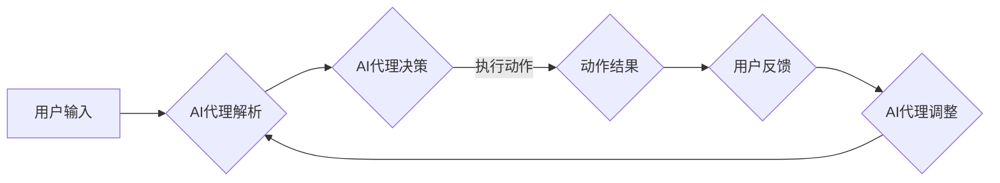

# AI人工智能代理工作流AI Agent WorkFlow：人工智能代理与用户体验设计

> 关键词：人工智能代理，工作流，用户体验设计，AI UX，交互设计，自动化，智能决策，人机协作

## 1. 背景介绍

随着人工智能技术的飞速发展，人工智能代理（AI Agent）逐渐成为推动智能化服务的关键角色。AI代理通过模拟人类智能，能够在特定领域内进行自主决策和执行任务，极大地提高了自动化水平和工作效率。然而，随着AI代理的广泛应用，用户体验设计（UX）在AI代理系统中的重要性日益凸显。本文将探讨AI人工智能代理工作流（AI Agent WorkFlow）的设计，以及如何通过用户体验设计提升AI代理的易用性和交互体验。

### 1.1 问题的由来

传统的工作流程往往依赖于人工操作，存在效率低下、出错率高、难以扩展等问题。随着人工智能技术的发展，AI代理的出现为工作流程的自动化提供了新的可能性。然而，AI代理的引入也带来了新的挑战：

- **交互体验**：AI代理的交互方式与传统人工操作存在差异，需要新的用户体验设计理念。
- **智能决策**：AI代理的决策过程可能复杂，需要用户能够理解并信任其行为。
- **人机协作**：AI代理与人类用户的协作模式需要新的设计思路。

### 1.2 研究现状

目前，AI代理的UX设计还处于探索阶段，但已有一些研究和实践开始关注这一领域。以下是一些关键点：

- **交互设计**：采用自然语言处理、语音识别等技术，实现自然的人机交互。
- **可视化设计**：通过图形化界面，展示AI代理的工作流程和决策过程。
- **可解释性设计**：提高AI代理的决策透明度，增强用户信任感。
- **个性化设计**：根据用户行为和偏好，提供定制化的服务。

### 1.3 研究意义

研究AI人工智能代理工作流的用户体验设计，对于以下方面具有重要意义：

- **提升效率**：优化工作流程，减少人工干预，提高工作效率。
- **降低成本**：减少人力成本，实现资源的合理配置。
- **提升满意度**：提供更好的用户体验，提高用户满意度。
- **促进创新**：推动AI代理技术的应用和发展。

### 1.4 本文结构

本文将围绕AI人工智能代理工作流的用户体验设计展开，具体结构如下：

- 第2章：介绍AI代理和用户体验设计的相关概念。
- 第3章：探讨AI人工智能代理工作流的设计原则和步骤。
- 第4章：分析AI人工智能代理工作流的数学模型和公式。
- 第5章：通过项目实践展示AI代理工作流的设计与实现。
- 第6章：介绍AI代理工作流的实际应用场景。
- 第7章：展望AI代理工作流的未来发展趋势与挑战。
- 第8章：总结全文，并对未来研究方向进行展望。

## 2. 核心概念与联系

### 2.1 AI代理

AI代理是一种能够模拟人类智能，在特定领域内进行自主决策和执行任务的计算机程序。它通常具有以下特点：

- **自主性**：能够自主地感知环境、做出决策和执行动作。
- **适应性**：能够根据环境变化调整自己的行为策略。
- **协作性**：能够与其他AI代理或人类用户进行协作。

### 2.2 用户体验设计

用户体验设计（UX设计）是指设计者从用户的角度出发，通过创造产品和服务，提升用户的满意度和忠诚度。UX设计包括以下几个方面：

- **可用性**：产品易于使用，用户能够顺利完成操作。
- **可用性**：产品符合用户的预期，能够满足用户的需求。
- **满意度**：用户对产品或服务的整体感受良好。

### 2.3 Mermaid 流程图

以下是一个AI人工智能代理工作流的Mermaid流程图示例：



该流程图展示了AI代理工作流的基本流程，包括用户输入、AI代理解析、AI代理决策、执行动作、动作结果、用户反馈、AI代理调整等环节。

## 3. 核心算法原理 & 具体操作步骤

### 3.1 算法原理概述

AI人工智能代理工作流的核心算法原理是基于人工智能技术，包括自然语言处理、机器学习、知识图谱等。以下是基本原理：

- **自然语言处理**：解析用户输入，理解用户意图。
- **机器学习**：根据历史数据，学习用户行为和偏好。
- **知识图谱**：提供领域知识，辅助AI代理做出决策。

### 3.2 算法步骤详解

AI人工智能代理工作流的算法步骤如下：

1. **用户输入**：用户通过语音、文本等方式输入请求。
2. **AI代理解析**：AI代理使用自然语言处理技术解析用户输入，提取用户意图和关键信息。
3. **AI代理决策**：AI代理根据解析结果和领域知识，做出决策。
4. **执行动作**：AI代理执行决策，完成任务。
5. **动作结果**：将动作结果反馈给用户。
6. **用户反馈**：用户对动作结果进行评价。
7. **AI代理调整**：根据用户反馈，AI代理调整自己的行为策略。

### 3.3 算法优缺点

AI人工智能代理工作流的优点包括：

- **自动化**：提高工作效率，减少人工干预。
- **个性化**：根据用户行为和偏好提供定制化服务。
- **智能决策**：基于数据和知识做出更合理的决策。

其缺点包括：

- **技术复杂**：需要复杂的算法和技术支持。
- **成本高**：开发和维护成本较高。
- **安全性**：存在数据安全和隐私风险。

### 3.4 算法应用领域

AI人工智能代理工作流可应用于以下领域：

- **客服服务**：提供24/7的智能客服，快速响应用户需求。
- **智能助手**：为用户提供个性化的服务，如日程管理、购物推荐等。
- **智能办公**：自动化处理办公流程，提高工作效率。
- **智能交通**：优化交通流量，减少拥堵。

## 4. 数学模型和公式 & 详细讲解 & 举例说明

### 4.1 数学模型构建

AI人工智能代理工作流的数学模型主要包括以下几个方面：

- **自然语言处理**：使用循环神经网络（RNN）或Transformer模型进行文本处理。
- **机器学习**：使用决策树、支持向量机（SVM）或深度学习模型进行预测和分类。
- **知识图谱**：使用图论和图嵌入技术进行知识表示和推理。

### 4.2 公式推导过程

以下是一个简单的文本分类问题的公式推导过程：

假设我们有一个文本分类问题，文本表示为向量 $x \in \mathbb{R}^n$，类别标签为 $y \in \{1, 2, ..., K\}$。我们使用softmax回归模型进行分类，损失函数为交叉熵损失：

$$
L(y, \hat{y}) = -\sum_{i=1}^K y_i \log(\hat{y}_i)
$$

其中 $\hat{y}_i = \frac{e^{w^T x}}{\sum_{j=1}^K e^{w^T x_j}}$，$w$ 为模型的权重。

### 4.3 案例分析与讲解

以下是一个AI人工智能代理工作流的案例分析：

**案例**：智能客服系统

**任务**：根据用户输入的咨询内容，智能客服系统需要快速定位问题并给出合适的答复。

**技术**：

- **自然语言处理**：使用BERT模型对用户输入进行文本处理，提取关键词和语义信息。
- **机器学习**：使用朴素贝叶斯分类器对提取的关键词进行分类，确定问题类型。
- **知识图谱**：使用知识图谱提供产品信息、常见问题解答等知识。

**流程**：

1. 用户输入咨询内容。
2. BERT模型对输入文本进行文本处理。
3. 朴素贝叶斯分类器对关键词进行分类，确定问题类型。
4. 知识图谱提供相关信息。
5. 智能客服系统输出答复。

## 5. 项目实践：代码实例和详细解释说明

### 5.1 开发环境搭建

为了进行AI人工智能代理工作流的项目实践，我们需要以下开发环境：

- Python 3.8及以上版本
- PyTorch 1.8及以上版本
- Transformers库
- scikit-learn库

### 5.2 源代码详细实现

以下是一个简单的智能客服系统示例代码：

```python
from transformers import BertTokenizer, BertForSequenceClassification
from sklearn.naive_bayes import MultinomialNB
from sklearn.pipeline import make_pipeline

# 加载预训练模型和分词器
tokenizer = BertTokenizer.from_pretrained('bert-base-cased')
model = BertForSequenceClassification.from_pretrained('bert-base-cased')

# 加载数据集
train_texts = [...] # 训练文本数据
train_labels = [...] # 训练标签

# 训练朴素贝叶斯分类器
clf = make_pipeline(BertTokenizer.from_pretrained('bert-base-cased'), MultinomialNB())

clf.fit(train_texts, train_labels)

# 预测
def predict(text):
    inputs = tokenizer(text, return_tensors="pt", padding=True, truncation=True)
    outputs = model(**inputs)
    return outputs.logits.argmax(dim=-1).item()

# 输入
user_input = "我想了解你们的售后服务政策"

# 预测
predicted_label = predict(user_input)

# 输出
print(f"预测结果：{predicted_label}")
```

### 5.3 代码解读与分析

上述代码展示了如何使用PyTorch和Transformers库加载预训练模型和分词器，使用scikit-learn库的朴素贝叶斯分类器进行分类，以及如何使用模型进行预测。

### 5.4 运行结果展示

当用户输入“我想了解你们的售后服务政策”时，系统会使用BERT模型对输入文本进行处理，提取关键词和语义信息，然后使用朴素贝叶斯分类器进行分类，最终输出预测结果。

## 6. 实际应用场景

### 6.1 智能客服系统

智能客服系统是AI人工智能代理工作流最常见的应用场景之一。通过AI代理，企业可以提供24/7的客服服务，快速响应用户需求，提高客户满意度。

### 6.2 智能助手

智能助手是另一种常见的AI代理应用场景。通过AI代理，用户可以获得个性化的服务，如日程管理、购物推荐等。

### 6.3 智能办公

AI代理可以应用于智能办公场景，自动化处理办公流程，提高工作效率。

### 6.4 智能交通

AI代理可以应用于智能交通场景，优化交通流量，减少拥堵。

## 7. 工具和资源推荐

### 7.1 学习资源推荐

- 《深度学习》
- 《Python编程：从入门到实践》
- 《自然语言处理入门》
- 《人工智能：一种现代的方法》

### 7.2 开发工具推荐

- PyTorch
- TensorFlow
- Transformers库
- scikit-learn

### 7.3 相关论文推荐

- BERT: Pre-training of Deep Bidirectional Transformers for Language Understanding
- Attention is All You Need
- Language Models are Unsupervised Multitask Learners

## 8. 总结：未来发展趋势与挑战

### 8.1 研究成果总结

本文介绍了AI人工智能代理工作流的概念、设计原则、算法原理和实际应用场景。通过项目实践，展示了如何使用Python和PyTorch等工具实现AI代理工作流。

### 8.2 未来发展趋势

未来，AI人工智能代理工作流将在以下几个方面取得进展：

- **技术融合**：AI代理将与其他技术（如物联网、区块链等）融合，实现更广泛的应用。
- **智能化**：AI代理将具备更强的智能，能够进行更复杂的决策和执行任务。
- **个性化**：AI代理将根据用户行为和偏好提供更加个性化的服务。

### 8.3 面临的挑战

AI人工智能代理工作流在发展过程中也面临着以下挑战：

- **技术挑战**：需要解决算法复杂度高、模型可解释性差等问题。
- **伦理挑战**：需要考虑AI代理的决策过程是否公正、公平。
- **法律法规挑战**：需要制定相应的法律法规，规范AI代理的应用。

### 8.4 研究展望

为了推动AI人工智能代理工作流的发展，未来的研究需要在以下几个方面展开：

- **算法优化**：提高算法的效率和可解释性。
- **伦理研究**：研究AI代理的伦理问题，确保其应用符合伦理道德规范。
- **法律法规研究**：制定相应的法律法规，规范AI代理的应用。

通过不断的技术创新和伦理研究，AI人工智能代理工作流将更好地服务于人类社会，推动智能化时代的到来。

## 9. 附录：常见问题与解答

**Q1：AI代理的工作原理是什么？**

A：AI代理通过模拟人类智能，在特定领域内进行自主决策和执行任务。它通常包括感知、决策、执行、反馈等环节。

**Q2：AI代理的交互方式有哪些？**

A：AI代理的交互方式包括自然语言交互、语音交互、手势交互等。

**Q3：如何设计AI代理的工作流？**

A：设计AI代理的工作流需要考虑以下因素：任务需求、用户需求、技术能力等。

**Q4：AI代理的优缺点是什么？**

A：AI代理的优点包括自动化、个性化、智能决策等；缺点包括技术复杂、成本高、安全性等问题。

**Q5：AI代理的应用领域有哪些？**

A：AI代理的应用领域包括智能客服、智能助手、智能办公、智能交通等。

---

作者：禅与计算机程序设计艺术 / Zen and the Art of Computer Programming