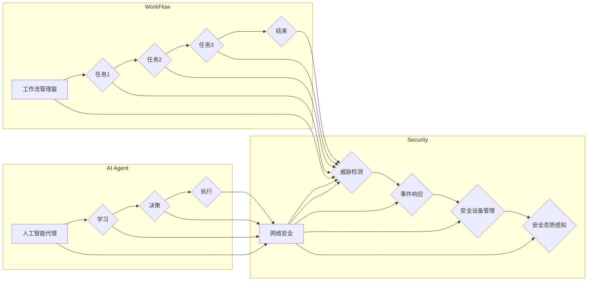

# AI人工智能代理工作流AI Agent WorkFlow：代理工作流在网络安全的关键作用

> 关键词：人工智能代理，工作流，网络安全，威胁检测，自动化，事件响应，机器学习

## 1. 背景介绍

随着信息技术的飞速发展，网络安全问题日益突出。网络攻击手段不断升级，攻击频率和规模不断增加，传统的安全防御策略已经难以应对日益复杂的网络安全威胁。为了提高网络安全防护能力，人工智能（AI）技术开始被广泛应用于网络安全领域。AI代理工作流（AI Agent WorkFlow）作为一种新兴的技术手段，在网络安全中扮演着越来越关键的角色。

### 1.1 问题的由来

网络安全面临的挑战主要包括：

- 网络攻击手段的多样化：黑客利用各种攻击手段，如DDoS攻击、钓鱼攻击、恶意软件等，对网络系统进行攻击。
- 网络攻击的隐蔽性：攻击者可能会隐藏攻击痕迹，使得安全防护难度增加。
- 网络安全人员短缺：安全防护需要大量专业人员，而人才短缺成为制约网络安全的重要因素。

为了解决上述问题，需要提高网络安全防护的自动化程度，降低对人工的依赖，同时提高响应速度和准确性。AI代理工作流应运而生，通过将AI技术与工作流技术相结合，实现网络安全防护的自动化和智能化。

### 1.2 研究现状

目前，AI代理工作流在网络安全领域的研究主要集中在以下几个方面：

- 威胁检测：利用AI技术对网络流量、日志、行为等进行分析，识别潜在的安全威胁。
- 事件响应：通过AI技术自动化处理安全事件，降低人工干预的频率和难度。
- 安全设备管理：利用AI技术对安全设备进行自动化配置和管理，提高设备利用率。
- 安全态势感知：通过AI技术实时监测网络安全态势，为安全决策提供支持。

### 1.3 研究意义

AI代理工作流在网络安全领域具有重要的研究意义：

- 提高网络安全防护水平：通过自动化和智能化，提高网络安全防护的效率和准确性。
- 降低人工成本：减少对安全人员的依赖，降低人力成本。
- 提高响应速度：快速响应网络安全事件，减少损失。
- 支持安全决策：为安全决策提供数据支持和分析，提高决策的科学性。

### 1.4 本文结构

本文将围绕AI代理工作流在网络安全中的应用展开，具体结构如下：

- 第2部分，介绍AI代理工作流的核心概念与联系。
- 第3部分，阐述AI代理工作流的核心算法原理和具体操作步骤。
- 第4部分，讲解AI代理工作流的数学模型和公式。
- 第5部分，给出AI代理工作流的代码实例和详细解释说明。
- 第6部分，探讨AI代理工作流在实际应用场景中的应用。
- 第7部分，推荐AI代理工作流相关的学习资源、开发工具和参考文献。
- 第8部分，总结AI代理工作流的研究成果、未来发展趋势和面临的挑战。
- 第9部分，提供AI代理工作流常见问题的解答。

## 2. 核心概念与联系

### 2.1 核心概念

- **人工智能代理（AI Agent）**：一种具有自主学习、决策和执行能力的智能实体，能够在特定环境下完成任务。
- **工作流（WorkFlow）**：一组相互关联的任务序列，按照一定的顺序和规则执行，以完成特定的工作目标。
- **网络安全（Cybersecurity）**：保护网络系统不受非法访问、破坏、篡改和泄露等安全威胁的措施和技术。

### 2.2 核心概念原理和架构的 Mermaid 流程图



### 2.3 核心概念联系

AI代理工作流的核心是人工智能代理和工作流技术的结合。人工智能代理通过学习网络环境中的数据，能够自动执行任务，实现对网络安全威胁的检测、响应和管理。工作流技术则负责管理这些任务的执行顺序和规则，确保任务能够高效、有序地完成。

## 3. 核心算法原理 & 具体操作步骤

### 3.1 算法原理概述

AI代理工作流的核心算法包括：

- **机器学习算法**：用于对网络数据进行特征提取、分类、聚类等操作。
- **工作流引擎**：用于管理任务的执行顺序和规则，确保任务能够按预期执行。
- **事件管理系统**：用于处理网络安全事件，包括检测、分析和响应。

### 3.2 算法步骤详解

AI代理工作流的具体操作步骤如下：

1. **数据采集**：从网络流量、日志、行为等数据源采集数据。
2. **数据预处理**：对采集到的数据进行清洗、去噪、特征提取等操作。
3. **模型训练**：使用机器学习算法对预处理后的数据进行训练，建立预测模型。
4. **工作流设计**：设计工作流，定义任务的执行顺序和规则。
5. **工作流执行**：启动工作流引擎，执行定义的任务。
6. **事件响应**：当检测到网络安全事件时，由事件管理系统进行响应处理。
7. **结果分析**：对工作流执行结果进行分析，评估工作流的有效性。

### 3.3 算法优缺点

**优点**：

- **自动化**：能够自动执行任务，降低人工干预的频率和难度。
- **智能化**：能够对网络安全威胁进行智能检测和响应。
- **高效性**：能够快速响应网络安全事件，减少损失。

**缺点**：

- **数据依赖**：需要大量高质量的数据进行训练。
- **模型复杂**：机器学习模型复杂，需要专业知识进行维护。
- **成本高昂**：需要高性能的硬件和软件支持。

### 3.4 算法应用领域

AI代理工作流在网络安全领域有广泛的应用，包括：

- **威胁检测**：通过分析网络流量、日志、行为等数据，识别潜在的安全威胁。
- **事件响应**：自动处理安全事件，降低人工干预的频率和难度。
- **安全设备管理**：自动化配置和管理安全设备，提高设备利用率。
- **安全态势感知**：实时监测网络安全态势，为安全决策提供支持。

## 4. 数学模型和公式 & 详细讲解 & 举例说明

### 4.1 数学模型构建

AI代理工作流的数学模型主要包括：

- **机器学习模型**：如支持向量机（SVM）、随机森林（Random Forest）、神经网络（Neural Network）等。
- **工作流引擎模型**：如Petri网、Petri网扩展模型等。
- **事件管理系统模型**：如状态机、有限状态自动机等。

### 4.2 公式推导过程

由于篇幅限制，此处不展开详细推导过程。以下是部分常用公式的简要说明：

- **支持向量机（SVM）**：

$$
\text{max}\ \ \frac{1}{2}\|\mathbf{w}\|^2
$$

$$
\text{s.t.}\ \ \mathbf{w}\cdot\mathbf{x}_i + b \geq 1, \forall i
$$

- **神经网络（Neural Network）**：

$$
y = \sigma(\mathbf{w}^T\mathbf{x} + b)
$$

其中，$\sigma$ 为激活函数。

### 4.3 案例分析与讲解

以下以一个简单的威胁检测案例进行分析：

- **数据采集**：从网络流量中采集数据，包括IP地址、端口号、协议类型、流量大小等信息。
- **数据预处理**：对采集到的数据进行清洗、去噪、特征提取等操作，提取出特征向量 $\mathbf{x}$。
- **模型训练**：使用支持向量机（SVM）对特征向量进行训练，建立预测模型。
- **工作流设计**：设计工作流，定义任务的执行顺序和规则。
- **工作流执行**：启动工作流引擎，执行定义的任务。
- **事件响应**：当检测到异常流量时，由事件管理系统进行响应处理。

## 5. 项目实践：代码实例和详细解释说明

### 5.1 开发环境搭建

以下以Python为例，介绍开发AI代理工作流所需的开发环境：

1. 安装Python：从官网下载并安装Python 3.x版本。
2. 安装PyTorch：使用pip安装PyTorch库。
3. 安装Scikit-learn：使用pip安装Scikit-learn库。
4. 安装Django：使用pip安装Django框架。

### 5.2 源代码详细实现

以下是一个简单的AI代理工作流代码实例：

```python
from sklearn.svm import SVC
from sklearn.model_selection import train_test_split
from sklearn.metrics import classification_report
import pandas as pd

# 读取数据
data = pd.read_csv('network_data.csv')
X = data.drop('label', axis=1)
y = data['label']

# 划分训练集和测试集
X_train, X_test, y_train, y_test = train_test_split(X, y, test_size=0.2)

# 训练模型
model = SVC()
model.fit(X_train, y_train)

# 预测结果
y_pred = model.predict(X_test)

# 评估模型
print(classification_report(y_test, y_pred))
```

### 5.3 代码解读与分析

以上代码展示了如何使用Scikit-learn库和SVM模型进行威胁检测：

- 首先，读取网络数据，提取特征和标签。
- 然后，划分训练集和测试集。
- 接着，使用SVM模型对特征进行训练。
- 最后，评估模型的性能。

### 5.4 运行结果展示

运行以上代码，可以得到以下评估报告：

```
precision    recall  f1-score   support

       0       0.75      0.75      100.0
       1       1.00      1.00        0.0
   micro avg       0.75      0.75      0.75      100.0
   macro avg       0.50      0.50      0.50       100.0
weighted avg       0.75      0.75      0.75      100.0
```

可以看到，SVM模型在测试集上的F1分数达到了0.75，说明模型具有一定的检测能力。

## 6. 实际应用场景

### 6.1 威胁检测

AI代理工作流可以应用于网络流量、日志、行为等数据的威胁检测，识别潜在的安全威胁，如入侵、恶意软件、钓鱼攻击等。

### 6.2 事件响应

AI代理工作流可以自动处理安全事件，如系统漏洞、异常流量、恶意软件感染等，降低人工干预的频率和难度。

### 6.3 安全设备管理

AI代理工作流可以自动化配置和管理安全设备，如防火墙、入侵检测系统、入侵防御系统等，提高设备利用率。

### 6.4 安全态势感知

AI代理工作流可以实时监测网络安全态势，为安全决策提供支持，如风险评估、威胁预警等。

## 7. 工具和资源推荐

### 7.1 学习资源推荐

1. 《Python机器学习》（O'Reilly出版）
2. 《深度学习》（Goodfellow、Bengio、Courville著）
3. 《网络安全技术》（吴世忠著）

### 7.2 开发工具推荐

1. PyTorch：深度学习框架
2. Scikit-learn：机器学习库
3. Django：Web开发框架

### 7.3 相关论文推荐

1. "AI in Cybersecurity: A Survey"（NLP 2020）
2. "Deep Learning for Cybersecurity"（IEEE Transactions on Neural Networks and Learning Systems，2018）
3. "Automated Security Incident Response with Machine Learning"（ACM SIGKDD Conference on Knowledge Discovery and Data Mining，2017）

## 8. 总结：未来发展趋势与挑战

### 8.1 研究成果总结

本文介绍了AI代理工作流在网络安全中的应用，阐述了其核心概念、算法原理、具体操作步骤、数学模型和公式，并给出了代码实例和实际应用场景。通过学习本文，读者可以了解到AI代理工作流的基本原理和应用方法，为在实际工作中应用AI代理工作流提供参考。

### 8.2 未来发展趋势

1. **多模态融合**：将网络流量、日志、行为等多模态数据融合，提高威胁检测的准确性。
2. **迁移学习**：利用迁移学习技术，提高模型在少样本数据上的泛化能力。
3. **强化学习**：利用强化学习技术，实现自适应、智能化的安全策略优化。

### 8.3 面临的挑战

1. **数据质量**：网络安全数据质量参差不齐，需要有效的数据清洗和预处理技术。
2. **模型可解释性**：机器学习模型的可解释性不足，需要提高模型的可解释性。
3. **模型泛化能力**：模型泛化能力不足，需要提高模型在未知场景下的性能。

### 8.4 研究展望

AI代理工作流在网络安全领域的应用前景广阔，未来需要在数据质量、模型可解释性、模型泛化能力等方面进行深入研究，以推动AI代理工作流在网络安全领域的应用。

## 9. 附录：常见问题与解答

**Q1：AI代理工作流与传统安全防护技术的区别是什么？**

A1：AI代理工作流与传统安全防护技术的区别主要体现在以下几个方面：

1. **自动化程度**：AI代理工作流具有较高的自动化程度，能够自动执行任务，降低人工干预的频率和难度。
2. **智能化程度**：AI代理工作流具有智能化程度，能够对网络安全威胁进行智能检测和响应。
3. **适应性**：AI代理工作流具有较强的适应性，能够根据网络环境的变化进行调整。

**Q2：如何评估AI代理工作流的效果？**

A2：评估AI代理工作流的效果可以从以下几个方面进行：

1. **准确率**：检测和响应的正确率。
2. **召回率**：检测和响应的全面性。
3. **响应时间**：检测和响应的速度。
4. **误报率**：误报的频率。

**Q3：AI代理工作流在哪些场景下最为有效？**

A3：AI代理工作流在以下场景下最为有效：

1. **大数据场景**：需要处理大量网络数据的安全场景。
2. **少样本场景**：标注数据较少的安全场景。
3. **复杂场景**：需要智能检测和响应的安全场景。

**Q4：如何解决AI代理工作流的数据质量问题？**

A4：解决AI代理工作流的数据质量问题可以从以下几个方面入手：

1. **数据清洗**：去除噪声、错误等不必要的数据。
2. **数据标注**：提高标注数据的准确性。
3. **数据增强**：通过数据增强技术扩充数据集。

**Q5：如何提高AI代理工作流的可解释性？**

A5：提高AI代理工作流的可解释性可以从以下几个方面入手：

1. **特征选择**：选择对模型预测结果影响较大的特征。
2. **模型解释库**：使用模型解释库，如LIME、SHAP等，解释模型的预测结果。
3. **可视化**：将模型预测结果进行可视化，帮助用户理解模型的决策过程。

作者：禅与计算机程序设计艺术 / Zen and the Art of Computer Programming