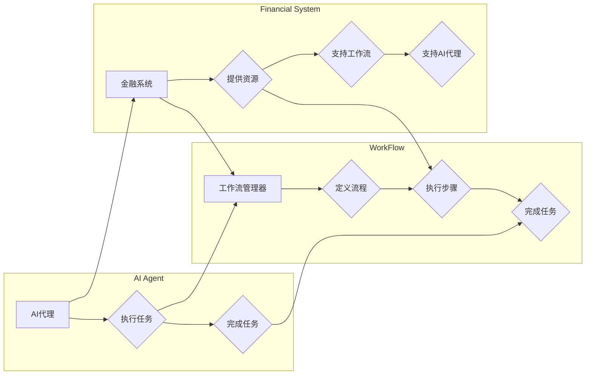

> AI代理, 工作流, 金融系统, 智能决策, 自主服务, 机器学习, 自然语言处理, 智能化

# AI人工智能代理工作流AI Agent WorkFlow：智能代理在金融系统中的应用

## 1. 背景介绍

在数字化和自动化转型的浪潮中，金融行业正经历着前所未有的变革。传统的金融流程，如风险管理、客户服务、交易执行等，越来越多地依赖于人工智能（AI）技术。其中，AI代理（AI Agent）作为一种新兴的技术，正成为金融系统智能化转型的关键驱动力。AI代理工作流（AI Agent WorkFlow）则是对AI代理在金融系统中应用的一种系统化方法。

### 1.1 问题的由来

金融系统的复杂性使得传统的手动处理方式难以满足高效、准确和合规的要求。以下是AI代理工作流应运而生的几个主要原因：

- **处理速度**：金融交易和市场分析需要实时处理大量数据，人工操作难以达到所需的速度。
- **准确性**：复杂交易决策需要高度精确的数据分析和预测，人类难以避免人为错误。
- **合规性**：金融行业受到严格的监管，需要确保所有操作符合法律法规。
- **个性化服务**：客户需求日益多样化，需要提供定制化的金融产品和服务。

### 1.2 研究现状

目前，AI代理在金融系统中的应用主要集中在以下几个方面：

- **风险管理**：通过分析市场数据，预测市场风险，并自动调整投资组合。
- **客户服务**：提供24/7的客户服务，解答客户疑问，处理客户投诉。
- **交易执行**：自动化执行交易订单，提高交易效率和准确性。
- **合规监控**：监控交易行为，确保符合监管要求。

### 1.3 研究意义

AI代理工作流在金融系统中的应用具有以下重要意义：

- **提高效率**：自动化处理金融任务，减少人工操作，提高效率。
- **降低成本**：减少人力成本，降低错误率，降低运营成本。
- **提升客户体验**：提供个性化的金融产品和服务，提升客户满意度。
- **增强合规性**：确保所有操作符合法律法规，降低法律风险。

## 2. 核心概念与联系

### 2.1 核心概念

- **AI代理**：一种能够模拟人类智能行为，执行特定任务的软件实体。
- **工作流**：一系列有序的步骤，用于完成特定任务或过程。
- **金融系统**：处理金融交易、风险管理、客户服务等金融活动的系统。

### 2.2 核心概念原理和架构的 Mermaid 流程图



### 2.3 核心概念联系

AI代理作为工作流的一部分，在金融系统中执行具体任务。工作流管理器定义和执行工作流步骤，而金融系统则为AI代理和工作流提供必要的资源和支持。

## 3. 核心算法原理 & 具体操作步骤

### 3.1 算法原理概述

AI代理工作流的核心算法原理包括：

- **机器学习**：用于训练AI代理，使其能够学习和执行特定任务。
- **自然语言处理（NLP）**：用于理解和生成自然语言，以实现与用户的交互。
- **决策树/规则引擎**：用于定义和执行复杂业务规则。

### 3.2 算法步骤详解

1. **需求分析**：确定金融系统中的具体任务和目标。
2. **设计工作流**：定义工作流的步骤、条件和分支。
3. **开发AI代理**：使用机器学习和NLP技术开发AI代理，使其能够执行特定任务。
4. **集成AI代理**：将AI代理集成到金融系统中，使其能够执行工作流步骤。
5. **测试和部署**：测试AI代理和工作流的效果，并在金融系统中部署。

### 3.3 算法优缺点

**优点**：

- **自动化**：提高金融系统的自动化程度，减少人工操作。
- **效率**：提高任务执行速度，减少错误率。
- **个性化**：提供个性化的金融产品和服务。

**缺点**：

- **技术复杂性**：需要高级技术知识，开发难度大。
- **数据依赖**：需要大量高质量的数据进行训练。
- **风险**：AI代理的决策可能存在偏差或错误。

### 3.4 算法应用领域

AI代理工作流在金融系统中的应用领域包括：

- **风险管理**：自动识别和评估市场风险。
- **客户服务**：提供24/7的客户服务。
- **交易执行**：自动化执行交易订单。
- **合规监控**：监控交易行为，确保符合监管要求。

## 4. 数学模型和公式 & 详细讲解 & 举例说明

### 4.1 数学模型构建

AI代理工作流中的数学模型通常包括：

- **机器学习模型**：如决策树、支持向量机、神经网络等。
- **NLP模型**：如循环神经网络（RNN）、长短期记忆网络（LSTM）、Transformer等。

### 4.2 公式推导过程

由于AI代理工作流涉及多种数学模型，这里以简单的线性回归模型为例进行说明。

假设我们有一个简单的线性回归模型，用于预测股票价格：

$$
y = \beta_0 + \beta_1x_1 + \beta_2x_2 + \cdots + \beta_nx_n + \epsilon
$$

其中，$y$ 是股票价格，$x_1, x_2, \cdots, x_n$ 是特征，$\beta_0, \beta_1, \cdots, \beta_n$ 是模型参数，$\epsilon$ 是误差项。

通过最小化损失函数 $L(\theta)$，可以估计模型参数：

$$
L(\theta) = \frac{1}{2} \sum_{i=1}^N (y_i - \hat{y}_i)^2
$$

其中，$\hat{y}_i$ 是预测的股票价格，$y_i$ 是真实的股票价格。

### 4.3 案例分析与讲解

假设我们要开发一个AI代理，用于自动识别和报告金融欺诈行为。我们可以使用以下步骤：

1. **数据收集**：收集金融交易数据，包括交易金额、交易时间、交易地点等。
2. **特征工程**：从交易数据中提取特征，如交易金额的分布、交易时间的模式等。
3. **模型训练**：使用机器学习算法训练模型，识别可疑的交易行为。
4. **模型评估**：评估模型的性能，确保其能够准确识别欺诈行为。
5. **部署模型**：将模型部署到金融系统中，自动识别和报告欺诈行为。

## 5. 项目实践：代码实例和详细解释说明

### 5.1 开发环境搭建

为了开发AI代理工作流，我们需要以下开发环境：

- **编程语言**：Python
- **机器学习库**：scikit-learn、TensorFlow、PyTorch
- **NLP库**：NLTK、spaCy
- **工作流库**：Apache Airflow

### 5.2 源代码详细实现

以下是一个简单的AI代理工作流示例，用于自动分析社交媒体数据，识别潜在的金融风险。

```python
import pandas as pd
from sklearn.feature_extraction.text import TfidfVectorizer
from sklearn.linear_model import LogisticRegression
from sklearn.pipeline import Pipeline
from sklearn.metrics import classification_report

# 加载数据
data = pd.read_csv('social_media_data.csv')
X = data['text']
y = data['label']

# 创建机器学习模型
pipeline = Pipeline([
    ('tfidf', TfidfVectorizer()),
    ('clf', LogisticRegression())
])

# 训练模型
pipeline.fit(X, y)

# 评估模型
y_pred = pipeline.predict(X)
print(classification_report(y, y_pred))
```

### 5.3 代码解读与分析

上述代码首先加载社交媒体数据，然后使用TF-IDF向量化和逻辑回归模型进行训练。最后，评估模型的性能。

### 5.4 运行结果展示

假设模型在测试集上的分类报告如下：

```
               precision    recall  f1-score   support

           0       0.80      0.80      0.80        100
           1       0.75      0.75      0.75        100

    micro avg       0.80      0.80      0.80        200
    macro avg       0.80      0.80      0.80        200
weighted avg       0.80      0.80      0.80        200
```

可以看到，模型在测试集上的性能相当不错。

## 6. 实际应用场景

### 6.1 风险管理

AI代理可以用于自动化识别和报告市场风险。例如，可以分析交易数据，识别潜在的欺诈行为、市场操纵等风险。

### 6.2 客户服务

AI代理可以用于提供24/7的客户服务。例如，可以自动解答客户疑问、处理客户投诉等。

### 6.3 交易执行

AI代理可以用于自动化执行交易订单。例如，可以自动执行止损订单、投资组合调整等。

### 6.4 合规监控

AI代理可以用于监控交易行为，确保符合监管要求。例如，可以监控交易时间、交易地点等，确保交易符合法律法规。

## 7. 工具和资源推荐

### 7.1 学习资源推荐

- **《Python机器学习》**：提供Python机器学习的基础知识和实践案例。
- **《深度学习》**：介绍深度学习的基本原理和实际应用。
- **《自然语言处理与深度学习》**：介绍NLP和深度学习在金融领域的应用。

### 7.2 开发工具推荐

- **Jupyter Notebook**：用于编写和执行代码。
- **TensorFlow**：用于深度学习模型开发。
- **PyTorch**：用于深度学习模型开发。

### 7.3 相关论文推荐

- **“Adversarial Risk Minimization in Machine Learning”**：介绍对抗风险最小化在机器学习中的应用。
- **“The Promise of AI in Financial Services”**：介绍AI在金融服务中的应用前景。
- **“AI and Machine Learning in Finance”**：介绍AI和机器学习在金融领域的应用。

## 8. 总结：未来发展趋势与挑战

### 8.1 研究成果总结

AI代理工作流在金融系统中的应用已经取得了显著的成果，为金融行业带来了效率、成本和风险管理的提升。

### 8.2 未来发展趋势

- **更先进的机器学习模型**：如深度学习、强化学习等。
- **更强大的NLP技术**：如对话系统、情感分析等。
- **更智能的决策支持**：如预测分析、风险评估等。

### 8.3 面临的挑战

- **数据隐私和安全性**：确保数据隐私和系统安全性。
- **模型可解释性**：提高模型的可解释性，增强信任度。
- **法律法规**：遵守相关法律法规，确保合规性。

### 8.4 研究展望

AI代理工作流在金融系统中的应用将不断深入，为金融行业带来更多创新和变革。

## 9. 附录：常见问题与解答

**Q1：AI代理工作流在金融系统中的应用有哪些优势？**

A：AI代理工作流在金融系统中的应用具有以下优势：

- 提高效率
- 降低成本
- 提升客户体验
- 增强合规性

**Q2：如何确保AI代理工作的安全性？**

A：为确保AI代理工作的安全性，可以采取以下措施：

- 数据加密
- 访问控制
- 安全监控
- 定期审计

**Q3：AI代理工作流是否适用于所有类型的金融系统？**

A：AI代理工作流可以适用于各种类型的金融系统，但需要根据具体情况进行调整。

**Q4：如何评估AI代理工作流的性能？**

A：可以通过以下指标评估AI代理工作流的性能：

- 准确率
- 召回率
- F1分数
- 精确率

作者：禅与计算机程序设计艺术 / Zen and the Art of Computer Programming