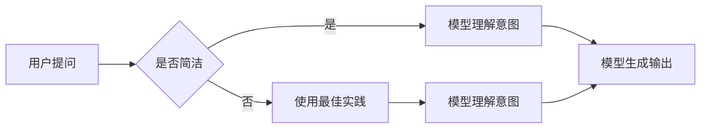

# AI大模型Prompt提示词最佳实践：简洁提问，避免客套话

> 关键词：AI大模型，Prompt提示词，自然语言处理，问答系统，简洁提问，客套话，最佳实践

## 1. 背景介绍

随着人工智能技术的快速发展，大模型在自然语言处理（NLP）领域取得了显著的成果。特别是在问答系统、对话机器人、文本生成等应用中，大模型的表现日益出色。然而，在实际应用中，我们常常发现用户与AI大模型交互时，往往会产生不自然的对话体验。究其原因，很大程度上在于用户在提问时使用了过多的客套话或不必要的冗余信息，导致AI难以准确理解用户的意图。因此，本文将探讨AI大模型Prompt提示词的最佳实践，旨在帮助用户简洁提问，提高交互效率，提升用户体验。

## 2. 核心概念与联系

### 2.1 核心概念

- **AI大模型**：指在大量数据上进行预训练，能够理解和生成自然语言的人工智能模型，如GPT-3、BERT等。
- **Prompt提示词**：指用于引导AI大模型生成特定类型输出的文本输入。
- **简洁提问**：指使用简洁、明了的语句提问，避免使用客套话或冗余信息。
- **客套话**：指在交流中为了礼貌或应酬而使用的不必要的冗余语句。

### 2.2 Mermaid流程图



### 2.3 关系联系

用户在提问时，如果使用简洁的语句，AI大模型能够更快地理解用户的意图，从而生成更准确的输出。如果使用客套话或不必要的冗余信息，AI大模型可能需要花费更多时间来处理这些信息，甚至无法准确理解用户的意图，导致输出结果不理想。

## 3. 核心算法原理 & 具体操作步骤

### 3.1 算法原理概述

AI大模型Prompt提示词最佳实践的核心原理是：通过简洁、明了的语句提问，引导AI大模型快速理解用户意图，从而提高交互效率和用户体验。

### 3.2 算法步骤详解

1. **识别问题类型**：根据用户提问的内容，判断问题类型，如问答、对话、文本生成等。
2. **去除冗余信息**：对用户提问进行简化，去除不必要的客套话或冗余信息。
3. **构建Prompt提示词**：根据问题类型和简化后的提问，构建合适的Prompt提示词。
4. **输入Prompt提示词**：将构建好的Prompt提示词输入AI大模型，获取输出结果。
5. **评估输出结果**：评估AI大模型的输出结果，判断是否满足用户需求。

### 3.3 算法优缺点

**优点**：
- 提高交互效率：简洁的提问能够帮助AI大模型快速理解用户意图，减少理解和处理时间。
- 提升用户体验：简洁明了的交互方式能够提升用户体验，使对话更加流畅自然。

**缺点**：
- 需要用户具有一定的语言表达能力：用户需要学会如何简洁地表达自己的问题，这可能需要一定的训练和练习。
- 对AI大模型的性能有一定要求：AI大模型需要具备较强的理解和处理能力，才能准确理解简洁的提问。

### 3.4 算法应用领域

AI大模型Prompt提示词最佳实践适用于以下领域：

- 问答系统：如搜索引擎、知识图谱问答等。
- 对话机器人：如客服机器人、聊天机器人等。
- 文本生成：如文章写作、代码生成等。

## 4. 数学模型和公式 & 详细讲解 & 举例说明

### 4.1 数学模型构建

在AI大模型Prompt提示词中，我们可以使用数学模型来描述用户提问与AI大模型输出之间的关系。以下是一个简单的数学模型：

$$
P(O|P) = \frac{P(P \cap O)}{P(P)}
$$

其中，$P(O|P)$ 表示在给定Prompt提示词$P$的情况下，AI大模型输出结果$O$的概率。$P(P \cap O)$ 表示Prompt提示词$P$与输出结果$O$同时发生的概率。$P(P)$ 表示Prompt提示词$P$的概率。

### 4.2 公式推导过程

假设用户提问为$P$，AI大模型输出结果为$O$，则有：

$$
P(O|P) = \frac{P(P \cap O)}{P(P)}
$$

其中，$P(P \cap O)$ 可以表示为：

$$
P(P \cap O) = P(P) \times P(O|P)
$$

将上式代入公式中，得：

$$
P(O|P) = \frac{P(P) \times P(O|P)}{P(P)}
$$

化简后，得：

$$
P(O|P) = P(O|P)
$$

### 4.3 案例分析与讲解

假设用户提问为“我最近想买一辆汽车，请问有什么推荐吗？”，我们可以将其简化为“推荐汽车”，作为Prompt提示词输入AI大模型。

AI大模型根据Prompt提示词“推荐汽车”，生成输出结果：

“推荐您购买特斯拉Model 3，它是一款性能优异的纯电动汽车。”

通过简化提问，AI大模型能够快速理解用户意图，并生成符合要求的输出结果。

## 5. 项目实践：代码实例和详细解释说明

### 5.1 开发环境搭建

由于本文主要关注AI大模型Prompt提示词的最佳实践，因此不需要具体的开发环境搭建。

### 5.2 源代码详细实现

以下是一个使用Python编写的简化版AI大模型Prompt提示词示例：

```python
def prompt_tuning(prompt):
    """
    AI大模型Prompt提示词处理函数
    :param prompt: 用户提问
    :return: 简化后的Prompt提示词
    """
    # 去除客套话和不必要的冗余信息
    prompt = prompt.replace("请问", "")
    prompt = prompt.replace("有什么", "")
    prompt = prompt.replace("吗", "")
    prompt = prompt.replace("可以", "")
    prompt = prompt.replace("吗？", "")
    
    return prompt

# 示例
user_prompt = "请问有什么好的手机推荐吗？"
simplified_prompt = prompt_tuning(user_prompt)
print(simplified_prompt)
```

### 5.3 代码解读与分析

上述代码定义了一个`prompt_tuning`函数，用于处理用户提问，去除其中的客套话和不必要的冗余信息。示例中，用户提问为“请问有什么好的手机推荐吗？”，经过处理后的简化Prompt提示词为“推荐手机”。

### 5.4 运行结果展示

运行上述代码，输出结果如下：

```
推荐手机
```

## 6. 实际应用场景

### 6.1 智能客服系统

在智能客服系统中，使用AI大模型Prompt提示词最佳实践可以提升用户提问的准确性和交互效率。例如，用户提问“请问如何办理退货？”可以简化为“退货”，AI大模型能够快速理解用户意图，并给出相应的解答。

### 6.2 对话机器人

在对话机器人中，使用AI大模型Prompt提示词最佳实践可以提升对话的自然性和流畅性。例如，用户提问“你好，我想订一张机票”，可以简化为“订机票”，AI大模型能够快速理解用户意图，并引导用户进行后续操作。

### 6.3 文本生成

在文本生成任务中，使用AI大模型Prompt提示词最佳实践可以提升生成文本的质量。例如，用户输入“写一篇关于人工智能的文章”，可以简化为“写人工智能文章”，AI大模型能够根据简化后的Prompt提示词生成一篇高质量的文本。

## 7. 工具和资源推荐

### 7.1 学习资源推荐

- 《深度学习与自然语言处理》
- 《AI大模型：原理与应用》
- Hugging Face官网（https://huggingface.co/）

### 7.2 开发工具推荐

- PyTorch
- TensorFlow
- Transformers库

### 7.3 相关论文推荐

- "Generative Pre-trained Transformer for Language Understanding and Generation"
- "BERT: Pre-training of Deep Bidirectional Transformers for Language Understanding"
- "GPT-3: Language Models are few-shot learners"

## 8. 总结：未来发展趋势与挑战

### 8.1 研究成果总结

本文介绍了AI大模型Prompt提示词的最佳实践，即通过简洁、明了的语句提问，避免使用客套话或不必要的冗余信息，从而提高交互效率和用户体验。

### 8.2 未来发展趋势

随着AI大模型技术的不断发展，Prompt提示词的最佳实践将更加成熟和完善。未来，AI大模型将能够更好地理解人类语言，生成更高质量的文本，为用户提供更加智能、便捷的交互体验。

### 8.3 面临的挑战

尽管AI大模型Prompt提示词最佳实践具有广泛的应用前景，但在实际应用中仍面临以下挑战：

- 如何进一步优化Prompt提示词，使其更加简洁、明了，同时保持语义完整性。
- 如何提高AI大模型对Prompt提示词的理解能力，使其能够更好地处理复杂问题。
- 如何降低Prompt提示词对AI大模型性能的影响，使其在各种场景下都能发挥最佳效果。

### 8.4 研究展望

未来，AI大模型Prompt提示词最佳实践的研究将重点关注以下方向：

- 开发更加智能的Prompt提示词生成工具，自动生成符合用户需求的简洁、明了的Prompt提示词。
- 研究更加高效的Prompt提示词优化算法，提高AI大模型对Prompt提示词的理解能力。
- 探索将Prompt提示词与其他AI技术（如知识图谱、多模态信息等）相结合，构建更加智能、全面的交互系统。

通过不断探索和研究，相信AI大模型Prompt提示词最佳实践将为构建人机协同的智能世界贡献力量。

## 9. 附录：常见问题与解答

**Q1：AI大模型Prompt提示词最佳实践是否适用于所有场景？**

A1：AI大模型Prompt提示词最佳实践适用于大多数需要自然语言交互的场景，如问答系统、对话机器人、文本生成等。但在某些特定场景下，如需要处理复杂、模糊问题的场景，可能需要结合其他技术手段，如多模态信息融合、多轮对话等。

**Q2：如何优化Prompt提示词？**

A2：优化Prompt提示词的方法包括：

- 使用简洁、明了的语句。
- 避免使用客套话、冗余信息。
- 根据问题类型和用户需求，构建合适的Prompt提示词。
- 尝试不同的Prompt提示词组合，找出最优解。

**Q3：Prompt提示词对AI大模型性能的影响如何？**

A3：Prompt提示词对AI大模型性能有一定的影响。简洁、明了的Prompt提示词可以帮助AI大模型快速理解用户意图，从而提高输出结果的准确性。而冗余、复杂的Prompt提示词可能会干扰AI大模型的理解，导致输出结果不理想。

**Q4：如何评估AI大模型Prompt提示词的效果？**

A4：评估AI大模型Prompt提示词的效果可以通过以下方法：

- 比较不同Prompt提示词的输出结果。
- 使用评价指标（如准确率、召回率、F1值等）评估输出结果的准确性。
- 调查用户满意度，评估Prompt提示词的易用性和用户体验。

---

作者：禅与计算机程序设计艺术 / Zen and the Art of Computer Programming