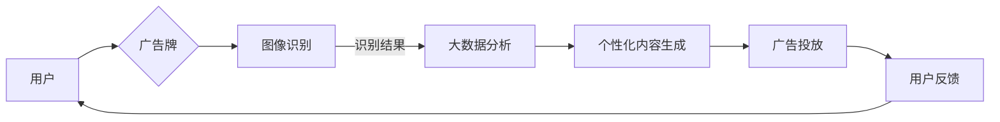

# AI驱动的智能广告牌:个性化户外广告

> 关键词：AI，户外广告，个性化，机器学习，图像识别，广告投放，大数据分析

## 1. 背景介绍

随着人工智能技术的飞速发展，AI开始在各个行业领域发挥重要作用。在广告行业，AI技术被广泛应用于精准营销和个性化广告投放。传统的户外广告牌，作为一种重要的广告形式，也开始拥抱AI技术，实现从传统广告到智能广告的转变。本文将探讨AI驱动的智能广告牌在个性化户外广告中的应用，分析其原理、实践和未来发展趋势。

### 1.1 问题的由来

传统的户外广告牌存在以下问题：

1. **广告投放效率低**：传统户外广告牌往往无法根据受众特点进行个性化投放，导致广告效果不佳。
2. **广告内容更新慢**：广告内容更新需要人工操作，效率低下，难以满足快速变化的市场需求。
3. **广告效果难以评估**：缺乏有效手段评估广告效果，难以优化广告策略。

### 1.2 研究现状

近年来，随着AI技术的不断发展，越来越多的企业开始尝试将AI技术应用于户外广告领域。以下是一些常见的AI技术：

1. **图像识别**：通过图像识别技术，识别广告牌周围的人群、环境等信息，实现个性化广告投放。
2. **大数据分析**：通过分析用户行为数据，了解受众喜好，从而实现精准广告投放。
3. **机器学习**：利用机器学习算法，优化广告投放策略，提高广告效果。

### 1.3 研究意义

AI驱动的智能广告牌在个性化户外广告中的应用，具有以下意义：

1. **提升广告投放效率**：通过个性化投放，提高广告的到达率和转化率。
2. **实现广告内容快速更新**：利用AI技术，实现广告内容自动化更新，满足快速变化的市场需求。
3. **优化广告效果**：通过数据分析和效果评估，优化广告策略，提高广告效果。

### 1.4 本文结构

本文将围绕以下内容展开：

- 介绍AI驱动的智能广告牌的核心概念和原理。
- 分析AI驱动的智能广告牌的具体操作步骤和算法。
- 探讨AI驱动的智能广告牌的实际应用场景。
- 展望AI驱动的智能广告牌的未来发展趋势与挑战。

## 2. 核心概念与联系

### 2.1 核心概念

- **AI驱动的智能广告牌**：利用人工智能技术，实现广告内容自动识别、生成和投放的广告牌。
- **个性化户外广告**：根据受众特点，定制化投放的广告，提高广告效果。
- **图像识别**：通过对图像进行分析，识别图像中的物体、场景等信息的技术。
- **大数据分析**：通过对海量数据进行挖掘和分析，发现数据中的规律和模式的技术。
- **机器学习**：通过算法和模型，让计算机从数据中学习并做出决策的技术。

### 2.2 核心概念联系

AI驱动的智能广告牌通过图像识别、大数据分析和机器学习等AI技术，实现个性化户外广告的投放。其流程如下：



## 3. 核心算法原理 & 具体操作步骤

### 3.1 算法原理概述

AI驱动的智能广告牌的核心算法包括图像识别、大数据分析、个性化内容生成和广告投放四个部分。

- **图像识别**：利用深度学习技术，如卷积神经网络(CNN)，对广告牌周围的图像进行实时识别，获取人群、环境等信息。
- **大数据分析**：对用户行为数据、广告投放数据等进行分析，了解受众喜好和广告效果。
- **个性化内容生成**：根据图像识别和大数据分析的结果，生成符合受众喜好的个性化广告内容。
- **广告投放**：将生成的个性化广告内容投放至户外广告牌。

### 3.2 算法步骤详解

1. **图像采集**：利用广告牌周边的摄像头或其他传感器，采集实时图像。
2. **图像预处理**：对采集到的图像进行预处理，如裁剪、缩放、归一化等。
3. **图像识别**：利用CNN等深度学习模型，对预处理后的图像进行识别，获取人群、场景等信息。
4. **大数据分析**：对用户行为数据和广告投放数据进行挖掘，分析受众喜好和广告效果。
5. **个性化内容生成**：根据图像识别和大数据分析的结果，生成个性化广告内容。
6. **广告投放**：将生成的个性化广告内容投放至户外广告牌。
7. **效果评估**：收集用户反馈和广告效果数据，评估广告效果，优化广告策略。

### 3.3 算法优缺点

#### 优点

- **个性化投放**：根据受众特点，实现个性化广告投放，提高广告效果。
- **实时更新**：自动识别周围环境，实现广告内容实时更新。
- **数据驱动**：基于数据分析，优化广告策略，提高广告效果。

#### 缺点

- **技术复杂**：需要整合图像识别、大数据分析、机器学习等多种技术。
- **成本较高**：需要投入大量资金用于设备采购、软件开发和人才培养。
- **数据隐私**：需要收集和分析用户数据，可能引发数据隐私问题。

### 3.4 算法应用领域

AI驱动的智能广告牌可以应用于以下领域：

- 商业街区
- 交通枢纽
- 公共场所
- 展会活动
- 户外活动

## 4. 数学模型和公式 & 详细讲解 & 举例说明

### 4.1 数学模型构建

AI驱动的智能广告牌的核心算法涉及以下数学模型：

- **CNN**：用于图像识别的卷积神经网络模型。
- **机器学习算法**：如决策树、支持向量机(SVM)等，用于广告投放策略优化。

### 4.2 公式推导过程

以下以CNN为例，介绍其数学公式推导过程：

假设输入图像为 $X \in \mathbb{R}^{H \times W \times C}$，其中 $H$、$W$、$C$ 分别为图像的高度、宽度和通道数。

1. **卷积层**：

$$
H^l = \frac{H - f + 2p}{s} + 1
$$

其中，$f$ 为卷积核大小，$p$ 为填充，$s$ 为步长。

2. **激活函数**：

$$
a^l = \sigma(z^l)
$$

其中，$\sigma$ 为激活函数，如ReLU、Sigmoid等。

3. **池化层**：

$$
H^l = \frac{H - f}{s} + 1
$$

### 4.3 案例分析与讲解

以下以一个实际案例，展示如何使用AI技术实现智能广告牌。

**案例**：某品牌希望通过AI驱动的智能广告牌，在商业街区进行个性化广告投放。

1. **图像采集**：在商业街区安装摄像头，采集实时图像。
2. **图像预处理**：对采集到的图像进行预处理，如裁剪、缩放、归一化等。
3. **图像识别**：利用CNN模型，识别图像中的人群性别、年龄段等信息。
4. **大数据分析**：分析用户行为数据和广告投放数据，了解受众喜好。
5. **个性化内容生成**：根据图像识别和大数据分析的结果，生成符合受众喜好的广告内容。
6. **广告投放**：将生成的个性化广告内容投放至户外广告牌。
7. **效果评估**：收集用户反馈和广告效果数据，评估广告效果，优化广告策略。

## 5. 项目实践：代码实例和详细解释说明

### 5.1 开发环境搭建

以下以Python为例，介绍如何搭建AI驱动的智能广告牌开发环境。

1. 安装Python环境：安装Python 3.6及以上版本。
2. 安装深度学习框架：安装TensorFlow或PyTorch等深度学习框架。
3. 安装其他依赖库：安装OpenCV、NumPy等图像处理库。

### 5.2 源代码详细实现

以下以使用PyTorch实现图像识别为例，展示AI驱动的智能广告牌的代码实现。

```python
import torch
import torchvision.transforms as transforms
from torch.utils.data import DataLoader
from torchvision import datasets
from torch import nn, optim

# 定义CNN模型
class CNN(nn.Module):
    def __init__(self):
        super(CNN, self).__init__()
        self.conv1 = nn.Conv2d(3, 32, kernel_size=3, padding=1)
        self.relu = nn.ReLU()
        self.maxpool = nn.MaxPool2d(2)
        self.conv2 = nn.Conv2d(32, 64, kernel_size=3, padding=1)
        self.fc = nn.Linear(64 * 32 * 32, 10)

    def forward(self, x):
        x = self.relu(self.conv1(x))
        x = self.maxpool(x)
        x = self.relu(self.conv2(x))
        x = self.maxpool(x)
        x = x.view(-1, 64 * 32 * 32)
        x = self.fc(x)
        return x

# 加载数据
transform = transforms.Compose([
    transforms.Resize((64, 64)),
    transforms.ToTensor()
])

train_dataset = datasets.MNIST(root='./data', train=True, download=True, transform=transform)
train_loader = DataLoader(train_dataset, batch_size=64, shuffle=True)

# 初始化模型、损失函数和优化器
model = CNN()
criterion = nn.CrossEntropyLoss()
optimizer = optim.Adam(model.parameters(), lr=0.001)

# 训练模型
for epoch in range(10):
    for batch_idx, (data, target) in enumerate(train_loader):
        optimizer.zero_grad()
        output = model(data)
        loss = criterion(output, target)
        loss.backward()
        optimizer.step()
        if batch_idx % 100 == 0:
            print(f'Epoch {epoch + 1}, Batch {batch_idx + 1}, Loss: {loss.item()}')

# 保存模型
torch.save(model.state_dict(), './model.pth')
```

### 5.3 代码解读与分析

以上代码展示了如何使用PyTorch实现一个简单的CNN模型，并对其进行了训练。在实际应用中，需要根据具体任务需求，修改模型结构和训练过程。

### 5.4 运行结果展示

训练完成后，可以在测试集上评估模型性能，或者将模型部署到生产环境，进行实际应用。

## 6. 实际应用场景

AI驱动的智能广告牌在实际应用中具有广泛的应用场景，以下是一些例子：

1. **商业街区**：在商业街区安装智能广告牌，根据周边人群特征进行个性化广告投放，提高广告效果。
2. **交通枢纽**：在火车站、机场等交通枢纽安装智能广告牌，根据乘客特征进行个性化广告投放，提升用户体验。
3. **公共场所**：在公园、商场等公共场所安装智能广告牌，根据场所特点和人群特征进行个性化广告投放。
4. **展会活动**：在展会活动现场安装智能广告牌，根据参展商和观众特征进行个性化广告投放。
5. **户外活动**：在户外活动中安装智能广告牌，根据活动主题和参与者特征进行个性化广告投放。

## 7. 工具和资源推荐

### 7.1 学习资源推荐

1. 《深度学习》系列书籍：介绍深度学习的基本概念、算法和应用。
2. 《TensorFlow实战》系列书籍：介绍TensorFlow框架及其在各个领域的应用。
3. 《PyTorch深度学习实战》系列书籍：介绍PyTorch框架及其在各个领域的应用。
4. HuggingFace官网：提供丰富的预训练模型和开源代码。

### 7.2 开发工具推荐

1. TensorFlow：谷歌开源的深度学习框架。
2. PyTorch：Facebook开源的深度学习框架。
3. OpenCV：开源的计算机视觉库。
4. NumPy：Python科学计算库。

### 7.3 相关论文推荐

1. "Deep Learning for Image Recognition"：介绍深度学习在图像识别领域的应用。
2. "BERT: Pre-training of Deep Bidirectional Transformers for Language Understanding"：介绍BERT模型及其在NLP领域的应用。
3. "ImageNet Classification with Deep Convolutional Neural Networks"：介绍CNN模型及其在图像识别领域的应用。

## 8. 总结：未来发展趋势与挑战

### 8.1 研究成果总结

本文介绍了AI驱动的智能广告牌在个性化户外广告中的应用，分析了其原理、实践和未来发展趋势。通过图像识别、大数据分析和机器学习等AI技术，智能广告牌可以实现个性化广告投放，提高广告效果。未来，AI驱动的智能广告牌将在更多领域得到应用，推动广告行业的转型升级。

### 8.2 未来发展趋势

1. **技术融合**：AI驱动的智能广告牌将与其他AI技术，如自然语言处理、语音识别等融合，实现更加智能的广告投放。
2. **场景拓展**：AI驱动的智能广告牌将在更多领域得到应用，如教育、医疗、交通等。
3. **效果提升**：随着AI技术的不断发展，智能广告牌的广告效果将得到进一步提升。

### 8.3 面临的挑战

1. **数据隐私**：在收集和分析用户数据时，需要确保数据隐私安全。
2. **算法偏见**：AI算法可能存在偏见，需要采取措施避免歧视性广告。
3. **技术瓶颈**：AI驱动的智能广告牌需要更高的计算资源，需要解决技术瓶颈。

### 8.4 研究展望

未来，AI驱动的智能广告牌将在以下几个方面进行深入研究：

1. **隐私保护**：研究更加安全的隐私保护技术，保护用户数据。
2. **公平性**：研究减少算法偏见的方法，提高广告投放的公平性。
3. **可解释性**：研究提高AI算法的可解释性，让广告投放更加透明。

## 9. 附录：常见问题与解答

**Q1：AI驱动的智能广告牌与传统户外广告相比，有哪些优势？**

A1：AI驱动的智能广告牌相比传统户外广告，具有以下优势：

- 个性化投放：根据受众特点进行个性化广告投放，提高广告效果。
- 实时更新：自动识别周围环境，实现广告内容实时更新。
- 数据驱动：基于数据分析，优化广告策略，提高广告效果。

**Q2：AI驱动的智能广告牌在应用过程中会遇到哪些挑战？**

A2：AI驱动的智能广告牌在应用过程中可能会遇到以下挑战：

- 数据隐私：收集和分析用户数据时，需要确保数据隐私安全。
- 算法偏见：AI算法可能存在偏见，需要采取措施避免歧视性广告。
- 技术瓶颈：AI驱动的智能广告牌需要更高的计算资源，需要解决技术瓶颈。

**Q3：如何确保AI驱动的智能广告牌的广告效果？**

A3：为确保AI驱动的智能广告牌的广告效果，可以从以下几个方面入手：

- 数据质量：收集高质量的数据，提高模型的准确性。
- 算法优化：不断优化算法，提高模型的性能。
- 调试优化：根据实际效果，调整广告策略。

**Q4：AI驱动的智能广告牌的未来发展趋势是什么？**

A4：AI驱动的智能广告牌的未来发展趋势包括：

- 技术融合：与其他AI技术融合，实现更加智能的广告投放。
- 场景拓展：在更多领域得到应用，如教育、医疗、交通等。
- 效果提升：随着AI技术的不断发展，广告效果将得到进一步提升。

作者：禅与计算机程序设计艺术 / Zen and the Art of Computer Programming