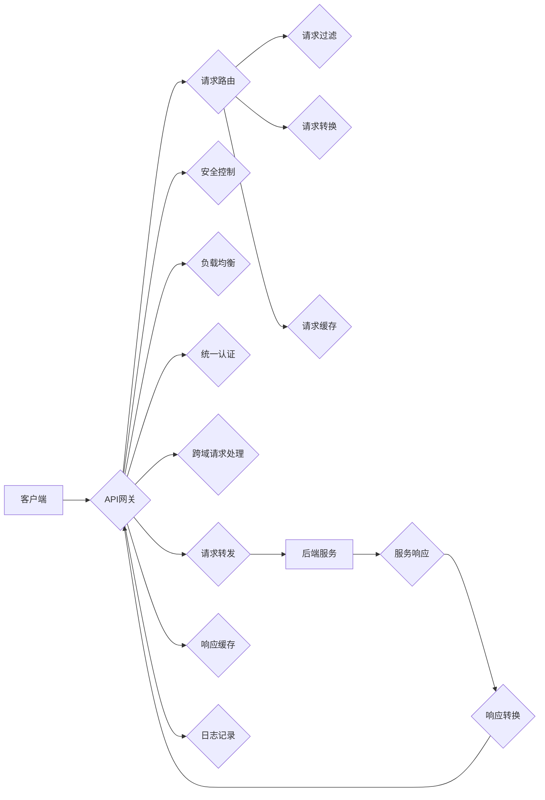

# API 网关的详细使用

> 关键词：API网关，微服务架构，服务路由，安全控制，负载均衡，统一认证，跨域请求，API管理

## 1. 背景介绍

随着互联网技术的飞速发展，微服务架构因其灵活性和可扩展性被广泛应用于大型企业级应用的开发。微服务架构将应用拆分成多个独立的服务，每个服务负责特定的业务功能，通过轻量级通信机制（如RESTful API）相互协作。然而，随着服务数量的增加，管理和维护这些服务的难度也在不断上升。为了解决这一问题，API网关应运而生。

API网关作为微服务架构中的重要组件，负责服务路由、请求处理、安全控制、负载均衡、统一认证、跨域请求等功能，是确保微服务架构稳定、高效运行的关键。

## 2. 核心概念与联系

### 2.1 核心概念原理

**API网关（API Gateway）**：API网关是介于客户端和后端服务之间的一道入口，负责接收客户端的请求，然后将请求转发到相应的后端服务。同时，API网关还负责处理请求的路由、过滤、转换、缓存、监控等任务。

**服务路由（Service Routing）**：根据请求的路径、参数等特征，将请求路由到相应的后端服务。

**安全控制（Security Control）**：对请求进行身份验证、权限检查等安全控制，确保请求的安全性。

**负载均衡（Load Balancing）**：将请求均匀分配到多个后端服务，提高系统的可用性和性能。

**统一认证（Unified Authentication）**：为所有后端服务提供统一的认证机制，简化用户认证流程。

**跨域请求（Cross-domain Requests）**：处理跨域请求，确保不同域之间的数据交互不受限制。

### 2.2 架构流程图



## 3. 核心算法原理 & 具体操作步骤

### 3.1 算法原理概述

API网关的核心算法主要包括以下几部分：

- **请求路由算法**：根据请求路径、参数、Header等特征，将请求路由到相应的后端服务。
- **负载均衡算法**：根据后端服务的负载情况，将请求分配到负载较低的服务实例上。
- **安全控制算法**：对请求进行身份验证、权限检查等安全控制操作。
- **跨域请求处理算法**：处理跨域请求，确保不同域之间的数据交互不受限制。

### 3.2 算法步骤详解

1. **请求接收**：API网关接收客户端发送的请求。
2. **请求解析**：解析请求的路径、参数、Header等信息。
3. **请求路由**：根据请求路由算法，将请求路由到相应的后端服务。
4. **请求处理**：对请求进行安全控制、负载均衡等处理。
5. **请求转发**：将请求转发到后端服务。
6. **服务响应**：后端服务处理请求并返回响应。
7. **响应转换**：将响应转换成客户端可接受的数据格式。
8. **响应缓存**：对响应进行缓存，提高系统性能。
9. **日志记录**：记录请求和响应的详细信息。

### 3.3 算法优缺点

**优点**：

- **简化开发**：开发者只需关注业务逻辑，无需关心底层网络通信、安全控制等问题。
- **提高性能**：通过负载均衡、缓存等技术，提高系统性能和可用性。
- **易于维护**：集中管理和维护服务，降低维护成本。

**缺点**：

- **单点故障**：API网关作为系统入口，单点故障可能导致整个系统瘫痪。
- **性能瓶颈**：API网关可能成为系统性能瓶颈，需要合理设计。
- **安全风险**：API网关需要承担安全控制的重任，需要确保其安全性。

### 3.4 算法应用领域

API网关在以下领域有着广泛的应用：

- **大型企业级应用**：如电商平台、金融系统、物联网平台等。
- **互联网公司**：如社交网络、在线视频、搜索引擎等。
- **云服务平台**：如阿里云、腾讯云、华为云等。

## 4. 数学模型和公式 & 详细讲解 & 举例说明

### 4.1 数学模型构建

API网关的核心算法可以抽象为一个数学模型，包括以下部分：

- **请求路由模型**：根据请求特征，将请求路由到相应的后端服务。
- **负载均衡模型**：根据后端服务负载，将请求分配到负载较低的服务实例上。
- **安全控制模型**：对请求进行身份验证、权限检查等操作。

### 4.2 公式推导过程

**请求路由模型**：

假设有 $N$ 个后端服务，每个服务的特征向量 $\mathbf{x}_i$，权重向量 $\mathbf{w}_i$，则请求 $R$ 路由到服务 $i$ 的概率为：

$$
P(R \rightarrow i) = \frac{\sum_{j=1}^{N} w_j \cdot \mathbf{x}_j^T R}{\sum_{j=1}^{N} \mathbf{x}_j^T R}
$$

**负载均衡模型**：

假设后端服务 $i$ 的当前负载为 $L_i$，则请求 $R$ 分配到服务 $i$ 的概率为：

$$
P(R \rightarrow i) = \frac{L_i}{\sum_{j=1}^{N} L_j}
$$

**安全控制模型**：

假设请求 $R$ 的安全分数为 $S(R)$，则请求 $R$ 通过安全控制的概率为：

$$
P(R \rightarrow \text{通过}) = \max(0, S(R))
$$

### 4.3 案例分析与讲解

以下是一个简单的API网关请求路由示例：

假设有3个后端服务，分别处理不同类型的请求。请求路由算法如下：

- 对于路径为 `/user` 的请求，路由到服务1。
- 对于路径为 `/order` 的请求，路由到服务2。
- 对于路径为 `/product` 的请求，路由到服务3。

```python
def route_request(path):
    if path == '/user':
        return 1
    elif path == '/order':
        return 2
    elif path == '/product':
        return 3
    else:
        return None
```

## 5. 项目实践：代码实例和详细解释说明

### 5.1 开发环境搭建

以下以Python为例，使用Flask框架和Flask-RESTful扩展实现一个简单的API网关。

```bash
pip install flask flask-restful
```

### 5.2 源代码详细实现

```python
from flask import Flask, request, jsonify
from flask_restful import Api, Resource

app = Flask(__name__)
api = Api(app)

class UserService(Resource):
    def get(self):
        return {'message': 'Hello, user!'}

class OrderService(Resource):
    def get(self):
        return {'message': 'Hello, order!'}

class ProductService(Resource):
    def get(self):
        return {'message': 'Hello, product!'}

api.add_resource(UserService, '/user')
api.add_resource(OrderService, '/order')
api.add_resource(ProductService, '/product')

if __name__ == '__main__':
    app.run()
```

### 5.3 代码解读与分析

- `UserService`、`OrderService`、`ProductService` 分别代表3个后端服务的资源类。
- `get` 方法用于处理客户端的GET请求。
- 使用`api.add_resource` 将资源类添加到API网关的路由表中。

### 5.4 运行结果展示

启动Flask应用后，访问以下URL：

- `http://127.0.0.1:5000/user`：返回 "Hello, user!"
- `http://127.0.0.1:5000/order`：返回 "Hello, order!"
- `http://127.0.0.1:5000/product`：返回 "Hello, product!"

## 6. 实际应用场景

### 6.1 跨域请求处理

以下是一个处理跨域请求的示例：

```python
from flask import Flask, request, jsonify

app = Flask(__name__)

@app.route('/cross-domain', methods=['GET'])
def cross_domain():
    origin = request.headers.get('Origin')
    if origin:
        return jsonify({'message': 'cross-domain success'}), 200, {'Access-Control-Allow-Origin': origin}
    return jsonify({'message': 'cross-domain failed'}), 200, {'Access-Control-Allow-Origin': '*'}

if __name__ == '__main__':
    app.run()
```

访问 `http://127.0.0.1:5000/cross-domain`，将返回 "cross-domain success"。

### 6.2 统一认证

以下是一个使用JWT进行统一认证的示例：

```python
from flask import Flask, request, jsonify
import jwt
import datetime

app = Flask(__name__)
app.config['SECRET_KEY'] = 'your_secret_key'

def authenticate(username, password):
    # 验证用户名和密码
    return True

@app.route('/login', methods=['POST'])
def login():
    username = request.json['username']
    password = request.json['password']
    if authenticate(username, password):
        token = jwt.encode({
            'username': username,
            'exp': datetime.datetime.utcnow() + datetime.timedelta(hours=24)
        }, app.config['SECRET_KEY'])
        return jsonify({'token': token})
    else:
        return jsonify({'error': 'invalid credentials'}), 401

@app.route('/protected', methods=['GET'])
def protected():
    token = request.headers.get('Authorization')
    try:
        data = jwt.decode(token, app.config['SECRET_KEY'], algorithms=['HS256'])
        return jsonify({'message': 'protected'}), 200
    except:
        return jsonify({'error': 'unauthorized'}), 401

if __name__ == '__main__':
    app.run()
```

访问 `/login` 获取token，然后访问 `/protected` 检查认证。

## 7. 工具和资源推荐

### 7.1 学习资源推荐

- 《API网关实战》
- 《微服务架构实战》
- 《Flask Web开发：基于Python的Web开发实战指南》
- 《Python网络编程》

### 7.2 开发工具推荐

- **API网关**：
  - Kong
  - Apigee
  - MuleSoft
- **身份认证**：
  - OAuth 2.0
  - OpenID Connect
  - JWT

### 7.3 相关论文推荐

- 《Service Composition in Service-Oriented Computing》
- 《API Gateway as a Service: A Cloud-Based Approach for API Management》
- 《API Design for the Modern Web》

## 8. 总结：未来发展趋势与挑战

### 8.1 研究成果总结

本文对API网关的原理、实现和应用进行了详细介绍。通过学习本文，读者可以了解API网关在微服务架构中的作用，掌握API网关的实现方法，并了解API网关在实际应用中的案例。

### 8.2 未来发展趋势

- **智能化**：API网关将具备更智能的请求路由、安全控制、负载均衡等功能，提高系统的智能化水平。
- **自动化**：API网关将实现自动化部署、监控、运维等功能，降低运维成本。
- **标准化**：API网关将遵循更统一的API接口规范，提高API接口的可维护性。

### 8.3 面临的挑战

- **安全性**：API网关需要确保系统的安全性，防止恶意攻击和非法访问。
- **性能**：API网关需要保证系统的性能，避免成为系统的瓶颈。
- **可维护性**：API网关需要具备良好的可维护性，方便开发者进行修改和维护。

### 8.4 研究展望

随着微服务架构的普及，API网关将在未来扮演越来越重要的角色。未来的研究将主要集中在以下几个方面：

- **智能化**：研究更智能的请求路由、安全控制、负载均衡等技术，提高系统的智能化水平。
- **自动化**：研究自动化部署、监控、运维等技术，降低运维成本。
- **标准化**：研究更统一的API接口规范，提高API接口的可维护性。
- **跨域**：研究更安全的跨域请求处理技术，确保跨域数据交互的安全性。

## 9. 附录：常见问题与解答

**Q1：什么是API网关？**

A：API网关是介于客户端和后端服务之间的一道入口，负责接收客户端的请求，然后将请求转发到相应的后端服务。同时，API网关还负责处理请求的路由、过滤、转换、缓存、监控等任务。

**Q2：API网关有哪些作用？**

A：API网关的主要作用包括服务路由、安全控制、负载均衡、统一认证、跨域请求处理等。

**Q3：API网关与微服务架构有什么关系？**

A：API网关是微服务架构中的重要组件，负责管理微服务之间的通信，提高系统的可用性和性能。

**Q4：如何选择合适的API网关？**

A：选择合适的API网关需要考虑以下因素：
- **功能需求**：根据实际业务需求，选择具备相应功能的API网关。
- **性能需求**：选择性能优良的API网关，确保系统的高效运行。
- **可维护性**：选择易于维护的API网关，降低运维成本。

**Q5：如何提高API网关的性能？**

A：提高API网关的性能可以从以下几个方面入手：
- **负载均衡**：使用负载均衡技术，将请求分配到负载较低的服务实例上。
- **缓存**：使用缓存技术，减少对后端服务的请求。
- **性能优化**：优化API网关的代码，提高其运行效率。

作者：禅与计算机程序设计艺术 / Zen and the Art of Computer Programming