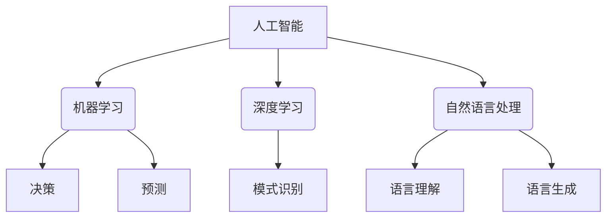

> 人工智能，机器学习，神经网络，深度学习，伦理，未来展望

# Andrej Karpathy：人工智能的未来发展挑战

人工智能（AI）是当今科技领域最热门的词汇之一，它正深刻地改变着我们的生活、工作甚至思维方式。Andrej Karpathy，作为一位在AI领域有着深厚影响力的专家，对于AI的未来发展有着独到的见解。本文将基于Karpathy的观点，探讨人工智能在未来发展中可能面临的挑战。

## 1. 背景介绍

Andrej Karpathy是一位在人工智能和机器学习领域有着广泛影响力的专家，曾任特斯拉AI总监，并在Google深度学习团队工作过。他在AI领域的研究和贡献，特别是在自然语言处理（NLP）方面的成就，使他成为了该领域的领军人物。本文将结合Karpathy的观点，探讨人工智能在未来发展中可能面临的挑战。

## 2. 核心概念与联系

### 2.1 人工智能概述

人工智能是指使计算机具有人类智能特性的技术。它包括机器学习、深度学习、自然语言处理、计算机视觉等多个子领域。

### 2.2 机器学习

机器学习是AI的一个核心领域，它使计算机能够从数据中学习，并作出决策或预测。

### 2.3 深度学习

深度学习是机器学习的一个子领域，它使用深层神经网络来学习数据的复杂模式。

### 2.4 自然语言处理

自然语言处理是AI的一个分支，它使计算机能够理解和处理人类语言。

### 2.5 Mermaid 流程图



## 3. 核心算法原理 & 具体操作步骤

### 3.1 算法原理概述

人工智能的核心算法包括机器学习算法、深度学习算法、自然语言处理算法等。这些算法通过学习数据中的模式，使计算机能够执行复杂的任务。

### 3.2 算法步骤详解

- 数据收集：从各种来源收集数据，如文本、图像、声音等。
- 数据预处理：对数据进行清洗、转换、归一化等操作。
- 模型选择：选择合适的机器学习、深度学习或自然语言处理模型。
- 模型训练：使用训练数据对模型进行训练。
- 模型评估：使用测试数据评估模型的性能。
- 模型部署：将训练好的模型部署到实际应用中。

### 3.3 算法优缺点

- 优点：能够自动从数据中学习，提高效率和准确性。
- 缺点：需要大量的训练数据，可能存在过拟合问题，模型的可解释性较差。

### 3.4 算法应用领域

人工智能算法在各个领域都有广泛的应用，包括医疗、金融、交通、教育等。

## 4. 数学模型和公式 & 详细讲解 & 举例说明

### 4.1 数学模型构建

人工智能算法通常基于数学模型进行设计。以下是一些常见的数学模型：

- 线性回归
- 逻辑回归
- 神经网络

### 4.2 公式推导过程

以下以线性回归为例，介绍公式的推导过程。

假设我们有一组数据 $(x_1, y_1), (x_2, y_2), \ldots, (x_n, y_n)$，我们希望找到一条直线 $y = mx + b$，使得这条直线能够尽可能准确地拟合这些数据点。

通过最小化误差平方和，我们可以得到以下公式：

$$
m = \frac{n(\sum xy) - (\sum x)(\sum y)}{n(\sum x^2) - (\sum x)^2}
$$

$$
b = \frac{(\sum y) - m(\sum x)}{n}
$$

### 4.3 案例分析与讲解

假设我们有一组房价数据，包括房屋面积（$x$）和房价（$y$）。我们希望使用线性回归模型来预测房价。

```python
import numpy as np
from sklearn.linear_model import LinearRegression

# 数据
X = np.array([[1500], [2000], [2500], [3000], [3500], [4000]])
y = np.array([200000, 250000, 300000, 350000, 400000, 450000])

# 创建线性回归模型
model = LinearRegression()

# 训练模型
model.fit(X, y)

# 预测房价
predicted_price = model.predict(np.array([[3000]]))
print(f"预测的房价为：{predicted_price[0]}")
```

## 5. 项目实践：代码实例和详细解释说明

### 5.1 开发环境搭建

- 安装Python和NumPy
- 安装sklearn库

### 5.2 源代码详细实现

```python
# 数据
X = np.array([[1500], [2000], [2500], [3000], [3500], [4000]])
y = np.array([200000, 250000, 300000, 350000, 400000, 450000])

# 创建线性回归模型
model = LinearRegression()

# 训练模型
model.fit(X, y)

# 预测房价
predicted_price = model.predict(np.array([[3000]]))
print(f"预测的房价为：{predicted_price[0]}")
```

### 5.3 代码解读与分析

- `X` 和 `y` 分别代表房屋面积和房价。
- `LinearRegression` 是线性回归模型的类。
- `fit` 方法用于训练模型。
- `predict` 方法用于预测房价。

## 6. 实际应用场景

人工智能在各个领域都有广泛的应用，以下是一些常见的应用场景：

- 医疗诊断：使用AI进行疾病诊断，提高诊断准确率。
- 金融风控：使用AI进行风险评估，降低金融风险。
- 自动驾驶：使用AI进行自动驾驶，提高行车安全。
- 教育个性化：使用AI进行个性化教学，提高教学效果。

## 7. 工具和资源推荐

### 7.1 学习资源推荐

- 《深度学习》
- 《Python机器学习》
- 《自然语言处理入门》

### 7.2 开发工具推荐

- TensorFlow
- PyTorch
- Scikit-learn

### 7.3 相关论文推荐

- "Deep Learning" by Ian Goodfellow, Yoshua Bengio, Aaron Courville
- "Speech Recognition with Deep Learning" by Yann LeCun, Yoshua Bengio, Geoffrey Hinton
- "Natural Language Processing with Python" by Steven Bird, Ewan Klein, Edward Loper

## 8. 总结：未来发展趋势与挑战

### 8.1 研究成果总结

本文基于Andrej Karpathy的观点，探讨了人工智能在未来发展中可能面临的挑战。随着AI技术的不断发展，我们可以预见以下趋势：

- AI将在更多领域得到应用。
- AI将与其他技术（如物联网、云计算等）深度融合。
- AI将更加注重伦理和安全性。

### 8.2 未来发展趋势

- AI将变得更加通用，能够在更多领域发挥作用。
- AI将更加注重可解释性和可解释性。
- AI将更加注重人机协作。

### 8.3 面临的挑战

- AI的伦理和安全性问题。
- AI的偏见和歧视问题。
- AI的就业问题。

### 8.4 研究展望

未来，人工智能的发展将面临诸多挑战，但同时也蕴藏着巨大的机遇。我们需要共同努力，克服这些挑战，推动AI技术的健康发展，为人类社会创造更多价值。

## 9. 附录：常见问题与解答

**Q1：什么是人工智能？**

A：人工智能是指使计算机具有人类智能特性的技术。

**Q2：人工智能有哪些应用？**

A：人工智能在各个领域都有广泛的应用，包括医疗、金融、交通、教育等。

**Q3：人工智能的未来发展趋势是什么？**

A：人工智能的未来发展趋势包括更加通用、注重可解释性和可解释性、注重人机协作等。

**Q4：人工智能面临的挑战有哪些？**

A：人工智能面临的挑战包括伦理和安全性问题、偏见和歧视问题、就业问题等。

**Q5：如何学习人工智能？**

A：学习人工智能需要掌握Python、数学、机器学习等基础知识。可以参考《深度学习》、《Python机器学习》、《自然语言处理入门》等书籍。

---

作者：禅与计算机程序设计艺术 / Zen and the Art of Computer Programming