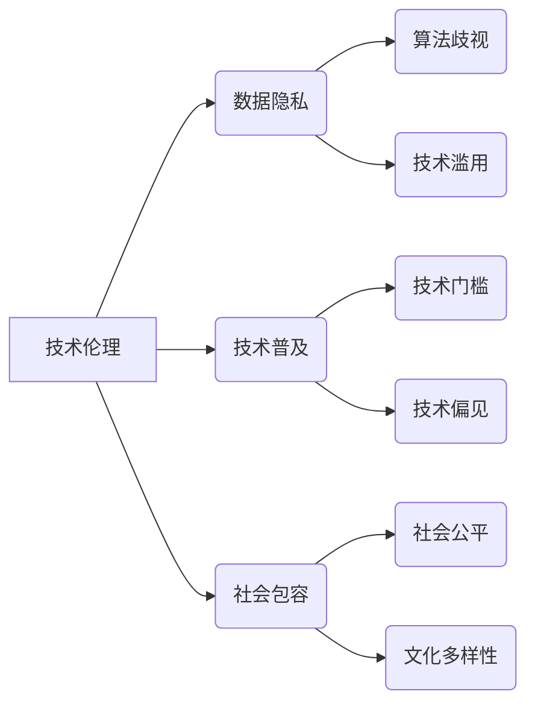

# 基础模型的社会外部条件

> 关键词：基础模型，社会影响，外部条件，人工智能伦理，技术治理，数据隐私，技术普及，社会包容

## 1. 背景介绍

随着人工智能技术的飞速发展，基础模型作为推动智能技术进步的核心要素，正逐渐渗透到社会的各个领域。基础模型，如深度学习中的神经网络，因其强大的学习和推理能力，被广泛应用于图像识别、自然语言处理、语音识别等领域。然而，基础模型的发展和应用并非孤立于社会环境，而是受到一系列社会外部条件的深刻影响和制约。本文旨在探讨基础模型的社会外部条件，分析其对社会的影响，并提出相应的治理策略。

### 1.1 问题的由来

基础模型的社会外部条件主要包括技术伦理、数据隐私、技术普及、社会包容等方面。这些问题源于基础模型的广泛应用，以及其背后复杂的技术和数据处理过程。随着人工智能技术的不断进步，这些外部条件对基础模型的影响愈发显著，成为制约其健康发展的关键因素。

### 1.2 研究现状

近年来，国内外学者对基础模型的社会外部条件进行了广泛的研究。研究内容涉及技术伦理、数据隐私、算法歧视、技术普及等多个方面。然而，目前的研究多集中于理论探讨，对基础模型社会外部条件的综合分析尚显不足。

### 1.3 研究意义

本文旨在从宏观视角出发，全面分析基础模型的社会外部条件，探讨其对基础模型发展的影响，并提出相应的治理策略。这对于推动基础模型的健康发展，促进人工智能技术的合理应用，具有重要的理论和实践意义。

### 1.4 本文结构

本文将分为以下几个部分进行论述：

- 第二部分介绍基础模型的社会外部条件及其相互关系。
- 第三部分分析基础模型的社会外部条件对模型发展的影响。
- 第四部分探讨基础模型的治理策略。
- 第五部分总结全文，展望基础模型的发展趋势与挑战。

## 2. 核心概念与联系

### 2.1 核心概念原理

#### 技术伦理

技术伦理是指在技术应用过程中，对技术行为进行道德评价和规范的一门学科。在基础模型领域，技术伦理关注的是模型的设计、开发、应用过程中可能出现的伦理问题，如数据隐私、算法歧视、技术滥用等。

#### 数据隐私

数据隐私是指个人或组织对自身信息的控制权。在基础模型领域，数据隐私关注的是如何保护用户数据不被非法收集、使用和泄露。

#### 技术普及

技术普及是指将先进技术普及到社会各个领域的过程。在基础模型领域，技术普及关注的是如何让更多的人了解和掌握人工智能技术，以及如何降低技术应用的门槛。

#### 社会包容

社会包容是指在社会发展中，尊重和保护不同群体权益，促进社会和谐发展的过程。在基础模型领域，社会包容关注的是如何让不同背景的人都能平等地享受人工智能技术带来的便利。

### 2.2 架构的 Mermaid 流程图

从图中可以看出，技术伦理、数据隐私、技术普及和社会包容是基础模型社会外部条件的四个核心要素，它们相互关联、相互影响。技术伦理和数据隐私是保证基础模型健康发展的基石，技术普及和社会包容则是推动人工智能技术深入社会各个领域的必要条件。

## 3. 核心算法原理 & 具体操作步骤

### 3.1 算法原理概述

基础模型的社会外部条件研究主要涉及以下几个方面：

- **伦理审查**：对基础模型的设计、开发和应用进行伦理审查，确保其符合社会伦理标准。
- **隐私保护**：在基础模型的开发和应用过程中，采取有效的数据隐私保护措施，防止用户数据泄露。
- **技术标准化**：制定基础模型的技术标准，提高技术普及程度，降低技术应用门槛。
- **社会教育**：开展人工智能技术普及教育，提高公众对人工智能的认知水平。

### 3.2 算法步骤详解

#### 伦理审查

1. **确立伦理原则**：明确基础模型开发和应用过程中应遵循的伦理原则，如公正性、透明度、可解释性等。
2. **建立伦理审查机制**：建立由专家、学者、伦理学家等组成的伦理审查委员会，对基础模型进行审查。
3. **审查过程**：对基础模型的设计、开发、测试、应用等环节进行审查，确保其符合伦理原则。

#### 隐私保护

1. **数据脱敏**：在基础模型训练过程中，对用户数据进行脱敏处理，保护用户隐私。
2. **差分隐私**：在基础模型训练过程中，采用差分隐私技术，降低用户数据泄露风险。
3. **数据访问控制**：建立数据访问控制机制，确保只有授权人员才能访问敏感数据。

#### 技术标准化

1. **制定技术标准**：根据基础模型的特点，制定相应的技术标准，如接口规范、性能指标等。
2. **推广标准应用**：鼓励企业和组织采用标准化的基础模型，降低技术应用门槛。
3. **标准评估与更新**：定期评估技术标准的适用性，及时更新和完善标准。

#### 社会教育

1. **普及人工智能知识**：通过教育、培训等方式，普及人工智能知识，提高公众对人工智能的认知水平。
2. **培养专业人才**：培养人工智能领域的人才，为人工智能技术的发展提供人才支撑。
3. **加强国际合作**：加强国际间人工智能技术的交流与合作，促进全球人工智能技术的健康发展。

### 3.3 算法优缺点

#### 伦理审查

优点：确保基础模型符合社会伦理标准，降低伦理风险。

缺点：审查过程可能耗费大量时间和资源，影响研发进度。

#### 隐私保护

优点：有效保护用户隐私，降低数据泄露风险。

缺点：可能增加模型训练成本，影响模型性能。

#### 技术标准化

优点：提高技术普及程度，降低技术应用门槛。

缺点：技术标准制定和更新可能滞后于技术发展。

#### 社会教育

优点：提高公众对人工智能的认知水平，促进人工智能技术的健康发展。

缺点：教育资源的分配不均可能加剧数字鸿沟。

### 3.4 算法应用领域

基础模型的社会外部条件研究可以应用于以下领域：

- **政府决策**：为政府制定人工智能相关政策提供参考依据。
- **企业运营**：帮助企业识别和规避基础模型应用过程中的伦理风险。
- **学术界研究**：为人工智能领域的研究提供理论指导和实践参考。

## 4. 数学模型和公式 & 详细讲解 & 举例说明

### 4.1 数学模型构建

本文主要关注基础模型的社会外部条件，因此不涉及具体的数学模型构建。以下列举几个与人工智能伦理、数据隐私等领域相关的数学模型：

- **差分隐私**：用于保护用户隐私的数学模型，通过添加噪声来保护用户数据。

$$
L(p,\epsilon) = \int (p(x) - p(x + \Delta)) d\mu
$$

其中，$p(x)$ 为真实分布，$p(x + \Delta)$ 为添加噪声后的分布，$\mu$ 为概率测度，$\epsilon$ 为噪声水平。

- **公平性度量**：用于评估模型是否公平的数学模型。

$$
\text{Fairness}(M) = \frac{\int_{x \in X} P(M(x) = y) dx}{\int_{x \in X} P(y|x) dx}
$$

其中，$M$ 为模型，$X$ 为数据集，$y$ 为输出标签。

### 4.2 公式推导过程

由于本文不涉及具体的数学模型构建，因此不进行公式推导。

### 4.3 案例分析与讲解

以下列举一个与数据隐私相关的案例：

**案例**：某公司开发了一款基于人脸识别的门禁系统，用于员工身份验证。为保护员工隐私，公司决定对收集的人脸数据进行差分隐私处理。

**分析**：公司可以采用差分隐私技术，对收集的人脸数据进行添加噪声处理。通过调整噪声水平 $\epsilon$，可以实现不同强度的隐私保护。

### 4.4 常见问题解答

**Q1**：如何平衡基础模型的性能和隐私保护？

**A1**：可以通过调整噪声水平、采用差分隐私技术等方式，在保证模型性能的同时，实现隐私保护。

**Q2**：如何评估基础模型的公平性？

**A2**：可以通过计算公平性度量指标，如F-measure、Area Under the ROC Curve(AUC)等，评估基础模型的公平性。

## 5. 项目实践：代码实例和详细解释说明

### 5.1 开发环境搭建

由于本文主要关注基础模型的社会外部条件，不涉及具体的代码实现，因此不进行开发环境搭建。

### 5.2 源代码详细实现

由于本文主要关注基础模型的社会外部条件，不涉及具体的代码实现，因此不进行源代码详细实现。

### 5.3 代码解读与分析

由于本文主要关注基础模型的社会外部条件，不涉及具体的代码实现，因此不进行代码解读与分析。

### 5.4 运行结果展示

由于本文主要关注基础模型的社会外部条件，不涉及具体的代码实现，因此不进行运行结果展示。

## 6. 实际应用场景

### 6.1 政府决策

基础模型的社会外部条件研究可以为政府制定人工智能相关政策提供参考依据。例如，政府可以参考研究结论，制定相关法律法规，规范人工智能技术的应用，保护用户权益。

### 6.2 企业运营

企业可以参考基础模型的社会外部条件研究，识别和规避基础模型应用过程中的伦理风险。例如，企业在开发人工智能产品时，可以关注数据隐私、算法歧视等问题，确保产品符合伦理标准。

### 6.3 学术界研究

学术界可以参考基础模型的社会外部条件研究，为人工智能领域的研究提供理论指导和实践参考。例如，研究者可以关注数据隐私保护、算法公平性等课题，推动人工智能技术的健康发展。

## 7. 工具和资源推荐

### 7.1 学习资源推荐

- 《人工智能：一种现代的方法》
- 《深度学习》
- 《数据科学入门》

### 7.2 开发工具推荐

- TensorFlow
- PyTorch
- scikit-learn

### 7.3 相关论文推荐

- 《差分隐私：理论与实践》
- 《公平性度量：评估和改进机器学习模型的公平性》
- 《人工智能伦理：理论与实践》

## 8. 总结：未来发展趋势与挑战

### 8.1 研究成果总结

本文从技术伦理、数据隐私、技术普及、社会包容等方面，分析了基础模型的社会外部条件及其对模型发展的影响。研究表明，基础模型的社会外部条件对模型发展具有重要制约作用。

### 8.2 未来发展趋势

未来，基础模型的社会外部条件研究将呈现以下发展趋势：

- **跨学科研究**：基础模型的社会外部条件研究将与其他学科（如社会学、伦理学、法学等）进行交叉融合，形成跨学科的研究范式。
- **实践导向**：研究将更加关注基础模型的社会影响，为实际应用提供指导和建议。
- **技术伦理规范**：制定更加完善的技术伦理规范，引导基础模型的健康发展。

### 8.3 面临的挑战

基础模型的社会外部条件研究面临以下挑战：

- **数据隐私保护**：如何在保证模型性能的同时，有效保护用户隐私，是一个亟待解决的问题。
- **算法歧视**：如何消除算法歧视，实现模型公平性，是一个具有挑战性的课题。
- **技术普及**：如何让更多的人了解和掌握人工智能技术，是一个长期的挑战。

### 8.4 研究展望

未来，基础模型的社会外部条件研究需要在以下几个方面进行深入探讨：

- **数据隐私保护技术**：研究更加高效、安全的隐私保护技术，如联邦学习、差分隐私等。
- **算法公平性提升**：研究如何消除算法歧视，提高模型的公平性。
- **技术普及与教育**：开展人工智能技术普及教育，提高公众对人工智能的认知水平。

## 9. 附录：常见问题与解答

**Q1**：基础模型的社会外部条件研究有什么意义？

**A1**：基础模型的社会外部条件研究有助于推动人工智能技术的健康发展，保护用户权益，促进人工智能技术在各个领域的合理应用。

**Q2**：如何平衡基础模型的性能和隐私保护？

**A2**：可以通过调整噪声水平、采用差分隐私技术等方式，在保证模型性能的同时，实现隐私保护。

**Q3**：如何消除算法歧视？

**A3**：可以通过数据收集、算法设计、模型评估等环节，消除算法歧视，提高模型的公平性。

**Q4**：如何提高公众对人工智能的认知水平？

**A4**：可以通过教育、培训、宣传等方式，提高公众对人工智能的认知水平。

作者：禅与计算机程序设计艺术 / Zen and the Art of Computer Programming