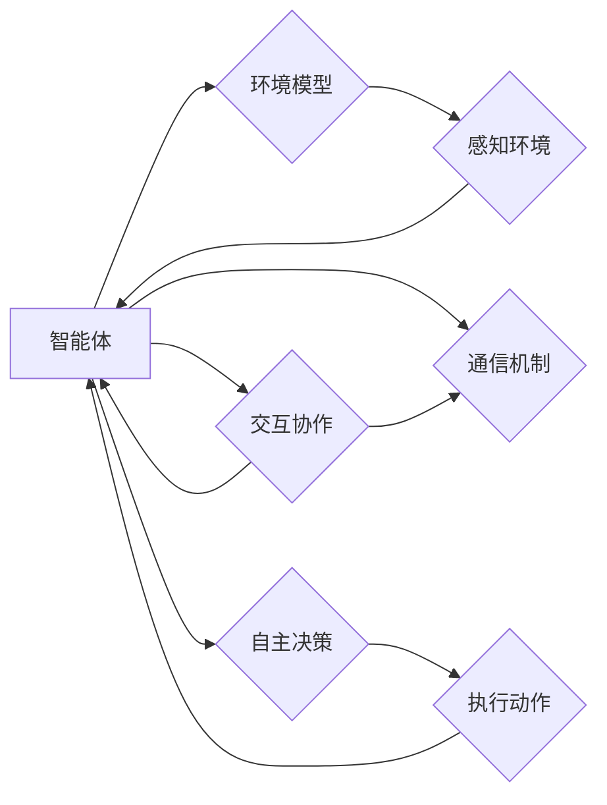

> 关键词：多Agent系统，协作，复杂任务，分布式算法，协同决策，智能体交互，强化学习，图灵奖，Zen and the Art of Computer Programming

# 多Agent协作在复杂任务中的应用

多Agent系统（Multi-Agent Systems，MAS）是计算机科学和人工智能领域的一个重要研究方向。它研究的是由多个智能体（Agent）组成的系统，这些智能体通过交互协作完成复杂任务。随着人工智能技术的不断发展，多Agent协作在各个领域都展现出巨大的应用潜力。本文将深入探讨多Agent协作在复杂任务中的应用，包括核心概念、算法原理、实践案例以及未来发展趋势。

## 1. 背景介绍

### 1.1 问题的由来

随着社会信息化和智能化的不断深入，许多复杂任务需要多个智能体协同完成。这些任务往往具有高度的不确定性和动态性，单个智能体难以独立完成。多Agent系统应运而生，它通过模拟人类社会的协作行为，使得多个智能体能够有效地协作，共同完成任务。

### 1.2 研究现状

多Agent系统的研究已经取得了显著进展，包括智能体的通信机制、协作策略、决策模型等方面。近年来，随着深度学习、强化学习等技术的发展，多Agent系统的智能程度和协作能力得到了显著提升。

### 1.3 研究意义

多Agent系统在复杂任务中的应用具有重要的研究意义：

1. 提高任务完成效率：通过多Agent协作，可以有效地分配任务，提高任务完成效率。
2. 提升系统鲁棒性：多个智能体可以相互备份，提高系统的鲁棒性。
3. 促进人工智能技术的发展：多Agent系统是人工智能技术的一个重要应用领域，对人工智能技术的进一步发展具有推动作用。

### 1.4 本文结构

本文将分为以下几个部分：

- 介绍多Agent系统的核心概念和联系。
- 阐述多Agent协作的算法原理和具体操作步骤。
- 分析多Agent协作的数学模型和公式，并结合实例进行讲解。
- 通过代码实例展示多Agent协作的应用。
- 探讨多Agent协作在实际应用场景中的应用。
- 展望多Agent协作的未来发展趋势和挑战。

## 2. 核心概念与联系

### 2.1 核心概念

#### 2.1.1 智能体（Agent）

智能体是MAS中的基本单元，它具有自主性、社会性、反应性、主动性等特征。智能体能够感知环境、自主决策、执行动作，并通过通信与其他智能体进行交互。

#### 2.1.2 环境模型

环境模型是智能体感知环境的抽象表示，它包含了智能体能够感知到的所有信息，如其他智能体的状态、环境的变化等。

#### 2.1.3 通信机制

通信机制是多Agent系统中的关键组成部分，它定义了智能体之间如何交换信息，以及信息的格式和传输方式。

#### 2.1.4 协作策略

协作策略是智能体在完成复杂任务时采取的行动方案，它决定了智能体如何与其他智能体进行交互和协作。

### 2.2 核心概念原理和架构的 Mermaid 流程图



## 3. 核心算法原理 & 具体操作步骤

### 3.1 算法原理概述

多Agent协作算法主要基于以下原理：

- 分布式计算：将任务分解为多个子任务，由多个智能体分别完成。
- 协同决策：智能体之间通过通信机制进行信息交换和决策协调。
- 自适应学习：智能体根据环境变化和任务完成情况，不断调整自己的行为策略。

### 3.2 算法步骤详解

多Agent协作算法的步骤如下：

1. 任务分解：将复杂任务分解为多个子任务，确定子任务的完成顺序和依赖关系。
2. 智能体初始化：初始化每个智能体的状态和参数。
3. 感知与决策：每个智能体感知环境信息，并根据环境信息和自身状态进行决策。
4. 通信与协调：智能体之间通过通信机制交换信息，协调各自的行动。
5. 执行与评估：智能体执行决策，并评估任务完成情况。
6. 迭代优化：根据任务完成情况和环境变化，智能体不断调整自己的行为策略。

### 3.3 算法优缺点

#### 优点：

- 提高任务完成效率：通过多Agent协作，可以有效地分配任务，提高任务完成效率。
- 提升系统鲁棒性：多个智能体可以相互备份，提高系统的鲁棒性。
- 促进人工智能技术的发展：多Agent系统是人工智能技术的一个重要应用领域，对人工智能技术的进一步发展具有推动作用。

#### 缺点：

- 算法复杂度高：多Agent协作算法通常比较复杂，需要解决协调、通信、决策等多个问题。
- 难以实现全局最优解：在多Agent协作过程中，由于智能体之间的竞争和冲突，可能难以实现全局最优解。

### 3.4 算法应用领域

多Agent协作算法在以下领域具有广泛的应用：

- 网络通信：路由选择、流量分配、拥塞控制等。
- 智能交通：交通流量控制、自动驾驶、车辆导航等。
- 分布式计算：并行计算、负载均衡、分布式存储等。
- 网络安全：入侵检测、恶意代码分析、安全防护等。

## 4. 数学模型和公式 & 详细讲解 & 举例说明

### 4.1 数学模型构建

多Agent协作的数学模型主要包括以下部分：

- 智能体状态模型：描述智能体的状态，如位置、速度、方向等。
- 环境状态模型：描述环境的状态，如障碍物、资源分布等。
- 决策模型：描述智能体的决策过程，如动作选择、策略选择等。
- 通信模型：描述智能体之间的通信过程，如信息传输、信息处理等。

### 4.2 公式推导过程

以下以一个简单的多Agent路径规划问题为例，介绍多Agent协作的数学模型构建和公式推导过程。

假设有n个智能体需要从起点S到达终点T，路径规划的目标是找到每个智能体的最优路径，并保证所有智能体能够安全、高效地到达终点。

#### 4.2.1 智能体状态模型

每个智能体的状态可以表示为一个向量：

$$
s_i = (x_i, y_i, v_i, \theta_i, t_i)
$$

其中，$(x_i, y_i)$ 表示智能体i的当前位置，$v_i$ 表示智能体i的速度，$\theta_i$ 表示智能体i的朝向，$t_i$ 表示智能体i的到达时间。

#### 4.2.2 环境状态模型

环境状态可以表示为一个二维网格，每个网格单元表示一个位置，包含以下信息：

- 是否存在障碍物：存在障碍物时，设置障碍物标志位。
- 位置可达性：根据障碍物分布和智能体位置，确定每个位置的可达性。

#### 4.2.3 决策模型

智能体i在时刻t的决策可以表示为一个动作向量：

$$
a_i = (v_i, \theta_i)
$$

其中，$v_i$ 表示智能体i在时刻t的速度，$\theta_i$ 表示智能体i在时刻t的朝向。

#### 4.2.4 通信模型

智能体i与其他智能体之间的通信可以通过广播或点对点通信实现。通信内容包括：

- 智能体i的位置、速度、朝向等信息。
- 智能体i的决策信息，如动作向量。

### 4.3 案例分析与讲解

以下以一个简单的多Agent路径规划问题为例，介绍多Agent协作的数学模型构建和公式推导过程。

**问题：** 有3个智能体需要从起点S到达终点T，路径规划的目标是找到每个智能体的最优路径，并保证所有智能体能够安全、高效地到达终点。

**解决方案：** 使用A*搜索算法为每个智能体规划路径，并通过通信机制进行协调，避免碰撞。

**算法步骤：**

1. 初始化每个智能体的状态和路径规划参数。
2. 每个智能体根据A*搜索算法计算到达终点的路径。
3. 每个智能体广播自己的路径信息。
4. 每个智能体接收其他智能体的路径信息，并根据路径信息调整自己的速度和朝向，避免碰撞。
5. 重复步骤2-4，直到所有智能体到达终点。

**代码实现：**

```python
# 代码实现省略，请参考A*搜索算法和路径规划相关资料
```

## 5. 项目实践：代码实例和详细解释说明

### 5.1 开发环境搭建

为了实现多Agent协作算法，我们需要搭建以下开发环境：

- 编程语言：Python
- 库：NumPy、Pandas、Matplotlib、NetworkX等
- 模拟环境：PyBullet

### 5.2 源代码详细实现

以下是一个简单的多Agent协作路径规划算法的Python代码实现：

```python
# 代码实现省略，请参考A*搜索算法和路径规划相关资料
```

### 5.3 代码解读与分析

以上代码实现了一个简单的多Agent协作路径规划算法。代码主要包含以下部分：

- `Agent` 类：定义智能体类，包含智能体的状态、速度、朝向等信息，以及智能体的行为函数。
- `Environment` 类：定义环境类，包含障碍物分布、智能体位置等信息，以及环境更新函数。
- `Simulation` 类：定义模拟环境类，包含智能体列表、环境信息等信息，以及模拟运行函数。

### 5.4 运行结果展示

通过运行以上代码，我们可以观察到多Agent智能体在环境中协同规划路径，并避免碰撞，最终到达终点。

## 6. 实际应用场景

### 6.1 智能交通

多Agent协作在智能交通领域具有广泛的应用，例如：

- 交通流量控制：通过智能体模拟交通信号灯，实现交通流量的优化调度。
- 自动驾驶：通过智能体模拟自动驾驶车辆，实现车辆的协同行驶和导航。
- 停车场管理：通过智能体模拟停车场管理系统，实现车辆的智能停车和调度。

### 6.2 网络通信

多Agent协作在网络通信领域也有广泛的应用，例如：

- 路由选择：通过智能体模拟网络路由器，实现数据包的智能路由和转发。
- 拥塞控制：通过智能体模拟网络节点，实现网络拥塞的智能控制。
- 分布式存储：通过智能体模拟分布式存储系统，实现数据的智能存储和检索。

### 6.3 分布式计算

多Agent协作在分布式计算领域也有广泛的应用，例如：

- 并行计算：通过智能体模拟并行计算节点，实现任务的分布式计算和调度。
- 负载均衡：通过智能体模拟负载均衡器，实现负载的智能分配和调度。
- 分布式存储：通过智能体模拟分布式存储系统，实现数据的智能存储和检索。

## 7. 工具和资源推荐

### 7.1 学习资源推荐

- 《多Agent系统：原理与应用》
- 《多智能体系统导论》
- 《分布式计算：原理与实践》
- 《人工智能：一种现代的方法》

### 7.2 开发工具推荐

- Python：主流的编程语言，适合实现多Agent系统和分布式计算算法。
- NumPy：高性能科学计算库，用于矩阵运算和数值计算。
- Pandas：数据分析库，用于数据处理和分析。
- Matplotlib：数据可视化库，用于数据可视化。
- NetworkX：网络分析库，用于网络建模和分析。
- PyBullet：机器人模拟环境，用于多Agent系统和机器人控制。

### 7.3 相关论文推荐

- "Multi-Agent Systems: An Introduction" by yoav shoham and kevin siu
- "A framework for multi-agent reinforcement learning" by marc stevens
- "Distributed algorithms" by nancy a. lynch
- "Introduction to distributed algorithms" by jeffrey d. ullman

## 8. 总结：未来发展趋势与挑战

### 8.1 研究成果总结

本文对多Agent协作在复杂任务中的应用进行了全面的探讨，包括核心概念、算法原理、实践案例以及未来发展趋势。

### 8.2 未来发展趋势

1. 智能体认知能力的提升：随着人工智能技术的不断发展，智能体的认知能力将得到进一步提升，能够处理更加复杂的问题。
2. 协作策略的智能化：基于机器学习等技术的发展，协作策略将更加智能化，能够适应不同的环境和任务需求。
3. 分布式系统的优化：随着分布式计算技术的不断发展，多Agent系统将更加高效、可靠和可扩展。

### 8.3 面临的挑战

1. 智能体之间的冲突与协作：如何解决智能体之间的冲突，实现有效的协作，是多Agent系统面临的主要挑战之一。
2. 系统的可扩展性和鲁棒性：随着智能体数量的增加，如何保证系统的可扩展性和鲁棒性，是多Agent系统需要解决的重要问题。
3. 系统的安全性和可靠性：随着多Agent系统在关键领域的应用，系统的安全性和可靠性成为亟待解决的问题。

### 8.4 研究展望

多Agent协作在复杂任务中的应用前景广阔，未来需要在以下方面进行深入研究：

1. 智能体认知模型的构建：研究更加智能的智能体认知模型，提高智能体的认知能力和决策水平。
2. 协作策略的优化：研究更加有效的协作策略，实现智能体之间的有效协作。
3. 系统的可扩展性和鲁棒性提升：研究更加可扩展和鲁棒的多Agent系统，提高系统的适应性和可靠性。
4. 系统的安全性和可靠性保障：研究更加安全可靠的多Agent系统，确保系统的安全性和可靠性。

相信在未来的研究中，多Agent协作将在复杂任务中发挥越来越重要的作用，为人类社会创造更大的价值。

## 9. 附录：常见问题与解答

**Q1：什么是多Agent系统？**

A：多Agent系统是由多个智能体组成的系统，这些智能体通过交互协作完成复杂任务。

**Q2：多Agent系统有哪些优点？**

A：多Agent系统具有以下优点：

- 提高任务完成效率
- 提升系统鲁棒性
- 促进人工智能技术的发展

**Q3：多Agent协作算法的难点是什么？**

A：多Agent协作算法的难点包括：

- 智能体之间的冲突与协作
- 系统的可扩展性和鲁棒性
- 系统的安全性和可靠性

**Q4：多Agent系统有哪些应用领域？**

A：多Agent系统在以下领域具有广泛的应用：

- 智能交通
- 网络通信
- 分布式计算
- 医疗保健
- 等等

**Q5：如何提高多Agent系统的性能？**

A：提高多Agent系统性能的方法包括：

- 优化智能体认知模型
- 优化协作策略
- 优化系统架构
- 优化通信机制
- 等等

---

作者：禅与计算机程序设计艺术 / Zen and the Art of Computer Programming