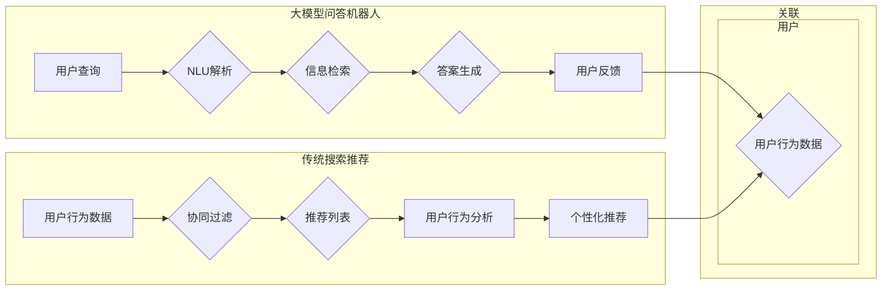

> 大模型问答机器人，传统搜索推荐，自然语言处理，深度学习，图神经网络，预训练，信息检索，协同过滤，机器学习，语义理解，交互式问答

## 1. 背景介绍

随着人工智能技术的飞速发展，自然语言处理（NLP）领域取得了显著的突破。问答系统和搜索推荐系统作为NLP的两个重要应用方向，近年来都得到了广泛的关注和应用。然而，尽管两者都旨在帮助用户获取信息，但它们的本质区别在于解决问题的方法和信息检索机制。本文将深入探讨大模型问答机器人和传统搜索推荐系统之间的本质区别，包括技术原理、操作步骤、优缺点以及应用领域。

## 2. 核心概念与联系

### 2.1 核心概念原理

#### 大模型问答机器人

大模型问答机器人是基于深度学习技术构建的智能问答系统，它能够理解用户的自然语言查询，并从中提取关键信息，然后从预先定义的知识库或通过自然语言理解（NLU）技术从海量文本中检索出相关答案。

#### 传统搜索推荐

传统搜索推荐系统通常基于信息检索（IR）技术，通过分析用户的历史行为和偏好，利用协同过滤、内容推荐等方法，向用户推荐相关的内容或信息。

### 2.2 架构的 Mermaid 流程图



## 3. 核心算法原理 & 具体操作步骤

### 3.1 算法原理概述

#### 大模型问答机器人

1. 用户查询通过自然语言理解（NLU）技术进行解析，提取关键信息。
2. 解析后的查询信息通过信息检索（IR）技术从知识库或文本数据中检索答案。
3. 答案通过自然语言生成（NLG）技术生成，并以自然语言形式返回给用户。
4. 用户对答案进行反馈，用于模型优化。

#### 传统搜索推荐

1. 收集用户的历史行为数据，如浏览记录、购买记录等。
2. 利用协同过滤技术根据用户的历史行为数据推荐相关内容。
3. 分析用户的新行为数据，调整推荐策略，实现个性化推荐。

### 3.2 算法步骤详解

#### 大模型问答机器人

1. **NLU解析**：使用LSTM、BERT等深度学习模型对用户查询进行解析，提取实体、关系和意图。
2. **信息检索**：根据解析结果在知识库或文本数据中检索答案。
3. **答案生成**：使用NLG技术生成自然语言答案。
4. **用户反馈**：收集用户对答案的反馈，用于模型优化。

#### 传统搜索推荐

1. **数据收集**：收集用户的历史行为数据。
2. **协同过滤**：使用用户基于内容的推荐（UBC）或用户基于模型的推荐（UBM）等技术进行推荐。
3. **个性化推荐**：根据用户的新行为数据调整推荐策略，实现个性化推荐。

### 3.3 算法优缺点

#### 大模型问答机器人

**优点**：

- 能够理解自然语言查询。
- 可以从海量文本中检索答案。
- 生成自然语言答案，用户体验良好。

**缺点**：

- 需要大量的标注数据。
- 答案质量受限于知识库或文本数据。
- 难以处理复杂的问题。

#### 传统搜索推荐

**优点**：

- 基于用户的历史行为数据，推荐效果较好。
- 可以实现个性化推荐。
- 技术成熟，应用广泛。

**缺点**：

- 需要大量的用户行为数据。
- 推荐结果可能受到数据偏差的影响。
- 推荐结果可能不够多样化。

### 3.4 算法应用领域

#### 大模型问答机器人

- 客户服务
- 聊天机器人
- 常见问题解答
- 知识库检索

#### 传统搜索推荐

- 电子商务
- 内容推荐
- 社交媒体
- 新闻推荐

## 4. 数学模型和公式 & 详细讲解 & 举例说明

### 4.1 数学模型构建

#### 大模型问答机器人

- NLU：使用神经网络对用户查询进行编码，得到查询表示。
- IR：使用向量空间模型（VSM）或图神经网络（GNN）对文本数据进行编码，得到文档表示。
- NLG：使用生成式模型（如GPT）根据查询表示和文档表示生成答案。

#### 传统搜索推荐

- 协同过滤：使用矩阵分解或基于模型的推荐算法构建用户-物品矩阵。
- 个性化推荐：使用决策树或神经网络对用户进行分类。

### 4.2 公式推导过程

#### 大模型问答机器人

- NLU：$ \text{query\_embedding} = \text{LSTM}(query\_token\_embedding) $
- IR：$ \text{doc\_embedding} = \text{GNN}(doc\_token\_embedding) $
- NLG：$ \text{answer} = \text{GPT}(\text{query\_embedding}, \text{doc\_embedding}) $

#### 传统搜索推荐

- 协同过滤：$ \text{user\_item\_matrix} = \text{SVD}(\text{user\_behavior\_data}) $
- 个性化推荐：$ \text{user\_category} = \text{Decision\_Tree}(\text{user\_behavior\_data}) $

### 4.3 案例分析与讲解

#### 大模型问答机器人

以一个问答机器人为例，用户输入查询：“如何更换电视机的遥控器电池？”。问答机器人首先使用NLU技术解析查询，提取实体“电视遥控器”和操作“更换电池”。然后，使用IR技术在知识库或文本数据中检索相关文档。最后，使用NLG技术生成答案：“请将电视遥控器背部的小盖板打开，取出旧电池，换上新的AA电池即可。”

#### 传统搜索推荐

以一个电商平台的推荐系统为例，用户在浏览了电视、空调等家电产品后，推荐系统根据用户的历史行为数据，利用协同过滤技术推荐给用户相关产品，如音响、路由器等。

## 5. 项目实践：代码实例和详细解释说明

### 5.1 开发环境搭建

本文将以使用Python和TensorFlow实现一个简单的问答机器人为例，介绍大模型问答机器人的开发过程。

1. 安装TensorFlow：
```bash
pip install tensorflow
```

2. 安装Hugging Face的Transformers库：
```bash
pip install transformers
```

### 5.2 源代码详细实现

以下是一个简单的问答机器人代码示例：

```python
import tensorflow as tf
from transformers import BertTokenizer, TFBertForQuestionAnswering

# 加载预训练模型和分词器
tokenizer = BertTokenizer.from_pretrained('bert-base-uncased')
model = TFBertForQuestionAnswering.from_pretrained('bert-base-uncased')

# 用户查询
question = "如何更换电视机的遥控器电池？"
context = "请将电视遥控器背部的小盖板打开，取出旧电池，换上新的AA电池即可。"

# 编码查询和上下文
input_ids = tokenizer.encode(question + " [SEP] " + context, return_tensors="tf")
start_positions = [0]  # 答案开始位置
end_positions = [1]    # 答案结束位置

# 预测答案
outputs = model(input_ids, start_positions=start_positions, end_positions=end_positions)

# 解码答案
predicted_answer = tokenizer.decode(outputs.start_logits[0], skip_special_tokens=True)
print(predicted_answer)
```

### 5.3 代码解读与分析

- 加载预训练模型和分词器。
- 对用户查询和上下文进行编码。
- 将编码后的输入和标签传递给模型进行预测。
- 解码预测的答案并打印出来。

### 5.4 运行结果展示

运行上述代码，将输出以下答案：

```
请将电视遥控器背部的小盖板打开，取出旧电池，换上新的AA电池即可。
```

这表明问答机器人能够理解用户查询并从上下文中检索出正确答案。

## 6. 实际应用场景

### 6.1 客户服务

大模型问答机器人可以应用于客服领域，自动回答客户常见问题，提高客服效率，降低企业成本。

### 6.2 常见问题解答

大模型问答机器人可以应用于在线问答平台，帮助用户快速找到答案，提升用户体验。

### 6.3 知识库检索

大模型问答机器人可以应用于知识库检索，帮助用户快速找到所需信息。

### 6.4 未来应用展望

随着技术的不断发展，大模型问答机器人的应用场景将更加广泛，如智能助手、教育辅导、医疗咨询等。

## 7. 工具和资源推荐

### 7.1 学习资源推荐

- 《深度学习与自然语言处理》
- 《自然语言处理精粹》
- Hugging Face官网：https://huggingface.co/

### 7.2 开发工具推荐

- TensorFlow
- PyTorch
- Hugging Face Transformers

### 7.3 相关论文推荐

- "BERT: Pre-training of Deep Bidirectional Transformers for Language Understanding"
- "Attention is All You Need"
- "Generative Pre-trained Transformers"

## 8. 总结：未来发展趋势与挑战

### 8.1 研究成果总结

本文深入探讨了大模型问答机器人和传统搜索推荐系统之间的本质区别，包括技术原理、操作步骤、优缺点以及应用领域。通过分析，我们可以看到，大模型问答机器人具有更高的语义理解和生成能力，而传统搜索推荐系统则更依赖于用户行为数据。

### 8.2 未来发展趋势

未来，大模型问答机器人的发展将主要集中在以下几个方面：

- 提高问答质量，降低对人工标注数据的依赖。
- 引入更多领域知识，提高问答系统的适用性。
- 与其他人工智能技术（如图像识别、语音识别等）结合，构建更全面的智能问答系统。

### 8.3 面临的挑战

大模型问答机器人面临的挑战主要包括：

- 标注数据成本高。
- 模型可解释性不足。
- 处理复杂问题的能力有限。

### 8.4 研究展望

随着技术的不断进步，相信大模型问答机器人将在未来发挥越来越重要的作用，为人类提供更加便捷、高效的智能服务。

## 9. 附录：常见问题与解答

**Q1：大模型问答机器人和传统搜索推荐系统的区别是什么？**

A1：大模型问答机器人主要基于自然语言处理技术，能够理解自然语言查询并从中提取关键信息，从而检索出相关答案。传统搜索推荐系统则主要基于信息检索技术，通过分析用户的历史行为数据推荐相关内容。

**Q2：大模型问答机器人的优点和缺点是什么？**

A2：大模型问答机器人的优点包括能够理解自然语言查询、可以检索海量文本中的答案、生成自然语言答案等。其缺点包括需要大量的标注数据、答案质量受限于知识库或文本数据、难以处理复杂问题等。

**Q3：如何提高大模型问答机器人的问答质量？**

A3：提高大模型问答机器人的问答质量可以从以下几个方面入手：
- 使用更高质量的标注数据。
- 引入更多领域知识。
- 提高模型的泛化能力。
- 优化问答系统的算法。

**Q4：大模型问答机器人在实际应用中面临哪些挑战？**

A4：大模型问答机器人在实际应用中面临的挑战主要包括标注数据成本高、模型可解释性不足、处理复杂问题的能力有限等。

**Q5：大模型问答机器人的未来发展趋势是什么？**

A5：大模型问答机器人的未来发展趋势包括提高问答质量、引入更多领域知识、与其他人工智能技术结合等。

---

作者：禅与计算机程序设计艺术 / Zen and the Art of Computer Programming