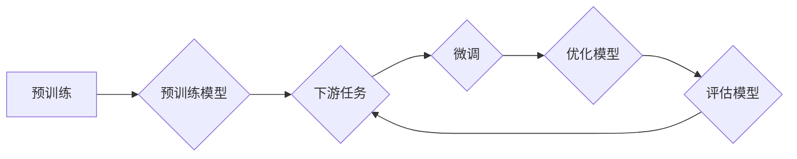

> 关键词：大规模语言模型，预训练，迁移学习，NLP，Transformer，BERT，GPT，预训练数据，下游任务

# 大规模语言模型从理论到实践 通用数据

## 1. 背景介绍

随着深度学习技术的飞速发展，自然语言处理（NLP）领域取得了革命性的进步。大规模语言模型（Large Language Models，LLMs）的出现，为NLP带来了全新的可能性。LLMs通过在庞大的文本语料库上进行预训练，学习到丰富的语言知识和模式，从而在各个NLP任务上展现出惊人的性能。本文将深入探讨大规模语言模型的理论基础、实践技巧和通用数据的重要性。

## 2. 核心概念与联系

### 2.1 大规模语言模型

大规模语言模型是指通过在大规模文本语料库上进行预训练，学习到丰富的语言知识和模式的深度学习模型。LLMs通常由数以亿计的参数组成，能够理解和生成自然语言，并在各种NLP任务上表现出色。

### 2.2 预训练

预训练是指在大规模无标签文本语料库上训练模型的过程。预训练的目标是让模型学习到通用语言表示，从而在各个NLP任务上具备良好的泛化能力。

### 2.3 迁移学习

迁移学习是指利用在源域上学习到的知识来帮助解决目标域上的问题。LLMs通过预训练学习到的通用语言知识，可以迁移到下游任务上，从而提高模型在特定任务上的性能。

### 2.4 NLP

自然语言处理（NLP）是指让计算机理解和处理自然语言的技术。NLP涵盖了文本分类、命名实体识别、情感分析、机器翻译等众多任务。

### 2.5 Mermaid 流程图

以下是大规模语言模型预训练和微调的Mermaid流程图：



## 3. 核心算法原理 & 具体操作步骤

### 3.1 算法原理概述

大规模语言模型的预训练和微调过程主要包括以下几个步骤：

1. 预训练：在无标签文本语料库上训练模型，学习通用语言表示。
2. 数据预处理：将原始文本数据转换为模型可处理的格式。
3. 微调：在下游任务的数据集上微调模型，优化模型在特定任务上的性能。
4. 评估：在测试集上评估模型性能，对比预训练和微调后的模型。

### 3.2 算法步骤详解

1. **预训练**：选择合适的预训练模型，如BERT、GPT等，并在大规模无标签文本语料库上进行训练。
2. **数据预处理**：对原始文本数据进行分析、清洗和预处理，包括分词、去噪、格式化等操作。
3. **微调**：将预处理后的数据用于微调预训练模型，调整模型参数以适应特定任务。
4. **评估**：在测试集上评估微调后的模型性能，对比预训练和微调后的模型。

### 3.3 算法优缺点

**优点**：

- **泛化能力强**：LLMs通过预训练学习到通用语言知识，能够迁移到各个NLP任务上。
- **性能优异**：LLMs在众多NLP任务上取得了SOTA性能。
- **易用性强**：LLMs易于使用和部署。

**缺点**：

- **数据依赖性强**：LLMs需要大量无标签文本语料库进行预训练。
- **计算资源消耗大**：LLMs需要高性能计算设备进行训练和推理。
- **可解释性差**：LLMs的决策过程难以解释。

### 3.4 算法应用领域

LLMs在以下NLP任务上取得了显著成果：

- **文本分类**：如情感分析、主题分类、垃圾邮件检测等。
- **命名实体识别**：如人名、地点、组织名、时间等的识别。
- **机器翻译**：如将一种语言翻译成另一种语言。
- **文本摘要**：将长文本压缩成简短摘要。
- **问答系统**：回答用户提出的问题。

## 4. 数学模型和公式 & 详细讲解 & 举例说明

### 4.1 数学模型构建

大规模语言模型通常采用Transformer架构，其基本数学模型如下：

$$
\mathbf{h}_{t}^{(l)} = \text{MultiHeadAttention}(\mathbf{W}_Q \mathbf{h}_{t}^{(l-1)}, \mathbf{W}_K \mathbf{h}_{t}^{(l-1)}, \mathbf{W}_V \mathbf{h}_{t}^{(l-1)}) + \text{LayerNorm}(\mathbf{h}_{t}^{(l-1)})
$$

其中，$\mathbf{h}_{t}^{(l)}$ 表示第 $l$ 层的隐藏状态，$\text{MultiHeadAttention}$ 表示多头注意力机制，$\text{LayerNorm}$ 表示层归一化。

### 4.2 公式推导过程

Transformer架构的推导过程涉及线性代数、概率论和优化理论等多个领域。具体推导过程可参考相关文献。

### 4.3 案例分析与讲解

以BERT模型为例，其预训练任务包括以下两种：

1. **掩码语言模型（Masked Language Model，MLM）**：随机掩码输入序列中的一些词，让模型预测这些被掩码的词。
2. **下一句预测（Next Sentence Prediction，NSP）**：判断两个句子是否为连续的句子。

通过这两个预训练任务，BERT模型能够学习到丰富的语言知识和模式。

## 5. 项目实践：代码实例和详细解释说明

### 5.1 开发环境搭建

以下是使用PyTorch和Transformers库进行大规模语言模型微调的步骤：

1. 安装PyTorch和Transformers库。
2. 准备预训练模型和数据集。
3. 定义微调模型和训练过程。

### 5.2 源代码详细实现

以下是一个使用PyTorch和Transformers库进行BERT微调的示例代码：

```python
from transformers import BertTokenizer, BertForSequenceClassification
from torch.utils.data import DataLoader, Dataset
from torch.optim import AdamW

# 加载预训练模型和数据集
tokenizer = BertTokenizer.from_pretrained('bert-base-uncased')
dataset = MyDataset(train_texts, train_labels)
dataloader = DataLoader(dataset, batch_size=16, shuffle=True)

model = BertForSequenceClassification.from_pretrained('bert-base-uncased', num_labels=2)
optimizer = AdamW(model.parameters(), lr=2e-5)

# 训练过程
for epoch in range(3):
    model.train()
    for batch in dataloader:
        input_ids = batch['input_ids'].to(device)
        attention_mask = batch['attention_mask'].to(device)
        labels = batch['labels'].to(device)
        optimizer.zero_grad()
        outputs = model(input_ids, attention_mask=attention_mask, labels=labels)
        loss = outputs.loss
        loss.backward()
        optimizer.step()
```

### 5.3 代码解读与分析

以上代码展示了使用PyTorch和Transformers库进行BERT微调的基本流程。首先，加载预训练模型和数据集，然后定义微调模型和优化器。接下来，在训练过程中，模型对每个批次的数据进行前向传播和反向传播，并更新模型参数。

### 5.4 运行结果展示

运行上述代码后，模型将在训练集上进行训练，并在测试集上进行评估。最终，模型将在测试集上取得一定的性能。

## 6. 实际应用场景

大规模语言模型在以下实际应用场景中表现出色：

- **智能客服**：通过微调预训练模型，实现自动回复客户咨询、处理投诉等。
- **智能推荐**：通过分析用户行为数据，推荐用户感兴趣的商品、新闻等。
- **机器翻译**：将一种语言翻译成另一种语言，打破语言障碍。
- **文本摘要**：将长文本压缩成简短摘要，方便用户快速获取信息。

## 7. 工具和资源推荐

### 7.1 学习资源推荐

- 《深度学习自然语言处理》
- 《Natural Language Processing with Transformers》
- HuggingFace官方文档
- CLUE开源项目

### 7.2 开发工具推荐

- PyTorch
- Transformers库
- HuggingFace Model Hub

### 7.3 相关论文推荐

- Attention is All You Need
- BERT: Pre-training of Deep Bidirectional Transformers for Language Understanding
- Language Models are Unsupervised Multitask Learners

## 8. 总结：未来发展趋势与挑战

### 8.1 研究成果总结

大规模语言模型在NLP领域取得了显著的成果，为NLP技术的应用提供了新的可能性。

### 8.2 未来发展趋势

- **模型规模持续增大**：随着计算资源的提升，LLMs的规模将越来越大。
- **多模态模型**：LLMs将与其他模态信息（如图像、视频）进行融合，实现更全面的理解。
- **可解释性**：LLMs的可解释性将得到提高，使其应用更加可靠。

### 8.3 面临的挑战

- **数据依赖**：LLMs需要大量数据才能进行预训练。
- **计算资源消耗**：LLMs的训练和推理需要大量的计算资源。
- **可解释性**：LLMs的决策过程难以解释，存在潜在的安全风险。

### 8.4 研究展望

- **减少数据需求**：研究更有效的数据增强和自监督学习方法，减少LLMs对数据的依赖。
- **优化计算资源**：研究更高效的训练和推理方法，降低LLMs的计算资源消耗。
- **提高可解释性**：研究更可靠的可解释性方法，提高LLMs的透明度和可信度。

## 9. 附录：常见问题与解答

**Q1：什么是大规模语言模型？**

A：大规模语言模型是指通过在大规模文本语料库上进行预训练，学习到丰富的语言知识和模式的深度学习模型。

**Q2：大规模语言模型有哪些应用？**

A：大规模语言模型在文本分类、命名实体识别、机器翻译、文本摘要、问答系统等NLP任务上取得了显著的成果。

**Q3：如何使用大规模语言模型？**

A：使用大规模语言模型需要准备预训练模型和数据集，然后进行数据预处理、微调和评估等步骤。

**Q4：大规模语言模型有哪些挑战？**

A：大规模语言模型的挑战包括数据依赖、计算资源消耗和可解释性等。

**Q5：如何解决大规模语言模型的挑战？**

A：解决大规模语言模型的挑战需要研究更有效的数据增强和自监督学习方法，优化计算资源，以及提高可解释性。

---

作者：禅与计算机程序设计艺术 / Zen and the Art of Computer Programming