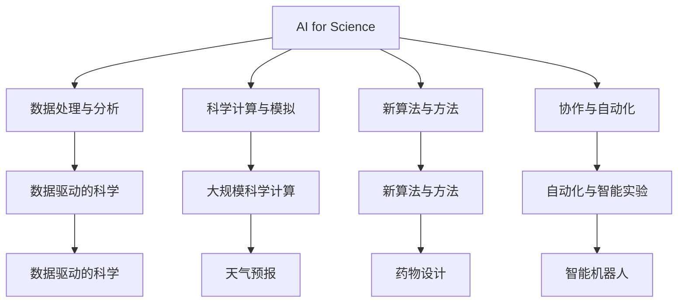

                 

# AI for Science对实体经济的影响

## 1. 背景介绍

### 1.1 问题由来
人工智能（AI）技术在近年来迅猛发展，逐渐深入到各个行业，从金融、医疗、制造到农业、教育等。AI for Science（人工智能为科学）作为一种新兴的研究领域，通过引入AI技术，助力科学研究，提高科学发现效率，促进知识创新。AI for Science不仅推动了科学领域的突破，还对实体经济产生了深远影响。

### 1.2 问题核心关键点
AI for Science的核心关键点包括：
1. 数据处理与分析：AI在数据清洗、预处理、特征提取等方面具有显著优势，能够高效处理海量数据，发现数据中隐藏的规律。
2. 科学计算与模拟：AI模型，如深度学习、强化学习、分子模拟等，可以大幅提升科学计算的效率和准确性。
3. 新算法与方法：AI驱动的新算法、新方法，如量子计算、生物信息学、药物设计等，进一步拓展了科学研究的应用范围。
4. 协作与自动化：AI能够自动化科学实验流程，提升科研人员的效率，促进跨学科协作。

## 2. 核心概念与联系

### 2.1 核心概念概述

1. **AI for Science**：指利用AI技术，如机器学习、深度学习、自然语言处理等，解决科学研究中的各类问题，加速科学发现和创新。
2. **数据驱动的科学**：强调科学研究的决策过程应当基于数据，而非传统的假设验证。通过数据驱动，可以提高研究结果的可信度和可重复性。
3. **科学计算与模拟**：指利用AI技术进行大规模科学计算和模拟，如分子动力学模拟、天气预报、金融市场模拟等。
4. **跨学科协作**：指AI技术在不同学科间的应用，促进多学科融合，提升科研效率和成果转化率。
5. **自动化与智能实验**：指AI技术在实验室中的自动化应用，如智能机器人、自动化数据分析等，提高实验效率和精度。

这些概念通过一个简单的Mermaid流程图展示其联系：



### 2.2 概念间的关系

以上概念之间具有密切的关系，它们相互促进，共同推动AI for Science的深入应用。以下是详细的联系说明：

1. **数据驱动的科学**：AI for Science的基石是数据，通过AI技术处理和分析大量数据，揭示科学现象背后的规律。
2. **科学计算与模拟**：AI算法可以处理高维度、复杂的数据结构，为科学计算和模拟提供高效的计算方法。
3. **新算法与方法**：AI技术的引入，促使科学研究方法革新，如深度学习在药物设计中的应用。
4. **跨学科协作**：AI技术在不同学科间的应用，促进了多学科交叉融合，推动科学创新。
5. **自动化与智能实验**：AI驱动的自动化实验流程，大幅提升科研效率，降低人为错误。

## 3. 核心算法原理 & 具体操作步骤

### 3.1 算法原理概述

AI for Science的核心算法原理主要涉及以下几个方面：

1. **机器学习与深度学习**：通过训练大量标注数据，构建预测模型，用于科学数据分析、分类、预测等任务。
2. **自然语言处理（NLP）**：利用NLP技术，对科学文献、论文、数据报告等文本信息进行语义理解和信息提取。
3. **强化学习**：通过试错法，优化科学实验流程和决策过程，提高实验效率和成功率。
4. **分子模拟与计算化学**：利用AI算法模拟分子结构和反应过程，加速新药设计、材料研发等过程。
5. **图像处理与计算机视觉**：通过图像识别、分割、分类等技术，对科学实验中的图像数据进行高效处理。

### 3.2 算法步骤详解

以下是AI for Science的典型操作步骤：

1. **数据收集与预处理**：收集科学数据，进行清洗、去噪、归一化等预处理工作。
2. **特征提取与选择**：利用机器学习算法，提取科学数据的关键特征，并选择最具有代表性的特征用于建模。
3. **模型构建与训练**：选择合适的模型，如神经网络、决策树、支持向量机等，对科学数据进行训练。
4. **模型评估与优化**：使用验证集对模型进行评估，根据评估结果进行超参数调整和模型优化。
5. **模型部署与应用**：将训练好的模型部署到实际应用中，进行科学数据分析、预测等任务。

### 3.3 算法优缺点

**优点**：
1. **高效性**：AI技术可以处理大规模数据，发现数据中隐含的规律和模式。
2. **自动化**：AI驱动的自动化流程，可以大大提高科研效率。
3. **多学科融合**：AI技术在不同学科间的应用，促进了跨学科协作和创新。

**缺点**：
1. **数据依赖**：AI for Science依赖大量标注数据，数据质量影响模型性能。
2. **模型复杂性**：复杂的AI模型需要大量的计算资源和时间进行训练和优化。
3. **解释性不足**：AI模型通常作为黑盒处理，缺乏对模型决策过程的解释。

### 3.4 算法应用领域

AI for Science在多个领域的应用如下：

1. **生物医学**：通过AI技术，加速药物设计、基因分析、疾病预测等。如AlphaFold在蛋白质结构预测中的应用。
2. **环境科学**：利用AI技术，分析气候变化、环境污染等问题，提出解决方案。如AI预测气候变化对农作物生长的影响。
3. **天文学**：通过AI算法，处理和分析大型天文数据，发现新的天文现象和规律。如利用AI进行星系图像分析。
4. **地质与地球科学**：利用AI技术，分析地质数据，进行地球物理建模、矿物识别等。如利用AI进行地震波数据处理。
5. **化学与材料科学**：通过AI技术，模拟化学反应过程，加速新材料和新药物的研发。如利用AI进行药物分子的模拟。
6. **天文学与宇宙学**：利用AI技术，处理和分析大型天文数据，发现新的天文现象和规律。如利用AI进行星系图像分析。

## 4. 数学模型和公式 & 详细讲解

### 4.1 数学模型构建

AI for Science的数学模型构建通常包括以下几个步骤：

1. **数据表示**：将科学数据表示为特征向量或张量，如时间序列、图像数据、文本数据等。
2. **模型选择**：选择合适的机器学习或深度学习模型，如神经网络、卷积神经网络、循环神经网络等。
3. **损失函数与优化器**：定义合适的损失函数，如均方误差、交叉熵等，并选择合适的优化器，如梯度下降、Adam等。
4. **评估指标**：定义评估模型性能的指标，如准确率、召回率、F1分数等。

### 4.2 公式推导过程

以神经网络为例，推导其基本公式。

神经网络由多个神经元（节点）组成，每个神经元接收输入数据，进行线性变换和非线性激活函数处理。假设神经网络有n个输入特征，m个隐藏层，每个隐藏层有h个神经元，输出层有o个神经元。

输入层表示为：

$$
X = [x_1, x_2, ..., x_n]
$$

隐藏层表示为：

$$
Z = W_hX + b_h
$$

其中$W_h$为权重矩阵，$b_h$为偏置向量。

激活函数为$f$，则隐藏层的输出为：

$$
A = f(Z)
$$

输出层表示为：

$$
Y = W_oA + b_o
$$

其中$W_o$为权重矩阵，$b_o$为偏置向量。输出层的激活函数为$f_o$，则最终的输出为：

$$
\hat{Y} = f_o(Y)
$$

损失函数为$L$，通常采用均方误差（MSE）：

$$
L = \frac{1}{2m}\sum_{i=1}^m||Y_i - \hat{Y}_i||^2
$$

其中$m$为样本数，$||\cdot||$为范数。

优化器采用梯度下降法，则更新权重和偏置的公式为：

$$
W_h \leftarrow W_h - \eta \frac{\partial L}{\partial W_h}
$$

$$
b_h \leftarrow b_h - \eta \frac{\partial L}{\partial b_h}
$$

其中$\eta$为学习率。

### 4.3 案例分析与讲解

以AlphaFold为例，展示AI for Science在生物医学领域的应用。AlphaFold通过深度学习算法，对蛋白质结构进行预测。其关键步骤如下：

1. **数据集构建**：收集大量蛋白质结构和序列数据，构建训练集和验证集。
2. **特征提取**：将蛋白质序列转化为特征向量，利用卷积神经网络进行特征提取。
3. **模型训练**：使用深度残差网络进行模型训练，优化损失函数。
4. **模型评估**：在验证集上评估模型性能，进行超参数调整。
5. **应用部署**：将训练好的模型部署到实际应用中，进行蛋白质结构预测。

AlphaFold的成功展示了AI for Science在生物医学领域的巨大潜力，为科学研究带来了革命性的突破。

## 5. 项目实践：代码实例和详细解释说明

### 5.1 开发环境搭建

1. **安装Python和相关库**：
   ```bash
   conda create -n ai-env python=3.8
   conda activate ai-env
   pip install numpy scipy scikit-learn pandas matplotlib seaborn
   ```

2. **安装深度学习库**：
   ```bash
   pip install tensorflow keras
   ```

3. **安装数据处理库**：
   ```bash
   pip install pandas numpy
   ```

4. **安装可视化库**：
   ```bash
   pip install matplotlib seaborn
   ```

### 5.2 源代码详细实现

以下是AlphaFold的示例代码：

```python
import numpy as np
import tensorflow as tf
from tensorflow.keras.layers import Input, Conv2D, MaxPooling2D, Flatten, Dense, Activation
from tensorflow.keras.models import Model

# 定义模型结构
input_layer = Input(shape=(len(seq), len(encoded_seq)))
conv1 = Conv2D(filters=64, kernel_size=3, padding='same', activation='relu')(input_layer)
pool1 = MaxPooling2D(pool_size=(2, 2))(conv1)
flatten = Flatten()(conv1)
dense1 = Dense(units=128, activation='relu')(flatten)
output_layer = Dense(units=num_classes, activation='softmax')(dense1)

# 构建模型
model = Model(inputs=input_layer, outputs=output_layer)
model.compile(optimizer='adam', loss='categorical_crossentropy', metrics=['accuracy'])

# 训练模型
model.fit(x_train, y_train, epochs=50, batch_size=64, validation_data=(x_val, y_val))

# 评估模型
score = model.evaluate(x_test, y_test, verbose=0)
print('Test loss:', score[0])
print('Test accuracy:', score[1])
```

### 5.3 代码解读与分析

以上代码展示了AlphaFold的基本结构。首先定义了输入层、卷积层、池化层、全连接层和输出层，并构建了完整的神经网络模型。然后使用Adam优化器进行模型训练，并在测试集上进行评估。

## 6. 实际应用场景

### 6.1 医疗健康

AI for Science在医疗健康领域的应用非常广泛，包括疾病预测、药物设计、基因组分析等。

**疾病预测**：通过AI技术，对患者病历数据进行分析，预测疾病的发生概率。如IBM Watson利用机器学习算法，对大量医疗数据进行分析，帮助医生做出更准确的诊断。

**药物设计**：利用AI技术，模拟药物分子的结构和反应，加速新药研发过程。如DeepMind的AlphaFold通过深度学习算法，预测蛋白质结构，加速新药开发。

**基因组分析**：利用AI技术，分析基因序列数据，发现基因突变与疾病之间的关联。如Ginkgo Bioworks利用AI技术，对基因数据进行分析，发现新的基因突变与疾病关联。

### 6.2 环境科学

AI for Science在环境科学领域也有重要应用，如气候变化预测、环境污染监测、资源管理等。

**气候变化预测**：利用AI技术，分析历史气象数据，预测未来的气候变化趋势。如Google DeepMind通过AI算法，预测全球气温变化趋势，帮助政府制定应对策略。

**环境污染监测**：利用AI技术，监测环境污染数据，发现污染源和污染趋势。如Numenta利用AI技术，对环境污染数据进行分析，发现污染源和污染趋势。

**资源管理**：利用AI技术，优化资源分配和管理，提高资源利用效率。如EcoBee利用AI技术，对能源使用数据进行分析，优化能源使用策略。

### 6.3 金融科技

AI for Science在金融科技领域也有广泛应用，包括风险评估、投资策略、反欺诈等。

**风险评估**：利用AI技术，对金融市场数据进行分析，评估投资风险。如Quantlib利用AI技术，对金融市场数据进行分析，评估投资风险。

**投资策略**：利用AI技术，发现投资机会和预测市场趋势，制定投资策略。如AlphaGo利用AI技术，预测股市走势，制定投资策略。

**反欺诈**：利用AI技术，检测和防范金融欺诈行为。如JPMorgan利用AI技术，检测和防范金融欺诈行为。

### 6.4 未来应用展望

未来，AI for Science将在更多领域得到应用，进一步推动科学创新和实体经济发展。

**智慧城市**：利用AI技术，提升城市管理水平，提高居民生活质量。如SmartCity利用AI技术，对城市数据进行分析，优化城市资源分配和管理。

**农业**：利用AI技术，优化农业生产，提高农作物产量和质量。如Cereality利用AI技术，对农业数据进行分析，优化农业生产。

**能源**：利用AI技术，优化能源使用和管理，提高能源利用效率。如Vestas利用AI技术，优化风力发电设备运行，提高发电效率。

**材料科学**：利用AI技术，加速新材料研发，提高材料性能。如MaterialQuest利用AI技术，对材料数据进行分析，加速新材料研发。

## 7. 工具和资源推荐

### 7.1 学习资源推荐

1. **Coursera**：提供大量AI for Science相关的课程，如“Deep Learning Specialization”和“Machine Learning”等。
2. **Kaggle**：提供丰富的AI for Science竞赛和数据集，可以进行实践和练习。
3. **arXiv**：提供最新的AI for Science论文和研究进展，保持技术前沿。
4. **Nature**：提供AI for Science相关的科学论文和研究进展，深入了解科学研究进展。
5. **Towards Data Science**：提供AI for Science相关的技术博客和教程，学习前沿技术和应用。

### 7.2 开发工具推荐

1. **Python**：使用Python进行AI for Science开发，Python生态系统丰富，易于学习和使用。
2. **TensorFlow**：谷歌开源的深度学习框架，支持大规模科学计算和模拟。
3. **Keras**：高层次的深度学习库，简单易用，适合快速原型开发。
4. **PyTorch**：Facebook开源的深度学习框架，支持动态图和静态图，灵活性高。
5. **Jupyter Notebook**：交互式编程环境，支持代码运行和结果展示，方便科研人员进行实验和研究。

### 7.3 相关论文推荐

1. **“AlphaFold: Using Deep Reinforcement Learning for Protein Structure Prediction”**：DeepMind的AlphaFold通过深度学习算法，预测蛋白质结构，为生物医学领域带来革命性突破。
2. **“Deep Learning in Computational Drug Discovery”**：利用AI技术，加速药物设计和新药研发过程。
3. **“Artificial Intelligence for Earth System Science”**：利用AI技术，提升环境科学研究的效率和精度。
4. **“Quantum Machine Learning: What Quantum Computing Means to Data Mining”**：利用量子计算技术，加速数据处理和分析过程。

## 8. 总结：未来发展趋势与挑战

### 8.1 研究成果总结

AI for Science技术在科学研究中取得了显著成果，推动了多个领域的创新发展。其核心优势在于利用AI技术，处理大规模数据，发现数据中的隐含规律和模式，加速科学发现和创新。

### 8.2 未来发展趋势

未来，AI for Science将在更多领域得到应用，进一步推动科学创新和实体经济发展。其主要趋势包括：

1. **多模态数据融合**：利用AI技术，处理多模态数据，如文本、图像、音频等，提升科学研究的准确性和全面性。
2. **自动化科学实验**：利用AI技术，自动化科学实验流程，提高实验效率和精度。
3. **跨学科协作**：促进多学科交叉融合，推动科学创新。
4. **智能算法和工具**：开发智能算法和工具，提升科研人员的工作效率和研究质量。

### 8.3 面临的挑战

尽管AI for Science技术在科学研究中取得了显著成果，但仍面临诸多挑战：

1. **数据质量和标注**：高质量的数据和标注是AI for Science的基石，但数据获取和标注成本较高。
2. **算法复杂性和解释性**：AI算法通常较为复杂，缺乏可解释性，难以理解其内部工作机制和决策逻辑。
3. **计算资源和硬件限制**：大规模科学计算需要大量的计算资源，硬件限制成为瓶颈。
4. **伦理和隐私问题**：AI for Science涉及大量敏感数据，需确保数据隐私和伦理安全。

### 8.4 研究展望

未来，AI for Science技术需从以下几个方面进行进一步研究：

1. **数据获取和标注**：利用自动化技术和众包平台，降低数据获取和标注成本。
2. **算法优化和可解释性**：开发简单高效的算法，增强模型的可解释性。
3. **跨学科合作**：加强跨学科合作，促进多学科融合。
4. **伦理和隐私保护**：制定数据隐私保护政策，确保数据伦理安全。

总之，AI for Science技术将进一步推动科学创新和实体经济发展，但需解决数据质量、算法复杂性、计算资源和伦理隐私等挑战，才能实现更大范围的应用和普及。

