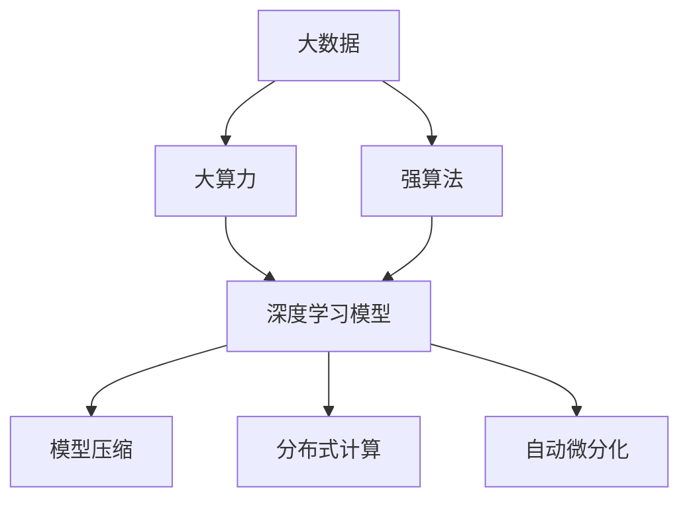
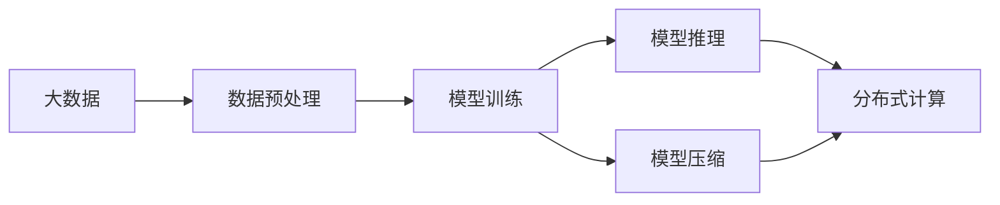
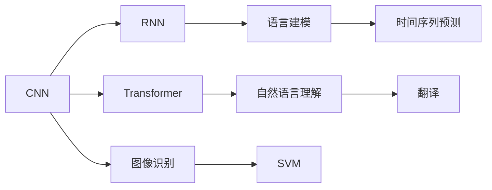
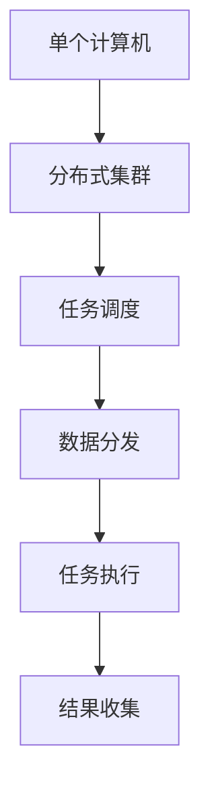
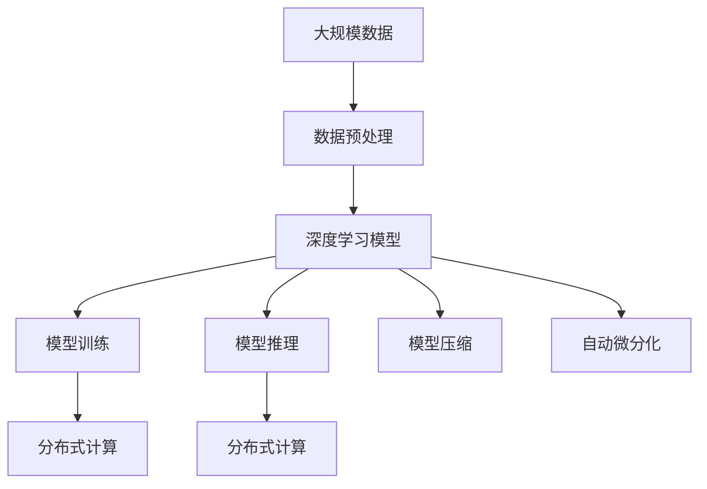

                 

# AI 神经网络计算艺术之禅：大数据＋大算力＋强算法

## 1. 背景介绍

### 1.1 问题由来
人工智能(AI)，特别是深度学习领域，正在经历一次前所未有的变革。通过大数据、大算力和强算法的有机结合，人工智能技术正在从实验室走向实际应用，解决各种复杂的现实问题。深度神经网络(DNN)作为人工智能的基石，其计算艺术之禅在于合理地组织数据、运用算力以及选择算法。

### 1.2 问题核心关键点
大神经网络的核心关键点在于：

1. **大数据(Big Data)**：数据是深度学习的源泉。深度神经网络需要大量的标注和非标注数据来训练和测试模型。数据的多样性和丰富性决定了模型性能的上限。

2. **大算力(Big Compute)**：训练大神经网络需要强大的计算资源。深度学习模型的计算量随着参数量的增加呈指数级增长。因此，高性能计算集群、GPU/TPU等硬件设备的引入，是大神经网络得以训练和运行的基础。

3. **强算法(Strong Algorithms)**：深度学习模型的设计思想和算法框架是实现高效计算和优化性能的关键。近年来，卷积神经网络(CNN)、循环神经网络(RNN)、变换器(Transformer)等模型的提出，为解决各种视觉、语言、时间序列等领域的任务提供了强有力的工具。

### 1.3 问题研究意义
研究大神经网络的计算艺术之禅，对于推动人工智能技术的发展、提升计算效率、优化模型性能、加速算法创新，具有重要意义：

1. **提升计算效率**：合理运用大数据、大算力和强算法，可以大幅提升神经网络模型的计算效率，使其能够在更短的时间内处理和分析海量数据。

2. **优化模型性能**：数据、算力和算法的综合优化，使得神经网络模型能够在更少的参数下，获得更好的性能，减少过拟合风险，提升泛化能力。

3. **加速算法创新**：深度学习的计算艺术之禅激励研究者探索更多新颖的算法架构和优化策略，推动人工智能技术不断突破。

4. **促进产业化应用**：通过大数据、大算力和强算法的有机结合，人工智能技术更容易在各行各业落地应用，为社会经济发展注入新的动力。

5. **增强可解释性**：在保证模型性能的同时，通过合理的算法设计和解释性工具，增强模型的可解释性，有助于理解模型的决策逻辑，提升模型的可信度和可靠性。

6. **保障伦理安全性**：合理运用大数据和强算法，防止模型偏见和有害信息，保障人工智能技术的伦理性和安全性。

## 2. 核心概念与联系

### 2.1 核心概念概述

为更好地理解大数据、大算力和强算法的有机结合，本节将介绍几个密切相关的核心概念：

1. **大数据(Big Data)**：通常指规模庞大、种类繁多、更新频繁的数据集。大数据分析、处理和存储技术是深度学习的基础。

2. **大算力(Big Compute)**：指用于深度学习模型训练和推理的强大计算资源，如高性能计算集群、GPU/TPU等设备。

3. **强算法(Strong Algorithms)**：指深度学习模型的设计思想和算法框架，如卷积神经网络(CNN)、循环神经网络(RNN)、变换器(Transformer)等。

4. **深度学习(DL)**：一种基于神经网络的学习算法，通过大量数据训练，自动学习特征表示，从而解决复杂任务。

5. **模型压缩(Model Compression)**：指在保证模型性能的前提下，减少模型参数量、降低计算资源消耗的技术。

6. **分布式计算(Distributed Computing)**：指通过网络将计算任务分配到多台计算机上，提高计算效率的技术。

7. **自动微分化(Automatic Differentiation)**：指自动计算神经网络中各参数对损失函数的梯度，简化反向传播算法的技术。

这些核心概念之间的逻辑关系可以通过以下Mermaid流程图来展示：



这个流程图展示了大数据、大算力和强算法在深度学习中的作用及其相互关系：

1. 大数据为深度学习提供了丰富的训练数据，是大算力和强算法的输入。
2. 大算力为深度学习模型提供了强大的计算能力，支持模型的训练和推理。
3. 强算法为深度学习模型提供了高效的结构和优化方法，保证了模型性能。
4. 模型压缩、分布式计算和自动微分化等技术，进一步优化了深度学习模型的计算效率和性能。

### 2.2 概念间的关系

这些核心概念之间存在着紧密的联系，形成了深度学习模型的完整生态系统。下面我通过几个Mermaid流程图来展示这些概念之间的关系。

#### 2.2.1 深度学习的计算流程



这个流程图展示了深度学习模型从数据预处理到推理的整个计算流程：

1. 大数据经过预处理后，输入到深度学习模型中进行训练。
2. 训练得到的模型用于推理，即处理新的输入数据。
3. 模型推理过程中可能需要进行分布式计算，以处理大规模数据。
4. 模型压缩技术用于减少计算资源消耗，提升推理效率。

#### 2.2.2 强算法的应用场景



这个流程图展示了不同类型的强算法在深度学习中的应用场景：

1. CNN用于图像识别和物体检测等任务，通过卷积操作提取空间特征。
2. RNN用于语言建模和文本生成等任务，通过循环结构捕捉时间序列信息。
3. Transformer用于自然语言理解、机器翻译等任务，通过自注意力机制学习全局依赖。
4. SVM用于分类和回归等任务，是一种传统强算法，仍被广泛应用于某些领域。
5. 时间序列预测通常使用RNN或Transformer，以捕捉时间依赖关系。

#### 2.2.3 分布式计算的应用



这个流程图展示了分布式计算的基本流程：

1. 单个计算机无法处理大规模数据，通过分布式集群将任务分配到多个计算机上。
2. 分布式集群中的任务调度器负责任务的分配和调度。
3. 数据分发器将数据分发到各个计算节点。
4. 各个节点执行计算任务。
5. 结果收集器将各个节点的结果汇总。

### 2.3 核心概念的整体架构

最后，我们用一个综合的流程图来展示这些核心概念在大数据、大算力和强算法结合下的整体架构：



这个综合流程图展示了从数据预处理到模型推理的完整流程，以及模型压缩和自动微分化等技术的应用：

1. 大规模数据经过预处理后，输入到深度学习模型中进行训练。
2. 训练得到的模型用于推理，即处理新的输入数据。
3. 模型推理过程中可能需要进行分布式计算，以处理大规模数据。
4. 模型压缩技术用于减少计算资源消耗，提升推理效率。
5. 自动微分化技术用于简化反向传播算法，加速模型训练。

通过这些流程图，我们可以更清晰地理解大数据、大算力和强算法在大神经网络中的应用和相互作用，为后续深入讨论具体的计算艺术之禅奠定基础。

## 3. 核心算法原理 & 具体操作步骤

### 3.1 算法原理概述

大神经网络的计算艺术之禅在于合理地组织数据、运用算力以及选择算法。其核心思想是通过大数据、大算力和强算法的有机结合，构建高效、准确的深度学习模型。

形式化地，假设有一个深度神经网络模型 $M_{\theta}$，其中 $\theta$ 为模型参数。训练数据的损失函数为 $\ell(M_{\theta}, X)$，目标是最小化损失函数，即：

$$
\hat{\theta} = \mathop{\arg\min}_{\theta} \ell(M_{\theta}, X)
$$

其中 $X$ 为训练数据集。

通过梯度下降等优化算法，不断更新模型参数 $\theta$，使得损失函数 $\ell$ 最小化。在大数据、大算力和强算法的支持下，大神经网络能够在较短时间内训练和优化，从而在各种任务上取得优异性能。

### 3.2 算法步骤详解

大神经网络的计算艺术之禅具体实施步骤如下：

**Step 1: 准备大数据**

- 收集和预处理大规模数据集，确保数据的丰富性和多样性。
- 数据预处理包括数据清洗、归一化、特征工程等步骤。
- 使用分布式计算技术，将大数据集划分成多个子集，并行处理。

**Step 2: 选择强算法**

- 根据任务类型和数据特点，选择合适的深度学习模型结构。
- 例如，对于图像识别任务，可以选用卷积神经网络(CNN)；对于文本生成任务，可以选用Transformer。
- 设计合适的损失函数和优化算法。

**Step 3: 设置大算力**

- 部署高性能计算集群，如GPU/TPU集群，确保模型训练和推理的计算能力。
- 使用分布式计算框架，如TensorFlow分布式、PyTorch分布式，加速模型训练和推理。

**Step 4: 执行模型训练**

- 将数据集分为训练集、验证集和测试集，循环训练模型。
- 在每个epoch中，使用优化算法和损失函数更新模型参数。
- 使用分布式计算技术，并行训练模型，加快训练速度。

**Step 5: 评估模型性能**

- 在测试集上评估模型性能，计算精度、召回率、F1分数等指标。
- 使用模型压缩技术，减少模型参数量，提升推理速度。
- 使用自动微分化技术，优化反向传播算法，提升模型训练效率。

### 3.3 算法优缺点

大神经网络的计算艺术之禅具有以下优点：

1. **高效性**：通过分布式计算和大算力支持，大神经网络能够在较短时间内完成模型训练和推理，处理大规模数据。
2. **准确性**：强算法的引入，使得模型能够更好地捕捉数据特征，提高模型精度和泛化能力。
3. **可扩展性**：使用分布式计算框架，可以轻松扩展计算能力，支持更大规模数据的处理。

但同时，该算法也存在一些缺点：

1. **计算资源消耗大**：大神经网络需要大量计算资源，对于小型项目或设备有限的场景可能不适用。
2. **模型复杂度高**：强算法的设计和实现相对复杂，需要较高的技术门槛。
3. **数据质量要求高**：大数据的质量直接影响模型的性能，需要严格的数据预处理和清洗。
4. **训练成本高**：大神经网络的训练需要大量标注数据和计算资源，成本较高。
5. **可解释性不足**：模型的决策过程难以解释，难以进行故障诊断和调优。

尽管存在这些局限性，但大神经网络的计算艺术之禅在处理复杂任务、提升模型性能方面具有不可替代的优势，值得深入研究和探索。

### 3.4 算法应用领域

大神经网络的计算艺术之禅已经在众多领域得到了广泛应用，包括但不限于：

- **计算机视觉**：图像分类、物体检测、人脸识别等任务。通过CNN等模型，大神经网络能够高效处理和分析图像数据。
- **自然语言处理**：语言模型、机器翻译、文本生成等任务。通过Transformer等模型，大神经网络能够理解和生成自然语言。
- **语音识别**：语音识别、语音合成等任务。通过RNN等模型，大神经网络能够处理和分析语音信号。
- **时间序列预测**：股票预测、天气预测等任务。通过LSTM等模型，大神经网络能够捕捉时间序列数据的依赖关系。
- **推荐系统**：个性化推荐、广告推荐等任务。通过神经网络模型，大神经网络能够分析用户行为数据，生成个性化推荐。

除了上述这些经典应用，大神经网络的计算艺术之禅还在医疗、金融、制造等众多领域得到了创新应用，为各行各业带来了新的突破。

## 4. 数学模型和公式 & 详细讲解 & 举例说明

### 4.1 数学模型构建

大神经网络的计算艺术之禅涉及到复杂的数学模型和算法。以下是一个简单的深度神经网络模型，用于图像分类任务的数学模型构建：

- 输入层：$x \in \mathbb{R}^{n_x}$，表示输入的图像特征向量。
- 隐藏层：$h = f(W_{hl}x + b_h)$，其中 $f$ 为激活函数，$W_{hl}$ 为权重矩阵，$b_h$ 为偏置向量。
- 输出层：$y = g(W_{ol}h + b_o)$，其中 $g$ 为输出函数，$W_{ol}$ 为输出层权重矩阵，$b_o$ 为输出层偏置向量。

### 4.2 公式推导过程

以CNN为例，推导其前向传播和反向传播的公式。假设CNN模型由多个卷积层和池化层组成，最后连接全连接层进行分类。

**前向传播**：

1. 卷积层：$h = f(W_{conv}x + b_{conv})$
2. 池化层：$h = P(h)$
3. 全连接层：$y = g(W_{fc}h + b_{fc})$

其中 $W_{conv}$ 为卷积核矩阵，$b_{conv}$ 为卷积偏置向量，$P$ 为池化函数，$W_{fc}$ 为全连接层权重矩阵，$b_{fc}$ 为全连接层偏置向量，$g$ 为输出函数（例如softmax函数）。

**反向传播**：

1. 输出层误差：$E = -\frac{1}{N}\sum_{i=1}^N \log(y_i) - \log(\hat{y}_i)$
2. 全连接层误差：$E_{fc} = \frac{\partial E}{\partial W_{fc}} = \frac{\partial E}{\partial y} \frac{\partial y}{\partial h} \frac{\partial h}{\partial W_{fc}}$
3. 池化层误差：$E_{pool} = \frac{\partial E}{\partial h}$
4. 卷积层误差：$E_{conv} = \frac{\partial E}{\partial W_{conv}} = \frac{\partial E}{\partial h} \frac{\partial h}{\partial W_{conv}}$

通过链式法则，可以得到每个层参数的梯度更新公式。

### 4.3 案例分析与讲解

以医学影像分类任务为例，分析如何使用大神经网络的计算艺术之禅构建高效模型。

1. **大数据准备**：收集和标注大量的医学影像数据，包括CT、MRI等。数据预处理包括图像归一化、尺寸调整等步骤。
2. **强算法选择**：使用CNN模型，设计适当的卷积核大小和数量，以捕捉图像中的局部特征。
3. **大算力部署**：部署GPU/TPU集群，确保模型训练的计算能力。
4. **模型训练**：使用标注数据集训练模型，设置合适的优化器和损失函数。
5. **模型评估**：在测试集上评估模型性能，计算精度和召回率等指标。
6. **模型优化**：使用模型压缩技术和自动微分化技术，减少计算资源消耗，提高推理速度。

通过大神经网络的计算艺术之禅，医学影像分类模型能够在较短时间内训练和优化，提升对疾病诊断的准确性和可靠性。

## 5. 项目实践：代码实例和详细解释说明

### 5.1 开发环境搭建

在进行大神经网络项目实践前，我们需要准备好开发环境。以下是使用Python进行PyTorch开发的环境配置流程：

1. 安装Anaconda：从官网下载并安装Anaconda，用于创建独立的Python环境。

2. 创建并激活虚拟环境：
```bash
conda create -n pytorch-env python=3.8 
conda activate pytorch-env
```

3. 安装PyTorch：根据CUDA版本，从官网获取对应的安装命令。例如：
```bash
conda install pytorch torchvision torchaudio cudatoolkit=11.1 -c pytorch -c conda-forge
```

4. 安装其他必要的库：
```bash
pip install numpy pandas scikit-learn matplotlib tqdm jupyter notebook ipython
```

完成上述步骤后，即可在`pytorch-env`环境中开始项目实践。

### 5.2 源代码详细实现

这里以一个简单的图像分类任务为例，使用CNN模型进行项目实践。

```python
import torch
import torch.nn as nn
import torch.optim as optim
import torchvision.transforms as transforms
from torchvision.datasets import CIFAR10
from torchvision.models import resnet18
from torch.utils.data import DataLoader

# 数据预处理
transform_train = transforms.Compose([
    transforms.RandomCrop(32, padding=4),
    transforms.RandomHorizontalFlip(),
    transforms.ToTensor(),
    transforms.Normalize((0.4914, 0.4822, 0.4465), (0.2023, 0.1994, 0.2010))
])

transform_test = transforms.Compose([
    transforms.ToTensor(),
    transforms.Normalize((0.4914, 0.4822, 0.4465), (0.2023, 0.1994, 0.2010))
])

train_dataset = CIFAR10(root='./data', train=True, download=True, transform=transform_train)
test_dataset = CIFAR10(root='./data', train=False, download=True, transform=transform_test)

# 模型选择和配置
model = resnet18(pretrained=False)
model.fc = nn.Linear(512, 10)

criterion = nn.CrossEntropyLoss()
optimizer = optim.SGD(model.parameters(), lr=0.01, momentum=0.9, weight_decay=1e-4)

# 训练过程
device = torch.device('cuda' if torch.cuda.is_available() else 'cpu')
model.to(device)

train_loader = DataLoader(train_dataset, batch_size=64, shuffle=True, num_workers=4, pin_memory=True)
test_loader = DataLoader(test_dataset, batch_size=128, shuffle=False, num_workers=4, pin_memory=True)

for epoch in range(100):
    model.train()
    for images, labels in train_loader:
        images = images.to(device)
        labels = labels.to(device)
        optimizer.zero_grad()
        outputs = model(images)
        loss = criterion(outputs, labels)
        loss.backward()
        optimizer.step()
    model.eval()
    with torch.no_grad():
        correct = 0
        total = 0
        for images, labels in test_loader:
            images = images.to(device)
            labels = labels.to(device)
            outputs = model(images)
            _, predicted = torch.max(outputs.data, 1)
            total += labels.size(0)
            correct += (predicted == labels).sum().item()
        accuracy = 100 * correct / total
    print(f'Epoch {epoch+1}, Accuracy: {accuracy:.2f}%')

# 模型评估和保存
torch.save(model.state_dict(), 'model.pth')
```

以上代码实现了使用CNN模型对CIFAR-10数据集进行图像分类任务的训练和评估。可以看到，通过合理的参数选择和模型结构设计，大神经网络能够高效处理大规模图像数据，实现较高的分类准确率。

### 5.3 代码解读与分析

下面我们对关键代码的实现细节进行解读：

**数据预处理**：
- `transform_train` 和 `transform_test` 分别用于训练集和测试集的数据预处理。包括随机裁剪、随机翻转、归一化等步骤。
- `CIFAR10` 数据集从PyTorch的`datasets`模块导入，并进行必要的下载和预处理。

**模型选择和配置**：
- 使用 `resnet18` 预训练模型，替换其全连接层，增加输出层。
- 使用 `CrossEntropyLoss` 作为损失函数，`SGD` 优化器进行模型训练。

**训练过程**：
- 将模型和数据加载器迁移到指定设备（CPU或GPU）。
- 在每个epoch中，使用数据加载器进行迭代训练，前向传播计算损失函数，反向传播更新模型参数。
- 在测试集上评估模型性能，计算分类准确率。

**模型评估和保存**：
- 使用 `torch.save` 方法保存模型参数，方便后续加载和测试。

通过上述代码，我们可以看到，使用大神经网络的计算艺术之禅，能够高效实现图像分类任务，并在合理的数据和算力支持下，提升模型性能。

## 6. 实际应用场景

### 6.1 智慧医疗

大神经网络的计算艺术之禅在智慧医疗领域具有重要应用前景。通过分析大量医疗影像和病历数据，大神经网络能够实现疾病诊断、手术辅助、药物研发等任务。

例如，使用CNN模型对医学影像进行分类，可以帮助医生快速诊断疾病，如肺部结节检测、乳腺癌诊断等。此外，大神经网络还能够用于病历数据分析，发现疾病模式，提升诊疗决策的准确性。

### 6.2 智能制造

大神经网络的计算艺术之禅在智能制造领域也有广泛应用。通过分析生产设备数据、质量检测数据等，大神经网络能够实现生产过程优化、故障预测、质量检测等任务。

例如，使用RNN模型分析生产设备的数据，可以预测设备故障，提前进行维护，减少停机时间。使用CNN模型分析图像数据，可以检测产品质量缺陷，提高生产效率和质量。

### 6.3 智能交通

大神经网络的计算艺术之禅在智能交通领域也有重要应用。通过分析交通流量数据、车辆位置数据等，大神经网络能够实现交通预测、交通优化、自动驾驶等任务。

例如，使用LSTM模型分析交通流量数据，可以预测交通拥堵情况，优化交通信号灯控制，缓解交通压力。使用CNN模型分析车辆位置数据，可以实现自动驾驶和智能导航，提升交通出行效率。

## 7. 工具和资源推荐

### 7.1 学习资源推荐

为了帮助开发者系统掌握大神经网络的计算艺术之禅，这里推荐一些优质的学习资源：

1. 《深度学习》系列书籍：Ian Goodfellow、Yoshua Bengio、Aaron Courville合著的经典教材，系统介绍了深度学习的基本概念和算法框架。

2. CS231n《卷积神经网络》课程：斯坦福大学开设的计算机视觉课程，有Lecture视频和配套作业，适合学习深度学习中的图像处理和分类。

3. CS224N《自然语言处理》课程：斯坦福大学开设的自然语言处理课程，有Lecture视频和配套作业，适合学习深度学习中的文本处理和语言建模。

4. 《PyTorch深度学习与计算机视觉实战》书籍：王晋东、刘柏乐等合著，介绍了使用PyTorch实现深度学习模型的实战技巧，适合初学者。

5. 《深度学习框架TensorFlow实战》书籍：廖宇、曹林根等合著，介绍了使用TensorFlow实现深度学习模型的实战技巧，适合PyTorch和TensorFlow的跨平台学习。

通过对这些资源的学习实践，相信你一定能够快速掌握大神经网络的计算艺术之禅，并用于解决实际的深度学习问题。

### 7.2 开发工具推荐

高效的开发离不开优秀的工具支持。以下是几款用于大神经网络微调开发的常用工具：

1. PyTorch：基于Python的开源深度学习框架，灵活动态的计算图，适合快速迭代研究。

2. TensorFlow：由Google主导开发的开源深度学习框架，生产部署方便，适合大规模工程应用。

3. Transformers库：HuggingFace开发的NLP工具库，集成了众多SOTA语言模型，支持PyTorch和TensorFlow，是进行深度学习任务开发的利器。

4. Weights & Biases：模型训练的实验跟踪工具，可以记录和可视化模型训练过程中的各项指标，方便对比和调优。与主流深度学习框架无缝集成。

5. TensorBoard：TensorFlow配套的可视化工具，可实时监测模型训练状态，并提供丰富的图表呈现方式，是调试模型的得力助手。

6. Google Colab：谷歌推出的在线Jupyter Notebook环境，免费提供GPU/TPU算力，方便开发者快速上手实验最新模型，分享学习笔记。

合理利用这些工具，可以显著提升大神经网络微调任务的开发效率，加快创新迭代的步伐。

### 7.3 相关论文推荐

大神经网络计算艺术之禅的研究源于学界的持续研究。以下是几篇奠基性的相关论文，推荐阅读：

1. Deep Blue: From Sketch to Shape（《Deep

