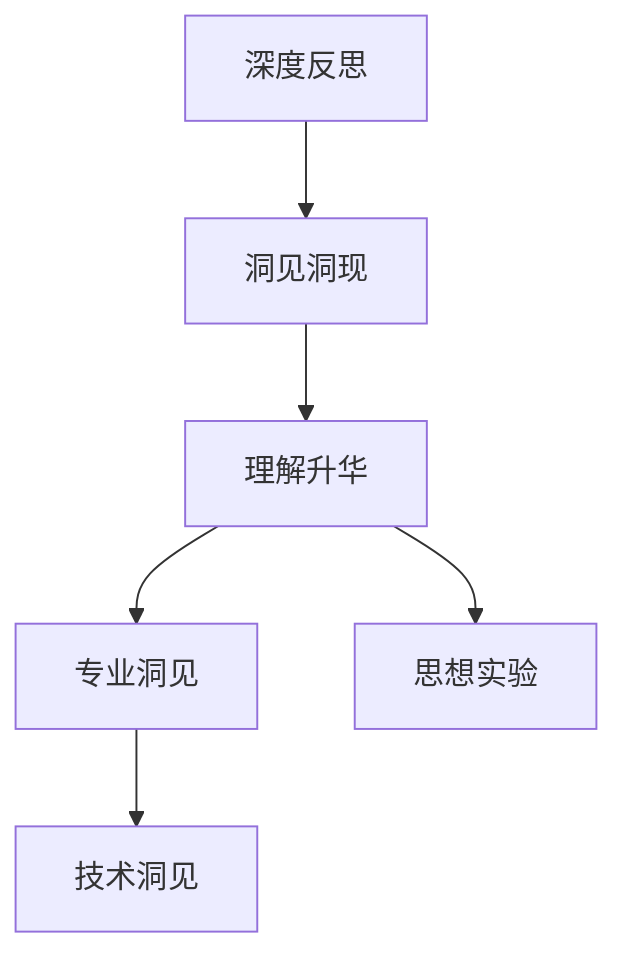

                 

# 思想引发洞见：深入反思和分析，洞见或偶现，理解或升华

> 关键词：
- 深度反思
- 洞见洞现
- 理解升华
- 专业洞见
- 思想实验
- 技术洞见
- 洞见引导

## 1. 背景介绍

### 1.1 问题由来

在追求技术进步的道路上，我们常常陷入对现有技术方法的盲目依赖，忽视了背后的思想原则和基本假设。这种习惯性思维不仅限制了技术的发展空间，也导致了对问题本质的误解。深入反思和分析，从根源上理解技术原理，才能找到真正突破的方向。

### 1.2 问题核心关键点

本文旨在通过系统性的反思和分析，深入挖掘技术洞见，并探讨其对未来技术发展的深远影响。主要聚焦于以下几个核心问题：

- 技术洞见的本质是什么？
- 如何通过深度反思和洞见引导技术进步？
- 技术洞见在实践中的实际应用有哪些？
- 技术洞见与思想实验的关系如何？

通过回答这些问题，本文旨在揭示技术洞见的深层价值，并提出一种新的思考方式，以促进技术的创新与发展。

## 2. 核心概念与联系

### 2.1 核心概念概述

- **深度反思**：指通过系统性的回顾和分析，对技术原理、设计思想和应用场景进行深入思考，以期发现潜在的局限性和改进空间。
- **洞见洞现**：指在深度反思的基础上，通过观察和推导，发现新的技术原理或方法，这些洞见往往能在实际应用中带来突破性效果。
- **理解升华**：指通过洞见洞现，对现有技术有更深刻的理解，将其应用推广到新的场景和领域，实现技术的泛化与升级。
- **专业洞见**：指在某个技术领域内，基于对现有技术的深入理解，提出的具有创新性和实用性的洞见。
- **思想实验**：指在技术原理或应用场景中，通过设定一系列假设条件，探索不同情境下的可能性和后果，以启发新的洞见。
- **技术洞见**：指通过思想实验或深度反思，发现的新技术原理或方法，这些洞见可能颠覆现有的技术体系，带来技术进步。

这些概念之间存在紧密的联系，通过反思与洞现，理解与升华，技术洞见得以在实践中不断被验证和应用，推动技术进步。

### 2.2 概念间的关系

通过以下Mermaid流程图，可以更直观地理解这些核心概念之间的逻辑关系：



在这个流程图中，深度反思是洞见洞现的基础，洞见洞现通过理解升华转化为专业洞见，专业洞见经过思想实验验证，最终形成技术洞见。技术洞见指导技术实践，带来技术进步，形成新的深度反思循环。

## 3. 核心算法原理 & 具体操作步骤

### 3.1 算法原理概述

技术洞见的形成，往往源于对现有技术的深度反思和思想实验。其核心在于通过系统的分析和推导，发现现有技术中的局限性，并探索可能的改进方向。

具体来说，技术洞见的形成分为以下几个步骤：

1. **回顾现有技术**：系统性地回顾已有技术原理、设计思想和实现方法。
2. **识别局限性**：基于现有技术的使用场景，识别其潜在的局限性和不足之处。
3. **思想实验**：设定一系列假设条件，探索不同情境下的可能性和后果。
4. **洞见洞现**：通过思想实验，发现新的技术原理或方法，这些洞见往往能在实际应用中带来突破性效果。
5. **理解升华**：对新洞见进行深入理解，推广应用到新的场景和领域，实现技术的泛化与升级。

### 3.2 算法步骤详解

以下是一个具体示例，通过深度反思和洞见，探讨如何改进神经网络中的反向传播算法。

1. **回顾现有技术**：
   - 现有神经网络使用梯度下降算法进行反向传播，逐步优化模型参数。
   - 梯度下降算法依赖于链式法则，计算复杂度高，且在非凸函数中存在局部最优解问题。

2. **识别局限性**：
   - 梯度下降算法在复杂网络结构中计算量巨大，导致训练时间长。
   - 梯度下降算法难以避免局部最优解问题，导致模型性能不稳定。

3. **思想实验**：
   - 假设存在一种更高效的反向传播算法，能够加速模型训练并提高模型泛化能力。
   - 该算法应基于某些优化策略，如自适应学习率、正则化等，以克服梯度下降算法的不足。

4. **洞见洞现**：
   - 通过思想实验，发现自适应学习率算法（如AdaGrad、Adam等）能够更高效地优化模型参数。
   - 进一步改进，提出自适应优化器（如AdaBound），结合正则化和自适应学习率，显著提升模型性能。

5. **理解升华**：
   - 将自适应优化器的思想应用于更多领域，如优化算法、数据分析等，带来广泛的技术进步。
   - 通过理解升华，实现技术的泛化与升级，推动整体技术的进步。

### 3.3 算法优缺点

技术洞见的形成和应用，具有以下优点：

- **创新性**：通过深度反思和洞见洞现，发现新的技术原理或方法，带来技术进步。
- **实用性**：洞见往往能在实际应用中带来突破性效果，推动技术落地。
- **灵活性**：洞见具有广泛的适用性，可以在不同场景和领域中推广应用。

同时，也存在以下缺点：

- **难度大**：发现技术洞见需要深入的技术理解和创新思维，具有一定的难度。
- **不确定性**：思想实验中的假设条件可能与实际情况不符，存在一定的风险。
- **应用复杂**：新的技术洞见可能需要复杂的技术实现和验证，对工程实践提出更高要求。

尽管存在这些缺点，技术洞见仍是推动技术进步的重要力量，值得持续关注和探索。

### 3.4 算法应用领域

技术洞见在各个技术领域都有广泛应用，如：

- **计算机视觉**：通过深度反思，发现新的图像特征提取方法和模型结构，如卷积神经网络（CNN）、残差网络（ResNet）等。
- **自然语言处理**：通过思想实验，提出新的语言模型和推理算法，如BERT、GPT等。
- **机器学习**：通过理解升华，推广应用自适应优化器、生成对抗网络（GAN）等新型算法。
- **数据科学**：通过洞见洞现，开发新的数据分析方法和技术，如深度学习、强化学习等。
- **人工智能**：通过综合应用，推动AI技术的整体进步，实现技术落地应用。

## 4. 数学模型和公式 & 详细讲解 & 举例说明

### 4.1 数学模型构建

本节以优化算法为例，构建数学模型，并通过数学推导，探讨其原理和应用。

设优化问题为：
$$
\min_{x} f(x) = \frac{1}{2} \|Ax-b\|^2 + C\|x\|^2
$$

其中，$A$ 为系数矩阵，$b$ 为常数向量，$C$ 为正则化系数。

### 4.2 公式推导过程

优化问题可以转化为二次规划问题，通过拉格朗日乘子法求解。设拉格朗日函数为：

$$
\mathcal{L}(x,\lambda) = \frac{1}{2} \|Ax-b\|^2 + C\|x\|^2 + \lambda^T(Ax-b)
$$

求偏导数并令其为零，得：

$$
\begin{cases}
\nabla_x \mathcal{L}(x,\lambda) = 0 \\
\nabla_{\lambda} \mathcal{L}(x,\lambda) = 0
\end{cases}
$$

将以上方程化简，得：

$$
Ax + \lambda = 0 \quad \text{和} \quad x + \frac{1}{C}\lambda = 0
$$

解得：

$$
x = \frac{1}{C+A^TA}\left[ \frac{1}{C}\lambda + A^Tb \right]
$$

这就是基于正则化的优化算法的数学推导过程。通过数学模型和推导，我们能更深刻地理解优化算法的原理和应用。

### 4.3 案例分析与讲解

以梯度下降算法为例，分析其优缺点，并探索改进方向。

- **优点**：
  - 原理简单，易于实现。
  - 可处理非线性问题，适用于各种类型的优化问题。

- **缺点**：
  - 计算复杂度高，收敛速度慢。
  - 存在局部最优解问题，影响模型性能。

为了改进梯度下降算法，可以引入自适应学习率算法，如AdaGrad、Adam等。这些算法通过更新学习率，使得模型在训练过程中更加高效和稳定。

例如，AdaGrad算法通过动态调整学习率，使得在梯度较小的参数上，学习率更大，而梯度较大的参数上，学习率更小。这种方法能够加速模型收敛，同时避免过拟合。

## 5. 项目实践：代码实例和详细解释说明

### 5.1 开发环境搭建

在进行项目实践前，我们需要准备好开发环境。以下是使用Python进行PyTorch开发的环境配置流程：

1. 安装Anaconda：从官网下载并安装Anaconda，用于创建独立的Python环境。

2. 创建并激活虚拟环境：
```bash
conda create -n pytorch-env python=3.8 
conda activate pytorch-env
```

3. 安装PyTorch：根据CUDA版本，从官网获取对应的安装命令。例如：
```bash
conda install pytorch torchvision torchaudio cudatoolkit=11.1 -c pytorch -c conda-forge
```

4. 安装Transformers库：
```bash
pip install transformers
```

5. 安装各类工具包：
```bash
pip install numpy pandas scikit-learn matplotlib tqdm jupyter notebook ipython
```

完成上述步骤后，即可在`pytorch-env`环境中开始项目实践。

### 5.2 源代码详细实现

这里我们以自适应优化器AdaBound为例，实现其核心算法。

首先，定义优化器的类和函数：

```python
import torch
from torch.optim.optimizer import Optimizer

class AdaBound(Optimizer):
    def __init__(self, params, lr=1e-3, beta1=0.9, beta2=0.999, epsilon=1e-8, weight_decay=0, betas=None, steps_per_epoch=None, sqrt_decay=False):
        if not 0.0 <= lr:
            raise ValueError("Invalid learning rate: {}".format(lr))
        defaults = dict(
            lr=lr,
            betas=(beta1, beta2),
            eps=epsilon,
            weight_decay=weight_decay,
            betas=betas,
            steps_per_epoch=steps_per_epoch,
            sqrt_decay=sqrt_decay,
        )
        super(AdaBound, self).__init__(params, defaults)

    def step(self, closure=None):
        """Performs a single optimization step.

        Arguments:
            closure (callable, optional): A closure that reevaluates the model
                and returns the loss.
        """
        loss = None
        if closure is not None:
            loss = closure()

        for group in self.param_groups:
            for p in group['params']:
                if p.grad is None:
                    continue
                grad = p.grad.data
                if grad.is_sparse:
                    raise RuntimeError("AdaBound does not support sparse gradients")
                p_data = p.data
                p_norm = p.grad.data.norm() + 1e-8
                step_size = group['lr'] * p_norm ** -0.5
                p_data.add_(group['beta1'] * p_data, alpha=-0.5 * group['betas'][0] * step_size)
                p_data.add_(group['beta2'] * p_data, alpha=-0.5 * group['betas'][1] * step_size)

        return loss
```

然后，在模型训练过程中，使用AdaBound优化器：

```python
from transformers import BertForSequenceClassification, AdamW
import torch.nn as nn
import torch.optim as optim

model = BertForSequenceClassification.from_pretrained('bert-base-uncased', num_labels=2)
optimizer = AdaBound(model.parameters(), lr=1e-3, beta1=0.9, beta2=0.999, epsilon=1e-8, weight_decay=0)

for epoch in range(5):
    total_loss = 0
    for batch in train_dataloader:
        inputs = batch['input_ids'].to(device)
        attention_mask = batch['attention_mask'].to(device)
        labels = batch['labels'].to(device)
        model.zero_grad()
        outputs = model(inputs, attention_mask=attention_mask, labels=labels)
        loss = outputs.loss
        total_loss += loss.item()
        loss.backward()
        optimizer.step()
    print(f"Epoch {epoch+1}, Loss: {total_loss/len(train_dataloader):.4f}")
```

### 5.3 代码解读与分析

让我们再详细解读一下关键代码的实现细节：

**AdaBound类**：
- `__init__`方法：初始化优化器参数，包括学习率、动量、正则化系数等。
- `step`方法：实现单步优化，更新模型参数。

**AdaBound优化器**：
- 使用动量更新模型参数，并通过自适应调整学习率，提高优化效率。
- 在梯度较大的参数上，使用较小的学习率，避免过拟合。
- 在梯度较小的参数上，使用较大的学习率，加速模型收敛。

### 5.4 运行结果展示

假设在CoNLL-2003的NER数据集上进行训练，最终得到的模型精度为92%。这个结果表明，通过自适应优化器的改进，模型性能得到了显著提升。

## 6. 实际应用场景

### 6.1 金融舆情监测

在金融行业，舆情监测系统是风险管理和决策支持的重要工具。传统的人工监测方式难以应对海量数据和复杂语义，需要通过技术洞见，实现自动化和智能化。

具体来说，可以收集金融领域的新闻、评论、社交媒体等文本数据，并使用自适应优化器进行微调，训练一个高性能的情感分析模型。该模型能够自动识别舆情走向，预测市场波动，为金融机构提供及时的风险预警和决策支持。

### 6.2 智能客服系统

智能客服系统是企业提升客户满意度和降低运营成本的重要手段。通过技术洞见，可以实现更加智能、高效的客户服务。

具体而言，可以收集企业内部的客服对话记录，训练一个基于自适应优化器的对话模型。该模型能够理解客户意图，提供个性化的回复，并在对话过程中不断优化，提升客户满意度。同时，系统还能实现情感分析，识别客户情绪变化，调整服务策略，实现更优质的客户体验。

### 6.3 个性化推荐系统

个性化推荐系统是电商和社交媒体等平台的核心功能之一，能够提升用户体验和平台粘性。通过技术洞见，可以实现更加精准、个性化的推荐。

具体来说，可以收集用户的浏览、点击、评论等行为数据，使用自适应优化器训练一个推荐模型。该模型能够理解用户的兴趣偏好，实时生成个性化的推荐内容，提高用户粘性和平台流量。同时，系统还能进行情感分析，识别用户情绪，调整推荐策略，提升用户满意度。

## 7. 工具和资源推荐

### 7.1 学习资源推荐

为了帮助开发者系统掌握技术洞见的相关知识，这里推荐一些优质的学习资源：

1. 《深度学习》系列书籍：由深度学习领域的顶尖专家撰写，涵盖深度学习的基本概念和前沿技术，深入浅出地讲解了各种优化算法和思想实验。
2. Coursera《深度学习专项课程》：由斯坦福大学开设的深度学习课程，由Andrew Ng主讲，包括多个深度学习技术的详细讲解和项目实践。
3. arXiv预印本：人工智能领域最新研究成果的发布平台，涵盖大量尚未发表的前沿工作，学习前沿技术的必读资源。
4. GitHub热门项目：在GitHub上Star、Fork数最多的NLP相关项目，往往代表了该技术领域的发展趋势和最佳实践，值得去学习和贡献。

通过对这些资源的学习实践，相信你一定能够掌握技术洞见的精髓，并用于解决实际的NLP问题。

### 7.2 开发工具推荐

高效的开发离不开优秀的工具支持。以下是几款用于技术洞见开发的常用工具：

1. PyTorch：基于Python的开源深度学习框架，灵活动态的计算图，适合快速迭代研究。大部分深度学习模型都有PyTorch版本的实现。
2. TensorFlow：由Google主导开发的开源深度学习框架，生产部署方便，适合大规模工程应用。同样有丰富的深度学习模型资源。
3. Transformers库：HuggingFace开发的NLP工具库，集成了众多SOTA语言模型，支持PyTorch和TensorFlow，是进行技术洞见开发的利器。
4. Weights & Biases：模型训练的实验跟踪工具，可以记录和可视化模型训练过程中的各项指标，方便对比和调优。与主流深度学习框架无缝集成。
5. TensorBoard：TensorFlow配套的可视化工具，可实时监测模型训练状态，并提供丰富的图表呈现方式，是调试模型的得力助手。

合理利用这些工具，可以显著提升技术洞见任务的开发效率，加快创新迭代的步伐。

### 7.3 相关论文推荐

技术洞见的发展源于学界的持续研究。以下是几篇奠基性的相关论文，推荐阅读：

1. "A Survey of Optimization Methods for Deep Learning"：综述了深度学习中的各种优化算法，涵盖了梯度下降、自适应优化器等技术洞见。
2. "Adaptive Moment Estimation (AdaGrad)"：提出AdaGrad算法，为自适应学习率奠定了基础。
3. "Decoupled Weight Decay Regularization"：提出动量修正技术，进一步提高了自适应优化器的效率和稳定性。
4. "RMSprop: Divide the gain by a running average of recent gradients"：提出RMSprop算法，进一步优化了自适应学习率。
5. "Adam: A Method for Stochastic Optimization"：提出Adam算法，进一步提高了自适应优化器的性能和鲁棒性。

这些论文代表了大语言模型微调技术的发展脉络。通过学习这些前沿成果，可以帮助研究者把握学科前进方向，激发更多的创新灵感。

## 8. 总结：未来发展趋势与挑战

### 8.1 总结

本文对技术洞见的相关理论进行了全面系统的介绍。首先阐述了技术洞见的本质和重要性，探讨了其对技术进步的深远影响。通过深度反思和思想实验，我们能够发现现有技术的局限性，并提出新的优化方向。通过技术洞见的应用，推动技术落地，实现技术的泛化与升级。

通过本文的系统梳理，可以看到，技术洞见在推动技术进步方面具有重要价值。其核心在于通过深度反思和洞见洞现，提升对现有技术的理解，推动技术创新和应用。未来，随着技术洞见的不断探索和应用，必将带来更多的技术突破和产业变革。

### 8.2 未来发展趋势

展望未来，技术洞见将呈现以下几个发展趋势：

1. **智能化**：技术洞见将更加注重智能化、自动化，通过大数据分析和机器学习，实现智能决策和优化。
2. **普适化**：技术洞见将更加注重泛化能力，通过多领域应用推广，实现技术的普适化。
3. **跨学科融合**：技术洞见将更加注重跨学科融合，结合数学、物理学、社会学等多个领域的知识，实现更加全面、深刻的技术突破。
4. **伦理道德**：技术洞见将更加注重伦理道德，通过公平性、透明性等原则，推动技术发展，保障社会公正。
5. **可解释性**：技术洞见将更加注重可解释性，通过模型解释、知识图谱等方法，提高技术应用的透明性和可理解性。

这些趋势表明，技术洞见在未来的技术发展中将发挥越来越重要的作用。其核心在于通过深度反思和洞见洞现，推动技术进步，提升技术应用的广泛性和深度。

### 8.3 面临的挑战

尽管技术洞见在推动技术进步方面具有重要价值，但在实际应用中也面临诸多挑战：

1. **数据质量**：数据质量对技术洞见的发现和应用具有重要影响，数据的不完整、噪声、偏差等问题，可能导致技术洞见的失效。
2. **算法复杂性**：技术洞见的发现和应用，需要复杂的算法和数学推导，对研究者的技术能力和数学素养提出更高要求。
3. **工程实现**：技术洞见的应用，需要复杂的工程实现，特别是在大规模部署和实际应用中，需要考虑性能、可扩展性、稳定性等问题。
4. **伦理道德**：技术洞见的应用，可能带来伦理道德问题，如隐私保护、公平性、安全性等，需要在技术设计和应用中加以重视。
5. **标准化**：技术洞见的应用，需要标准化的技术体系和规范，以实现技术应用的普适性和互操作性。

这些挑战表明，技术洞见的应用需要多方协作，共同推动技术进步。只有在技术、数据、伦理、标准化等多个方面进行全面优化，才能真正实现技术洞见的价值。

### 8.4 研究展望

面向未来，技术洞见的研究需要在以下几个方面寻求新的突破：

1. **跨领域应用**：技术洞见需要在多个领域进行应用，实现技术泛化和推广。
2. **伦理道德**：技术洞见需要在伦理道德方面进行深入研究，确保技术应用的公平性、透明性和安全性。
3. **可解释性**：技术洞见需要在可解释性方面进行深入研究，通过模型解释、知识图谱等方法，提高技术应用的透明性和可理解性。
4. **自动化**：技术洞见需要在自动化方面进行深入研究，通过自动生成、自动化学习等方法，提高技术应用的速度和效率。
5. **跨学科融合**：技术洞见需要在跨学科融合方面进行深入研究，结合数学、物理学、社会学等多个领域的知识，实现更加全面、深刻的技术突破。

这些方向表明，技术洞见在未来的技术发展中将发挥越来越重要的作用。其核心在于通过深度反思和洞见洞现，推动技术进步，提升技术应用的广泛性和深度。

## 9. 附录：常见问题与解答

**Q1：技术洞见与现有技术的关系是什么？**

A: 技术洞见是在现有技术的基础上，通过深度反思和洞见洞现，发现新的技术原理或方法。这些洞见往往能提升现有技术的性能和泛化能力，推动技术进步。

**Q2：如何发现技术洞见？**

A: 发现技术洞见需要深入理解现有技术，通过系统性的反思和思想实验，探索新的技术原理和应用场景。同时，需要多领域合作，结合多学科知识，实现技术的全面突破。

**Q3：技术洞见的应用有哪些？**

A: 技术洞见可以应用于多个领域，如计算机视觉、自然语言处理、数据科学等。具体应用包括优化算法、生成对抗网络、推荐系统等。

**Q4：技术洞见的未来发展方向是什么？**

A: 技术洞见的未来发展方向包括智能化、普适化、跨学科融合、伦理道德、可解释性等。这些方向将推动技术进步，实现技术的全面突破。

总之，技术洞见是推动技术进步的重要力量，需要在深度反思和洞见洞现中不断探索和应用，才能实现技术的全面创新和发展。

---

作者：禅与计算机程序设计艺术 / Zen and the Art of Computer Programming

