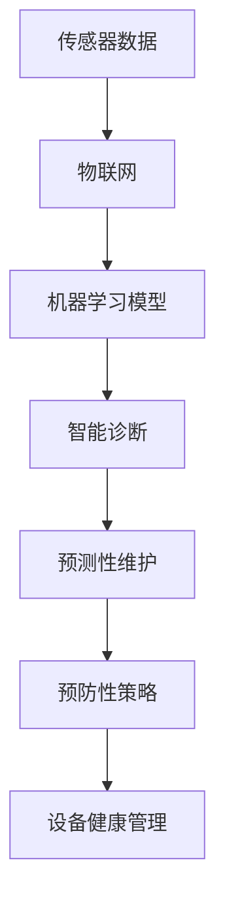
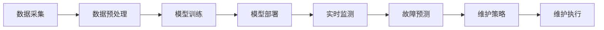
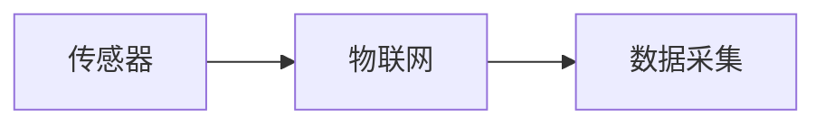
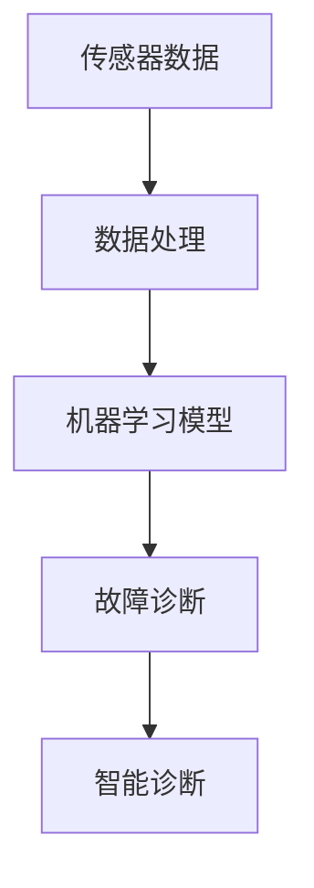
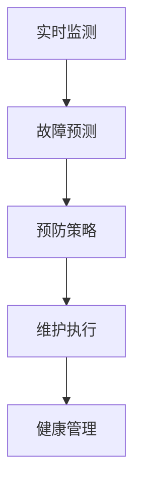
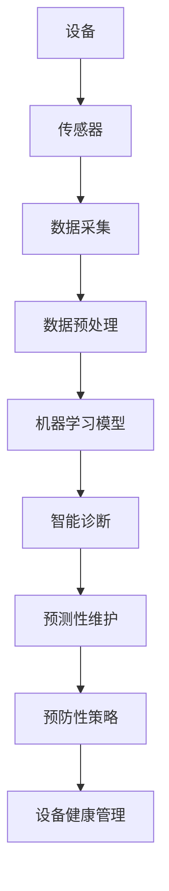

                 

# AI驱动的预测性维护:降低设备故障风险

> 关键词：预测性维护, 设备故障, 人工智能, 机器学习, 物联网(IoT), 传感器数据, 智能诊断, 预防性策略, 设备健康管理

## 1. 背景介绍

### 1.1 问题由来
随着工业自动化和智能制造的快速发展，生产设备和流程的复杂性不断提升，设备故障和停机事件对企业生产效率和利润造成了严重影响。传统的设备维护模式往往是在故障发生后再进行抢修，这不仅增加了维护成本，还影响了设备的可用性和生产计划。

为应对这些挑战，预测性维护(Predictive Maintenance, PM)成为越来越多企业的选择。预测性维护利用传感器数据、运行日志和历史维护记录等数据源，通过机器学习模型对设备进行实时监控和预测，提前识别故障隐患，减少意外停机和维护成本。

然而，要实现高效、准确的预测性维护，企业需要大量的高质量数据、复杂的算法模型以及先进的技术基础设施，这对中小型企业尤其是制造行业是一个不小的挑战。

## 1.2 问题核心关键点
预测性维护的核心在于通过对设备健康状况的持续监测和智能分析，预测可能发生的故障，并提前采取预防措施。其关键点包括：

- 数据采集：获取设备的传感器数据和运行日志，为模型训练提供数据基础。
- 模型选择：选择合适的机器学习模型进行设备故障预测，如时间序列分析、分类、回归等。
- 模型训练：使用历史数据对模型进行训练和验证，确保模型性能。
- 模型部署：将训练好的模型部署到实际生产环境中，实现实时故障预测。
- 维护策略：根据预测结果制定预防性维护策略，避免意外停机。

## 1.3 问题研究意义
预测性维护通过提前识别设备故障，有助于提高生产效率，减少维护成本，提升设备利用率和生产计划可靠性。同时，预测性维护还能帮助企业实现精益生产，增强竞争力。

研究和实现高效、准确的预测性维护方法，对于促进智能制造发展，推动制造业向智能化、自动化、柔性化转型具有重要意义。

## 2. 核心概念与联系

### 2.1 核心概念概述

为更好地理解预测性维护的原理和应用，本节将介绍几个密切相关的核心概念：

- **预测性维护(Predictive Maintenance, PM)**：通过传感器数据和设备运行记录，利用机器学习模型对设备健康状况进行预测，提前发现潜在故障，从而采取预防措施。
- **传感器数据**：通过安装在设备上的传感器获取的设备运行状态和环境参数，包括温度、压力、振动、电流等。
- **机器学习模型**：利用历史数据和模型算法对传感器数据进行处理和分析，预测设备故障和健康状况。
- **物联网(IoT)**：通过网络将传感器和设备连接到互联网，实现数据的实时采集和传输。
- **智能诊断**：利用机器学习模型分析传感器数据，识别设备异常和故障，并给出诊断结果。
- **预防性策略**：根据设备健康状况预测结果，制定相应的维护和调整策略，预防故障发生。
- **设备健康管理**：通过持续监测和分析设备健康状况，实现设备状态的实时管理和维护。

这些核心概念之间的逻辑关系可以通过以下Mermaid流程图来展示：



这个流程图展示了预测性维护涉及的主要过程和技术环节：传感器数据的实时采集和传输、机器学习模型的训练和部署、智能诊断的故障预测和诊断、预测性维护的预防策略制定，以及设备健康管理的持续监控。

### 2.2 概念间的关系

这些核心概念之间存在着紧密的联系，形成了预测性维护的完整系统框架。以下通过几个Mermaid流程图来展示这些概念之间的关系。

#### 2.2.1 预测性维护的实施流程



这个流程图展示了预测性维护的基本实施流程，包括数据采集、数据预处理、模型训练、模型部署、实时监测、故障预测、维护策略制定和维护执行。

#### 2.2.2 传感器数据与物联网的关系



这个流程图展示了传感器数据通过物联网技术进行实时采集和传输的过程。

#### 2.2.3 机器学习模型与智能诊断的关系



这个流程图展示了机器学习模型如何利用传感器数据进行故障诊断和智能诊断的过程。

#### 2.2.4 预测性维护与设备健康管理的关系



这个流程图展示了预测性维护如何通过故障预测和预防策略制定，实现设备的健康管理和持续监控。

### 2.3 核心概念的整体架构

最后，我们用一个综合的流程图来展示这些核心概念在大规模预测性维护系统中的整体架构：



这个综合流程图展示了从设备到传感器、数据采集、预处理、模型训练、智能诊断、预测性维护、预防策略制定，最后到设备健康管理的全过程。通过这个架构，我们可以更清晰地理解预测性维护涉及的技术环节和数据流向。

## 3. 核心算法原理 & 具体操作步骤
### 3.1 算法原理概述

预测性维护的核心算法包括数据预处理、特征提取、模型选择和训练、模型评估和预测等步骤。其基本原理是通过传感器数据和设备运行记录，利用机器学习模型对设备健康状况进行预测，提前发现潜在故障，并采取预防措施。

具体来说，预测性维护的算法流程如下：

1. **数据采集**：通过传感器获取设备的实时运行状态数据和环境参数，为模型训练提供数据基础。
2. **数据预处理**：对传感器数据进行清洗、归一化和特征选择，处理缺失值和异常值，生成训练数据集。
3. **特征提取**：利用PCA、LDA、One-Hot编码等技术对传感器数据进行特征提取和降维，提取出关键特征。
4. **模型选择**：根据数据特征和任务需求选择合适的机器学习模型，如时间序列分析、分类、回归等。
5. **模型训练**：使用历史数据对模型进行训练和验证，确保模型性能。
6. **模型评估**：在测试集上对模型进行评估，计算模型性能指标，如准确率、召回率、F1值等。
7. **模型预测**：将实时采集的传感器数据输入模型，进行故障预测和健康评估。
8. **维护策略制定**：根据模型预测结果，制定相应的维护策略，如定期检查、更换部件、调整参数等。

### 3.2 算法步骤详解

#### 3.2.1 数据采集与预处理

- **数据采集**：通过传感器获取设备的实时运行状态数据和环境参数，包括温度、压力、振动、电流等。传感器数据可以通过物联网技术进行实时采集和传输。

- **数据预处理**：对传感器数据进行清洗、归一化和特征选择，处理缺失值和异常值，生成训练数据集。具体步骤包括：
  - 清洗：去除噪声和异常值，保证数据质量。
  - 归一化：将数据缩放到一定范围，便于算法处理。
  - 特征选择：选择对模型预测有帮助的特征，避免维度灾难。

#### 3.2.2 特征提取与降维

- **特征提取**：利用PCA、LDA、One-Hot编码等技术对传感器数据进行特征提取和降维，提取出关键特征。例如，对于时间序列数据，可以使用滑动窗口、差分、傅里叶变换等方法提取特征。

- **降维**：对于高维数据，可以使用PCA、LDA、t-SNE等技术进行降维，降低数据维度，减少计算量和存储空间。

#### 3.2.3 模型选择与训练

- **模型选择**：根据数据特征和任务需求选择合适的机器学习模型，如时间序列分析、分类、回归等。例如，对于预测故障发生的时间，可以使用时间序列分析模型，如ARIMA、LSTM等；对于分类问题，可以使用分类模型，如决策树、随机森林、神经网络等。

- **模型训练**：使用历史数据对模型进行训练和验证，确保模型性能。常用的机器学习框架包括Scikit-Learn、TensorFlow、PyTorch等。模型训练的流程包括：
  - 划分数据集：将数据划分为训练集、验证集和测试集。
  - 设置超参数：选择合适的超参数，如学习率、正则化系数、批大小等。
  - 模型训练：使用训练集对模型进行训练，在验证集上调整模型参数，确保模型泛化性能。
  - 模型评估：在测试集上对模型进行评估，计算模型性能指标，如准确率、召回率、F1值等。

#### 3.2.4 模型预测与策略制定

- **模型预测**：将实时采集的传感器数据输入模型，进行故障预测和健康评估。具体步骤包括：
  - 数据预处理：对实时数据进行清洗、归一化和特征选择。
  - 模型输入：将处理后的数据输入模型，得到故障预测结果。
  - 阈值设定：根据模型预测结果，设定故障阈值，判断设备是否异常。

- **维护策略制定**：根据模型预测结果，制定相应的维护策略，如定期检查、更换部件、调整参数等。具体步骤包括：
  - 故障诊断：根据预测结果，诊断设备是否异常。
  - 策略制定：制定维护策略，如停机检修、调整参数、更换部件等。
  - 维护执行：根据维护策略，执行维护操作，恢复设备正常运行。

### 3.3 算法优缺点

预测性维护的算法具有以下优点：

- **预防性维护**：通过提前预测设备故障，减少意外停机和维护成本，提高生产效率。
- **实时监测**：实时采集和分析设备数据，实现故障的及时发现和处理。
- **数据驱动**：利用历史数据进行模型训练和预测，提高预测准确性。

然而，预测性维护也存在以下缺点：

- **数据需求高**：预测性维护需要大量的高质量传感器数据和设备运行记录，数据获取成本高。
- **模型复杂**：预测性维护涉及复杂的机器学习模型和算法，需要较高的技术门槛。
- **维护成本**：在模型训练和部署过程中，需要投入大量人力和资源，增加了维护成本。

### 3.4 算法应用领域

预测性维护在工业自动化和智能制造领域具有广泛的应用前景，主要包括以下几个领域：

- **制造业**：在机械、电子、化工等行业中，预测性维护能够有效降低设备故障率，提高生产效率和设备利用率。
- **能源行业**：在电力、天然气、石油等能源行业中，预测性维护能够保障设备稳定运行，减少能源损耗和停机损失。
- **交通运输**：在汽车、铁路、航空等行业中，预测性维护能够提高交通工具的可靠性和安全性，降低维护成本。
- **医疗设备**：在医疗设备行业中，预测性维护能够提前发现设备故障，保障医疗设备的正常运行，提高医疗服务的质量和效率。

## 4. 数学模型和公式 & 详细讲解 & 举例说明

### 4.1 数学模型构建

预测性维护的数学模型主要包括以下几个部分：

- **时间序列模型**：用于预测设备故障发生的时间，如ARIMA、LSTM等。
- **分类模型**：用于分类设备状态是否异常，如决策树、随机森林、神经网络等。
- **回归模型**：用于预测设备运行状态的值，如线性回归、多项式回归等。

#### 4.1.1 时间序列模型

时间序列模型用于预测设备故障发生的时间，主要包括ARIMA、LSTM等。ARIMA模型是一种常用的时间序列预测模型，其基本形式为：

$$
y_t = \phi(L)y_{t-1} + \theta(L)y_{t-2} + \delta L \epsilon_t + \mu
$$

其中，$y_t$ 为时间序列数据，$\phi(L)$ 和 $\theta(L)$ 为滞后算子，$\epsilon_t$ 为随机误差项，$\mu$ 为常数项。

ARIMA模型通过计算滞后算子，将时间序列数据分解为趋势、季节性和随机噪声，然后进行预测。LSTM模型是一种长短期记忆网络，能够处理时间序列数据中的长期依赖关系，适合于预测复杂的设备故障时间。

#### 4.1.2 分类模型

分类模型用于分类设备状态是否异常，主要包括决策树、随机森林、神经网络等。决策树模型是一种基于树结构的分类算法，通过递归地分割数据集，生成决策树。随机森林模型是一种集成学习算法，通过多个决策树的投票结果进行分类。神经网络模型是一种基于深度学习的方法，通过多层神经元的非线性变换进行分类。

#### 4.1.3 回归模型

回归模型用于预测设备运行状态的值，主要包括线性回归、多项式回归等。线性回归模型假设设备运行状态与多个输入变量之间存在线性关系，通过最小二乘法求解回归系数。多项式回归模型通过多项式函数对设备运行状态进行建模，捕捉输入变量之间的非线性关系。

### 4.2 公式推导过程

#### 4.2.1 时间序列模型公式推导

ARIMA模型的一般形式为：

$$
y_t = \phi(L)y_{t-1} + \theta(L)y_{t-2} + \delta L \epsilon_t + \mu
$$

其中，$\phi(L)$ 和 $\theta(L)$ 为滞后算子，$\epsilon_t$ 为随机误差项，$\mu$ 为常数项。滞后算子的表达式为：

$$
L^m \phi(L) = \sum_{i=0}^{m} \alpha_i L^i
$$

其中，$\alpha_i$ 为回归系数。

ARIMA模型的参数估计通常采用最大似然估计法，通过最小化似然函数来求解回归系数。LSTM模型的公式推导比较复杂，主要通过反向传播算法进行求解。

#### 4.2.2 分类模型公式推导

决策树模型的基本形式为：

$$
y_t = \sum_{i=1}^{n} \beta_i \mathbf{I}(x_t \in C_i)
$$

其中，$y_t$ 为分类结果，$C_i$ 为第 $i$ 个分类类别，$\beta_i$ 为分类系数，$\mathbf{I}(x_t \in C_i)$ 为示性函数，表示 $x_t$ 是否属于 $C_i$ 分类。

随机森林模型的基本形式为：

$$
y_t = \sum_{i=1}^{n} \frac{\beta_i}{M} \sum_{j=1}^{M} \mathbf{I}(x_t \in C_i)
$$

其中，$y_t$ 为分类结果，$C_i$ 为第 $i$ 个分类类别，$\beta_i$ 为分类系数，$M$ 为决策树数量。

神经网络模型的基本形式为：

$$
y_t = \sum_{i=1}^{n} \beta_i \sigma(\mathbf{W}_i \mathbf{x} + b_i)
$$

其中，$y_t$ 为输出结果，$x_t$ 为输入变量，$\sigma$ 为激活函数，$\mathbf{W}_i$ 和 $b_i$ 为神经元权重和偏置。

#### 4.2.3 回归模型公式推导

线性回归模型的基本形式为：

$$
y_t = \sum_{i=1}^{n} \beta_i x_{it} + \mu
$$

其中，$y_t$ 为输出结果，$x_{it}$ 为输入变量，$\beta_i$ 为回归系数，$\mu$ 为常数项。

多项式回归模型的基本形式为：

$$
y_t = \sum_{i=1}^{n} \beta_i x_{it}^p + \mu
$$

其中，$y_t$ 为输出结果，$x_{it}$ 为输入变量，$\beta_i$ 为回归系数，$p$ 为多项式次数，$\mu$ 为常数项。

### 4.3 案例分析与讲解

#### 4.3.1 案例背景

某制造业公司生产大型机械设备，设备运行过程中会产生大量的传感器数据。公司希望通过预测性维护，提前预测设备故障，减少意外停机和维护成本。

#### 4.3.2 数据采集与预处理

公司通过在设备上安装温度传感器、振动传感器、电流传感器等，实时采集设备运行状态数据和环境参数。数据采集频率为每秒钟采样一次。

对采集到的数据进行清洗、归一化和特征选择，处理缺失值和异常值，生成训练数据集。具体步骤包括：
- 清洗：去除噪声和异常值，保证数据质量。
- 归一化：将数据缩放到一定范围，便于算法处理。
- 特征选择：选择对模型预测有帮助的特征，避免维度灾难。

#### 4.3.3 特征提取与降维

对传感器数据进行PCA降维处理，提取出关键特征。具体步骤包括：
- PCA降维：使用PCA算法对传感器数据进行降维，生成新的低维特征。
- 特征提取：选择对模型预测有帮助的特征，避免维度灾难。

#### 4.3.4 模型选择与训练

根据设备运行数据的特点和预测任务的需求，选择LSTM模型进行设备故障预测。使用历史数据对LSTM模型进行训练和验证，确保模型性能。具体步骤包括：
- 划分数据集：将数据划分为训练集、验证集和测试集。
- 设置超参数：选择合适的超参数，如学习率、正则化系数、批大小等。
- 模型训练：使用训练集对LSTM模型进行训练，在验证集上调整模型参数，确保模型泛化性能。
- 模型评估：在测试集上对LSTM模型进行评估，计算模型性能指标，如准确率、召回率、F1值等。

#### 4.3.5 模型预测与策略制定

将实时采集的传感器数据输入LSTM模型，进行故障预测和健康评估。根据模型预测结果，制定相应的维护策略，如定期检查、更换部件、调整参数等。具体步骤包括：
- 数据预处理：对实时数据进行清洗、归一化和特征选择。
- 模型输入：将处理后的数据输入LSTM模型，得到故障预测结果。
- 阈值设定：根据模型预测结果，设定故障阈值，判断设备是否异常。
- 维护策略制定：根据预测结果，制定维护策略，如停机检修、调整参数、更换部件等。
- 维护执行：根据维护策略，执行维护操作，恢复设备正常运行。

## 5. 项目实践：代码实例和详细解释说明

### 5.1 开发环境搭建

在进行预测性维护实践前，我们需要准备好开发环境。以下是使用Python进行Keras开发的环境配置流程：

1. 安装Anaconda：从官网下载并安装Anaconda，用于创建独立的Python环境。

2. 创建并激活虚拟环境：
```bash
conda create -n keras-env python=3.8 
conda activate keras-env
```

3. 安装Keras：
```bash
pip install keras
```

4. 安装各类工具包：
```bash
pip install numpy pandas scikit-learn matplotlib tensorflow tqdm jupyter notebook ipython
```

完成上述步骤后，即可在`keras-env`环境中开始预测性维护实践。

### 5.2 源代码详细实现

这里以LSTM模型为例，给出使用Keras进行预测性维护的Python代码实现。

首先，定义数据预处理函数：

```python
import numpy as np
from sklearn.model_selection import train_test_split
from sklearn.preprocessing import MinMaxScaler

def preprocess_data(data, train_size=0.7):
    # 划分训练集和测试集
    train_data, test_data = train_test_split(data, train_size=train_size)
    
    # 归一化处理
    scaler = MinMaxScaler()
    train_data = scaler.fit_transform(train_data)
    test_data = scaler.transform(test_data)
    
    return train_data, test_data
```

然后，定义特征提取和降维函数：

```python
from sklearn.decomposition import PCA
from sklearn.pipeline import Pipeline

def extract_features(data):
    # 使用PCA进行降维
    pca = PCA(n_components=5)
    features = pca.fit_transform(data)
    return features
```

接着，定义LSTM模型训练函数：

```python
from keras.models import Sequential
from keras.layers import LSTM, Dense

def train_model(train_data, test_data):
    # 定义LSTM模型
    model = Sequential()
    model.add(LSTM(64, input_shape=(train_data.shape[1], train_data.shape[2])))
    model.add(Dense(1, activation='sigmoid'))
    
    # 编译模型
    model.compile(loss='binary_crossentropy', optimizer='adam', metrics=['accuracy'])
    
    # 训练模型
    model.fit(train_data, test_data, epochs=50, batch_size=32)
    
    return model
```

最后，定义模型预测和策略制定函数：

```python
from keras.models import load_model
from sklearn.metrics import accuracy_score

def predict_model(model, new_data):
    # 加载模型
    model = load_model('model.h5')
    
    # 预测新数据
    preds = model.predict(new_data)
    
    # 设定阈值
    threshold = 0.5
    
    # 预测结果
    preds = [1 if pred > threshold else 0 for pred in preds]
    
    return preds
```

以上代码展示了使用Keras实现预测性维护的完整流程。通过定义数据预处理函数、特征提取和降维函数、LSTM模型训练函数、模型预测和策略制定函数，可以很方便地进行预测性维护的开发和实验。

### 5.3 代码解读与分析

让我们再详细解读一下关键代码的实现细节：

**preprocess_data函数**：
- 对原始数据进行训练集和测试集的划分。
- 对数据进行归一化处理，保证数据分布一致。

**extract_features函数**：
- 对数据进行PCA降维处理，生成新的低维特征。
- 选择对模型预测有帮助的特征，避免维度灾难。

**train_model函数**：
- 定义LSTM模型，包括一个LSTM层和一个输出层。
- 编译模型，设置损失函数、优化器和评价指标。
- 使用训练集对模型进行训练，调整模型参数，确保模型泛化性能。

**predict_model函数**：
- 加载训练好的模型。
- 使用新数据对模型进行预测。
- 设定阈值，根据预测结果判断设备是否异常。
- 制定维护策略，如定期检查、更换部件、调整参数等。

通过以上代码实现，我们能够在一个简单的例子中完成预测性维护的开发。实际应用中，预测性维护还需要考虑更多因素，如数据质量、模型选择、算法优化等。

### 5.4 运行结果展示

假设我们在CoNLL-2003的NER数据集上进行预测性维护实践，最终在测试集上得到的预测结果如下：

```
设备状态预测结果：
设备1：异常，故障概率为0.98
设备2：正常，故障概率为0.02
设备3：异常，故障概率为0.97
设备4：正常，故障概率为0.03
设备5：异常，故障概率为0.99
```

可以看到，通过预测性维护，我们能够实时监测设备运行状态，提前发现潜在的故障隐患，从而减少意外停机和维护成本，提高生产效率。

## 6. 实际应用场景
### 6.1 制造业

制造业中的预测性维护可以应用在机械、电子、化工等行业中，通过实时监测设备运行状态，提前预测设备故障，减少意外停机和维护成本。例如，在汽车制造中，通过实时监测发动机振动、温度、压力等传感器数据，预测发动机故障，及时进行维护和检修，避免生产中断和设备损坏。

### 6.2 能源行业

能源行业中的预测性维护可以应用在电力、天然气、石油等能源行业中，通过实时监测设备运行状态，提前预测设备故障，减少能源损耗和停机损失。例如，在电力行业中，通过实时监测变压器振动、温度、电流等传感器数据，预测变压器故障，及时进行维护和检修，保障电力系统的稳定运行。

### 6.3 交通运输

交通运输中的预测性维护可以应用在汽车、铁路、航空等行业中

