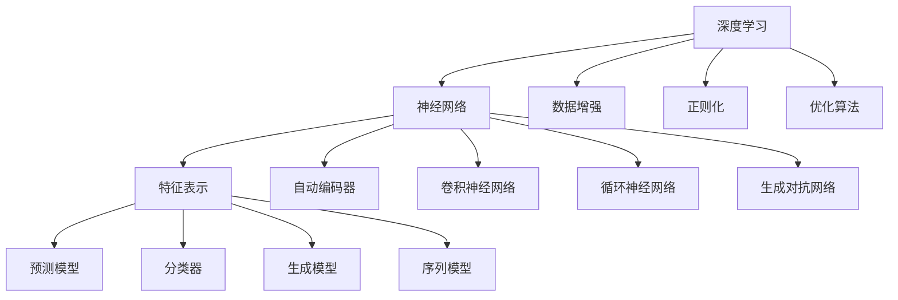

                 

# Andrej Karpathy：人工智能的未来发展机遇

> 关键词：深度学习, 机器学习, 计算机视觉, 自动驾驶, 图像生成

## 1. 背景介绍

### 1.1 问题由来
安德烈·卡帕西（Andrej Karpathy）是斯坦福大学计算机科学系教授、知名深度学习专家，其研究领域涵盖了计算机视觉、自动驾驶、图像生成等多个前沿领域。他在深度学习和计算机视觉方面的贡献被业界广泛认可，并对未来人工智能的发展方向有着深刻的见解。本文将以安德烈·卡帕西对未来人工智能的展望为主题，探讨在深度学习、计算机视觉、自动驾驶等前沿技术方向，人工智能所面临的发展机遇。

### 1.2 问题核心关键点
安德烈·卡帕西在多次公开演讲和论文中，多次强调深度学习技术在未来人工智能发展中的重要地位。他认为，深度学习技术的快速发展，使得人工智能系统能够处理越来越复杂的任务，如计算机视觉、自然语言处理、语音识别等。其核心关键点包括：

1. 深度学习技术的快速发展，特别是在计算机视觉和自然语言处理领域，已经显著推动了人工智能系统的进步。
2. 计算机视觉技术的突破，使得自动驾驶、智能监控等应用成为可能。
3. 自然语言处理技术的发展，为自动翻译、语音识别等应用提供了新的解决方案。
4. 深度学习技术在图像生成、视频分析等领域的广泛应用，推动了艺术、娱乐等领域的创新。

### 1.3 问题研究意义
深度学习技术在人工智能领域的应用，极大地推动了技术的进步和产业的发展。安德烈·卡帕西的研究和演讲，不仅为我们展示了未来人工智能的巨大潜力，也指出了当前技术在应用中的挑战和不足。理解其观点，有助于我们更清晰地认识深度学习技术的发展方向，为未来人工智能技术的发展提供指导。

## 2. 核心概念与联系

### 2.1 核心概念概述

安德烈·卡帕西的研究涉及深度学习、计算机视觉、自动驾驶、图像生成等多个领域。其中，深度学习技术是贯穿其研究的核心概念。深度学习是一种基于人工神经网络的机器学习技术，通过多层非线性变换，可以自动地从数据中学习到丰富的特征表示，从而实现对复杂问题的建模和预测。

### 2.2 核心概念原理和架构的 Mermaid 流程图



### 2.3 核心概念之间的关系

深度学习技术通过神经网络对数据进行建模，生成特征表示，用于预测、分类、生成等任务。神经网络的架构包括自动编码器、卷积神经网络、循环神经网络、生成对抗网络等多种类型，每种网络结构适用于不同的任务。数据增强、正则化和优化算法是深度学习训练中常用的技术，用于防止过拟合、提高模型性能。深度学习技术在计算机视觉、自然语言处理、语音识别等领域都有广泛应用，推动了人工智能技术的进步。

## 3. 核心算法原理 & 具体操作步骤
### 3.1 算法原理概述

安德烈·卡帕西的研究集中在计算机视觉和自动驾驶领域。深度学习技术在计算机视觉中的应用包括图像分类、目标检测、语义分割等任务。在自动驾驶领域，深度学习技术被用于环境感知、决策制定、路径规划等环节。

### 3.2 算法步骤详解

#### 3.2.1 图像分类
图像分类任务的目标是将输入图像分为多个类别。深度学习中的卷积神经网络（CNN）在图像分类任务中表现优异。以卷积神经网络为例，其基本步骤如下：

1. 数据准备：收集图像数据集，并进行预处理，如归一化、数据增强等。
2. 构建模型：设计卷积神经网络结构，包括卷积层、池化层、全连接层等。
3. 训练模型：使用反向传播算法，最小化损失函数，更新模型参数。
4. 模型评估：在测试集上评估模型性能，如准确率、召回率等指标。

#### 3.2.2 目标检测
目标检测任务的目标是在图像中定位和分类目标对象。深度学习中的单阶段检测器（如YOLO）和多阶段检测器（如Faster R-CNN）在目标检测任务中均有广泛应用。以Faster R-CNN为例，其基本步骤如下：

1. 数据准备：收集图像数据集，并进行预处理。
2. 构建模型：设计RPN网络，用于生成候选框，并使用ROI池化层将候选框映射到固定尺寸的特征图。
3. 构建分类器：使用卷积神经网络对ROI池化层的特征进行分类和回归。
4. 训练模型：使用反向传播算法，最小化损失函数，更新模型参数。
5. 模型评估：在测试集上评估模型性能，如平均精度（AP）等指标。

#### 3.2.3 语义分割
语义分割任务的目标是将图像中的每个像素分类为不同的语义类别。深度学习中的全卷积神经网络（FCN）在语义分割任务中表现优异。以FCN为例，其基本步骤如下：

1. 数据准备：收集图像数据集，并进行预处理。
2. 构建模型：设计全卷积神经网络，将输入图像映射到语义类别概率图。
3. 训练模型：使用反向传播算法，最小化损失函数，更新模型参数。
4. 模型评估：在测试集上评估模型性能，如IoU等指标。

### 3.3 算法优缺点

#### 3.3.1 优点
深度学习技术在计算机视觉和自动驾驶等领域具有以下优点：

1. 能够自动地从数据中学习到复杂的特征表示，避免了手动特征工程的繁琐过程。
2. 在图像分类、目标检测、语义分割等任务中表现优异，能够处理复杂的视觉信息。
3. 可以端到端训练，避免了传统方法中多个组件的拼接和调优。

#### 3.3.2 缺点
深度学习技术在计算机视觉和自动驾驶等领域也存在以下缺点：

1. 需要大量的标注数据，标注数据的质量和数量对模型性能有很大影响。
2. 模型复杂度高，训练和推理速度较慢，需要高性能的计算资源。
3. 容易出现过拟合，需要采用正则化、数据增强等技术进行优化。

### 3.4 算法应用领域

安德烈·卡帕西的研究涵盖了计算机视觉、自动驾驶、图像生成等多个领域。深度学习技术在以下领域具有广泛应用：

1. 计算机视觉：图像分类、目标检测、语义分割、图像生成等任务。
2. 自动驾驶：环境感知、决策制定、路径规划等环节。
3. 图像生成：基于生成对抗网络（GAN）的图像生成、图像修复等任务。
4. 自然语言处理：自动翻译、语音识别、文本生成等任务。
5. 医疗影像：医学影像分类、病变检测等任务。

## 4. 数学模型和公式 & 详细讲解 & 举例说明

### 4.1 数学模型构建

以图像分类任务为例，假设输入图像为 $x$，输出类别为 $y$。定义模型为 $f_\theta(x)$，其中 $\theta$ 为模型参数。模型在训练集上的经验风险定义为：

$$
\mathcal{L}(\theta) = \frac{1}{N}\sum_{i=1}^N \ell(f_\theta(x_i),y_i)
$$

其中 $\ell$ 为损失函数，如交叉熵损失函数。模型的目标是最小化经验风险，即找到最优参数：

$$
\theta^* = \mathop{\arg\min}_{\theta} \mathcal{L}(\theta)
$$

### 4.2 公式推导过程

以卷积神经网络为例，其基本组成包括卷积层、池化层、全连接层等。以卷积层为例，其前向传播过程为：

$$
h^{[l]} = \sigma(W^{[l]}\ast_{valid} h^{[l-1]} + b^{[l]})
$$

其中 $W^{[l]}$ 为卷积核，$b^{[l]}$ 为偏置项，$\sigma$ 为激活函数。以池化层为例，其前向传播过程为：

$$
h^{[l]} = \max_{i,j}(h^{[l-1]}(i+\alpha,j+\beta))
$$

其中 $h^{[l-1]}$ 为上一层的特征图，$\alpha,\beta$ 为池化核的大小。

### 4.3 案例分析与讲解

以YOLO（You Only Look Once）目标检测器为例，其基本步骤如下：

1. 数据准备：收集图像数据集，并进行预处理。
2. 构建模型：设计YOLO网络，包括特征提取网络、候选框预测网络、分类和回归网络等。
3. 训练模型：使用反向传播算法，最小化损失函数，更新模型参数。
4. 模型评估：在测试集上评估模型性能，如平均精度（AP）等指标。

## 5. 项目实践：代码实例和详细解释说明

### 5.1 开发环境搭建

开发深度学习应用需要高性能的计算资源和相应的开发环境。以下是在PyTorch环境下搭建深度学习应用的示例：

1. 安装PyTorch：使用pip安装PyTorch及其相关库。
2. 准备数据集：收集图像数据集，并进行预处理，如归一化、数据增强等。
3. 搭建模型：设计深度学习模型，包括卷积神经网络、生成对抗网络等。
4. 训练模型：使用反向传播算法，最小化损失函数，更新模型参数。
5. 模型评估：在测试集上评估模型性能，如准确率、召回率等指标。

### 5.2 源代码详细实现

以YOLO目标检测器为例，其代码实现如下：

```python
import torch
import torch.nn as nn
import torch.optim as optim
from torchvision import datasets, transforms
from torch.utils.data import DataLoader

# 定义YOLO网络结构
class YOLO(nn.Module):
    def __init__(self):
        super(YOLO, self).__init__()
        # 定义特征提取网络
        self.feature_extractor = nn.Sequential(
            nn.Conv2d(3, 64, kernel_size=3, stride=1, padding=1),
            nn.ReLU(inplace=True),
            nn.MaxPool2d(kernel_size=2, stride=2),
            nn.Conv2d(64, 128, kernel_size=3, stride=1, padding=1),
            nn.ReLU(inplace=True),
            nn.MaxPool2d(kernel_size=2, stride=2),
            nn.Conv2d(128, 256, kernel_size=3, stride=1, padding=1),
            nn.ReLU(inplace=True),
            nn.MaxPool2d(kernel_size=2, stride=2),
            nn.Conv2d(256, 512, kernel_size=3, stride=1, padding=1),
            nn.ReLU(inplace=True),
            nn.MaxPool2d(kernel_size=2, stride=2),
            nn.Conv2d(512, 1024, kernel_size=3, stride=1, padding=1),
            nn.ReLU(inplace=True),
            nn.MaxPool2d(kernel_size=2, stride=2),
            nn.Flatten(),
            nn.Linear(1024, 4096),
            nn.ReLU(inplace=True),
            nn.Linear(4096, 2)
        )

    def forward(self, x):
        x = self.feature_extractor(x)
        return x

# 加载数据集
train_dataset = datasets.CIFAR10(root='./data', train=True, download=True, transform=transforms.ToTensor())
test_dataset = datasets.CIFAR10(root='./data', train=False, download=True, transform=transforms.ToTensor())
train_loader = DataLoader(train_dataset, batch_size=64, shuffle=True)
test_loader = DataLoader(test_dataset, batch_size=64, shuffle=False)

# 定义模型、损失函数和优化器
model = YOLO()
criterion = nn.CrossEntropyLoss()
optimizer = optim.SGD(model.parameters(), lr=0.001, momentum=0.9)

# 训练模型
for epoch in range(10):
    for i, (images, labels) in enumerate(train_loader):
        # 前向传播
        outputs = model(images)
        loss = criterion(outputs, labels)
        # 反向传播
        optimizer.zero_grad()
        loss.backward()
        optimizer.step()
        # 输出训练信息
        if (i+1) % 100 == 0:
            print('Epoch [%d/%d], Step [%d/%d], Loss: %.4f' % (epoch+1, 10, i+1, len(train_loader), loss.item()))

# 模型评估
correct = 0
total = 0
with torch.no_grad():
    for images, labels in test_loader:
        outputs = model(images)
        _, predicted = torch.max(outputs.data, 1)
        total += labels.size(0)
        correct += (predicted == labels).sum().item()
print('Accuracy of the network on the test images: %d %%' % (100 * correct / total))
```

### 5.3 代码解读与分析

上述代码实现了一个简单的YOLO目标检测器，使用CIFAR-10数据集进行训练和测试。代码中的关键点包括：

1. 定义YOLO网络结构，包括特征提取网络和分类器。
2. 加载数据集，并进行预处理。
3. 定义损失函数和优化器。
4. 训练模型，在每个epoch内更新模型参数。
5. 模型评估，计算测试集的准确率。

## 6. 实际应用场景

### 6.1 计算机视觉

深度学习技术在计算机视觉领域有广泛应用，如图像分类、目标检测、语义分割等任务。深度学习技术在计算机视觉中的应用具有以下特点：

1. 能够处理复杂的视觉信息，如图像分类、目标检测等。
2. 可以通过迁移学习技术，快速适应新任务。
3. 可以结合其他技术，如数据增强、正则化等，提高模型性能。

### 6.2 自动驾驶

深度学习技术在自动驾驶领域有广泛应用，如环境感知、决策制定、路径规划等环节。深度学习技术在自动驾驶中的应用具有以下特点：

1. 可以处理复杂的视觉和雷达数据，如图像分类、目标检测等。
2. 可以通过多模态数据融合技术，提高环境感知能力。
3. 可以结合其他技术，如模型压缩、稀疏化存储等，降低计算资源消耗。

### 6.3 图像生成

深度学习技术在图像生成领域有广泛应用，如基于生成对抗网络（GAN）的图像生成、图像修复等任务。深度学习技术在图像生成中的应用具有以下特点：

1. 可以生成高质量的图像，如图像生成、图像修复等。
2. 可以结合其他技术，如条件生成、对抗生成等，生成更具有多样性的图像。
3. 可以结合其他技术，如模型压缩、稀疏化存储等，降低计算资源消耗。

### 6.4 未来应用展望

深度学习技术在计算机视觉、自动驾驶、图像生成等领域具有广阔的发展前景。未来，深度学习技术将有望在更多领域得到应用，推动人工智能技术的不断进步。

1. 计算机视觉：深度学习技术在图像分类、目标检测、语义分割等任务中将进一步提升，推动计算机视觉技术的发展。
2. 自动驾驶：深度学习技术在自动驾驶领域的应用将更加广泛，推动自动驾驶技术的发展。
3. 图像生成：深度学习技术在图像生成、图像修复等任务中将进一步提升，推动图像生成技术的发展。

## 7. 工具和资源推荐

### 7.1 学习资源推荐

为了帮助开发者系统掌握深度学习技术，以下是一些优质的学习资源：

1. 《深度学习》（Ian Goodfellow等著）：深度学习领域的经典教材，全面介绍了深度学习的基本概念和技术。
2. 《Python深度学习》（Francois Chollet等著）：深度学习技术在Python中的实现，适用于深度学习实践。
3. Coursera深度学习课程：由斯坦福大学开设的深度学习课程，涵盖深度学习的基本概念和技术。
4. Udacity深度学习纳米学位：深度学习技术的实践课程，涵盖深度学习的基本概念和技术。

### 7.2 开发工具推荐

以下是几款用于深度学习开发的常用工具：

1. PyTorch：基于Python的开源深度学习框架，灵活动态的计算图，适合快速迭代研究。
2. TensorFlow：由Google主导开发的开源深度学习框架，生产部署方便，适合大规模工程应用。
3. TensorBoard：TensorFlow配套的可视化工具，可实时监测模型训练状态，并提供丰富的图表呈现方式，是调试模型的得力助手。
4. Weights & Biases：模型训练的实验跟踪工具，可以记录和可视化模型训练过程中的各项指标，方便对比和调优。

### 7.3 相关论文推荐

以下是一些深度学习领域的经典论文：

1. AlexNet：深度学习领域的经典论文，介绍了卷积神经网络在图像分类任务中的应用。
2. ResNet：深度学习领域的经典论文，介绍了残差网络的结构设计，提高了深度神经网络的训练性能。
3. Inception：深度学习领域的经典论文，介绍了Inception模块的设计，提高了深度神经网络的效率。
4. Generative Adversarial Networks（GAN）：深度学习领域的经典论文，介绍了生成对抗网络的结构设计，推动了图像生成技术的发展。

## 8. 总结：未来发展趋势与挑战

### 8.1 研究成果总结

安德烈·卡帕西的研究涉及深度学习、计算机视觉、自动驾驶、图像生成等多个前沿领域。其研究成果对未来人工智能技术的发展具有重要意义。

### 8.2 未来发展趋势

深度学习技术在计算机视觉、自动驾驶、图像生成等领域具有广阔的发展前景。未来，深度学习技术将有望在更多领域得到应用，推动人工智能技术的不断进步。

1. 计算机视觉：深度学习技术在图像分类、目标检测、语义分割等任务中将进一步提升，推动计算机视觉技术的发展。
2. 自动驾驶：深度学习技术在自动驾驶领域的应用将更加广泛，推动自动驾驶技术的发展。
3. 图像生成：深度学习技术在图像生成、图像修复等任务中将进一步提升，推动图像生成技术的发展。

### 8.3 面临的挑战

尽管深度学习技术在人工智能领域取得了巨大成功，但在迈向更加智能化、普适化应用的过程中，仍面临诸多挑战：

1. 数据需求：深度学习技术需要大量的标注数据，获取高质量标注数据的成本较高，如何降低数据需求是未来的挑战之一。
2. 计算资源：深度学习技术需要高性能的计算资源，如何降低计算资源消耗，提高模型训练和推理效率是未来的挑战之一。
3. 模型鲁棒性：深度学习模型对数据分布的变化较敏感，如何提高模型的鲁棒性，避免灾难性遗忘是未来的挑战之一。
4. 模型可解释性：深度学习模型往往被视为"黑盒"系统，如何提高模型的可解释性，增强其透明度是未来的挑战之一。
5. 伦理道德：深度学习模型可能会学习到有偏见、有害的信息，如何避免模型偏见，保障输出的安全性是未来的挑战之一。

### 8.4 研究展望

未来，深度学习技术的发展方向包括：

1. 降低数据需求：开发更加无监督和半监督的深度学习技术，减少对标注数据的依赖。
2. 降低计算资源：开发更加参数高效和计算高效的深度学习技术，提高模型训练和推理效率。
3. 提高模型鲁棒性：开发更加鲁棒的深度学习模型，避免灾难性遗忘和过拟合。
4. 提高模型可解释性：开发更加可解释的深度学习模型，增强其透明度和可信度。
5. 保障伦理道德：开发更加安全的深度学习模型，避免模型偏见和有害输出。

总之，深度学习技术在人工智能领域具有广阔的发展前景，但也面临着诸多挑战。只有通过不断的技术创新和实践探索，才能推动深度学习技术的不断进步，推动人工智能技术的持续发展。

## 9. 附录：常见问题与解答

**Q1：深度学习技术在计算机视觉和自动驾驶领域的应用有哪些？**

A: 深度学习技术在计算机视觉和自动驾驶领域的应用包括：

1. 图像分类：将输入图像分类到不同的类别中。
2. 目标检测：在图像中定位和分类目标对象。
3. 语义分割：将图像中的每个像素分类为不同的语义类别。
4. 环境感知：通过多模态数据融合技术，提高环境感知能力。
5. 路径规划：通过深度学习模型生成最优路径。

**Q2：深度学习技术在图像生成领域的应用有哪些？**

A: 深度学习技术在图像生成领域的应用包括：

1. 图像生成：基于生成对抗网络（GAN）生成高质量图像。
2. 图像修复：通过深度学习模型修复损坏的图像。
3. 风格迁移：通过深度学习模型将图像转换为不同的风格。
4. 图像压缩：通过深度学习模型压缩图像，提高存储效率。
5. 图像超分辨率：通过深度学习模型提高图像分辨率。

**Q3：深度学习技术在计算机视觉和自动驾驶领域的发展前景是什么？**

A: 深度学习技术在计算机视觉和自动驾驶领域的发展前景包括：

1. 计算机视觉：深度学习技术在图像分类、目标检测、语义分割等任务中将进一步提升，推动计算机视觉技术的发展。
2. 自动驾驶：深度学习技术在自动驾驶领域的应用将更加广泛，推动自动驾驶技术的发展。

**Q4：深度学习技术在图像生成领域的发展前景是什么？**

A: 深度学习技术在图像生成领域的发展前景包括：

1. 图像生成：深度学习技术在图像生成、图像修复等任务中将进一步提升，推动图像生成技术的发展。
2. 图像压缩：深度学习技术在图像压缩领域的应用将更加广泛。
3. 图像超分辨率：深度学习技术在图像超分辨率领域的应用将更加广泛。

总之，深度学习技术在计算机视觉、自动驾驶、图像生成等领域具有广阔的发展前景，但也需要解决数据需求、计算资源、模型鲁棒性、模型可解释性、伦理道德等诸多挑战。只有在这些挑战得到有效解决的前提下，深度学习技术才能更好地推动人工智能技术的发展，推动人工智能技术的普适化应用。

---

作者：禅与计算机程序设计艺术 / Zen and the Art of Computer Programming

