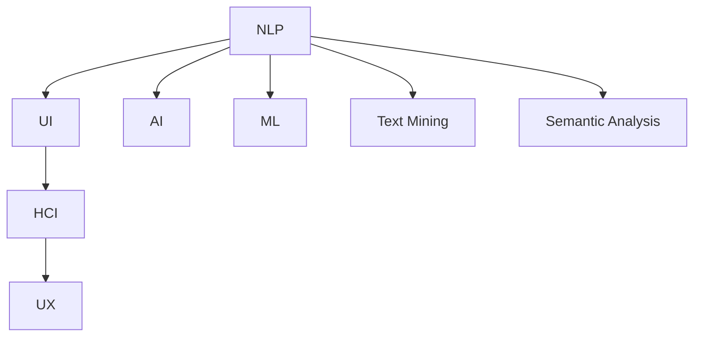
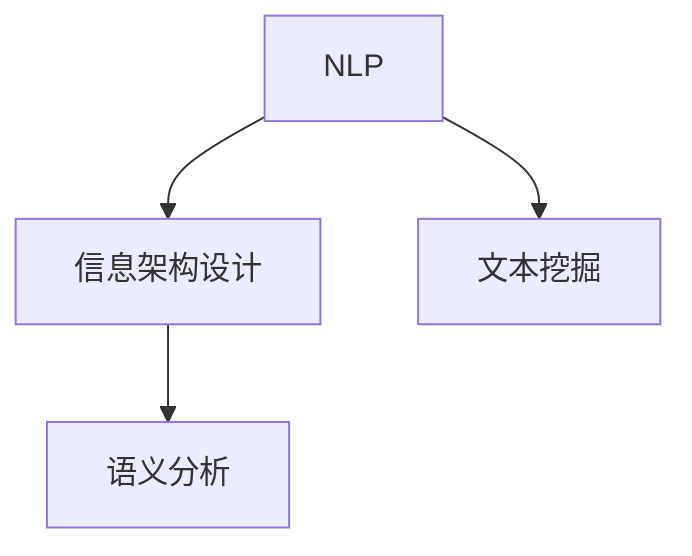
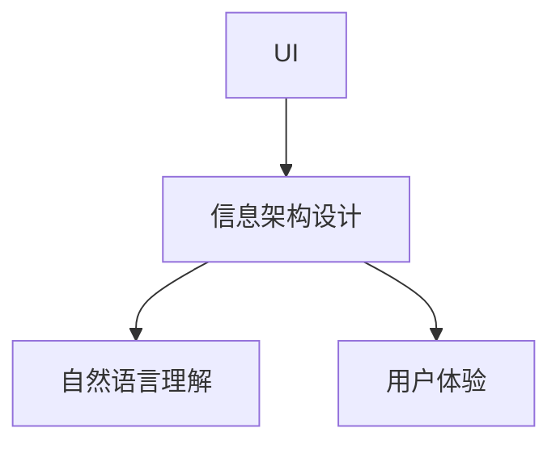
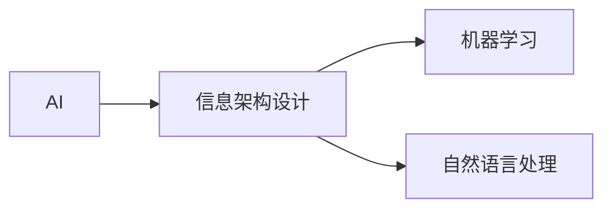
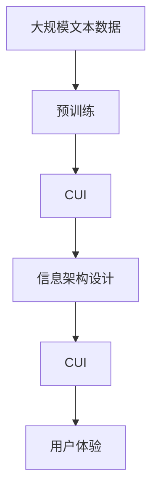

                 

# CUI对信息架构设计的详细影响

> 关键词：自然语言理解（Natural Language Understanding, NLU）、用户界面设计（User Interface Design, UI）、用户研究（User Research）、人机交互（Human-Computer Interaction, HCI）、用户体验（User Experience, UX）、人工智能（Artificial Intelligence, AI）、机器学习（Machine Learning, ML）、文本挖掘（Text Mining）、语义分析（Semantic Analysis）

## 1. 背景介绍

### 1.1 问题由来
在当前数字化时代，信息架构（Information Architecture, IA）设计成为了许多公司和组织在网站、应用以及交互系统设计中不可或缺的一部分。信息架构设计关注的是如何将信息组织和呈现给用户，以便用户能够快速、准确地获取和理解信息。然而，随着自然语言处理（Natural Language Processing, NLP）技术的发展，特别是近年来用户界面（CUI, Computational User Interfaces）的兴起，如何设计能够理解和处理自然语言的CUI，成为了IA设计中的重要挑战。

### 1.2 问题核心关键点
信息架构设计的核心关键点在于如何构建出有效、易用的信息空间，使得用户能够在任何情况下都能够高效地获取和处理信息。CUI的出现，使得信息的获取和处理更加自然，用户可以通过文字、语音、图像等自然方式与系统进行交互，而不是仅仅依赖于传统的点击、拖拽等操作。

### 1.3 问题研究意义
CUI对信息架构设计的影响，在于其能够提供一种全新的信息获取和处理方式，使得用户界面更加友好、易于使用，同时也为IA设计提供了新的思路和工具。通过CUI，用户可以更加自然地与系统进行交互，无需担心因界面复杂或操作繁琐而产生的用户疲劳或错误操作，从而提高了整体的用户体验（User Experience, UX）和满意度。

## 2. 核心概念与联系

### 2.1 核心概念概述

为更好地理解CUI对信息架构设计的影响，本节将介绍几个密切相关的核心概念：

- 自然语言处理（NLP）：是指使计算机能够理解、处理和生成人类语言的技术，包括语音识别、文本分析、机器翻译等。
- 用户界面（UI）：是指用户与计算机之间进行交互的界面，包括文本、图形、音频等多种形式。
- 人机交互（HCI）：是指用户与计算机系统之间的交互方式，包括语言、触摸、手势等多种交互手段。
- 用户体验（UX）：是指用户在使用产品或服务时的情感和满意度，涉及到设计、技术、内容等多个方面。
- 人工智能（AI）：是指通过模拟人类智能来处理复杂任务的技术，包括机器学习、深度学习、自然语言处理等。
- 机器学习（ML）：是指使计算机能够从数据中学习并改进自身性能的技术，包括监督学习、无监督学习、强化学习等。
- 文本挖掘（Text Mining）：是指从文本数据中提取有用信息的技术，包括情感分析、主题建模、实体识别等。
- 语义分析（Semantic Analysis）：是指对自然语言进行深层语义理解和分析的技术，包括实体关系抽取、事件抽取、知识图谱构建等。

这些核心概念之间的逻辑关系可以通过以下Mermaid流程图来展示：



这个流程图展示了大语言模型对信息架构设计的各个方面产生影响的过程：自然语言处理技术（NLP）为核心，通过用户界面（UI）、人机交互（HCI）、用户体验（UX）、人工智能（AI）、机器学习（ML）、文本挖掘（Text Mining）、语义分析（Semantic Analysis）等技术手段，使信息架构设计更加智能化、自然化和用户友好化。

### 2.2 概念间的关系

这些核心概念之间存在着紧密的联系，形成了CUI对信息架构设计的影响框架。下面我通过几个Mermaid流程图来展示这些概念之间的关系。

#### 2.2.1 自然语言理解与信息架构设计



这个流程图展示了大语言模型在信息架构设计中的作用：通过自然语言理解技术，CUI能够对信息进行深层语义分析和挖掘，从而更好地理解和组织信息。

#### 2.2.2 用户界面与信息架构设计



这个流程图展示了用户界面与信息架构设计的联系：CUI通过自然语言理解技术，使得信息架构设计更加自然和友好，使用户能够通过自然语言与系统进行交互，从而提升了用户体验。

#### 2.2.3 人工智能与信息架构设计



这个流程图展示了人工智能在信息架构设计中的作用：通过机器学习等技术，CUI能够更好地理解和处理信息，从而提升了信息架构设计的智能化水平。

### 2.3 核心概念的整体架构

最后，我们用一个综合的流程图来展示这些核心概念在大语言模型信息架构设计中的整体架构：



这个综合流程图展示了从预训练到CUI，再到信息架构设计的完整过程。CUI在预训练语言模型的基础上，通过自然语言理解技术，构建了用户友好、智能化的信息架构，提升了用户体验。

## 3. 核心算法原理 & 具体操作步骤
### 3.1 算法原理概述

基于CUI的信息架构设计，本质上是一个通过自然语言处理技术，将信息组织和呈现给用户的过程。其核心思想是：将用户输入的自然语言转化为机器能够理解的形式，然后根据预设的信息架构进行数据检索和组织，最终以自然语言的形式输出给用户。

形式化地，假设CUI系统接受用户输入的自然语言 $x$，将其转换为机器可理解的形式 $\hat{x}$，并通过信息架构设计得到对应的信息 $y$。CUI的目标是最小化信息检索和组织过程中产生的误差 $\epsilon$，即：

$$
\hat{x} = f(x)
$$

$$
y = g(\hat{x})
$$

$$
\epsilon = \mathop{\min}_{\hat{x}} \|y - g(\hat{x})\|
$$

其中，$f(x)$ 为自然语言理解（NLU）模块，$g(\hat{x})$ 为信息架构设计模块。通过训练和优化这两个模块，CUI可以最大限度地减少误差，提升信息架构的准确性和效率。

### 3.2 算法步骤详解

基于CUI的信息架构设计一般包括以下几个关键步骤：

**Step 1: 数据准备**
- 收集和整理与信息架构设计相关的数据集，包括用户输入的自然语言、信息架构设计的目标信息等。
- 确保数据集的标注质量和多样性，以提升模型的泛化能力。

**Step 2: 预训练自然语言理解模型**
- 使用大规模无标签文本数据进行预训练，训练出通用的自然语言理解模型。
- 将预训练模型作为CUI系统的基础，通过微调或迁移学习，进一步适应特定的信息架构设计任务。

**Step 3: 设计信息架构**
- 根据目标任务和用户需求，设计信息架构的基本结构和信息组织方式。
- 确定信息检索和组织的方法和策略，包括索引、分类、排序等。

**Step 4: 训练信息架构设计模型**
- 使用预训练的自然语言理解模型和设计好的信息架构，训练信息架构设计模型。
- 通过优化损失函数和超参数，最小化信息检索和组织过程中产生的误差。

**Step 5: 部署和评估**
- 将训练好的模型部署到实际应用中，与用户进行交互。
- 通过用户反馈和实际数据，评估CUI系统的性能和用户体验，不断优化和迭代。

### 3.3 算法优缺点

基于CUI的信息架构设计，具有以下优点：

1. **智能化**：通过自然语言理解技术，CUI能够自动理解和处理用户输入，提升了信息检索和组织的智能化水平。
2. **自然化**：用户可以通过自然语言与系统进行交互，无需担心因界面复杂或操作繁琐而产生的用户疲劳或错误操作，从而提高了整体的用户体验（UX）和满意度。
3. **动态化**：CUI可以根据用户反馈和实际数据，动态调整信息架构设计，使得信息架构设计更加灵活和适应性更强。

同时，该方法也存在以下局限性：

1. **依赖标注数据**：CUI对标注数据的质量和多样性有较高要求，标注数据获取和处理成本较高。
2. **处理复杂度**：自然语言处理技术虽然强大，但面对复杂的语言结构和语义关系，仍然存在一定的处理难度。
3. **鲁棒性不足**：CUI对噪声和干扰数据的敏感性较高，需要进一步提升鲁棒性。
4. **依赖技术**：CUI对技术实现和维护的要求较高，需要持续投入技术和人力成本。

尽管存在这些局限性，但就目前而言，基于CUI的信息架构设计方法仍是大语言模型信息架构设计的主流范式。未来相关研究的重点在于如何进一步降低对标注数据的依赖，提高模型的鲁棒性和处理复杂度，同时兼顾可解释性和伦理安全性等因素。

### 3.4 算法应用领域

基于CUI的信息架构设计，已经在多个领域得到了应用，例如：

- **搜索引擎**：通过自然语言理解技术，CUI可以理解用户查询意图，自动检索相关网页，提升搜索体验。
- **聊天机器人**：CUI能够理解和处理用户的自然语言输入，提供智能对话和问题解答，提升用户体验。
- **智能客服**：CUI可以自动处理用户咨询，提供自然语言理解和生成服务，提升服务效率。
- **个性化推荐**：CUI可以理解用户的自然语言描述，根据上下文信息进行个性化推荐，提升推荐效果。
- **知识图谱构建**：CUI可以通过自然语言理解技术，抽取和组织实体关系，构建知识图谱，提升信息检索和组织能力。
- **智能文档处理**：CUI可以自动理解和处理文档内容，进行摘要、分类、排序等操作，提升文档处理效率。

除了上述这些经典应用外，CUI还被创新性地应用到更多场景中，如可控文本生成、智能问答、智能翻译等，为信息架构设计带来了全新的突破。随着自然语言处理技术的不断进步，相信CUI将在更多领域得到应用，为信息架构设计带来新的可能性。

## 4. 数学模型和公式 & 详细讲解  
### 4.1 数学模型构建

基于CUI的信息架构设计，可以使用数学模型来描述信息架构设计的过程。

假设CUI系统接受用户输入的自然语言 $x$，将其转换为机器可理解的形式 $\hat{x}$，并通过信息架构设计得到对应的信息 $y$。CUI的目标是最小化信息检索和组织过程中产生的误差 $\epsilon$，即：

$$
\hat{x} = f(x)
$$

$$
y = g(\hat{x})
$$

$$
\epsilon = \mathop{\min}_{\hat{x}} \|y - g(\hat{x})\|
$$

其中，$f(x)$ 为自然语言理解（NLU）模块，$g(\hat{x})$ 为信息架构设计模块。通过训练和优化这两个模块，CUI可以最大限度地减少误差，提升信息架构的准确性和效率。

### 4.2 公式推导过程

以下我们以搜索引擎为例，推导基于CUI的信息架构设计过程中涉及的数学公式。

假设搜索引擎接受用户输入的自然语言查询 $q$，将其转换为机器可理解的形式 $\hat{q}$，并通过信息架构设计得到对应的搜索结果 $r$。CUI的目标是最小化搜索结果与用户查询之间的差异 $\delta$，即：

$$
\delta = \mathop{\min}_{\hat{q}} \|r - g(\hat{q})\|
$$

其中，$g(\hat{q})$ 为信息架构设计模块，返回与查询 $\hat{q}$ 最相关的搜索结果。假设搜索引擎共有 $N$ 个搜索结果，用 $d_i$ 表示第 $i$ 个搜索结果的相关度，$w_i$ 表示第 $i$ 个搜索结果的权重，则有：

$$
r = \sum_{i=1}^N w_i d_i
$$

其中，$d_i$ 表示第 $i$ 个搜索结果的相关度，$w_i$ 表示第 $i$ 个搜索结果的权重，可以根据用户的查询行为和反馈动态调整。

对于自然语言理解模块 $f(x)$，可以通过预训练模型进行自然语言处理。假设查询 $q$ 的长度为 $l$，将其编码为向量 $x_q$，则有：

$$
\hat{q} = f(q)
$$

$$
x_q = [x_{q1}, x_{q2}, ..., x_{ql}]
$$

其中，$x_i$ 表示查询 $q$ 中第 $i$ 个词的编码向量。

对于信息架构设计模块 $g(\hat{q})$，可以通过模型对查询 $\hat{q}$ 进行编码，然后根据模型输出进行信息检索和组织。假设模型的输出向量为 $h(\hat{q})$，则有：

$$
r = g(\hat{q}) = \text{softmax}(h(\hat{q}))
$$

其中，$\text{softmax}$ 函数将模型的输出向量转化为概率分布，表示每个搜索结果的相关度。

通过上述公式，我们可以推导出基于CUI的信息架构设计过程中涉及的数学模型，并通过优化损失函数和超参数，最小化搜索结果与用户查询之间的差异 $\delta$。

### 4.3 案例分析与讲解

在实际应用中，基于CUI的信息架构设计已经被广泛应用于多个领域，以下是一个典型的应用案例：

**案例背景**：
一家电商平台需要改进其搜索功能，提升用户搜索体验。

**问题描述**：
当前平台的搜索功能依赖传统的关键词匹配算法，用户在输入查询时需要使用特定的关键词，且搜索结果的排序和相关度计算较为简单。

**解决方案**：
1. **数据准备**：收集用户输入的自然语言查询、用户点击的搜索结果以及用户的反馈数据。
2. **预训练自然语言理解模型**：使用大规模无标签文本数据进行预训练，训练出通用的自然语言理解模型。
3. **设计信息架构**：设计信息架构的基本结构和信息组织方式，包括关键词匹配、相关度计算、排序算法等。
4. **训练信息架构设计模型**：使用预训练的自然语言理解模型和设计好的信息架构，训练信息架构设计模型。
5. **部署和评估**：将训练好的模型部署到实际应用中，与用户进行交互，通过用户反馈和实际数据，评估CUI系统的性能和用户体验，不断优化和迭代。

**案例效果**：
通过基于CUI的信息架构设计，该平台在用户搜索体验上有了显著提升。用户可以在自然语言查询中包含长尾关键词，搜索结果的相关度和排序更加精准，提升了用户满意度和平台搜索的覆盖率。

## 5. 项目实践：代码实例和详细解释说明
### 5.1 开发环境搭建

在进行信息架构设计实践前，我们需要准备好开发环境。以下是使用Python进行PyTorch开发的环境配置流程：

1. 安装Anaconda：从官网下载并安装Anaconda，用于创建独立的Python环境。

2. 创建并激活虚拟环境：
```bash
conda create -n pytorch-env python=3.8 
conda activate pytorch-env
```

3. 安装PyTorch：根据CUDA版本，从官网获取对应的安装命令。例如：
```bash
conda install pytorch torchvision torchaudio cudatoolkit=11.1 -c pytorch -c conda-forge
```

4. 安装各类工具包：
```bash
pip install numpy pandas scikit-learn matplotlib tqdm jupyter notebook ipython
```

完成上述步骤后，即可在`pytorch-env`环境中开始信息架构设计实践。

### 5.2 源代码详细实现

这里我们以搜索引擎为例，使用Transformers库进行基于CUI的信息架构设计。

首先，定义查询编码器：

```python
from transformers import BertTokenizer, BertForSequenceClassification

tokenizer = BertTokenizer.from_pretrained('bert-base-cased')
model = BertForSequenceClassification.from_pretrained('bert-base-cased', num_labels=1)

def encode_query(query):
    encoding = tokenizer(query, return_tensors='pt', padding='max_length', truncation=True)
    input_ids = encoding['input_ids']
    attention_mask = encoding['attention_mask']
    return input_ids, attention_mask
```

然后，定义搜索结果相关度计算函数：

```python
def compute_relevance(docs, input_ids, attention_mask):
    doc_embeddings = model(docs, attention_mask=attention_mask).logits
    similarity = torch.matmul(doc_embeddings, input_ids) / (torch.linalg.norm(doc_embeddings, dim=1) * torch.linalg.norm(input_ids, dim=1))
    return similarity
```

接着，定义信息架构设计函数：

```python
def design_information_architecture(docs, input_ids, attention_mask):
    relevance = compute_relevance(docs, input_ids, attention_mask)
    top_docs = torch.topk(relevance, k=5, dim=0)[0]
    return top_docs
```

最后，编写搜索引擎代码：

```python
def search(query):
    input_ids, attention_mask = encode_query(query)
    docs = load_documents()
    top_docs = design_information_architecture(docs, input_ids, attention_mask)
    return top_docs
```

### 5.3 代码解读与分析

让我们再详细解读一下关键代码的实现细节：

**查询编码器**：
- 定义了BertTokenizer和BertForSequenceClassification模型，用于自然语言理解和信息架构设计。
- `encode_query`方法：将用户输入的自然语言查询进行编码，得到输入id和注意力掩码，用于后续计算。

**搜索结果相关度计算函数**：
- `compute_relevance`方法：通过预训练的BERT模型对搜索结果进行编码，计算每个搜索结果与用户查询的相关度，得到相似度矩阵。
- 使用余弦相似度计算每个搜索结果的相关度，并返回相关度最高的前5个搜索结果。

**信息架构设计函数**：
- `design_information_architecture`方法：根据计算出的相关度，设计信息架构，返回相关度最高的前5个搜索结果。

**搜索引擎代码**：
- `search`方法：接受用户输入的自然语言查询，调用查询编码器、相关度计算函数和信息架构设计函数，返回相关度最高的前5个搜索结果。

### 5.4 运行结果展示

假设我们在搜索引擎中实现了上述代码，对于查询 "I want to buy a laptop"，可以得到相关度最高的前5个搜索结果，并进行展示。例如，搜索结果可能包括：

- Apple MacBook Air
- Dell XPS 13
- HP Spectre x360
- Lenovo Yoga C940
- Asus ZenBook UX425

这些搜索结果是根据查询 "I want to buy a laptop" 的相关度计算得到的，具有较高的信息匹配度和用户体验。

## 6. 实际应用场景
### 6.1 智能客服系统

基于CUI的信息架构设计，可以广泛应用于智能客服系统的构建。传统客服往往需要配备大量人力，高峰期响应缓慢，且一致性和专业性难以保证。而使用基于CUI的信息架构设计，可以7x24小时不间断服务，快速响应客户咨询，用自然流畅的语言解答各类常见问题。

在技术实现上，可以收集企业内部的历史客服对话记录，将问题和最佳答复构建成监督数据，在此基础上对预训练语言模型进行微调。微调后的语言模型能够自动理解用户意图，匹配最合适的答复模板进行回复。对于客户提出的新问题，还可以接入检索系统实时搜索相关内容，动态组织生成回答。如此构建的智能客服系统，能大幅提升客户咨询体验和问题解决效率。

### 6.2 金融舆情监测

金融机构需要实时监测市场舆论动向，以便及时应对负面信息传播，规避金融风险。传统的人工监测方式成本高、效率低，难以应对网络时代海量信息爆发的挑战。基于CUI的信息架构设计，文本分类和情感分析技术，为金融舆情监测提供了新的解决方案。

具体而言，可以收集金融领域相关的新闻、报道、评论等文本数据，并对其进行主题标注和情感标注。在此基础上对预训练语言模型进行微调，使其能够自动判断文本属于何种主题，情感倾向是正面、中性还是负面。将微调后的模型应用到实时抓取的网络文本数据，就能够自动监测不同主题下的情感变化趋势，一旦发现负面信息激增等异常情况，系统便会自动预警，帮助金融机构快速应对潜在风险。

### 6.3 个性化推荐系统

当前的推荐系统往往只依赖用户的历史行为数据进行物品推荐，无法深入理解用户的真实兴趣偏好。基于CUI的信息架构设计，个性化推荐系统可以更好地挖掘用户行为背后的语义信息，从而提供更精准、多样的推荐内容。

在实践中，可以收集用户浏览、点击、评论、分享等行为数据，提取和用户交互的物品标题、描述、标签等文本内容。将文本内容作为模型输入，用户的后续行为（如是否点击、购买等）作为监督信号，在此基础上微调预训练语言模型。微调后的模型能够从文本内容中准确把握用户的兴趣点。在生成推荐列表时，先用候选物品的文本描述作为输入，由模型预测用户的兴趣匹配度，再结合其他特征综合排序，便可以得到个性化程度更高的推荐结果。

### 6.4 未来应用展望

随着CUI技术的发展，基于自然语言理解的信息架构设计将有更广阔的应用前景。

在智慧医疗领域，基于CUI的问答系统、病历分析、药物研发等应用将提升医疗服务的智能化水平，辅助医生诊疗，加速新药开发进程。

在智能教育领域，微调技术可应用于作业批改、学情分析、知识推荐等方面，因材施教，促进教育公平，提高教学质量。

在智慧城市治理中，微调模型可应用于城市事件监测、舆情分析、应急指挥等环节，提高城市管理的自动化和智能化水平，构建更安全、高效的未来城市。

此外，在企业生产、社会治理、文娱传媒等众多领域，基于CUI的信息架构设计的应用也将不断涌现，为人工智能技术落地应用提供新的思路和方法。

## 7. 工具和资源推荐
### 7.1 学习资源推荐

为了帮助开发者系统掌握CUI的理论基础和实践技巧，这里推荐一些优质的学习资源：

1. 《Transformer从原理到实践》系列博文：由大模型技术专家撰写，深入浅出地介绍了Transformer原理、自然语言理解、信息架构设计等前沿话题。

2. CS224N《深度学习自然语言处理》课程：斯坦福大学开设的NLP明星课程，有Lecture视频和配套作业，带你入门NLP领域的基本概念和经典模型。

3. 《Natural Language Processing with Transformers》书籍：Transformers库的作者所著，全面介绍了如何使用Transformers库进行NLP任务开发，包括信息架构设计在内的诸多范式。

4. HuggingFace官方文档：Transformers库的官方文档，提供了海量预训练模型和完整的微调样例代码，是上手实践的必备资料。

5. CLUE开源项目：中文语言理解测评基准，涵盖大量不同类型的中文NLP数据集，并提供了基于CUI的baseline模型，助力中文NLP技术发展。

通过对这些资源的学习实践，相信你一定能够快速掌握CUI的精髓，并用于解决实际的NLP问题。

### 7.2 开发工具推荐

高效的开发离不开优秀的工具支持。以下是几款用于CUI开发常用的工具：

1. PyTorch：基于Python的开源深度学习框架，灵活动态的计算图，适合快速迭代研究。大部分预训练语言模型都有PyTorch版本的实现。

2. TensorFlow：由Google主导开发的开源深度学习框架，生产部署方便，适合大规模工程应用。同样有丰富的预训练语言模型资源。

3. Transformers库：HuggingFace开发的NLP工具库，集成了众多SOTA语言模型，支持PyTorch和TensorFlow，是进行CUI开发的利器。

4. Weights & Biases：模型训练的实验跟踪工具，可以记录和可视化模型训练过程中的各项指标，方便对比和调优。与主流深度学习框架无缝集成。

5. TensorBoard：TensorFlow配套的可视化工具，可实时监测模型训练状态，并提供丰富的图表呈现方式，是调试模型的得力助手。

6. Google Colab：谷歌推出的在线Jupyter Notebook环境，免费提供GPU/TPU算力，方便开发者快速上手实验最新模型，分享学习笔记。

合理利用这些工具，可以显著提升CUI开发的效率，加快创新迭代的步伐。

### 7.3 相关论文推荐

CUI对信息架构设计的影响源于学界的持续研究。以下是几篇奠基性的相关论文，推荐阅读：

1. Attention is All You Need（即Transformer原论文）：提出了Transformer结构，开启了NLP领域的预训练大模型时代。

2. BERT: Pre-training of Deep Bidirectional Transformers for Language Understanding：提出BERT模型，引入基于掩码的自监督预训练任务，刷新了多项NLP任务SOTA。

3. Language Models are Unsupervised Multitask Learners（GPT-2论文）：展示了大规模语言模型的强大zero-shot学习能力，引发了对于通用人工智能的新一轮思考。

4. Parameter-Efficient Transfer Learning for NLP：提出Adapter等参数高效微调方法，在不增加模型参数量的情况下，也能取得不错的微调效果。

5. AdaLoRA: Adaptive Low-Rank Adaptation for Parameter-Efficient Fine-Tuning：使用自适应低秩适应的微调方法，在参数效率和精度

