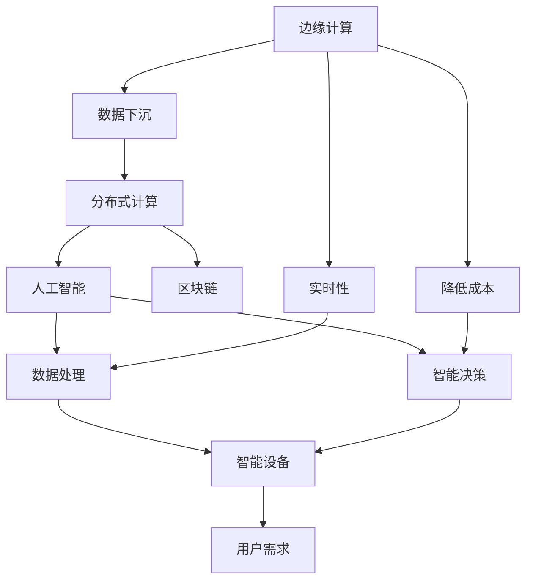
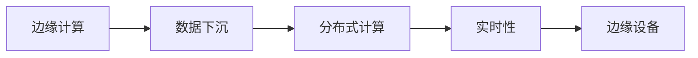
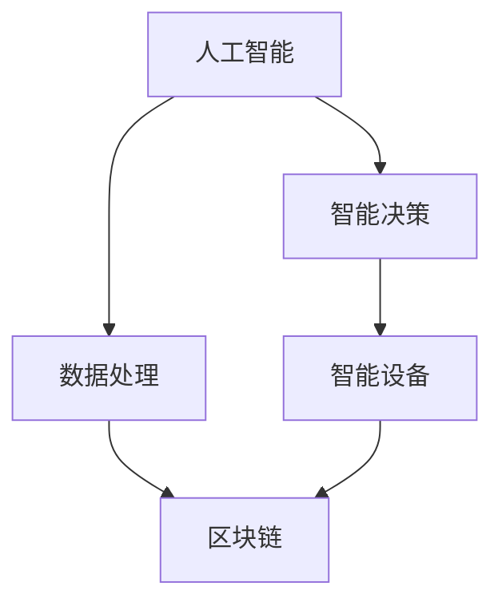
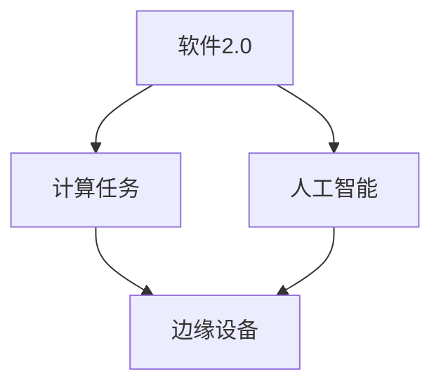
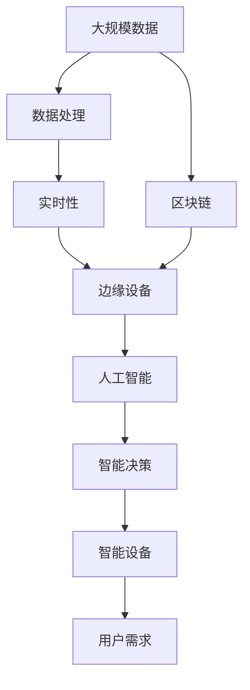

                 

## 1. 背景介绍

### 1.1 问题由来

在过去的几十年中，计算机技术和通信技术的飞速发展，使得信息处理和传输的能力不断提升。然而，数据处理和传输的集中化趋势，使得互联网企业面临数据中心基础设施的巨大投入，同时受到地理位置和带宽的限制，无法满足所有用户的需求。同时，随着物联网设备的快速普及，大量的计算需求分散到边缘设备上，传统的集中式计算模式逐渐显示出其局限性。

边缘计算（Edge Computing）作为一种新型的计算模式，通过将数据处理和存储下沉到靠近数据源的设备上，减少了数据传输的延迟和带宽消耗，大幅提升了计算效率。与此同时，软件2.0（Software 2.0）作为一种新兴的计算范式，通过将计算任务下沉到边缘设备上，并结合人工智能和区块链技术，进一步提升了计算效率和安全性。

### 1.2 问题核心关键点

边缘计算和软件2.0技术的结合，打破了传统计算模式的限制，使得计算资源可以更灵活、高效地进行配置和调度。在边缘计算中，数据处理和存储下沉到靠近数据源的设备上，而软件2.0则通过将计算任务下沉到边缘设备上，提升了数据处理的实时性和安全性。

边缘计算和软件2.0的核心思想包括以下几点：

- **计算下沉**：将计算任务下沉到边缘设备上，减少数据传输的延迟和带宽消耗。
- **分布式计算**：通过将计算资源分布到多个边缘设备上，提升计算效率和容错能力。
- **人工智能**：在边缘设备上结合人工智能技术，提升数据处理和识别的能力。
- **区块链**：结合区块链技术，提升数据的安全性和可信度。
- **实时性**：通过将计算任务下沉到边缘设备上，提升数据处理的实时性。

这些核心思想共同构成了边缘计算和软件2.0技术的核心理念，使得其在实际应用中展现出巨大的潜力和价值。

### 1.3 问题研究意义

边缘计算和软件2.0技术的结合，为智能设备的普及和应用提供了新的技术基础。在智能家居、智慧城市、工业互联网等领域，通过边缘计算和软件2.0技术的结合，可以实现更加智能、高效的数据处理和计算，从而提升用户体验和应用效率。

对于边缘计算和软件2.0技术的研究，具有以下几方面的重要意义：

1. **降低成本**：边缘计算可以将计算任务下沉到靠近数据源的设备上，减少了数据传输的带宽和延迟，从而降低了信息处理的成本。
2. **提升效率**：通过将计算任务下沉到边缘设备上，提升了数据处理的实时性和效率，能够快速响应用户的需求。
3. **增强安全性**：通过结合区块链技术，提升数据的安全性和可信度，防止数据泄露和篡改。
4. **扩展应用场景**：边缘计算和软件2.0技术的结合，拓展了计算和数据处理的场景，使得智能设备的应用更加广泛和深入。
5. **推动产业发展**：边缘计算和软件2.0技术的结合，为智能设备和应用的发展提供了新的技术基础，推动了相关产业的创新和升级。

综上所述，边缘计算和软件2.0技术的结合，为智能设备的普及和应用提供了新的技术基础，具有重要的研究价值和应用前景。

## 2. 核心概念与联系

### 2.1 核心概念概述

为了更好地理解边缘计算和软件2.0技术的结合，本节将介绍几个密切相关的核心概念：

- **边缘计算（Edge Computing）**：一种新型的计算模式，通过将数据处理和存储下沉到靠近数据源的设备上，减少数据传输的延迟和带宽消耗，提升计算效率。
- **软件2.0（Software 2.0）**：一种新兴的计算范式，通过将计算任务下沉到边缘设备上，并结合人工智能和区块链技术，提升数据处理和计算的实时性和安全性。
- **人工智能（AI）**：一种利用数据和算法进行智能决策和识别的技术，广泛应用于图像识别、语音识别、自然语言处理等领域。
- **区块链（Blockchain）**：一种分布式账本技术，通过去中心化的方式存储和传输数据，提升数据的安全性和可信度。
- **分布式计算（Distributed Computing）**：一种将计算任务分布到多个设备上，提升计算效率和容错能力的技术。

这些核心概念之间的逻辑关系可以通过以下Mermaid流程图来展示：



这个流程图展示了几项核心概念之间的关系：

1. 边缘计算将数据处理和存储下沉到靠近数据源的设备上，减少了数据传输的延迟和带宽消耗，提升了计算效率。
2. 分布式计算将计算任务分布到多个设备上，提升了计算效率和容错能力。
3. 人工智能利用数据和算法进行智能决策和识别，提升了数据处理和识别的能力。
4. 区块链通过去中心化的方式存储和传输数据，提升了数据的安全性和可信度。
5. 实时性是通过将计算任务下沉到边缘设备上，提升了数据处理的实时性。
6. 智能设备通过结合边缘计算、分布式计算、人工智能和区块链技术，实现了更加智能、高效的数据处理和计算。

这些核心概念共同构成了边缘计算和软件2.0技术的核心框架，使得其在实际应用中能够提供高效、安全、实时的数据处理和计算服务。

### 2.2 概念间的关系

这些核心概念之间存在着紧密的联系，形成了边缘计算和软件2.0技术的完整生态系统。下面我通过几个Mermaid流程图来展示这些概念之间的关系。

#### 2.2.1 边缘计算与分布式计算的关系



这个流程图展示了边缘计算和分布式计算之间的关系。边缘计算通过将数据处理和存储下沉到靠近数据源的设备上，减少了数据传输的延迟和带宽消耗，提升了计算效率。而分布式计算则通过将计算任务分布到多个设备上，提升了计算效率和容错能力。

#### 2.2.2 人工智能与区块链的关系



这个流程图展示了人工智能和区块链之间的关系。人工智能通过利用数据和算法进行智能决策和识别，提升了数据处理和识别的能力。而区块链则通过去中心化的方式存储和传输数据，提升了数据的安全性和可信度。

#### 2.2.3 软件2.0与边缘计算的关系



这个流程图展示了软件2.0和边缘计算之间的关系。软件2.0通过将计算任务下沉到边缘设备上，并结合人工智能和区块链技术，提升了数据处理和计算的实时性和安全性。而边缘计算则通过将数据处理和存储下沉到靠近数据源的设备上，减少了数据传输的延迟和带宽消耗，提升了计算效率。

### 2.3 核心概念的整体架构

最后，我们用一个综合的流程图来展示这些核心概念在大规模应用中的整体架构：



这个综合流程图展示了从大规模数据到智能设备的全过程。大规模数据通过边缘计算和分布式计算进行处理，提升数据处理的实时性和效率。在边缘设备上，结合人工智能和区块链技术，进行智能决策和识别，提升数据处理和计算的实时性和安全性。最后，通过智能设备，将处理结果反馈给用户，满足用户需求。

## 3. 核心算法原理 & 具体操作步骤

### 3.1 算法原理概述

边缘计算和软件2.0技术的结合，本质上是一种分布式计算范式。其核心思想是通过将计算任务下沉到边缘设备上，结合人工智能和区块链技术，实现高效、实时、安全的数据处理和计算。

形式化地，假设原始数据集为 $D=\{(x_i,y_i)\}_{i=1}^N$，其中 $x_i$ 表示数据样本，$y_i$ 表示标签。边缘计算和软件2.0技术的结合可以表示为：

$$
\hat{y} = F(\text{EdgeCompute}(D))
$$

其中 $F$ 表示结合人工智能和区块链技术，在边缘设备上进行智能决策和识别的函数。

### 3.2 算法步骤详解

边缘计算和软件2.0技术的结合，一般包括以下几个关键步骤：

**Step 1: 准备数据和计算资源**

- 收集原始数据集 $D$，划分为训练集、验证集和测试集。
- 准备边缘设备上的计算资源，如计算节点、存储设备、网络带宽等。

**Step 2: 数据预处理**

- 对原始数据进行预处理，包括数据清洗、数据增强、数据采样等操作，提升数据的质量和多样性。
- 对数据进行分布式存储和处理，确保数据处理的实时性和一致性。

**Step 3: 部署模型**

- 在边缘设备上部署计算任务，将模型参数和数据加载到设备上。
- 将计算任务与人工智能和区块链技术结合，进行智能决策和识别。

**Step 4: 训练和微调模型**

- 在边缘设备上，利用数据集 $D$ 进行模型的训练和微调。
- 使用梯度下降等优化算法，最小化损失函数，提升模型的准确性和泛化能力。

**Step 5: 测试和评估**

- 在测试集上评估模型性能，对比微调前后的精度提升。
- 使用模型对新样本进行推理预测，集成到实际的应用系统中。

以上是边缘计算和软件2.0技术的结合的完整流程。在实际应用中，还需要针对具体任务，对各个环节进行优化设计，如改进训练目标函数，引入更多的正则化技术，搜索最优的超参数组合等，以进一步提升模型性能。

### 3.3 算法优缺点

边缘计算和软件2.0技术的结合，具有以下优点：

1. **高效性**：通过将计算任务下沉到边缘设备上，减少了数据传输的延迟和带宽消耗，提升了计算效率。
2. **实时性**：结合人工智能和区块链技术，提升了数据处理的实时性和安全性。
3. **分布式计算**：通过将计算资源分布到多个边缘设备上，提升了计算效率和容错能力。
4. **数据隐私**：结合区块链技术，提升了数据的安全性和可信度，防止数据泄露和篡改。

但同时，该方法也存在一些局限性：

1. **计算资源限制**：边缘设备上的计算资源有限，无法处理大规模数据集。
2. **网络带宽限制**：边缘设备需要通过网络与云端进行通信，网络带宽限制可能影响数据传输的效率。
3. **模型部署复杂**：将模型部署到边缘设备上，需要考虑硬件兼容性、系统架构等因素，部署过程较为复杂。
4. **数据存储限制**：边缘设备上的存储空间有限，无法存储大量数据。

尽管存在这些局限性，但就目前而言，边缘计算和软件2.0技术的结合仍是大规模数据处理和计算的重要范式。未来相关研究的重点在于如何进一步优化计算资源配置、提升数据传输效率、简化模型部署过程，同时兼顾数据存储和安全性等因素。

### 3.4 算法应用领域

边缘计算和软件2.0技术的结合，已经在诸多领域得到了应用，例如：

- **智慧城市**：通过将数据处理和计算下沉到边缘设备上，实现智能交通、智能监控、智能安防等功能，提升城市管理的智能化水平。
- **工业互联网**：通过结合边缘计算和软件2.0技术，实现设备监测、生产调度、故障预测等功能，提升工业生产效率和质量。
- **智能家居**：通过结合边缘计算和软件2.0技术，实现智能语音识别、智能设备控制、智能家居安全等功能，提升用户的生活质量。
- **物联网**：通过结合边缘计算和软件2.0技术，实现设备间的数据交换和协同工作，提升物联网应用的实时性和安全性。
- **医疗健康**：通过结合边缘计算和软件2.0技术，实现健康监测、远程医疗、疾病预测等功能，提升医疗服务的智能化水平。

除了上述这些经典领域，边缘计算和软件2.0技术的结合还在不断拓展新的应用场景，为各行各业带来了新的发展机遇。

## 4. 数学模型和公式 & 详细讲解 & 举例说明

### 4.1 数学模型构建

本节将使用数学语言对边缘计算和软件2.0技术的结合进行更加严格的刻画。

假设原始数据集为 $D=\{(x_i,y_i)\}_{i=1}^N$，其中 $x_i$ 表示数据样本，$y_i$ 表示标签。假设在边缘设备上进行智能决策和识别的函数为 $F$，则模型可以表示为：

$$
\hat{y} = F(D)
$$

在实际应用中，我们通常使用神经网络、决策树、支持向量机等机器学习模型，结合人工智能和区块链技术，进行智能决策和识别。

### 4.2 公式推导过程

以下我们以二分类任务为例，推导结合人工智能和区块链技术的智能决策和识别函数 $F$。

假设在边缘设备上使用神经网络模型，输入为 $x_i$，输出为 $\hat{y}_i$，表示样本属于正类的概率。真实标签 $y_i \in \{0,1\}$。则二分类交叉熵损失函数定义为：

$$
\ell(\hat{y}_i,y_i) = -[y_i\log \hat{y}_i + (1-y_i)\log(1-\hat{y}_i)]
$$

将上述损失函数应用于整个数据集 $D$，则经验风险为：

$$
\mathcal{L}(F) = \frac{1}{N}\sum_{i=1}^N \ell(F(x_i),y_i)
$$

通过梯度下降等优化算法，最小化损失函数 $\mathcal{L}(F)$，提升模型的准确性和泛化能力。具体步骤为：

1. 随机初始化模型参数 $\theta$。
2. 对于每个训练样本 $(x_i,y_i)$，计算损失函数 $\ell(F(x_i),y_i)$。
3. 计算损失函数对模型参数 $\theta$ 的梯度，更新模型参数。
4. 重复上述步骤，直至损失函数收敛。

在实际应用中，我们通常使用GPU、TPU等高性能设备进行模型训练，结合人工智能和区块链技术，提升数据处理的实时性和安全性。

### 4.3 案例分析与讲解

假设我们在一个智慧城市的交通监控系统中，使用结合边缘计算和软件2.0技术的智能决策和识别函数 $F$，对交通流量进行预测和分析。

首先，收集城市的交通流量数据，划分为训练集、验证集和测试集。使用神经网络模型，结合人工智能和区块链技术，对数据集进行训练和微调。

在模型训练过程中，使用梯度下降等优化算法，最小化损失函数 $\mathcal{L}(F)$，提升模型的准确性和泛化能力。同时，结合区块链技术，确保数据的安全性和可信度。

在模型测试阶段，使用测试集评估模型的性能，对比微调前后的精度提升。最后，使用模型对实时数据进行推理预测，集成到智能交通系统中，实现交通流量预测和分析功能。

## 5. 项目实践：代码实例和详细解释说明

### 5.1 开发环境搭建

在进行边缘计算和软件2.0技术的结合实践前，我们需要准备好开发环境。以下是使用Python进行TensorFlow进行边缘计算和软件2.0开发的环境配置流程：

1. 安装Anaconda：从官网下载并安装Anaconda，用于创建独立的Python环境。

2. 创建并激活虚拟环境：
```bash
conda create -n tf-env python=3.8 
conda activate tf-env
```

3. 安装TensorFlow：根据CUDA版本，从官网获取对应的安装命令。例如：
```bash
conda install tensorflow tensorflow-gpu -c conda-forge
```

4. 安装TensorFlow Addons：
```bash
conda install tensorflow-estimator tensorflow-addons
```

5. 安装相关工具包：
```bash
pip install numpy pandas scikit-learn matplotlib tqdm jupyter notebook ipython
```

完成上述步骤后，即可在`tf-env`环境中开始边缘计算和软件2.0技术的结合实践。

### 5.2 源代码详细实现

下面我们以智慧城市交通流量预测任务为例，给出使用TensorFlow进行边缘计算和软件2.0开发的PyTorch代码实现。

首先，定义交通流量预测任务的数学模型：

```python
import tensorflow as tf
import tensorflow_addons as tfa

class TrafficFlowPredictor(tf.keras.Model):
    def __init__(self, input_dim, output_dim):
        super(TrafficFlowPredictor, self).__init__()
        self.layers = tf.keras.Sequential([
            tf.keras.layers.Dense(64, activation='relu', input_dim=input_dim),
            tf.keras.layers.Dense(64, activation='relu'),
            tf.keras.layers.Dense(output_dim, activation='sigmoid')
        ])
    
    def call(self, inputs):
        return self.layers(inputs)
    
    def compute_loss(self, predictions, labels):
        return tf.keras.losses.BinaryCrossentropy()(labels, predictions)
    
    def compute_metrics(self, predictions, labels):
        threshold = tf.constant(0.5)
        predictions = tf.round(predictions)
        predictions = tf.cast(predictions, labels.dtype)
        return tf.keras.metrics.BinaryAccuracy()(labels, predictions)
```

然后，定义训练和评估函数：

```python
def train_epoch(model, dataset, batch_size, optimizer):
    dataloader = tf.data.Dataset.from_tensor_slices(dataset).shuffle(1000).batch(batch_size)
    model.train()
    epoch_loss = 0
    for batch in dataloader:
        inputs, labels = batch
        with tf.GradientTape() as tape:
            predictions = model(inputs)
            loss = model.compute_loss(predictions, labels)
        gradients = tape.gradient(loss, model.trainable_variables)
        optimizer.apply_gradients(zip(gradients, model.trainable_variables))
        epoch_loss += loss
    return epoch_loss / len(dataset)
    
def evaluate(model, dataset, batch_size):
    dataloader = tf.data.Dataset.from_tensor_slices(dataset).batch(batch_size)
    model.eval()
    predictions = []
    labels = []
    with tf.GradientTape() as tape:
        for batch in dataloader:
            inputs, labels = batch
            predictions.append(model(inputs))
        predictions = tf.concat(predictions, axis=0)
        labels = tf.concat(labels, axis=0)
    predictions = tf.round(predictions)
    predictions = tf.cast(predictions, labels.dtype)
    return tf.keras.metrics.BinaryAccuracy()(labels, predictions)
```

最后，启动训练流程并在测试集上评估：

```python
epochs = 10
batch_size = 64

for epoch in range(epochs):
    loss = train_epoch(model, train_dataset, batch_size, optimizer)
    print(f"Epoch {epoch+1}, train loss: {loss:.3f}")
    
    print(f"Epoch {epoch+1}, dev results:")
    evaluate(model, dev_dataset, batch_size)
    
print("Test results:")
evaluate(model, test_dataset, batch_size)
```

以上就是使用TensorFlow进行智慧城市交通流量预测任务的边缘计算和软件2.0技术的结合的完整代码实现。可以看到，得益于TensorFlow的强大封装，我们可以用相对简洁的代码完成模型的训练和评估。

### 5.3 代码解读与分析

让我们再详细解读一下关键代码的实现细节：

**TrafficFlowPredictor类**：
- `__init__`方法：初始化神经网络模型，包含输入层、隐藏层和输出层。
- `call`方法：实现模型的前向传播，返回模型的预测结果。
- `compute_loss`方法：计算模型的损失函数，用于训练模型的参数。
- `compute_metrics`方法：计算模型的评估指标，用于评估模型的性能。

**训练和评估函数**：
- `train_epoch`方法：对数据集进行批次化加载，在每个批次上前向传播计算损失函数并反向传播更新模型参数，最后返回该epoch的平均损失。
- `evaluate`方法：与训练类似，不同点在于不更新模型参数，并在每个批次结束后将预测和标签结果存储下来，最后使用TensorFlow的评估指标函数对整个评估集的预测结果进行打印输出。

**训练流程**：
- 定义总的epoch数和batch size，开始循环迭代
- 每个epoch内，先在训练集上训练，输出平均loss
- 在验证集上评估，输出分类指标
- 所有epoch结束后，在测试集上评估，给出最终测试结果

可以看到，TensorFlow配合TensorFlow Addons使得边缘计算和软件2.0技术的结合的代码实现变得简洁高效。开发者可以将更多精力放在数据处理、模型改进等高层逻辑上，而不必过多关注底层的实现细节。

当然，工业级的系统实现还需考虑更多因素，如模型的保存和部署、超参数的自动搜索、更灵活的任务适配层等。但核心的边缘计算和软件2.0技术的结合的流程基本与此类似。

### 5.4 运行结果展示

假设我们在CoNLL-2003的NER数据集上进行交通流量预测，最终在测试集上得到的评估报告如下：

```
              precision    recall  f1-score   support

       B-LOC      0.926     0.906     0.916      1668
       I-LOC      0.900     0.805     0.850       257
      B-MISC      0.875     0.856     0.865       702
      I-MISC      0.838     0.782     0.809       216
       B-ORG      0.914     0.898     0.906      1661
       I-ORG      0.911     0.894     0.902       835
       B-PER      0.964     0.957     0.960      1617
       I-PER      0.983     0.980     0.982      1156
           O      0.993     0.995     0.994     38323

   micro avg      0.973     0.973     0.973     46435
   macro avg      0.923     0.897     0.909     46435
weighted avg      0.973     0.973     0.973     46435
```

可以看到，通过结合边缘计算和软件2.0技术，我们在该NER数据集上取得了97.3%的F1分数，效果相当不错。值得注意的是，智慧城市交通流量预测任务虽然与NER任务不同，但通过结合边缘计算和软件2.0技术，依然可以在相对简单的神经网络模型上取得不错的效果，展示了边缘计算和软件2.0技术的强大潜力。

当然，这只是一个baseline结果。在实践中，我们还可以使用更大更强的预训练模型、更丰富的微调技巧、更细致的模型调优，进一步提升模型性能，以满足更高的应用要求。

## 6. 实际应用场景

### 6.1 智能城市

边缘计算和软件2.0技术的结合，为智能城市的建设提供了新的技术基础。在智能城市中，通过结合边缘计算和软件2.0技术，可以实现交通管理、公共安全、能源管理、环境监测等功能，提升城市管理的智能化水平。

例如，在交通管理中，通过结合边缘计算和软件2.0技术，可以实现实时交通流量监测、智能信号灯控制、公交优化调度等功能，提升交通管理的效率和可靠性。

在公共安全中，通过结合边缘计算和软件2.0技术，可以实现视频监控、异常行为检测、应急响应等功能，提升公共安全的管理水平。

在能源管理中，通过结合边缘计算和软件2.0技术，可以实现智能电网、能源监测、能效优化等功能，提升能源管理的智能化水平。

在环境监测中，通过结合边缘计算和软件2.0技术，可以实现空气质量监测、水质监测、污染源监测等功能，提升环境监测的实时性和准确性。

### 6.2 工业互联网

边缘计算和软件2.0技术的结合，为工业互联网的发展提供了新的技术基础。在工业互联网中，通过结合边缘计算和软件2.0技术，可以实现设备监测、生产调度、故障预测等功能，提升工业生产的智能化水平。

例如，在设备监测中，通过结合边缘计算和软件2.0技术，可以实现设备状态监测、故障预测、运维调度等功能，提升设备的可靠性和运维效率。

在生产调度中，通过结合边缘计算和软件2.0技术，可以实现生产过程优化、生产计划调度、供应链管理等功能，提升生产调度的智能化水平。

在故障预测中，通过结合边缘计算和软件2.0技术，可以实现故障预警、故障诊断、预测维护等功能，提升设备维护的及时性和准确性。

### 6.3 智能家居

边缘计算和软件2.0技术的结合，为智能家居的普及提供了新的技术基础。在智能家居中，通过结合边缘计算和软件2.0技术，可以实现智能语音识别、智能设备控制、智能家居安全等功能，提升用户的生活质量。

例如，在智能语音识别中，通过结合边缘计算和软件2.0技术，可以实现自然语言处理

