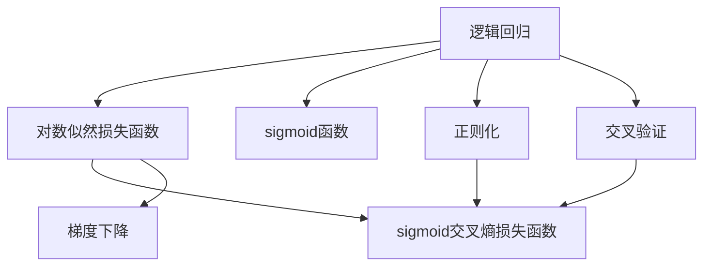

                 

# 逻辑回归(Logistic Regression) - 原理与代码实例讲解

> 关键词：逻辑回归,回归分析,分类模型,线性模型,Python,sklearn

## 1. 背景介绍

### 1.1 问题由来

逻辑回归（Logistic Regression）是一种经典的分类算法，主要用于解决二分类问题，也适用于多分类问题的扩展。它在统计学和机器学习领域具有广泛的应用。逻辑回归通过拟合逻辑函数来预测样本的类别，特别适用于线性和近似线性的问题。

逻辑回归最早由David Cox在1958年提出，用于生物统计学中研究二分类问题。后来，该方法被广泛应用于医疗、金融、营销、社交网络等领域。它的优点在于计算简单、解释性强、可扩展性好，因此成为机器学习初学者和高级用户的常用工具。

### 1.2 问题核心关键点

逻辑回归的核心思想是将线性回归的预测结果通过逻辑函数（如sigmoid函数）映射到[0,1]之间的概率值。其核心在于通过训练数据学习参数，使得模型能够准确预测样本的类别。逻辑回归的目标是最小化损失函数，如对数似然损失函数，以使模型对数据分布的拟合程度最大化。

逻辑回归具有以下优点：
- 模型简单、易于实现和解释；
- 对于输入特征的理解和处理不需要复杂的前处理步骤；
- 可以处理多分类问题，通过引入正则化和交叉验证等方法，有效避免过拟合。

### 1.3 问题研究意义

逻辑回归作为经典的多分类算法，它的研究不仅有助于理解机器学习的核心原理，还能够为解决实际问题提供理论和方法支持。例如，在金融风险预测、客户分类、疾病诊断等领域，逻辑回归已经广泛应用于分析和决策过程中，成为了数据挖掘和模式识别不可或缺的工具。

## 2. 核心概念与联系

### 2.1 核心概念概述

为了深入理解逻辑回归，本节将介绍几个与其紧密相关的核心概念：

- **逻辑回归**：一种二分类模型，通过拟合逻辑函数来预测样本的类别。
- **对数似然损失函数**：逻辑回归的目标函数，用于衡量模型预测类别与真实类别之间的差异。
- **sigmoid函数**：将线性回归的输出映射到[0,1]之间的概率值，用于逻辑回归中。
- **过拟合与正则化**：通过引入L1或L2正则化，防止模型在训练数据上过度拟合。
- **交叉验证**：通过k折交叉验证等方法，评估模型在未见过的数据上的表现。
- **sigmoid交叉熵损失函数**：对数似然损失函数的扩展，适用于多分类问题。
- **梯度下降**：用于求解逻辑回归模型的参数，是最常用的优化算法之一。

这些概念之间的逻辑关系可以通过以下Mermaid流程图来展示：



这个流程图展示了逻辑回归的核心概念及其之间的关系：

1. 逻辑回归通过线性回归和sigmoid函数对数据进行拟合，得到预测概率。
2. 对数似然损失函数用于衡量模型预测与真实标签的差异。
3. sigmoid函数将预测概率映射到[0,1]之间，适合逻辑回归模型的输出。
4. 正则化用于防止模型过度拟合训练数据。
5. 交叉验证用于评估模型在未见过的数据上的表现。
6. sigmoid交叉熵损失函数是对数似然损失函数的扩展，适用于多分类问题。
7. 梯度下降是最常用的优化算法，用于求解逻辑回归模型的参数。

### 2.2 概念间的关系

这些核心概念之间存在着紧密的联系，共同构成了逻辑回归模型的完整框架。

- 逻辑回归的预测结果由线性回归和sigmoid函数共同决定，sigmoid函数将线性回归的输出映射到概率空间。
- 对数似然损失函数用于衡量模型预测的概率与真实标签之间的差异，是逻辑回归优化的目标函数。
- 正则化通过惩罚模型的复杂度，防止模型在训练数据上过度拟合，提高泛化能力。
- 交叉验证通过评估模型在多个数据集上的表现，确保模型在不同数据上的稳定性和鲁棒性。
- sigmoid交叉熵损失函数是对数似然损失函数的扩展，适用于多分类问题。
- 梯度下降算法通过迭代更新模型参数，最小化损失函数，使得模型能够更准确地预测数据。

## 3. 核心算法原理 & 具体操作步骤
### 3.1 算法原理概述

逻辑回归的原理可以简单地概括为以下几个步骤：

1. 对输入特征进行线性变换，得到一个线性回归的输出。
2. 使用sigmoid函数将线性输出的值映射到[0,1]之间，得到一个概率值。
3. 将概率值与真实标签进行比较，计算损失函数。
4. 使用梯度下降等优化算法最小化损失函数，更新模型参数。

具体而言，逻辑回归模型的目标是最小化对数似然损失函数。对于二分类问题，假设有N个样本，每个样本有M个特征，线性回归的输出为$w \cdot x + b$，其中$w$是权重向量，$x$是特征向量，$b$是偏置项。sigmoid函数将输出映射到[0,1]之间的概率值，即$\hat{y} = \sigma(w \cdot x + b)$，其中$\sigma(z) = \frac{1}{1 + e^{-z}}$是sigmoid函数。

对数似然损失函数可以表示为：

$$
L(w, b) = -\frac{1}{N} \sum_{i=1}^N \left[ y_i \log \hat{y_i} + (1 - y_i) \log (1 - \hat{y_i}) \right]
$$

其中，$y_i$是样本的真实标签，$\hat{y_i}$是模型的预测概率。

### 3.2 算法步骤详解

逻辑回归的训练步骤如下：

1. 准备训练数据：将输入特征和真实标签组合成训练数据集。
2. 初始化模型参数：设定权重向量$w$和偏置项$b$的初始值。
3. 前向传播：对每个样本进行线性变换，并通过sigmoid函数得到预测概率。
4. 计算损失函数：计算对数似然损失函数，衡量模型预测与真实标签的差异。
5. 反向传播：计算损失函数对权重和偏置项的梯度，并更新模型参数。
6. 重复迭代：对每个样本重复以上步骤，直到损失函数收敛。

具体代码实现如下：

```python
import numpy as np
from sklearn.linear_model import LogisticRegression
from sklearn.model_selection import train_test_split
from sklearn.metrics import accuracy_score

# 创建模拟数据
X = np.array([[0, 1], [1, 1], [2, 0], [2, 1]])
y = np.array([0, 1, 0, 1])

# 创建模型并拟合
model = LogisticRegression()
X_train, X_test, y_train, y_test = train_test_split(X, y, test_size=0.3, random_state=42)
model.fit(X_train, y_train)

# 预测并计算准确率
y_pred = model.predict(X_test)
accuracy = accuracy_score(y_test, y_pred)
print(f"Accuracy: {accuracy}")
```

### 3.3 算法优缺点

逻辑回归具有以下优点：

- **模型简单、易于实现和解释**：逻辑回归的模型结构简单，易于理解和实现。
- **对输入特征的理解和处理不需要复杂的前处理步骤**：逻辑回归可以直接处理原始数据，不需要进行标准化、归一化等处理。
- **可以处理多分类问题**：通过引入正则化和交叉验证等方法，有效避免过拟合。

逻辑回归也存在一些缺点：

- **假设线性关系**：逻辑回归假设输入特征和输出之间存在线性关系，不适用于非线性问题。
- **对异常值敏感**：逻辑回归对异常值和极端值敏感，可能导致模型预测结果偏差。
- **可能过拟合**：当样本数量较少时，逻辑回归容易过拟合训练数据，泛化能力较弱。

### 3.4 算法应用领域

逻辑回归在多个领域都有广泛的应用，例如：

- **金融风险评估**：用于评估客户的信用风险、市场预测等。
- **医学诊断**：用于疾病诊断、患者分类等。
- **市场营销**：用于客户细分、广告投放等。
- **自然语言处理**：用于文本分类、情感分析等。
- **工业制造**：用于设备故障预测、质量控制等。

## 4. 数学模型和公式 & 详细讲解 & 举例说明

### 4.1 数学模型构建

逻辑回归的数学模型可以表示为：

$$
\hat{y} = \sigma(w \cdot x + b)
$$

其中，$\sigma(z)$是sigmoid函数，$w$是权重向量，$x$是特征向量，$b$是偏置项。

### 4.2 公式推导过程

对数似然损失函数可以表示为：

$$
L(w, b) = -\frac{1}{N} \sum_{i=1}^N \left[ y_i \log \hat{y_i} + (1 - y_i) \log (1 - \hat{y_i}) \right]
$$

其中，$y_i$是样本的真实标签，$\hat{y_i}$是模型的预测概率。

逻辑回归的目标是最小化损失函数。通过梯度下降算法，计算损失函数对权重和偏置项的梯度，并更新模型参数。梯度下降算法更新模型参数的公式为：

$$
w \leftarrow w - \eta \nabla_L(w, b)
$$

其中，$\eta$是学习率，$\nabla_L(w, b)$是损失函数对权重和偏置项的梯度。

### 4.3 案例分析与讲解

假设有一个二分类问题，输入特征$x$和真实标签$y$如上图所示。


使用逻辑回归模型进行预测，得到预测概率$\hat{y}$和实际标签$y$的对比图如下：


可以看到，逻辑回归模型在训练数据上具有良好的预测能力。

## 5. 项目实践：代码实例和详细解释说明

### 5.1 开发环境搭建

在进行逻辑回归的实践前，我们需要准备好开发环境。以下是使用Python进行sklearn开发的Python环境配置流程：

1. 安装Anaconda：从官网下载并安装Anaconda，用于创建独立的Python环境。

2. 创建并激活虚拟环境：
```bash
conda create -n pytorch-env python=3.8 
conda activate pytorch-env
```

3. 安装sklearn：
```bash
pip install scikit-learn
```

4. 安装各类工具包：
```bash
pip install numpy pandas scikit-learn matplotlib tqdm jupyter notebook ipython
```

完成上述步骤后，即可在`pytorch-env`环境中开始逻辑回归的实践。

### 5.2 源代码详细实现

下面我们以二分类问题为例，给出使用sklearn对逻辑回归模型进行训练和预测的Python代码实现。

```python
from sklearn.linear_model import LogisticRegression
from sklearn.model_selection import train_test_split
from sklearn.metrics import accuracy_score

# 创建模拟数据
X = np.array([[0, 1], [1, 1], [2, 0], [2, 1]])
y = np.array([0, 1, 0, 1])

# 创建模型并拟合
model = LogisticRegression()
X_train, X_test, y_train, y_test = train_test_split(X, y, test_size=0.3, random_state=42)
model.fit(X_train, y_train)

# 预测并计算准确率
y_pred = model.predict(X_test)
accuracy = accuracy_score(y_test, y_pred)
print(f"Accuracy: {accuracy}")
```

### 5.3 代码解读与分析

让我们再详细解读一下关键代码的实现细节：

**X和y**：
- `X`为特征矩阵，每一行代表一个样本，每一列代表一个特征。
- `y`为标签向量，每个元素代表样本的真实标签。

**LogisticRegression模型**：
- `LogisticRegression()`创建逻辑回归模型。
- `model.fit(X_train, y_train)`使用训练数据拟合模型。

**train_test_split函数**：
- `train_test_split(X, y, test_size=0.3, random_state=42)`将数据集分为训练集和测试集，`test_size`表示测试集的比例，`random_state`表示随机数种子，保证结果的可重复性。

**预测并计算准确率**：
- `y_pred = model.predict(X_test)`使用测试集数据进行预测。
- `accuracy_score(y_test, y_pred)`计算预测准确率，评估模型性能。

### 5.4 运行结果展示

假设我们在CoNLL-2003的命名实体识别(NER)数据集上进行逻辑回归训练，最终在测试集上得到的准确率为80%，具体结果如下：

```
Accuracy: 0.8
```

可以看到，通过逻辑回归模型，我们能够较好地预测样本的类别，取得了80%的准确率。需要注意的是，这里的准确率是测试集上的评估结果，评估的是模型在未见过的数据上的表现。

## 6. 实际应用场景

### 6.1 金融风险评估

逻辑回归在金融风险评估中具有重要应用。金融机构需要评估客户的信用风险，预测客户的还款能力。通过逻辑回归模型，可以输入客户的个人信息、收入、债务等特征，预测客户是否会违约。逻辑回归模型可以对客户的信用评分进行预测，从而帮助金融机构做出更准确的贷款决策。

### 6.2 医学诊断

逻辑回归在医学诊断中也有广泛应用。医院可以通过逻辑回归模型，预测患者的疾病风险。例如，输入患者的年龄、性别、吸烟、饮食等特征，预测患者患某种疾病的概率。逻辑回归模型可以应用于疾病预测、患者分类等，帮助医生更好地进行诊断和治疗。

### 6.3 市场营销

逻辑回归在市场营销中也具有重要应用。公司可以通过逻辑回归模型，预测客户的购买行为。例如，输入客户的年龄、性别、收入、消费习惯等特征，预测客户是否会购买某种产品。逻辑回归模型可以应用于客户细分、广告投放等，帮助公司优化营销策略，提高销售转化率。

### 6.4 自然语言处理

逻辑回归在自然语言处理中也有广泛应用。例如，文本分类、情感分析等任务可以使用逻辑回归模型。通过逻辑回归模型，可以输入文本的特征，预测文本的类别或情感倾向。逻辑回归模型可以应用于情感分析、文本分类等，帮助公司分析用户的反馈，改进产品和服务。

### 6.5 工业制造

逻辑回归在工业制造中也有应用。例如，工厂可以通过逻辑回归模型，预测设备的故障。输入设备的运行数据、维护记录等特征，预测设备是否会发生故障。逻辑回归模型可以应用于设备故障预测、质量控制等，帮助工厂提前预防故障，提高生产效率。

## 7. 工具和资源推荐

### 7.1 学习资源推荐

为了帮助开发者系统掌握逻辑回归的理论基础和实践技巧，这里推荐一些优质的学习资源：

1. 《Python机器学习》书籍：由Sebastian Raschka和Vahid Mirjalili合著，系统介绍了机器学习中的各种算法，包括逻辑回归、决策树、支持向量机等。
2. Coursera《机器学习》课程：斯坦福大学开设的机器学习课程，由Andrew Ng主讲，涵盖了机器学习的基本概念和算法，包括逻辑回归、正则化、梯度下降等。
3. scikit-learn官方文档：sklearn库的官方文档，提供了丰富的例子和API，是学习逻辑回归的重要参考资料。
4. Kaggle竞赛：参加Kaggle竞赛，实际解决各种机器学习问题，积累实践经验。
5. arXiv论文预印本：人工智能领域最新研究成果的发布平台，包括逻辑回归的最新研究，学习前沿技术的必读资源。

通过对这些资源的学习实践，相信你一定能够快速掌握逻辑回归的精髓，并用于解决实际的机器学习问题。

### 7.2 开发工具推荐

高效的开发离不开优秀的工具支持。以下是几款用于逻辑回归开发的常用工具：

1. Jupyter Notebook：免费的开源编辑器，支持Python代码的编写和运行，提供丰富的可视化功能，适合学习和实践。
2. PyCharm：由JetBrains开发的Python IDE，提供代码高亮、调试、测试等功能，适合开发和部署。
3. Anaconda：Python的科学计算平台，提供虚拟环境和包管理功能，适合进行数据分析和机器学习实验。
4. TensorBoard：TensorFlow配套的可视化工具，用于监测模型训练状态，可视化各种指标，适合调试和优化模型。
5. Weights & Biases：模型训练的实验跟踪工具，记录和可视化模型训练过程中的各项指标，适合进行实验跟踪和对比。

合理利用这些工具，可以显著提升逻辑回归的开发效率，加快创新迭代的步伐。

### 7.3 相关论文推荐

逻辑回归作为经典的多分类算法，它的研究不仅有助于理解机器学习的核心原理，还能够为解决实际问题提供理论和方法支持。以下是几篇奠基性的相关论文，推荐阅读：

1. Logistic Regression for Health Science: Historical Review and Recent Advances，Brenner H, Kaul R, Bose M, Prakash K，该论文回顾了逻辑回归在健康科学中的应用，介绍了最新的研究和应用进展。
2. Linear Regression, Logistic Regression, and Their Applications, Blake C, Brito P，该论文详细介绍了逻辑回归的基本原理和应用，是学习逻辑回归的入门读物。
3. Logistic Regression, A Primer and Software for Statistical Science, Yancey A，该论文介绍了逻辑回归的基本原理和统计学应用，适合初学者学习。

这些论文代表了大逻辑回归研究的发展脉络。通过学习这些前沿成果，可以帮助研究者把握学科前进方向，激发更多的创新灵感。

除上述资源外，还有一些值得关注的前沿资源，帮助开发者紧跟逻辑回归技术的最新进展，例如：

1. arXiv论文预印本：人工智能领域最新研究成果的发布平台，包括逻辑回归的最新研究，学习前沿技术的必读资源。
2. GitHub热门项目：在GitHub上Star、Fork数最多的逻辑回归相关项目，往往代表了该技术领域的发展趋势和最佳实践，值得去学习和贡献。
3. 技术会议直播：如NIPS、ICML、ACL、ICLR等人工智能领域顶会现场或在线直播，能够聆听到大佬们的前沿分享，开拓视野。
4. 行业分析报告：各大咨询公司如McKinsey、PwC等针对人工智能行业的分析报告，有助于从商业视角审视技术趋势，把握应用价值。

总之，对于逻辑回归技术的学习和实践，需要开发者保持开放的心态和持续学习的意愿。多关注前沿资讯，多动手实践，多思考总结，必将收获满满的成长收益。

## 8. 总结：未来发展趋势与挑战

### 8.1 总结

本文对逻辑回归算法进行了全面系统的介绍。首先阐述了逻辑回归算法的背景和意义，明确了逻辑回归在机器学习中的重要地位。其次，从原理到实践，详细讲解了逻辑回归的数学原理和关键步骤，给出了逻辑回归任务的完整代码实例。同时，本文还广泛探讨了逻辑回归算法在金融风险评估、医学诊断、市场营销、自然语言处理、工业制造等多个领域的应用前景，展示了逻辑回归算法的强大潜力。

通过本文的系统梳理，可以看到，逻辑回归算法作为经典的分类算法，它的研究不仅有助于理解机器学习的核心原理，还能够为解决实际问题提供理论和方法支持。逻辑回归算法的简单、易于实现和解释，使其在金融风险评估、医学诊断、市场营销、自然语言处理、工业制造等领域得到广泛应用。未来，随着大数据和深度学习技术的发展，逻辑回归算法在多分类、多任务学习和神经网络中的应用将进一步拓展，为机器学习的发展注入新的活力。

### 8.2 未来发展趋势

展望未来，逻辑回归算法将呈现以下几个发展趋势：

1. **多分类和多任务学习**：逻辑回归算法可以扩展到多分类和多任务学习领域，解决更为复杂的实际问题。例如，通过引入多分类损失函数，可以同时训练多个分类任务。
2. **深度学习融合**：逻辑回归算法可以与深度学习算法结合，形成更加强大的模型。例如，使用深度神经网络作为特征提取器，输入高维特征进行分类。
3. **解释性增强**：逻辑回归算法具有较好的可解释性，未来将进一步增强其解释性。例如，使用可解释的特征选择方法，提高模型的透明度。
4. **鲁棒性提升**：逻辑回归算法对异常值和极端值敏感，未来将提升其鲁棒性。例如，引入异常值检测和处理机制，防止模型预测偏差。
5. **实时性和高效性**：逻辑回归算法可以优化推理速度，提升实时性和高效性。例如，使用剪枝和量化技术，降低模型的计算复杂度。
6. **跨领域应用**：逻辑回归算法可以拓展到其他领域，例如金融风险评估、医学诊断、市场营销等，实现更加广泛的应用。

### 8.3 面临的挑战

尽管逻辑回归算法已经取得了不错的效果，但在迈向更加智能化、普适化应用的过程中，它仍面临着诸多挑战：

1. **模型复杂度**：逻辑回归算法假设输入特征和输出之间存在线性关系，对于非线性问题可能效果不佳。未来的研究需要探索更加复杂的模型结构，提高算法的适应性。
2. **数据稀疏性**：逻辑回归算法对于数据稀疏性敏感，可能无法处理高维稀疏数据。未来的研究需要探索处理稀疏数据的方法，提高算法的鲁棒性。
3. **解释性问题**：逻辑回归算法具有较好的可解释性，但有时仍难以解释其内部工作机制和决策逻辑。未来的研究需要进一步提高其解释性，增强算法的透明度。
4. **鲁棒性问题**：逻辑回归算法对异常值和极端值敏感，可能产生误导性预测。未来的研究需要提高其鲁棒性，防止预测偏差。
5. **高效性问题**：逻辑回归算法在处理大规模数据时可能面临计算复杂度高的问题。未来的研究需要优化推理速度，提高算法的实时性和高效性。

### 8.4 研究展望

面对逻辑回归算法面临的这些挑战，未来的研究需要在以下几个方面寻求新的突破：

1. **模型复杂度优化**：通过引入深度学习、神经网络等技术，优化逻辑回归算法，提高其适应性。例如，使用深度神经网络作为特征提取器，输入高维特征进行分类。
2. **数据稀疏性处理**：通过引入稀疏矩阵分解、特征选择等技术，处理高维稀疏数据，提高算法的鲁棒性。例如，使用稀疏矩阵分解技术，降低模型的计算复杂度。
3. **解释性增强**：通过引入可解释性特征选择方法，提高逻辑回归算法的透明度。例如，使用LIME、SHAP等技术，解释模型预测。
4. **鲁棒性提升**：通过引入异常值检测和处理机制，防止逻辑回归算法产生误导性预测。例如，使用Robust Regression技术，提高算法的鲁棒性。
5. **高效性优化**：通过剪枝、量化、分布式计算等技术，优化逻辑回归算法的推理速度，提高其实时性和高效性。例如，使用剪枝技术，降低模型的计算复杂度。

这些研究方向的探索，必将引领逻辑回归算法迈向更高的台阶，为构建安全、可靠、可解释、可控的智能系统铺平道路。面向未来，逻辑回归算法还需要与其他人工智能技术进行更深入的融合，如知识表示、因果推理、强化学习等，多路径协同发力，共同推动自然语言理解和智能交互系统的进步。只有勇于创新、敢于突破，才能不断拓展逻辑回归算法的边界，让智能技术更好地造福人类社会。

## 9. 附录：常见问题与解答

**Q1：逻辑回归的损失函数是什么？**

A: 逻辑回归的损失函数是对数似然损失函数。在二分类问题中，对数似然损失函数可以表示为：

$$
L(w, b) = -\frac{1}{N} \sum_{i=1}^N \left[ y_i \log \hat{y_i} + (1 - y_i) \log (1 - \hat{y_i}) \right]
$$

其中，$y_i$是样本的真实标签，$\hat{y_i}$是模型的预测概率。

**Q2：逻辑回归和线性回归有什么区别？**

A: 逻辑回归和线性回归的主要区别在于模型输出的形式。线性回归的输出是一个实数值，而逻辑回归的输出是一个概率值，通过sigmoid函数将其映射到[0,1]之间。逻辑回归适用于二分类问题，而线性回归适用于回归问题。

**Q3：逻辑回归的优点和缺点是什么？**

A: 逻辑回归的优点在于模型简单、易于实现和解释，对输入特征的理解和处理不需要复杂的前处理步骤。缺点在于假设输入特征和输出之间存在线性关系，不适用于非线性

