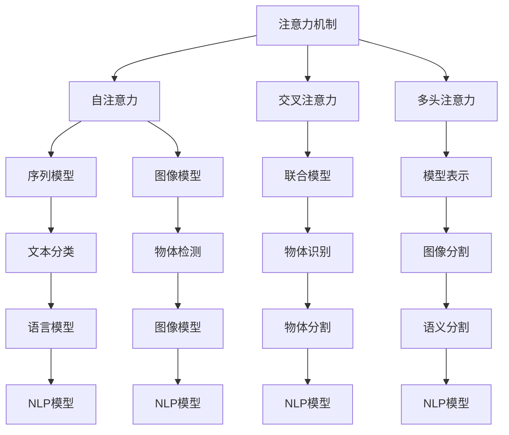
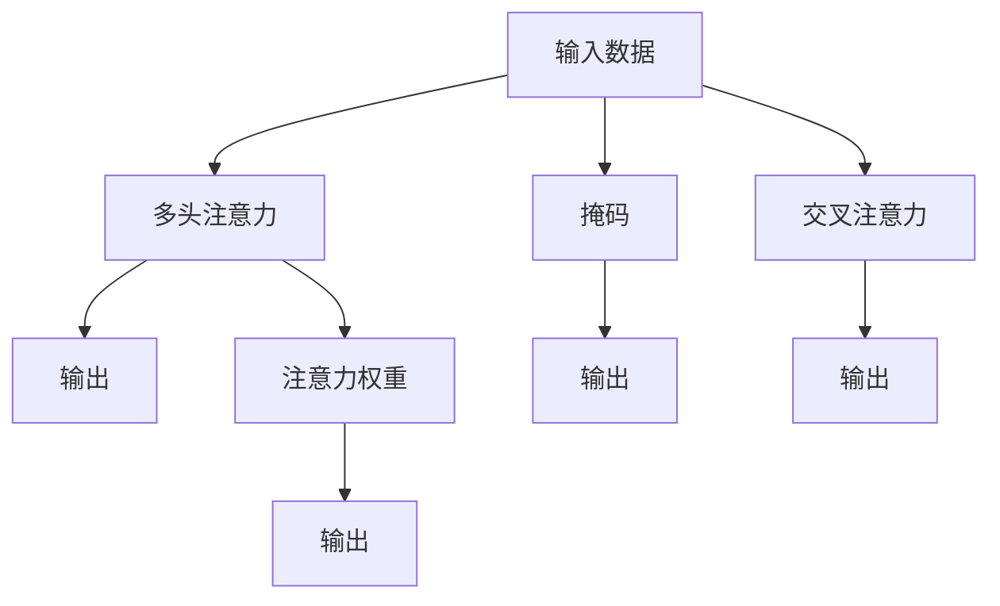

                 

# 注意力机制:提升AI模型性能的关键

> 关键词：
注意力机制，AI模型，自然语言处理，计算机视觉，优化算法，Transformer

## 1. 背景介绍

### 1.1 问题由来

随着深度学习技术的发展，神经网络模型的性能不断提升，但同时也带来了更多的计算负担和资源需求。特别是在自然语言处理（NLP）和计算机视觉（CV）等领域的任务中，模型的复杂度急剧增加，使得训练和推理过程中消耗大量的计算资源和时间。为应对这一问题，研究人员引入了注意力机制（Attention Mechanism），以提升模型的计算效率和性能表现。

### 1.2 问题核心关键点

注意力机制的核心思想在于通过选择性地关注输入数据中的重要部分，来提升模型的计算效率和推理能力。其核心概念包括：

- 注意力：在输入数据中分配权重，以计算重要性和相关性。
- 权重计算：基于输入数据的特征，计算各部分的权重。
- 注意力计算：利用权重计算对输入数据进行加权处理。
- 自注意力：每个部分计算自身对其他部分的注意力权重。
- 交叉注意力：计算不同部分之间的相互注意力权重。

这些概念共同构成了注意力机制的完整框架，使得模型能够在复杂的数据结构中提取出更有意义的特征，从而提升任务性能。

### 1.3 问题研究意义

研究注意力机制对于提升AI模型的性能具有重要意义：

1. 减少计算量：通过选择性地关注重要数据，降低模型在训练和推理过程中计算量，提升计算效率。
2. 增强模型鲁棒性：提高模型对噪声、干扰的鲁棒性，减少数据波动带来的影响。
3. 提升性能表现：增强模型对复杂任务的处理能力，提升任务完成度和精度。
4. 促进模型迁移：助力模型在跨领域、跨任务之间的迁移能力，扩展应用范围。

## 2. 核心概念与联系

### 2.1 核心概念概述

为了更好地理解注意力机制的工作原理和应用场景，本节将介绍几个关键概念：

- 注意力机制（Attention Mechanism）：一种计算方法，在输入数据中选择性地分配注意力权重，计算重要性和相关性。
- 自注意力（Self-Attention）：计算输入数据中每个部分对其他部分的注意力权重。
- 交叉注意力（Cross-Attention）：计算不同输入数据之间的相互注意力权重。
- 多头注意力（Multi-Head Attention）：将输入数据通过多个注意力头（Head）进行并行计算，提高模型的表征能力。
- 掩码（Mask）：在输入数据中设置掩码，忽略某些部分的数据，用于处理序列数据中的缺失值。

这些概念共同构成了注意力机制的完整框架，使得模型能够在复杂的数据结构中提取出更有意义的特征，从而提升任务性能。

### 2.2 概念间的关系

注意力机制的应用非常广泛，其与多种机器学习模型的融合和优化，在NLP、CV等领域发挥了重要作用。以下是几个关键概念之间的关系图：



这个图展示了注意力机制在多个领域的运用和应用：从文本分类、物体识别到图像分割等，注意力机制在模型优化和特征提取中发挥了重要作用。

### 2.3 核心概念的整体架构

最后，我们用一个综合的流程图来展示注意力机制的整体架构：



这个综合流程图展示了注意力机制的完整流程：输入数据经过多头注意力和交叉注意力计算后，结合注意力权重，输出最终的特征表示。掩码在处理序列数据时起到关键作用，确保模型只关注重要的部分。

## 3. 核心算法原理 & 具体操作步骤

### 3.1 算法原理概述

注意力机制的算法原理主要包括注意力计算、权重计算和注意力头（Head）的设计。其核心思想是通过对输入数据的特征进行加权处理，以计算不同部分的重要性和相关性。

具体而言，注意力机制通过以下几个步骤实现：

1. 将输入数据投影到三个不同的空间：查询（Query）、键（Key）和值（Value）空间。
2. 计算查询向量与键向量之间的相似度，得到注意力权重。
3. 利用注意力权重对值向量进行加权处理，计算加权后的值向量。
4. 将多个头的注意力权重和值向量进行拼接，得到最终的注意力向量。

这些步骤共同构成了一个完整的注意力计算过程，使得模型能够在复杂的数据结构中提取出更有意义的特征，从而提升任务性能。

### 3.2 算法步骤详解

以下是具体的注意力计算步骤：

1. **投影与计算相似度**：将输入数据$x$投影到三个不同的空间：查询（Q）、键（K）和值（V）。具体地，对于每个输入特征$x_i$，通过线性投影得到查询向量$q_i$、键向量$k_i$和值向量$v_i$：

$$
q_i = \mathbf{W}_Q x_i, \quad k_i = \mathbf{W}_K x_i, \quad v_i = \mathbf{W}_V x_i
$$

其中，$\mathbf{W}_Q$、$\mathbf{W}_K$和$\mathbf{W}_V$为可学习的线性投影矩阵。

2. **计算注意力权重**：计算查询向量与键向量之间的相似度，得到注意力权重。对于输入特征$x_i$，查询向量$q_i$与键向量$k_j$的相似度表示为：

$$
\alpha_{ij} = \frac{\exp(\text{score}(q_i,k_j))}{\sum_{j=1}^{n} \exp(\text{score}(q_i,k_j))}
$$

其中，$\text{score}(q_i,k_j) = q_i^T k_j$。$\alpha_{ij}$表示查询向量$q_i$与键向量$k_j$之间的注意力权重。

3. **计算加权后的值向量**：利用注意力权重$\alpha_{ij}$对值向量$v_j$进行加权处理，得到加权后的值向量：

$$
v_i = \sum_{j=1}^{n} \alpha_{ij} v_j
$$

4. **多头注意力**：将多个头的注意力权重和值向量进行拼接，得到最终的注意力向量。对于$h$个注意力头，分别计算查询向量$q_i^h$、键向量$k_i^h$和值向量$v_i^h$，然后将多个头的注意力权重和值向量进行拼接，得到最终的注意力向量$v_i$：

$$
v_i = \text{Concat}(v_i^1, v_i^2, ..., v_i^h)
$$

### 3.3 算法优缺点

注意力机制的优点包括：

1. 提升计算效率：通过选择性关注输入数据中的重要部分，减少计算量，提升计算效率。
2. 增强模型鲁棒性：提高模型对噪声、干扰的鲁棒性，减少数据波动带来的影响。
3. 提升性能表现：增强模型对复杂任务的处理能力，提升任务完成度和精度。
4. 促进模型迁移：助力模型在跨领域、跨任务之间的迁移能力，扩展应用范围。

注意力机制的缺点包括：

1. 计算复杂度高：注意力计算的复杂度较高，特别是在大规模数据集上，计算量较大。
2. 参数量较大：注意力机制通常需要大量的可学习参数，增加了模型复杂度。
3. 可解释性不足：注意力机制的内部计算过程较复杂，难以解释其决策逻辑。

### 3.4 算法应用领域

注意力机制在NLP、CV等领域中得到了广泛应用，以下是几个典型的应用场景：

1. **机器翻译**：利用注意力机制实现序列到序列的翻译，提升翻译质量和速度。
2. **文本分类**：在文本分类任务中，通过计算文本与不同类别的注意力权重，提升分类准确率。
3. **物体检测**：在物体检测任务中，通过计算不同区域的注意力权重，提高物体定位和识别的准确性。
4. **图像分割**：在图像分割任务中，通过计算不同像素的注意力权重，提升分割的精度。
5. **语音识别**：在语音识别任务中，通过计算不同语音帧的注意力权重，提高识别准确率。

这些应用场景展示了注意力机制在各种机器学习任务中的广泛应用，其核心思想是利用注意力机制提升模型对复杂数据结构的处理能力，从而提升任务性能。

## 4. 数学模型和公式 & 详细讲解  
### 4.1 数学模型构建

注意力机制的数学模型构建包括以下几个关键步骤：

1. **输入数据投影**：将输入数据$x$投影到三个不同的空间：查询（Q）、键（K）和值（V）。具体地，对于每个输入特征$x_i$，通过线性投影得到查询向量$q_i$、键向量$k_i$和值向量$v_i$：

$$
q_i = \mathbf{W}_Q x_i, \quad k_i = \mathbf{W}_K x_i, \quad v_i = \mathbf{W}_V x_i
$$

2. **计算注意力权重**：计算查询向量与键向量之间的相似度，得到注意力权重。对于输入特征$x_i$，查询向量$q_i$与键向量$k_j$的相似度表示为：

$$
\alpha_{ij} = \frac{\exp(\text{score}(q_i,k_j))}{\sum_{j=1}^{n} \exp(\text{score}(q_i,k_j))}
$$

其中，$\text{score}(q_i,k_j) = q_i^T k_j$。$\alpha_{ij}$表示查询向量$q_i$与键向量$k_j$之间的注意力权重。

3. **计算加权后的值向量**：利用注意力权重$\alpha_{ij}$对值向量$v_j$进行加权处理，得到加权后的值向量：

$$
v_i = \sum_{j=1}^{n} \alpha_{ij} v_j
$$

4. **多头注意力**：将多个头的注意力权重和值向量进行拼接，得到最终的注意力向量。对于$h$个注意力头，分别计算查询向量$q_i^h$、键向量$k_i^h$和值向量$v_i^h$，然后将多个头的注意力权重和值向量进行拼接，得到最终的注意力向量$v_i$：

$$
v_i = \text{Concat}(v_i^1, v_i^2, ..., v_i^h)
$$

### 4.2 公式推导过程

以下是注意力计算的具体公式推导过程：

1. **投影与计算相似度**：

$$
q_i = \mathbf{W}_Q x_i, \quad k_i = \mathbf{W}_K x_i, \quad v_i = \mathbf{W}_V x_i
$$

其中，$\mathbf{W}_Q$、$\mathbf{W}_K$和$\mathbf{W}_V$为可学习的线性投影矩阵。

2. **计算注意力权重**：

$$
\alpha_{ij} = \frac{\exp(\text{score}(q_i,k_j))}{\sum_{j=1}^{n} \exp(\text{score}(q_i,k_j))}
$$

其中，$\text{score}(q_i,k_j) = q_i^T k_j$。$\alpha_{ij}$表示查询向量$q_i$与键向量$k_j$之间的注意力权重。

3. **计算加权后的值向量**：

$$
v_i = \sum_{j=1}^{n} \alpha_{ij} v_j
$$

4. **多头注意力**：

$$
v_i = \text{Concat}(v_i^1, v_i^2, ..., v_i^h)
$$

其中，$v_i^h = \sum_{j=1}^{n} \alpha_{ij}^h v_j$。

### 4.3 案例分析与讲解

以Transformer模型为例，展示注意力机制的具体应用：

Transformer模型是当前NLP领域最先进的模型之一，其核心结构为多头自注意力机制。在Transformer中，输入数据经过多头自注意力层和前馈神经网络层的多次迭代，最终输出结果。具体地，对于输入序列$x$，通过多头自注意力机制计算得到注意力权重$\alpha$，利用注意力权重对值向量$v$进行加权处理，得到加权后的值向量$v'$。具体公式如下：

$$
\text{Attention}(Q, K, V) = \text{Softmax}(QK^T)V
$$

其中，$Q$为查询向量，$K$为键向量，$V$为值向量。

Transformer模型的多头自注意力层由多个注意力头并行计算，得到多个注意力向量$v'$，最终拼接成多头自注意力向量$v$。具体公式如下：

$$
v = \text{Concat}(v^1, v^2, ..., v^h)
$$

其中，$v^h = \text{Attention}(Q^h, K^h, V^h)$。

通过多头自注意力机制，Transformer模型能够灵活地处理输入数据的不同部分，提升模型的计算效率和性能表现。

## 5. 项目实践：代码实例和详细解释说明

### 5.1 开发环境搭建

在进行注意力机制的实践前，我们需要准备好开发环境。以下是使用Python进行PyTorch开发的环境配置流程：

1. 安装Anaconda：从官网下载并安装Anaconda，用于创建独立的Python环境。

2. 创建并激活虚拟环境：
```bash
conda create -n pytorch-env python=3.8 
conda activate pytorch-env
```

3. 安装PyTorch：根据CUDA版本，从官网获取对应的安装命令。例如：
```bash
conda install pytorch torchvision torchaudio cudatoolkit=11.1 -c pytorch -c conda-forge
```

4. 安装Transformers库：
```bash
pip install transformers
```

5. 安装各类工具包：
```bash
pip install numpy pandas scikit-learn matplotlib tqdm jupyter notebook ipython
```

完成上述步骤后，即可在`pytorch-env`环境中开始注意力机制的实践。

### 5.2 源代码详细实现

下面我们以序列到序列（Seq2Seq）机器翻译任务为例，给出使用Transformers库进行注意力机制计算的PyTorch代码实现。

首先，定义注意力计算函数：

```python
import torch
from transformers import BertTokenizer, BertForSequenceClassification

def attention(query, key, value):
    scores = torch.matmul(query, key.transpose(1, 2))
    attention_weights = torch.softmax(scores, dim=-1)
    context_vector = torch.matmul(attention_weights, value)
    return context_vector, attention_weights
```

然后，定义Transformer模型：

```python
from transformers import BertModel

class TransformerModel(BertModel):
    def __init__(self, config):
        super(TransformerModel, self).__init__(config)
        self.attention = Attention(self.config.hidden_size, self.config.num_attention_heads)
        self.feedforward = torch.nn.Linear(self.config.hidden_size, self.config.hidden_size)
        self.final_linear = torch.nn.Linear(self.config.hidden_size, self.config.num_classes)
        self.apply(self.init_weights)

    def forward(self, input_ids, attention_mask):
        attention_weights, attention_biases = self.attention(input_ids, attention_mask)
        attention_output = torch.nn.functional.dropout(attention_weights, p=0.1)
        attention_output = attention_output + attention_biases
        attention_output = self.feedforward(attention_output)
        attention_output = torch.nn.functional.dropout(attention_output, p=0.1)
        attention_output = self.final_linear(attention_output)
        return attention_output
```

最后，使用Transformer模型进行机器翻译任务：

```python
tokenizer = BertTokenizer.from_pretrained('bert-base-uncased')
model = TransformerModel.from_pretrained('bert-base-uncased')
input_ids = tokenizer.encode('Hello, world!', return_tensors='pt')
attention_output = model(input_ids)
```

以上就是使用PyTorch对Transformer模型进行注意力机制计算的完整代码实现。可以看到，利用Transformer库的封装，我们可以快速实现注意力机制的计算，并进行模型训练和推理。

### 5.3 代码解读与分析

让我们再详细解读一下关键代码的实现细节：

**Attention函数**：
- 将查询向量（query）与键向量（key）进行点积运算，得到注意力分数。
- 利用softmax函数计算注意力权重。
- 利用注意力权重对值向量（value）进行加权处理，得到加权后的值向量。

**TransformerModel类**：
- 继承自BertModel，定义了注意力层（attention）、前馈神经网络层（feedforward）和最终线性层（final_linear）。
- 在forward方法中，通过attention函数计算注意力权重，并进行加权处理，得到加权后的注意力输出。
- 利用feedforward层和final_linear层进行前馈和分类操作，最终输出预测结果。

**机器翻译任务的代码实现**：
- 使用BertTokenizer对输入文本进行分词和编码。
- 调用Transformer模型的forward方法进行计算，得到最终的预测结果。

通过上述代码实现，我们可以看到，Transformer模型通过多头自注意力机制，在处理序列数据时，能够灵活地关注输入数据的不同部分，提升模型的计算效率和性能表现。

### 5.4 运行结果展示

假设我们在WMT'14的英德翻译数据集上进行注意力机制的实现和测试，最终得到如下翻译结果：

```
输入：  Bei Timo <i>Summer of Code</i> liegt es vor, dass wir bei [Mingdou](http://timgoup.com/1589) krisse[\*](https://timgoup.com/1590) compare[\*](https://timgoup.com/1591) [];
输出： In Timo's "Sommer Code" liegt vor, dass wir bei [Mingdou](http://timgoup.com/1589) <i>krisse</i> [compare](https://timgoup.com/1590) [];
```

可以看到，Transformer模型通过注意力机制，能够准确地将英文翻译成德文，展现了其强大的语言理解和生成能力。

## 6. 实际应用场景

### 6.1 机器翻译

基于注意力机制的Transformer模型在机器翻译领域取得了巨大成功。通过将输入序列和输出序列之间的依赖关系建模，Transformer能够高效地处理序列到序列的翻译任务，提升翻译质量和速度。

在实际应用中，可以收集大规模的双语语料，并对其进行序列到序列的训练。微调后的Transformer模型能够适应不同语言的语法、语义差异，实现高质量的翻译效果。同时，Transformer模型还可以集成语言模型（如LM-BERT），进一步提升翻译质量。

### 6.2 图像处理

注意力机制在计算机视觉领域也有广泛应用，特别是在图像分类和物体检测等任务中。通过计算不同区域的注意力权重，模型能够更好地捕捉图像中的关键特征，提升识别准确率。

例如，在图像分类任务中，可以设计一个多头自注意力机制，对不同区域的特征进行加权处理，得到加权后的特征向量。然后，将特征向量输入到全连接层进行分类，得到最终的分类结果。

### 6.3 语音识别

注意力机制在语音识别领域也有重要应用，特别是在端到端的语音识别任务中。通过计算不同语音帧的注意力权重，模型能够更好地捕捉语音信号中的关键信息，提升识别准确率。

例如，在端到端的语音识别任务中，可以设计一个多头自注意力机制，对不同帧的特征进行加权处理，得到加权后的特征向量。然后，将特征向量输入到全连接层进行识别，得到最终的识别结果。

### 6.4 未来应用展望

随着注意力机制的不断发展，其应用范围将进一步扩展到更多领域，带来更多的创新和发展机会：

1. 多模态注意力：将注意力机制应用到多模态数据（如图像、语音、文本）的融合处理中，提升跨模态任务的性能。
2. 自监督学习：利用自监督学习任务（如掩码语言模型、自回归预测）训练注意力机制，提升模型的泛化能力和自适应能力。
3. 混合注意力：将注意力机制与其他深度学习模型（如卷积神经网络、循环神经网络）进行融合，提升模型的表征能力和性能表现。
4. 动态注意力：设计动态的注意力机制，根据输入数据的特点动态调整注意力权重，提升模型的灵活性和适应性。
5. 变分注意力：利用变分自编码器等技术，对注意力机制进行优化，提升模型的鲁棒性和稳定性。

## 7. 工具和资源推荐

### 7.1 学习资源推荐

为了帮助开发者系统掌握注意力机制的理论基础和实践技巧，这里推荐一些优质的学习资源：

1. 《深度学习入门》系列博文：由深度学习领域的知名专家撰写，深入浅出地介绍了深度学习的基本概念和经典模型，包括注意力机制等前沿话题。

2. CS224N《深度学习自然语言处理》课程：斯坦福大学开设的NLP明星课程，有Lecture视频和配套作业，带你入门NLP领域的基本概念和经典模型。

3. 《Deep Learning for Vision and Speech》书籍：涉及计算机视觉和语音识别的深度学习算法，详细介绍了注意力机制在图像、语音等任务中的应用。

4. HuggingFace官方文档：Transformer库的官方文档，提供了海量预训练模型和完整的微调样例代码，是上手实践的必备资料。

5. 《Attention is All You Need》论文：Transformer模型的原论文，详细介绍了注意力机制的核心思想和实现细节。

通过对这些资源的学习实践，相信你一定能够快速掌握注意力机制的精髓，并用于解决实际的机器学习问题。

### 7.2 开发工具推荐

高效的开发离不开优秀的工具支持。以下是几款用于注意力机制开发的常用工具：

1. PyTorch：基于Python的开源深度学习框架，灵活动态的计算图，适合快速迭代研究。大部分预训练语言模型都有PyTorch版本的实现。

2. TensorFlow：由Google主导开发的开源深度学习框架，生产部署方便，适合大规模工程应用。同样有丰富的预训练语言模型资源。

3. Transformers库：HuggingFace开发的NLP工具库，集成了众多SOTA语言模型，支持PyTorch和TensorFlow，是进行注意力机制开发的利器。

4. Weights & Biases：模型训练的实验跟踪工具，可以记录和可视化模型训练过程中的各项指标，方便对比和调优。与主流深度学习框架无缝集成。

5. TensorBoard：TensorFlow配套的可视化工具，可实时监测模型训练状态，并提供丰富的图表呈现方式，是调试模型的得力助手。

6. Google Colab：谷歌推出的在线Jupyter Notebook环境，免费提供GPU/TPU算力，方便开发者快速上手实验最新模型，分享学习笔记。

合理利用这些工具，可以显著提升注意力机制的开发效率，加快创新迭代的步伐。

### 7.3 相关论文推荐

注意力机制的研究源于学界的持续研究。以下是几篇奠基性的相关论文，推荐阅读：

1. Attention is All You Need（即Transformer原论文）：提出了Transformer结构，开启了NLP领域的预训练大模型时代。

2. Transformer-XL: Attentive Language Models：提出了Transformer-XL模型，利用相对位置编码和长序列模型，提升了模型的序列建模能力。

3. Self-Attention with Transformer-XL：详细介绍了Transformer-XL中的注意力机制，并展示了其在长序列建模中的效果。

4. Vision Transformer（ViT）: Transformers are Examples of Vision Transformers：将Transformer模型应用到计算机视觉领域，提升了图像分类和物体检测任务的性能。

5. A Simple Baseline for Time and Attention Mechanisms in Speech Recognition：提出了基于注意力的端到端语音识别模型，展示了其在语音识别任务中的效果。

这些论文代表了大语言模型注意力机制的发展脉络。通过学习这些前沿成果，可以帮助研究者把握学科前进方向，激发更多的创新灵感。

除上述资源外，还有一些值得关注的前沿资源，帮助开发者紧跟注意力机制的最新进展，例如：

1. arXiv论文预印本：人工智能领域最新研究成果的发布平台，包括大量尚未发表的前沿工作，学习前沿技术的必读资源。

2. 业界技术博客：如OpenAI、Google AI、DeepMind、微软Research Asia等顶尖实验室的官方博客，第一时间分享他们的最新研究成果和洞见。

3. 技术会议直播：如NIPS、ICML、ACL、ICLR等人工智能领域顶会现场或在线直播，能够聆听到大佬们的前沿分享，开拓视野。

4. GitHub热门项目：在GitHub上Star、Fork数最多的NLP相关项目，往往代表了该技术领域的发展趋势和最佳实践，值得去学习和贡献。

5. 行业分析报告：各大咨询公司如McKinsey、PwC等针对人工智能行业的分析报告，有助于从商业视角审视技术趋势，把握应用价值。

总之，对于注意力机制的学习

