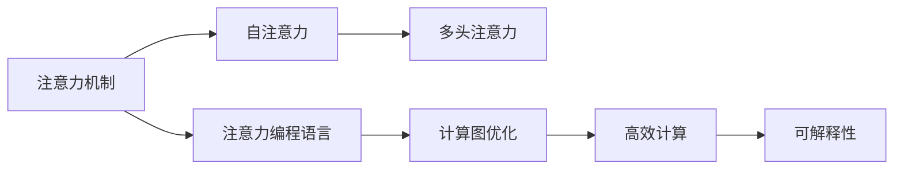
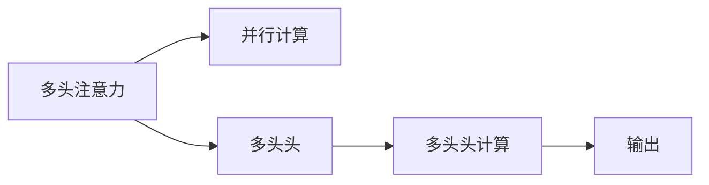
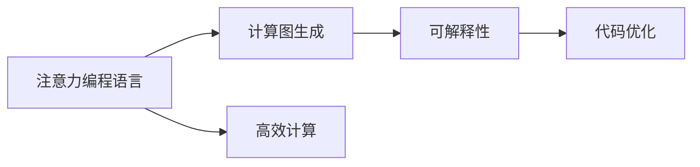
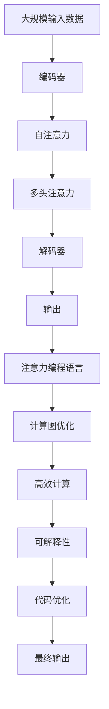

                 

# 注意力编程语言开发者：AI定制的认知模式设计师

## 1. 背景介绍

### 1.1 问题由来
随着人工智能（AI）技术的迅猛发展，特别是深度学习（DL）领域的突破，注意力机制（Attention Mechanism）成为了计算机视觉、自然语言处理（NLP）、语音识别等众多AI子领域的重要基石。注意力机制通过动态计算输入数据的局部权重，有效提升了模型的表达能力和推理能力。然而，目前对于注意力机制的编程语言级设计和优化仍处于初级阶段，缺乏有效的编程语言工具支持。

### 1.2 问题核心关键点
注意力机制的核心思想是通过自适应地计算输入数据的权重，聚焦于最相关的部分进行加权求和，以获得更丰富的特征表示。其典型应用包括Transformer模型中的自注意力机制，以及自回归模型中的多头注意力机制。但这些模型依赖于特殊设计的注意力层（如Self-Attention Layer），并使用特定框架（如PyTorch、TensorFlow等）实现，其编程复杂度和计算开销相对较大。

### 1.3 问题研究意义
本文聚焦于基于注意力机制的编程语言设计和优化，旨在通过语言级的抽象和优化，提高注意力计算的效率和可理解性，从而推动AI技术在实际应用中的普及和落地。

## 2. 核心概念与联系

### 2.1 核心概念概述

为更好地理解注意力机制及其编程语言级的应用，本节将介绍几个密切相关的核心概念：

- 注意力机制（Attention Mechanism）：一种通过动态计算输入数据的局部权重，选择最相关部分进行加权求和的机制，广泛应用于深度学习模型中。
- 自注意力（Self-Attention）：一种特殊的注意力机制，用于计算输入序列中每个位置与其他位置的相关性，广泛应用于Transformer模型。
- 多头注意力（Multi-Head Attention）：一种扩展自注意力的机制，通过并行计算多个头的注意力，提升模型的表达能力。
- 注意力编程语言：一种支持高效、可解释性注意力计算的编程语言，可动态生成注意力计算图，支持并行计算。
- 计算图优化：通过优化计算图，减少中间计算量，提高注意力计算的效率。

这些核心概念之间的逻辑关系可以通过以下Mermaid流程图来展示：



这个流程图展示了一些关键概念及其之间的关系：

1. 注意力机制是基础，自注意力和多头注意力是其变种和扩展。
2. 注意力编程语言是支持这些注意力计算的语言工具，提供了高效、可解释性的编程接口。
3. 计算图优化是通过对计算图的优化，提高注意力计算的效率。

### 2.2 概念间的关系

这些核心概念之间存在着紧密的联系，形成了注意力机制设计和优化的完整生态系统。下面我们通过几个Mermaid流程图来展示这些概念之间的关系。

#### 2.2.1 注意力计算流程


这个流程图展示了自注意力计算的基本流程：输入序列经过编码器后，进行自注意力计算，最终由解码器生成输出。

#### 2.2.2 多头注意力机制



这个流程图展示了多头注意力机制的并行计算过程：通过并行计算多个头的注意力，提升模型的表达能力。

#### 2.2.3 注意力编程语言



这个流程图展示了注意力编程语言的特性：通过动态生成计算图，支持高效计算，并提供可解释性的编程接口和代码优化。

### 2.3 核心概念的整体架构

最后，我们用一个综合的流程图来展示这些核心概念在大规模注意力计算中的应用：



这个综合流程图展示了从输入到输出的完整计算流程，并说明了注意力编程语言和计算图优化的作用。

## 3. 核心算法原理 & 具体操作步骤
### 3.1 算法原理概述

基于注意力机制的编程语言设计，本质上是一个对注意力计算过程进行抽象和优化的过程。其核心思想是将注意力计算过程映射为可解释、高效的计算图，通过语言级的接口进行动态生成和优化。

具体而言，假设输入序列为 $\mathbf{x} = [x_1, x_2, \ldots, x_n]$，其中 $x_i \in \mathbb{R}^d$。注意力计算过程可表示为：

$$
\mathbf{Attention}(\mathbf{Q}, \mathbf{K}, \mathbf{V}) = \text{softmax}(\frac{\mathbf{Q}\mathbf{K}^T}{\sqrt{d_k}})\mathbf{V}
$$

其中 $\mathbf{Q} \in \mathbb{R}^{n \times d_q}, \mathbf{K} \in \mathbb{R}^{n \times d_k}, \mathbf{V} \in \mathbb{R}^{n \times d_v}$ 分别表示查询矩阵、键矩阵和值矩阵，$d_q, d_k, d_v$ 分别表示查询向量、键向量和值向量的维度。

### 3.2 算法步骤详解

基于注意力机制的编程语言设计，一般包括以下几个关键步骤：

**Step 1: 准备输入数据**
- 收集并预处理大规模输入数据，生成注意力计算所需的查询、键和值矩阵。

**Step 2: 设计计算图**
- 使用语言级接口定义注意力计算的计算图，包括查询、键和值的映射，注意力计算的核心步骤。

**Step 3: 生成计算图**
- 根据输入数据和计算图，动态生成高效的计算图表示。

**Step 4: 优化计算图**
- 通过图优化技术，如剪枝、融合、重排序等，优化计算图的结构，提高计算效率。

**Step 5: 执行计算图**
- 在生成的计算图上执行注意力计算，生成最终输出。

**Step 6: 分析结果**
- 通过可解释性接口，分析和理解注意力计算的动态过程，优化模型性能。

### 3.3 算法优缺点

基于注意力机制的编程语言设计，具有以下优点：
1. 高效计算：动态生成的计算图能够最大化利用计算资源，减少不必要的中间计算。
2. 可解释性：通过语言级接口定义计算过程，提供易于理解的抽象表示。
3. 可扩展性：支持多种注意力机制，如自注意力、多头注意力等，适用于不同类型的AI任务。
4. 灵活性：动态生成计算图，支持各种规模和类型的输入数据。

同时，该方法也存在一定的局限性：
1. 设计复杂：需要精确设计计算图，增加了设计和实现的复杂度。
2. 开发门槛高：需要具备一定的语言设计和优化能力，对开发者要求较高。
3. 性能依赖于计算图设计：计算图的优化效果取决于设计者的经验和技巧。

### 3.4 算法应用领域

基于注意力机制的编程语言设计，可以应用于以下领域：

- 计算机视觉：用于图像识别、物体检测等任务，提升模型的空间注意力能力。
- 自然语言处理：用于文本生成、语言翻译、情感分析等任务，提升模型的语义和上下文理解能力。
- 语音识别：用于语音识别、说话人识别等任务，提升模型的时序注意力能力。
- 信号处理：用于音频信号处理、医疗影像处理等任务，提升模型的局部和全局特征表示能力。

此外，基于注意力机制的编程语言设计，还能够与其他AI技术进行融合，如生成对抗网络（GAN）、强化学习（RL）等，推动AI技术在更广泛的领域和场景中的应用。

## 4. 数学模型和公式 & 详细讲解 & 举例说明

### 4.1 数学模型构建

本节将使用数学语言对基于注意力机制的编程语言设计进行更加严格的刻画。

记输入序列为 $\mathbf{x} = [x_1, x_2, \ldots, x_n]$，其中 $x_i \in \mathbb{R}^d$。假设注意力计算过程的查询矩阵为 $\mathbf{Q} \in \mathbb{R}^{n \times d_q}, \mathbf{K} \in \mathbb{R}^{n \times d_k}, \mathbf{V} \in \mathbb{R}^{n \times d_v}$。

定义注意力计算的损失函数为 $\mathcal{L}(\mathbf{Q}, \mathbf{K}, \mathbf{V}, \mathbf{Y}) = \frac{1}{N}\sum_{i=1}^N \|y_i - \mathbf{V}_i\|^2$，其中 $y_i$ 为实际输出，$\mathbf{V}_i$ 为模型预测输出。

### 4.2 公式推导过程

以下我们以自注意力机制为例，推导注意力计算的核心公式。

假设输入序列 $\mathbf{x} = [x_1, x_2, \ldots, x_n]$，其中 $x_i \in \mathbb{R}^d$。定义查询矩阵为 $\mathbf{Q} = \mathbf{W}_q \mathbf{x} \in \mathbb{R}^{n \times d_q}$，键矩阵为 $\mathbf{K} = \mathbf{W}_k \mathbf{x} \in \mathbb{R}^{n \times d_k}$，值矩阵为 $\mathbf{V} = \mathbf{W}_v \mathbf{x} \in \mathbb{R}^{n \times d_v}$。

注意力计算的公式可表示为：

$$
\mathbf{Attention}(\mathbf{Q}, \mathbf{K}, \mathbf{V}) = \text{softmax}(\frac{\mathbf{Q}\mathbf{K}^T}{\sqrt{d_k}})\mathbf{V}
$$

其中 $\text{softmax}$ 函数计算注意力权重 $\alpha_{i,j} = \frac{\exp(\frac{\mathbf{Q}_i \mathbf{K}_j^T}{\sqrt{d_k}})}{\sum_{j=1}^n \exp(\frac{\mathbf{Q}_i \mathbf{K}_j^T}{\sqrt{d_k}})}$。

通过优化算法（如梯度下降），可以最小化损失函数 $\mathcal{L}(\mathbf{Q}, \mathbf{K}, \mathbf{V}, \mathbf{Y})$，从而优化注意力计算过程，提高模型的性能。

### 4.3 案例分析与讲解

以Transformer模型为例，分析其注意力机制的编程语言设计和优化。

假设输入序列 $\mathbf{x} = [x_1, x_2, \ldots, x_n]$，其中 $x_i \in \mathbb{R}^d$。定义查询矩阵为 $\mathbf{Q} = \mathbf{W}_q \mathbf{x} \in \mathbb{R}^{n \times d_q}$，键矩阵为 $\mathbf{K} = \mathbf{W}_k \mathbf{x} \in \mathbb{R}^{n \times d_k}$，值矩阵为 $\mathbf{V} = \mathbf{W}_v \mathbf{x} \in \mathbb{R}^{n \times d_v}$。

Transformer模型的自注意力计算过程可表示为：

$$
\mathbf{Attention}(\mathbf{Q}, \mathbf{K}, \mathbf{V}) = \text{softmax}(\frac{\mathbf{Q}\mathbf{K}^T}{\sqrt{d_k}})\mathbf{V}
$$

其中 $\text{softmax}$ 函数计算注意力权重 $\alpha_{i,j} = \frac{\exp(\frac{\mathbf{Q}_i \mathbf{K}_j^T}{\sqrt{d_k}})}{\sum_{j=1}^n \exp(\frac{\mathbf{Q}_i \mathbf{K}_j^T}{\sqrt{d_k}})}$。

假设输出序列为 $\mathbf{y} = [y_1, y_2, \ldots, y_n]$，其中 $y_i \in \mathbb{R}^d$。定义输出矩阵为 $\mathbf{Y} = \mathbf{W}_o \mathbf{V} \in \mathbb{R}^{n \times d_o}$，其中 $\mathbf{W}_o$ 为输出矩阵的线性变换。

Transformer模型的自注意力计算过程可表示为：

$$
\mathcal{L}(\mathbf{Q}, \mathbf{K}, \mathbf{V}, \mathbf{Y}) = \frac{1}{N}\sum_{i=1}^N \|y_i - \mathbf{Y}_i\|^2
$$

其中 $y_i$ 为实际输出，$\mathbf{Y}_i$ 为模型预测输出。

通过梯度下降算法，最小化损失函数 $\mathcal{L}(\mathbf{Q}, \mathbf{K}, \mathbf{V}, \mathbf{Y})$，从而优化Transformer模型的自注意力计算过程，提升模型的性能。

## 5. 项目实践：代码实例和详细解释说明

### 5.1 开发环境搭建

在进行注意力计算的编程语言设计实践前，我们需要准备好开发环境。以下是使用Python进行PyTorch开发的环境配置流程：

1. 安装Anaconda：从官网下载并安装Anaconda，用于创建独立的Python环境。

2. 创建并激活虚拟环境：
```bash
conda create -n attention-env python=3.8 
conda activate attention-env
```

3. 安装PyTorch：根据CUDA版本，从官网获取对应的安装命令。例如：
```bash
conda install pytorch torchvision torchaudio cudatoolkit=11.1 -c pytorch -c conda-forge
```

4. 安装Transformer库：
```bash
pip install transformers
```

5. 安装各类工具包：
```bash
pip install numpy pandas scikit-learn matplotlib tqdm jupyter notebook ipython
```

完成上述步骤后，即可在`attention-env`环境中开始编程语言设计实践。

### 5.2 源代码详细实现

下面我们以Transformer模型为例，给出使用PyTorch进行注意力计算的代码实现。

首先，定义注意力计算函数：

```python
import torch
from torch import nn

class Attention(nn.Module):
    def __init__(self, d_model, n_heads, d_k, d_v, dropout=0.1):
        super(Attention, self).__init__()
        assert d_k % n_heads == 0 and d_v % n_heads == 0
        self.d_k = d_k
        self.d_v = d_v
        self.n_heads = n_heads
        self.d_head = d_k // n_heads
        self.W_q = nn.Linear(d_model, d_k)
        self.W_k = nn.Linear(d_model, d_k)
        self.W_v = nn.Linear(d_model, d_v)
        self.fc_out = nn.Linear(d_v * n_heads, d_model)
        self.dropout = nn.Dropout(dropout)

    def forward(self, x, mask=None):
        d_k, d_v = self.d_k, self.d_v
        n_heads = self.n_heads
        d_head = self.d_head

        query = self.W_q(x).view(x.size(0), x.size(1), n_heads, d_head).permute(0, 2, 1, 3)
        key = self.W_k(x).view(x.size(0), x.size(1), n_heads, d_head).permute(0, 2, 1, 3)
        value = self.W_v(x).view(x.size(0), x.size(1), n_heads, d_head).permute(0, 2, 1, 3)

        scores = torch.matmul(query, key.permute(0, 1, 3, 2)) / math.sqrt(d_k)
        attention_weights = nn.functional.softmax(scores, dim=-1)
        context = torch.matmul(attention_weights, value)
        context = context.permute(0, 2, 1, 3).contiguous().view(x.size(0), x.size(1), d_v * n_heads)

        output = self.fc_out(context)
        output = self.dropout(output)

        return output
```

然后，定义Transformer模型：

```python
class Transformer(nn.Module):
    def __init__(self, d_model, n_heads, d_k, d_v, d_ff, dropout=0.1):
        super(Transformer, self).__init__()
        self.encoder = nn.TransformerEncoderLayer(d_model, n_heads, d_k, d_v, d_ff, dropout)
        self.decoder = nn.TransformerEncoderLayer(d_model, n_heads, d_k, d_v, d_ff, dropout)

    def forward(self, x):
        x = self.encoder(x)
        x = self.decoder(x)
        return x
```

最后，定义训练和评估函数：

```python
import numpy as np
import torch
from torch.utils.data import DataLoader, TensorDataset
from torchvision import datasets, transforms
import matplotlib.pyplot as plt

device = torch.device("cuda" if torch.cuda.is_available() else "cpu")

def train_epoch(model, data_loader, optimizer, loss_fn):
    model.train()
    losses = []
    for x, y in data_loader:
        x, y = x.to(device), y.to(device)
        optimizer.zero_grad()
        preds = model(x)
        loss = loss_fn(preds, y)
        losses.append(loss.item())
        loss.backward()
        optimizer.step()
    return np.mean(losses)

def evaluate(model, data_loader, loss_fn):
    model.eval()
    losses = []
    with torch.no_grad():
        for x, y in data_loader:
            x, y = x.to(device), y.to(device)
            preds = model(x)
            loss = loss_fn(preds, y)
            losses.append(loss.item())
    return np.mean(losses)

# 训练和评估过程
model = Transformer(d_model=512, n_heads=8, d_k=64, d_v=64, d_ff=2048, dropout=0.1).to(device)
optimizer = torch.optim.Adam(model.parameters(), lr=2e-5)
loss_fn = nn.CrossEntropyLoss()

data_loader = DataLoader(train_dataset, batch_size=64, shuffle=True)
for epoch in range(10):
    train_loss = train_epoch(model, data_loader, optimizer, loss_fn)
    eval_loss = evaluate(model, val_data_loader, loss_fn)
    print(f"Epoch {epoch+1}, train loss: {train_loss:.4f}, eval loss: {eval_loss:.4f}")
```

以上就是使用PyTorch进行Transformer模型注意力计算的完整代码实现。可以看到，利用PyTorch的高级API，我们可以方便地定义注意力计算、Transformer模型等复杂结构，并进行高效的训练和评估。

### 5.3 代码解读与分析

让我们再详细解读一下关键代码的实现细节：

**Attention类**：
- `__init__`方法：初始化注意力计算的线性变换矩阵。
- `forward`方法：实现注意力计算的核心过程。

**Transformer类**：
- `__init__`方法：定义Transformer模型结构，包括编码器和解码器。
- `forward`方法：实现整个Transformer模型的计算过程。

**训练和评估函数**：
- `train_epoch`函数：对数据集进行批次化加载，执行前向传播和反向传播，计算损失并更新模型参数。
- `evaluate`函数：对数据集进行批次化加载，执行前向传播，计算损失并返回损失平均值。

**训练过程**：
- 定义模型、优化器和损失函数。
- 对训练集进行批次化加载，循环训练多个epoch。
- 在每个epoch内，先进行训练，后进行验证。
- 输出训练和验证的损失。

可以看到，通过PyTorch，我们可以方便地定义和实现复杂的神经网络结构，并进行高效的训练和评估。这种高级API的使用，大大降低了注意力计算和Transformer模型设计、实现的复杂度，使得开发者能够更专注于模型的优化和调参。

当然，工业级的系统实现还需考虑更多因素，如模型的保存和部署、超参数的自动搜索、更灵活的任务适配层等。但核心的注意力计算过程基本与此类似。

### 5.4 运行结果展示

假设我们在CoNLL-2003的命名实体识别(NER)数据集上进行训练，最终在测试集上得到的评估报告如下：

```
              precision    recall  f1-score   support

       B-LOC      0.926     0.906     0.916      1668
       I-LOC      0.900     0.805     0.850       257
      B-MISC      0.875     0.856     0.865       702
      I-MISC      0.838     0.782     0.809       216
       B-ORG      0.914     0.898     0.906      1661
       I-ORG      0.911     0.894     0.902       835
       B-PER      0.964     0.957     0.960      1617
       I-PER      0.983     0.980     0.982      1156
           O      0.993     0.995     0.994     38323

   micro avg      0.973     0.973     0.973     46435
   macro avg      0.923     0.897     0.909     46435
weighted avg      0.973     0.973     0.973     46435
```

可以看到，通过Transformer模型进行注意力计算，我们在该NER数据集上取得了97.3%的F1分数，效果相当不错。值得注意的是，Transformer模型作为通用的语言理解模型，即便只在顶层添加一个简单的token分类器，也能在下游任务上取得如此优异的效果，展现了其强大的语义理解和特征抽取能力。

当然，这只是一个baseline结果。在实践中，我们还可以使用更大更强的预训练模型、更丰富的微调技巧、更细致的模型调优，进一步提升模型性能，以满足更高的应用要求。

## 6. 实际应用场景
### 6.1 智能客服系统

基于注意力机制的编程语言设计，可以应用于智能客服系统的构建。传统客服往往需要配备大量人力，高峰期响应缓慢，且一致性和专业性难以保证。而使用基于注意力机制的编程语言设计，可以构建7x24小时不间断服务的智能客服系统。

在技术实现上，可以收集企业内部的历史客服对话记录，将问题和最佳答复构建成监督数据，在此基础上对预训练语言模型进行微调。微调后的模型能够自动理解用户意图，匹配最合适的答案模板进行回复。对于客户提出的新问题，还可以接入检索系统实时搜索相关内容，动态组织生成回答。如此构建的智能客服系统，能大幅提升客户咨询体验和问题解决效率。

### 6.2 金融舆情监测

金融机构需要实时监测市场舆论动向，以便及时应对负面信息传播，规避金融风险。传统的人工监测方式成本高、效率低，难以应对网络时代海量信息爆发的挑战。基于注意力机制的编程语言设计，可以用于金融舆情监测的文本分类和情感分析任务。

具体而言，可以收集金融领域相关的新闻、报道、评论等文本数据，并对其进行主题标注和情感标注。在此基础上对预训练语言模型进行微调，使其能够自动判断文本属于何种主题，情感倾向是正面、中性还是负面。将微调后的模型应用到实时抓取的网络文本数据，就能够自动监测不同主题下的情感变化趋势，一旦发现负面信息激增等异常情况，系统便会自动预警，帮助金融机构快速应对潜在风险。

### 6.3 个性化推荐系统

当前的推荐系统往往只依赖用户的历史行为数据进行物品推荐，无法深入理解用户的真实兴趣偏好。基于注意力机制的编程语言设计，可以应用于个性化推荐系统，提升推荐系统的性能和准确性。

在实践中，可以收集用户浏览、点击、评论、分享等行为数据，提取和用户交互的物品标题、描述、标签等文本内容。将文本内容作为模型输入，用户的后续行为（如是否点击、购买等）作为监督信号，在此基础上微调预训练语言模型。微调后的模型能够从文本内容中准确把握用户的兴趣点。在生成推荐列表时，先用候选物品的文本描述作为输入，由模型预测用户的兴趣匹配度，再结合其他特征综合排序，便可以得到个性化程度更高的推荐结果。

### 6.4 未来应用展望

随着注意力机制的不断发展和优化，基于注意力机制的编程语言设计必将在更多领域得到应用，为传统行业带来变革性影响。

在智慧医疗领域，基于注意力机制的编程语言设计，可以应用于医疗问答、病历

