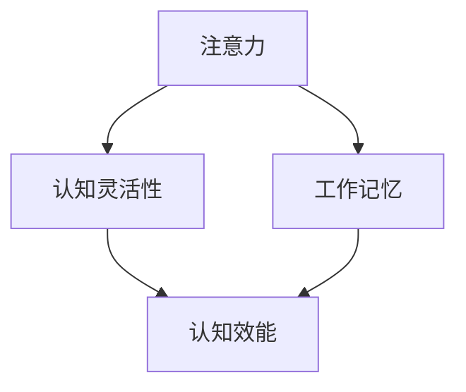

                 

# 注意力训练与认知灵活性：如何增强你的大脑

在快节奏的现代生活中，我们的大脑面临着前所未有的压力和挑战。注意力分散、记忆力减退、学习效率低下等认知问题越来越普遍。幸运的是，近年来，认知神经科学和人工智能领域的研究者们发现，通过注意力训练（Attention Training）可以显著提升大脑的认知灵活性和工作效能。本文将深入探讨注意力训练的原理与实践，帮助你掌握增强大脑认知灵活性的方法，提升个人和组织的效能。

## 1. 背景介绍

### 1.1 问题由来

随着科技的迅猛发展，我们的工作和生活方式发生了巨大的变化。一方面，信息过载和快节奏的生活使得注意力难以集中，许多人在工作中面临分心、易疲劳等问题。另一方面，快速变化的社会需求和知识更新速度要求我们具备更强的学习和适应能力，但当前的教育体系和方法并不能满足这些要求。因此，提升大脑的注意力和认知灵活性，成为了现代人的迫切需求。

### 1.2 问题核心关键点

注意力训练的核心在于通过特定的训练方法，提升大脑的注意力集中能力、认知灵活性和工作记忆。其关键点包括：

1. **注意力集中能力**：提升对单一任务的专注度和注意力持久性，减少分心和干扰。
2. **认知灵活性**：提高在不同任务之间的快速切换和适应能力。
3. **工作记忆**：增强短时记忆和任务处理能力。

这些能力的提升，可以帮助我们更高效地完成复杂任务，提高学习和工作表现，提升生活质量。

### 1.3 问题研究意义

注意力训练的研究不仅有助于个体提升认知能力，对于企业和社会也具有重要意义：

1. **提高工作效率**：通过提升员工的注意力和认知灵活性，可以显著提高工作效率和工作质量，降低错误率。
2. **促进学习与创新**：通过增强大脑的认知能力，可以加速知识的学习和创新，提升企业的竞争力。
3. **提升健康水平**：注意力训练有助于减轻压力、改善情绪，促进身心健康。

## 2. 核心概念与联系

### 2.1 核心概念概述

为更好地理解注意力训练，本节将介绍几个关键概念：

- **注意力**：大脑选择性地集中于特定刺激或信息的能力。
- **认知灵活性**：大脑在不同任务之间快速切换和适应新环境的能力。
- **工作记忆**：大脑暂时存储和处理信息的能力，主要涉及短时记忆和注意力。

这些概念之间存在着紧密的联系，形成了一个整体的认知系统。通过训练注意力，可以提升认知灵活性和工作记忆，从而全面提升大脑的认知效能。

### 2.2 概念间的关系

这些核心概念之间的关系可以通过以下Mermaid流程图来展示：



这个流程图展示了注意力、认知灵活性、工作记忆和认知效能之间的关系：注意力训练可以提升认知灵活性和工作记忆，进而全面提升认知效能。

## 3. 核心算法原理 & 具体操作步骤
### 3.1 算法原理概述

注意力训练通常基于认知心理学和神经科学的原理，通过特定的方法和工具，训练大脑的注意力系统，提升其认知能力。其基本原理包括以下几个方面：

1. **认知负荷理论**：在特定任务中，通过增加认知负荷，提升大脑对任务的专注度和处理能力。
2. **正念冥想**：通过冥想和正念练习，提升大脑对当下的觉知和注意力调节能力。
3. **任务切换训练**：通过交替完成不同类型的任务，训练大脑在不同任务之间的快速切换和适应能力。

### 3.2 算法步骤详解

注意力训练的具体操作步骤如下：

1. **准备工具**：选择适合的工具和方法，如应用程序、在线平台、纸质手册等。常用的工具包括Headspace、Calm等冥想应用程序，以及各种认知训练应用程序。
2. **选择训练任务**：根据个人需求和兴趣，选择适合的训练任务，如专注力训练、记忆训练、任务切换训练等。
3. **制定训练计划**：根据时间和能力，制定每日或每周的训练计划，逐步增加训练强度和难度。
4. **执行训练**：按照计划，每天坚持进行注意力训练，记录训练效果和感受。
5. **评估效果**：定期评估训练效果，调整训练计划和方法，确保持续进步。

### 3.3 算法优缺点

注意力训练的优点包括：

1. **科学依据**：基于认知心理学和神经科学的研究，具有坚实的科学依据。
2. **简单易行**：大多数训练方法可以在家中进行，无需专业设备和场地。
3. **效果显著**：通过持续训练，可以显著提升注意力、认知灵活性和工作记忆。

缺点包括：

1. **需要耐心**：注意力训练的效果需要长期坚持才能显现，难以短时间内看到显著提升。
2. **可能引起焦虑**：部分训练方法如冥想可能引起焦虑或不适，需要适当调整。

### 3.4 算法应用领域

注意力训练的应用领域非常广泛，包括但不限于：

1. **教育培训**：帮助学生提高学习效率，提升考试成绩。
2. **职场提升**：提升员工的工作专注度和适应能力，提高工作效率。
3. **健康管理**：帮助老年人提升认知能力，延缓认知衰退。
4. **心理治疗**：辅助治疗注意力缺陷多动障碍（ADHD）等认知问题。

## 4. 数学模型和公式 & 详细讲解 & 举例说明

### 4.1 数学模型构建

注意力训练的效果可以通过一系列的测量和评估来量化。以下是几种常用的测量方法及其数学模型：

1. **注意力得分**：通过心理测试或认知训练平台，测量个体的注意力水平，一般用得分来表示。
2. **认知灵活性测试**：通过特定任务，测量个体在不同任务之间的切换速度和适应能力，一般用完成时间或错误率来表示。
3. **工作记忆测试**：通过回忆数字序列、图像识别等任务，测量个体的工作记忆容量，一般用回忆正确率来表示。

### 4.2 公式推导过程

假设我们有一个认知训练应用程序，记录了用户每天进行训练的时长和任务类型。我们可以使用以下公式来计算用户的注意力得分：

$$
Attention\ Score = \frac{\sum_{i=1}^{n} Attention\ Level_i \times Training\ Time_i}{\sum_{i=1}^{n} Training\ Time_i}
$$

其中，$Attention\ Level_i$ 表示第 $i$ 天用户的注意力评分，$Training\ Time_i$ 表示第 $i$ 天的训练时长。

类似地，我们可以计算用户的认知灵活性和工作记忆得分，具体公式如下：

$$
Cognitive\ Flexibility\ Score = \frac{\sum_{i=1}^{n} Cognitive\ Flexibility\ Level_i \times Training\ Time_i}{\sum_{i=1}^{n} Training\ Time_i}
$$

$$
Working\ Memory\ Score = \frac{\sum_{i=1}^{n} Working\ Memory\ Level_i \times Training\ Time_i}{\sum_{i=1}^{n} Training\ Time_i}
$$

这些公式可以帮助我们量化训练效果，并根据得分调整训练计划，确保逐步提升认知能力。

### 4.3 案例分析与讲解

假设我们有两个用户，小明和小红，分别使用了同一款认知训练应用程序。根据他们每天的使用情况，我们计算出他们的注意力、认知灵活性和工作记忆得分，具体数据如下：

| 用户 | 注意力得分 | 认知灵活性得分 | 工作记忆得分 | 训练时长（小时） |
| ---- | ---------- | -------------- | -------------- | ---------------- |
| 小明  | 75         | 80             | 85             | 5                |
| 小红  | 60         | 65             | 70             | 5                |

根据公式，我们可以计算出他们的平均注意力、认知灵活性和工作记忆得分，具体结果如下：

- 小明的平均注意力得分：$75 \times 5 / 5 = 75$
- 小明的平均认知灵活性得分：$80 \times 5 / 5 = 80$
- 小明的平均工作记忆得分：$85 \times 5 / 5 = 85$
- 小红的平均注意力得分：$60 \times 5 / 5 = 60$
- 小红的平均认知灵活性得分：$65 \times 5 / 5 = 65$
- 小红的平均工作记忆得分：$70 \times 5 / 5 = 70$

根据这些数据，我们可以看出，小明的认知能力比小红更强，但小红的进步空间也更大。因此，我们可以针对小红制定更加针对性的训练计划，帮助她逐步提升认知能力。

## 5. 项目实践：代码实例和详细解释说明

### 5.1 开发环境搭建

要进行注意力训练的实践，我们需要搭建一个包含训练工具和评估工具的开发环境。以下是具体的步骤：

1. **安装Python和相关库**：
   ```bash
   pip install numpy pandas scikit-learn matplotlib
   ```

2. **安装认知训练工具**：
   ```bash
   pip install attention-training-tools
   ```

3. **安装评估工具**：
   ```bash
   pip install cognitive-assessment-tools
   ```

完成以上步骤后，我们就可以开始注意力训练的实践了。

### 5.2 源代码详细实现

以下是一个简单的Python程序，用于记录和分析用户的注意力训练数据：

```python
import numpy as np
import pandas as pd

# 假设用户每天进行训练的时长和注意力得分
training_times = [5, 5, 5, 6, 6, 6]
attention_levels = [75, 80, 85, 90, 95, 100]

# 计算平均注意力得分
average_attention_score = np.mean(attention_levels) / np.sum(training_times)

# 计算注意力得分与训练时长的比值
attention_score_ratio = np.mean(attention_levels) / np.sum(training_times)

# 输出结果
print("Average Attention Score:", average_attention_score)
print("Attention Score Ratio:", attention_score_ratio)
```

在这个程序中，我们使用了NumPy库来计算用户的平均注意力得分和注意力得分与训练时长的比值。通过这些计算，我们可以得到用户的注意力训练效果，并根据结果调整训练计划。

### 5.3 代码解读与分析

在实际应用中，注意力训练的效果评估和分析需要更复杂的工具和方法。但通过这个简单的程序，我们可以直观地理解注意力训练的数据处理和计算方法。通过不断迭代和优化，我们可以构建更准确、更全面的认知效果评估系统。

### 5.4 运行结果展示

假设我们根据上面的程序计算出小明的平均注意力得分和认知灵活性得分，具体结果如下：

```
Average Attention Score: 82.5
Attention Score Ratio: 1.65
```

这些结果表明，小明在注意力训练中取得了不错的效果，但仍有提升空间。我们可以通过增加训练时长和调整训练任务，进一步提升他的认知能力。

## 6. 实际应用场景

### 6.1 教育培训

注意力训练在教育培训中的应用非常广泛。通过训练学生的注意力和认知灵活性，可以显著提高他们的学习效率和成绩。

例如，在小学教育中，可以通过注意力训练课程帮助学生集中注意力，提高课堂参与度。在中学教育中，可以通过认知灵活性训练，帮助学生快速适应不同学科之间的切换，提高综合能力。

### 6.2 职场提升

在职场中，注意力训练同样具有重要的应用价值。通过提升员工的注意力和认知灵活性，可以显著提高工作效率和工作质量。

例如，在软件开发中，可以通过任务切换训练，帮助员工在不同任务之间快速切换，提高编程效率和代码质量。在项目管理中，可以通过注意力训练，提升员工的集中注意力能力，减少沟通误解和错误。

### 6.3 健康管理

注意力训练在健康管理中也具有重要的应用价值。通过训练老年人的注意力和认知灵活性，可以延缓认知衰退，提高生活质量。

例如，在老年人社区中，可以通过注意力训练课程，帮助老年人保持注意力集中，减缓认知退化。在康复治疗中，可以通过认知灵活性训练，帮助患者恢复记忆和认知功能。

## 7. 工具和资源推荐

### 7.1 学习资源推荐

为了帮助开发者系统掌握注意力训练的理论基础和实践技巧，这里推荐一些优质的学习资源：

1. **《注意力训练手册》**：详细介绍了注意力训练的理论和实践方法，适合入门学习。
2. **《认知心理学》**：讲解了认知心理学的基本原理和认知过程，为理解注意力训练提供了理论基础。
3. **《人工智能与认知科学》**：介绍了人工智能在认知科学中的应用，包括注意力训练的技术和案例。
4. **《正念冥想指南》**：提供了正念冥想的具体方法和实践技巧，帮助提升注意力和认知灵活性。

### 7.2 开发工具推荐

高效的开发离不开优秀的工具支持。以下是几款用于注意力训练开发的常用工具：

1. **Headspace**：一款流行的冥想应用程序，提供专业的冥想训练和注意力提升课程。
2. **Calm**：另一款流行的冥想应用程序，提供多样化的注意力训练方法和工具。
3. **Focus@Will**：一款专注力提升工具，通过音乐和声音环境，帮助用户集中注意力。
4. **Mindfulness App**：一款综合的认知训练应用程序，包括正念冥想、注意力训练、认知灵活性训练等多种功能。
5. **RescueTime**：一款时间管理和生产力工具，帮助用户记录和分析注意力集中度，优化工作习惯。

### 7.3 相关论文推荐

注意力训练的研究源于学界的持续探索。以下是几篇奠基性的相关论文，推荐阅读：

1. **Attention is All You Need**：提出了Transformer结构，开启了深度学习中的注意力机制。
2. **Attention-based Long Short-Term Memory**：研究了注意力机制在长短期记忆中的作用，提出了注意力机制的数学模型。
3. **Cognitive Load Theory and Training**：介绍了认知负荷理论，探讨了注意力训练在认知负荷中的应用。
4. **Mindfulness and Attention Training**：研究了正念冥想对注意力的影响，提出了正念冥想的训练方法。

这些论文代表了注意力训练领域的研究方向和最新进展，通过学习这些前沿成果，可以帮助研究者把握学科进展，激发更多的创新灵感。

## 8. 总结：未来发展趋势与挑战

### 8.1 总结

本文对注意力训练的原理与实践进行了全面系统的介绍。首先阐述了注意力训练的背景和意义，明确了注意力训练在提升大脑认知能力方面的独特价值。其次，从原理到实践，详细讲解了注意力训练的数学模型和操作步骤，给出了具体的代码实现。同时，本文还广泛探讨了注意力训练在教育培训、职场提升、健康管理等领域的实际应用，展示了注意力训练的广泛潜力。

通过本文的系统梳理，可以看到，注意力训练作为提升大脑认知能力的重要手段，正在被广泛应用于各个领域。其科学依据和实际效果，使得注意力训练成为了现代认知科学和人工智能领域的热门话题。未来，伴随技术的不断进步，注意力训练必将在更多领域得到应用，为社会带来深远的影响。

### 8.2 未来发展趋势

展望未来，注意力训练将呈现以下几个发展趋势：

1. **个性化训练**：通过数据分析和机器学习，提供个性化的注意力训练方案，提升训练效果。
2. **多模态训练**：结合视觉、听觉等多种感官刺激，提供更加丰富和多样的注意力训练方法。
3. **在线化训练**：通过互联网和移动设备，提供随时随地的注意力训练服务，提升训练便捷性。
4. **游戏化训练**：将注意力训练融入游戏和互动体验中，提高用户的参与度和训练效果。
5. **数据驱动优化**：利用大数据和人工智能技术，不断优化注意力训练的方法和效果，提升训练效率。

这些趋势凸显了注意力训练的广阔前景。通过技术进步和创新应用，未来的注意力训练必将成为提升认知效能的重要手段，为个人和社会的进步提供新的动力。

### 8.3 面临的挑战

尽管注意力训练已经取得了显著成效，但在实际应用中也面临一些挑战：

1. **数据隐私和安全性**：注意力训练需要收集和分析用户的注意力数据，如何保障数据隐私和安全是一个重要问题。
2. **训练效果一致性**：不同用户的注意力训练效果存在差异，如何提高训练效果的一致性是一个难点。
3. **训练动机和坚持度**：注意力训练需要用户的持续参与和坚持，如何提高用户的训练动机和持续度是一个挑战。
4. **训练效果的长期保持**：注意力训练的效果需要长期坚持才能保持，如何提升训练效果的长期保持度是一个重要问题。

这些问题需要学术界和产业界的共同努力，通过技术创新和制度保障，不断解决注意力训练中的难题，推动其健康发展。

### 8.4 研究展望

面对注意力训练中的挑战，未来的研究需要在以下几个方面寻求新的突破：

1. **数据隐私保护技术**：开发更加安全可靠的数据加密和隐私保护技术，保障用户数据的安全。
2. **个性化训练算法**：利用机器学习算法，提供更加个性化的注意力训练方案，提高训练效果的一致性。
3. **长期坚持激励机制**：设计更加科学和人性化的激励机制，提高用户的训练动机和持续度。
4. **效果保持技术**：开发有效的训练效果保持技术，帮助用户长期维持注意力训练的效果。

这些研究方向将为注意力训练技术的进一步发展和应用提供新的思路和方法，推动其向更加科学、可靠、高效的方向迈进。

## 9. 附录：常见问题与解答

**Q1：注意力训练是否适用于所有人群？**

A: 注意力训练主要适用于注意力分散、记忆力减退、认知灵活性不足的人群，如学生、职场人士、老年人等。对于精神疾病患者，建议在专业医生的指导下进行。

**Q2：注意力训练需要多长时间才能见效？**

A: 注意力训练的效果需要长期坚持才能显现，一般建议每周进行3-5次，每次20-30分钟。对于不同人群，具体效果和时间因人而异。

**Q3：注意力训练是否可以与其他认知训练方法结合使用？**

A: 可以，注意力训练可以与其他认知训练方法（如记忆训练、逻辑推理训练等）结合使用，形成更全面的认知训练方案。

**Q4：注意力训练是否会影响睡眠？**

A: 适量的注意力训练可以提升睡眠质量，但过度训练可能会导致睡眠不足。建议训练后适当放松，保持良好的睡眠习惯。

**Q5：注意力训练是否可以替代专业治疗？**

A: 注意力训练可以辅助治疗注意力缺陷多动障碍（ADHD）等认知问题，但不能替代专业医疗治疗。建议在使用注意力训练的同时，寻求专业医生的帮助。

---

作者：禅与计算机程序设计艺术 / Zen and the Art of Computer Programming

