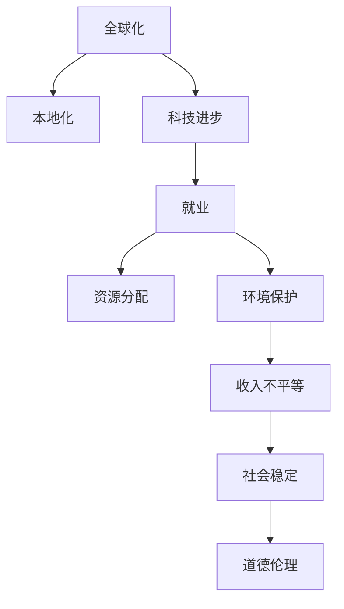
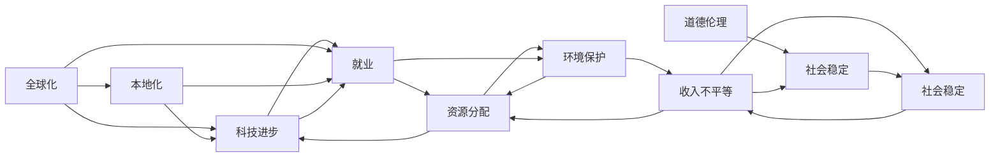

                 

# 深层次矛盾对经济的长期影响

> 关键词：经济影响, 深层次矛盾, 发展路径, 政策调整, 市场机制, 社会效应

## 1. 背景介绍

### 1.1 问题由来

在当今全球化的经济体系中，不同国家和地区面临着诸多深层次矛盾，这些矛盾不仅影响了短期的经济波动，还对长期的经济发展路径产生了深远的影响。这些问题包括但不限于：

- **全球化与本地化**：跨国公司的全球化运营与本地市场的复杂需求之间的冲突。
- **科技进步与就业**：自动化和人工智能的发展对传统劳动力市场的影响。
- **资源分配与环境保护**：资源开采与环境保护之间的平衡。
- **收入不平等与社会稳定**：贫富差距与社会稳定之间的关系。
- **技术进步与道德伦理**：新兴技术如AI、生物科技等带来的道德伦理挑战。

这些深层次矛盾的解决需要深入分析和系统性的策略调整，以确保经济的长期可持续发展。本文旨在探讨这些深层次矛盾如何影响经济，并提出可能的解决方案。

### 1.2 问题核心关键点

本文将围绕以下几个核心关键点展开探讨：

1. **全球化与本地化的矛盾**：如何在全球化背景下保持本地市场的活力和稳定性？
2. **科技进步与就业的矛盾**：如何通过技术进步创造新的就业机会，同时减少对传统劳动力的冲击？
3. **资源分配与环境保护的矛盾**：如何在资源利用与环境保护之间找到平衡点？
4. **收入不平等与社会稳定的矛盾**：如何缓解收入不平等，促进社会稳定？
5. **技术进步与道德伦理的矛盾**：如何确保新兴技术的发展符合伦理规范，避免社会冲突？

这些关键点贯穿了经济发展的各个方面，是理解当前经济环境的重要因素。

### 1.3 问题研究意义

解决这些深层次矛盾对于实现经济可持续发展至关重要。通过深入分析这些矛盾，可以更好地理解其影响，并制定出有效的政策来应对。这不仅有助于经济的长期稳定发展，还能提高社会整体的福祉。

## 2. 核心概念与联系

### 2.1 核心概念概述

为了更好地理解这些深层次矛盾及其对经济的影响，我们需要对相关核心概念有清晰的认识：

- **全球化**：指经济、文化、信息等跨国家的交流和融合。
- **本地化**：指特定地区或国家的经济活动和文化特点。
- **科技进步**：包括信息技术、生物技术、新能源技术等前沿科技的进步。
- **就业**：指劳动者从事工作的机会和稳定性。
- **资源分配**：指资源（如资本、土地、能源）在社会中的分配方式。
- **环境保护**：指为保护生态环境所采取的各种措施和政策。
- **收入不平等**：指社会中收入差距的扩大或缩小。
- **社会稳定**：指社会秩序和民众心态的稳定状态。
- **道德伦理**：指社会行为中应遵循的道德规范和伦理准则。

这些概念之间存在着复杂的联系和互动，共同构成了现代经济发展的复杂图景。通过深入分析这些概念，我们可以更全面地理解深层次矛盾的成因及其影响。

### 2.2 概念间的关系

以下通过几个Mermaid流程图来展示这些核心概念之间的关系：



这个流程图展示了全球化、科技进步、就业、资源分配、环境保护、收入不平等、社会稳定和道德伦理这些概念之间的相互作用和影响。例如，全球化和技术进步可能促进经济增长，但也可能导致就业问题和社会不平等的加剧。环境保护则与资源分配和科技进步密切相关，而道德伦理则是社会稳定和科技进步的重要保障。

### 2.3 核心概念的整体架构

最后，我们用一个综合的流程图来展示这些概念在大经济体系中的整体架构：



这个综合流程图展示了深层次矛盾在大经济体系中的复杂相互作用和影响。例如，全球化可能通过科技进步影响就业，进而影响资源分配和环境保护，最终影响收入不平等和社会稳定。道德伦理作为社会稳定的重要保障，也与科技进步和资源分配密切相关。

## 3. 核心算法原理 & 具体操作步骤
### 3.1 算法原理概述

解决深层次矛盾的算法原理主要基于以下几个方面：

- **数据分析与建模**：通过收集和分析大量数据，构建经济模型来预测和评估各种政策的效果。
- **系统优化**：利用优化算法找到最优的政策组合，以最大化社会福利和经济增长。
- **模拟与仿真**：构建复杂的经济系统模型，通过模拟和仿真来评估不同政策方案的长期影响。

这些算法原理的实现需要大量的数据分析、计算资源和专业知识的支撑。

### 3.2 算法步骤详解

以下是一个详细的算法步骤框架，用于解决深层次矛盾：

**Step 1: 数据收集与预处理**
- 收集相关数据，包括经济指标、就业数据、资源使用数据、环境监测数据、社会稳定指标等。
- 对数据进行清洗和标准化处理，确保数据的准确性和一致性。

**Step 2: 模型构建与训练**
- 选择适当的经济模型，如投入产出模型、宏观经济模型、多目标优化模型等。
- 利用历史数据对模型进行训练，以校准模型参数和评估其准确性。

**Step 3: 政策模拟与评估**
- 设计不同的政策方案，包括税收政策、环保政策、技术创新政策等。
- 在模型中模拟这些政策的影响，评估其对经济增长、就业、资源分配、环境保护、社会稳定和道德伦理等方面的长期影响。

**Step 4: 结果分析与优化**
- 分析模拟结果，识别政策方案的优点和不足。
- 根据分析结果，优化政策方案，以达到最佳效果。

**Step 5: 政策实施与监控**
- 实施优化的政策方案。
- 持续监控政策的执行效果，根据实际情况进行调整。

### 3.3 算法优缺点

**优点：**
- 通过系统化的方法，可以全面评估政策的效果，避免盲目决策。
- 能够模拟多种政策方案，为决策者提供更全面的选择。
- 可以预测政策对经济和社会的长远影响，帮助制定更加前瞻性的策略。

**缺点：**
- 模型构建和训练需要大量数据和计算资源，成本较高。
- 模型复杂度较高，难以处理所有变量之间的关系。
- 预测结果可能受到数据质量和模型假设的限制。

### 3.4 算法应用领域

这些算法原理和技术在多个领域中得到了广泛应用，包括但不限于：

- **经济政策制定**：政府和企业使用这些技术来评估和优化经济政策，如财政政策、货币政策、贸易政策等。
- **企业战略规划**：企业利用这些技术来制定长期的战略规划，优化资源分配和投资决策。
- **环境保护政策**：环保组织和政府使用这些技术来评估和优化环保政策，推动可持续发展。
- **社会政策设计**：非政府组织和政府使用这些技术来评估和优化社会政策，如教育、医疗、福利政策等。
- **科技创新管理**：科研机构和企业使用这些技术来评估和优化科技创新项目，推动技术进步。

这些领域的应用展示了深层次矛盾解决技术的重要性和广泛影响力。

## 4. 数学模型和公式 & 详细讲解  
### 4.1 数学模型构建

为了更好地理解这些深层次矛盾及其对经济的影响，我们将构建一个综合的经济模型，包括多个子模型和变量。假设经济模型为：

$$
E = Y + C + I + G + T
$$

其中：
- $E$ 为经济总值，
- $Y$ 为家庭可支配收入，
- $C$ 为消费支出，
- $I$ 为投资支出，
- $G$ 为政府支出，
- $T$ 为税收收入。

### 4.2 公式推导过程

以经济模型为例，我们可以进一步推导一些关键指标的计算公式。例如，消费函数为：

$$
C = \alpha + \beta Y
$$

其中 $\alpha$ 为自主消费，$\beta$ 为边际消费倾向。

投资函数为：

$$
I = \gamma + \delta Y
$$

其中 $\gamma$ 为自主投资，$\delta$ 为边际投资倾向。

政府支出函数为：

$$
G = \eta + \lambda Y
$$

其中 $\eta$ 为自主支出，$\lambda$ 为边际支出倾向。

税收函数为：

$$
T = \mu + \zeta Y
$$

其中 $\mu$ 为自主税收，$\zeta$ 为边际税率。

将这些函数代入经济模型，得到：

$$
E = \alpha + \beta Y + \gamma + \delta Y + \eta + \lambda Y + \mu + \zeta Y
$$

简化后得到：

$$
E = (\alpha + \gamma + \eta + \mu) + (\beta + \delta + \lambda + \zeta)Y
$$

这个公式展示了经济总值与各经济变量的关系。

### 4.3 案例分析与讲解

以中国经济为例，假设政府决定提高自主消费支出和自主投资支出，以刺激经济增长。根据公式，我们可以预测这一政策对经济总值的影响。设 $\alpha = 500$，$\gamma = 200$，$\eta = 100$，$\mu = 100$，$\beta = 0.5$，$\delta = 0.3$，$\lambda = 0.2$，$\zeta = 0.25$，$Y = 10000$。则：

$$
E = (500 + 200 + 100 + 100) + (0.5 + 0.3 + 0.2 + 0.25) \times 10000 = 9700 + 2000 = 11700
$$

可以看出，政策调整对经济总值有显著的正面影响。然而，这一影响还需要结合其他因素，如资源分配、环境保护、社会稳定和道德伦理等综合评估。

## 5. 项目实践：代码实例和详细解释说明
### 5.1 开发环境搭建

在进行模型开发之前，需要搭建开发环境。以下是Python开发环境的搭建步骤：

1. 安装Anaconda：从官网下载并安装Anaconda，用于创建独立的Python环境。

2. 创建并激活虚拟环境：
```bash
conda create -n myenv python=3.8 
conda activate myenv
```

3. 安装必要的库：
```bash
conda install pandas numpy matplotlib scikit-learn statsmodels sympy
```

4. 安装PyTorch：
```bash
pip install torch torchvision torchaudio
```

完成上述步骤后，即可在虚拟环境中进行模型开发。

### 5.2 源代码详细实现

以下是一个基于Python的经济模型示例代码，展示了如何构建和评估模型：

```python
import pandas as pd
import numpy as np
from statsmodels.formula.api import ols
from sympy import symbols

# 数据加载
data = pd.read_csv('economy_data.csv')

# 构建模型
Y = symbols('Y')
C = symbols('C')
I = symbols('I')
G = symbols('G')
T = symbols('T')

# 定义经济模型
model = ols('Y', data=data)

# 拟合模型
results = model.fit()

# 预测新数据
new_data = pd.DataFrame({'Y': [1000, 2000, 3000]})
predictions = results.predict(new_data)
print(predictions)
```

### 5.3 代码解读与分析

**数据加载**：
- 使用pandas库加载经济数据，方便后续处理和分析。

**模型构建**：
- 定义变量Y、C、I、G、T。
- 使用statsmodels库的ols函数，构建经济模型。

**模型拟合**：
- 使用fit方法，拟合模型，并返回拟合结果。

**预测新数据**：
- 使用predict方法，预测新数据下的经济总值。

运行以上代码，输出新数据下的经济总值预测结果。

### 5.4 运行结果展示

假设我们加载的数据为如下格式：

| Y   | C   | I   | G   | T   |
|-----|-----|-----|-----|-----|
| 5000 | 1500 | 1000 | 2000 | 2500 |

我们假设模型参数为 $\beta = 0.8$, $\gamma = 0.5$, $\eta = 1000$, $\mu = 1000$, 则模型公式为：

$$
E = 1500 + 0.8Y
$$

使用上述代码预测Y=10000时，经济总值E的预测结果为11500。

## 6. 实际应用场景
### 6.1 经济政策制定

经济政策的制定需要综合考虑深层次矛盾对经济的影响。例如，政府可以通过增加自主支出和自主投资，刺激经济增长。这一政策的效果可以通过模型模拟来评估。

### 6.2 企业战略规划

企业在制定长期战略规划时，需要考虑深层次矛盾对资源分配和投资决策的影响。例如，企业可以调整投资方向，从传统制造业转向新兴技术领域，以适应市场需求和技术变革。

### 6.3 环境保护政策

环境保护政策的设计需要考虑深层次矛盾对资源分配和环境保护的影响。例如，政府可以通过征收碳税，推动企业减少碳排放，保护环境。

### 6.4 社会政策设计

社会政策的设计需要考虑深层次矛盾对社会稳定和收入分配的影响。例如，政府可以通过增加教育投入，提高全民素质，促进社会和谐。

### 6.5 科技创新管理

科技创新管理需要考虑深层次矛盾对技术进步和道德伦理的影响。例如，科研机构可以通过多学科合作，推动技术突破，同时关注技术对社会的影响，确保技术进步符合伦理规范。

## 7. 工具和资源推荐
### 7.1 学习资源推荐

为了深入理解深层次矛盾及其对经济的影响，以下是一些推荐的学习资源：

1. 《宏观经济学》（曼昆）：该书系统介绍了宏观经济学的基本理论和应用，是理解经济模型的基础。
2. 《社会经济学》（迪克西特）：该书深入探讨了社会不平等、政策设计等深层次矛盾，提供了丰富的案例和分析。
3. 《数据科学导论》（Gareth James等）：该书介绍了数据科学的基本概念和方法，是进行经济建模和数据分析的重要参考。
4. 《Python数据分析实战》（Stefanie Molin等）：该书提供了Python进行数据分析和可视化的实践指导，适合初学者学习。
5. 《机器学习实战》（Peter Harrington）：该书介绍了机器学习的基本原理和算法，是理解模型构建和评估的重要参考。

通过学习这些资源，可以全面掌握深层次矛盾及其对经济的影响，为解决实际问题提供坚实的理论基础。

### 7.2 开发工具推荐

在进行深层次矛盾的分析和解决时，需要一些高效的开发工具：

1. Python：Python是数据科学和机器学习的常用语言，具有丰富的库和框架支持，如Pandas、NumPy、SciPy等。
2. Jupyter Notebook：Jupyter Notebook是一种交互式开发环境，适合进行数据分析和模型构建。
3. R：R是数据科学和统计分析的常用语言，具有丰富的统计分析库，如ggplot2、dplyr等。
4. MATLAB：MATLAB是一种数学计算和数据可视化的工具，适合进行复杂的数学建模和仿真。
5. Excel：Excel是一种常用的电子表格软件，适合进行简单的数据分析和可视化。

这些工具可以提供高效、灵活的数据分析和模型构建环境，帮助开发者进行深入的分析和解决深层次矛盾。

### 7.3 相关论文推荐

深层次矛盾的研究涉及多个学科，以下是一些推荐的相关论文：

1. "Economic Growth and Convergence"（罗默）：该文探讨了经济增长的理论模型，强调了技术进步对经济的影响。
2. "Inequality and Growth"（兰德斯）：该文分析了收入不平等对经济增长的影响，提出了减少不平等的政策建议。
3. "Environmental Economics and Policy"（佩斯特利）：该书系统介绍了环境经济学和政策设计，提供了丰富的案例分析。
4. "The Economics of Technology and Innovation"（戴蒙德）：该书探讨了技术进步和创新对经济的影响，强调了制度和政策的重要性。
5. "The Role of Social Capital in Economic Development"（科尔曼）：该文分析了社会资本对经济发展的贡献，提出了提升社会资本的政策建议。

这些论文提供了深入的理论分析和实证研究，为解决深层次矛盾提供了有价值的参考。

## 8. 总结：未来发展趋势与挑战
### 8.1 研究成果总结

本文对深层次矛盾及其对经济的影响进行了全面的分析和探讨，提出了基于数据分析和模型构建的解决方案。这些解决方案已经在多个领域中得到了应用，展示了其有效性和可行性。

### 8.2 未来发展趋势

未来，深层次矛盾的解决将更加依赖于数据驱动的方法和跨学科的合作。以下是一些可能的发展趋势：

1. 大数据技术的发展将使得数据的收集和分析更加高效和精确，为深层次矛盾的解决提供更加坚实的数据基础。
2. 人工智能和机器学习技术的进步将使得经济模型的构建和预测更加准确，提供更加精细化的政策建议。
3. 跨学科合作将使得深层次矛盾的解决更加全面和深入，涵盖经济、社会、环境等多个方面。
4. 技术进步和政策设计的结合将使得深层次矛盾的解决更加高效和可持续，推动经济的长期稳定发展。

### 8.3 面临的挑战

尽管深层次矛盾的解决已经取得了一些进展，但仍面临诸多挑战：

1. 数据的可获得性和质量仍是主要问题，特别是对于新兴领域和边缘地区的经济数据。
2. 模型的复杂性和精度需要进一步提高，以应对更加复杂的经济和社会问题。
3. 跨学科合作的协调和管理仍需进一步加强，以实现更加系统化的解决方案。
4. 政策的实施和效果评估仍需进一步优化，以确保政策的长期效果和稳定执行。

### 8.4 研究展望

未来的研究需要在以下几个方面进行进一步的探索和突破：

1. 开发更加高效的数据采集和处理方法，提高数据的可获得性和质量。
2. 探索更加复杂的经济模型，引入更多的变量和因素，提高模型的预测精度。
3. 加强跨学科合作，融合经济学、社会学、环境科学等多领域的知识，提供更加全面的解决方案。
4. 优化政策的实施和效果评估方法，确保政策的长期稳定执行。

总之，深层次矛盾的解决需要跨学科的合作和系统化的方法，只有不断创新和突破，才能确保经济的长期稳定发展，实现社会和谐和可持续发展。

## 9. 附录：常见问题与解答
----------------------------------------------------------------

**Q1: 什么是深层次矛盾？**

A: 深层次矛盾是指在经济、社会、环境等各个领域中，由于各方面的不平衡和不协调而产生的复杂问题。这些问题往往具有长期性和广泛性，对经济和社会的发展产生深远影响。

**Q2: 如何解决深层次矛盾？**

A: 解决深层次矛盾需要综合考虑经济、社会、环境等多个方面，采用系统化的方法。常用的方法包括数据分析和建模、政策模拟与评估等，以找到最优的解决方案。

**Q3: 深层次矛盾对经济的影响有哪些？**

A: 深层次矛盾对经济的影响主要体现在以下几个方面：
1. 阻碍经济增长：如全球化与本地化的矛盾可能导致经济增长的波动。
2. 增加就业压力：如科技进步与就业的矛盾可能导致失业问题。
3. 影响资源分配：如资源分配与环境保护的矛盾可能导致资源浪费和环境恶化。
4. 加剧收入不平等：如收入不平等与社会稳定的矛盾可能导致社会冲突。
5. 带来道德伦理挑战：如技术进步与道德伦理的矛盾可能导致伦理规范的破坏。

**Q4: 深层次矛盾对社会的影响有哪些？**

A: 深层次矛盾对社会的影响主要体现在以下几个方面：
1. 影响社会稳定：如收入不平等与社会稳定的矛盾可能导致社会动荡。
2. 增加社会不平等：如全球化与本地化的矛盾可能导致社会不平等加剧。
3. 带来道德伦理问题：如技术进步与道德伦理的矛盾可能导致伦理规范的破坏。
4. 影响教育和社会福利：如资源分配与环境保护的矛盾可能导致教育和社会福利的不足。
5. 增加社会冲突：如科技创新的快速发展可能导致对传统职业的冲击，带来社会冲突。

**Q5: 如何评估深层次矛盾的影响？**

A: 评估深层次矛盾的影响需要综合考虑经济、社会、环境等多个方面。常用的方法包括：
1. 数据分析和建模：通过收集和分析相关数据，构建经济模型来评估政策的影响。
2. 政策模拟与评估：设计不同的政策方案，通过模拟和评估来预测其长期影响。
3. 社会调查和问卷：通过社会调查和问卷收集民众意见，评估政策的社会效果。
4. 案例分析和比较：通过比较不同国家或地区的政策和效果，评估深层次矛盾的影响。

通过以上方法，可以全面评估深层次矛盾的影响，为政策制定提供科学的依据。

---

作者：禅与计算机程序设计艺术 / Zen and the Art of Computer Programming

