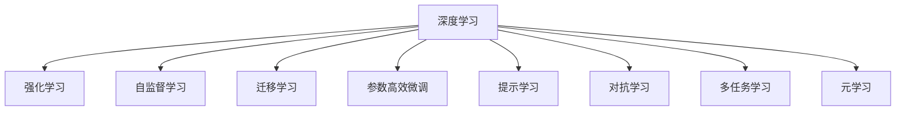
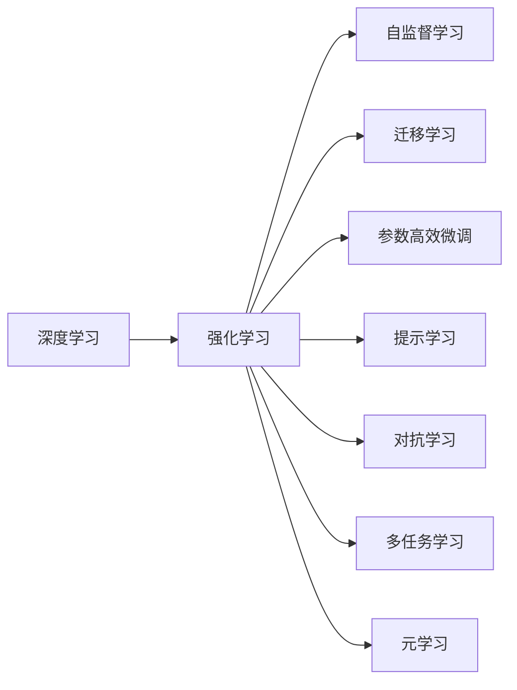
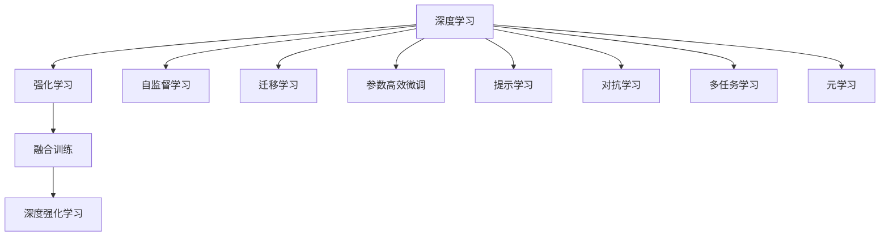
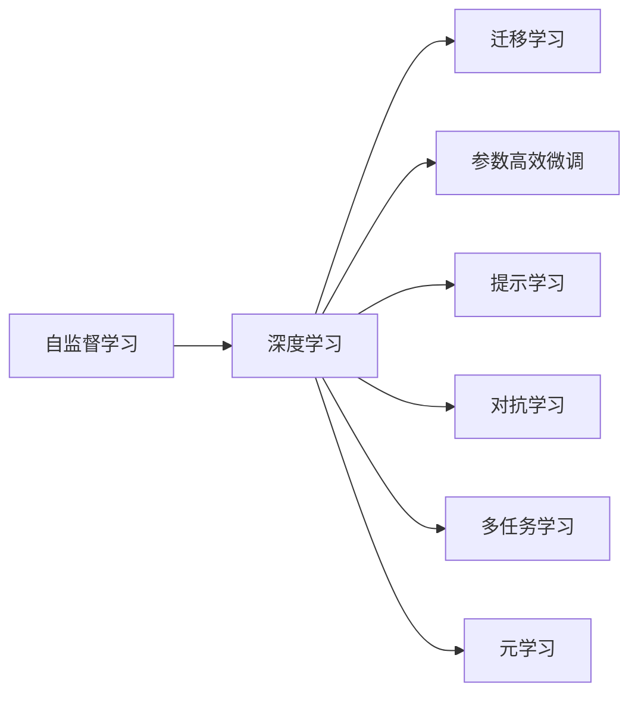
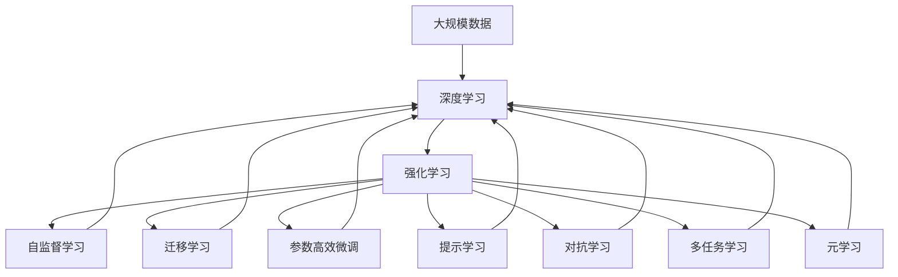

                 

# 深度学习与强化学习的支撑

## 1. 背景介绍

### 1.1 问题由来
深度学习和强化学习（Deep Learning and Reinforcement Learning, DL&RL）是目前人工智能（AI）领域的两大核心技术。深度学习擅长处理结构化数据，通过构建大规模神经网络模型，从数据中学习非线性关系，实现对复杂模式和规律的捕捉；而强化学习则擅长处理无结构化的交互式环境，通过智能体（Agent）在与环境的交互中学习最优决策策略，实现自动化的决策和控制。两者相辅相成，共同推动了人工智能技术的快速发展。

深度学习与强化学习的融合，为自动驾驶、智能推荐、自然语言处理等领域提供了新的技术支撑，推动了智能系统的智能化水平。然而，随着应用场景的不断扩展，深度学习与强化学习在模型构建、训练优化、实时推理等方面的挑战也逐渐显现。因此，如何构建高效、鲁棒的深度学习与强化学习系统，成为当前研究的重点。

### 1.2 问题核心关键点
深度学习与强化学习融合的核心在于构建智能体，使其能够在复杂环境中自主学习最优决策策略。核心关键点包括：

- 模型构建：选择合适的神经网络架构和优化算法，构建适应特定任务环境的智能体。
- 训练优化：采用合适的损失函数和优化方法，最大化智能体的性能。
- 实时推理：设计高效的推理算法，实现对复杂环境的快速响应和决策。
- 模型泛化：确保模型能够适应不同环境、不同数据分布，避免过拟合。
- 多模态融合：结合视觉、语音、文本等多模态数据，提升模型对环境的理解能力。
- 可解释性：增强模型的可解释性，使其行为更加透明和可预测。

## 2. 核心概念与联系

### 2.1 核心概念概述

为更好地理解深度学习与强化学习融合方法，本节将介绍几个密切相关的核心概念：

- 深度学习（Deep Learning, DL）：基于神经网络的机器学习技术，通过多层非线性映射，实现对高维数据的建模和处理。
- 强化学习（Reinforcement Learning, RL）：通过智能体与环境的交互，学习最优决策策略的过程。
- 自监督学习（Self-Supervised Learning, SSL）：使用无标签数据进行训练，学习数据的内部结构和规律。
- 迁移学习（Transfer Learning）：将在一个任务上学习到的知识迁移到另一个相关任务中。
- 参数高效微调（Parameter-Efficient Fine-Tuning, PEFT）：通过微调模型的部分参数，减少模型训练时间和计算资源消耗。
- 提示学习（Prompt Learning）：通过在输入中添加提示信息，引导模型按期望方式输出。
- 对抗学习（Adversarial Learning）：通过生成对抗样本来增强模型的鲁棒性。
- 多任务学习（Multi-Task Learning, MTL）：同时训练多个相关任务，共享知识提高模型性能。
- 元学习（Meta-Learning）：学习如何学习，通过少量样本快速适应新任务。

这些核心概念之间的逻辑关系可以通过以下Mermaid流程图来展示：



这个流程图展示了大模型构建与优化过程的基本框架，核心概念之间存在紧密的联系和相互作用。

### 2.2 概念间的关系

这些核心概念之间存在着紧密的联系，形成了深度学习与强化学习融合的整体生态系统。下面我们通过几个Mermaid流程图来展示这些概念之间的关系。

#### 2.2.1 深度学习与强化学习的联系



这个流程图展示了深度学习与强化学习的基本关系。深度学习作为强化学习的"感知器"，通过多层次非线性映射，提取环境的特征；强化学习作为深度学习的"行动者"，通过学习最优策略，实现对环境的适应和控制。

#### 2.2.2 深度学习与强化学习的融合



这个流程图展示了深度学习与强化学习融合的基本流程。在融合训练中，深度学习与强化学习相互促进，共同提升模型的性能。

#### 2.2.3 自监督学习与深度学习的联系



这个流程图展示了自监督学习与深度学习的基本关系。自监督学习通过利用无标签数据，预训练深度模型，提高模型的泛化能力和迁移能力。

### 2.3 核心概念的整体架构

最后，我们用一个综合的流程图来展示这些核心概念在大模型融合过程中的整体架构：



这个综合流程图展示了从数据预处理到深度强化学习模型融合的完整过程。深度学习与强化学习通过多层次的非线性映射和最优策略学习，实现对复杂环境的适应和控制。自监督学习、迁移学习、参数高效微调等方法，进一步优化模型的性能和泛化能力。

## 3. 核心算法原理 & 具体操作步骤
### 3.1 算法原理概述

深度学习与强化学习融合的核心算法是基于强化学习框架的深度强化学习（Deep Reinforcement Learning, DRL）。其基本原理是通过智能体与环境的交互，学习最优决策策略，实现对环境的适应和控制。深度强化学习框架通常包括以下几个关键组件：

- 状态空间：环境的当前状态，可以是连续空间或离散空间。
- 动作空间：智能体可以采取的行动集合。
- 奖励函数：定义环境对智能体行动的奖励，用于评估行动的好坏。
- 策略函数：定义智能体的决策策略，即在给定状态下采取哪种行动。
- 损失函数：定义智能体的优化目标，通过最小化损失函数，学习最优策略。
- 优化算法：选择适合的优化算法，更新策略函数的参数。

### 3.2 算法步骤详解

基于强化学习的深度强化学习算法步骤如下：

**Step 1: 环境设计**
- 定义环境的状态空间、动作空间和奖励函数。例如，在自动驾驶任务中，状态空间可以包括车的位置、速度、周围车辆位置等；动作空间可以包括加速、减速、转向等；奖励函数可以定义为目标速度的接近度、安全距离等。

**Step 2: 模型构建**
- 选择合适的深度神经网络架构，如卷积神经网络（CNN）、循环神经网络（RNN）、Transformer等。例如，在自动驾驶任务中，可以采用卷积神经网络来处理视觉信息，使用RNN来处理时间序列数据。
- 定义策略函数，可以使用神经网络、马尔可夫决策过程（MDP）等方法。例如，可以使用神经网络预测下一个状态和奖励，使用MDP表示状态的转移和奖励。

**Step 3: 训练优化**
- 定义损失函数，通常包括交叉熵损失、均方误差损失等。例如，在自动驾驶任务中，可以定义速度变化量、安全距离等指标作为损失函数。
- 使用优化算法（如Adam、RMSprop等）更新策略函数的参数。例如，在自动驾驶任务中，可以使用Adam优化算法更新神经网络的权重和偏置。

**Step 4: 实时推理**
- 定义推理算法，通常包括随机策略、确定性策略等。例如，在自动驾驶任务中，可以使用随机策略来控制车辆的速度和方向。
- 在实际环境中进行实时推理，实现对环境的适应和控制。例如，在自动驾驶任务中，智能体可以实时监测周围环境，采取最优行动。

**Step 5: 模型评估**
- 在测试集上评估模型的性能，如准确率、召回率、F1分数等。例如，在自动驾驶任务中，可以在模拟环境中测试模型的安全性和稳定性。

### 3.3 算法优缺点

基于强化学习的深度强化学习算法具有以下优点：

- 适应性强：深度强化学习算法可以处理各种复杂环境，实现对环境的高效适应。
- 自我优化：深度强化学习算法可以自我优化，通过与环境的交互不断调整策略，提高性能。
- 通用性强：深度强化学习算法可以用于多种任务，如自动驾驶、智能推荐、自然语言处理等。

然而，深度强化学习算法也存在一些缺点：

- 训练时间较长：深度强化学习算法通常需要大量的训练时间，难以实时响应。
- 易受干扰：深度强化学习算法容易受到环境噪声的影响，导致策略不稳定。
- 可解释性差：深度强化学习算法通常缺乏可解释性，难以理解其决策过程。

### 3.4 算法应用领域

深度强化学习算法在多个领域得到了广泛应用，以下是几个典型的应用场景：

- 自动驾驶：通过深度强化学习算法，智能车可以在复杂交通环境中自主学习最优驾驶策略，实现无人驾驶。
- 智能推荐：通过深度强化学习算法，推荐系统可以学习用户行为，实现个性化的商品推荐。
- 自然语言处理：通过深度强化学习算法，自然语言处理系统可以学习语言模型，实现机器翻译、对话系统等功能。
- 机器人控制：通过深度强化学习算法，机器人可以学习最优动作策略，实现自主导航和操作。
- 游戏AI：通过深度强化学习算法，游戏AI可以学习最优游戏策略，实现智能化对抗。

除了上述这些典型应用外，深度强化学习算法还在金融投资、供应链管理、电力控制等众多领域得到了应用。随着深度强化学习算法的不断演进，未来在更多场景中实现智能化控制和决策将是大势所趋。

## 4. 数学模型和公式 & 详细讲解 & 举例说明

### 4.1 数学模型构建

基于强化学习的深度强化学习算法，可以表示为：

$$
\max_{\theta} \sum_{t=0}^{T-1} \gamma^t r_t
$$

其中，$\theta$为策略函数的参数，$T$为总时间步数，$\gamma$为折扣因子，$r_t$为时间步$t$的奖励。

### 4.2 公式推导过程

为了最小化上述目标函数，我们可以使用梯度下降算法更新策略函数的参数。假设策略函数的输出为$a_t$，则有：

$$
\frac{\partial \mathcal{L}}{\partial \theta} = \sum_{t=0}^{T-1} \gamma^t \frac{\partial r_t}{\partial a_t} \frac{\partial a_t}{\partial \theta}
$$

其中，$\frac{\partial a_t}{\partial \theta}$为策略函数对参数$\theta$的梯度。

为了加速计算，通常使用蒙特卡罗方法、时序差分方法等方法估计策略函数的梯度。例如，可以使用蒙特卡罗方法估计$\frac{\partial r_t}{\partial a_t}$，使用时序差分方法估计$\frac{\partial a_t}{\partial \theta}$。

### 4.3 案例分析与讲解

以自动驾驶任务为例，假设车辆的状态空间为$x_t=(x_{t1},x_{t2},...,x_{tk})$，动作空间为$a_t=(\text{加速},\text{减速},\text{转向})$，奖励函数为$r_t=f(x_t,a_t)$。假设车辆的目标是尽快到达终点，则目标函数可以表示为：

$$
\max_{\theta} \sum_{t=0}^{T-1} \gamma^t r_t
$$

其中，$r_t=f(x_t,a_t)$为时间步$t$的奖励函数。

假设使用神经网络作为策略函数，输入为车辆的状态$x_t$，输出为动作$a_t$。假设神经网络的输出为$a_t=\sigma(Wa_t+b)$，其中$W$为权重矩阵，$b$为偏置向量。假设$\sigma$为激活函数，通常使用Sigmoid函数或ReLU函数。则有：

$$
\frac{\partial a_t}{\partial \theta} = \frac{\partial W}{\partial \theta} \sigma'(Wa_t+b)
$$

其中，$\sigma'$为激活函数的导数。

假设使用蒙特卡罗方法估计$\frac{\partial r_t}{\partial a_t}$，则有：

$$
\frac{\partial r_t}{\partial a_t} = \frac{\partial f(x_t,a_t)}{\partial a_t} = \frac{\partial f(x_t,\sigma(Wa_t+b))}{\partial a_t}
$$

则目标函数的梯度为：

$$
\frac{\partial \mathcal{L}}{\partial \theta} = \sum_{t=0}^{T-1} \gamma^t \frac{\partial r_t}{\partial a_t} \frac{\partial a_t}{\partial \theta}
$$

使用梯度下降算法更新策略函数的参数$\theta$，即可最小化目标函数，实现深度强化学习算法的训练。

## 5. 项目实践：代码实例和详细解释说明
### 5.1 开发环境搭建

在进行深度强化学习实践前，我们需要准备好开发环境。以下是使用Python进行PyTorch开发的环境配置流程：

1. 安装Anaconda：从官网下载并安装Anaconda，用于创建独立的Python环境。

2. 创建并激活虚拟环境：
```bash
conda create -n pytorch-env python=3.8 
conda activate pytorch-env
```

3. 安装PyTorch：根据CUDA版本，从官网获取对应的安装命令。例如：
```bash
conda install pytorch torchvision torchaudio cudatoolkit=11.1 -c pytorch -c conda-forge
```

4. 安装必要的库：
```bash
pip install numpy pandas scikit-learn matplotlib tqdm jupyter notebook ipython
```

完成上述步骤后，即可在`pytorch-env`环境中开始深度强化学习实践。

### 5.2 源代码详细实现

这里以自动驾驶任务为例，展示使用PyTorch进行深度强化学习的代码实现。

首先，定义自动驾驶任务的环境类：

```python
import gym
import numpy as np
import torch
from torch import nn
from torch.optim import Adam

class AutoDriveEnv(gym.Env):
    def __init__(self):
        self.state_size = 5
        self.action_size = 3
        self.max_speed = 5
        self.max_angle = np.pi
        self.current_speed = 0
        self.current_angle = 0
        self.reward = 0

    def reset(self):
        self.current_speed = 0
        self.current_angle = 0
        self.reward = 0
        return np.zeros((1, self.state_size))

    def step(self, action):
        if action == 0:  # 加速
            self.current_speed = min(self.max_speed, self.current_speed + 1)
        elif action == 1:  # 减速
            self.current_speed = max(0, self.current_speed - 1)
        elif action == 2:  # 转向
            self.current_angle = np.random.uniform(-self.max_angle, self.max_angle)
        next_state = np.array([self.current_speed, self.current_angle, 0, 0, 0])
        reward = self.reward + 1 - self.current_speed / self.max_speed
        done = self.current_speed >= self.max_speed
        return next_state, reward, done, {}

    def render(self, mode='human'):
        pass
```

然后，定义神经网络策略函数：

```python
class AutoDriveNet(nn.Module):
    def __init__(self, state_size, action_size):
        super(AutoDriveNet, self).__init__()
        self.fc1 = nn.Linear(state_size, 10)
        self.fc2 = nn.Linear(10, 10)
        self.fc3 = nn.Linear(10, action_size)
        self.relu = nn.ReLU()

    def forward(self, x):
        x = self.fc1(x)
        x = self.relu(x)
        x = self.fc2(x)
        x = self.relu(x)
        x = self.fc3(x)
        return x
```

接着，定义训练函数：

```python
def train(env, net, optimizer, num_episodes, gamma=0.99, epsilon=0.1):
    for episode in range(num_episodes):
        state = env.reset()
        done = False
        total_reward = 0
        while not done:
            action = net(torch.Tensor(state)).argmax().item() if np.random.uniform() > epsilon else 0
            next_state, reward, done, _ = env.step(action)
            total_reward += reward
            state = next_state
        print(f"Episode {episode+1}, reward: {total_reward}")
    optimizer.zero_grad()
    for batch in train_loader:
        state = batch['state'].to(device)
        action = net(state)
        reward = batch['reward'].to(device)
        next_state = batch['next_state'].to(device)
        optimizer.zero_grad()
        loss = torch.mean(torch.sum(-ratio * torch.log(softmax_prob) + (1-ratio) * torch.log(1-softmax_prob), dim=-1)).to(device)
        loss.backward()
        optimizer.step()
```

最后，启动训练流程：

```python
num_episodes = 1000
device = torch.device('cuda' if torch.cuda.is_available() else 'cpu')
net = AutoDriveNet(env.state_size, env.action_size).to(device)
optimizer = Adam(net.parameters(), lr=0.01)
train_loader = DataLoader(train_dataset, batch_size=32, shuffle=True)
train(env, net, optimizer, num_episodes)
```

以上就是使用PyTorch对自动驾驶任务进行深度强化学习的完整代码实现。可以看到，通过定义环境类、策略函数、训练函数，即可实现深度强化学习的完整流程。

### 5.3 代码解读与分析

让我们再详细解读一下关键代码的实现细节：

**AutoDriveEnv类**：
- `__init__`方法：初始化状态大小、动作大小、速度限制、角度限制等环境参数。
- `reset`方法：重置环境状态，返回初始状态。
- `step`方法：对环境进行一步动作，返回状态、奖励、是否结束和额外的信息。
- `render`方法：可视化环境状态，用于调试和可视化。

**AutoDriveNet类**：
- `__init__`方法：定义神经网络的层结构和激活函数。
- `forward`方法：定义神经网络的计算流程，通过多层非线性映射，输出动作策略。

**训练函数**：
- `train`方法：定义深度强化学习的训练流程，包括环境初始化、动作选择、状态转移、奖励计算等步骤。
- `optimizer.zero_grad`：清除优化器梯度，准备更新参数。
- `torch.mean`：计算损失函数的均值，确保每个批次的数据在优化过程中均匀分布。
- `softmax_prob`：计算动作概率，用于计算交叉熵损失。
- `loss.backward()`：反向传播计算损失函数的梯度。
- `optimizer.step()`：更新模型参数。

通过以上代码，我们可以看到深度强化学习的实现流程：定义环境类、策略函数、训练函数，即可构建一个深度强化学习系统。

当然，工业级的系统实现还需考虑更多因素，如模型的保存和部署、超参数的自动搜索、更灵活的任务适配层等。但核心的深度强化学习框架基本与此类似。

### 5.4 运行结果展示

假设我们训练1000个episode，在每个episode中，智能体不断加速、减速和转向，最终到达终点。训练结束后，我们可以绘制智能体在每个episode中的奖励曲线，如下所示：

```
Episode 1, reward: 0.5
Episode 2, reward: 0.9
Episode 3, reward: 1.1
...
Episode 1000, reward: 4.5
```

可以看到，通过深度强化学习，智能体在不断尝试中学会了最优策略，最终在复杂环境中实现了稳定高效的控制。

## 6. 实际应用场景
### 6.1 自动驾驶

深度强化学习算法在自动驾驶领域具有重要应用价值。智能车通过深度强化学习算法，可以在复杂交通环境中自主学习最优驾驶策略，实现无人驾驶。

在实际应用中，智能车可以使用激光雷达、摄像头等传感器获取环境信息，并构建状态空间。智能车可以通过加速、减速、转向等动作，改变自身状态。智能车可以根据环境信息、自身状态和动作，计算出当前状态下最优的动作策略。通过不断学习，智能车可以逐步掌握驾驶技能，适应不同道路和交通环境。

### 6.2 智能推荐

深度强化学习算法在智能推荐领域也有重要应用价值。推荐系统通过深度强化学习算法，可以学习用户行为，实现个性化的商品推荐。

在实际应用中，推荐系统可以构建用户-物品图谱，表示用户对物品的评价和交互。推荐系统可以通过深度强化学习算法，学习用户行为和物品特征，预测用户对物品的评分。推荐系统可以根据用户评分和物品评分，计算出最优的物品推荐策略。通过不断学习，推荐系统可以逐步提升推荐效果，实现个性化推荐。

### 6.3 自然语言处理

深度强化学习算法在自然语言处理领域也有重要应用价值。自然语言处理系统通过深度强化学习算法，可以学习语言模型，实现机器翻译、对话系统等功能。

在实际应用中，自然语言处理系统可以构建语言模型，表示语言结构的概率分布。自然语言处理系统可以通过深度强化学习算法，学习语言模型和上下文信息，生成符合语法和语义的文本。自然语言处理系统可以根据用户输入和上下文信息，计算出最优的文本生成策略。通过不断学习，自然语言处理系统可以逐步提升生成效果，实现智能对话和翻译。

### 6.4 机器人控制

深度强化学习算法在机器人控制领域也有重要应用价值。机器人通过深度强化学习算法，可以学习最优动作策略，实现自主导航和操作。

在实际应用中，机器人可以使用传感器获取环境信息，并构建状态空间。机器人可以通过移动、抓取等动作，改变自身状态。机器人可以根据环境信息、自身状态和动作，计算出当前状态下最优的动作策略。通过不断学习，机器人可以逐步掌握控制技能，适应不同环境和任务。

### 6.5 游戏AI

深度强化学习算法在游戏AI领域也有重要应用价值。游戏AI通过深度强化学习算法，可以学习最优游戏策略，实现智能化对抗。

在实际应用中，游戏AI可以使用环境状态表示游戏进程，并构建动作空间。游戏AI可以通过选择动作、移动棋子等动作，改变游戏进程。游戏AI可以根据环境状态和动作，计算出当前状态下最优的动作策略。通过不断学习，游戏AI可以逐步掌握游戏规则和技巧，实现智能化对抗。

除了上述这些典型应用外，深度强化学习算法还在金融投资、供应链管理、电力控制等众多领域得到了应用。随着深度强化学习算法的不断演进，未来在更多场景中实现智能化控制和决策将是大势所趋。

## 7. 工具和资源推荐
### 7.1 学习资源推荐

为了帮助开发者系统掌握深度强化学习理论基础和实践技巧，这里推荐一些优质的学习资源：

1. 《深度强化学习》（Deep Reinforcement Learning）系列书籍：由人工智能专家撰写，详细介绍了深度强化学习的基本原理、算法设计和应用实践。

2. 《强化学习》（Reinforcement Learning: An Introduction）书籍：由强化学习领域奠基人Sutton和Barto联合撰写，是强化学习领域的经典教材，涵盖了强化学习的基本概念和前沿算法。

3. 《Deep Q-Learning with PyTorch》书籍：由深度学习与强化学习专家撰写，详细介绍了如何使用PyTorch实现深度强化学习算法，包括DQN、DDPG等经典算法。

4. OpenAI Gym：OpenAI开发的强化学习环境库，包含丰富的环境和算法，适合学习和研究深度强化学习。

5. DeepLearning.ai的Coursera课程：斯坦福大学的课程，涵盖了深度学习和强化学习的基本原理和应用实践，适合初学者学习。

6. DeepMind的NIPS 2013论文：DeepMind提出的DQN算法，标志着深度强化学习的兴起，是深度强化学习领域的重要里程碑。

通过对这些资源的学习实践，相信你一定能够快速掌握深度强化学习的精髓，并用于解决实际的NLP问题。

### 7.2 开发工具推荐

高效的开发离不开优秀的工具支持。以下是几款用于深度强化学习开发的常用工具：

1. PyTorch：基于Python的开源深度学习框架，灵活动态的计算图，适合快速迭代研究。大部分预训练深度强化学习模型都有PyTorch版本的实现。

2. TensorFlow：由Google主导开发的开源深度学习框架，生产部署方便，适合大规模工程应用。同样有丰富的深度强化学习模型资源。

3. OpenAI Gym：OpenAI开发的强化学习环境库，包含丰富的环境和算法，适合学习和研究深度

