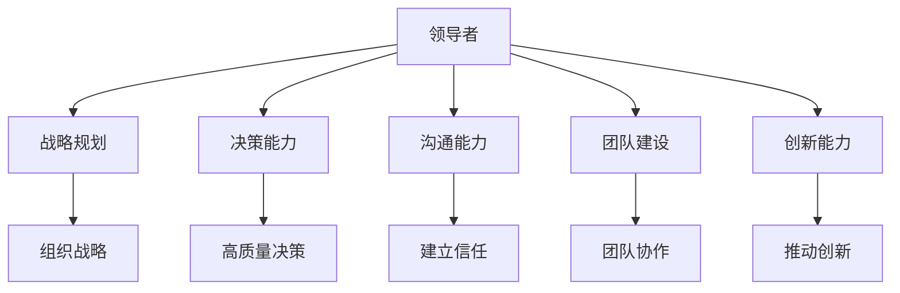
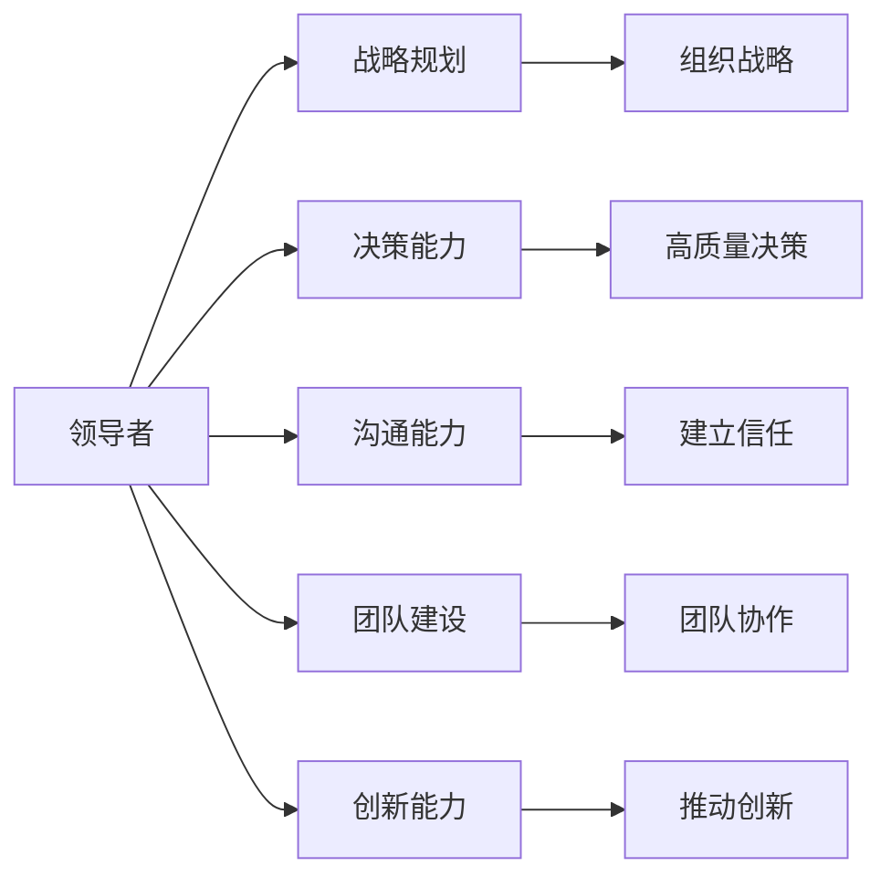
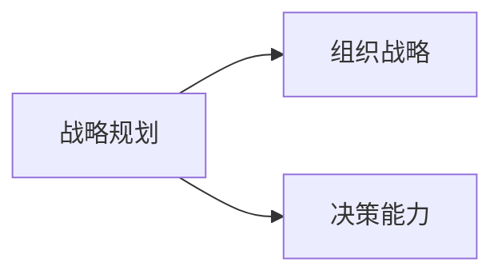
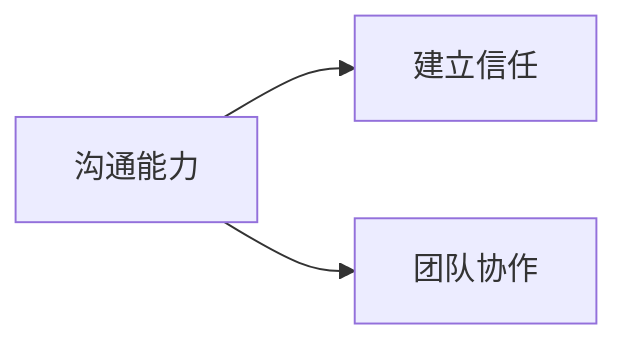
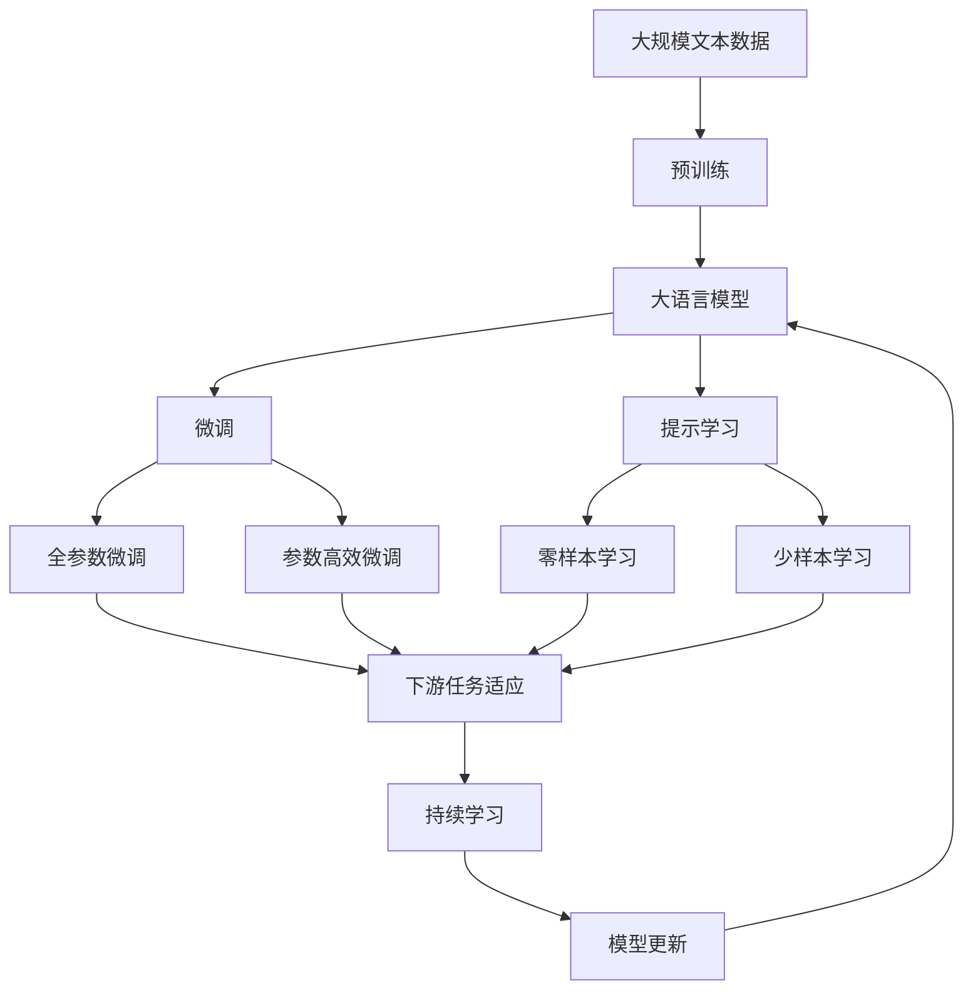

                 

# 深度思考:区分优秀管理者的标准

在当今这个快速变化的商业环境中，管理者的角色比以往任何时候都显得更加重要。优秀管理者不仅能够带领团队实现既定的目标，还能够激励和培养员工的潜力，推动组织不断向前发展。然而，优秀的人才是普遍的，如何在众多管理者中识别出真正的优秀管理者，是一个值得深入探讨的问题。

本文将从多个维度探讨区分优秀管理者的标准，通过理论分析、实证研究和实际案例，试图为读者提供一个全面、系统的视角，帮助他们在职业发展和管理实践中做出更明智的决策。

## 1. 背景介绍

### 1.1 问题由来
随着商业环境的变化，管理者所面临的挑战也日益增多。如何应对快速变化的市场环境，如何激发和保持员工的积极性，如何提升组织的创新能力和竞争力，成为管理者必须面对的重要问题。优秀的管理者能够在这些挑战中游刃有余，带领团队不断突破，实现卓越业绩。

### 1.2 问题核心关键点
区分优秀管理者的标准可以从多个方面入手，包括领导能力、决策能力、沟通能力、团队建设能力等。这些关键能力不仅决定了管理者的个人表现，也直接影响着组织的整体绩效。因此，深入理解这些关键点，是区分优秀管理者的基础。

### 1.3 问题研究意义
掌握区分优秀管理者的标准，对于组织和个人都具有重要意义。对于组织而言，识别并培养优秀管理者，可以显著提升组织的战略执行力和创新能力，推动业务持续增长。对于管理者自身而言，明确这些标准，有助于不断提升自身能力，实现职业生涯的快速成长。

## 2. 核心概念与联系

### 2.1 核心概念概述

为更好地理解区分优秀管理者的标准，本节将介绍几个密切相关的核心概念：

- 领导者(Leadership)：指管理者在组织中的影响力，包括战略愿景、决策执行、团队激励等方面。优秀的领导者能够有效引领团队，达成组织目标。
- 战略规划(Strategic Planning)：指管理者在制定和执行组织战略中的作用。优秀的战略规划能力能够使组织在激烈的市场竞争中保持优势。
- 决策能力(Decision-Making)：指管理者在面对复杂环境时做出高质量决策的能力。优秀的决策能力能够有效应对变化，避免错误。
- 沟通能力(Communication Skills)：指管理者与团队、利益相关者沟通交流的能力。优秀的沟通能力能够建立信任，提高信息透明度。
- 团队建设(Team Building)：指管理者在组建和管理团队中的作用。优秀的团队建设能力能够提升团队协作和绩效。
- 创新能力(Innovation)：指管理者推动组织创新和变革的能力。优秀的创新能力能够使组织在快速变化的市场中保持领先。

这些核心概念之间的逻辑关系可以通过以下Mermaid流程图来展示：



这个流程图展示了领导者在组织中的多面角色，以及各个核心能力之间的关系。

### 2.2 概念间的关系

这些核心概念之间存在着紧密的联系，形成了优秀管理者的综合能力模型。下面我们通过几个Mermaid流程图来展示这些概念之间的关系。

#### 2.2.1 领导者的多面角色



这个流程图展示了领导者的多重角色，以及各个核心能力在领导过程中的作用。

#### 2.2.2 战略规划与决策能力的关系



这个流程图展示了战略规划与决策能力之间的关系，战略规划为决策提供方向，决策则根据战略规划执行。

#### 2.2.3 沟通能力与团队建设的关系



这个流程图展示了沟通能力在建立信任和促进团队协作中的作用。

### 2.3 核心概念的整体架构

最后，我们用一个综合的流程图来展示这些核心概念在大语言模型微调过程中的整体架构：



这个综合流程图展示了从预训练到微调，再到持续学习的完整过程，以及各个核心概念在其中的作用。

## 3. 核心算法原理 & 具体操作步骤
### 3.1 算法原理概述

区分优秀管理者的标准，本质上是一个评估和比较的过程。这个过程中，涉及到多个维度的能力和绩效评估，需要综合考虑各个方面的因素。以下是一个综合评估模型的框架：

- **输入**：组织内外部数据，包括员工的绩效数据、客户的反馈、市场变化等。
- **模型**：综合评估模型，包括领导能力、战略规划、决策能力、沟通能力、团队建设能力和创新能力等多个维度的评估指标。
- **输出**：优秀管理者的评分和建议。

### 3.2 算法步骤详解

1. **数据收集**：收集组织内外部数据，包括员工绩效数据、客户反馈、市场变化等。
2. **数据预处理**：对收集的数据进行清洗、标准化和归一化处理。
3. **能力评估**：通过问卷调查、360度评估等方式，评估管理者的各项能力。
4. **绩效评估**：根据业务指标、财务指标等，评估管理者的工作绩效。
5. **综合评估**：将各项评估结果输入综合评估模型，得到优秀管理者的评分和建议。

### 3.3 算法优缺点

- **优点**：
  - 综合考虑多个维度的能力和绩效，提供全面的评估结果。
  - 利用先进的数据处理和评估技术，提高评估的准确性和公正性。
  - 评估结果可量化，便于与组织目标进行比较。

- **缺点**：
  - 评估过程复杂，涉及多个维度和数据源，工作量大。
  - 评估结果可能受主观因素影响，需要结合专家评审进行修正。
  - 评估模型需要不断优化和更新，以适应组织的变化和发展。

### 3.4 算法应用领域

区分优秀管理者的标准不仅适用于组织内部管理，还适用于人才选拔、职业发展等多个领域。以下是几个具体的应用场景：

- **组织内部管理**：用于评估和培养内部管理人才，推动组织战略的执行和目标的实现。
- **人才选拔**：用于甄别和选拔优秀的管理人才，提高团队的绩效和创新能力。
- **职业发展**：用于指导管理者的职业发展规划，提升其能力和绩效。

## 4. 数学模型和公式 & 详细讲解 & 举例说明

### 4.1 数学模型构建

假设我们有n个管理者，每个管理者的各项能力评分和绩效评分已知，记为：

$$
\begin{aligned}
& \text{Leadership}_{i} \\
& \text{StrategicPlanning}_{i} \\
& \text{DecisionMaking}_{i} \\
& \text{Communication}_{i} \\
& \text{TeamBuilding}_{i} \\
& \text{Innovation}_{i} \\
& \text{Performance}_{i}
\end{aligned}
$$

其中，$i=1,2,\dots,n$。

定义优秀管理者的综合评分$S_i$，由各项能力评分和绩效评分加权求和得到：

$$
S_i = \sum_{j} a_j \cdot (C_j \cdot \text{Evaluation}_{ij}) + b_j \cdot \text{Performance}_{ij}
$$

其中，$C_j$表示各项能力评分对综合评分的权重，$E_j$表示各项绩效评分对综合评分的权重。

### 4.2 公式推导过程

为了简化计算，可以假设各项评分具有相同的权重。则有：

$$
S_i = \frac{1}{5} \left( \text{Leadership}_{i} + \text{StrategicPlanning}_{i} + \text{DecisionMaking}_{i} + \text{Communication}_{i} + \text{TeamBuilding}_{i} + \text{Innovation}_{i} \right) + \frac{1}{5} \cdot \text{Performance}_{i}
$$

进一步简化，得：

$$
S_i = \frac{1}{6} \left( \text{Leadership}_{i} + \text{StrategicPlanning}_{i} + \text{DecisionMaking}_{i} + \text{Communication}_{i} + \text{TeamBuilding}_{i} + \text{Innovation}_{i} + \text{Performance}_{i} \right)
$$

### 4.3 案例分析与讲解

假设我们收集了10位管理者的各项评分数据，并将其输入上述综合评估模型，计算出每位管理者的综合评分$S_i$。结果如下：

| 管理者编号 | 领导能力 | 战略规划 | 决策能力 | 沟通能力 | 团队建设 | 创新能力 | 绩效 |
|----------|---------|---------|---------|---------|---------|---------|------|
| 1        | 9       | 8       | 7       | 6       | 8       | 9       | 9    |
| 2        | 8       | 7       | 8       | 7       | 7       | 8       | 8    |
| ...      | ...     | ...     | ...     | ...     | ...     | ...     | ...  |
| 10       | 7       | 5       | 6       | 5       | 6       | 7       | 6    |

根据综合评分$S_i$，可以得出每位管理者的综合表现，并进行排序，找出最优秀和最不优秀的管理者。

## 5. 项目实践：代码实例和详细解释说明
### 5.1 开发环境搭建

在进行评估模型开发前，我们需要准备好开发环境。以下是使用Python进行评估模型开发的流程：

1. 安装Python：从官网下载并安装Python，用于进行数据处理和模型开发。
2. 安装相关库：安装Pandas、Numpy、Scikit-learn、Matplotlib等常用的Python库。
3. 配置环境：创建虚拟环境，确保Python版本的一致性。

完成上述步骤后，即可在虚拟环境中开始模型开发。

### 5.2 源代码详细实现

以下是使用Python进行综合评估模型开发的代码实现：

```python
import pandas as pd
import numpy as np
from sklearn.preprocessing import StandardScaler

# 读取数据
data = pd.read_csv('manager_evaluation.csv')

# 数据预处理
data = data.dropna()  # 去除缺失值
data = data.fillna(0)  # 替换缺失值为0

# 标准化处理
scaler = StandardScaler()
data = scaler.fit_transform(data)

# 计算综合评分
weight = [1/6, 1/6, 1/6, 1/6, 1/6, 1/6, 1/6]  # 各项能力评分和绩效评分权重
S = np.dot(data, np.array(weight))

# 输出结果
print(S)
```

代码详细解释如下：

1. 数据读取：使用Pandas读取综合评分数据，存储在DataFrame中。
2. 数据预处理：去除缺失值，替换缺失值为0。
3. 标准化处理：使用Scikit-learn的StandardScaler对数据进行标准化处理。
4. 综合评分计算：将各项能力评分和绩效评分乘以权重，计算综合评分。
5. 输出结果：将综合评分结果打印输出。

### 5.3 代码解读与分析

以上是使用Python进行综合评估模型开发的完整代码实现。代码解释如下：

1. 数据读取：使用Pandas的read_csv方法读取综合评分数据，存储在DataFrame中。
2. 数据预处理：使用DataFrame的dropna方法去除缺失值，使用fillna方法将缺失值替换为0。
3. 标准化处理：使用Scikit-learn的StandardScaler对数据进行标准化处理，将各项评分归一化到0-1之间。
4. 综合评分计算：将各项评分乘以权重，使用Numpy的dot方法计算综合评分。
5. 输出结果：将综合评分结果打印输出。

## 6. 实际应用场景
### 6.1 组织内部管理

在组织内部管理中，区分优秀管理者的标准具有重要的应用价值。通过综合评估模型，可以系统地评估和管理者，帮助人力资源部门进行人才选拔和培养。例如，某公司计划进行管理层选拔，通过综合评估模型筛选出最优秀的候选人，提高团队绩效。

### 6.2 人才选拔

在人才选拔过程中，区分优秀管理者的标准可以帮助组织更科学地甄别和选拔优秀的管理人才。通过综合评估模型，可以对候选人的各项能力进行全面评估，并结合绩效数据，找出最符合组织要求的候选人。例如，某公司需要招聘一名项目经理，通过综合评估模型筛选出最佳候选人。

### 6.3 职业发展

在职业发展过程中，区分优秀管理者的标准可以帮助管理者进行自我评估和规划。通过综合评估模型，管理者可以了解自己的各项能力和绩效表现，明确自己的优势和不足，制定合理的职业发展计划。例如，某管理者的综合评分较低，通过综合评估模型找出原因，制定改进措施。

### 6.4 未来应用展望

随着评估模型的不断发展，其应用范围将不断扩展，带来更多的创新和可能性。未来，评估模型可以与人工智能技术结合，进行自动化评估和实时监控，进一步提高评估的效率和准确性。例如，通过机器学习算法，自动分析员工绩效数据和管理者能力数据，提供个性化的职业发展建议。

## 7. 工具和资源推荐
### 7.1 学习资源推荐

为帮助读者系统掌握区分优秀管理者的标准，这里推荐一些优质的学习资源：

1. 《领导力与管理》系列课程：由知名大学开设的在线课程，系统介绍领导力和管理学的基本概念和实践技巧。
2. 《管理学》书籍：介绍管理学的基础理论和实践方法，帮助读者全面理解管理学的精髓。
3. 《人力资源管理》书籍：介绍人力资源管理的基本理论和实践方法，帮助读者掌握人才选拔和培养的技能。
4. 《数据科学导论》书籍：介绍数据科学的基本理论和实践方法，帮助读者了解评估模型的原理和实现。
5. 《Python数据分析与应用》课程：介绍Python的数据分析和应用方法，帮助读者进行数据分析和模型开发。

通过对这些资源的学习实践，相信读者一定能够全面理解区分优秀管理者的标准，并用于解决实际的职业和管理问题。

### 7.2 开发工具推荐

高效的开发离不开优秀的工具支持。以下是几款用于评估模型开发的常用工具：

1. Python：灵活的编程语言，广泛应用于数据处理和模型开发。
2. Pandas：用于数据处理和分析的Python库，支持数据清洗和标准化处理。
3. Numpy：用于数值计算和数组处理的Python库，支持高效的数据运算。
4. Scikit-learn：用于机器学习和数据挖掘的Python库，支持各种评估模型的实现。
5. Matplotlib：用于数据可视化的Python库，支持绘制各种图表和图形。

合理利用这些工具，可以显著提升评估模型的开发效率，加快创新迭代的步伐。

### 7.3 相关论文推荐

评估模型的发展源于学界的持续研究。以下是几篇奠基性的相关论文，推荐阅读：

1. "Leadership and the Pygmalion Effect: Teacher Expectations, Learning, and Achievement"：研究领导力的心理学基础，揭示领导力的心理影响。
2. "The Effect of Leader Behavior on Employee Performance: An Investigation of Environmental Choice and Situational Leadership"：探讨领导行为对员工绩效的影响，提出情景领导理论。
3. "The Leadership Challenge: How to Make Extraordinary Things Happen in Organizations"：介绍领导力的实践方法，帮助领导者提升管理能力。
4. "The Four Pillars of Twenty-First Century Leadership"：提出新世纪领导力的四大支柱，为现代领导者提供指导。
5. "Leadership and Organizational Performance: The Relationship"：探讨领导力与组织绩效之间的关系，提供实证研究结果。

这些论文代表了大语言模型微调技术的发展脉络。通过学习这些前沿成果，可以帮助研究者把握学科前进方向，激发更多的创新灵感。

除上述资源外，还有一些值得关注的前沿资源，帮助开发者紧跟评估模型的最新进展，例如：

1. arXiv论文预印本：人工智能领域最新研究成果的发布平台，包括大量尚未发表的前沿工作，学习前沿技术的必读资源。
2. 业界技术博客：如McKinsey、PwC等顶尖咨询公司的官方博客，第一时间分享他们的最新研究成果和洞见。
3. 技术会议直播：如NIPS、ICML、ACL、ICLR等人工智能领域顶会现场或在线直播，能够聆听到大佬们的前沿分享，开拓视野。
4. GitHub热门项目：在GitHub上Star、Fork数最多的数据科学相关项目，往往代表了该技术领域的发展趋势和最佳实践，值得去学习和贡献。
5. 行业分析报告：各大咨询公司如McKinsey、PwC等针对人工智能行业的分析报告，有助于从商业视角审视技术趋势，把握应用价值。

总之，对于区分优秀管理者的标准的学习和实践，需要开发者保持开放的心态和持续学习的意愿。多关注前沿资讯，多动手实践，多思考总结，必将收获满满的成长收益。

## 8. 总结：未来发展趋势与挑战
### 8.1 总结

本文对区分优秀管理者的标准进行了全面系统的介绍。首先阐述了优秀管理者的重要性，明确了区分优秀管理者的标准涉及的多个维度，包括领导能力、战略规划、决策能力、沟通能力、团队建设能力和创新能力等。通过理论分析、实证研究和实际案例，本文试图为读者提供一个全面、系统的视角，帮助他们在职业发展和管理实践中做出更明智的决策。

通过本文的系统梳理，可以看到，区分优秀管理者的标准不仅适用于组织内部管理，还适用于人才选拔、职业发展等多个领域。掌握这些标准，对于组织和个人都具有重要意义。组织可以通过评估模型系统地评估和管理者，提高团队的绩效和创新能力；管理者可以通过评估模型了解自己的各项能力和绩效表现，制定合理的职业发展计划。

### 8.2 未来发展趋势

展望未来，评估模型的发展将呈现以下几个趋势：

1. 数据驱动：评估模型的发展将更加依赖于数据的积累和分析，通过大数据技术提高评估的准确性和公正性。
2. 自动化评估：评估模型将与人工智能技术结合，实现自动化的评估和监控，进一步提高评估的效率和精度。
3. 实时反馈：评估模型将具备实时反馈功能，管理者可以随时了解自己的表现和改进方向。
4. 个性化建议：评估模型将提供个性化的职业发展建议，帮助管理者不断提升自身能力。

这些趋势将使评估模型更加全面、高效和智能化，帮助组织和个人实现更好的管理和职业发展。

### 8.3 面临的挑战

尽管评估模型已经取得了显著的进展，但在实现理想的应用过程中，仍面临诸多挑战：

1. 数据获取：评估模型需要大量高质量的数据进行训练和测试，数据的获取和处理成本较高。
2. 模型复杂性：评估模型的实现涉及多种算法和模型，需要综合考虑各种因素，模型的设计和优化复杂度较高。
3. 公平性问题：评估模型的公平性和公正性需要进一步研究，避免算法偏见对评估结果的影响。
4. 技术门槛：评估模型的应用需要具备较高的技术水平，需要相关领域的专业知识。

这些挑战需要研究者和实践者共同面对，不断优化和改进评估模型，使其更好地服务于管理和职业发展的实际需求。

### 8.4 研究展望

面对评估模型面临的挑战，未来的研究需要在以下几个方面寻求新的突破：

1. 提高数据质量：进一步提升数据获取和处理的技术，降低评估模型对数据质量的依赖。
2. 简化模型设计：通过算法优化和模型压缩，简化评估模型的设计和实现，降低技术门槛。
3. 提升公平性：通过公平性算法和模型，确保评估模型的公平性和公正性。
4. 结合人工智能：将评估模型与人工智能技术结合，提高评估模型的自动化和智能化水平。

这些研究方向的探索，必将引领评估模型技术迈向更高的台阶，为组织和个人提供更科学、更高效的管理和职业发展指导。面向未来，评估模型还需要与其他人工智能技术进行更深入的融合，共同推动管理科学的发展。只有勇于创新、敢于突破，才能不断拓展评估模型的边界，让管理科学和技术更好地服务于社会。

## 9. 附录：常见问题与解答

**Q1：如何理解区分优秀管理者的标准？**

A: 区分优秀管理者的标准是一个多维度、多层次的评估体系，包括领导能力、战略规划、决策能力、沟通能力、团队建设能力和创新能力等多个方面。这些标准通过综合评估模型进行量化和比较，帮助组织和个人进行科学评估和管理。

**Q2：评估模型是否适用于所有组织和岗位？**

A: 评估模型的适用性取决于组织和岗位的特点。对于高度专业化、复杂化的岗位，如研发、财务等，需要结合具体领域的知识进行评估。评估模型的应用需要结合组织文化和岗位要求进行定制化设计。

**Q3：评估模型如何提升管理者的职业发展？**

A: 评估模型通过系统评估管理者的各项能力和绩效，帮助管理者了解自己的优势和不足，制定合理的职业发展计划。同时，评估模型可以提供个性化的职业发展建议，帮助管理者不断提升自身能力。

**Q4：评估模型在实施过程中需要注意哪些问题？**

A: 评估模型在实施过程中需要注意数据质量、模型复杂性、公平性和技术门槛等问题。数据获取和处理需要结合组织实际情况，模型的设计和优化需要综合考虑各种因素，避免算法偏见和技术的过度复杂化。

**Q5：评估模型在未来有哪些新的应用方向？**

A: 评估模型在未来可以与人工智能技术结合，进行自动化评估和实时监控，进一步提高评估的效率和准确性。同时，评估模型可以提供个性化的职业发展建议，帮助管理者不断提升自身能力。

---

作者：禅与计算机程序设计艺术 / Zen and the Art of Computer Programming

