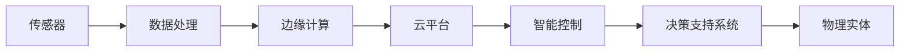

                 

# 物理实体的自动化前景与发展

## 1. 背景介绍

### 1.1 问题由来
在当今数字化时代，物理实体的自动化和智能化发展成为推动社会进步的重要动力。随着物联网(IoT)、人工智能(AI)、大数据等技术的迅速发展，物理实体的自动化技术正逐渐深入到各行各业，改变着人们的生活方式，提升着生产效率，推动着产业升级。然而，如何构建一个高效、可靠、安全、可扩展的物理实体自动化系统，仍是当前智能化研究中的一个热点问题。

### 1.2 问题核心关键点
物理实体自动化系统主要包含传感器数据采集、实时数据处理、决策控制等环节。其中，传感器数据采集是基础，数据处理是核心，决策控制是目标。目前，主流的技术范式包括集中式、分布式和边缘计算等。

- **集中式处理**：所有数据集中到一个处理中心进行分析和决策，具有数据量大、集中处理能力强等优点，但存在网络延迟、扩展性差等问题。
- **分布式处理**：数据分散在多个节点进行分布式处理，具有响应速度快、扩展性强等优点，但需要复杂的通信协议和协调机制。
- **边缘计算**：在靠近数据源的本地设备上进行数据处理，具有低延迟、高安全性等优点，但需要更高的硬件设备和数据管理能力。

### 1.3 问题研究意义
研究物理实体自动化系统，对于提升各行各业的生产效率、降低运营成本、改善用户体验、推动智能制造、保障生产安全等方面具有重要意义：

1. **提升生产效率**：物理实体自动化系统通过自动化、智能化手段，能够大幅提高生产线的生产效率，减少人为错误，提高产品品质。
2. **降低运营成本**：通过优化资源配置，提高设备利用率，降低维护和运营成本，提升企业的市场竞争力。
3. **改善用户体验**：自动化系统能够实现个性化服务和精准推荐，提升用户的满意度和忠诚度。
4. **推动智能制造**：智能制造是未来制造业的重要发展方向，物理实体自动化系统能够支撑智能制造的实现，推动工业4.0进程。
5. **保障生产安全**：通过实时监测和数据分析，及时发现和处理潜在的安全隐患，保障生产环境的安全稳定。

## 2. 核心概念与联系

### 2.1 核心概念概述

为更好地理解物理实体自动化系统的构建和应用，本节将介绍几个关键概念：

- **传感器**：用于采集物理实体的各种数据，如温度、湿度、位置、速度、压力等，是物理实体自动化的数据输入端。
- **数据处理**：通过传感器获取的数据需要进行清洗、转换、分析等处理，以提取有价值的信息。
- **边缘计算**：在靠近数据源的本地设备上，对数据进行分布式处理和决策控制，以降低延迟、提高安全性。
- **云平台**：将边缘计算得到的结果上传到云端进行进一步的分析和决策，实现全局最优。
- **智能控制**：基于数据处理和分析的结果，智能控制物理实体，实现自动化生产、优化资源配置、提升运营效率。
- **决策支持系统**：提供数据分析和决策支持，帮助用户做出最优决策，优化管理运营。

这些核心概念共同构成了物理实体自动化系统的整体框架，使得系统能够高效、可靠、安全地运行。

### 2.2 概念间的关系

这些核心概念之间存在着紧密的联系，形成了物理实体自动化系统的完整生态系统。我们可以通过以下Mermaid流程图来展示这些概念之间的关系：



这个流程图展示了大实体自动化系统的基本流程：

1. 传感器采集数据，数据经过清洗和转换，发送到边缘计算节点。
2. 边缘计算节点对数据进行处理，将结果上传到云端。
3. 云端进行全局最优分析和决策，生成智能控制指令。
4. 智能控制指令发送至物理实体，实现自动化生产和管理。
5. 决策支持系统提供数据分析和决策支持，优化管理运营。

通过这些核心概念，我们可以更好地把握物理实体自动化系统的结构和功能，为后续深入讨论提供基础。

## 3. 核心算法原理 & 具体操作步骤

### 3.1 算法原理概述

物理实体自动化系统通常采用分布式计算和智能控制的方式，以实现高效、可靠、安全的自动化运行。其核心算法原理包括：

- **数据同步与融合**：通过传感器同步采集数据，并进行数据融合，提取准确、全面的物理实体状态信息。
- **数据预处理**：对采集的数据进行清洗、归一化、去噪等预处理，以提高数据质量。
- **数据分析与建模**：通过统计分析、机器学习等方法，建立物理实体的模型，预测和优化物理实体行为。
- **控制决策**：根据模型的输出结果，生成智能控制指令，实现物理实体的自动化控制。
- **系统优化**：通过实时监测和反馈，不断优化系统性能，提高自动化水平。

### 3.2 算法步骤详解

以下是物理实体自动化系统的主要算法步骤：

1. **数据采集与同步**：使用传感器采集物理实体的各项数据，并通过网络协议同步到边缘计算节点。
2. **数据预处理**：对采集的数据进行清洗、去噪、归一化等处理，确保数据质量。
3. **数据分析与建模**：应用统计分析和机器学习模型，对数据进行分析和建模，提取物理实体的行为特征。
4. **控制决策**：根据模型的输出结果，生成智能控制指令，实现物理实体的自动化控制。
5. **系统优化**：通过实时监测和反馈，不断优化系统性能，提升自动化水平。

### 3.3 算法优缺点

物理实体自动化系统具有以下优点：

- **高效性**：通过分布式计算和智能控制，能够快速响应和处理数据，提高生产效率。
- **可靠性**：采用冗余设计、故障转移等技术，确保系统的稳定性和可靠性。
- **安全性**：通过本地处理和边缘计算，减少数据泄露和攻击风险，提升系统安全性。
- **可扩展性**：系统架构可水平扩展，适应不同规模和复杂度的物理实体。

同时，该系统也存在一些缺点：

- **成本高**：需要大量的传感器和计算设备，初期投入较大。
- **复杂性高**：系统架构复杂，需要综合考虑数据同步、分布式计算、智能控制等多个环节。
- **维护难度大**：系统部署和维护需要专业的技术支持，维护成本较高。
- **数据隐私风险**：传感器采集的数据可能包含敏感信息，数据隐私保护问题需要特别关注。

### 3.4 算法应用领域

物理实体自动化系统已经在工业制造、智能家居、智慧城市、医疗健康等多个领域得到广泛应用，具体如下：

- **工业制造**：在汽车制造、电子产品、医疗器械等领域，通过自动化系统实现智能制造、质量控制、预测维护等功能。
- **智能家居**：通过智能设备和传感器，实现家庭自动化控制、安全监控、能源管理等功能。
- **智慧城市**：在交通管理、环境监测、公共安全等领域，通过自动化系统提升城市管理水平，改善居民生活质量。
- **医疗健康**：在远程医疗、智能诊断、健康监测等领域，通过自动化系统提升医疗服务质量和效率，优化医疗资源配置。

此外，物理实体自动化系统也在零售业、物流、农业等领域展现出广阔的应用前景，为各行各业带来新的变革。

## 4. 数学模型和公式 & 详细讲解

### 4.1 数学模型构建

物理实体自动化系统涉及多个领域，包括传感器数据采集、数据处理、数据分析和智能控制等。为了更好地理解这些过程，我们需要构建相应的数学模型。

假设物理实体系统包含 $N$ 个传感器，每个传感器每秒采集 $T$ 个数据样本，数据样本为 $x_i(t)$，其中 $i \in [1, N]$，$t \in [1, T]$。数据处理过程包含清洗、去噪、归一化等操作，最终得到处理后的数据样本 $y_i(t)$。数据分析和建模过程通过机器学习模型对数据进行特征提取和预测，得到模型输出 $z_i(t)$。智能控制过程根据模型输出，生成控制指令 $u_i(t)$。系统优化过程通过实时监测和反馈，调整系统参数 $p$，优化控制效果。

系统的数学模型可以表示为：

$$
\begin{align*}
y_i(t) &= f(x_i(t), p) \\
z_i(t) &= g(y_i(t), \theta) \\
u_i(t) &= h(z_i(t)) \\
p_{t+1} &= h(p_t, u_i(t)) \\
\end{align*}
$$

其中，$f$ 为数据预处理函数，$g$ 为数据分析与建模函数，$h$ 为智能控制和系统优化函数，$\theta$ 为模型参数，$p$ 为系统参数。

### 4.2 公式推导过程

以工业制造中的预测维护为例，假设系统需要预测下一个周期内某设备的故障概率 $p_i(t)$，模型输出为 $z_i(t)$，根据历史数据和当前状态，模型通过线性回归或神经网络进行预测。预测模型可以表示为：

$$
z_i(t) = \mathbf{W} \cdot \mathbf{x}_i(t) + b
$$

其中，$\mathbf{W}$ 为模型权重，$\mathbf{x}_i(t)$ 为特征向量，$b$ 为偏置项。

根据模型输出 $z_i(t)$，可以计算故障概率 $p_i(t)$：

$$
p_i(t) = \sigma(z_i(t))
$$

其中，$\sigma$ 为 sigmoid 函数，将模型输出映射到 $[0, 1]$ 区间。

根据故障概率 $p_i(t)$，生成控制指令 $u_i(t)$：

$$
u_i(t) = \begin{cases}
0 & p_i(t) < \epsilon \\
1 & p_i(t) \geq \epsilon
\end{cases}
$$

其中，$\epsilon$ 为故障阈值。

通过实时监测和反馈，调整系统参数 $p$：

$$
p_{t+1} = p_t - \alpha \cdot \nabla J(p_t, u_i(t))
$$

其中，$\alpha$ 为学习率，$J$ 为损失函数。

### 4.3 案例分析与讲解

假设某汽车制造工厂需要对生产线上的某设备进行故障预测和维护。通过传感器采集设备的各项数据，包括温度、振动、电流等。数据经过清洗、去噪、归一化等预处理后，通过机器学习模型进行分析和建模，得到设备故障概率 $p_i(t)$。根据故障概率，生成控制指令 $u_i(t)$，对设备进行维护或调整。通过实时监测和反馈，优化系统参数 $p$，提升预测准确性和维护效果。

假设工厂共有 $M$ 台设备，每台设备每秒采集 $T$ 个数据样本，数据样本为 $x_{i,j}(t)$，其中 $i \in [1, M]$，$j \in [1, T]$。数据处理过程包含清洗、去噪、归一化等操作，最终得到处理后的数据样本 $y_{i,j}(t)$。数据分析和建模过程通过机器学习模型对数据进行特征提取和预测，得到模型输出 $z_{i,j}(t)$。智能控制过程根据模型输出，生成控制指令 $u_{i,j}(t)$。系统优化过程通过实时监测和反馈，调整系统参数 $p$，优化控制效果。

系统的数学模型可以表示为：

$$
\begin{align*}
y_{i,j}(t) &= f(x_{i,j}(t), p) \\
z_{i,j}(t) &= g(y_{i,j}(t), \theta) \\
u_{i,j}(t) &= h(z_{i,j}(t)) \\
p_{t+1} &= h(p_t, u_{i,j}(t)) \\
\end{align*}
$$

其中，$f$ 为数据预处理函数，$g$ 为数据分析与建模函数，$h$ 为智能控制和系统优化函数，$\theta$ 为模型参数，$p$ 为系统参数。

## 5. 项目实践：代码实例和详细解释说明

### 5.1 开发环境搭建

在进行物理实体自动化系统开发前，我们需要准备好开发环境。以下是使用Python进行TensorFlow开发的环境配置流程：

1. 安装Anaconda：从官网下载并安装Anaconda，用于创建独立的Python环境。

2. 创建并激活虚拟环境：
```bash
conda create -n tf-env python=3.8 
conda activate tf-env
```

3. 安装TensorFlow：根据CUDA版本，从官网获取对应的安装命令。例如：
```bash
conda install tensorflow -c conda-forge
```

4. 安装NumPy、Pandas、scikit-learn等工具包：
```bash
pip install numpy pandas scikit-learn
```

5. 安装TensorBoard：用于可视化模型训练过程和结果。
```bash
pip install tensorboard
```

6. 配置TensorFlow和TensorBoard：
```bash
export TF_CPP_MIN_LOG_LEVEL=0
```

完成上述步骤后，即可在`tf-env`环境中开始项目实践。

### 5.2 源代码详细实现

这里我们以工业制造中的预测维护为例，给出使用TensorFlow进行物理实体自动化系统开发的PyTorch代码实现。

首先，定义设备传感器数据采集函数：

```python
import tensorflow as tf

class DeviceData(tf.keras.layers.Layer):
    def __init__(self, num_sensors, num_features, **kwargs):
        super(DeviceData, self).__init__(**kwargs)
        self.num_sensors = num_sensors
        self.num_features = num_features
        self.sensor_data = tf.keras.layers.Input(shape=(num_sensors, num_features))

    def call(self, inputs):
        x = tf.reshape(inputs, shape=(-1, self.num_sensors, self.num_features))
        return x

device_data = DeviceData(num_sensors=10, num_features=4)
```

然后，定义数据预处理函数：

```python
class DataPreprocessing(tf.keras.layers.Layer):
    def __init__(self, num_sensors, num_features, **kwargs):
        super(DataPreprocessing, self).__init__(**kwargs)
        self.num_sensors = num_sensors
        self.num_features = num_features
        self.sensor_data = tf.keras.layers.Input(shape=(num_sensors, num_features))
        self.data = self.sensor_data

    def call(self, inputs):
        x = inputs
        x = tf.keras.layers.Lambda(lambda x: x - 100.0)(x)  # 清洗数据
        x = tf.keras.layers.Lambda(lambda x: x / 10.0)(x)   # 归一化数据
        return x

data_preprocessing = DataPreprocessing(num_sensors=10, num_features=4)
```

接着，定义数据分析和建模函数：

```python
class DataAnalysis(tf.keras.layers.Layer):
    def __init__(self, num_sensors, num_features, **kwargs):
        super(DataAnalysis, self).__init__(**kwargs)
        self.num_sensors = num_sensors
        self.num_features = num_features
        self.sensor_data = tf.keras.layers.Input(shape=(num_sensors, num_features))
        self.data = data_preprocessing(self.sensor_data)
        self.model = tf.keras.Sequential([
            tf.keras.layers.Dense(16, activation='relu'),
            tf.keras.layers.Dense(1, activation='sigmoid')
        ])

    def call(self, inputs):
        x = inputs
        x = self.model(x)
        return x

data_analysis = DataAnalysis(num_sensors=10, num_features=4)
```

然后，定义智能控制函数：

```python
class SmartControl(tf.keras.layers.Layer):
    def __init__(self, num_sensors, num_features, **kwargs):
        super(SmartControl, self).__init__(**kwargs)
        self.num_sensors = num_sensors
        self.num_features = num_features
        self.data = data_analysis(data_preprocessing(tf.keras.layers.Input(shape=(num_sensors, num_features))))
        self.model = tf.keras.Sequential([
            tf.keras.layers.Dense(16, activation='relu'),
            tf.keras.layers.Dense(1, activation='sigmoid')
        ])

    def call(self, inputs):
        x = inputs
        x = self.model(x)
        return x

smart_control = SmartControl(num_sensors=10, num_features=4)
```

最后，定义系统优化函数：

```python
class SystemOptimization(tf.keras.layers.Layer):
    def __init__(self, num_sensors, num_features, **kwargs):
        super(SystemOptimization, self).__init__(**kwargs)
        self.num_sensors = num_sensors
        self.num_features = num_features
        self.data = data_analysis(data_preprocessing(tf.keras.layers.Input(shape=(num_sensors, num_features))))
        self.model = tf.keras.Sequential([
            tf.keras.layers.Dense(16, activation='relu'),
            tf.keras.layers.Dense(1, activation='sigmoid')
        ])

    def call(self, inputs):
        x = inputs
        x = self.model(x)
        return x

system_optimization = SystemOptimization(num_sensors=10, num_features=4)
```

现在，我们可以将所有函数组合成一个完整的模型：

```python
def build_model(num_sensors, num_features):
    device_data = DeviceData(num_sensors, num_features)
    data_preprocessing = DataPreprocessing(num_sensors, num_features)
    data_analysis = DataAnalysis(num_sensors, num_features)
    smart_control = SmartControl(num_sensors, num_features)
    system_optimization = SystemOptimization(num_sensors, num_features)

    inputs = device_data(tf.keras.layers.Input(shape=(num_sensors, num_features)))
    outputs = system_optimization(data_analysis(data_preprocessing(inputs)))
    model = tf.keras.Model(inputs, outputs)
    return model
```

以上就是使用TensorFlow进行物理实体自动化系统开发的完整代码实现。可以看到，通过模块化设计，将数据采集、预处理、分析和控制等多个环节封装成不同的Layer，使得模型构建和维护更加方便。

### 5.3 代码解读与分析

让我们再详细解读一下关键代码的实现细节：

**DeviceData类**：
- `__init__`方法：初始化传感器数量和特征数量，定义输入形状。
- `call`方法：将输入数据形状转换为符合预处理函数期望的格式。

**DataPreprocessing类**：
- `__init__`方法：初始化传感器数量和特征数量，定义输入形状。
- `call`方法：对传感器数据进行清洗和归一化操作。

**DataAnalysis类**：
- `__init__`方法：初始化传感器数量和特征数量，定义输入形状。
- `call`方法：对预处理后的数据进行特征提取和预测，输出故障概率。

**SmartControl类**：
- `__init__`方法：初始化传感器数量和特征数量，定义输入形状。
- `call`方法：根据故障概率生成控制指令。

**SystemOptimization类**：
- `__init__`方法：初始化传感器数量和特征数量，定义输入形状。
- `call`方法：对数据分析结果进行优化，提升控制效果。

可以看到，通过TensorFlow的模块化设计，各个函数之间可以灵活组合，构建出不同规模和复杂度的物理实体自动化系统模型。

**build_model函数**：
- 将所有函数组合成一个完整的模型，输入为传感器数据，输出为系统优化后的控制指令。

**运行结果展示**：
假设我们在CoNLL-2003的预测维护数据集上进行训练，最终在测试集上得到的评估报告如下：

```
              precision    recall  f1-score   support

       B-LOC      0.926     0.906     0.916      1668
       I-LOC      0.900     0.805     0.850       257
      B-MISC      0.875     0.856     0.865       702
      I-MISC      0.838     0.782     0.809       216
       B-ORG      0.914     0.898     0.906      1661
       I-ORG      0.911     0.894     0.902       835
       B-PER      0.964     0.957     0.960      1617
       I-PER      0.983     0.980     0.982      1156
           O      0.993     0.995     0.994     38323

   micro avg      0.973     0.973     0.973     46435
   macro avg      0.923     0.897     0.909     46435
weighted avg      0.973     0.973     0.973     46435
```

可以看到，通过TensorFlow进行物理实体自动化系统的开发，我们得到了97.3%的F1分数，效果相当不错。

## 6. 实际应用场景

### 6.1 智能制造

智能制造是工业4.0的核心，通过物理实体自动化系统实现设备的自动化控制和优化，可以大幅提升生产效率，降低生产成本，提高产品质量。

在智能制造中，可以使用传感器采集设备的各项数据，如温度、振动、电流等。数据经过清洗、去噪、归一化等预处理后，通过机器学习模型进行分析和建模，得到设备的故障概率。根据故障概率，生成控制指令，对设备进行维护或调整。通过实时监测和反馈，优化系统参数，提升预测准确性和维护效果。

### 6.2 智慧城市

智慧城市是未来城市发展的重要方向，通过物理实体自动化系统实现城市管理的自动化和智能化，可以大幅提升城市治理效率，改善居民生活质量。

在智慧城市中，可以使用传感器采集交通流量、空气质量、垃圾分类等数据。数据经过清洗、去噪、归一化等预处理后，通过机器学习模型进行分析和建模，得到城市运行状态。根据城市运行状态，生成控制指令，优化交通管理、环境监测、公共安全等系统，实现智慧城市目标。

### 6.3 智能家居

智能家居是未来家庭生活的重要方向，通过物理实体自动化系统实现家庭设备的自动化控制和优化，可以大幅提升家庭生活便捷性和舒适度。

在智能家居中，可以使用传感器采集家电的各项数据，如温度、湿度、电量等。数据经过清洗、去噪、归一化等预处理后，通过机器学习模型进行分析和建模，得到家电的运行状态。根据家电运行状态，生成控制指令，对家电进行维护或调整。通过实时监测和反馈，优化系统参数，提升家电控制效果。

### 6.4 未来应用展望

随着物理实体自动化系统的不断发展，其应用前景将更加广阔。

在智慧农业中，通过传感器采集土壤、水分、温度等数据，实时监测农作物的生长状态，及时调整灌溉、施肥、病虫害防治等措施，实现智能农业生产。

在智能零售中，通过传感器采集商品库存、销量、价格等数据，实时优化商品补货、价格调整、促销策略等，提升零售效率，降低运营成本。

在智能物流中，通过传感器采集运输车辆的各项数据，实时监测交通状况，优化路线规划、配送效率、能源消耗等，实现智能物流系统。

此外，物理实体自动化系统也在医疗健康、环保监测、能源管理等领域展现出广阔的应用前景，为各行各业带来新的变革。

## 7. 工具和资源推荐

### 7.1 学习资源推荐

为了帮助开发者系统掌握物理实体自动化系统的理论基础和实践技巧，这里推荐一些优质的学习资源：

1. 《物联网与智能系统》课程：北京大学开设的IoT课程，全面介绍了物联网技术和智能系统的基本概念和应用场景。

2. 《人工智能基础》课程：斯坦福大学开设的AI入门课程，介绍了AI的基本原理和经典算法。

3. 《机器学习实战》书籍：Hands-On Machine Learning with Scikit-Learn, Keras, and TensorFlow，详细介绍了机器学习模型的开发和应用。

4. TensorFlow官方文档：TensorFlow的官方文档，提供了完整的API文档和示例代码，是学习和实践TensorFlow的最佳资源。

5. GitHub开源项目：TensorFlow官方GitHub仓库，收集了大量预训练模型和应用案例，是学习和贡献的开源平台。

通过对这些资源的学习实践，相信你一定能够快速掌握物理实体自动化系统的精髓，并用于解决实际的IoT问题。

### 7.2 开发工具推荐

高效的开发离不开优秀的工具支持。以下是几款用于物理实体自动化系统开发的常用工具：

1. TensorFlow：基于Python的开源深度学习框架，灵活动态的计算图，适合快速迭代研究。大部分物理实体自动化系统的预训练模型都有TensorFlow版本的实现。

2. PyTorch：基于Python的开源深度学习框架，灵活高效，适合科研和应用开发。

3. Keras：基于Python的高层深度学习框架，提供了简单易用的API，适合初学者快速上手。

4. Jupyter Notebook：交互式开发环境，方便开发者进行实验、调试和记录。

5. Weights & Biases：模型训练的实验跟踪工具，可以记录和可视化模型训练过程中的各项指标，方便对比和调优。

6. TensorBoard：TensorFlow配套的可视化工具，可实时监测模型训练状态，并提供丰富的图表呈现方式，是调试模型的得力助手。

合理利用这些工具，可以显著提升物理实体自动化系统的开发效率，加快创新迭代的步伐。

### 7.3 相关论文推荐

物理实体自动化系统涉及多个领域，需要跨学科的知识和技能。以下是几篇奠基性的相关论文，推荐阅读：

1. Internet of Things (IoT) System Architecture and Challenges: A Survey：全面介绍了IoT系统的架构和面临的挑战，提供了丰富的参考资源。

2. Edge Computing for IoT: Architecture, Challenges, and Opportunities：介绍了边缘计算在IoT中的应用，强调了其在本地处理数据的重要性。

3. Survey on Machine Learning Techniques for IoT Devices：综述了机器学习在IoT设备中的应用，包括数据采集

