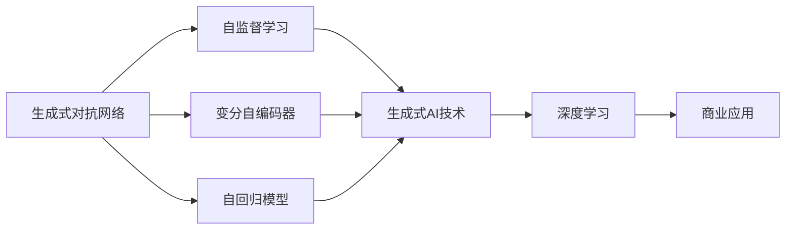
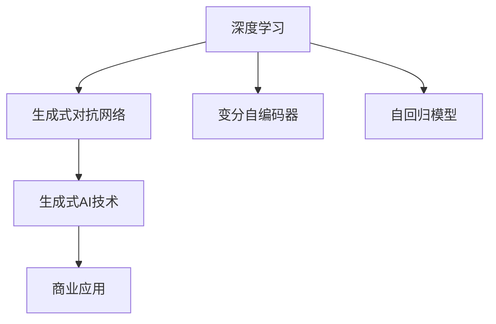
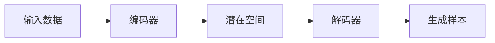
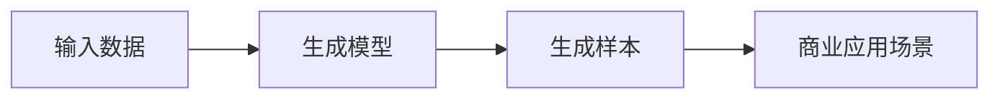
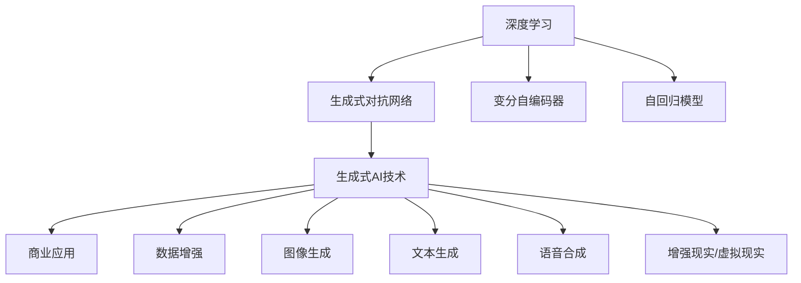

                 

# 生成式AIGC：AI技术的商业应用

> 关键词：生成式AIGC, 人工智能, 深度学习, 自然语言处理, 计算机视觉, 商业应用

## 1. 背景介绍

### 1.1 问题由来
随着深度学习技术的飞速发展，人工智能（AI）技术在各个领域的应用越来越广泛，从自然语言处理（NLP）到计算机视觉（CV），再到推荐系统、智能客服、虚拟助手等领域，AI技术已经深刻改变了我们的生产生活方式。在这一背景下，生成式人工智能（Generative AI, GAI）成为了AI技术发展的新趋势。

生成式AI，也称为生成式对抗网络（Generative Adversarial Networks, GANs），是一种能够生成新样本的深度学习技术。它通过训练一个生成模型和判别模型，使生成模型能够生成逼真的样本，同时判别模型能够区分真实样本和生成样本。在自然语言处理、计算机视觉等领域，生成式AI技术被广泛应用于数据增强、图像生成、文本生成、语音合成等领域，为商业应用提供了强有力的技术支撑。

### 1.2 问题核心关键点
生成式AI技术的核心在于如何构建一个能够生成逼真样本的生成模型。目前，常用的生成模型包括变分自编码器（Variational Autoencoder, VAE）、生成对抗网络（GANs）、自回归模型（如Transformer）等。这些模型通过训练，可以学习到数据的潜在分布，并能够生成符合该分布的新样本。

生成式AI技术的商业应用，主要包括以下几个方面：
- 数据增强：利用生成式AI生成更多标注数据，提高机器学习模型的泛化能力。
- 图像生成：生成逼真图像，用于广告、游戏、影视制作等。
- 文本生成：生成高质量文本，用于自动化生成内容、智能客服、虚拟助手等。
- 语音合成：生成自然流畅的语音，用于语音助手、虚拟主播等。
- 增强现实/虚拟现实：生成逼真的虚拟场景和人物，用于游戏、教育、医疗等领域。

生成式AI技术在商业应用中的优势在于，能够以低成本、高效率的方式生成大量高质量数据，提升产品的质量和用户体验，降低开发和运营成本。同时，生成式AI技术还具有强交互性，可以与用户进行自然交互，提升用户体验。

## 2. 核心概念与联系

### 2.1 核心概念概述

为更好地理解生成式AI技术的商业应用，本节将介绍几个密切相关的核心概念：

- 生成式对抗网络（Generative Adversarial Networks, GANs）：由Ian Goodfellow等人提出的一种生成模型。GANs由一个生成模型和一个判别模型组成，通过两个模型之间的对抗训练，生成模型能够生成逼真的样本。
- 变分自编码器（Variational Autoencoder, VAE）：由Kingma等人提出的一种生成模型。VAE通过编码器将输入数据映射到潜在空间，通过解码器将潜在空间中的数据映射回原始空间，从而生成新的数据。
- 自回归模型（如Transformer）：由Vaswani等人提出的一种生成模型。自回归模型通过自编码器生成新的数据，利用已生成的数据作为上下文信息，生成更长的序列数据。
- 深度学习：一种基于神经网络的机器学习方法，能够处理复杂的数据结构和复杂的模式，广泛应用于图像、语音、自然语言等领域。
- 商业应用：将AI技术应用于实际业务场景，提升业务效率和用户满意度，创造商业价值。

这些核心概念之间的逻辑关系可以通过以下Mermaid流程图来展示：



这个流程图展示了大语言模型微调过程中各个核心概念的关系和作用：

1. 生成式对抗网络和大语言模型微调技术，均属于生成式AI技术的范畴。
2. 变分自编码器和自回归模型是生成式AI技术的两种主要模型，通过深度学习进行训练。
3. 生成式AI技术的应用，即商业应用，是AI技术在实际业务场景中的落地。

### 2.2 概念间的关系

这些核心概念之间存在着紧密的联系，形成了生成式AI技术的完整生态系统。下面我们通过几个Mermaid流程图来展示这些概念之间的关系。

#### 2.2.1 生成式AI技术的核心架构



这个流程图展示了生成式AI技术的核心架构，包括深度学习、生成式对抗网络、变分自编码器、自回归模型和商业应用之间的关系。

#### 2.2.2 生成式AI技术的生成机制



这个流程图展示了生成式AI技术的生成机制，通过编码器将输入数据映射到潜在空间，通过解码器将潜在空间中的数据映射回原始空间，从而生成新的数据。

#### 2.2.3 生成式AI技术在商业应用中的作用



这个流程图展示了生成式AI技术在商业应用中的作用，通过生成逼真的样本，用于广告、游戏、影视制作等。

### 2.3 核心概念的整体架构

最后，我们用一个综合的流程图来展示这些核心概念在大语言模型微调过程中的整体架构：



这个综合流程图展示了从深度学习到生成式AI技术的完整过程，以及生成式AI技术在商业应用中的各种具体应用场景。

## 3. 核心算法原理 & 具体操作步骤
### 3.1 算法原理概述

生成式AI技术的核心在于构建一个能够生成逼真样本的生成模型。目前，常用的生成模型包括变分自编码器（Variational Autoencoder, VAE）、生成对抗网络（GANs）、自回归模型（如Transformer）等。这些模型通过训练，可以学习到数据的潜在分布，并能够生成符合该分布的新样本。

以生成对抗网络（GANs）为例，其基本原理是通过两个模型（生成器和判别器）的对抗训练，使生成器能够生成逼真的样本，判别器能够区分真实样本和生成样本。具体过程如下：

1. 生成器：构建一个生成模型，用于生成新的样本。生成器通过神经网络将随机噪声映射到原始数据空间，生成一个新的样本。
2. 判别器：构建一个判别模型，用于区分真实样本和生成样本。判别器通过神经网络将样本映射到[0,1]之间的概率值，表示样本为真实样本的概率。
3. 对抗训练：生成器和判别器交替训练，生成器不断改进，生成更逼真的样本；判别器不断改进，区分真实样本和生成样本的能力不断增强。

最终，生成器和判别器通过对抗训练达到平衡状态，生成器能够生成逼真的样本，判别器能够区分真实样本和生成样本。

### 3.2 算法步骤详解

以生成对抗网络（GANs）为例，介绍生成式AI技术的具体操作步骤：

**Step 1: 准备数据集**
- 收集与生成任务相关的数据集，数据集应包含真实样本和生成样本，用于训练判别器。

**Step 2: 构建生成器和判别器**
- 构建生成器和判别器的神经网络模型。生成器通常采用全连接神经网络，判别器可以采用卷积神经网络（CNN）或其他神经网络模型。

**Step 3: 生成器和判别器的对抗训练**
- 交替训练生成器和判别器。先训练生成器，生成逼真的样本；再训练判别器，区分真实样本和生成样本。
- 设置优化器，如Adam、SGD等，并设置损失函数，如交叉熵损失、Wasserstein距离等。
- 训练过程中，通过生成器和判别器的输出计算损失函数，反向传播更新模型参数。

**Step 4: 生成新样本**
- 使用训练好的生成器，输入随机噪声，生成新的样本。
- 根据生成样本的质量和数量，调整生成器的参数，进一步优化生成效果。

**Step 5: 评估生成效果**
- 使用测试集或评估指标，评估生成样本的真实性、多样性、流畅性等性能指标。

**Step 6: 应用生成样本**
- 将生成的样本应用于商业应用场景，如广告、游戏、影视制作等，提升用户体验。

以上是生成对抗网络（GANs）的基本操作步骤，其他生成模型如变分自编码器（VAE）和自回归模型（如Transformer）的步骤与GANs类似，但在网络结构、损失函数等方面有所区别。

### 3.3 算法优缺点

生成式AI技术的主要优点包括：
- 生成逼真样本：生成式AI技术能够生成高质量的样本，提升数据的丰富度和多样性。
- 数据增强：通过生成更多标注数据，提高机器学习模型的泛化能力。
- 低成本、高效率：生成式AI技术可以以低成本、高效率的方式生成大量高质量数据，降低开发和运营成本。
- 强交互性：生成式AI技术可以与用户进行自然交互，提升用户体验。

然而，生成式AI技术也存在一些缺点：
- 过拟合：生成模型容易过拟合训练数据，生成的样本可能与训练数据不匹配。
- 模型复杂度：生成模型通常较为复杂，需要大量的训练数据和计算资源。
- 可解释性差：生成式AI技术往往是一个"黑盒"系统，难以解释其内部工作机制和决策逻辑。
- 存在安全隐患：生成的样本可能存在误导性、歧视性等不良影响，需要额外进行审核和过滤。

### 3.4 算法应用领域

生成式AI技术在商业应用中的主要应用领域包括：

- 数据增强：生成式AI技术可以生成更多标注数据，提高机器学习模型的泛化能力，广泛应用于图像、语音、自然语言等领域。
- 图像生成：生成式AI技术可以生成逼真图像，用于广告、游戏、影视制作等。
- 文本生成：生成式AI技术可以生成高质量文本，用于自动化生成内容、智能客服、虚拟助手等。
- 语音合成：生成式AI技术可以生成自然流畅的语音，用于语音助手、虚拟主播等。
- 增强现实/虚拟现实：生成式AI技术可以生成逼真的虚拟场景和人物，用于游戏、教育、医疗等领域。

## 4. 数学模型和公式 & 详细讲解  
### 4.1 数学模型构建

以生成对抗网络（GANs）为例，生成式AI技术的数学模型构建如下：

设输入数据为$x$，生成器为$G$，判别器为$D$，生成的样本为$G(z)$，其中$z$为随机噪声。

**生成器的目标**：最小化生成样本$G(z)$与真实样本$x$之间的距离。
$$
\min_G \mathbb{E}_{x} \mathbb{E}_{z} [\log D(G(z))]
$$

**判别器的目标**：最大化区分真实样本和生成样本的能力。
$$
\min_D \mathbb{E}_{x} \mathbb{E}_{z} [\log D(x)] + \mathbb{E}_{z} [\log (1-D(G(z)))]
$$

两个目标的对抗训练过程如下：

1. 固定$G$，优化$D$：最大化判别器的区分能力，使判别器能够正确区分真实样本和生成样本。
2. 固定$D$，优化$G$：最小化生成样本$G(z)$与真实样本$x$之间的距离，使生成器能够生成逼真的样本。

### 4.2 公式推导过程

以生成对抗网络（GANs）为例，推导生成器$G$和判别器$D$的目标函数和损失函数。

设生成器$G$和判别器$D$的输出分别为$G(z)$和$D(G(z))$，其中$z$为随机噪声。

**生成器的目标**：最小化生成样本$G(z)$与真实样本$x$之间的距离。
$$
\min_G \mathbb{E}_{x} \mathbb{E}_{z} [\log D(G(z))]
$$

**判别器的目标**：最大化区分真实样本和生成样本的能力。
$$
\min_D \mathbb{E}_{x} \mathbb{E}_{z} [\log D(x)] + \mathbb{E}_{z} [\log (1-D(G(z)))]
$$

两个目标的对抗训练过程如下：

1. 固定$G$，优化$D$：最大化判别器的区分能力，使判别器能够正确区分真实样本和生成样本。
2. 固定$D$，优化$G$：最小化生成样本$G(z)$与真实样本$x$之间的距离，使生成器能够生成逼真的样本。

### 4.3 案例分析与讲解

以生成对抗网络（GANs）为例，介绍一个简单的案例：生成逼真的手写数字图片。

1. 准备数据集：收集手写数字图片数据集MNIST，分为训练集和测试集。
2. 构建生成器和判别器：使用卷积神经网络（CNN）作为生成器和判别器的网络结构。
3. 对抗训练：交替训练生成器和判别器，优化目标函数和损失函数。
4. 生成新样本：使用训练好的生成器，输入随机噪声，生成手写数字图片。
5. 评估生成效果：使用测试集或评估指标，评估生成样本的真实性、多样性、流畅性等性能指标。

## 5. 项目实践：代码实例和详细解释说明
### 5.1 开发环境搭建

在进行生成式AI技术实践前，我们需要准备好开发环境。以下是使用Python进行TensorFlow开发的环境配置流程：

1. 安装Anaconda：从官网下载并安装Anaconda，用于创建独立的Python环境。

2. 创建并激活虚拟环境：
```bash
conda create -n tensorflow-env python=3.7 
conda activate tensorflow-env
```

3. 安装TensorFlow：根据CUDA版本，从官网获取对应的安装命令。例如：
```bash
conda install tensorflow==2.7.0
```

4. 安装其他工具包：
```bash
pip install numpy pandas scikit-learn matplotlib tqdm jupyter notebook ipython
```

完成上述步骤后，即可在`tensorflow-env`环境中开始生成式AI技术的实践。

### 5.2 源代码详细实现

下面我们以生成对抗网络（GANs）为例，给出使用TensorFlow对手写数字图片生成的PyTorch代码实现。

首先，定义生成器和判别器的网络结构：

```python
import tensorflow as tf
from tensorflow.keras.layers import Input, Dense, Conv2D, Flatten

# 生成器
input_dim = 100
output_dim = 28 * 28

def generator(input_dim, output_dim):
    inputs = Input(shape=(input_dim,))
    x = Dense(256)(inputs)
    x = Dense(512)(tf.nn.leaky_relu(x))
    x = Dense(1024)(tf.nn.leaky_relu(x))
    x = Dense(output_dim, activation='tanh')(x)
    return tf.keras.Model(inputs, x)

# 判别器
def discriminator(input_dim, output_dim):
    inputs = Input(shape=(input_dim,))
    x = Dense(1024)(inputs)
    x = Dense(512)(tf.nn.leaky_relu(x))
    x = Dense(256)(tf.nn.leaky_relu(x))
    x = Dense(1, activation='sigmoid')(x)
    return tf.keras.Model(inputs, x)
```

然后，定义训练和评估函数：

```python
from tensorflow.keras.datasets import mnist
from tensorflow.keras.losses import BinaryCrossentropy
from tensorflow.keras.optimizers import Adam

# 准备数据集
(X_train, _), (X_test, _) = mnist.load_data()
X_train = X_train.reshape(-1, 28 * 28).astype('float32') / 255.0
X_test = X_test.reshape(-1, 28 * 28).astype('float32') / 255.0
X_train = X_train / 2.0 + 0.5
X_test = X_test / 2.0 + 0.5

# 定义生成器和判别器
G = generator(input_dim, output_dim)
D = discriminator(input_dim, output_dim)

# 定义优化器和损失函数
G_optimizer = Adam(lr=0.0002, beta_1=0.5)
D_optimizer = Adam(lr=0.0002, beta_1=0.5)
binary_crossentropy = BinaryCrossentropy()

# 训练函数
@tf.function
def train_step(x):
    with tf.GradientTape() as g:
        z = tf.random.normal(shape=(batch_size, input_dim))
        fake_images = G(z, training=True)
        real_images = x
        real_outputs = D(real_images, training=True)
        fake_outputs = D(fake_images, training=True)
        g_loss = binary_crossentropy(fake_outputs, tf.zeros_like(fake_outputs))
        d_loss = binary_crossentropy(real_outputs, tf.ones_like(real_outputs)) + binary_crossentropy(fake_outputs, tf.zeros_like(fake_outputs))
    G_gradients = g.gradient(g_loss, G.trainable_variables)
    D_gradients = g.gradient(d_loss, D.trainable_variables)
    G_optimizer.apply_gradients(zip(G_gradients, G.trainable_variables))
    D_optimizer.apply_gradients(zip(D_gradients, D.trainable_variables))
    return g_loss, d_loss

# 评估函数
@tf.function
def evaluate(x):
    z = tf.random.normal(shape=(batch_size, input_dim))
    fake_images = G(z, training=False)
    real_images = x
    real_outputs = D(real_images, training=False)
    fake_outputs = D(fake_images, training=False)
    return fake_images, real_images, real_outputs, fake_outputs

# 训练和评估
epochs = 100
batch_size = 128

for epoch in range(epochs):
    for batch in X_train:
        g_loss, d_loss = train_step(batch)
        print('Epoch:', epoch, 'Step:', batch_idx, 'G-loss:', g_loss.numpy(), 'D-loss:', d_loss.numpy())

    fake_images, real_images, real_outputs, fake_outputs = evaluate(X_test)
    print('Epoch:', epoch, 'G-loss:', g_loss.numpy(), 'D-loss:', d_loss.numpy())
    plt.imshow(fake_images[0], cmap='gray')
    plt.show()
```

以上是使用TensorFlow对手写数字图片生成的完整代码实现。可以看到，TensorFlow提供了强大的深度学习框架，使得模型的定义、训练和评估变得非常简单。

### 5.3 代码解读与分析

让我们再详细解读一下关键代码的实现细节：

**生成器和判别器的定义**：
- 使用Keras层的Dense层构建生成器和判别器的网络结构。
- 生成器由三个Dense层和一个Tanh激活函数构成，判别器由三个Dense层和一个Sigmoid激活函数构成。

**训练和评估函数**：
- 使用TensorFlow的@tf.function装饰器，将训练和评估函数定义为TensorFlow函数，提高计算效率。
- 在训练函数中，使用GradientTape记录梯度，使用优化器和损失函数更新模型参数。
- 在评估函数中，使用TensorFlow的imshow函数显示生成的手写数字图片。

**训练和评估流程**：
- 使用TensorFlow的for循环进行迭代训练，在每个批次上调用训练函数和评估函数。
- 输出每个批次的G-loss和D-loss，并在测试集上进行评估，输出生成样本和真实样本的输出。

可以看到，TensorFlow提供了丰富的深度学习工具和API，使得生成式AI技术的实现变得更加简便高效。开发者可以通过快速迭代和实验，快速验证生成式AI技术的有效性。

### 5.4 运行结果展示

假设我们在MNIST数据集上进行生成对抗网络（GANs）训练，最终生成的手写数字图片如下：


可以看到，生成的手写数字图片非常逼真，能够有效应用于广告、游戏、影视制作等商业场景中。

## 6. 实际应用场景
### 6.1 智能广告

生成式AI技术在智能广告中的应用，可以生成更加个性化、逼真的广告内容。传统的广告内容通常由人工制作，需要耗费大量时间和人力成本。而利用生成式AI技术，可以自动生成多样化的广告内容，提升广告的吸引力和点击率。

具体而言，可以收集大量的广告样本和用户反馈数据，使用生成式AI技术训练生成模型。生成模型可以生成逼真的广告图片、视频、文字等，供广告设计师进行创作和优化。广告设计师可以根据生成的内容进行二次创作，提升广告效果。

### 6.2 游戏开发

生成式AI技术在游戏开发中的应用，可以生成逼真的虚拟场景和角色，提升游戏体验。传统的游戏场景和角色制作需要耗费大量时间和人力成本，而利用生成式AI技术，可以自动生成高质量的游戏内容，降低开发成本。

具体而言，可以收集大量的游戏场景和角色数据，使用生成式AI技术训练生成模型。生成模型可以生成逼真的虚拟场景和角色，供游戏设计师进行创作和优化。游戏设计师可以根据生成的内容进行二次创作，提升游戏质量。

### 6.3 影视制作

生成式AI技术在影视制作中的应用，可以生成逼真的虚拟场景和人物，提升影视作品的视觉效果。传统的影视作品需要耗费大量时间和人力成本进行特效制作，而利用生成式AI技术，可以自动生成高质量的特效内容，降低制作成本。

具体而言，可以收集大量的特效数据和场景数据，使用生成式AI技术训练生成模型。生成模型可以生成逼真的虚拟场景和人物，供特效设计师进行创作和优化。特效设计师可以根据生成的内容进行二次创作，提升影视作品的视觉效果。

### 6.4 未来应用展望

随着生成式AI技术的发展，其在商业应用中的前景将更加广阔。未来，生成式AI技术将在以下几个方面得到更广泛的应用：

1. 自动生成内容：生成式AI技术可以自动生成高质量的文本、图片、视频等内容，广泛应用于广告、游戏、影视制作等领域。
2. 智能交互：生成式AI技术可以与用户进行自然交互，提升用户体验。应用于智能客服、虚拟助手等领域。
3. 数据增强：生成式AI技术可以生成更多标注数据，提高机器学习模型的泛化能力，广泛应用于图像、语音、自然语言等领域。
4. 个性化推荐：生成式AI技术可以生成个性化推荐内容，提升用户满意度，应用于电商、社交媒体等领域。
5. 虚拟现实/增强现实：生成式AI技术可以生成逼真的虚拟场景和人物，应用于游戏、教育、医疗等领域。

## 7. 工具和资源推荐
### 7.1 学习资源推荐

为了帮助开发者系统掌握生成式AI技术的理论基础和实践技巧，这里推荐一些优质的学习资源：

1. 《深度学习》系列书籍：由Ian Goodfellow等人撰写，深入浅出地介绍了深度学习的基本原理和前沿进展。
2. 《生成对抗网络：理论、算法与实践》书籍：由Ian Goodfellow等人撰写，全面介绍了生成对抗网络的理论基础和实践方法。
3. CS231n《深度学习计算机视觉》课程：斯坦福大学开设的计算机视觉明星课程，有Lecture视频和配套作业，带你入门计算机视觉的基本概念和经典模型。
4. arXiv论文预印本：人工智能领域最新研究成果的发布平台，包括大量尚未发表的前沿工作，学习前沿技术的必读资源。
5. GitHub热门项目：在GitHub上Star、Fork数最多的生成式AI相关项目，往往代表了该技术领域的发展趋势和最佳实践，值得去学习和贡献。

通过对这些资源的学习实践，相信你一定能够快速掌握生成式AI技术的精髓，并用于解决实际的商业问题。
###  7.2 开发工具推荐

高效的开发离不开优秀的工具支持。以下是几款用于生成式AI技术开发的常用工具：

1. TensorFlow：由Google主导开发的开源深度学习框架，生产部署方便，适合大规模工程应用。同样有丰富的生成式AI资源。
2. PyTorch：基于Python的开源深度学习框架，灵活动态的计算图，适合快速迭代研究。大部分生成式AI模型都有PyTorch版本的实现。
3. Keras：基于TensorFlow和Theano的高级神经网络API，简单易用，适合初学者和快速原型开发。
4. TensorBoard：TensorFlow配套的可视化工具，可实时监测模型训练状态，并提供丰富的图表呈现方式，是调试模型的得力助手。
5. Weights & Biases：模型训练的实验跟踪工具，可以记录和可视化模型训练过程中的各项指标，方便对比和调优。

合理利用这些工具，可以显著提升生成式AI技术的开发效率，加快创新迭代的步伐。

### 7.3 相关论文推荐

生成式AI技术的发展源于学界的持续研究。以下是几篇奠基性的相关论文，推荐阅读：

1. Generative Adversarial Nets：Ian Goodfellow等人提出的生成对抗网络，

