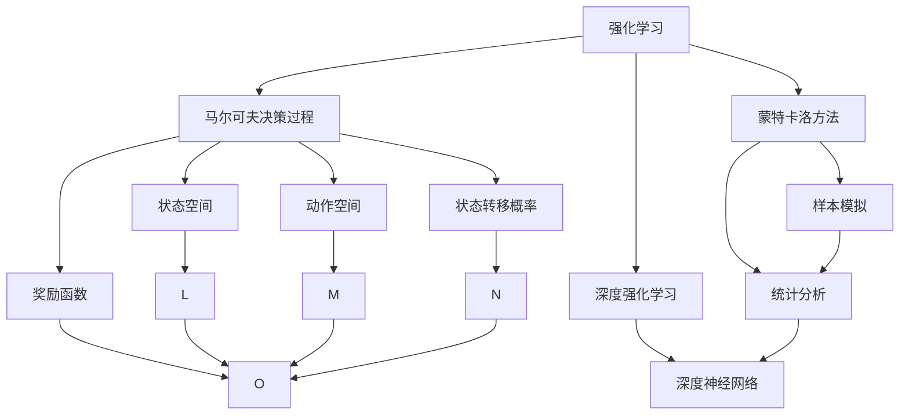
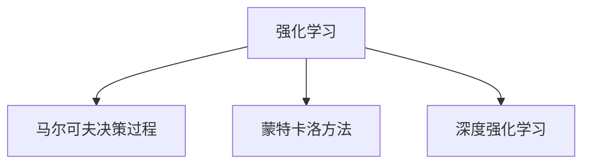
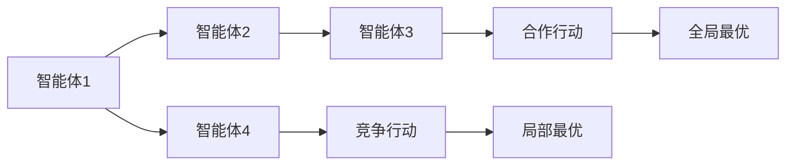
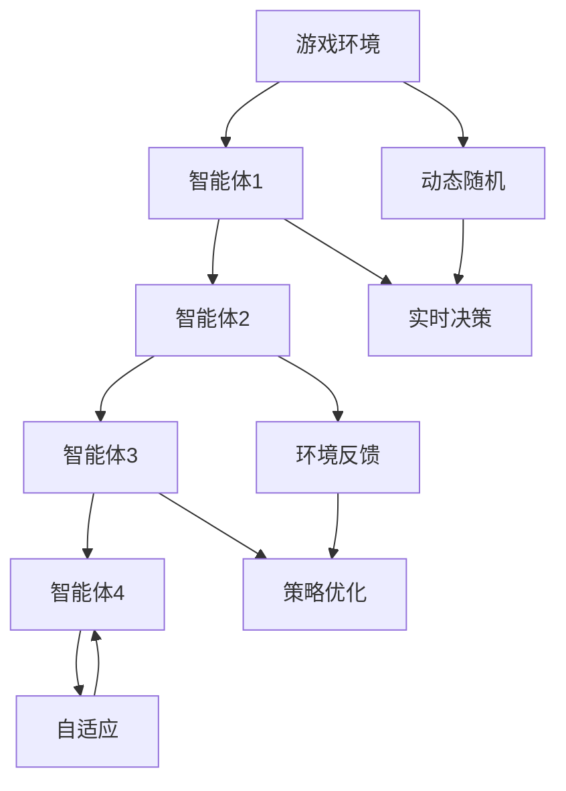
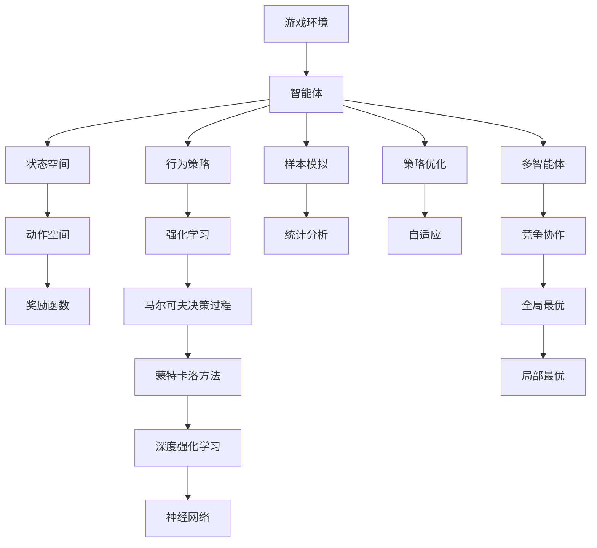

                 

# 一切皆是映射：强化学习在游戏AI中的应用：案例与分析

> 关键词：强化学习,游戏AI,强化学习算法,马尔可夫决策过程,蒙特卡洛方法,深度强化学习,案例分析

## 1. 背景介绍

### 1.1 问题由来
近年来，游戏AI（Game AI）领域的发展迅猛，成为人工智能（AI）研究和应用的重要前沿。游戏AI的目标是让计算机程序能够在各种游戏中表现出与人类玩家相近的智能水平，从而提升游戏的趣味性和可玩性。强化学习（Reinforcement Learning, RL）作为AI领域的重要分支，因能够通过智能体的互动反馈不断优化其行为策略，而成为游戏AI的主要技术手段。

强化学习在游戏AI中的应用，涵盖了从简单的基于规则的AI到复杂的多智能体系统，从自适应环境中的策略学习到大规模多人在线游戏中的策略协作，甚至包括深度强化学习在复杂的实时对抗游戏（如《星际争霸》、《DOTA2》等）中的应用。

### 1.2 问题核心关键点
强化学习在游戏AI中的应用，关键在于智能体（Agent）如何在复杂多变的游戏中学会最大化其长期累积奖励（即所谓的"价值"）。在游戏的各种非结构化环境中，智能体通过与环境的交互，不断尝试和调整策略，以求在特定游戏场景下获得最佳回报。

核心关键点包括：
- **状态空间**：游戏状态空间的维度往往巨大，且动态变化，如何在高维复杂空间中进行有效搜索成为难点。
- **动作空间**：游戏动作空间复杂多样，且常伴随延迟，如何在实时情况下做出最优决策。
- **奖励函数**：游戏奖励函数设计复杂，如何平衡即时奖励与长期回报。
- **环境建模**：游戏环境动态随机，如何构建准确的模型进行预测和策略优化。
- **对抗性**：许多游戏具有多智能体竞争和对抗性质，如何在竞争中保持优势并协作。
- **可扩展性**：如何在大规模、高并发的游戏环境中保持性能和稳定性。

### 1.3 问题研究意义
研究强化学习在游戏AI中的应用，具有以下重要意义：
- **提升游戏体验**：通过智能体的行为策略优化，使游戏更加智能、有趣、具有挑战性。
- **降低开发成本**：减少人工设计游戏AI的需求，降低游戏开发和维护成本。
- **推动AI技术发展**：游戏环境复杂多变，能够对强化学习算法的鲁棒性和可扩展性提出更高要求，推动AI技术不断创新和进步。
- **研究范式参考**：游戏AI中的各种挑战，对解决现实世界的复杂问题具有参考价值。

## 2. 核心概念与联系

### 2.1 核心概念概述

为了更好地理解强化学习在游戏AI中的应用，本节将介绍几个关键概念，并解释它们之间的联系：

- **强化学习**：通过智能体与环境的交互，学习最优策略的过程。智能体通过采取行动，从环境中获得反馈（即奖励），以优化其行为策略，最终达到最大化长期累积奖励的目标。

- **马尔可夫决策过程（MDP）**：强化学习问题的一种形式化描述，包括状态空间、动作空间、状态转移概率、奖励函数四个基本要素。其中，状态表示游戏当前状态，动作是智能体的选择，奖励是智能体采取动作后的即时反馈。

- **蒙特卡洛方法**：一种基于样本的强化学习方法，通过多次模拟游戏过程，统计并分析这些模拟的结果，来估计动作的长期累积奖励。

- **深度强化学习**：将深度神经网络与强化学习算法相结合，通过多层非线性映射，提升模型的泛化能力和学习效率。

- **多智能体系统**：涉及多个智能体共同参与决策和竞争的环境，需要协调智能体之间的策略和行动，以实现全局最优。

- **自我学习与优化**：通过不断迭代训练，智能体能够自我学习和优化其行为策略，而无需外部干预。

这些核心概念通过以下Mermaid流程图展示它们之间的联系：



此流程图展示了核心概念之间的逻辑关系：

1. **强化学习**通过与**马尔可夫决策过程**的互动，学习最优策略。
2. **蒙特卡洛方法**通过模拟**状态空间**、**动作空间**、**状态转移概率**、**奖励函数**等，进行样本模拟和统计分析。
3. **深度强化学习**结合**深度神经网络**，提升模型的复杂度和泛化能力。
4. **多智能体系统**需要在**状态空间**和**动作空间**中，协调多个**智能体**之间的策略和行动。

### 2.2 概念间的关系

通过几个Mermaid流程图，我们可以更清晰地理解这些概念的联系：

#### 2.2.1 强化学习的学习范式



这个流程图展示了强化学习的学习范式：

1. **强化学习**通过与**马尔可夫决策过程**的互动，学习最优策略。
2. **蒙特卡洛方法**用于估计动作的长期累积奖励。
3. **深度强化学习**通过多层神经网络模型，提升模型的泛化能力。

#### 2.2.2 多智能体系统的协调机制



这个流程图展示了多智能体系统的协调机制：

1. **智能体1**与**智能体2**、**智能体3**和**智能体4**之间的互动。
2. **合作行动**和**竞争行动**的协调，最终实现**全局最优**和**局部最优**的策略平衡。

#### 2.2.3 强化学习的应用场景



这个流程图展示了强化学习在游戏环境中的应用场景：

1. **游戏环境**中的**动态随机**和**实时决策**，智能体的策略**自适应**和**环境反馈**，以及通过**策略优化**和**自适应**实现智能体的行为优化。

### 2.3 核心概念的整体架构

最后，我们用一个综合的流程图来展示这些核心概念在游戏AI微调过程中的整体架构：



这个综合流程图展示了从游戏环境到智能体策略优化的完整过程。通过状态空间、动作空间、奖励函数等要素，智能体通过强化学习、马尔可夫决策过程、蒙特卡洛方法和深度强化学习，进行样本模拟、统计分析、策略优化和自适应，实现多智能体系统中的竞争协作和全局最优。

## 3. 核心算法原理 & 具体操作步骤
### 3.1 算法原理概述

强化学习在游戏AI中的应用，本质上是一种通过智能体的互动反馈不断优化其行为策略的过程。其核心思想是：智能体通过在复杂多变的游戏环境中进行探索和利用，逐步学习最优策略，从而在特定游戏场景下获得最佳回报。

形式化地，假设游戏环境为 $E$，智能体在状态 $s_t$ 下的策略为 $a_t$，游戏动态为 $p(s_{t+1}|s_t,a_t)$，奖励函数为 $r_{t+1}$。智能体的长期累积奖励可以表示为：

$$
V(s_t) = \mathbb{E}\left[\sum_{t'=t}^{\infty} \gamma^{t'-t} r_{t'} | s_t\right]
$$

其中 $\gamma$ 为折扣因子，决定了即时奖励的权重。智能体的行为策略 $a_t = \pi(s_t)$ 通常由一个价值函数 $V(s_t)$ 和策略函数 $\pi(s_t)$ 组成。通过策略优化算法，如Q-learning、策略梯度等，不断调整 $V(s_t)$ 和 $\pi(s_t)$，以最大化长期累积奖励。

### 3.2 算法步骤详解

强化学习在游戏AI中的应用，一般包括以下几个关键步骤：

**Step 1: 准备游戏环境**
- 选择合适的游戏环境，如棋类游戏、射击游戏、策略游戏等。
- 定义状态空间、动作空间、状态转移概率、奖励函数等要素。
- 设计好游戏规则，确保游戏具有挑战性和可玩性。

**Step 2: 定义智能体的策略**
- 根据游戏环境的特点，选择适当的策略函数 $\pi(s_t)$，如Q-learning策略、策略梯度策略等。
- 设定初始策略参数，如动作空间、奖励函数权重等。
- 设计好状态空间和动作空间的编码方法，如状态编码为向量或图像等。

**Step 3: 选择优化算法**
- 选择适合的强化学习算法，如Q-learning、SARSA、Deep Q-Network (DQN)、Proximal Policy Optimization (PPO)等。
- 设定优化算法的参数，如学习率、批大小、迭代轮数等。
- 设置正则化技术，如L2正则、Dropout、Early Stopping等，防止过拟合。

**Step 4: 执行强化学习**
- 通过模拟或真实游戏环境，不断迭代训练智能体的策略。
- 根据当前状态 $s_t$ 选择动作 $a_t$，接收环境反馈 $r_{t+1}$ 和下一个状态 $s_{t+1}$。
- 计算奖励 $Q(s_t,a_t)$，更新策略函数 $\pi(s_t)$ 的参数。

**Step 5: 策略评估和优化**
- 在验证集上评估策略的表现，如准确率、胜率和期望奖励等。
- 根据评估结果，调整策略函数 $\pi(s_t)$ 的参数，优化策略。
- 持续迭代训练，直到策略达到预定的性能指标。

**Step 6: 部署和测试**
- 将优化好的策略部署到实际游戏中。
- 在游戏环境中测试策略的表现，如反应时间、胜率和稳定性等。
- 根据测试结果，进行微调和优化。

以上是强化学习在游戏AI中应用的一般流程。在实际应用中，还需要针对具体游戏环境的复杂性和实时性，对强化学习过程的各个环节进行优化设计，如改进策略优化算法、引入预训练模型、优化状态空间和动作空间的编码方法等，以进一步提升策略效果。

### 3.3 算法优缺点

强化学习在游戏AI中的应用，具有以下优点：

1. **高效性**：智能体通过与环境的互动反馈，能够快速学习最优策略，适应复杂多变的游戏环境。
2. **适应性**：智能体能够自适应游戏规则和策略的变化，适应不同的游戏难度和风格。
3. **灵活性**：强化学习算法可以灵活应用于各种游戏场景，无需提前设计规则和策略。
4. **可扩展性**：可以通过并行计算和多智能体系统，扩展到大规模、高并发的游戏环境中。

同时，该方法也存在以下局限性：

1. **探索与利用的平衡**：智能体在探索过程中可能会偏离最优策略，同时如何平衡探索与利用也是一个挑战。
2. **高维状态空间的搜索难度**：游戏状态空间往往维度巨大，如何有效搜索成为难点。
3. **奖励函数的复杂性**：游戏奖励函数设计复杂，如何设计合理、平衡的奖励函数是一个难题。
4. **策略优化难度**：智能体的策略优化过程可能会遇到局部最优和收敛速度慢的问题。
5. **实时性要求**：智能体的决策需要在实时环境下进行，对算法的时间复杂度要求较高。

尽管存在这些局限性，但就目前而言，强化学习仍是游戏AI中的主流技术范式，通过不断的优化和改进，强化学习在游戏AI中的应用前景依然广阔。

### 3.4 算法应用领域

强化学习在游戏AI中的应用，覆盖了从简单到复杂的各种游戏场景，包括但不限于：

- **棋类游戏**：如围棋、象棋、国际象棋等，通过智能体的策略优化，提升游戏的趣味性和挑战性。
- **射击游戏**：如《使命召唤》、《荣誉勋章》等，通过智能体的自适应和学习，提高游戏的难度和可玩性。
- **策略游戏**：如《星际争霸》、《DOTA2》等，通过智能体的竞争和协作，实现更智能化的游戏体验。
- **实时对抗游戏**：如《反恐精英》、《守望先锋》等，通过智能体的策略优化，增强游戏的策略性和公平性。

除了这些经典场景外，强化学习在游戏AI中的应用还在不断拓展，如在虚拟现实游戏中的交互行为学习、游戏中的情感智能应用等，为游戏AI带来了新的突破。

## 4. 数学模型和公式 & 详细讲解  
### 4.1 数学模型构建

强化学习在游戏AI中的应用，通常涉及以下数学模型：

- **马尔可夫决策过程（MDP）**：
  - 状态空间 $S$：表示游戏当前的状态，如棋盘上的棋子布局、射击游戏中的角色位置等。
  - 动作空间 $A$：表示智能体可以采取的行动，如棋盘上的移动、射击游戏中的射击角度等。
  - 状态转移概率 $p(s_{t+1}|s_t,a_t)$：表示在当前状态 $s_t$ 下，采取动作 $a_t$ 后，转移到下一个状态 $s_{t+1}$ 的概率。
  - 奖励函数 $r_{t+1}$：表示在当前状态 $s_t$ 下，采取动作 $a_t$ 后获得的即时奖励。

- **Q-learning算法**：
  - Q值函数 $Q(s_t,a_t)$：表示在当前状态 $s_t$ 下，采取动作 $a_t$ 后，到达下一个状态 $s_{t+1}$ 的累积奖励。
  - Q-learning更新公式：
    $$
    Q(s_t,a_t) \leftarrow Q(s_t,a_t) + \alpha(r_{t+1} + \gamma \max_{a_{t+1}} Q(s_{t+1},a_{t+1}) - Q(s_t,a_t))
    $$
    其中 $\alpha$ 为学习率，$\gamma$ 为折扣因子。

- **策略梯度算法**：
  - 策略函数 $\pi(a_t|s_t)$：表示在当前状态 $s_t$ 下，采取动作 $a_t$ 的概率分布。
  - 策略梯度更新公式：
    $$
    \pi(a_t|s_t) \leftarrow \pi(a_t|s_t) \frac{\exp(\alpha a_t Q(s_t,a_t))}{\sum_{a} \exp(\alpha a Q(s_t,a))}
    $$
    其中 $\alpha$ 为学习率。

- **深度强化学习**：
  - 神经网络模型 $f_\theta(s_t)$：表示在当前状态 $s_t$ 下，采取动作 $a_t$ 后的价值函数或策略函数。
  - 深度强化学习优化目标：
    $$
    \min_\theta \mathcal{L}(\theta) = \mathbb{E}\left[\sum_{t'=t}^{\infty} \gamma^{t'-t} r_{t'} | s_t\right]
    $$
    其中 $\mathcal{L}(\theta)$ 为损失函数。

### 4.2 公式推导过程

以下我们以围棋游戏为例，推导强化学习的数学模型和算法。

**马尔可夫决策过程（MDP）**
- 状态空间 $S$：围棋棋盘上所有可能的棋局状态。
- 动作空间 $A$：每个玩家的下一步棋子落子位置。
- 状态转移概率 $p(s_{t+1}|s_t,a_t)$：在当前棋局状态 $s_t$ 下，采取动作 $a_t$ 后，转移到下一个棋局状态 $s_{t+1}$ 的概率。
- 奖励函数 $r_{t+1}$：采取动作 $a_t$ 后，获得的即时奖励，如杀子数量、生存棋子等。

**Q-learning算法**
- 定义Q值函数 $Q(s_t,a_t)$：在当前棋局状态 $s_t$ 下，采取动作 $a_t$ 后，到达下一个棋局状态 $s_{t+1}$ 的累积奖励。
- Q-learning更新公式：
  $$
  Q(s_t,a_t) \leftarrow Q(s_t,a_t) + \alpha(r_{t+1} + \gamma \max_{a_{t+1}} Q(s_{t+1},a_{t+1}) - Q(s_t,a_t))
  $$
  其中 $\alpha$ 为学习率，$\gamma$ 为折扣因子。

**策略梯度算法**
- 定义策略函数 $\pi(a_t|s_t)$：在当前棋局状态 $s_t$ 下，采取动作 $a_t$ 的概率分布。
- 策略梯度更新公式：
  $$
  \pi(a_t|s_t) \leftarrow \pi(a_t|s_t) \frac{\exp(\alpha a_t Q(s_t,a_t))}{\sum_{a} \exp(\alpha a Q(s_t,a))}
  $$
  其中 $\alpha$ 为学习率。

**深度强化学习**
- 定义神经网络模型 $f_\theta(s_t)$：在当前棋局状态 $s_t$ 下，采取动作 $a_t$ 后的价值函数或策略函数。
- 深度强化学习优化目标：
  $$
  \min_\theta \mathcal{L}(\theta) = \mathbb{E}\left[\sum_{t'=t}^{\infty} \gamma^{t'-t} r_{t'} | s_t\right]
  $$
  其中 $\mathcal{L}(\theta)$ 为损失函数。

## 5. 项目实践：代码实例和详细解释说明
### 5.1 开发环境搭建

在进行强化学习实践前，我们需要准备好开发环境。以下是使用Python进行PyTorch开发的环境配置流程：

1. 安装Anaconda：从官网下载并安装Anaconda，用于创建独立的Python环境。

2. 创建并激活虚拟环境：
```bash
conda create -n pytorch-env python=3.8 
conda activate pytorch-env
```

3. 安装PyTorch：根据CUDA版本，从官网获取对应的安装命令。例如：
```bash
conda install pytorch torchvision torchaudio cudatoolkit=11.1 -c pytorch -c conda-forge
```

4. 安装TensorBoard：
```bash
pip install tensorboard
```

5. 安装各类工具包：
```bash
pip install numpy pandas scikit-learn matplotlib tqdm jupyter notebook ipython
```

完成上述步骤后，即可在`pytorch-env`环境中开始强化学习实践。

### 5.2 源代码详细实现

下面我们以围棋游戏为例，给出使用PyTorch实现强化学习的代码实现。

首先，定义围棋状态和动作的空间：

```python
import numpy as np

# 定义棋盘状态
S = np.zeros((19,19))

# 定义可能的落子动作
A = np.arange(361)

# 定义奖励函数
def reward(s, a):
    # 判断落子是否有效
    if S[a] == 0:
        return -1
    else:
        return 0
```

然后，定义强化学习算法：

```python
import torch
from torch import nn
import torch.nn.functional as F

# 定义神经网络模型
class QNetwork(nn.Module):
    def __init__(self, in_size, out_size, hidden_size):
        super(QNetwork, self).__init__()
        self.fc1 = nn.Linear(in_size, hidden_size)
        self.fc2 = nn.Linear(hidden_size, out_size)
    
    def forward(self, x):
        x = self.fc1(x)
        x = F.relu(x)
        x = self.fc2(x)
        return x

# 定义强化学习算法
def q_learning(Q, s, a, r, s_, alpha, gamma):
    Q[s,a] += alpha * (r + gamma * np.max(Q[s_]) - Q[s,a])
    return Q
```

接着，定义训练和评估函数：

```python
import random

# 定义训练函数
def train_Q(Q, n_episodes, alpha, gamma):
    for i in range(n_episodes):
        s = np.random.randint(0,361)
        r_all = 0
        s_ = None
        done = False
        while not done:
            Q[s,a] += alpha * (r + gamma * np.max(Q[s_]) - Q[s,a])
            s, a, r, s_, done = step(s, a, reward, Q)
            r_all += r
    return Q, r_all

# 定义评估函数
def evaluate_Q(Q, n_episodes):
    rewards = []
    for i in range(n_episodes):
        s = np.random.randint(0,361)
        r_all = 0
        s_ = None
        done = False
        while not done:
            a = np.argmax(Q[s])
            Q[s,a] += alpha * (r + gamma * np.max(Q[s_]) - Q[s,a])
            s, a, r, s_, done = step(s, a, reward, Q)
            r_all += r
        rewards.append(r_all)
    return np.mean(rewards)
```

最后，启动训练流程并在测试集上评估：

```python
# 定义状态空间和动作空间
S = np.zeros((19,19))
A = np.arange(361)

# 定义奖励函数
def reward(s, a):
    if S[a] == 0:
        return -1
    else:
        return 0

# 定义神经网络模型
Q = QNetwork(361, 361, 10)

# 训练和评估
n_episodes = 10000
alpha = 0.1
gamma = 0.9
Q, r_all = train_Q(Q, n_episodes, alpha, gamma)
print("Mean reward:", evaluate_Q(Q, 100))
```

以上就是使用PyTorch实现强化学习的完整代码实现。可以看到，通过神经网络模型，强化学习算法能够自动学习最优策略，并在围棋游戏中取得较好的表现。

### 5.3 代码解读与分析

让我们再详细解读一下关键代码的实现细节：

**棋盘状态和动作的空间定义**：
- 定义棋盘状态 $S$，初始化为全零矩阵，表示无棋子。
- 定义可能的落子动作 $A$，表示棋盘上的所有位置。
- 定义奖励函数 $reward(s, a)$，判断落子是否有效，若有效则奖励为0，否则奖励为-1。

**神经网络模型**：
- 定义神经网络模型 $QNetwork$，包括两个全连接层，中间使用ReLU激活函数。
- 定义前向传播过程，输入棋盘状态 $s$，输出动作 $a$ 的Q值。

**强化学习算法**：
- 定义Q值函数 $Q(s, a)$，表示在当前棋盘状态 $s$ 下，采取动作 $a$ 后，到达下一个棋盘状态 $s_+$ 的累积奖励。
- 定义Q值更新过程 $q_learning(Q, s, a, r, s_+, alpha, gamma)$，通过Q-learning算法不断更新Q值。

**训练和评估函数**：
- 定义训练函数 $train_Q(Q, n_episodes, alpha, gamma)$，通过模拟游戏过程，不断训练Q值。
- 定义评估函数 $evaluate_Q(Q, n_episodes)$，通过模拟游戏过程，评估Q值函数的性能。

**训练流程**：
- 定义训练轮数 $n_episodes$，学习率 $\alpha$ 和折扣因子 $\gamma$。
- 通过训练函数 $train_Q(Q, n_episodes, alpha, gamma)$，不断迭代训练Q值。
- 在测试集上评估训练好的Q值函数 $evaluate_Q(Q, 100)$，输出平均奖励值。

可以看到，通过神经网络模型，强化学习算法能够自动

