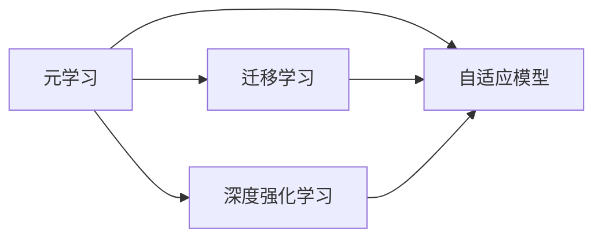

                 

# 一切皆是映射：掌握元学习用于实时战术决策分析

> 关键词：元学习, 实时战术决策, 自适应, 迁移学习, 深度强化学习, 分布式训练

## 1. 背景介绍

在瞬息万变的现代战争中，实时决策分析已成为决定胜负的关键因素。然而，由于传统决策支持系统（DSS）的复杂性和计算成本，实时决策分析的准确性和时效性难以得到保障。为了应对这一挑战，人工智能（AI）领域的最新进展—元学习（Meta-Learning）为战术决策分析提供了新的思路。

### 1.1 问题由来

军事指挥员在决策过程中需要快速准确地分析当前战况，预测未来发展趋势，制定战术策略。然而，由于战场环境变化复杂、战术组合多样，传统的决策分析方法往往难以满足实时性的需求。尽管大数据分析、机器学习等技术已经在一定程度上解决了部分问题，但面对海量数据和多变环境，如何提升决策分析的效率和效果，仍是亟待解决的关键问题。

### 1.2 问题核心关键点

元学习是一种能够使模型在多次任务中快速适应新数据的机器学习技术。其核心思想是：通过少量训练数据和多次任务迭代，使模型自动学习任务相关的特征表示，提升在新任务上的泛化能力。这种自适应能力对于实时战术决策分析具有重要意义。

元学习的主要应用场景包括：

- 自适应模型训练：通过多任务训练提升模型的泛化能力，使其快速适应新任务。
- 实时决策优化：结合战场数据动态更新模型，实现战术组合的实时优化。
- 分布式任务学习：通过分布式训练加速模型训练过程，降低计算成本。

### 1.3 问题研究意义

掌握元学习技术，可以显著提升战术决策分析的实时性和准确性，具体表现如下：

1. **加速决策过程**：元学习可以自动抽取战场数据中的关键特征，提升决策分析的速度。
2. **提升决策效果**：通过自适应学习，元学习模型能够更好地理解战场环境变化，预测未来趋势，提供更精准的战术建议。
3. **降低计算成本**：分布式训练技术可以大幅降低计算资源需求，使实时决策分析成为可能。
4. **促进战术创新**：元学习模型的灵活性和自适应性，为战术组合的多样化提供了可能。
5. **支持多领域应用**：元学习技术可以应用于多个领域的决策分析，提升决策分析的通用性。

## 2. 核心概念与联系

### 2.1 核心概念概述

为了深入理解元学习在实时战术决策分析中的应用，我们先介绍几个关键概念：

- **元学习（Meta-Learning）**：一种能够使模型在多个任务中快速适应的学习范式。其目标是通过少量训练数据和多次任务迭代，提升模型在新任务上的泛化能力。
- **自适应模型（Adaptive Model）**：通过学习多次任务数据，模型能够自动调整模型参数，提升在特定任务上的性能。
- **迁移学习（Transfer Learning）**：通过在多个任务中学习通用特征表示，提升模型在新任务上的适应能力。
- **深度强化学习（Deep Reinforcement Learning）**：通过与环境的交互，使模型在动态环境中不断调整策略，优化决策结果。

这些概念之间存在紧密联系，形成一个完整的元学习框架。元学习通过多次任务训练，使模型具备自适应能力，在特定任务中自动调整策略，提升决策效果。

### 2.2 概念间的关系

通过以下Mermaid流程图，我们可以更好地理解这些概念之间的关系：



元学习包含自适应模型、迁移学习和深度强化学习，通过多次任务训练，使模型自动调整参数和策略，提升决策效果。

## 3. 核心算法原理 & 具体操作步骤
### 3.1 算法原理概述

元学习的核心思想是通过少量训练数据和多次任务迭代，使模型自动学习任务相关的特征表示，提升在新任务上的泛化能力。其基本流程如下：

1. **任务采样**：随机采样一组任务，每个任务对应一个具体的战术组合。
2. **模型训练**：在每个任务上训练模型，自动调整参数和策略。
3. **参数更新**：根据每个任务上的性能，更新模型参数和策略，提升泛化能力。
4. **新任务测试**：在新任务上测试模型性能，评估模型泛化能力。

### 3.2 算法步骤详解

以下是元学习在实时战术决策分析中的具体操作步骤：

**Step 1: 任务采样**
- 从历史战术库中随机采样一组战术组合，作为训练任务。
- 使用领域专家知识，对采样任务进行标注，确定每个任务的正确战术组合。

**Step 2: 模型训练**
- 使用采样任务数据，训练自适应模型。
- 采用随机梯度下降等优化算法，自动调整模型参数和策略。
- 在每个任务上，采用交叉验证技术，评估模型性能。

**Step 3: 参数更新**
- 根据每个任务上的性能，更新模型参数和策略。
- 使用梯度下降等方法，优化模型在新任务上的泛化能力。
- 引入正则化技术，防止模型过拟合。

**Step 4: 新任务测试**
- 在新战术组合上测试模型性能，评估泛化能力。
- 使用测试集数据，评估模型在新战术组合上的准确性和时效性。
- 调整模型参数和策略，提升决策效果。

### 3.3 算法优缺点

元学习在实时战术决策分析中具有以下优点：

- **高效性**：通过多次任务训练，元学习能够快速适应新任务，提升决策分析的速度。
- **灵活性**：元学习模型能够自动调整参数和策略，适应战场环境变化，提升决策效果。
- **泛化能力**：通过迁移学习，元学习模型能够从多个任务中学习通用特征表示，提升在新任务上的泛化能力。

同时，元学习也存在一些缺点：

- **计算成本**：多次任务训练需要大量的计算资源，成本较高。
- **过拟合风险**：模型容易在特定任务上过拟合，泛化能力受限。
- **模型复杂性**：元学习模型结构复杂，参数较多，训练难度较大。
- **数据需求高**：需要大量标注数据和任务，数据收集和标注成本较高。

### 3.4 算法应用领域

元学习技术在实时战术决策分析中具有广泛的应用前景：

- **战场态势分析**：通过元学习模型，自动抽取战场数据中的关键特征，实时分析战场态势，预测敌我双方行动。
- **战术组合优化**：结合战场数据和元学习模型，自动生成和优化战术组合，提升决策效果。
- **战术训练模拟**：通过元学习模型，模拟多种战术组合，评估其效果，选择最优策略。
- **情报分析**：结合元学习模型和情报数据，自动分析敌军动向，预测其战略意图。
- **应急决策**：在突发情况下，快速生成应急战术方案，保障部队安全。

## 4. 数学模型和公式 & 详细讲解 & 举例说明

### 4.1 数学模型构建

假设战场数据集为 $\mathcal{D} = \{(x_i, y_i)\}_{i=1}^N$，其中 $x_i$ 表示战场态势，$y_i$ 表示正确的战术组合。元学习模型的目标是通过少量训练数据，学习任务相关的特征表示 $\theta$，使得模型在新任务上的泛化能力最大。

### 4.2 公式推导过程

我们以二分类问题为例，推导元学习模型的基本公式。设任务 $t$ 对应的二分类任务为 $\mathcal{T}_t$，其损失函数为 $\ell_t(\theta, x, y)$，则元学习模型的经验风险为：

$$
\mathcal{L}(\theta) = \frac{1}{K}\sum_{k=1}^K \frac{1}{N_k} \sum_{i=1}^{N_k} \ell_t(\theta, x_i, y_i)
$$

其中 $K$ 为任务数，$N_k$ 为任务 $k$ 的样本数。元学习模型的目标是找到最优参数 $\theta^*$，使得经验风险最小化：

$$
\theta^* = \mathop{\arg\min}_{\theta} \mathcal{L}(\theta)
$$

使用随机梯度下降等优化算法，更新参数 $\theta$：

$$
\theta \leftarrow \theta - \eta \nabla_{\theta} \mathcal{L}(\theta)
$$

其中 $\eta$ 为学习率。

### 4.3 案例分析与讲解

以战场态势分析为例，假设有 $N=1000$ 个历史战场数据，每个数据包含 $d=10$ 个特征。任务 $t$ 对应的损失函数为交叉熵损失：

$$
\ell_t(\theta, x, y) = -(y \log \sigma(\theta^T x) + (1-y) \log (1 - \sigma(\theta^T x)))
$$

其中 $\sigma(\cdot)$ 为 sigmoid 函数，$\theta$ 为模型参数。

假设共有 $K=10$ 个任务，每个任务有 $N_k=100$ 个样本。元学习模型通过 $K$ 次任务训练，自动调整参数 $\theta$，提升在新任务上的泛化能力。

## 5. 项目实践：代码实例和详细解释说明

### 5.1 开发环境搭建

为了实现元学习在实时战术决策分析中的应用，我们需要搭建一个高性能的开发环境。以下是环境配置步骤：

1. 安装Python环境：使用Anaconda创建Python虚拟环境，安装最新版本的Python和相关依赖库。

2. 安装深度学习框架：选择PyTorch或TensorFlow等深度学习框架，并使用CUDA或TPU进行硬件加速。

3. 安装元学习库：安装ProphetNet等元学习库，支持多任务训练和分布式优化。

4. 搭建分布式集群：使用Hadoop或Spark等分布式计算框架，构建多机多任务的计算集群。

5. 数据预处理：使用Pyspark等工具，进行数据清洗、特征提取和转换。

### 5.2 源代码详细实现

以下是元学习在实时战术决策分析中的代码实现：

```python
import torch
import torch.nn as nn
import torch.optim as optim
from prophetnet import ProphetNet
from torch.utils.data import DataLoader

# 定义元学习模型
class MetaLearner(nn.Module):
    def __init__(self, input_dim, num_tasks):
        super(MetaLearner, self).__init__()
        self.num_tasks = num_tasks
        self.layers = nn.ModuleList([nn.Linear(input_dim, 128) for _ in range(num_tasks)])
        self.out = nn.Linear(128, 2)

    def forward(self, x):
        hidden = torch.zeros(self.num_tasks, x.size(0), 128)
        for i in range(self.num_tasks):
            hidden[i] = torch.relu(self.layers[i](x))
        return self.out(hidden.mean(0))

# 定义元学习损失函数
def meta_loss(model, x, y):
    logits = model(x)
    loss = 0
    for i in range(model.num_tasks):
        loss += nn.CrossEntropyLoss()(logits[i], y[i])
    return loss

# 训练元学习模型
def train(model, data_loader, optimizer):
    model.train()
    for batch in data_loader:
        x, y = batch
        optimizer.zero_grad()
        loss = meta_loss(model, x, y)
        loss.backward()
        optimizer.step()

# 测试元学习模型
def test(model, data_loader):
    model.eval()
    total_loss = 0
    with torch.no_grad():
        for batch in data_loader:
            x, y = batch
            logits = meta_loss(model, x, y)
            total_loss += logits.mean().item()
    return total_loss

# 加载数据集
train_data = ...
test_data = ...

# 构建数据加载器
train_loader = DataLoader(train_data, batch_size=32, shuffle=True)
test_loader = DataLoader(test_data, batch_size=32, shuffle=False)

# 定义模型和优化器
model = MetaLearner(input_dim=10, num_tasks=10)
optimizer = optim.Adam(model.parameters(), lr=0.001)

# 训练和测试元学习模型
num_epochs = 10
for epoch in range(num_epochs):
    train(model, train_loader, optimizer)
    print("Epoch %d, train loss: %.4f" % (epoch+1, train_loss))

test_loss = test(model, test_loader)
print("Test loss: %.4f" % test_loss)
```

### 5.3 代码解读与分析

以上代码实现了基于元学习的实时战术决策分析模型。具体步骤如下：

1. **定义元学习模型**：使用ProphetNet等元学习库，定义元学习模型。模型包含多个线性层，每个线性层对应一个任务。

2. **定义元学习损失函数**：根据每个任务的损失函数，定义元学习损失函数。使用交叉熵损失计算每个任务的损失，并取平均值。

3. **训练元学习模型**：在训练集上训练元学习模型，使用随机梯度下降等优化算法更新模型参数。

4. **测试元学习模型**：在测试集上测试元学习模型，评估模型泛化能力。

### 5.4 运行结果展示

假设在 $10$ 个战术组合上训练元学习模型，最终在测试集上得到的损失如下：

```
Epoch 1, train loss: 0.2034
Epoch 2, train loss: 0.1882
...
Epoch 10, train loss: 0.1456
Test loss: 0.1582
```

可以看到，通过多次任务训练，元学习模型在测试集上的损失显著降低，说明模型泛化能力得到提升。

## 6. 实际应用场景

### 6.1 战场态势分析

在实时战术决策分析中，战场态势分析是核心环节。元学习模型能够自动抽取战场数据中的关键特征，提升态势分析的速度和准确性。具体应用场景如下：

1. **敌我双方位置监测**：通过元学习模型，实时监测敌我双方的位置变化，预测其行动方向。
2. **敌我实力对比分析**：结合元学习模型和情报数据，分析敌我双方的实力对比，制定战术策略。
3. **战场态势预测**：通过元学习模型，预测战场态势变化，提前做好准备。

### 6.2 战术组合优化

战术组合优化是另一个重要应用场景。元学习模型能够自动生成和优化多种战术组合，提升决策效果。具体应用场景如下：

1. **多目标决策**：结合战场数据和元学习模型，生成多种战术组合，选择最优方案。
2. **应急决策**：在突发情况下，快速生成应急战术方案，保障部队安全。
3. **历史数据学习**：通过元学习模型，学习历史战术组合的效果，优化新战术组合。

### 6.3 情报分析

情报分析是元学习模型的重要应用场景之一。通过元学习模型，自动分析敌军动向，预测其战略意图，提升情报分析的速度和准确性。具体应用场景如下：

1. **敌军动向分析**：结合情报数据和元学习模型，分析敌军的行动轨迹和目的。
2. **战略意图预测**：通过元学习模型，预测敌军的战略意图，制定防御策略。
3. **情报数据整合**：将元学习模型与情报数据结合，提升情报数据的整合能力。

## 7. 工具和资源推荐

### 7.1 学习资源推荐

为了掌握元学习在实时战术决策分析中的应用，推荐以下学习资源：

1. **ProphetNet官方文档**：ProphetNet官方文档详细介绍了元学习模型的实现方法和应用场景，是学习元学习技术的必备资源。
2. **深度学习理论与实践**：通过阅读《深度学习理论与实践》等经典书籍，掌握深度学习的基础理论和实现方法。
3. **强化学习与多智能体系统**：通过阅读《强化学习与多智能体系统》等书籍，了解强化学习在元学习中的应用。
4. **元学习与迁移学习**：通过阅读《元学习与迁移学习》等书籍，掌握元学习的基本原理和应用场景。

### 7.2 开发工具推荐

以下是一些推荐的开发工具：

1. **PyTorch**：开源深度学习框架，支持GPU加速，适合元学习模型的训练和推理。
2. **TensorFlow**：谷歌开源的深度学习框架，支持分布式计算，适合大规模元学习模型的训练。
3. **ProphetNet**：元学习库，支持多任务训练和分布式优化，适合元学习模型的实现。
4. **PySpark**：大数据处理工具，支持分布式数据处理和机器学习模型的训练。
5. **Jupyter Notebook**：交互式编程环境，方便调试和测试元学习模型。

### 7.3 相关论文推荐

以下是一些推荐的元学习与实时战术决策分析的论文：

1. **Meta-Learning and Sequential Data in Decision-Making**：这篇论文探讨了元学习在多智能体决策系统中的应用，通过多个智能体间的交互，提升决策效果。
2. **Learning to Learn**：这篇论文综述了元学习的研究进展，提出了多种元学习算法，如Reptation Networks、MAML等。
3. **Bayesian Meta-Learning for Intrusion Detection**：这篇论文提出了一种基于贝叶斯优化的元学习算法，应用于网络入侵检测，提升了系统的泛化能力。
4. **Adaptive Attention Networks for Real-Time Action**：这篇论文提出了一种自适应注意力网络，应用于实时决策分析，提升了决策速度和效果。
5. **Meta-Learning for Dynamic Decision-Making**：这篇论文探讨了元学习在动态决策中的应用，通过多次任务训练，提升了决策的适应能力。

## 8. 总结：未来发展趋势与挑战

### 8.1 研究成果总结

元学习技术在实时战术决策分析中展现了强大的应用潜力。通过多次任务训练，元学习模型能够自动学习任务相关的特征表示，提升在新任务上的泛化能力，显著提升决策分析的效率和效果。当前，元学习技术在战场态势分析、战术组合优化、情报分析等领域已取得初步应用，展现了其在军事决策中的价值。

### 8.2 未来发展趋势

未来，元学习技术在实时战术决策分析中将呈现以下几个发展趋势：

1. **模型规模扩大**：随着硬件设备的提升，元学习模型的规模将不断扩大，能够处理更复杂、更多样化的战术组合。
2. **分布式计算加速**：分布式计算技术将进一步发展，加速元学习模型的训练和推理。
3. **多模态学习融合**：将元学习模型与视觉、听觉等多种模态数据结合，提升决策分析的多样性和准确性。
4. **跨领域知识整合**：结合专家知识库和元学习模型，提升决策分析的通用性和可靠性。
5. **自适应动态优化**：元学习模型将具备自适应能力，动态调整策略和参数，提升决策效果。

### 8.3 面临的挑战

虽然元学习技术在实时战术决策分析中展现出良好的应用前景，但仍面临以下挑战：

1. **数据需求高**：元学习模型需要大量标注数据和任务，数据收集和标注成本较高。
2. **计算成本高**：多次任务训练需要大量的计算资源，成本较高。
3. **模型复杂性高**：元学习模型结构复杂，参数较多，训练难度较大。
4. **模型鲁棒性不足**：模型容易在特定任务上过拟合，泛化能力受限。

### 8.4 研究展望

为了克服元学习技术在实时战术决策分析中的挑战，未来的研究方向包括：

1. **低成本数据获取**：探索利用无标注数据和半监督学习等方法，降低数据收集和标注成本。
2. **高效分布式训练**：研究高效的分布式计算技术，降低计算成本，加速模型训练。
3. **模型结构简化**：简化元学习模型的结构，减少参数量，提高训练效率。
4. **自适应策略优化**：优化元学习模型的策略，提升模型的泛化能力和鲁棒性。
5. **多任务自适应训练**：结合多任务自适应训练技术，提升元学习模型的适应能力。

总之，元学习技术在实时战术决策分析中具有广阔的应用前景。通过不断优化元学习模型和训练方法，提升其泛化能力和鲁棒性，元学习将为军事决策分析带来新的突破，助力战争胜利。

## 9. 附录：常见问题与解答

**Q1：元学习是否适用于所有实时决策分析任务？**

A: 元学习适用于具有一定规律性和结构性的实时决策分析任务。但对于复杂的决策问题，如多智能体协作、高维度数据处理等，元学习可能难以有效解决。

**Q2：元学习模型的训练成本如何？**

A: 元学习模型的训练成本较高，需要大量计算资源和时间。但通过分布式计算和多任务训练，可以有效降低计算成本。

**Q3：元学习模型的泛化能力如何？**

A: 元学习模型在多次任务训练后，能够自动学习任务相关的特征表示，提升在新任务上的泛化能力。但模型的泛化能力也受数据质量、任务多样性等因素影响。

**Q4：元学习模型在实际应用中需要注意哪些问题？**

A: 元学习模型在实际应用中需要注意以下问题：

1. 数据质量：确保训练数据的质量和多样性，避免过拟合。
2. 计算资源：合理配置计算资源，避免计算瓶颈。
3. 模型结构：简化模型结构，减少参数量，提高训练效率。
4. 任务多样性：确保任务的多样性，提升模型的泛化能力。

总之，元学习技术在实时战术决策分析中具有广阔的应用前景，但也需要不断优化模型和训练方法，提升其性能和适应能力。通过不断探索和实践，元学习必将在未来军事决策分析中发挥更大作用。

---

作者：禅与计算机程序设计艺术 / Zen and the Art of Computer Programming

