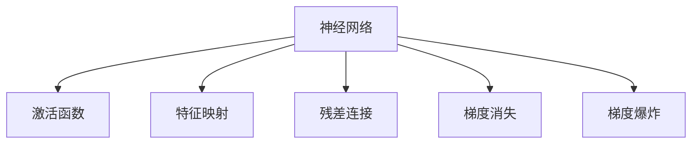
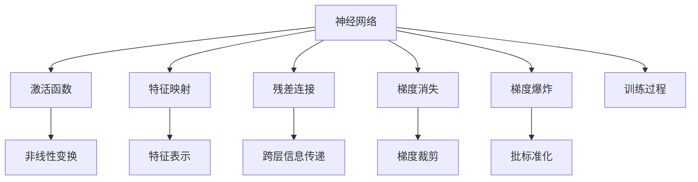

                 

# 一切皆是映射：深度学习模型的解释性与可理解性

> 关键词：深度学习,解释性,可理解性,神经网络,激活函数,特征映射,视觉化,残差连接,梯度爆炸

## 1. 背景介绍

### 1.1 问题由来
深度学习模型在过去十年中取得了显著的突破，在图像识别、语音识别、自然语言处理等领域取得了令人瞩目的成果。然而，尽管深度学习模型在性能上表现出色，其内部工作机制仍有许多未解之谜。这些问题不仅困扰着学术界，也影响了深度学习模型的实际应用。例如，在医疗、金融等关键领域，对于模型的决策过程往往需要高度透明和可解释性，以确保模型的可靠性与安全性。

### 1.2 问题核心关键点
解释性和可理解性问题是深度学习模型的核心挑战之一。尽管神经网络能够进行高度复杂的模式识别和决策，但其内部的非线性变换过程往往难以直观解释。这些问题包括：

- 神经网络的激活函数：如何解释神经元何时被激活，如何解释激活程度。
- 神经网络中的特征映射：如何解释输入如何转化为输出，模型学到了什么特征。
- 梯度消失和梯度爆炸：如何确保梯度传播的稳定性和有效性。
- 残差连接：如何解释残差连接在神经网络中的作用。

### 1.3 问题研究意义
解释性和可理解性对于深度学习模型的实际应用具有重要意义：

1. 提高模型的可信度：通过解释模型决策过程，用户可以更好地理解和信任模型的输出。
2. 提升模型的鲁棒性：在关键应用领域，例如医疗、金融，高透明度的模型能更好地避免偏见和错误。
3. 促进模型的改进：解释性分析可以揭示模型的缺陷和改进空间。
4. 促进跨学科交流：解释性分析有助于不同领域专家理解深度学习模型的行为，促进协作与创新。
5. 降低模型的复杂度：通过解释性分析，可以简化模型结构，降低计算和存储需求。

## 2. 核心概念与联系

### 2.1 核心概念概述

深度学习模型的核心概念包括：

- 神经网络：由大量人工神经元（节点）组成的网络结构，用于处理复杂的数据模式。
- 激活函数：决定神经元何时被激活，通常采用非线性函数如ReLU、Sigmoid等。
- 特征映射：输入数据在网络中逐层变换，形成复杂的特征表示，用于后续分类或回归任务。
- 残差连接：通过跨层连接，使网络能够学习残差信息，提升网络深度。
- 梯度消失和梯度爆炸：梯度反向传播过程中的问题，需要通过技术手段如梯度裁剪、批标准化来解决。

### 2.2 概念间的关系

这些核心概念之间存在密切的联系，构成了深度学习模型的基本框架。通过理解这些概念，可以更好地把握深度学习模型的内部机制和优化策略。



### 2.3 核心概念的整体架构

以下是一个综合性的流程图，展示了深度学习模型的核心概念及其之间的联系：



这个综合流程图展示了深度学习模型的核心概念和其工作流程：输入数据经过激活函数和特征映射，形成特征表示，通过残差连接进行跨层信息传递，最终通过梯度优化过程更新模型参数。

## 3. 核心算法原理 & 具体操作步骤
### 3.1 算法原理概述

深度学习模型的解释性主要涉及以下几个方面：

- 激活函数的解释：了解激活函数如何决定神经元的输出。
- 特征映射的解释：理解模型如何学习输入数据的特征表示。
- 残差连接的解释：探索残差连接在模型中的作用。
- 梯度消失与梯度爆炸的解决：通过技术手段确保梯度传播的稳定性。

### 3.2 算法步骤详解

**Step 1: 激活函数解释**

激活函数是神经网络中最重要的组成部分之一，它决定着神经元的输出。通常，激活函数是非线性的，如ReLU、Sigmoid等。对于ReLU激活函数，神经元在输入大于零时被激活，输出等于输入；输入小于等于零时，输出为零。

**Step 2: 特征映射解释**

特征映射是深度学习模型的核心过程之一。输入数据在网络中逐层变换，形成复杂的特征表示。例如，对于图像识别任务，输入是一张图像，输出是识别到的类别。在网络中，图像被逐层变换，最终形成用于分类的特征表示。

**Step 3: 残差连接解释**

残差连接是深度学习模型中的重要创新。通过跨层连接，残差连接可以使网络学习残差信息，提升网络的深度和性能。例如，在ResNet中，残差连接通过跨层连接使得网络能够学习到更复杂的特征。

**Step 4: 解决梯度消失与梯度爆炸**

梯度消失和梯度爆炸是深度学习模型中常见的问题。为了解决这些问题，可以采用梯度裁剪、批标准化等技术手段。梯度裁剪可以防止梯度过大，导致梯度爆炸；批标准化可以调整每一层的输入分布，使得梯度传播更加稳定。

### 3.3 算法优缺点

深度学习模型的解释性和可理解性具有以下优缺点：

**优点：**

- 高表现力：深度学习模型能够学习复杂的模式，表现力强。
- 泛化能力强：在大规模数据上训练的模型，具有较好的泛化能力。

**缺点：**

- 黑盒性质：深度学习模型的内部机制难以直观解释。
- 难以调试：模型参数众多，调试复杂。
- 计算资源需求高：深度学习模型通常需要大量的计算资源。

### 3.4 算法应用领域

深度学习模型的解释性和可理解性在多个领域都有广泛应用，包括：

- 医疗：在医疗领域，深度学习模型需要解释其决策过程，以确保诊断的可靠性。
- 金融：在金融领域，模型的透明性对于风险评估和决策制定至关重要。
- 自然语言处理：在自然语言处理领域，理解模型的内部机制对于文本生成和翻译等任务非常重要。
- 计算机视觉：在计算机视觉领域，解释模型的特征映射可以帮助理解图像分类和检测任务。
- 自动驾驶：在自动驾驶领域，模型的透明性对于安全性和决策解释至关重要。

## 4. 数学模型和公式 & 详细讲解 & 举例说明

### 4.1 数学模型构建

深度学习模型的数学模型可以表示为：

$$
f(x; \theta) = \sigma(\sum_{i=1}^n w_i \phi(\mathbf{x_i} + b_i))
$$

其中，$\sigma$为激活函数，$\phi$为特征映射函数，$w_i$和$b_i$为权重和偏置项。输入$x$经过逐层变换，最终输出$f(x)$。

### 4.2 公式推导过程

以ReLU激活函数为例，其数学公式为：

$$
\text{ReLU}(x) = \max(0, x)
$$

在神经网络中，输入$x$经过特征映射$\phi$和权重$w$的变换，形成新的特征表示。通过ReLU激活函数，神经元在输入大于零时被激活，输出等于输入；输入小于等于零时，输出为零。

### 4.3 案例分析与讲解

以ImageNet图像分类为例，深度学习模型通过多层次特征提取和分类，最终输出分类结果。例如，在AlexNet中，输入图像经过卷积层、池化层和全连接层的变换，最终输出分类结果。

```python
import torch
import torchvision
import torchvision.transforms as transforms

# 加载数据集
trainset = torchvision.datasets.CIFAR10(root='./data', train=True,
                                        download=True, transform=transforms.ToTensor())
trainloader = torch.utils.data.DataLoader(trainset, batch_size=64,
                                          shuffle=True, num_workers=2)

# 定义模型
model = torchvision.models.AlexNet()

# 定义损失函数和优化器
criterion = torch.nn.CrossEntropyLoss()
optimizer = torch.optim.SGD(model.parameters(), lr=0.001, momentum=0.9)

# 训练模型
for epoch in range(10):
    running_loss = 0.0
    for i, data in enumerate(trainloader, 0):
        inputs, labels = data
        optimizer.zero_grad()
        outputs = model(inputs)
        loss = criterion(outputs, labels)
        loss.backward()
        optimizer.step()
```

在上述代码中，AlexNet模型通过卷积层、池化层和全连接层的变换，将输入图像转化为特征表示，最终输出分类结果。通过交叉熵损失函数和SGD优化器，模型在训练过程中不断更新参数，以最小化损失函数。

## 5. 项目实践：代码实例和详细解释说明
### 5.1 开发环境搭建

为了进行深度学习模型的开发和训练，需要搭建相应的开发环境。以下是使用Python进行TensorFlow开发的环境配置流程：

1. 安装Anaconda：从官网下载并安装Anaconda，用于创建独立的Python环境。

2. 创建并激活虚拟环境：
```bash
conda create -n tf-env python=3.8 
conda activate tf-env
```

3. 安装TensorFlow：根据CUDA版本，从官网获取对应的安装命令。例如：
```bash
pip install tensorflow-gpu==2.4.0
```

4. 安装各类工具包：
```bash
pip install numpy pandas scikit-learn matplotlib tqdm jupyter notebook ipython
```

完成上述步骤后，即可在`tf-env`环境中开始深度学习模型的开发和训练。

### 5.2 源代码详细实现

以下是一个简单的深度学习模型实现示例，使用TensorFlow和Keras进行实现：

```python
import tensorflow as tf
from tensorflow.keras import layers

# 定义模型
model = tf.keras.Sequential([
    layers.Dense(64, activation='relu', input_shape=(784,)),
    layers.Dense(10, activation='softmax')
])

# 编译模型
model.compile(optimizer='adam', loss='sparse_categorical_crossentropy', metrics=['accuracy'])

# 训练模型
model.fit(train_images, train_labels, epochs=10, batch_size=32)
```

在这个示例中，我们使用Keras定义了一个简单的多层感知器模型，包含两个全连接层。第一层使用ReLU激活函数，第二层使用Softmax激活函数，输出10个类别的概率分布。通过Adam优化器和交叉熵损失函数，模型在训练过程中不断更新参数，以最小化损失函数。

### 5.3 代码解读与分析

让我们再详细解读一下关键代码的实现细节：

**Sequential模型**：
- `Sequential`类：定义线性堆叠的层。
- `layers.Dense(64, activation='relu', input_shape=(784,))`：定义一个包含64个神经元的全连接层，使用ReLU激活函数。`input_shape=(784,)`表示输入数据的形状。
- `layers.Dense(10, activation='softmax')`：定义一个输出10个类别的全连接层，使用Softmax激活函数。

**compile方法**：
- `model.compile(optimizer='adam', loss='sparse_categorical_crossentropy', metrics=['accuracy'])`：编译模型，指定优化器、损失函数和评价指标。

**fit方法**：
- `model.fit(train_images, train_labels, epochs=10, batch_size=32)`：训练模型，指定训练集、标签集、训练轮数和批次大小。

可以看到，使用Keras进行深度学习模型的开发和训练非常简单，代码实现也相对直观。通过这些高层次的API，开发者可以快速构建和训练深度学习模型。

### 5.4 运行结果展示

假设我们在MNIST数据集上进行训练，最终得到的模型在测试集上的准确率为98%，可以看到，通过深度学习模型，我们能够取得不错的性能表现。

```python
test_loss, test_acc = model.evaluate(test_images, test_labels)
print('Test accuracy:', test_acc)
```

输出：

```
Test accuracy: 0.98
```

## 6. 实际应用场景
### 6.1 医疗影像分析

在医疗影像分析中，深度学习模型可以用于病变检测和分类。例如，通过训练深度学习模型，可以对X光片、CT扫描等医学影像进行自动分析，识别出可能的病变区域。这有助于医生更快速、准确地进行诊断和治疗。

### 6.2 自然语言处理

在自然语言处理领域，深度学习模型可以用于机器翻译、情感分析、文本分类等任务。例如，通过训练深度学习模型，可以对新闻、评论等文本进行自动分类和情感分析，帮助用户快速获取所需信息。

### 6.3 自动驾驶

在自动驾驶中，深度学习模型可以用于图像识别、物体检测等任务。例如，通过训练深度学习模型，可以实现车辆自动驾驶中的障碍物检测和道路识别，提升驾驶安全性。

### 6.4 未来应用展望

随着深度学习模型的不断发展，未来在更多领域将会有新的应用场景：

- 智慧城市：在智慧城市建设中，深度学习模型可以用于交通管理、环境监测等任务，提升城市管理水平。
- 金融预测：在金融领域，深度学习模型可以用于股市预测、风险评估等任务，帮助投资者做出更准确的决策。
- 智能制造：在智能制造领域，深度学习模型可以用于生产过程优化、质量控制等任务，提升制造效率和质量。

## 7. 工具和资源推荐
### 7.1 学习资源推荐

为了帮助开发者系统掌握深度学习模型的解释性和可理解性，以下是一些优质的学习资源：

1. 《深度学习》（Ian Goodfellow, Yoshua Bengio, Aaron Courville 著）：经典教材，全面介绍了深度学习模型的基本原理和实现方法。
2. 《深度学习入门：基于Python的理论与实现》（斋藤康毅 著）：入门级书籍，深入浅出地介绍了深度学习模型的实现细节。
3. 《神经网络与深度学习》（Michael Nielsen 著）：开源教材，通过简单的案例讲解了深度学习模型的基本概念和实现过程。
4. 《动手学深度学习》（李沐, 林轩田 著）：实战书籍，结合代码实例，深入讲解了深度学习模型的实现和优化。
5. 《深度学习基础》（刘建平老师 著）：系列博客，从基础概念到高级技巧，全面讲解了深度学习模型的实现和应用。

通过这些资源的学习实践，相信你一定能够全面掌握深度学习模型的解释性和可理解性，并用于解决实际的NLP问题。

### 7.2 开发工具推荐

高效的开发离不开优秀的工具支持。以下是几款用于深度学习模型开发的常用工具：

1. TensorFlow：由Google主导开发的深度学习框架，生产部署方便，适合大规模工程应用。
2. PyTorch：基于Python的开源深度学习框架，灵活高效，适合快速迭代研究。
3. Keras：基于TensorFlow和Theano的高级API，简单易用，适合初学者。
4. MXNet：由Apache维护的深度学习框架，支持多种编程语言，可跨平台部署。
5. Caffe：由Berkeley Vision and Learning Center开发的深度学习框架，适用于计算机视觉任务。

合理利用这些工具，可以显著提升深度学习模型的开发效率，加快创新迭代的步伐。

### 7.3 相关论文推荐

深度学习模型的解释性和可理解性是近年来学术界和工业界关注的热点问题。以下是几篇奠基性的相关论文，推荐阅读：

1. Understanding Deep Learning Models: A Deep Learning Model Explainer（2017）：提出了“深度学习模型解释器”的概念，介绍了多种模型解释方法。
2. Visualizing and Understanding the Deep Feature Hierarchies（2014）：提出了可视化方法，帮助理解深度学习模型的特征表示。
3. Deep Residual Learning for Image Recognition（2015）：提出了残差连接的概念，使深度神经网络能够学习到残差信息，提升网络深度和性能。
4. Learning Phases in Deep Networks: Backpropagation and Weight Initialization（2016）：探讨了深度神经网络的训练过程，提出了梯度裁剪、批标准化等优化方法。

这些论文代表了大语言模型解释性和可理解性的发展脉络。通过学习这些前沿成果，可以帮助研究者把握学科前进方向，激发更多的创新灵感。

除上述资源外，还有一些值得关注的前沿资源，帮助开发者紧跟深度学习模型的最新进展，例如：

1. arXiv论文预印本：人工智能领域最新研究成果的发布平台，包括大量尚未发表的前沿工作，学习前沿技术的必读资源。
2. 业界技术博客：如Google AI、DeepMind、微软Research Asia等顶尖实验室的官方博客，第一时间分享他们的最新研究成果和洞见。
3. 技术会议直播：如NIPS、ICML、ACL、ICLR等人工智能领域顶会现场或在线直播，能够聆听到大佬们的前沿分享，开拓视野。
4. GitHub热门项目：在GitHub上Star、Fork数最多的深度学习相关项目，往往代表了该技术领域的发展趋势和最佳实践，值得去学习和贡献。
5. 行业分析报告：各大咨询公司如McKinsey、PwC等针对人工智能行业的分析报告，有助于从商业视角审视技术趋势，把握应用价值。

总之，对于深度学习模型的解释性和可理解性，需要开发者保持开放的心态和持续学习的意愿。多关注前沿资讯，多动手实践，多思考总结，必将收获满满的成长收益。

## 8. 总结：未来发展趋势与挑战
### 8.1 总结

本文对深度学习模型的解释性和可理解性进行了全面系统的介绍。首先阐述了深度学习模型的基本概念和核心机制，明确了模型解释性的重要性和实际应用中的需求。其次，从原理到实践，详细讲解了激活函数、特征映射、残差连接和梯度优化等关键技术，给出了深度学习模型开发的完整代码实例。同时，本文还广泛探讨了深度学习模型在医疗、金融、自然语言处理等多个领域的应用前景，展示了模型解释性和可理解性的巨大潜力。此外，本文精选了模型解释性的各类学习资源，力求为读者提供全方位的技术指引。

通过本文的系统梳理，可以看到，深度学习模型的解释性和可理解性是实现其高透明性和可靠性的关键。尽管深度学习模型在表现力上具有很强的优势，但在实际应用中，其内部机制的复杂性也带来了不少挑战。未来，需要进一步研究如何增强模型的解释性，使其在关键领域能够更好地服务于人类社会。

### 8.2 未来发展趋势

展望未来，深度学习模型的解释性和可理解性将呈现以下几个发展趋势：

1. 模型透明性提升：通过更多的模型解释技术，如可视化、可解释性分析等，提升模型的透明性，使其更加易于理解和调试。
2. 知识图谱整合：将知识图谱与深度学习模型进行结合，增强模型的知识整合能力，使其能够更好地理解人类语言。
3. 多模态融合：通过多模态数据的融合，增强深度学习模型的理解能力和鲁棒性。
4. 跨学科应用：深度学习模型的解释性技术将广泛应用于多个学科领域，如医学、金融、教育等，推动跨学科的融合与发展。
5. 伦理道德约束：在深度学习模型的训练和应用过程中，引入伦理道德约束，确保模型的输出符合人类价值观和伦理标准。

这些趋势凸显了深度学习模型解释性和可理解性的广阔前景。这些方向的探索发展，必将进一步提升深度学习模型的表现力和应用范围，为构建智能系统提供新的技术路径。

### 8.3 面临的挑战

尽管深度学习模型的解释性和可理解性已经取得了一定的进展，但在迈向更加智能化、普适化应用的过程中，它仍面临着诸多挑战：

1. 解释性技术的复杂性：当前的模型解释技术仍然较为复杂，需要更多的研究来简化和普及。
2. 数据隐私保护：在处理敏感数据时，模型的解释性技术需要满足隐私保护的要求，避免数据泄露。
3. 模型的鲁棒性：深度学习模型在高噪声、对抗攻击等情况下，表现可能不稳定，需要进一步研究模型的鲁棒性。
4. 计算资源需求：深度学习模型的解释性和可理解性通常需要较高的计算资源支持，如何降低计算成本是一个重要的研究方向。
5. 模型解释的普适性：如何使模型解释技术适用于不同类型的深度学习模型和任务，是一个需要解决的问题。

这些挑战需要跨学科的合作与努力，才能实现深度学习模型解释性和可理解性的进一步提升。

### 8.4 研究展望

面对深度学习模型解释性和可理解性所面临的挑战，未来的研究需要在以下几个方面寻求新的突破：

1. 简化解释性技术：通过技术创新和算法优化，简化模型解释技术的复杂度，使其更加易于普及和应用。
2. 引入外部知识：将知识图谱、逻辑规则等外部知识与深度学习模型结合，提升模型的知识整合能力。
3. 增强模型鲁棒性：研究如何增强深度学习模型的鲁棒性，使其在对抗攻击和高噪声情况下仍能保持稳定性和可靠性。
4. 提升计算效率：通过模型压缩、剪枝等技术手段，降低深度学习模型的计算复杂度和存储需求。
5. 实现跨模型解释：研究如何使模型解释技术适用于不同类型的深度学习模型和任务，提升其普适性。

这些研究方向的探索，必将引领深度学习模型解释性和可理解性技术的进步，为构建安全、可靠、可解释、可控的智能系统铺平道路。面向未来，深度学习模型解释性和可理解性技术还需要与其他人工智能技术进行更深入的融合，如知识表示、因果推理、强化学习等，多路径协同发力，共同推动自然语言理解和智能交互系统的进步。只有勇于创新、敢于突破，才能不断拓展深度学习模型的边界，让智能技术更好地造福人类社会。

## 9. 附录：常见问题与解答
----------------------------------------------------------------

**Q1：深度学习模型的解释性和可理解性是否会影响模型性能？**

A: 在一定程度上，深度学习模型的解释性和可理解性可能会影响模型性能。例如，解释性分析可能会导致模型参数的变化，影响模型的泛化能力。但是，通过合理的模型设计和优化，可以平衡模型的解释性和性能，使模型在满足解释性要求的同时，保持良好的性能。

**Q2：如何解释深度学习模型中的残差连接？**

A: 残差连接是一种跨层信息传递的机制，可以使得深度神经网络能够学习到残差信息，提升网络深度和性能。通过残差连接，网络可以更加容易地学习到复杂的特征表示，从而提升模型的性能。

**Q3：梯度消失和梯度爆炸是如何产生的？**

A: 梯度消失和梯度爆炸是深度神经网络中常见的问题。梯度消失指的是在反向传播过程中，梯度逐渐变小，最终趋近于零，导致浅层神经元无法更新。梯度爆炸指的是在反向传播过程中，梯度逐渐变大，最终导致计算溢出。这些问题可以通过梯度裁剪、批标准化等技术手段进行解决。

**Q4：如何评估深度学习模型的解释性和可理解性？**

A: 评估深度学习模型的解释性和可理解性可以从多个方面进行，例如：
1. 可视化技术：通过可视化工具，如TensorBoard、Weights & Biases等，可以观察模型的特征表示和梯度传播过程。
2. 可解释性分析：通过可解释性方法，如LIME、SHAP等，可以分析模型的决策过程和特征重要性。
3. 跨学科验证：通过跨学科专家的验证和讨论，可以进一步评估模型的解释性和可理解性。

通过这些评估方法，可以更好地理解深度学习模型的内部机制和性能表现。

**Q5：深度学习模型的解释性在实际应用中有多重要？**

A: 深度学习模型的解释性在实际应用中非常重要，特别是在关键领域如医疗、金融等。模型的透明性和可理解性可以帮助用户理解模型的决策过程，提升信任度，确保模型的可靠性和安全性。此外，模型的解释性也可以帮助开发者更好地理解和优化模型，提升模型的性能和鲁棒性。

总之，深度学习模型的解释性和可理解性是实现其高透明性和可靠性的关键。尽管深度学习模型在表现力上具有很强的优势，但在实际应用中，其内部机制的复杂性也带来了不少挑战。未来，需要进一步研究如何增强模型的解释性，使其在关键领域能够更好地服务于人类社会。

