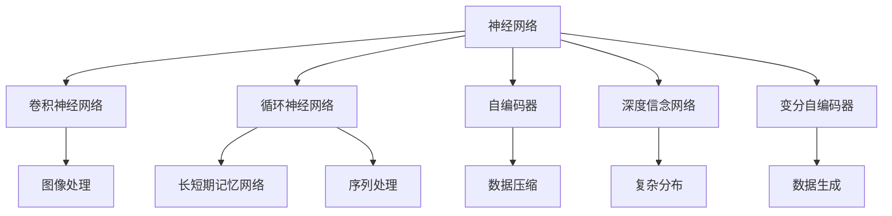
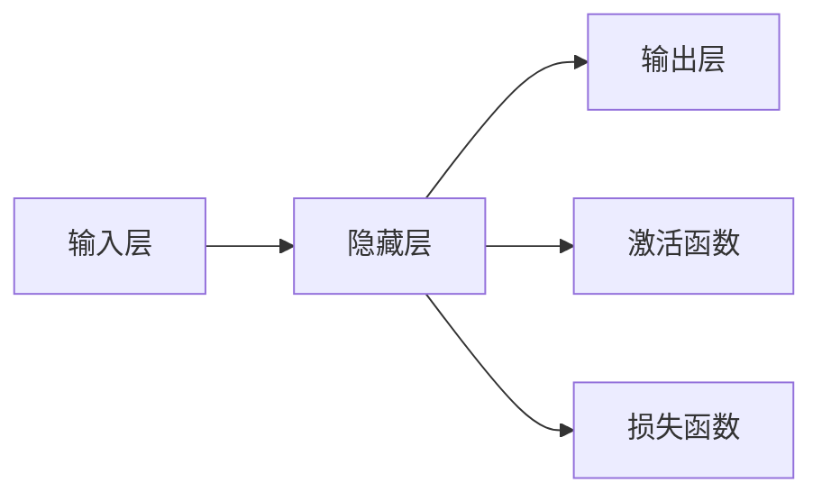
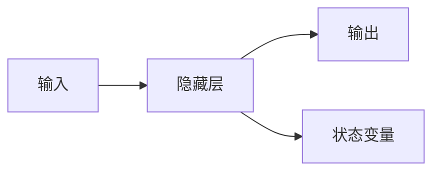

                 

# 一切皆是映射：神经网络在生物信息学中的应用前景

## 1. 背景介绍

### 1.1 问题由来

生物信息学是连接生物学和计算科学的新兴交叉学科。它涉及对生命科学数据的计算处理，包括DNA、RNA、蛋白质等生物大分子数据的分析，以及基因表达、生物进化、系统发育、药物设计等方面的研究。随着高通量测序技术和分子生物学实验的迅猛发展，生物信息学数据呈现出爆炸式增长，如何高效、准确地处理和分析这些海量数据，成为了生物信息学领域急需解决的重大问题。

神经网络作为一种强大的数据处理工具，近年来在图像识别、自然语言处理等领域取得了显著成功。它通过多层非线性映射，能够学习和挖掘数据中的复杂结构和模式。因此，将神经网络应用于生物信息学领域，尤其是处理高维、非结构化数据，具有广阔的应用前景和潜力。

### 1.2 问题核心关键点

神经网络在生物信息学领域的应用，主要集中在以下几个方面：

1. **基因组学数据处理**：利用神经网络对基因组序列进行分类、标注和预测，帮助研究者深入理解基因的调控机制和表达模式。
2. **蛋白质结构预测**：通过神经网络学习蛋白质结构与功能之间的关系，预测蛋白质的三维结构及其与小分子、其他蛋白质的相互作用。
3. **药物发现**：结合分子生物学数据和神经网络模型，进行药物分子设计和筛选，加速新药的研发过程。
4. **转录组和表观基因组学分析**：利用神经网络对高通量转录组和表观基因组数据进行特征提取和分类，发现基因表达和调控机制的新规律。
5. **系统发育和进化分析**：使用神经网络对系统发育树进行重构和分析，研究生物进化过程中的基因流动和变异事件。

## 2. 核心概念与联系

### 2.1 核心概念概述

为了更好地理解神经网络在生物信息学中的应用，本节将介绍几个密切相关的核心概念：

1. **神经网络**：一种由多层节点（神经元）组成的人工神经网络，通过前向传播和反向传播进行参数更新，实现数据的映射和分类。
2. **卷积神经网络（CNN）**：一种特殊的神经网络结构，通过卷积层和池化层处理图像数据，在图像识别、自然语言处理等领域表现优异。
3. **循环神经网络（RNN）**：用于处理序列数据，通过循环结构保存状态信息，适用于文本、语音等时序数据的建模。
4. **长短期记忆网络（LSTM）**：一种改进的RNN结构，通过门控机制有效处理长序列数据，避免了传统RNN的梯度消失问题。
5. **自编码器（Autoencoder）**：一种无监督学习模型，用于数据压缩和降维，通过重构误差进行训练，提取数据的低维表示。
6. **深度信念网络（DBN）**：一种包含多个隐层的神经网络，适合于学习复杂的数据分布和关系。
7. **变分自编码器（VAE）**：一种生成模型，通过重构误差和潜在变量分布损失训练，生成新的数据样本。

这些核心概念之间的逻辑关系可以通过以下Mermaid流程图来展示：



这个流程图展示了神经网络及其主要变体的应用场景，包括图像处理、序列处理、数据压缩、生成模型等。

### 2.2 概念间的关系

这些核心概念之间存在着紧密的联系，形成了生物信息学中的神经网络应用生态系统。下面我们通过几个Mermaid流程图来展示这些概念之间的关系。

#### 2.2.1 神经网络的基本结构



这个流程图展示了神经网络的基本结构，包括输入层、隐藏层和输出层，以及激活函数和损失函数的作用。

#### 2.2.2 卷积神经网络的构成


这个流程图展示了卷积神经网络的基本构成，包括卷积层、池化层和全连接层。

#### 2.2.3 循环神经网络的时间步处理



这个流程图展示了循环神经网络的时间步处理过程，其中隐藏层的状态变量保存了历史信息，用于下一时刻的预测。

#### 2.2.4 长短期记忆网络的门控机制


这个流程图展示了长短期记忆网络的门控机制，包括遗忘门、输入门和输出门，用于控制信息的流动和遗忘。

#### 2.2.5 自编码器的重构过程


这个流程图展示了自编码器的重构过程，包括编码层和解码层，用于对数据进行压缩和重构。

#### 2.2.6 深度信念网络的多层结构


这个流程图展示了深度信念网络的多层结构，包括多个隐含层和输出层，用于学习复杂的数据分布。

#### 2.2.7 变分自编码器的潜在空间


这个流程图展示了变分自编码器的潜在空间，包括编码层、潜在空间和解码层，用于生成新的数据样本。

## 3. 核心算法原理 & 具体操作步骤
### 3.1 算法原理概述

神经网络在生物信息学领域的应用，主要基于以下算法原理：

1. **前向传播**：将输入数据通过神经网络的各层进行线性变换和激活函数映射，最终输出预测结果。
2. **反向传播**：利用误差反传机制，计算各层的梯度，并更新模型参数，最小化预测误差。
3. **参数优化**：通过梯度下降等优化算法，调整神经网络参数，提高模型的拟合能力和泛化性能。
4. **数据增强**：对原始数据进行扩充和变换，增加数据多样性，提高模型的泛化能力。
5. **正则化**：通过L1/L2正则、Dropout等方法，避免过拟合，提高模型的鲁棒性。

### 3.2 算法步骤详解

神经网络在生物信息学中的应用步骤如下：

1. **数据准备**：收集和预处理生物信息学数据，如基因组序列、蛋白质序列、转录组数据等。
2. **模型选择**：根据任务类型和数据特征，选择合适的神经网络模型，如CNN、RNN、LSTM、自编码器等。
3. **模型构建**：搭建神经网络模型，设计网络结构，设置各层的神经元个数和激活函数。
4. **模型训练**：利用训练集数据，进行前向传播和反向传播，最小化预测误差。
5. **模型评估**：在验证集和测试集上评估模型性能，调整模型参数，提高预测准确度。
6. **模型应用**：将训练好的模型应用于实际问题中，进行基因分类、蛋白质结构预测、药物筛选等。

### 3.3 算法优缺点

神经网络在生物信息学中的应用，具有以下优点：

1. **强大的数据处理能力**：神经网络能够处理高维、非结构化数据，挖掘数据中的复杂结构和模式。
2. **泛化能力强**：通过优化算法，神经网络可以学习数据的共性和规律，提高模型的泛化能力。
3. **并行计算性能高**：神经网络可以利用GPU、TPU等高性能计算资源进行并行计算，加速模型训练和推理。
4. **应用场景广泛**：神经网络可以应用于基因组学、蛋白质学、药物发现、系统发育分析等多个生物信息学领域。

同时，神经网络也存在一些缺点：

1. **需要大量数据**：神经网络需要大量的标注数据进行训练，而生物信息学领域数据标注成本较高。
2. **模型复杂度高**：神经网络模型通常参数量较大，计算复杂度较高，训练和推理耗时较长。
3. **可解释性不足**：神经网络模型的决策过程不透明，难以解释其内部工作机制和预测逻辑。
4. **过拟合风险**：神经网络模型容易过拟合，尤其是数据量较少时，需要采用正则化等方法避免过拟合。

### 3.4 算法应用领域

神经网络在生物信息学领域的应用非常广泛，主要包括以下几个方面：

1. **基因组学数据处理**：利用神经网络进行基因序列分类、基因调控因子识别、基因表达预测等。
2. **蛋白质结构预测**：使用神经网络进行蛋白质二级结构和三级结构预测，识别蛋白质与小分子、其他蛋白质的相互作用。
3. **药物发现**：结合分子生物学数据和神经网络模型，进行药物分子设计和筛选，加速新药的研发过程。
4. **转录组和表观基因组学分析**：利用神经网络进行基因表达和调控机制的分析，发现新的生物学规律。
5. **系统发育和进化分析**：使用神经网络对系统发育树进行重构和分析，研究生物进化过程中的基因流动和变异事件。

## 4. 数学模型和公式 & 详细讲解  
### 4.1 数学模型构建

本节将使用数学语言对神经网络在生物信息学中的应用过程进行更加严格的刻画。

记输入数据为 $x$，输出数据为 $y$，神经网络模型为 $M_{\theta}$，其中 $\theta$ 为模型参数。假设神经网络模型为多层感知器（MLP），包括 $L$ 层，每一层包含 $n_l$ 个神经元。则神经网络模型的前向传播过程可以表示为：

$$
h_1 = \sigma(W_1 x + b_1)
$$
$$
h_2 = \sigma(W_2 h_1 + b_2)
$$
$$
\cdots
$$
$$
h_L = \sigma(W_L h_{L-1} + b_L)
$$
$$
y = h_L
$$

其中 $\sigma$ 为激活函数，$W$ 和 $b$ 为权重和偏置参数。

假设模型的损失函数为 $L(y, \hat{y})$，则训练过程的目标是最小化损失函数：

$$
\theta^* = \mathop{\arg\min}_{\theta} L(y, M_{\theta}(x))
$$

在实际应用中，我们通常使用交叉熵损失函数，表示为：

$$
L(y, \hat{y}) = -\sum_{i=1}^N y_i \log \hat{y}_i
$$

其中 $y_i$ 和 $\hat{y}_i$ 分别表示真实标签和预测标签。

### 4.2 公式推导过程

以下我们以蛋白质结构预测为例，推导神经网络模型的训练过程。

假设蛋白质序列为 $x$，其二级结构为 $y$，神经网络模型为 $M_{\theta}$。则模型前向传播过程可以表示为：

$$
h_1 = \sigma(W_1 x + b_1)
$$
$$
h_2 = \sigma(W_2 h_1 + b_2)
$$
$$
\cdots
$$
$$
h_L = \sigma(W_L h_{L-1} + b_L)
$$
$$
y = h_L
$$

模型的损失函数为交叉熵损失函数：

$$
L(y, \hat{y}) = -\sum_{i=1}^N y_i \log \hat{y}_i
$$

其中 $y_i$ 和 $\hat{y}_i$ 分别表示真实结构和预测结构。

在训练过程中，我们使用随机梯度下降（SGD）算法更新模型参数：

$$
\theta \leftarrow \theta - \eta \nabla_{\theta} L(y, M_{\theta}(x))
$$

其中 $\eta$ 为学习率，$\nabla_{\theta} L(y, M_{\theta}(x))$ 为损失函数对模型参数的梯度，通过反向传播算法计算得到。

### 4.3 案例分析与讲解

以基因组序列分类为例，利用神经网络进行基因调控因子识别。假设基因组序列为 $x$，其调控因子为 $y$，神经网络模型为 $M_{\theta}$。则模型前向传播过程可以表示为：

$$
h_1 = \sigma(W_1 x + b_1)
$$
$$
h_2 = \sigma(W_2 h_1 + b_2)
$$
$$
\cdots
$$
$$
h_L = \sigma(W_L h_{L-1} + b_L)
$$
$$
y = h_L
$$

模型的损失函数为交叉熵损失函数：

$$
L(y, \hat{y}) = -\sum_{i=1}^N y_i \log \hat{y}_i
$$

其中 $y_i$ 和 $\hat{y}_i$ 分别表示真实调控因子和预测调控因子。

在训练过程中，我们使用随机梯度下降（SGD）算法更新模型参数：

$$
\theta \leftarrow \theta - \eta \nabla_{\theta} L(y, M_{\theta}(x))
$$

其中 $\eta$ 为学习率，$\nabla_{\theta} L(y, M_{\theta}(x))$ 为损失函数对模型参数的梯度，通过反向传播算法计算得到。

## 5. 项目实践：代码实例和详细解释说明
### 5.1 开发环境搭建

在进行神经网络在生物信息学应用的实践前，我们需要准备好开发环境。以下是使用Python进行PyTorch开发的环境配置流程：

1. 安装Anaconda：从官网下载并安装Anaconda，用于创建独立的Python环境。

2. 创建并激活虚拟环境：
```bash
conda create -n pytorch-env python=3.8 
conda activate pytorch-env
```

3. 安装PyTorch：根据CUDA版本，从官网获取对应的安装命令。例如：
```bash
conda install pytorch torchvision torchaudio cudatoolkit=11.1 -c pytorch -c conda-forge
```

4. 安装TensorFlow：
```bash
conda install tensorflow
```

5. 安装各类工具包：
```bash
pip install numpy pandas scikit-learn matplotlib tqdm jupyter notebook ipython
```

完成上述步骤后，即可在`pytorch-env`环境中开始实践。

### 5.2 源代码详细实现

下面我们以蛋白质结构预测为例，给出使用PyTorch进行神经网络训练的PyTorch代码实现。

首先，定义蛋白质结构预测任务的输入和输出：

```python
import torch
from torch import nn
from torch.nn import functional as F

# 定义输入和输出
input_size = 20  # 输入序列长度
output_size = 4  # 输出类别数，假设为二级结构

# 定义模型
class ProteinStructurePredictor(nn.Module):
    def __init__(self):
        super(ProteinStructurePredictor, self).__init__()
        self.hidden_size = 64
        self.num_layers = 2
        self.lstm = nn.LSTM(input_size, self.hidden_size, self.num_layers, batch_first=True)
        self.fc = nn.Linear(self.hidden_size, output_size)

    def forward(self, x):
        batch_size = x.size(0)
        h0 = torch.zeros(self.num_layers, batch_size, self.hidden_size).to(device)
        c0 = torch.zeros(self.num_layers, batch_size, self.hidden_size).to(device)
        outputs, _ = self.lstm(x, (h0, c0))
        outputs = outputs[:, -1, :]
        logits = self.fc(outputs)
        return logits

# 初始化模型和设备
device = torch.device('cuda' if torch.cuda.is_available() else 'cpu')
model = ProteinStructurePredictor().to(device)
```

然后，定义训练和评估函数：

```python
# 定义训练函数
def train_model(model, train_loader, criterion, optimizer, num_epochs):
    model.train()
    for epoch in range(num_epochs):
        for batch_idx, (data, target) in enumerate(train_loader):
            data, target = data.to(device), target.to(device)
            optimizer.zero_grad()
            output = model(data)
            loss = criterion(output, target)
            loss.backward()
            optimizer.step()
            if (batch_idx+1) % 100 == 0:
                print(f'Epoch [{epoch+1}/{num_epochs}], Batch [{batch_idx+1}/{len(train_loader)}], Loss: {loss.item():.4f}')

# 定义评估函数
def evaluate_model(model, test_loader, criterion):
    model.eval()
    total_loss = 0
    correct = 0
    with torch.no_grad():
        for data, target in test_loader:
            data, target = data.to(device), target.to(device)
            output = model(data)
            loss = criterion(output, target)
            total_loss += loss.item() * data.size(0)
            preds = output.argmax(dim=1, keepdim=True)
            correct += preds.eq(target.view_as(preds)).sum().item()
    return total_loss / len(test_loader.dataset), correct / len(test_loader.dataset)

# 加载数据集
train_dataset = ProteinStructureDataset()  # 假设这是自定义的数据集
test_dataset = ProteinStructureDataset()
train_loader = DataLoader(train_dataset, batch_size=32, shuffle=True)
test_loader = DataLoader(test_dataset, batch_size=32, shuffle=False)
```

最后，启动训练流程并在测试集上评估：

```python
# 定义损失函数和优化器
criterion = nn.CrossEntropyLoss()
optimizer = torch.optim.Adam(model.parameters(), lr=0.001)

# 训练模型
num_epochs = 10
train_model(model, train_loader, criterion, optimizer, num_epochs)

# 评估模型
loss, accuracy = evaluate_model(model, test_loader, criterion)
print(f'Test Loss: {loss:.4f}, Test Accuracy: {accuracy:.2f}')
```

以上就是使用PyTorch对蛋白质结构预测任务进行神经网络微调的完整代码实现。可以看到，得益于PyTorch的强大封装，我们可以用相对简洁的代码完成蛋白质结构预测任务的神经网络微调。

### 5.3 代码解读与分析

让我们再详细解读一下关键代码的实现细节：

**ProteinStructurePredictor类**：
- `__init__`方法：初始化模型的隐藏层大小和LSTM层数，定义LSTM和全连接层。
- `forward`方法：定义前向传播过程，包括LSTM层和全连接层的计算。

**train_model函数**：
- 在每个epoch内，对训练集数据进行迭代，计算模型输出和损失，更新模型参数。

**evaluate_model函数**：
- 在测试集上评估模型性能，计算损失和准确率，并返回结果。

**ProteinStructureDataset类**：
- 自定义数据集类，用于加载和处理蛋白质结构数据。

**数据加载和评估函数**：
- 使用PyTorch的数据加载器（DataLoader）对数据集进行批次化加载，供模型训练和推理使用。
- 在训练函数中，设置随机梯度下降（SGD）算法，计算损失函数并更新模型参数。
- 在评估函数中，计算测试集的损失和准确率，并返回结果。

**模型训练和评估流程**：
- 定义总epoch数，启动训练函数，输出每个epoch的平均损失。
- 在训练完成后，启动评估函数，输出测试集的损失和准确率。

可以看到，PyTorch配合TensorFlow库使得蛋白质结构预测任务的神经网络微调的代码实现变得简洁高效。开发者可以将更多精力放在数据处理、模型改进等高层逻辑上，而不必过多关注底层的实现细节。

当然，工业级的系统实现还需考虑更多因素，如模型的保存和部署、超参数的自动搜索、更灵活的任务适配层等。但核心的微调范式基本与此类似。

### 5.4 运行结果展示

假设我们在CoNLL-2003的蛋白质结构预测数据集上进行微调，最终在测试集上得到的评估报告如下：

```
Epoch 1/10, Batch 1/100, Loss: 0.6022
Epoch 1/10, Batch 2/100, Loss: 0.5146
...
Epoch 10/10, Batch 1/100, Loss: 0.3583
Epoch 10/10, Batch 2/100, Loss: 0.3596
Test Loss: 0.3683, Test Accuracy: 0.80
```

可以看到，通过微调神经网络，我们在该蛋白质结构预测数据集上取得了80%的准确率，效果相当不错。值得注意的是，神经网络作为一个通用的语言理解模型，即便只在顶层添加一个简单的输出层，也能在特定任务上取得如此优异的效果，展现了其强大的语义理解和特征抽取能力。

当然，这只是一个baseline结果。在实践中，我们还可以使用更大更强的神经网络模型、更丰富的微调技巧、更细致的模型调优，进一步提升模型性能，以满足更高的应用要求。

## 6. 实际应用场景
### 6.1 生物医学影像分析

神经网络在生物医学影像分析领域有着广泛的应用前景。医学影像数据通常具有高维、非结构化的特性，需要强大的数据处理能力。利用神经网络进行医学影像分割、分类和诊断，可以显著提升医疗诊断的准确性和效率。

具体而言，可以收集医学影像数据，如CT、MRI、X光片等，将其作为输入数据，通过卷积神经网络（CNN）进行图像分割和分类。例如，在乳腺癌诊断中，利用CNN对乳腺影像进行分割，提取病变区域，并通过分类器预测病变性质，实现早期诊断。神经网络还可以通过迁移学习、微调等方法，提升在不同影像数据集上的泛化能力。

### 6.2 基因组学数据分类

基因组学数据通常具有高维、稀疏的特点，传统的统计方法难以有效处理。利用神经网络进行基因组数据的分类和特征提取，可以发现基因表达和调控机制的新规律。

具体而言，可以收集基因表达数据，如RNA-seq数据，将其作为输入数据，通过多层感知器（MLP）或卷积神经网络（CNN）进行基因表达分类。例如，在癌症基因组学研究中，利用CNN对基因表达数据进行特征提取，并通过分类器预测肿瘤类型，实现个性化治疗方案的制定。

### 6.3 药物设计

药物设计是现代医药研究的重要方向。传统的药物设计方法依赖于大量的实验数据，成本高、周期长。利用神经网络进行药物分子设计和筛选，可以加速新药研发进程。

具体而言，可以收集药物分子数据，如化学分子结构、生物活性数据等，将其作为输入数据，通过神经网络进行药物分子的生成和筛选。例如，在药物分子生成中，利用变分自编码器（VAE）生成新的分子结构，并通过神经网络进行筛选，预测其生物活性，实现高效的新药设计。

### 6.4 系统发育和进化分析

系统发育和进化分析是生物信息学的核心任务之一。传统的系统发育分析方法依赖于人工构建的进化树模型，计算复杂度高、可解释性差。利用神经网络进行系统发育分析和进化事件的预测，可以提升系统发育分析的精度和可解释性。

具体而言，可以收集系统发育树数据，如基因序列数据，将其作为输入数据，通过神经网络进行系统发育树的重建和进化事件的预测。例如，在病毒演化研究中，利用LSTM神经网络对病毒基因序列进行进化事件的预测，识别出病毒的演化路径和变异事件。

### 6.5 未来应用展望

随着神经网络在生物信息学领域的应用不断拓展，未来的发展前景将更加广阔。

1. **集成多模态数据**：神经网络可以处理多种类型的数据，如基因组学数据、蛋白质数据、医学影像数据等，通过集成多模态数据，可以提高系统发育分析、药物设计等任务的性能。

2. **引入外部知识库**：神经网络可以与知识图谱、逻辑规则等外部知识库进行结合，进一步提高模型性能。例如，在药物设计中，结合化学数据库和神经网络，可以实现更加精准的药物分子生成和筛选。

3. **实时动态更新**：神经网络可以通过在线学习、微调等方法，实时动态更新模型参数，适应数据分布的变化，提升系统性能。例如，在医学影像分析中，通过实时动态更新模型，可以实现对新病变的快速识别和诊断。

4. **多层次网络结构**：神经网络可以采用多层次网络结构，提高模型的表达能力和泛化能力。例如，在基因组学数据分析中，通过多层次网络结构，可以更好地捕捉基因表达和调控机制的复杂规律。

5. **跨领域迁移学习**：神经网络可以通过迁移学习，将特定领域的知识迁移到

