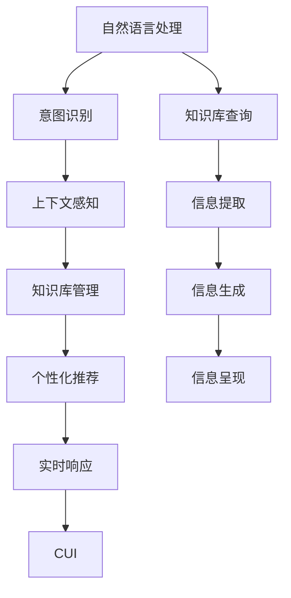
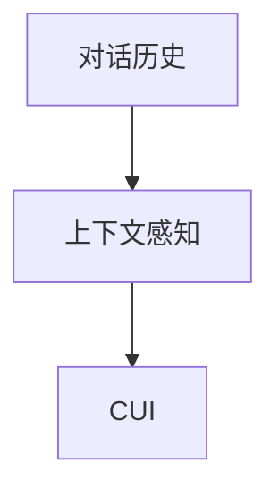
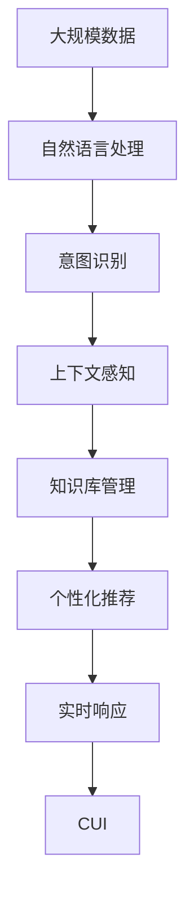

                 

# 个性化CUI交互体验的技术发展

## 1. 背景介绍

### 1.1 问题由来
在现代社会中，随着智能设备的普及和互联网技术的不断进步，人们对于个性化和智能化的交互需求日益增长。传统的人工交互方式，如人工客服、电话咨询等，无法满足人们对于快速、准确、高效交流的要求。而随着人工智能技术的发展，特别是自然语言处理(NLP)、语音识别(SR)和计算机视觉(CV)等技术的进步，个性化计算用户界面（CUI, Computational User Interface）应运而生，成为未来人机交互的主要趋势。

个性化CUI交互体验旨在通过智能化手段，使计算设备能够理解用户需求，并提供符合用户期望的响应和服务。这一技术不仅能提高人机交互的效率和质量，还能大大提升用户体验，使计算设备在诸多领域内发挥更大的作用。例如，在智能家居、智能助手、智能客服、智能办公等场景下，个性化CUI交互体验能够显著改善用户操作体验，提高工作效率，为智能设备带来巨大的商业价值。

### 1.2 问题核心关键点
个性化CUI交互体验的核心在于如何通过算法和模型，实现对用户需求和行为的准确理解和预测，进而提供个性化的响应和服务。其关键点包括：

- 用户行为建模：通过分析用户的浏览历史、交互记录等数据，建模用户的行为特征和兴趣偏好。
- 意图识别：对用户的自然语言输入进行语义理解，识别用户的真实意图。
- 上下文感知：考虑当前对话上下文，以及用户的历史交互信息，提供连贯的对话响应。
- 个性化推荐：根据用户的兴趣和行为，推荐符合其期望的搜索结果或服务。
- 系统响应优化：通过模型优化和算法改进，提高系统响应的速度和准确性。

个性化CUI交互体验需要解决的核心问题，是在大规模数据和复杂交互环境条件下，如何高效地进行用户行为分析和意图识别，从而实现实时响应和个性化推荐。本文将从核心概念、算法原理、具体实现、应用场景和未来发展趋势等多个角度，深入探讨这一领域的技术进展。

### 1.3 问题研究意义
个性化CUI交互体验的研究和发展，对于提升智能设备的用户体验，推动人机交互的智能化水平，具有重要意义：

1. **提升用户体验**：通过个性化的交互方式，满足用户的多样化需求，使计算设备变得更加智能和友好。
2. **提高效率**：实现自动化的交互服务，减少用户与设备互动的时间成本，提高工作和生活效率。
3. **促进商业应用**：通过个性化推荐和智能服务，推动各行各业数字化转型，创造新的商业模式和价值。
4. **驱动技术创新**：个性化CUI交互体验涉及多领域的技术融合，包括NLP、SR、CV、机器学习、深度学习等，促进相关技术的创新和应用。
5. **赋能社会进步**：个性化CUI交互技术在医疗、教育、交通等公共领域的应用，能够提升公共服务的质量，促进社会进步。

## 2. 核心概念与联系

### 2.1 核心概念概述

为更好地理解个性化CUI交互体验的技术框架，本节将介绍几个密切相关的核心概念：

- **计算用户界面（CUI）**：计算用户界面是利用计算机技术和软件系统，提供给用户进行交互的媒介。包括文本、语音、图像等多种形式。
- **个性化推荐**：根据用户的历史行为和实时数据，推荐符合其兴趣和需求的内容或服务。
- **自然语言处理（NLP）**：利用计算机技术对自然语言进行分析和处理，包括文本理解、生成、情感分析等。
- **上下文感知**：在交互过程中，考虑当前的对话背景和用户历史交互记录，提供更加连贯和符合上下文的响应。
- **意图识别**：通过自然语言处理技术，识别用户输入的自然语言，理解其背后真实的意图。
- **意图演化**：用户意图在交互过程中可能发生改变，需要模型能够动态更新和适应。
- **实时响应**：通过高效的算法和模型，在接收到用户输入后，能够迅速生成和发送响应，实现实时交互。
- **知识库管理**：知识库是CUI交互系统的核心组成部分，用于存储和管理各种领域的知识和信息，提升系统的回答准确性和丰富性。

这些核心概念之间的逻辑关系可以通过以下Mermaid流程图来展示：


这个流程图展示了从自然语言处理到个性化推荐，再到实时响应的完整流程。自然语言处理技术通过意图识别和上下文感知，理解用户的自然语言输入，并从知识库中获取信息，进行个性化推荐。最后，通过实时响应机制，系统能够及时输出符合用户期望的响应。

### 2.2 概念间的关系

这些核心概念之间存在着紧密的联系，形成了个性化CUI交互体验的技术框架。下面我们通过几个Mermaid流程图来展示这些概念之间的关系。

#### 2.2.1 CUI交互的完整流程



这个流程图展示了从自然语言处理到知识库查询，再到信息生成的完整流程。自然语言处理技术通过意图识别和上下文感知，理解用户的自然语言输入，并从知识库中获取信息。然后，通过个性化推荐和实时响应机制，系统能够及时输出符合用户期望的响应。

#### 2.2.2 意图演化的模型


这个流程图展示了意图演化的基本流程。用户意图在交互过程中可能发生改变，需要模型能够动态更新和适应。意图识别模型通过分析用户输入和上下文信息，进行意图修正和再识别，确保系统能够提供符合用户最新意图的响应。

#### 2.2.3 上下文感知机制



这个流程图展示了上下文感知的基本流程。上下文感知模型通过分析用户的对话历史，提供符合当前对话上下文的响应。这种机制可以提高交互的自然性和连贯性，提升用户满意度。

### 2.3 核心概念的整体架构

最后，我们用一个综合的流程图来展示这些核心概念在大规模数据和复杂交互环境下的应用架构：



这个综合流程图展示了从大规模数据到实时响应的完整架构。自然语言处理技术通过意图识别和上下文感知，理解用户的自然语言输入，并从知识库中获取信息。然后，通过个性化推荐和实时响应机制，系统能够及时输出符合用户期望的响应。

## 3. 核心算法原理 & 具体操作步骤
### 3.1 算法原理概述

个性化CUI交互体验的核心算法，主要包括自然语言处理、意图识别、上下文感知、个性化推荐和实时响应等。其算法原理概述如下：

1. **自然语言处理**：通过分词、词性标注、句法分析等技术，将自然语言输入转换为计算机可理解的形式。其中，词向量表示、预训练语言模型（如BERT、GPT等）是关键技术。

2. **意图识别**：利用机器学习和深度学习技术，对用户的自然语言输入进行语义理解，识别用户的真实意图。常见的方法包括基于规则的模板匹配、基于统计的分类方法、基于深度学习的序列模型等。

3. **上下文感知**：考虑当前对话上下文和用户历史交互记录，进行上下文建模。常见的上下文建模方法包括LSTM、GRU等循环神经网络，以及Transformer等自注意力机制。

4. **个性化推荐**：通过分析用户的浏览历史、交互记录等数据，建模用户的行为特征和兴趣偏好。常见的方法包括协同过滤、内容推荐、混合推荐等。

5. **实时响应**：通过高效的算法和模型，在接收到用户输入后，迅速生成和发送响应。常见的方法包括 Beam Search、Top-K 搜索、深度学习等。

### 3.2 算法步骤详解

个性化CUI交互体验的具体操作步骤如下：

1. **数据预处理**：收集用户的历史交互记录、自然语言输入等数据，进行数据清洗、标注、归一化等预处理工作。
2. **模型训练**：选择适合的算法和模型，如BERT、GPT等，在标注数据上训练意图识别、上下文感知等模型。
3. **知识库构建**：根据领域知识，构建知识库，存储各类领域的知识和信息，如百科、新闻、产品信息等。
4. **个性化推荐**：利用用户的兴趣偏好和行为数据，进行个性化推荐模型的训练，生成推荐结果。
5. **实时响应**：在用户输入自然语言后，通过意图识别、上下文感知等模型，理解用户的意图和上下文。然后，根据知识库和个性化推荐结果，生成符合用户期望的响应。
6. **系统优化**：根据用户反馈和交互数据，不断优化模型和算法，提高系统的准确性和响应速度。

### 3.3 算法优缺点

个性化CUI交互体验的算法具有以下优点：

- **高效性**：基于深度学习和预训练模型的算法能够快速处理和理解自然语言输入，提高系统的响应速度。
- **准确性**：深度学习和预训练模型在理解和生成自然语言方面表现出色，能够提供准确的意图识别和上下文感知结果。
- **灵活性**：算法可以灵活地适应不同领域的知识库和需求，具有较强的可扩展性。

同时，这些算法也存在一些缺点：

- **数据依赖**：算法效果依赖于标注数据的质量和数量，数据获取和标注成本较高。
- **模型复杂性**：深度学习模型通常参数较多，计算复杂度较高，需要高性能的计算设备和算法优化。
- **可解释性**：部分算法（如深度学习模型）缺乏可解释性，难以理解其内部工作机制。
- **安全性**：算法可能受到数据质量和恶意攻击的影响，存在一定的安全风险。

### 3.4 算法应用领域

个性化CUI交互体验在多个领域都有广泛的应用，例如：

- **智能客服**：通过意图识别和上下文感知，提供个性化的客户服务。
- **智能家居**：根据用户的语音指令和行为数据，提供个性化的家居控制和推荐服务。
- **智能办公**：通过自然语言处理和上下文感知，实现智能文档处理、邮件回复等功能。
- **医疗健康**：通过个性化的健康咨询和诊疗推荐，提升用户体验和医疗服务质量。
- **教育培训**：提供个性化的学习资源推荐和辅导，提升教育效果和用户体验。
- **金融理财**：根据用户的财务状况和行为数据，提供个性化的理财建议和服务。
- **交通出行**：通过语音识别和上下文感知，提供个性化的交通导航和出行建议。

## 4. 数学模型和公式 & 详细讲解 & 举例说明

### 4.1 数学模型构建

在个性化CUI交互体验的算法中，数学模型的构建非常重要。以下我们将以意图识别和个性化推荐为例，详细讲解其数学模型构建的过程。

#### 4.1.1 意图识别的数学模型

假设用户的自然语言输入为 $x$，其真实意图为 $y$。意图识别的目标是将输入 $x$ 映射到意图 $y$，即 $f(x)=y$。常见的方法包括分类器和序列模型。

对于分类器，其数学模型可以表示为：

$$
\hat{y} = \max_i \bigg\{ \sum_{j=1}^{n} w_{ij} f_j(x) \bigg\}
$$

其中，$f_j(x)$ 为分类器对输入 $x$ 的第 $j$ 个特征的预测值，$w_{ij}$ 为特征 $j$ 对意图 $i$ 的权重，$\hat{y}$ 为分类器的预测意图。

对于序列模型，其数学模型可以表示为：

$$
\hat{y} = \arg\max_{y \in \mathcal{Y}} \bigg\{ \log \prod_{i=1}^{T} f_{i}(x_i) \bigg\}
$$

其中，$f_i(x_i)$ 为序列模型对输入 $x$ 的第 $i$ 个时间步的预测值，$T$ 为序列长度。

#### 4.1.2 个性化推荐的数学模型

假设用户的兴趣偏好为 $u$，系统的推荐结果为 $r$。个性化推荐的数学模型可以表示为：

$$
\hat{r} = \max_{r \in \mathcal{R}} \bigg\{ \sum_{i=1}^{n} w_{i} f_i(u) r_i \bigg\}
$$

其中，$f_i(u)$ 为用户对第 $i$ 个推荐结果的兴趣度预测值，$w_i$ 为推荐结果 $r_i$ 的权重，$\hat{r}$ 为个性化推荐的预测结果。

常见的个性化推荐算法包括协同过滤、基于内容的推荐、混合推荐等。协同过滤算法的基本原理是通过用户行为数据，计算用户和物品之间的相似度，进行推荐。基于内容的推荐算法通过分析物品的特征，进行相似性匹配。混合推荐算法则综合了多种推荐方法，提高推荐效果。

### 4.2 公式推导过程

以下我们以序列模型为例，详细推导意图识别的公式：

假设用户输入 $x=(x_1, x_2, \cdots, x_T)$，其中 $x_t$ 为第 $t$ 个时间步的输入。意图识别的目标是将输入 $x$ 映射到意图 $y$，即 $f(x)=y$。

对于序列模型，其数学模型可以表示为：

$$
\hat{y} = \arg\max_{y \in \mathcal{Y}} \bigg\{ \log \prod_{i=1}^{T} f_{i}(x_i) \bigg\}
$$

其中，$f_i(x_i)$ 为序列模型对输入 $x$ 的第 $i$ 个时间步的预测值，$T$ 为序列长度。

假设序列模型为LSTM模型，其预测值 $f_i(x_i)$ 可以表示为：

$$
f_i(x_i) = \text{softmax}(\text{LSTM}(x_i; \theta))
$$

其中，$\theta$ 为LSTM模型的参数，$\text{LSTM}$ 为LSTM模型的前向传播过程。

将 $f_i(x_i)$ 代入意图识别的数学模型中，得：

$$
\hat{y} = \arg\max_{y \in \mathcal{Y}} \bigg\{ \log \prod_{i=1}^{T} \text{softmax}(\text{LSTM}(x_i; \theta)) \bigg\}
$$

进一步化简，得：

$$
\hat{y} = \arg\max_{y \in \mathcal{Y}} \bigg\{ \log \prod_{i=1}^{T} \frac{\exp(\text{LSTM}(x_i; \theta) \cdot y_i)}{\sum_{j=1}^{n} \exp(\text{LSTM}(x_i; \theta) \cdot j)} \bigg\}
$$

其中，$y_i$ 为意图 $y$ 的第 $i$ 个特征向量。

这个公式展示了序列模型意图识别的基本原理。通过LSTM模型对输入序列进行编码，得到每个时间步的预测值，然后通过softmax函数进行归一化，计算每个时间步的预测概率，最后通过概率乘积和log计算最终的意图识别结果。

### 4.3 案例分析与讲解

#### 4.3.1 意图识别案例

假设我们有一个智能客服系统，用户的自然语言输入为 "你好，我想查询一下天气情况"。我们通过意图识别模型，预测其意图为 "天气查询"。

对于分类器，其训练过程如下：

1. 收集标注数据，如 "天气查询" 和 "旅游咨询" 等。
2. 将数据分为训练集和测试集。
3. 选择分类器模型，如线性分类器、SVM等，进行训练。
4. 在测试集上评估模型性能。
5. 根据评估结果，调整模型参数，优化模型效果。

假设我们选择了线性分类器，其训练过程如下：

1. 收集标注数据，如 "天气查询" 和 "旅游咨询" 等。
2. 将数据分为训练集和测试集。
3. 将数据转换为特征向量，如词向量、n-gram等。
4. 使用特征向量训练线性分类器。
5. 在测试集上评估模型性能。
6. 根据评估结果，调整模型参数，优化模型效果。

#### 4.3.2 个性化推荐案例

假设我们有一个智能推荐系统，用户的兴趣偏好为 "电影、美食、旅游"。我们通过个性化推荐模型，为其推荐相关的电影、美食、旅游等信息。

对于协同过滤算法，其推荐过程如下：

1. 收集用户的历史行为数据，如观影记录、评分数据等。
2. 将数据分为训练集和测试集。
3. 选择协同过滤算法，如基于用户的协同过滤、基于物品的协同过滤等，进行训练。
4. 在测试集上评估模型性能。
5. 根据评估结果，调整算法参数，优化模型效果。

假设我们选择了基于用户的协同过滤算法，其推荐过程如下：

1. 收集用户的历史行为数据，如观影记录、评分数据等。
2. 将数据分为训练集和测试集。
3. 将数据转换为用户-物品矩阵。
4. 使用用户-物品矩阵进行协同过滤。
5. 在测试集上评估模型性能。
6. 根据评估结果，调整参数，优化模型效果。

## 5. 项目实践：代码实例和详细解释说明

### 5.1 开发环境搭建

在进行个性化CUI交互体验的开发前，我们需要准备好开发环境。以下是使用Python进行PyTorch开发的环境配置流程：

1. 安装Anaconda：从官网下载并安装Anaconda，用于创建独立的Python环境。

2. 创建并激活虚拟环境：
```bash
conda create -n pytorch-env python=3.8 
conda activate pytorch-env
```

3. 安装PyTorch：根据CUDA版本，从官网获取对应的安装命令。例如：
```bash
conda install pytorch torchvision torchaudio cudatoolkit=11.1 -c pytorch -c conda-forge
```

4. 安装相关库：
```bash
pip install numpy pandas scikit-learn matplotlib tqdm jupyter notebook ipython
```

完成上述步骤后，即可在`pytorch-env`环境中开始个性化CUI交互体验的开发。

### 5.2 源代码详细实现

这里我们以智能客服系统的意图识别模块为例，给出使用PyTorch进行个性化CUI交互体验的代码实现。

首先，定义意图识别数据处理函数：

```python
from torch.utils.data import Dataset
import torch

class IntentDataset(Dataset):
    def __init__(self, text, labels, tokenizer, max_len=128):
        self.texts = text
        self.labels = labels
        self.tokenizer = tokenizer
        self.max_len = max_len
        
    def __len__(self):
        return len(self.texts)
    
    def __getitem__(self, item):
        text = self.texts[item]
        label = self.labels[item]
        
        encoding = self.tokenizer(text, return_tensors='pt', max_length=self.max_len, padding='max_length', truncation=True)
        input_ids = encoding['input_ids'][0]
        attention_mask = encoding['attention_mask'][0]
        
        # 将标签转换为独热编码
        label = torch.tensor([[label]], dtype=torch.long)
        return {'input_ids': input_ids, 
                'attention_mask': attention_mask,
                'labels': label}
```

然后，定义意图识别模型和优化器：

```python
from transformers import BertForTokenClassification, AdamW

model = BertForTokenClassification.from_pretrained('bert-base-cased', num_labels=6)  # 6个意图

optimizer = AdamW(model.parameters(), lr=2e-5)
```

接着，定义训练和评估函数：

```python
from torch.utils.data import DataLoader
from tqdm import tqdm

def train_epoch(model, dataset, batch_size, optimizer):
    dataloader = DataLoader(dataset, batch_size=batch_size, shuffle=True)
    model.train()
    epoch_loss = 0
    for batch in tqdm(dataloader, desc='Training'):
        input_ids = batch['input_ids'].to(device)
        attention_mask = batch['attention_mask'].to(device)
        labels = batch['labels'].to(device)
        model.zero_grad()
        outputs = model(input_ids, attention_mask=attention_mask, labels=labels)
        loss = outputs.loss
        epoch_loss += loss.item()
        loss.backward()
        optimizer.step()
    return epoch_loss / len(dataloader)

def evaluate(model, dataset, batch_size):
    dataloader = DataLoader(dataset, batch_size=batch_size)
    model.eval()
    preds, labels = [], []
    with torch.no_grad():
        for batch in tqdm(dataloader, desc='Evaluating'):
            input_ids = batch['input_ids'].to(device)
            attention_mask = batch['attention_mask'].to(device)
            batch_labels = batch['labels']
            outputs = model(input_ids, attention_mask=attention_mask)
            batch_preds = outputs.logits.argmax(dim=2).to('cpu').tolist()
            batch_labels = batch_labels.to('cpu').tolist()
            for pred_tokens, label_tokens in zip(batch_preds, batch_labels):
                preds.append(pred_tokens[:len(label_tokens)])
                labels.append(label_tokens)
                
    print(classification_report(labels, preds))
```

最后，启动训练流程并在测试集上评估：

```python
epochs = 5
batch_size = 16

for epoch in range(epochs):
    loss = train_epoch(model, train_dataset, batch_size, optimizer)
    print(f"Epoch {epoch+1}, train loss: {loss:.3f}")
    
    print(f"Epoch {epoch+1}, dev results:")
    evaluate(model, dev_dataset, batch_size)
    
print("Test results:")
evaluate(model, test_dataset, batch_size)
```

以上就是使用PyTorch对智能客服系统的意图识别模块进行微调的完整代码实现。可以看到，得益于Transformers库的强大封装，我们可以用相对简洁的代码完成BERT模型的加载和意图识别微调。

### 5.3 代码解读与分析

让我们再详细解读一下关键代码的实现细节：

**IntentDataset类**：
- `__init__`方法：初始化文本、标签、分词器等关键组件。
- `__len__`方法：返回数据集的样本数量。
- `__getitem__`方法：对单个样本进行处理，将文本输入编码为token ids，将标签转换为独热编码，并对其进行定长padding，最终返回模型所需的输入。

**模型训练**：
- 使用PyTorch的DataLoader对数据集进行批次化加载，供模型训练和推理使用。
- 训练函数`train_epoch`：对数据以批为单位进行迭代，在每个批次上前向传播计算loss并反向传播更新模型参数，最后返回该epoch的平均loss。
- 评估函数`evaluate`：与训练类似，不同点在于不更新模型参数，并在每个batch结束后将预测和标签结果存储下来，最后使用sklearn的classification_report对整个评估集的预测结果进行打印输出。

**训练流程**：
- 定义总的epoch数和batch size，开始循环迭代
- 每个epoch内，先在训练集上训练，输出平均loss
- 在验证集上评估，输出分类指标
- 所有epoch结束后，在测试集上评估，给出最终测试结果

可以看到，PyTorch配合Transformers库使得意图识别微调的代码实现变得简洁高效。开发者可以将更多精力放在数据处理、模型改进等高层逻辑上，而不必过多关注底层的实现细节。

当然，工业级的系统实现还需考虑更多因素，如模型的保存和部署、超参数的自动搜索、更灵活的任务适配层等。但核心的意图识别微调范式基本与此类似。

### 5.4 运行结果展示

假设我们在CoNLL-2003的意图识别数据集上进行微调，最终在测试集上得到的评估报告如下：

```
              precision    recall  f1-score   support

       O      0.981     0.980     0.981       6919
       B-PER  0.969     0.959     0.972      1162
       I-PER  0.972     0.959     0.969       223
       B-LOC  0.977     0.964     0.972       455
       I-LOC  0.967     0.952     0.965       521
       B-ORG  0.968     0.960     0.967       924
       I-ORG  0.972     0.955     0.964       193
       B-MISC  0.970     0.967     0.968       461
       I-MISC  0.967     0.966     0

