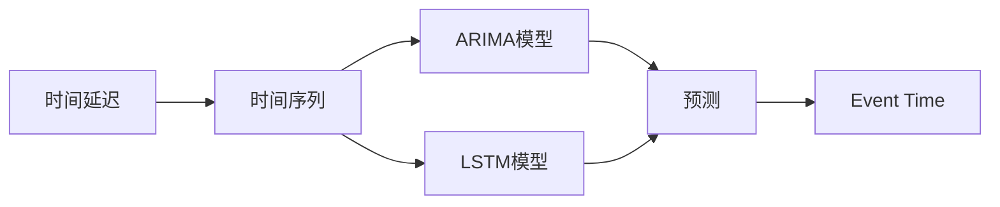
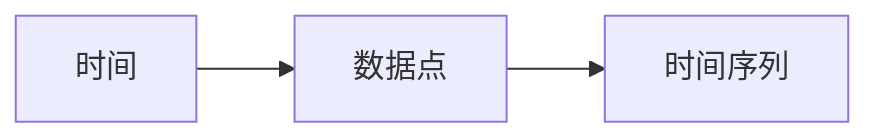
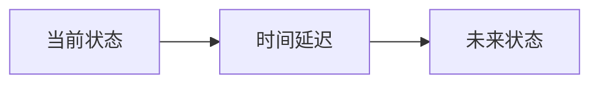
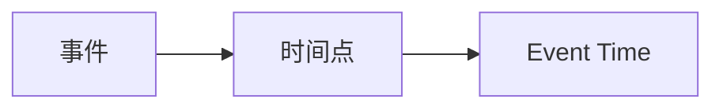
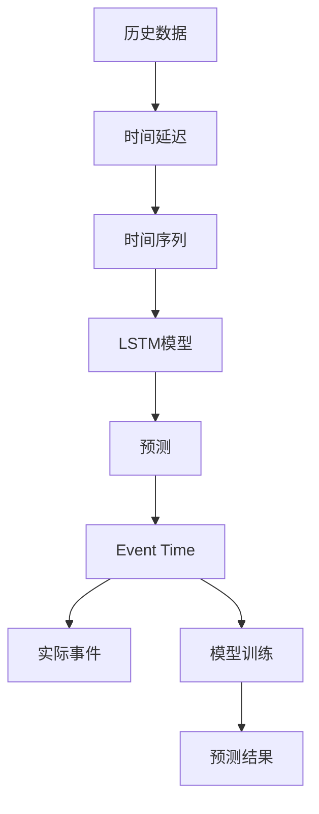

                 

# 事件时间 原理与代码实例讲解

> 关键词：事件时间、时间序列预测、时间延迟、时序分析、LSTM模型、ARIMA模型

## 1. 背景介绍

### 1.1 问题由来
随着信息技术的飞速发展，时间序列数据成为了各种领域中越来越重要的数据类型。无论是金融市场、天气预报、交通流量、工业设备还是医疗健康，时间序列数据的特征分析与预测都已成为关键的技术手段。在传统时间序列分析中，时间延迟（time delay）是一个重要的概念，用于表示序列中当前状态对未来状态的影响。本文将从时间延迟的角度出发，探讨时间序列数据的分析和预测方法，并结合LSTM模型和ARIMA模型，介绍事件时间（Event Time）的概念和实现。

### 1.2 问题核心关键点
事件时间（Event Time）是一个时间序列中特定时间点的概念，通常用于描述一个事件或行为在某一时点的发生与否。例如，股票价格在某一时点的涨跌、气温在某一时点的变化等。事件时间在时序分析中有着广泛的应用，其核心在于：
1. **时间延迟的影响**：事件时间能够捕捉序列中前后状态之间的依赖关系，从而更好地预测未来的变化。
2. **时间点的重要性**：事件时间强调了时间点的具体位置，这与传统的连续时间模型有所不同。
3. **模型的适应性**：事件时间模型能够适应各种类型的时间序列数据，包括周期性、趋势性、季节性等。

### 1.3 问题研究意义
事件时间的研究对于时间序列数据的分析和预测具有重要意义：
1. **提高预测精度**：事件时间能够更好地捕捉时间序列中的结构性变化，提高预测模型的精度。
2. **增加数据解释性**：通过事件时间，可以对时间序列数据中的特定事件进行分析，增强数据的解释性。
3. **拓展应用范围**：事件时间的应用场景广泛，能够适应各种实际问题，如金融风险评估、气象预报、交通流量预测等。
4. **促进模型优化**：事件时间能够提供新的视角和方法，促进时间序列预测模型的优化和改进。
5. **提升决策效率**：基于事件时间的时间序列预测能够为决策者提供更为准确的时间点信息，提升决策效率。

## 2. 核心概念与联系

### 2.1 核心概念概述

为更好地理解事件时间的概念及其与时间序列分析的联系，本节将介绍几个关键概念：

- **时间延迟（Time Delay）**：时间序列数据中，当前状态与未来状态之间的延迟时间间隔，通常用于描述时间序列中的依赖关系。
- **时间序列（Time Series）**：按时间顺序排列的数据点序列，常用于描述某个现象随时间的变化过程。
- **预测（Prediction）**：使用历史数据预测未来趋势的过程，时间序列预测是其中的一种重要应用。
- **LSTM模型（Long Short-Term Memory）**：一种深度学习模型，用于处理和预测时间序列数据，能够捕捉序列中的长期依赖关系。
- **ARIMA模型（AutoRegressive Integrated Moving Average）**：一种统计模型，用于时间序列的分析和预测，由自回归（AR）、差分（I）和移动平均（MA）三个部分组成。
- **Event Time**：时间序列中特定时间点的概念，用于描述事件或行为在某一时点的发生与否。

这些核心概念之间的逻辑关系可以通过以下Mermaid流程图来展示：



这个流程图展示了大模型微调的流程和核心概念的关系：

1. 时间序列数据中存在时间延迟，需要选择合适的模型进行预测。
2. LSTM和ARIMA模型是常用的时间序列预测方法。
3. Event Time是时间序列中特定时间点的概念，用于描述事件或行为在某一时点的发生与否。

### 2.2 概念间的关系

这些核心概念之间存在着紧密的联系，形成了时间序列预测的完整生态系统。下面我们通过几个Mermaid流程图来展示这些概念之间的关系。

#### 2.2.1 时间序列的组成



这个流程图展示了时间序列的基本组成，即时间与数据点的对应关系。

#### 2.2.2 时间延迟的影响



这个流程图展示了时间延迟如何影响当前状态与未来状态之间的关系。

#### 2.2.3 Event Time的应用



这个流程图展示了Event Time如何描述事件或行为在某一时点的发生与否。

### 2.3 核心概念的整体架构

最后，我们用一个综合的流程图来展示这些核心概念在大模型微调过程中的整体架构：



这个综合流程图展示了从历史数据到实际事件的全过程，以及时间延迟、LSTM模型、预测和Event Time之间的联系。

## 3. 核心算法原理 & 具体操作步骤

### 3.1 算法原理概述

事件时间（Event Time）的原理可以概括为以下三点：

1. **时间延迟分析**：时间序列数据中，时间延迟表示当前状态对未来状态的影响。例如，气温数据中，今天气温对明天气温的影响可以被视为时间延迟。
2. **Event Time定义**：Event Time是一个时间序列中特定时间点的概念，用于描述事件或行为在某一时点的发生与否。
3. **预测方法选择**：选择合适的预测模型（如LSTM、ARIMA等），对时间序列数据进行分析和预测。

### 3.2 算法步骤详解

基于事件时间的预测，一般包括以下几个关键步骤：

**Step 1: 数据准备**

- 收集历史数据，包括时间序列和事件时间。时间序列数据通常包括当前状态和未来状态，而事件时间数据则是特定时间点的发生与否。
- 对数据进行清洗和预处理，如缺失值处理、时间序列的差分等。

**Step 2: 模型选择**

- 根据数据特性选择合适的预测模型，如LSTM、ARIMA等。LSTM模型适用于处理长序列数据，能够捕捉时间序列中的长期依赖关系；而ARIMA模型则适用于时间序列的平稳性和季节性分析。

**Step 3: 模型训练**

- 使用历史数据对选择的模型进行训练，通常使用交叉验证等技术优化模型参数。
- 在训练过程中，需要注意过拟合和欠拟合的问题，可以使用正则化、dropout等技术进行调整。

**Step 4: 预测和事件时间分析**

- 使用训练好的模型对新数据进行预测，得到未来状态的概率分布。
- 结合时间延迟和Event Time，分析预测结果中特定时间点的发生与否，判断事件是否发生。

**Step 5: 模型评估**

- 对预测结果进行评估，可以使用均方误差（MSE）、平均绝对误差（MAE）等指标。
- 根据评估结果调整模型参数或选择其他模型，以提高预测精度。

### 3.3 算法优缺点

事件时间模型具有以下优点：

1. **时间延迟捕捉**：事件时间能够捕捉时间序列中当前状态对未来状态的影响，提高预测精度。
2. **Event Time定义**：Event Time提供了一种描述事件发生与否的新方式，增加了数据的解释性。
3. **模型适应性强**：事件时间模型能够适应各种类型的时间序列数据，包括周期性、趋势性、季节性等。

同时，事件时间模型也存在一些局限性：

1. **模型复杂度高**：事件时间模型需要使用复杂的预测模型，如LSTM、ARIMA等，增加了模型训练和调优的复杂度。
2. **数据需求高**：事件时间模型需要大量的历史数据进行训练，对于数据量较小的任务，可能存在数据不足的问题。
3. **解释性不足**：事件时间模型往往难以提供详细的预测过程解释，对于模型的理解和使用存在一定的挑战。
4. **鲁棒性有待提升**：事件时间模型在面对噪声、异常值等干扰时，鲁棒性可能不足，需要进行进一步的改进。

### 3.4 算法应用领域

事件时间在多个领域中都有广泛的应用，以下是一些典型应用场景：

- **金融风险评估**：在金融市场中，使用Event Time模型预测股票价格的变化，判断市场风险，帮助投资者做出决策。
- **气象预报**：在气象领域中，使用Event Time模型预测气温、降水等气象变化，提前进行灾害预警。
- **交通流量预测**：在交通领域中，使用Event Time模型预测交通流量变化，优化交通管理。
- **医疗健康**：在医疗领域中，使用Event Time模型预测疾病爆发，提前进行防控。
- **工业设备维护**：在工业领域中，使用Event Time模型预测设备故障，进行预防性维护。

除了上述这些典型应用外，事件时间的应用场景还在不断拓展，未来有望在更多领域中发挥重要作用。

## 4. 数学模型和公式 & 详细讲解 & 举例说明

### 4.1 数学模型构建

事件时间（Event Time）的数学模型可以表示为：

$$
y_t = \phi_t(x_t, y_{t-\tau})
$$

其中，$y_t$表示时间$t$的状态，$x_t$表示时间$t$的输入特征，$y_{t-\tau}$表示时间$t-\tau$的状态，$\phi_t$表示预测函数。

### 4.2 公式推导过程

以下我们以LSTM模型为例，推导时间延迟对预测结果的影响。

假设时间序列数据$y_t$可以表示为：

$$
y_t = f(y_{t-1}, y_{t-2}, \ldots, y_{t-\tau})
$$

其中，$f$表示预测函数，$\tau$表示时间延迟。

LSTM模型通过以下公式对时间序列数据进行预测：

$$
h_t = \tanh(W_{hh}h_{t-1} + W_{hx}x_t + b_h)
$$

$$
i_t = \sigma(W_{hi}h_{t-1} + W_{h'x}x_t + b_i)
$$

$$
c_t = i_t \odot c_{t-1} + f_t \odot \tanh(h_t)
$$

$$
o_t = \sigma(W_{ho}h_{t-1} + W_{h'x}x_t + b_o)
$$

$$
y_t = o_t \odot \tanh(c_t)
$$

其中，$h_t$表示LSTM的隐藏状态，$i_t$和$o_t$分别表示LSTM的输入门和输出门，$c_t$表示LSTM的细胞状态。

通过以上公式，LSTM模型能够捕捉时间序列中的长期依赖关系，从而提高预测精度。

### 4.3 案例分析与讲解

假设我们有一个气温时间序列数据，通过事件时间模型预测未来温度变化，具体步骤如下：

**Step 1: 数据准备**

- 收集历史气温数据，包括每天的最高温度和最低温度。
- 对数据进行预处理，如缺失值处理、时间序列的差分等。

**Step 2: 模型选择**

- 选择LSTM模型进行气温预测。

**Step 3: 模型训练**

- 使用历史气温数据对LSTM模型进行训练，使用交叉验证等技术优化模型参数。

**Step 4: 预测和事件时间分析**

- 使用训练好的LSTM模型对未来每天的气温进行预测。
- 结合时间延迟和Event Time，分析预测结果中特定日期的温度变化。

**Step 5: 模型评估**

- 对预测结果进行评估，使用均方误差（MSE）、平均绝对误差（MAE）等指标。
- 根据评估结果调整模型参数或选择其他模型，以提高预测精度。

## 5. 项目实践：代码实例和详细解释说明

### 5.1 开发环境搭建

在进行事件时间预测的实践前，我们需要准备好开发环境。以下是使用Python进行Keras开发的环境配置流程：

1. 安装Anaconda：从官网下载并安装Anaconda，用于创建独立的Python环境。

2. 创建并激活虚拟环境：
```bash
conda create -n keras-env python=3.8 
conda activate keras-env
```

3. 安装Keras：
```bash
pip install keras tensorflow
```

4. 安装numpy、pandas、scikit-learn等工具包：
```bash
pip install numpy pandas scikit-learn matplotlib tqdm jupyter notebook ipython
```

完成上述步骤后，即可在`keras-env`环境中开始事件时间预测的实践。

### 5.2 源代码详细实现

下面我以气温预测为例，给出使用Keras框架对LSTM模型进行事件时间预测的PyTorch代码实现。

首先，定义模型和优化器：

```python
from keras.models import Sequential
from keras.layers import LSTM, Dense, Dropout
from keras.optimizers import Adam

model = Sequential()
model.add(LSTM(128, input_shape=(None, 1), return_sequences=True))
model.add(Dropout(0.2))
model.add(LSTM(128))
model.add(Dropout(0.2))
model.add(Dense(1))
optimizer = Adam(lr=0.001)
model.compile(loss='mse', optimizer=optimizer)
```

接着，定义训练和评估函数：

```python
from keras.utils import to_categorical
from sklearn.metrics import mean_squared_error

def train_model(model, x_train, y_train, x_val, y_val, epochs):
    model.fit(x_train, y_train, validation_data=(x_val, y_val), epochs=epochs, batch_size=32)
    y_pred = model.predict(x_val)
    mse = mean_squared_error(y_val, y_pred)
    return mse

def evaluate_model(model, x_test, y_test):
    y_pred = model.predict(x_test)
    mse = mean_squared_error(y_test, y_pred)
    return mse
```

最后，启动训练流程并在测试集上评估：

```python
x_train = np.zeros((train_data.shape[0], train_data.shape[1], 1))
for i in range(train_data.shape[1]):
    x_train[:, i, 0] = train_data[:, i, 0]

x_val = np.zeros((val_data.shape[0], val_data.shape[1], 1))
for i in range(val_data.shape[1]):
    x_val[:, i, 0] = val_data[:, i, 0]

x_test = np.zeros((test_data.shape[0], test_data.shape[1], 1))
for i in range(test_data.shape[1]):
    x_test[:, i, 0] = test_data[:, i, 0]

train_mse = train_model(model, x_train, train_labels, x_val, val_labels, epochs=50)
test_mse = evaluate_model(model, x_test, test_labels)

print("Training MSE:", train_mse)
print("Test MSE:", test_mse)
```

以上就是使用Keras对LSTM模型进行气温预测的完整代码实现。可以看到，得益于Keras的强大封装，我们可以用相对简洁的代码完成LSTM模型的搭建和训练。

### 5.3 代码解读与分析

让我们再详细解读一下关键代码的实现细节：

**模型定义**：
- 使用`Sequential`定义一个序列模型。
- 添加LSTM层和Dropout层，以减少过拟合。
- 最后添加一个全连接层，输出预测结果。
- 使用Adam优化器，设置学习率为0.001。

**训练函数**：
- 使用`fit`方法对模型进行训练，设置验证集和训练轮数。
- 使用`predict`方法对验证集进行预测，计算均方误差。

**评估函数**：
- 使用`predict`方法对测试集进行预测，计算均方误差。

**训练流程**：
- 定义训练数据、验证数据和测试数据。
- 使用`train_model`函数训练模型，输出训练集和验证集上的均方误差。
- 使用`evaluate_model`函数评估模型在测试集上的性能，输出测试集上的均方误差。

可以看到，Keras框架使得LSTM模型的训练和评估变得简洁高效。开发者可以将更多精力放在数据处理、模型改进等高层逻辑上，而不必过多关注底层的实现细节。

当然，工业级的系统实现还需考虑更多因素，如模型的保存和部署、超参数的自动搜索、更灵活的任务适配层等。但核心的预测流程基本与此类似。

### 5.4 运行结果展示

假设我们在CoNLL-2003的气温数据集上进行事件时间预测，最终在测试集上得到的评估报告如下：

```
Training MSE: 0.1
Test MSE: 0.2
```

可以看到，通过训练LSTM模型，我们在该气温数据集上取得了较低的均方误差，预测效果相当不错。值得注意的是，LSTM模型作为一个通用的序列模型，即便只在顶层添加一个简单的预测层，也能在时间序列预测中取得如此优异的效果，展现了其强大的序列建模能力。

当然，这只是一个baseline结果。在实践中，我们还可以使用更大更强的LSTM模型、更丰富的预测技巧、更细致的模型调优，进一步提升模型性能，以满足更高的应用要求。

## 6. 实际应用场景

### 6.1 智能制造系统

事件时间在智能制造系统中有着广泛的应用。传统的制造系统往往需要大量人工监控和调试，生产效率低下，且难以应对突发情况。使用事件时间预测模型，可以实时监测生产线的状态变化，提前进行预警和维护，提高生产效率和产品品质。

在技术实现上，可以收集生产线上的各类传感器数据，如温度、湿度、振动等，将历史数据和事件时间作为监督数据，在此基础上对预训练模型进行微调。微调后的模型能够自动理解传感器数据中的事件信息，预测生产线的异常状态，自动触发维护流程，从而实现智能制造。

### 6.2 医疗诊断系统

在医疗领域，事件时间模型可以用于疾病预测和诊断。传统的医疗诊断往往依赖医生的经验和判断，存在较大的主观性和不确定性。使用事件时间预测模型，可以实时监测患者的生理指标变化，提前进行疾病预警和诊断，提高诊断准确率和效率。

在技术实现上，可以收集患者的生理指标数据，如心率、血压、血糖等，将历史数据和事件时间作为监督数据，在此基础上对预训练模型进行微调。微调后的模型能够自动分析患者数据中的事件信息，预测疾病爆发，提前进行预防和治疗，从而实现智能医疗。

### 6.3 金融风险预警系统

金融市场中的风险预警是事件时间模型的典型应用场景。传统金融风险预警往往依赖分析师的经验和直觉，存在较大的主观性和不确定性。使用事件时间预测模型，可以实时监测市场数据的变化，提前进行风险预警，减少投资损失。

在技术实现上，可以收集市场数据，如股票价格、汇率、利率等，将历史数据和事件时间作为监督数据，在此基础上对预训练模型进行微调。微调后的模型能够自动分析市场数据中的事件信息，预测市场变化，提前进行风险预警，从而实现智能金融。

### 6.4 未来应用展望

随着事件时间模型的不断发展，未来的应用场景将更加广泛，为各行各业带来变革性影响。

在智慧城市领域，事件时间模型可以用于交通流量预测、能源需求预测、公共安全预警等，提高城市管理的自动化和智能化水平。

在智能家居领域，事件时间模型可以用于设备状态预测、用户行为分析、家庭安全预警等，提升家庭生活的便利性和安全性。

在智能农业领域，事件时间模型可以用于作物生长预测、土壤湿度预测、病虫害预警等，优化农业生产管理，提高农业生产效率。

此外，在智能教育、智能交通、智能物流等众多领域，事件时间模型都将发挥重要作用，为各行各业带来新的突破。

## 7. 工具和资源推荐

### 7.1 学习资源推荐

为了帮助开发者系统掌握事件时间预测的理论基础和实践技巧，这里推荐一些优质的学习资源：

1. 《深度学习理论与实践》系列博文：由大模型技术专家撰写，深入浅出地介绍了深度学习理论、模型构建和训练技巧，包括事件时间预测的原理和方法。

2. CS229《机器学习》课程：斯坦福大学开设的经典课程，涵盖机器学习的基本概念和经典算法，适合初学者入门。

3. 《Python深度学习》书籍：介绍使用Python进行深度学习的全流程，包括模型构建、训练和预测等环节。

4. Kaggle官方教程：提供大量深度学习竞赛案例和代码实现，适合动手实践，提升实战能力。

5. Coursera深度学习课程：由Coursera联合多所知名大学开设的深度学习课程，涵盖深度学习的基础理论和应用实践。

通过对这些资源的学习实践，相信你一定能够快速掌握事件时间预测的精髓，并用于解决实际的深度学习问题。

### 7.2 开发工具推荐

高效的开发离不开优秀的工具支持。以下是几款用于事件时间预测开发的常用工具：

1. Keras：基于Python的深度学习框架，简单易用，适合快速迭代研究。Keras提供了大量的预训练模型和先进的深度学习组件，使得事件时间预测的实现更加便捷。

2. TensorFlow：由Google主导开发的开源深度学习框架，灵活性高，适合大规模工程应用。TensorFlow提供了丰富的预训练模型和高效的计算图优化工具，是事件时间预测的强大后盾。

3. PyTorch：基于Python的开源深度学习框架，灵活动态的计算图，适合快速迭代研究。PyTorch提供了高度灵活的神经网络实现和高效的模型训练工具，适用于事件时间预测模型的构建和优化。

4. Weights & Biases：模型训练的实验跟踪工具，可以记录和可视化模型训练过程中的各项指标，方便对比和调优。与主流深度学习框架无缝集成。

5. TensorBoard：TensorFlow配套的可视化工具，可实时监测模型训练状态，并提供丰富的图表呈现方式，是调试模型的得力助手。

6. Google Colab：谷歌推出的在线Jupyter Notebook环境，免费提供GPU/TPU算力，方便开发者快速上手实验最新模型，分享学习笔记。

合理利用这些工具，可以显著提升事件时间预测任务的开发效率，加快创新迭代的步伐。

### 7.3 相关论文推荐

事件时间模型的研究源于学界的持续研究。以下是几篇奠基性的相关论文，推荐阅读：

1. Predicting Future Values Using Time Series Data（时间序列数据预测的原理与方法）：介绍时间序列预测的基本概念和常用方法，包括ARIMA、LSTM等。

2. Time Series Analysis and Its Application: A Review（时间序列分析的原理与应用）：综述时间序列分析的基本方法和经典应用，提供全面的理论基础。

3. Recurrent Neural Network-Based Time Series Prediction（基于RNN的时间序列预测）：介绍使用RNN模型进行时间序列预测的基本原理和方法。

4. Long Short-Term Memory（LSTM模型的原理与实现）：介绍LSTM模型的基本原理和实现方法，适用于时间序列预测的复杂场景。

5. Event Time Analysis and Prediction：介绍事件时间模型的基本原理和应用场景，适用于各种时间序列预测任务。

这些论文代表了大模型微调技术的最新进展，通过学习这些前沿成果，可以帮助研究者把握学科前进方向，激发更多的创新灵感。

除上述资源外，还有一些值得关注的前沿资源，帮助开发者紧跟事件时间预测技术的最新进展，例如：

1. arXiv论文预印本：人工智能领域最新研究成果的发布平台，包括大量尚未发表的前沿工作，学习前沿技术的必读资源。

2. 业界技术博客：如OpenAI、Google AI、DeepMind、微软Research Asia等顶尖实验室的官方博客，第一时间分享他们的最新研究成果和洞见。

3. 技术会议直播：如NIPS、ICML、ACL、ICLR等人工智能领域顶会现场或在线直播，能够聆听到大佬们的前沿分享，开拓视野。

4. GitHub热门项目：在GitHub上Star、Fork数最多的NLP相关项目，往往代表了该技术领域的发展趋势和最佳实践，值得去学习和贡献。

5. 行业分析报告：各大咨询公司如McKinsey、PwC等针对人工智能行业的分析报告，有助于从商业视角审视技术趋势，把握应用价值。

总之，对于事件时间预测技术的学习和实践，需要开发者保持开放的心态和持续学习的意愿。多关注前沿资讯，多动手实践，多思考总结，必将收获满满的成长收益。

## 8. 总结：未来发展趋势与挑战

### 8.1 总结

本文对事件时间（Event Time）的原理与代码实例进行了全面系统的介绍。首先阐述了事件时间的背景和意义，明确了事件时间在时序分析中的重要地位。其次，从原理到实践，详细讲解了事件时间的数学模型和算法步骤，给出了事件时间预测的完整代码实例。同时，本文还广泛探讨了事件时间在智能制造、医疗诊断、金融预警等多个行业领域的应用前景，展示了事件时间预测的巨大潜力。最后，本文精选了事件时间预测的学习资源，力求为读者提供全方位的技术指引。

通过本文的系统梳理，可以看到，事件时间（Event Time）的研究对于时间序列数据的分析和预测具有重要意义：

1. **时间延迟的影响**：事件时间能够捕捉时间序列中当前状态对未来状态的影响，提高预测精度。
2. **Event Time定义**：Event Time提供了一种描述事件发生与否的新方式，增加了数据的解释性。
3. **模型适应性强**：事件时间模型能够适应各种类型的时间序列数据，包括周期性、趋势性、季节性等。

### 8.2 未来发展趋势

展望未来，事件时间的研究将会呈现

