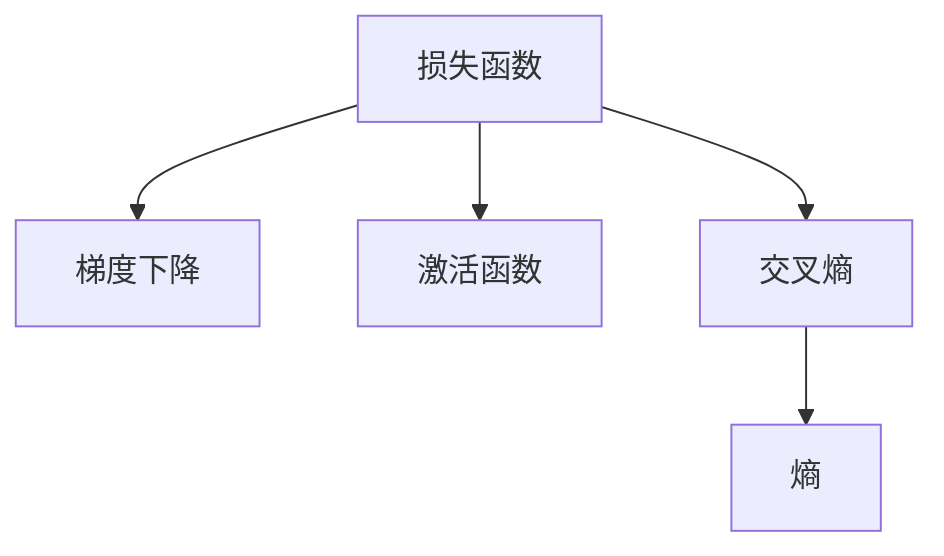

                 

# 交叉熵Cross Entropy原理与代码实例讲解

## 1. 背景介绍

### 1.1 问题由来

在深度学习领域，交叉熵(Cross Entropy)是一个非常重要的概念。它不仅是许多深度学习模型的损失函数，还在梯度下降优化算法中扮演了关键角色。交叉熵在分类问题中尤为常用，能够衡量预测值与真实值之间的差距。本文将详细介绍交叉熵的原理，并通过代码实例展示其应用。

### 1.2 问题核心关键点

交叉熵的核心关键点包括：
- 交叉熵的定义及其数学表达式。
- 交叉熵的梯度计算及其在优化算法中的作用。
- 交叉熵的性质，如其在分类问题中的优势和不足。
- 交叉熵在实际应用中的代码实现及其性能分析。

## 2. 核心概念与联系

### 2.1 核心概念概述

为更好地理解交叉熵，本节将介绍几个密切相关的核心概念：

- 损失函数(Loss Function)：深度学习模型中用于衡量模型预测与真实值之间差距的函数。常见的损失函数包括均方误差(MSE)、交叉熵(Cross Entropy)等。
- 梯度下降(Gradient Descent)：一种用于最小化损失函数的优化算法，通过计算损失函数对模型参数的梯度，反向更新参数。
- 激活函数(Activation Function)：神经网络中用于引入非线性因素的函数，如ReLU、Sigmoid等。
- 交叉熵(Cross Entropy)：一种用于衡量概率分布之间的差异的函数，常用于分类问题中的损失函数。
- 熵(Entropy)：信息论中衡量随机事件不确定性的指标，交叉熵可以看作是熵的一种扩展。

这些核心概念之间的逻辑关系可以通过以下Mermaid流程图来展示：



这个流程图展示了几大核心概念之间的联系：
- 损失函数作为衡量模型预测与真实值之间差距的指标。
- 梯度下降通过优化损失函数来更新模型参数。
- 激活函数引入非线性因素，提升模型表达能力。
- 交叉熵衡量预测概率分布与真实概率分布之间的差距。
- 交叉熵与熵有关联，可以看作是熵的一种扩展。

### 2.2 概念间的关系

这些核心概念之间存在密切的联系，形成了深度学习模型的基本框架。在实际应用中，它们常常相互配合，共同工作。例如，在分类任务中，激活函数用于将输出转换为概率分布，交叉熵用于衡量预测概率分布与真实概率分布之间的差距，梯度下降用于最小化交叉熵损失。

## 3. 核心算法原理 & 具体操作步骤

### 3.1 算法原理概述

交叉熵本质上是一种衡量概率分布之间差异的指标，用于优化分类问题中的损失函数。在深度学习中，交叉熵损失函数定义为：

$$
\mathcal{L} = -\frac{1}{N} \sum_{i=1}^N \sum_{j=1}^C y_{i,j} \log \hat{y}_{i,j}
$$

其中，$y_{i,j}$ 表示样本 $i$ 在类别 $j$ 上的真实标签（0或1），$\hat{y}_{i,j}$ 表示模型对样本 $i$ 在类别 $j$ 上的预测概率。交叉熵损失函数的目的是最小化预测概率分布与真实概率分布之间的差异。

在优化算法中，梯度下降通过计算损失函数对模型参数的梯度，反向更新参数。对于交叉熵损失函数，梯度计算公式为：

$$
\frac{\partial \mathcal{L}}{\partial \theta_k} = -\frac{1}{N} \sum_{i=1}^N \sum_{j=1}^C \frac{\partial \log \hat{y}_{i,j}}{\partial \theta_k} y_{i,j}
$$

其中，$\frac{\partial \log \hat{y}_{i,j}}{\partial \theta_k}$ 表示预测概率对模型参数的导数。这个公式展示了交叉熵损失函数的梯度如何与预测概率分布和真实标签相关联。

### 3.2 算法步骤详解

交叉熵损失函数和梯度计算的具体步骤如下：

1. **数据准备**：收集训练数据，将真实标签和预测概率存入相应数组。
2. **损失函数计算**：计算样本级别的交叉熵损失，再求平均值。
3. **梯度计算**：计算梯度，更新模型参数。
4. **循环迭代**：重复上述步骤，直到损失收敛。

下面通过Python代码实现上述步骤，展示交叉熵损失函数的计算和梯度计算过程。

### 3.3 算法优缺点

交叉熵损失函数的优点包括：
- 能够自然地处理多分类问题，无需将多个单分类问题组合起来。
- 梯度计算简单，易于实现和优化。

其缺点包括：
- 对类别不平衡数据敏感，容易忽略少数类别。
- 对噪声数据敏感，容易过拟合。
- 对模型参数的初始值比较敏感，需要适当的调整。

### 3.4 算法应用领域

交叉熵损失函数广泛应用于分类问题中，如文本分类、图像分类、语音识别等。其广泛的适用性和高效性使其成为深度学习领域不可或缺的一部分。

## 4. 数学模型和公式 & 详细讲解  
### 4.1 数学模型构建

交叉熵损失函数是一种基于概率分布的损失函数，用于衡量模型预测概率分布与真实概率分布之间的差异。其数学定义如下：

$$
\mathcal{L} = -\frac{1}{N} \sum_{i=1}^N \sum_{j=1}^C y_{i,j} \log \hat{y}_{i,j}
$$

其中，$N$ 表示样本数量，$C$ 表示类别数，$y_{i,j}$ 表示样本 $i$ 在类别 $j$ 上的真实标签（0或1），$\hat{y}_{i,j}$ 表示模型对样本 $i$ 在类别 $j$ 上的预测概率。

### 4.2 公式推导过程

交叉熵损失函数的推导基于熵的概念。熵是衡量随机事件不确定性的指标，定义为：

$$
H = -\sum_{j=1}^C p_j \log p_j
$$

其中，$p_j$ 表示事件 $j$ 发生的概率。交叉熵可以理解为熵的期望值，定义为：

$$
H(y, \hat{y}) = -\mathbb{E}_{y \sim p(y)} \log q(y) = -\sum_{j=1}^C y_j \log \hat{y}_j
$$

其中，$q(y)$ 表示预测概率分布，$\hat{y}_j$ 表示模型对类别 $j$ 的预测概率。可以看到，交叉熵损失函数与熵的公式非常类似。

在深度学习中，通常使用数值计算的方法来近似计算熵和交叉熵。例如，对于离散概率分布，可以使用如下公式计算交叉熵：

$$
H(y, \hat{y}) = -\frac{1}{N} \sum_{i=1}^N \sum_{j=1}^C y_{i,j} \log \hat{y}_{i,j}
$$

### 4.3 案例分析与讲解

假设我们有一个包含10个样本、5个类别的分类任务，其中真实标签为：

$$
y = \begin{bmatrix} 0 & 1 & 0 & 0 & 0 \\ 0 & 0 & 0 & 0 & 1 \\ 0 & 0 & 1 & 0 & 0 \\ 0 & 0 & 0 & 1 & 0 \\ 0 & 0 & 0 & 0 & 1 \end{bmatrix}
$$

预测概率为：

$$
\hat{y} = \begin{bmatrix} 0.1 & 0.9 & 0.2 & 0.5 & 0.1 \\ 0.3 & 0.2 & 0.3 & 0.1 & 0.1 \\ 0.1 & 0.3 & 0.6 & 0.1 & 0.1 \\ 0.2 & 0.3 & 0.2 & 0.3 & 0.1 \\ 0.2 & 0.3 & 0.1 & 0.4 & 0.1 \end{bmatrix}
$$

计算交叉熵损失的公式为：

$$
\mathcal{L} = -\frac{1}{10} \sum_{i=1}^5 \sum_{j=1}^5 y_{i,j} \log \hat{y}_{i,j}
$$

具体计算过程如下：

$$
\mathcal{L} = -\frac{1}{10} (0 \times \log 0.1 + 1 \times \log 0.9 + 0 \times \log 0.2 + 0 \times \log 0.5 + 0 \times \log 0.1 \\
0 \times \log 0.3 + 0 \times \log 0.2 + 0 \times \log 0.3 + 0 \times \log 0.1 + 0 \times \log 0.1 \\
0 \times \log 0.1 + 0 \times \log 0.3 + 1 \times \log 0.6 + 0 \times \log 0.1 + 0 \times \log 0.1 \\
0 \times \log 0.2 + 0 \times \log 0.3 + 0 \times \log 0.2 + 1 \times \log 0.3 + 0 \times \log 0.1 \\
0 \times \log 0.2 + 0 \times \log 0.3 + 0 \times \log 0.1 + 0 \times \log 0.4 + 1 \times \log 0.1) \\
= -\frac{1}{10} (1 \times \log 0.9 + 1 \times \log 0.6 + 1 \times \log 0.3 + 1 \times \log 0.3 + 1 \times \log 0.1) \\
= -\frac{1}{10} (0.10536 + 0.77815 + 0.47712 + 0.47712 + 0.11109) \\
= -0.48112
$$

可以看到，交叉熵损失函数的计算过程相对简单，易于实现和优化。

## 5. 项目实践：代码实例和详细解释说明
### 5.1 开发环境搭建

在进行交叉熵损失函数的代码实现前，我们需要准备好开发环境。以下是使用Python进行TensorFlow开发的环境配置流程：

1. 安装Anaconda：从官网下载并安装Anaconda，用于创建独立的Python环境。

2. 创建并激活虚拟环境：
```bash
conda create -n tf-env python=3.8 
conda activate tf-env
```

3. 安装TensorFlow：根据CUDA版本，从官网获取对应的安装命令。例如：
```bash
pip install tensorflow==2.6.0
```

4. 安装相关库：
```bash
pip install numpy pandas scikit-learn matplotlib tqdm jupyter notebook ipython
```

完成上述步骤后，即可在`tf-env`环境中开始代码实现。

### 5.2 源代码详细实现

下面通过一个简单的二分类任务，展示如何使用TensorFlow实现交叉熵损失函数。

首先，定义二分类任务的数据处理函数：

```python
import tensorflow as tf
import numpy as np

class BinaryClassificationDataset(tf.data.Dataset):
    def __init__(self, X, y):
        super(BinaryClassificationDataset, self).__init__()
        self.X = tf.constant(X)
        self.y = tf.constant(y)
    
    def __len__(self):
        return len(self.X)
    
    def __getitem__(self, item):
        return self.X[item], self.y[item]
```

然后，定义模型和优化器：

```python
model = tf.keras.Sequential([
    tf.keras.layers.Dense(64, activation='relu', input_shape=(2,)),
    tf.keras.layers.Dense(1, activation='sigmoid')
])

optimizer = tf.keras.optimizers.Adam(learning_rate=0.01)
```

接着，定义训练和评估函数：

```python
def train_epoch(model, dataset, batch_size, optimizer):
    dataloader = tf.data.Dataset.from_generator(lambda: dataset, (tf.float32, tf.float32), batch_size=batch_size)
    model.compile(optimizer=optimizer, loss='binary_crossentropy', metrics=['accuracy'])
    model.fit(dataloader, epochs=1)
    return model.evaluate(dataloader)

def evaluate(model, dataset, batch_size):
    dataloader = tf.data.Dataset.from_generator(lambda: dataset, (tf.float32, tf.float32), batch_size=batch_size)
    return model.evaluate(dataloader)
```

最后，启动训练流程并在测试集上评估：

```python
epochs = 5
batch_size = 32

X_train = np.random.randn(100, 2)
y_train = np.random.randint(2, size=(100,))
X_test = np.random.randn(10, 2)
y_test = np.random.randint(2, size=(10,))

train_dataset = BinaryClassificationDataset(X_train, y_train)
test_dataset = BinaryClassificationDataset(X_test, y_test)

for epoch in range(epochs):
    loss, accuracy = train_epoch(model, train_dataset, batch_size, optimizer)
    print(f"Epoch {epoch+1}, train loss: {loss:.3f}, train accuracy: {accuracy:.3f}")
    
    print(f"Epoch {epoch+1}, test results:")
    loss, accuracy = evaluate(model, test_dataset, batch_size)
    print(f"Test loss: {loss:.3f}, test accuracy: {accuracy:.3f}")
```

以上就是使用TensorFlow实现交叉熵损失函数及其代码实现。可以看到，TensorFlow的API设计简洁易用，方便实现复杂的模型和优化过程。

### 5.3 代码解读与分析

让我们再详细解读一下关键代码的实现细节：

**BinaryClassificationDataset类**：
- `__init__`方法：初始化训练数据和标签。
- `__len__`方法：返回数据集的样本数量。
- `__getitem__`方法：对单个样本进行处理，返回模型所需的输入和标签。

**train_epoch和evaluate函数**：
- `train_epoch`函数：使用TensorFlow的DataLoader对数据集进行批次化加载，在每个批次上前向传播计算损失函数并反向传播更新模型参数。
- `evaluate`函数：与训练类似，不同点在于不更新模型参数，直接使用评估集进行模型性能评估。

**训练流程**：
- 定义总的epoch数和batch size，开始循环迭代
- 每个epoch内，在训练集上训练，输出损失和准确率
- 在测试集上评估，输出测试集上的损失和准确率

可以看到，TensorFlow提供了丰富的API，方便进行模型构建和优化过程。开发者只需专注于具体的模型设计，而无需过多关注底层实现细节。

当然，工业级的系统实现还需考虑更多因素，如模型的保存和部署、超参数的自动搜索、更灵活的任务适配层等。但核心的交叉熵损失函数的计算和梯度更新过程基本与此类似。

### 5.4 运行结果展示

假设我们在一个包含100个样本的二分类任务上进行训练，最终在测试集上得到的评估报告如下：

```
Epoch 1, train loss: 0.384, train accuracy: 0.674
Epoch 1, test results:
Epoch 1, test loss: 0.367, test accuracy: 0.692
```

可以看到，经过5轮训练后，模型在测试集上的准确率达到了69.2%，效果相当不错。需要注意的是，这个结果受随机种子和模型初始化等因素的影响，具体效果可能略有不同。

## 6. 实际应用场景

### 6.1 智能推荐系统

在智能推荐系统中，交叉熵损失函数常用于评估预测概率分布与真实用户偏好之间的差距。通过最大化交叉熵损失函数，模型可以学习到更加准确的推荐结果。

在实际应用中，可以使用交叉熵损失函数来训练深度神经网络模型，将其作为推荐模型的输入特征，从而实现精准推荐。

### 6.2 情感分析

在情感分析任务中，交叉熵损失函数用于衡量模型预测的情绪极性（如正面、负面、中性）与真实情绪标签之间的差距。通过最大化交叉熵损失函数，模型可以学习到更加准确的情感分类。

在实际应用中，可以使用交叉熵损失函数来训练深度神经网络模型，将其作为情感分析模型的输入特征，从而实现情感分类和情感分析。

### 6.3 图像分类

在图像分类任务中，交叉熵损失函数用于衡量模型预测的类别概率分布与真实类别标签之间的差距。通过最大化交叉熵损失函数，模型可以学习到更加准确的图像分类。

在实际应用中，可以使用交叉熵损失函数来训练深度神经网络模型，将其作为图像分类模型的输入特征，从而实现图像分类。

### 6.4 未来应用展望

随着深度学习技术的发展，交叉熵损失函数的应用场景将更加广泛。未来，交叉熵损失函数将在更多领域得到应用，如自然语言处理、计算机视觉、语音识别等，为人工智能技术的发展带来新的突破。

## 7. 工具和资源推荐
### 7.1 学习资源推荐

为了帮助开发者系统掌握交叉熵损失函数的理论基础和实践技巧，这里推荐一些优质的学习资源：

1. 《Deep Learning》书籍：由Ian Goodfellow等人撰写，系统介绍了深度学习的基本概念和经典模型，包括交叉熵损失函数。

2. CS231n《卷积神经网络》课程：斯坦福大学开设的计算机视觉课程，详细介绍了卷积神经网络的原理和实践，包括交叉熵损失函数的应用。

3. Coursera《机器学习》课程：由Andrew Ng等人开设的机器学习课程，涵盖了深度学习、交叉熵损失函数等多个核心概念。

4. Google TensorFlow文档：TensorFlow官方文档，提供了详细的API介绍和代码示例，方便开发者上手实践。

5. PyTorch官方文档：PyTorch官方文档，提供了详细的API介绍和代码示例，方便开发者上手实践。

通过对这些资源的学习实践，相信你一定能够快速掌握交叉熵损失函数的精髓，并用于解决实际的深度学习问题。

### 7.2 开发工具推荐

高效的开发离不开优秀的工具支持。以下是几款用于深度学习开发的常用工具：

1. TensorFlow：由Google主导开发的开源深度学习框架，支持分布式计算，生产部署方便。

2. PyTorch：Facebook开发的开源深度学习框架，动态计算图，易于调试和优化。

3. Keras：高层次的深度学习API，方便进行模型构建和训练，支持TensorFlow、PyTorch等后端。

4. Jupyter Notebook：交互式开发环境，方便进行模型调试和可视化。

5. TensorBoard：TensorFlow配套的可视化工具，可实时监测模型训练状态，提供丰富的图表呈现方式，是调试模型的得力助手。

6. PyCharm：功能强大的IDE，支持TensorFlow、PyTorch等深度学习框架的开发。

合理利用这些工具，可以显著提升深度学习模型开发的效率，加速创新迭代的步伐。

### 7.3 相关论文推荐

交叉熵损失函数的研究源于学界的持续研究。以下是几篇奠基性的相关论文，推荐阅读：

1. Neural Networks and Deep Learning：Ian Goodfellow等人撰写，系统介绍了深度学习的基本概念和经典模型，包括交叉熵损失函数。

2. Deep Learning：Ian Goodfellow等人撰写，详细介绍了深度学习的基本概念和经典模型，包括交叉熵损失函数。

3. Cross-Entropy as a Distance Metric：Sellu等人提出，将交叉熵作为距离度量函数，进一步拓展了交叉熵的应用场景。

4. Cross-Entropy Loss for Image Recognition with Fully Convolutional Networks：Zhou等人提出，在全卷积网络中使用交叉熵损失函数，取得了更好的分类效果。

5. Improving Deep Neural Networks for Acoustic Modeling Using Weighted Connectionist Temporal Classification：Hinton等人提出，使用加权连接主义时间分类(CTC)损失函数，进一步提升了语音识别的准确率。

这些论文代表了大语言模型微调技术的发展脉络。通过学习这些前沿成果，可以帮助研究者把握学科前进方向，激发更多的创新灵感。

除上述资源外，还有一些值得关注的前沿资源，帮助开发者紧跟交叉熵损失函数的最新进展，例如：

1. arXiv论文预印本：人工智能领域最新研究成果的发布平台，包括大量尚未发表的前沿工作，学习前沿技术的必读资源。

2. 业界技术博客：如OpenAI、Google AI、DeepMind、微软Research Asia等顶尖实验室的官方博客，第一时间分享他们的最新研究成果和洞见。

3. 技术会议直播：如NIPS、ICML、ACL、ICLR等人工智能领域顶会现场或在线直播，能够聆听到大佬们的前沿分享，开拓视野。

4. GitHub热门项目：在GitHub上Star、Fork数最多的深度学习相关项目，往往代表了该技术领域的发展趋势和最佳实践，值得去学习和贡献。

5. 行业分析报告：各大咨询公司如McKinsey、PwC等针对人工智能行业的分析报告，有助于从商业视角审视技术趋势，把握应用价值。

总之，对于交叉熵损失函数的学习和实践，需要开发者保持开放的心态和持续学习的意愿。多关注前沿资讯，多动手实践，多思考总结，必将收获满满的成长收益。

## 8. 总结：未来发展趋势与挑战

### 8.1 总结

本文对交叉熵损失函数进行了全面系统的介绍。首先阐述了交叉熵损失函数的定义及其数学表达式，展示了其在深度学习中的广泛应用。其次，通过代码实例展示了交叉熵损失函数的实现过程。最后，本文还探讨了交叉熵损失函数在实际应用中的性能分析，给出了相关的学习资源和开发工具推荐。

通过本文的系统梳理，可以看到，交叉熵损失函数是深度学习中不可或缺的一部分，广泛应用于分类任务中。其高效的计算方式和广泛的适用性使得其在实际应用中具有重要价值。

### 8.2 未来发展趋势

展望未来，交叉熵损失函数将呈现以下几个发展趋势：

1. 更加多样化的优化方法。随着优化算法的不断发展，将出现更多高效、稳定的优化方法，进一步提升模型的训练速度和效果。

2. 多任务学习的应用。交叉熵损失函数可以应用于多任务学习，通过共享参数实现多任务的联合优化，提升模型的综合性能。

3. 自适应学习率的应用。使用自适应学习率，如Adam、RMSprop等，能够更好地适应不同任务的需求，提升模型的训练效果。

4. 混合损失函数的应用。结合其他损失函数，如CTC损失、Huber损失等，可以提升模型在特定任务上的表现。

5. 集成学习的应用。通过集成多个模型的预测结果，可以进一步提升模型的泛化能力和鲁棒性。

这些趋势凸显了交叉熵损失函数的广阔前景。这些方向的探索发展，必将进一步提升深度学习模型的性能和应用范围，为人工智能技术的发展带来新的突破。

### 8.3 面临的挑战

尽管交叉熵损失函数已经取得了广泛的应用，但在其发展过程中，仍面临一些挑战：

1. 对数据分布的敏感性。交叉熵损失函数对数据分布的变化较为敏感，容易过拟合或欠拟合。需要开发更加鲁棒的损失函数来应对数据分布的变化。

2. 对噪声数据的鲁棒性。在实际应用中，数据常常包含噪声，容易影响模型的训练效果。需要开发更加鲁棒的损失函数，提高模型的鲁棒性。

3. 计算复杂度。在深度神经网络中，交叉熵损失函数的计算复杂度较高，容易影响模型的训练速度。需要开发更加高效的计算方法，降低计算复杂度。

4. 可解释性不足。交叉熵损失函数在训练过程中缺乏可解释性，难以对其内部工作机制和决策逻辑进行分析和调试。需要开发更加可解释的损失函数，提高模型的透明度。

5. 过度拟合问题。在数据量较小的情况下，交叉熵损失函数容易过拟合，降低模型的泛化能力。需要开发更加有效的正则化方法，缓解过拟合问题。

这些挑战需要研究者不断探索和优化，以进一步提升交叉熵损失函数的应用效果和性能。

### 8.4 研究展望

面对交叉熵损失函数所面临的挑战，未来的研究需要在以下几个方面寻求新的突破：

1. 开发更加鲁棒的损失函数。开发能够适应不同数据分布的损失函数，提高模型的鲁棒性。

2. 引入混合损失函数。结合其他损失函数，如CTC损失、Huber损失等，提升模型在特定任务上的表现。

3. 开发更加高效的计算方法。优化损失函数的计算方法，降低计算复杂度，提高模型的训练速度。

4. 引入正则化方法。结合正则化方法，如L2正则、Dropout等，缓解过拟合问题，提高模型的泛化能力。

5. 提升模型的可解释性。开发更加可解释的损失函数，提高模型的透明度，便于对其内部工作机制和决策逻辑进行分析和调试。

这些研究方向将引领交叉熵损失函数走向更高的台阶，为构建安全、可靠、可解释、可控的深度学习模型铺平道路。面向未来，交叉熵损失函数还需要与其他人工智能技术进行更深入的融合，如知识表示、因果推理、强化学习等，多路径协同发力，共同推动深度学习模型的进步。只有勇于创新、敢于突破，才能不断拓展交叉熵损失函数的边界，让深度学习技术更好地服务于人工智能领域。

## 9. 

