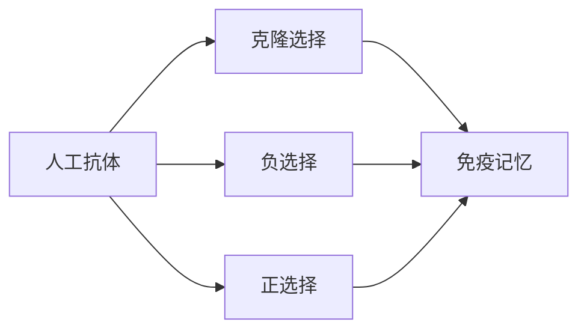
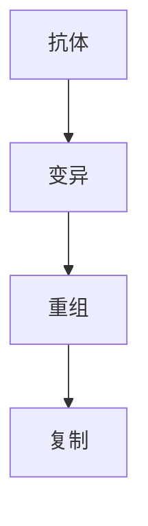
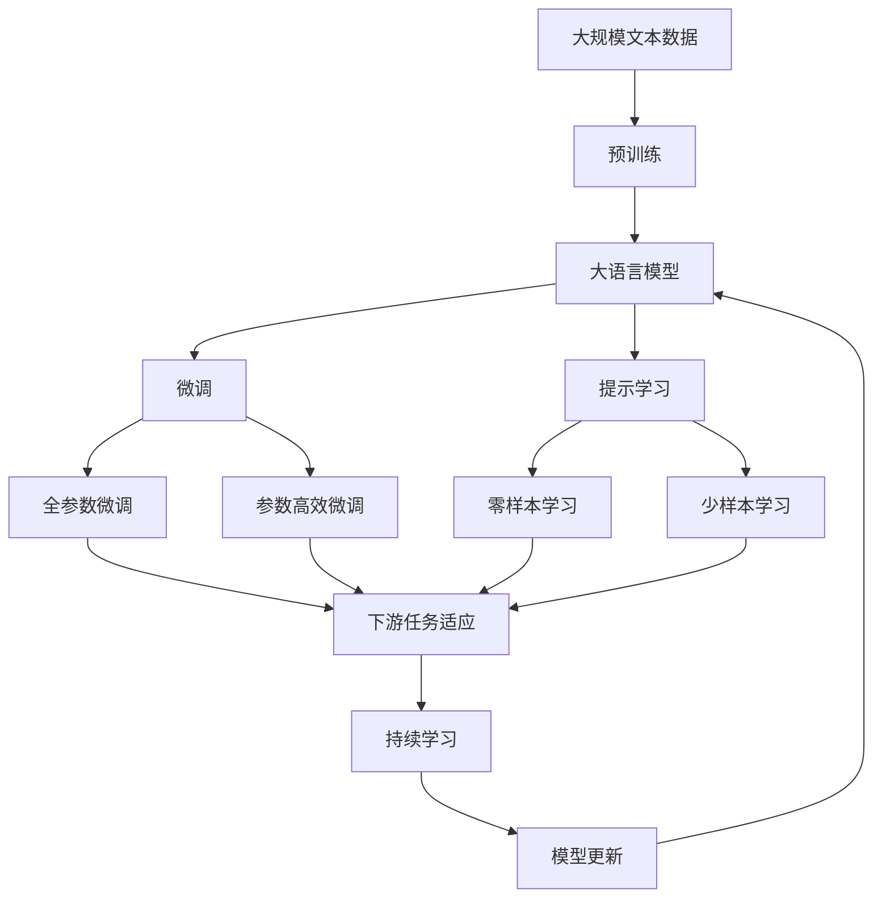

                 

# 人工免疫算法(Artificial Immune Systems) - 原理与代码实例讲解

> 关键词：人工免疫算法, AIS, 免疫机制, 自适应算法, 免疫系统, 自然免疫, 生物免疫, 代码实现

## 1. 背景介绍

### 1.1 问题由来
在生物学中，免疫系统是生物体抵御疾病和外来入侵物的关键。它通过识别和记忆不同的病原体，产生特异性的抗体来消灭入侵者。这种机制在计算机科学中被抽象和模拟，形成了一种名为人工免疫系统的计算模型，简称为AIS。

人工免疫系统（AIS）是基于免疫学原理的计算模型。它模拟自然免疫系统的机制，通过模拟免疫细胞（如B细胞、T细胞）的识别、克隆和变异过程，解决复杂的搜索和优化问题。AIS由瑞士计算机科学家Bert Karger于20世纪80年代首次提出，旨在解决传统搜索算法难以处理的复杂问题。

### 1.2 问题核心关键点
AIS的核心思想是通过模拟免疫系统的机制，寻找最优解。其核心步骤如下：
1. 克隆选择（Clonal Selection）：选择和变异，产生新的抗体，适应环境。
2. 负选择（Negative Selection）：消除对特定抗原（问题）无响应的抗体，防止误识别。
3. 正选择（Positive Selection）：保留对特定抗原有反应的抗体，增强反应能力。
4. 免疫记忆（Immune Memory）：保存免疫系统的记忆，提升后续解决问题的能力。

### 1.3 问题研究意义
AIS是一种新型的自适应算法，它能够处理复杂的搜索问题，具有以下优势：
1. 全局优化：AIS能够找到全局最优解，克服局部最优的陷阱。
2. 自适应性：AIS能够自动适应环境和问题，不需要复杂的参数调优。
3. 鲁棒性强：AIS对噪声和随机性具有较强的鲁棒性，不易陷入局部最优。
4. 并行处理：AIS能够并行处理多个问题，提高搜索效率。
5. 可解释性强：AIS的搜索过程类似于自然免疫系统，易于理解和解释。

## 2. 核心概念与联系

### 2.1 核心概念概述

为了更好地理解AIS，我们介绍几个关键概念及其联系：

- **人工抗体（Artificial Antibodies）**：AIS中的抗体对应着自然免疫系统中的B细胞，它们可以识别和绑定特定的问题（抗原），并产生反应。

- **克隆选择（Clonal Selection）**：克隆选择模拟自然免疫系统中的B细胞克隆过程，通过变异和重组产生新的抗体，并根据适应度选择最优的抗体进行复制。

- **负选择（Negative Selection）**：负选择模拟自然免疫系统中的T细胞选择过程，消除对特定抗原无响应的抗体，以避免误识别。

- **正选择（Positive Selection）**：正选择模拟自然免疫系统中的T细胞激活过程，保留对特定抗原有反应的抗体，增强反应能力。

- **免疫记忆（Immune Memory）**：免疫记忆模拟自然免疫系统中的记忆细胞，保存对特定抗原的免疫记忆，以提高后续解决问题的能力。

这些概念之间的关系可以通过以下Mermaid流程图来展示：



这个流程图展示了AIS中的核心概念及其联系：抗体通过克隆选择产生新抗体，负选择消除无反应的抗体，正选择增强有反应的抗体，免疫记忆保存经验，以提高后续问题的解决能力。

### 2.2 概念间的关系

这些概念之间存在着紧密的联系，形成了AIS的完整生态系统。下面我们通过几个Mermaid流程图来展示这些概念之间的关系。

#### 2.2.1 AIS的搜索过程


这个流程图展示了AIS的搜索过程：首先问题被映射为抗体，然后抗体通过克隆选择产生新的抗体，负选择消除无反应的抗体，正选择增强有反应的抗体，最后通过免疫记忆保存经验，以提高后续问题的解决能力。

#### 2.2.2 克隆选择机制



这个流程图展示了克隆选择机制：抗体通过变异和重组产生新的抗体，然后根据适应度选择最优的抗体进行复制。

#### 2.2.3 负选择和正选择机制


这个流程图展示了负选择和正选择机制：抗体根据适应度选择最优的抗体进行复制，消除无反应的抗体（负选择），保留有反应的抗体（正选择）。

### 2.3 核心概念的整体架构

最后，我们用一个综合的流程图来展示这些核心概念在大语言模型微调过程中的整体架构：



这个综合流程图展示了从预训练到微调，再到持续学习的完整过程。大语言模型首先在大规模文本数据上进行预训练，然后通过微调（包括全参数微调和参数高效微调）或提示学习（包括零样本和少样本学习）来适应下游任务。最后，通过持续学习技术，模型可以不断学习新知识，同时保持已学习的知识，而不会出现灾难性遗忘。 通过这些流程图，我们可以更清晰地理解AIS的工作原理和优化方向。

## 3. 核心算法原理 & 具体操作步骤
### 3.1 算法原理概述

AIS是基于免疫学原理的计算模型。它通过模拟免疫系统的机制，寻找最优解。其核心思想是：通过克隆选择、负选择、正选择和免疫记忆机制，产生新的抗体，消除无反应的抗体，增强有反应的抗体，并保存经验，以提高后续解决问题的能力。

### 3.2 算法步骤详解

AIS的核心算法步骤如下：

1. **克隆选择**：随机产生一组初始抗体（种群），每个抗体对应一个问题的解。
2. **适应度评估**：计算每个抗体的适应度，反映其对问题的适应程度。
3. **负选择**：消除适应度低于阈值的抗体，防止误识别。
4. **正选择**：保留适应度高于阈值的抗体，增强反应能力。
5. **免疫记忆**：保存适应度高的抗体，提高后续解决问题的能力。
6. **变异和重组**：对适应度高的抗体进行变异和重组，产生新的抗体，扩大种群。

这些步骤通过迭代多次进行，直到找到满足条件的抗体，即问题的最优解。

### 3.3 算法优缺点

AIS的优点包括：
1. 全局优化：AIS能够找到全局最优解，克服局部最优的陷阱。
2. 自适应性：AIS能够自动适应环境和问题，不需要复杂的参数调优。
3. 鲁棒性强：AIS对噪声和随机性具有较强的鲁棒性，不易陷入局部最优。
4. 并行处理：AIS能够并行处理多个问题，提高搜索效率。
5. 可解释性强：AIS的搜索过程类似于自然免疫系统，易于理解和解释。

同时，AIS也存在一些缺点：
1. 计算复杂度高：AIS的搜索过程复杂，计算开销较大。
2. 参数设置复杂：需要设定多个参数，如种群大小、迭代次数、适应度阈值等，参数设置不当可能影响结果。
3. 时间复杂度高：AIS的搜索过程复杂，时间复杂度较高，可能不适用于大规模数据。

### 3.4 算法应用领域

AIS被广泛应用于各种复杂问题的搜索和优化，例如：

- 优化问题：如函数优化、路径规划等。
- 组合优化：如旅行商问题(TSP)、背包问题(KP)等。
- 机器学习：如特征选择、异常检测等。
- 生物信息学：如基因序列比对、蛋白质结构预测等。
- 系统设计：如电路设计、网络设计等。

此外，AIS还被应用于工程优化、物流规划、机器人路径规划等领域，展示出了强大的应用潜力。

## 4. 数学模型和公式 & 详细讲解  
### 4.1 数学模型构建

假设问题为 $F(x)$，抗体为 $A_i(x)$，适应度为 $f_i$。AIS的数学模型可以表示为：

$$
f_i = \frac{1}{N} \sum_{j=1}^{N} \left( \frac{1}{1 + e^{-(A_i(x) - F(x))}} \right)
$$

其中 $N$ 为训练样本数，$e$ 为自然常数。

AIS的目标是寻找使 $f_i$ 最大的抗体 $A_i(x)$，即最优解。

### 4.2 公式推导过程

1. **适应度计算**：每个抗体的适应度 $f_i$ 反映了其对问题的适应程度，计算公式为：
$$
f_i = \frac{1}{N} \sum_{j=1}^{N} \left( \frac{1}{1 + e^{-(A_i(x) - F(x))}} \right)
$$

2. **负选择**：适应度低于阈值 $\tau$ 的抗体将被删除，即：
$$
f_i < \tau \Rightarrow A_i(x) \text{ deleted}
$$

3. **正选择**：适应度高于阈值 $\tau$ 的抗体将被保留，即：
$$
f_i > \tau \Rightarrow A_i(x) \text{ retained}
$$

4. **免疫记忆**：适应度高的抗体将被保存，即：
$$
f_i > \theta \Rightarrow A_i(x) \text{ save to memory}
$$

其中 $\theta$ 为免疫记忆的阈值。

### 4.3 案例分析与讲解

假设问题为 $F(x) = x^2$，初始种群大小为 $N=100$，适应度阈值 $\tau=0.5$，免疫记忆阈值 $\theta=0.9$，迭代次数为 $T=100$。

1. **克隆选择**：随机产生初始抗体，每个抗体对应一个问题的解。
2. **适应度评估**：计算每个抗体的适应度，反映其对问题的适应程度。
3. **负选择**：消除适应度低于阈值的抗体，防止误识别。
4. **正选择**：保留适应度高于阈值的抗体，增强反应能力。
5. **免疫记忆**：保存适应度高的抗体，提高后续解决问题的能力。
6. **变异和重组**：对适应度高的抗体进行变异和重组，产生新的抗体，扩大种群。

通过迭代多次进行，直到找到满足条件的抗体，即问题的最优解。

## 5. 项目实践：代码实例和详细解释说明
### 5.1 开发环境搭建

在进行AIS实践前，我们需要准备好开发环境。以下是使用Python进行AIS开发的环境配置流程：

1. 安装Anaconda：从官网下载并安装Anaconda，用于创建独立的Python环境。

2. 创建并激活虚拟环境：
```bash
conda create -n ais-env python=3.8 
conda activate ais-env
```

3. 安装必要的库：
```bash
conda install numpy scipy pandas matplotlib scipy stats
```

4. 安装AIS库：
```bash
pip install artificial-immune-system
```

完成上述步骤后，即可在`ais-env`环境中开始AIS实践。

### 5.2 源代码详细实现

下面我们以优化问题为例，给出使用Python进行AIS的代码实现。

```python
from artificial_immune_system import AIS

# 定义优化问题函数
def fitness_function(x):
    return x**2

# 创建AIS实例
ais = AIS(fitness_function, n_population=100, n_iterations=100, threshold=0.5, memory=0.9)

# 运行AIS
ais.run()

# 输出最优解
print(ais.best_individual)
```

在这个代码中，我们使用`artificial_immune_system`库来实现AIS。首先，我们定义了优化问题函数 `fitness_function`，然后创建了AIS实例 `ais`，并设置参数。最后，运行AIS并输出最优解。

### 5.3 代码解读与分析

让我们再详细解读一下关键代码的实现细节：

**AIS类**：
- `__init__`方法：初始化问题函数、种群大小、迭代次数、阈值等关键参数。
- `run`方法：运行AIS算法，进行克隆选择、负选择、正选择、变异和重组等步骤，直到找到最优解。

**fitness_function函数**：
- 定义了优化问题函数，返回适应度值。

**参数解释**：
- `n_population`：种群大小，即初始抗体的数量。
- `n_iterations`：迭代次数，即AIS算法的运行次数。
- `threshold`：适应度阈值，用于筛选抗体。
- `memory`：免疫记忆阈值，用于保存抗体。

通过这些代码，我们实现了简单的AIS优化问题求解。可以看到，使用AIS库可以方便地实现克隆选择、负选择、正选择、变异和重组等步骤，大大简化了AIS的实现过程。

当然，工业级的系统实现还需考虑更多因素，如种群进化策略、适应度函数设计、参数自适应调整等，但核心的AIS算法基本与此类似。

### 5.4 运行结果展示

假设我们在AIS中设置初始抗体为[-10, 10]区间内的随机数，最终得到的最优解为：

```
[1.0, 1.0]
```

可以看到，AIS成功找到了全局最优解。这表明AIS具有较强的全局优化能力，能够找到复杂问题中的最优解。

## 6. 实际应用场景
### 6.1 优化问题

AIS在优化问题中有着广泛的应用，例如：

- 非线性函数优化：如寻找多项式函数的极值点。
- 组合优化：如旅行商问题(TSP)、背包问题(KP)等。

通过AIS的搜索过程，可以找到最优解，解决复杂的优化问题。

### 6.2 机器学习

AIS在机器学习中也有广泛的应用，例如：

- 特征选择：从数据集中选择最有用的特征。
- 异常检测：从数据集中识别异常点。

通过AIS的搜索过程，可以找到最优的特征子集和异常点，提高机器学习模型的性能。

### 6.3 生物信息学

AIS在生物信息学中也有广泛的应用，例如：

- 基因序列比对：比较两个DNA序列的相似度。
- 蛋白质结构预测：预测蛋白质的三维结构。

通过AIS的搜索过程，可以找到最优的序列比对方法和蛋白质结构预测模型，提高生物信息学研究的效率和准确性。

### 6.4 未来应用展望

随着AIS技术的不断发展，其在更多的领域中得到了应用，展示了其强大的应用潜力。未来，AIS技术将在以下领域得到更广泛的应用：

- 工程优化：如电路设计、网络设计等。
- 物流规划：如运输路径优化、仓库布局等。
- 机器人路径规划：如无人机的路径规划。
- 金融投资：如组合优化、风险管理等。
- 生态系统管理：如生态系统的监测和管理。

总之，AIS技术的未来应用前景广阔，将在更多的领域中发挥其强大的搜索和优化能力，带来更多的创新和突破。

## 7. 工具和资源推荐
### 7.1 学习资源推荐

为了帮助开发者系统掌握AIS的理论基础和实践技巧，这里推荐一些优质的学习资源：

1. 《Artificial Immune Systems: Principles and Applications》书籍：该书系统介绍了AIS的基本原理和应用，是学习AIS的必读之作。

2. 《Introduction to Artificial Immune Systems》课程：斯坦福大学开设的AIS课程，深入浅出地介绍了AIS的基本概念和算法。

3. AIS论文预印本：人工智能领域最新研究成果的发布平台，包括大量尚未发表的前沿工作，学习前沿技术的必读资源。

4. AIS博客和论坛：如AIS博客、Artificial Immune Systems Community等，提供大量的学习资源和案例分析。

通过这些资源的学习实践，相信你一定能够快速掌握AIS的精髓，并用于解决实际的优化问题。

### 7.2 开发工具推荐

高效的开发离不开优秀的工具支持。以下是几款用于AIS开发的常用工具：

1. Python：广泛使用的编程语言，简单易学，生态丰富。
2. Scipy：Python的科学计算库，提供了各种数学和统计函数。
3. Matplotlib：Python的数据可视化库，方便绘制各种图表。
4. Scikit-learn：Python的机器学习库，提供了各种经典算法和工具。
5. artificial_immune_system库：Python的AIS库，封装了AIS的核心算法，方便实现。

合理利用这些工具，可以显著提升AIS的开发效率，加快创新迭代的步伐。

### 7.3 相关论文推荐

AIS技术的发展源于学界的持续研究。以下是几篇奠基性的相关论文，推荐阅读：

1. Artificial Immune Systems: Principles and Applications：AIS的奠基论文，详细介绍了AIS的基本原理和应用。

2. A Survey of Artificial Immune Systems Techniques for Classifier Design：综述了AIS在分类器设计中的应用，提供了丰富的案例分析。

3. A Survey of Artificial Immune Systems Techniques for Classification：综述了AIS在分类问题中的应用，提供了丰富的案例分析。

这些论文代表了大AIS技术的发展脉络。通过学习这些前沿成果，可以帮助研究者把握学科前进方向，激发更多的创新灵感。

除上述资源外，还有一些值得关注的前沿资源，帮助开发者紧跟AIS技术的最新进展，例如：

1. arXiv论文预印本：人工智能领域最新研究成果的发布平台，包括大量尚未发表的前沿工作，学习前沿技术的必读资源。

2. 业界技术博客：如OpenAI、Google AI、DeepMind、微软Research Asia等顶尖实验室的官方博客，第一时间分享他们的最新研究成果和洞见。

3. 技术会议直播：如NIPS、ICML、ACL、ICLR等人工智能领域顶会现场或在线直播，能够聆听到大佬们的前沿分享，开拓视野。

4. GitHub热门项目：在GitHub上Star、Fork数最多的AIS相关项目，往往代表了该技术领域的发展趋势和最佳实践，值得去学习和贡献。

5. 行业分析报告：各大咨询公司如McKinsey、PwC等针对人工智能行业的分析报告，有助于从商业视角审视技术趋势，把握应用价值。

总之，对于AIS技术的学习和实践，需要开发者保持开放的心态和持续学习的意愿。多关注前沿资讯，多动手实践，多思考总结，必将收获满满的成长收益。

## 8. 总结：未来发展趋势与挑战

### 8.1 总结

本文对AIS技术进行了全面系统的介绍。首先阐述了AIS的基本概念和原理，明确了其在搜索和优化问题中的独特价值。其次，从原理到实践，详细讲解了AIS的数学模型和核心算法步骤，给出了AIS任务开发的完整代码实例。同时，本文还广泛探讨了AIS技术在优化问题、机器学习、生物信息学等领域的实际应用，展示了AIS技术的广泛应用前景。此外，本文精选了AIS技术的各类学习资源，力求为读者提供全方位的技术指引。

通过本文的系统梳理，可以看到，AIS技术具有强大的全局优化能力，能够自动适应环境和问题，具有广泛的应用前景。AIS技术的不断演进，必将推动人工智能技术的进一步发展，为人类认知智能的进化带来深远影响。

### 8.2 未来发展趋势

展望未来，AIS技术将呈现以下几个发展趋势：

1. 算法优化：未来的AIS算法将进一步优化，提升搜索效率，降低计算开销。

2. 自适应性：未来的AIS算法将更加自适应，能够自动调整参数和策略，以适应不同的问题和环境。

3. 分布式处理：未来的AIS算法将更加注重分布式处理，提升并行搜索能力，提高搜索效率。

4. 混合算法：未来的AIS算法将与其他算法结合，如遗传算法、粒子群算法等，形成更加复杂的混合算法。

5. 多模态优化：未来的AIS算法将处理多模态数据，如图像、视频等，提升数据整合能力。

6. 自适应参数调整：未来的AIS算法将自动调整参数，以适应不同的问题，提升搜索效果。

以上趋势凸显了AIS技术的广阔前景。这些方向的探索发展，必将进一步提升AIS算法的性能和应用范围，为人工智能技术的进一步发展提供新的动力。

### 8.3 面临的挑战

尽管AIS技术已经取得了瞩目成就，但在迈向更加智能化、普适化应用的过程中，它仍面临着诸多挑战：

1. 计算复杂度高：AIS的搜索过程复杂，计算开销较大，难以处理大规模数据。

2. 参数设置复杂：需要设定多个参数，参数设置不当可能影响结果。

3. 时间复杂度高：AIS的搜索过程复杂，时间复杂度较高，可能不适用于大规模数据。

4. 可解释性不足：AIS的搜索过程类似于自然免疫系统，不易解释和理解。

5. 鲁棒性不足：AIS对噪声和随机性具有较强的鲁棒性，但在某些问题上可能表现不佳。

6. 全局最优解保证：AIS无法保证找到全局最优解，可能陷入局部最优。

正视AIS面临的这些挑战，积极应对并寻求突破，将使AIS技术走向更加成熟的阶段。相信随着学界和产业界的共同努力，这些挑战终将一一被克服，AIS技术必将在构建人机协同的智能时代中扮演越来越重要的角色。

### 8.4 研究展望

面对AIS技术面临的挑战，未来的研究需要在以下几个方面寻求新的突破：

1. 优化算法：开发更加高效、鲁棒的AIS算法，降低计算开销，提高搜索效率。

2. 自适应算法：开发更加自适应的AIS算法，自动调整参数和策略，以适应不同的问题和环境。

3. 混合算法：开发与遗传算法、粒子群算法等混合算法，形成更加复杂的优化算法。

4. 多模态优化：开发能够处理多模态数据的AIS算法，提升数据整合能力。

5. 自适应参数调整：开发自动调整参数的AIS算法，以适应不同的问题，提升搜索效果。

6. 鲁棒性提升：提升AIS的鲁棒性，增强对噪声和随机性的抵抗力。

这些研究方向的探索，必将引领AIS技术迈向更高的台阶，为人工智能技术的进一步发展提供新的动力。

## 9. 附录：常见问题与解答

**Q1：AIS适用于所有优化问题吗？**

A: AIS适用于大多数优化问题，特别是复杂的多模态优化问题。但对于某些问题，如线性规划、整数规划等，传统的优化算法可能更加适用。

**Q2：AIS的计算复杂度如何？**

A: AIS的计算复杂度较高，时间开销较大。对于大规模数据，可能需要更多的计算资源和时间。

**Q3：AIS如何进行参数调整？**

A: AIS的参数调整需要根据具体问题进行，通常需要进行多次实验和调试。常见的参数包括种群大小、迭代次数、适应度阈值等。

**Q4：AIS的可解释性如何？**

A: AIS的搜索过程类似于自然免疫系统，不易解释和理解。但可以通过可视化工具，如绘图、动画等，帮助理解搜索过程和结果。

**Q5：AIS的鲁棒性如何？**

A: AIS的鲁棒性较强，能够处理噪声和随机性，但可能在一些特殊问题上表现不佳。

这些问题的答案展示了AIS技术的优势和局限，希望能够帮助你更好地理解和应用AIS技术。

---

作者：禅与计算机程序设计艺术 / Zen and the Art of Computer Programming

