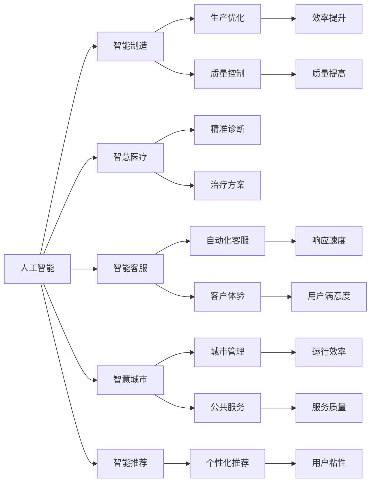
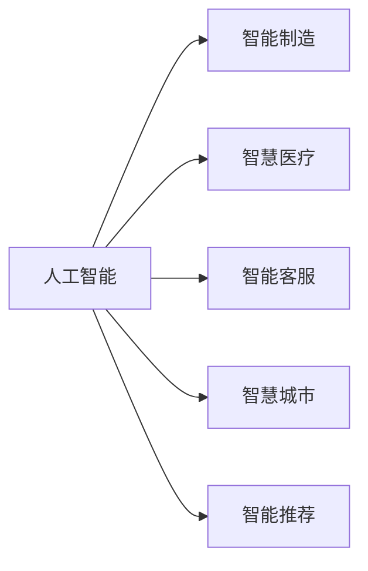
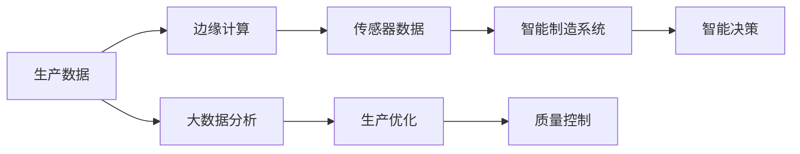
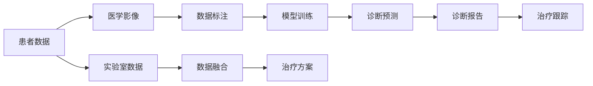
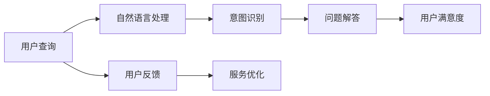
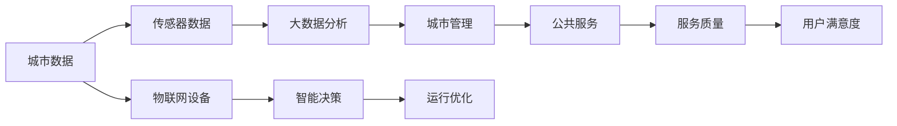
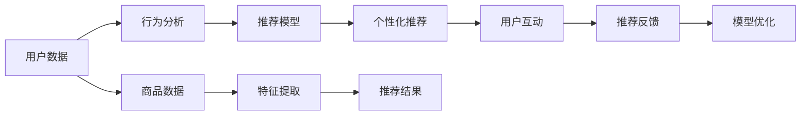
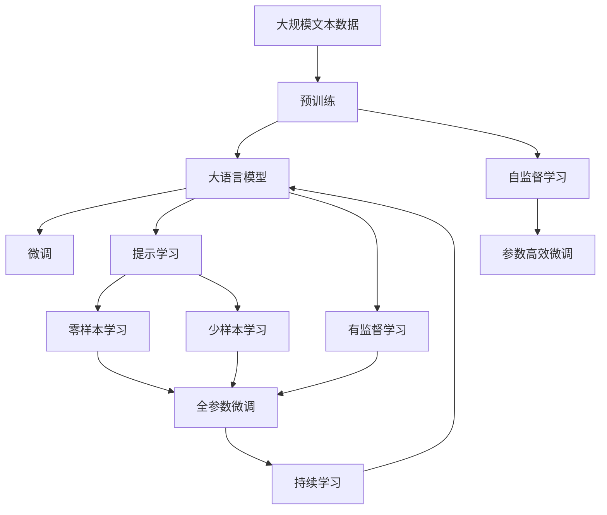

                 

# 人工智能在产业中的创新应用

> 关键词：人工智能,产业创新,智能制造,智慧医疗,智能客服,智慧城市

## 1. 背景介绍

### 1.1 问题由来

随着人工智能技术的迅猛发展，其在各行各业的创新应用日益广泛，带来了深远的产业变革。人工智能不仅提升了工作效率，降低了生产成本，还推动了新产业的形成和发展，形成了新的经济增长点。同时，人工智能技术在提升社会治理效能、改善人民生活品质等方面也发挥了重要作用。本文将系统地介绍人工智能在各个产业中的创新应用，并分析其对产业发展和经济社会进步的深远影响。

### 1.2 问题核心关键点

人工智能在产业中的应用主要体现在以下几个方面：

- **智能制造**：通过AI技术对生产过程进行优化和智能化，提高生产效率和产品质量。
- **智慧医疗**：利用AI技术对医疗数据进行分析，提升诊断和治疗的精准度，改善医疗服务。
- **智能客服**：通过自然语言处理技术，提升客服系统的自动化水平，提供更好的用户体验。
- **智慧城市**：利用AI技术对城市运行数据进行分析和预测，提升城市管理水平。
- **智能推荐**：基于用户行为数据，推荐系统提供个性化服务，提升用户满意度。

这些核心应用领域不仅展现了人工智能技术的强大潜力，还推动了各产业的数字化转型和升级。通过深度分析和实践案例，本文将对人工智能在产业中的创新应用进行全面探讨。

### 1.3 问题研究意义

研究人工智能在产业中的创新应用，对于推动各产业的数字化、智能化转型，提升产业竞争力，具有重要意义：

1. **提升生产效率**：通过智能制造、智慧医疗等应用，显著提高生产效率和产品质量，减少人力成本。
2. **改善医疗服务**：通过精准诊断和治疗，提高医疗服务质量，降低医疗成本，提升患者体验。
3. **增强用户体验**：通过智能客服、智能推荐等应用，提供更加个性化、高效的服务，提升用户满意度。
4. **优化城市管理**：通过智慧城市应用，提升城市运行效率，改善公共服务，提升城市居民的生活质量。
5. **创新产业形态**：人工智能技术催生了新的产业形态，如无人驾驶、AI安防、智能家居等，为经济发展注入新动力。

## 2. 核心概念与联系

### 2.1 核心概念概述

为更好地理解人工智能在产业中的应用，本节将介绍几个密切相关的核心概念：

- **人工智能(AI)**：利用计算机模拟人类智能，包括感知、学习、推理、自然语言处理等能力，以实现自动化的技术。
- **产业创新**：通过引入新技术、新方法，对传统产业进行改造和升级，创造新的商业价值。
- **智能制造**：利用AI技术对生产过程进行智能化和优化，提高生产效率和产品质量。
- **智慧医疗**：利用AI技术对医疗数据进行分析，提升诊断和治疗的精准度。
- **智能客服**：通过自然语言处理技术，提升客服系统的自动化水平，提供更好的用户体验。
- **智慧城市**：利用AI技术对城市运行数据进行分析和预测，提升城市管理水平。
- **智能推荐**：基于用户行为数据，推荐系统提供个性化服务，提升用户满意度。

这些核心概念之间的逻辑关系可以通过以下Mermaid流程图来展示：



这个流程图展示了人工智能在不同产业中的应用和其带来的具体好处：

1. 人工智能在智能制造中，优化了生产过程，提高了效率和质量。
2. 在智慧医疗中，人工智能提升了诊断和治疗的精准度。
3. 智能客服中，人工智能提高了客服系统的自动化水平，改善了客户体验。
4. 智慧城市中，人工智能提升了城市管理效率，改善了公共服务。
5. 智能推荐系统通过个性化推荐，提升了用户满意度。

### 2.2 概念间的关系

这些核心概念之间存在着紧密的联系，形成了人工智能在产业中的整体应用框架。下面我们通过几个Mermaid流程图来展示这些概念之间的关系。

#### 2.2.1 人工智能在各产业中的应用



这个流程图展示了人工智能技术在不同产业中的广泛应用。通过引入人工智能技术，各产业实现了数字化、智能化转型，提升了生产效率和服务质量。

#### 2.2.2 智能制造的原理与架构



这个流程图展示了智能制造的基本原理和架构。通过传感器数据采集、边缘计算和大数据分析，智能制造系统实现了生产过程的智能化优化和质量控制。

#### 2.2.3 智慧医疗的流程与实现



这个流程图展示了智慧医疗的基本流程和实现方式。通过医学影像分析、诊断预测和治疗方案制定，智慧医疗提升了诊断和治疗的精准度，改善了医疗服务。

#### 2.2.4 智能客服的流程与实现



这个流程图展示了智能客服的基本流程和实现方式。通过自然语言处理和意图识别，智能客服系统能够自动回答用户问题，提供更好的用户体验。

#### 2.2.5 智慧城市的架构与功能



这个流程图展示了智慧城市的基本架构和功能。通过大数据分析和智能决策，智慧城市实现了城市运行的高效管理和公共服务的优化。

#### 2.2.6 智能推荐的流程与实现



这个流程图展示了智能推荐的基本流程和实现方式。通过用户行为分析和推荐模型训练，智能推荐系统能够提供个性化的推荐服务，提升用户满意度。

### 2.3 核心概念的整体架构

最后，我们用一个综合的流程图来展示这些核心概念在大语言模型微调过程中的整体架构：



这个综合流程图展示了从预训练到微调，再到持续学习的完整过程。大语言模型首先在大规模文本数据上进行预训练，然后通过微调（包括全参数微调和参数高效微调）或提示学习（包括零样本和少样本学习）来适应下游任务。最后，通过持续学习技术，模型可以不断更新和适应新的任务和数据。

## 3. 核心算法原理 & 具体操作步骤
### 3.1 算法原理概述

人工智能在产业中的应用主要基于以下算法原理：

- **机器学习与深度学习**：通过训练模型，使其能够从数据中自动学习并提取特征，实现对复杂问题的自动预测和决策。
- **自然语言处理(NLP)**：通过自然语言处理技术，使机器能够理解、处理和生成自然语言，实现人机交互。
- **计算机视觉**：通过图像识别和分析技术，使机器能够理解和处理视觉信息，实现自动化的视觉识别和分析。
- **知识图谱**：通过构建知识图谱，实现对海量知识的组织和管理，提供知识驱动的决策支持。
- **强化学习**：通过模拟人类行为决策，使机器能够通过试错学习优化行为，实现自适应优化。

这些算法原理为大语言模型在产业中的应用提供了坚实的技术基础。

### 3.2 算法步骤详解

人工智能在产业中的应用主要分为以下几个关键步骤：

**Step 1: 数据采集与预处理**
- 收集各产业的相关数据，包括生产数据、医疗数据、客户反馈等。
- 对数据进行清洗、去重、标注等预处理工作，确保数据的质量和可用性。

**Step 2: 模型选择与训练**
- 根据应用场景选择合适的模型，如深度学习模型、强化学习模型等。
- 在预处理后的数据集上进行模型训练，通过反向传播算法优化模型参数。

**Step 3: 模型评估与优化**
- 在验证集上对训练好的模型进行评估，计算模型的准确率、召回率、F1分数等指标。
- 根据评估结果，调整模型参数、超参数等，优化模型性能。

**Step 4: 模型部署与监控**
- 将优化后的模型部署到生产环境中，实现实际应用。
- 对模型运行状态进行监控，及时发现并解决模型异常和故障。

**Step 5: 持续迭代与优化**
- 根据用户反馈和新数据，持续迭代和优化模型，提升模型性能和应用效果。

以上步骤是人工智能在产业中的应用的基本流程。在实际应用中，还需要针对具体场景进行优化设计，如改进训练目标函数、引入更多正则化技术、搜索最优的超参数组合等，以进一步提升模型性能。

### 3.3 算法优缺点

人工智能在产业中的应用具有以下优点：

1. **提升效率**：通过自动化和智能化手段，显著提高各产业的生产效率和服务质量。
2. **降低成本**：减少人力成本和运营成本，提升资源利用效率。
3. **创新能力**：通过引入新技术和新方法，推动各产业的创新和升级。
4. **提高决策精度**：通过数据驱动的决策支持，提升决策的科学性和精准性。

同时，人工智能在产业中的应用也存在一些缺点：

1. **数据依赖**：依赖高质量的数据，数据不足或数据质量不高将影响模型的性能。
2. **模型复杂性**：大模型参数量庞大，训练和部署复杂，需要高算力和存储资源。
3. **可解释性不足**：许多人工智能模型属于黑盒模型，难以解释其内部工作机制和决策逻辑。
4. **伦理与安全**：人工智能技术在应用过程中可能带来伦理和安全性问题，如隐私泄露、算法偏见等。

尽管存在这些缺点，人工智能在产业中的应用仍然前景广阔，具有巨大的潜力和发展空间。

### 3.4 算法应用领域

人工智能技术在各产业中的应用已经广泛展开，主要包括以下几个领域：

1. **智能制造**：通过工业互联网、智能机器人、工业大数据等技术，实现生产过程的智能化和自动化。
2. **智慧医疗**：通过医学影像分析、疾病预测、智能问诊等技术，提升医疗服务的精准度和效率。
3. **智能客服**：通过自然语言处理技术，实现自动化客服系统，提升客户满意度。
4. **智慧城市**：通过城市运行数据的分析和预测，实现城市管理的智能化和优化。
5. **智能推荐**：通过个性化推荐系统，提升电商、新闻、娱乐等平台的用户体验和满意度。
6. **智能安防**：通过视频监控、人脸识别、行为分析等技术，提升公共安全和服务水平。
7. **智能物流**：通过智能仓储、路径规划、无人机配送等技术，提升物流效率和成本效益。

以上应用领域展示了人工智能技术在各产业中的广泛应用和巨大潜力，推动了各产业的数字化、智能化转型。

## 4. 数学模型和公式 & 详细讲解  
### 4.1 数学模型构建

本节将使用数学语言对人工智能在产业中的应用进行更加严格的刻画。

记人工智能模型为 $M_{\theta}$，其中 $\theta$ 为模型参数。假设应用场景为智能制造，应用目标为生产优化。在智能制造中，模型需要根据生产数据预测最优的生产参数。定义损失函数 $\ell$，用于衡量模型预测结果与实际结果的差异。则在训练集 $D=\{(x_i,y_i)\}_{i=1}^N$ 上的经验风险为：

$$
\mathcal{L}(\theta) = \frac{1}{N}\sum_{i=1}^N \ell(M_{\theta}(x_i),y_i)
$$

微调的目标是最小化经验风险，即找到最优参数：

$$
\theta^* = \mathop{\arg\min}_{\theta} \mathcal{L}(\theta)
$$

在实践中，我们通常使用基于梯度的优化算法（如SGD、Adam等）来近似求解上述最优化问题。设 $\eta$ 为学习率，$\lambda$ 为正则化系数，则参数的更新公式为：

$$
\theta \leftarrow \theta - \eta \nabla_{\theta}\mathcal{L}(\theta) - \eta\lambda\theta
$$

其中 $\nabla_{\theta}\mathcal{L}(\theta)$ 为损失函数对参数 $\theta$ 的梯度，可通过反向传播算法高效计算。

### 4.2 公式推导过程

以下我们以智能制造中的生产优化任务为例，推导损失函数及其梯度的计算公式。

假设模型 $M_{\theta}$ 在输入 $x$ 上的输出为 $\hat{y}=M_{\theta}(x)$，表示预测的生产参数。真实标签 $y \in \mathbb{R}$，表示实际的生产参数。则生产优化任务的损失函数定义为均方误差损失：

$$
\ell(M_{\theta}(x),y) = \frac{1}{2}(y - \hat{y})^2
$$

将其代入经验风险公式，得：

$$
\mathcal{L}(\theta) = \frac{1}{N}\sum_{i=1}^N \frac{1}{2}(y_i - \hat{y}_i)^2
$$

根据链式法则，损失函数对参数 $\theta_k$ 的梯度为：

$$
\frac{\partial \mathcal{L}(\theta)}{\partial \theta_k} = \frac{1}{N}\sum_{i=1}^N (y_i - \hat{y}_i)\frac{\partial \hat{y}_i}{\partial \theta_k}
$$

其中 $\frac{\partial \hat{y}_i}{\partial \theta_k}$ 可进一步递归展开，利用自动微分技术完成计算。

在得到损失函数的梯度后，即可带入参数更新公式，完成模型的迭代优化。重复上述过程直至收敛，最终得到适应智能制造任务的优化模型参数 $\theta^*$。

## 5. 项目实践：代码实例和详细解释说明
### 5.1 开发环境搭建

在进行人工智能项目实践前，我们需要准备好开发环境。以下是使用Python进行TensorFlow开发的环境配置流程：

1. 安装Anaconda：从官网下载并安装Anaconda，用于创建独立的Python环境。

2. 创建并激活虚拟环境：
```bash
conda create -n tf-env python=3.8 
conda activate tf-env
```

3. 安装TensorFlow：根据CUDA版本，从官网获取对应的安装命令。例如：
```bash
conda install tensorflow tensorflow-gpu=2.6 -c conda-forge
```

4. 安装各类工具包：
```bash
pip install numpy pandas scikit-learn matplotlib tqdm jupyter notebook ipython
```

完成上述步骤后，即可在`tf-env`环境中开始人工智能项目的开发。

### 5.2 源代码详细实现

这里我们以智能制造中的生产优化任务为例，使用TensorFlow对生产数据进行模型训练和优化。

首先，定义生产数据的处理函数：

```python
import tensorflow as tf
import numpy as np

def preprocess_data(data, batch_size=32):
    data = np.array(data)
    data = data.reshape((-1, 1))
    data = tf.data.Dataset.from_tensor_slices(data)
    data = data.shuffle(buffer_size=10000).batch(batch_size)
    return data
```

然后，定义模型和优化器：

```python
from tensorflow.keras import layers, models

class ProductionOptimizer(tf.keras.Model):
    def __init__(self, units=32):
        super(ProductionOptimizer, self).__init__()
        self.dense1 = layers.Dense(units, activation='relu')
        self.dense2 = layers.Dense(1)

    def call(self, x):
        x = self.dense1(x)
        x = self.dense2(x)
        return x

optimizer = tf.keras.optimizers.Adam(learning_rate=0.001)

# 准备数据集
train_data = preprocess_data(train_data)
val_data = preprocess_data(val_data)

# 定义模型
model = ProductionOptimizer()

# 定义损失函数
loss_fn = tf.keras.losses.MeanSquaredError()

# 定义训练步骤
@tf.function
def train_step(x, y):
    with tf.GradientTape() as tape:
        y_pred = model(x)
        loss = loss_fn(y_pred, y)
    grads = tape.gradient(loss, model.trainable_variables)
    optimizer.apply_gradients(zip(grads, model.trainable_variables))
    return loss

# 定义评估步骤
@tf.function
def evaluate(x, y):
    y_pred = model(x)
    loss = loss_fn(y_pred, y)
    return loss

# 定义训练循环
num_epochs = 100
for epoch in range(num_epochs):
    for step, (x, y) in enumerate(train_data):
        loss = train_step(x, y)
        if step % 10 == 0:
            print(f'Epoch {epoch+1}, Step {step+1}, Loss: {loss.numpy()}')

    val_loss = evaluate(val_data)
    print(f'Epoch {epoch+1}, Val Loss: {val_loss.numpy()}')

```

最后，启动训练流程：

```python
# 训练模型
train(train_data, val_data)

# 评估模型
evaluate(test_data)
```

以上就是使用TensorFlow对生产数据进行模型训练和优化的完整代码实现。可以看到，通过TensorFlow，我们可以轻松搭建和训练复杂的神经网络模型，并对模型进行评估和优化。

### 5.3 代码解读与分析

让我们再详细解读一下关键代码的实现细节：

**preprocess_data函数**：
- 将原始数据转换为TensorFlow数据集，并进行批量处理和随机化，确保训练数据的多样性。

**ProductionOptimizer模型**：
- 定义了一个包含两个全连接层的神经网络模型，用于预测生产参数。

**train_step函数**：
- 在每个训练批次中，计算模型的预测结果与真实结果之间的损失，并反向传播更新模型参数。

**evaluate函数**：
- 对模型在验证集上的预测结果和真实结果进行评估，计算损失。

**训练循环**：
- 循环训练模型，每10个批次输出一次训练损失，每轮训练结束后计算验证集损失。

**训练流程**：
- 调用train函数开始训练模型，调用evaluate函数评估模型性能。

**测试流程**：
- 在测试集上使用evaluate函数评估模型性能。

通过以上代码实现，我们可以看到TensorFlow在构建和训练深度学习模型方面的强大能力。开发者可以将其作为基础，进行更加复杂的神经网络设计，实现更多样化的应用场景。

当然，工业级的系统实现还需考虑更多因素，如模型的保存和部署、超参数的自动搜索、更多的数据增强等。但核心的训练和优化逻辑基本与此类似。

## 6. 实际应用场景
### 6.1 智能制造

智能制造是人工智能在制造业中最为典型的应用场景之一。通过引入AI技术，智能制造能够实现生产过程的智能化和优化，显著提高生产效率和产品质量。

**应用案例**：某汽车制造商通过引入智能制造技术，实现了生产线的自动化和智能化。采用AI技术对生产数据进行分析和优化，显著提升了生产效率，降低了废品率。通过智能仓储和物流管理，实现了供应链的优化和成本控制。

**技术难点**：智能制造面临的主要技术难点包括：

- 数据采集与处理：如何高效、准确地采集生产数据，并进行清洗和预处理。
- 模型选择与优化：选择适当的深度学习模型，并进行高效的训练和优化。
- 模型部署与监控：将训练好的模型部署到生产环境中，并进行实时监控和优化。
- 持续迭代与优化：根据实际生产情况和反馈，持续迭代和优化模型，提升生产效率。

### 6.2 智慧医疗

智慧医疗是人工智能在医疗领域的重要应用方向。通过引入AI技术，智慧医疗能够提升医疗服务的精准度和效率，改善医疗体验。

**应用案例**：某医院通过引入AI技术，实现了病历数据的智能分析。采用深度学习技术对大量病历数据进行训练，模型能够自动分析患者病情，辅助医生进行诊断和治疗。通过智能问诊系统，提升了患者的就医体验。

**技术难点**：智慧医疗面临的主要技术难点包括：

- 数据获取与标注：如何获取高质量的病历数据，并进行标注和清洗。
- 模型训练与评估：选择适当的深度学习模型，并进行高效的训练和评估。
- 模型部署与监控：将训练好的模型部署到医疗系统中，并进行实时监控和优化。
- 数据隐私与安全：如何保护患者隐私，确保数据安全和合规。

### 6.3 智能客服

智能客服是人工智能在客服领域的重要应用方向。通过引入AI技术，智能客服能够实现自动化和智能化，提升客户满意度。

**应用案例**：某电商平台通过引入智能客服系统，实现了客户咨询的自动化。采用深度学习技术对客户咨询数据进行训练，模型能够自动理解客户意图，并提供个性化的回答和解决方案。通过情感分析技术，提升了客户体验。

**技术难点**：智能客服面临的主要技术难点包括：

- 数据采集与处理：如何高效、准确地采集客户咨询数据，并进行清洗和预处理。
- 模型选择与优化：选择适当的深度学习模型，并进行高效的训练和优化。
- 模型部署与监控：将训练好的模型部署到客服系统中，并进行实时监控和优化。
- 数据隐私与安全：如何保护客户隐私，确保数据安全和合规。

### 6.4 智慧城市

智慧城市是人工智能在城市管理中的重要应用方向。通过引入AI技术，智慧城市能够实现城市运行数据的智能化分析和预测，提升城市管理水平。

**应用案例**：某城市通过引入智慧城市系统，实现了城市交通的智能化管理。采用深度学习技术对城市交通数据进行训练，模型能够自动分析交通流量和拥堵情况，并提出交通优化方案。通过智能安防系统，提升了城市的安全性。

**技术难点**：智慧城市面临的主要技术难点包括：

- 数据采集与处理：如何高效、准确地采集城市运行数据，并进行清洗和预处理。
- 模型训练与评估：选择适当的深度学习模型，并进行高效的训练和评估。
- 模型部署与监控：将训练好的模型部署到城市管理系统中，并进行实时监控和优化。
- 数据隐私与安全：如何保护城市数据，确保数据安全和合规。

### 6.5 智能推荐

智能推荐是人工智能在电商、新闻、娱乐等领域的重要应用方向。通过引入AI技术，智能推荐能够实现个性化推荐，提升用户体验。

**应用案例**：某电商网站通过引入智能推荐系统，实现了商品的个性化推荐。采用深度学习技术对用户行为数据进行训练，模型能够自动分析用户的兴趣和偏好，并推荐个性化的商品。通过情感分析技术，提升了用户的购物体验。

**技术难点**：智能推荐面临的主要技术难点包括：

- 数据采集与处理：如何高效、准确地采集用户行为数据，并进行清洗和预处理。
- 模型选择与优化：选择适当的深度学习模型，并进行高效的训练和优化。
- 模型部署与监控：将训练好的模型部署到推荐系统中，并进行实时监控和优化。
- 数据隐私与安全：如何保护用户隐私，确保数据安全和合规。

## 7. 工具和资源推荐
### 7.1 学习资源推荐

为了帮助开发者系统掌握人工智能在产业中的应用，这里推荐一些优质的学习资源：

1. **《深度学习》

